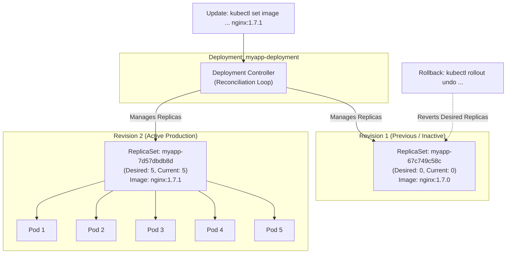
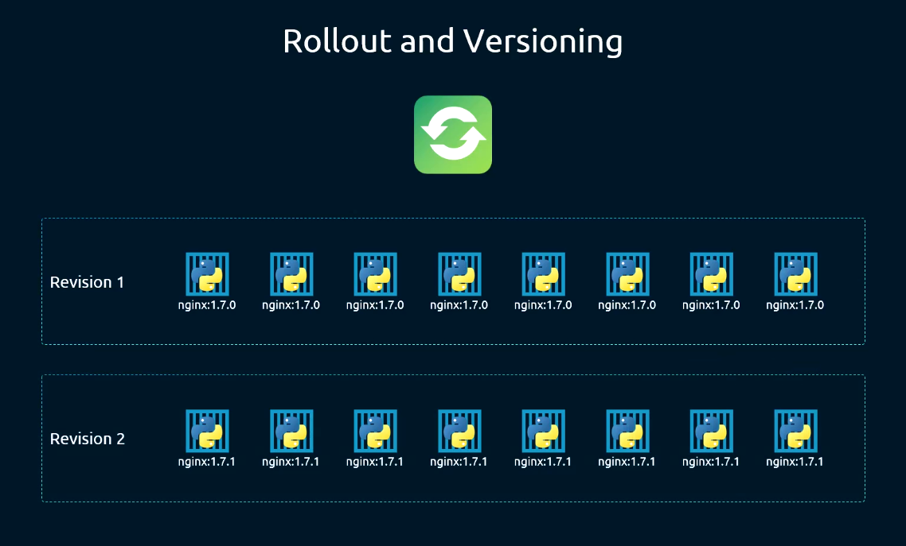
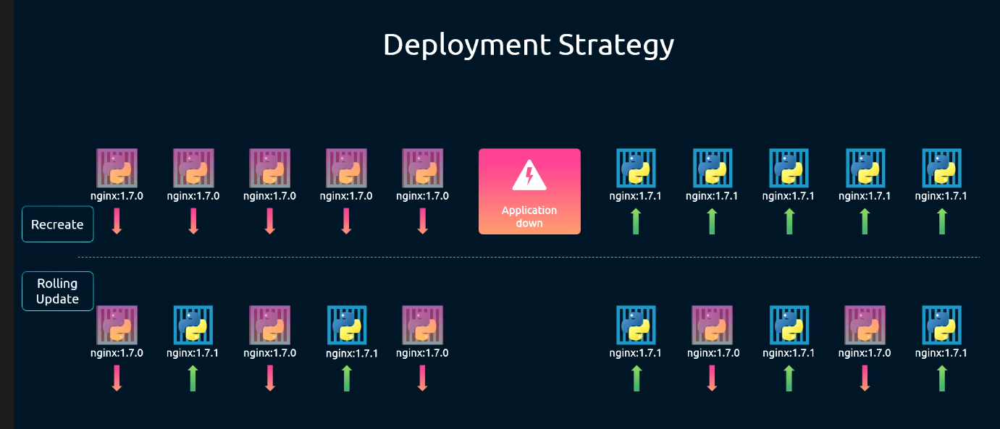
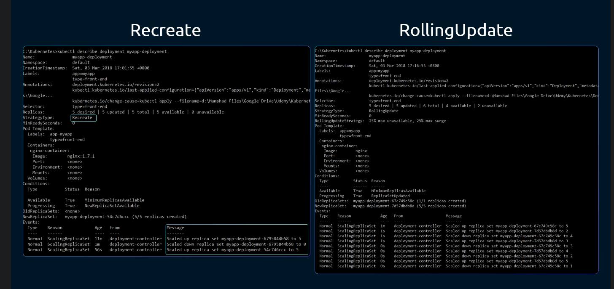
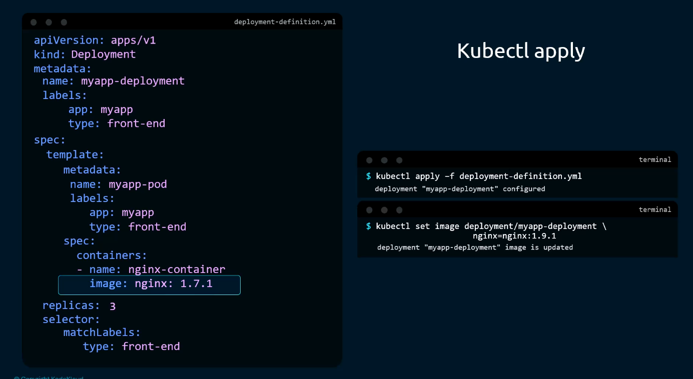
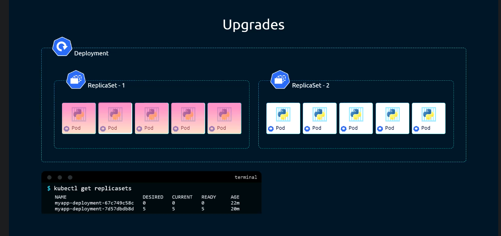
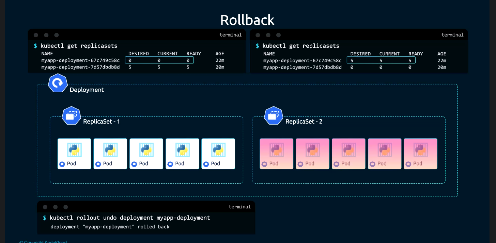
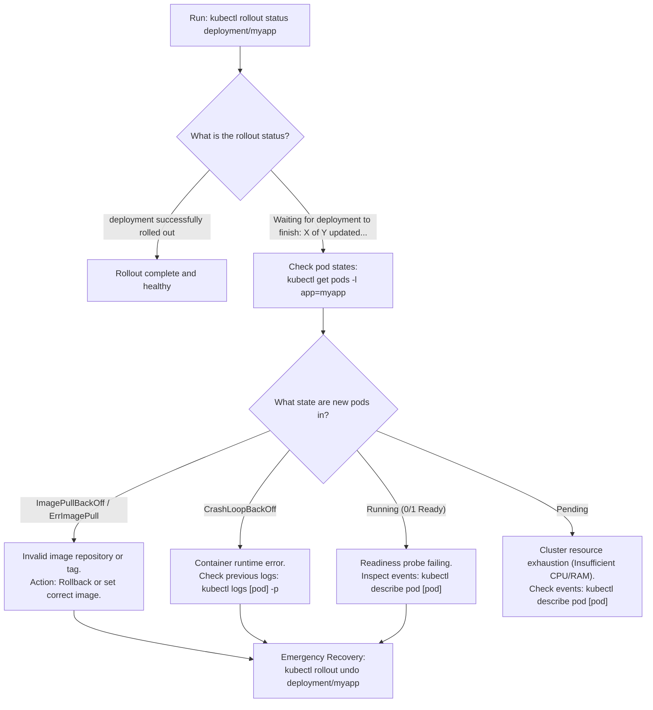

# Deployment Rollouts, Update Strategies & Rollbacks - CKA Exam Notes

> **Exam Domain**: Application Lifecycle Management (15%) / Troubleshooting (30%)  
> **Weight / Importance**: Critical (Core CKA exam domain: managing zero-downtime rollouts, configuring `maxSurge` and `maxUnavailable`, executing rollbacks, and diagnosing stalled deployments)  
> **Target Version**: Verified against v1.31 / v1.32 (Current CKA Curriculum)  
> **Allowed Docs Search Keywords**: `Deployments`, `RollingUpdate`, `kubectl rollout`, `change-cause`, `maxSurge`  
> **Source**: Generated from `application-lifecycle-management/01-deployment-update-and-rollbacks-raw.md`

---

## 1. Quick-Reference Summary

- **Controller Hierarchy**:
  - **Deployment**: Higher-level controller managing declarative updates, rollouts, and revisions across ReplicaSets.
  - **ReplicaSet**: Low-level worker controller responsible solely for maintaining the desired replica count of identical Pods.
  - **Pod**: The atomic container instance scheduled on worker nodes.
- **Rollout & Revision Triggers**:
  - A new **Rollout** and **Revision** is triggered **only when the Pod Template (`spec.template`) is modified** (e.g., container image, environment variables, resource requests, volume mounts, labels).
  - **Non-Triggering Operations**: Scaling replicas (`spec.replicas`) or modifying the deployment's top-level metadata **does NOT** create a new revision; it simply scales the currently active ReplicaSet.
- **Deployment Strategies**:
  - **`RollingUpdate` (Default)**: Gradually replaces old pods with new pods to achieve **zero downtime**. Controlled via `maxSurge` and `maxUnavailable` (default: 25% each).
  - **`Recreate`**: Terminates all existing pods simultaneously before spinning up new pods. Results in an application **downtime window**, but guarantees that two different application versions never run concurrently.
- **Essential Rollout CLI Commands**:
  - Watch rollout progress: **`kubectl rollout status deployment/<name>`**
  - View revision history: **`kubectl rollout history deployment/<name>`**
  - Inspect specific revision details: **`kubectl rollout history deployment/<name> --revision=2`**
  - Roll back to previous revision: **`kubectl rollout undo deployment/<name>`**
  - Roll back to a specific revision: **`kubectl rollout undo deployment/<name> --to-revision=1`**
  - Restart all pods with zero config change: **`kubectl rollout restart deployment/<name>`**
- **The Deprecated `--record` Flag**:
  - In older Kubernetes versions, `kubectl apply --record` populated the `CHANGE-CAUSE` column in rollout history.
  - The `--record` flag is **deprecated**. The standard modern method to record change cause is directly annotating the resource:
    `kubectl annotate deployment <name> kubernetes.io/change-cause="Upgraded to v1.2" --overwrite`

---

## 2. Conceptual Overview & Mental Model

### Dual-Layer Architectural Understanding

- **Simple English Explanation (How It Works)**:
  - **The Problem with Updating Stateless Applications**:
    If an application runs 5 identical container replicas and you need to release version 2.0, you cannot simply stop all 5 containers at once without taking the service offline for users. Conversely, manually starting 5 new containers on separate nodes and deleting the old ones is prone to human error and difficult to roll back if the new release crashes.
  - **How the Deployment Controller Solves This**:
    Kubernetes abstracts application updates by introducing the **Deployment** object as a supervisor over **ReplicaSets**:
    1. When you deploy `myapp-deployment`, the Deployment controller creates **ReplicaSet 1** with 5 pods running `v1.0`.
    2. When you update the container image to `v2.0`, the controller does **not** modify ReplicaSet 1. Instead, it creates **ReplicaSet 2**.
    3. Under the **RollingUpdate** strategy, the controller incrementally scales **up** ReplicaSet 2 (creating `v2.0` pods) while simultaneously scaling **down** ReplicaSet 1 (terminating `v1.0` pods).
    4. Readiness probes gate each step: the controller will not terminate an old pod until a new pod passes its readiness probe and enters `Ready`.
    5. If the new release fails, executing a **rollback** (`kubectl rollout undo`) instructs the controller to reverse the process: scale ReplicaSet 1 back up to 5 pods and scale ReplicaSet 2 down to 0.



- **Standard / Production Definition**:
  - **Kubernetes Deployment**: A declarative control loop that manages the state transitions of `ReplicaSet` objects. Deployments automate canary, rolling, and recreate update strategies for stateless workloads, recording immutable revision histories based on pod template hashes to facilitate instantaneous, zero-downtime rollbacks and canary progression.

---

## 3. Deep-Dive Technical Breakdown

### 3.1 Rollouts and Versioning Mechanics



When a Deployment is created or updated, the Kubernetes controller assigns an incremental **Revision Number** ($1, 2, 3, \dots$):

1. **The Pod Template Hash (`pod-template-hash`)**:
   - The Deployment controller computes an algorithmic hash of the `spec.template` block.
   - This hash is appended to the name of each generated ReplicaSet (e.g., `myapp-deployment-67c749c58c`) and added as a label to all child pods.
2. **Revision History Storage (`revisionHistoryLimit`)**:
   - Old ReplicaSets are **not deleted** when an update completes. Their desired replica count is simply scaled down to **`0`**.
   - Preserving old ReplicaSets maintains the historical configuration required for rollbacks.
   - The number of old ReplicaSets retained on the cluster is governed by:
     `spec.revisionHistoryLimit` (default: **`10`**).
3. **What Triggers a Revision vs. What Does Not**:
   - **Triggers New Revision**: Modifying container image, environment variables, resource limits, ports, volume mounts, readiness/liveness probes, or pod labels.
   - **Does NOT Trigger a Revision**: Changing `spec.replicas`, modifying `spec.strategy`, or editing `spec.revisionHistoryLimit`.

---

### 3.2 Deployment Strategies: `RollingUpdate` vs. `Recreate`



Kubernetes supports two primary deployment strategies defined under `spec.strategy.type`:

#### Strategy 1: `Recreate`
- **Behavior**: All old pods are terminated simultaneously before any new pods are scheduled.
- **Downtime**: Yes. There is a period where **zero** application instances are available to serve user traffic.
- **Use Case**:
  - Legacy applications that cannot handle concurrent version execution against a shared database.
  - Workloads binding to fixed host ports or exclusive ReadWriteOnce (RWO) storage volumes.

#### Strategy 2: `RollingUpdate` (Default)
- **Behavior**: Incrementally spins up new pods while gradually terminating old pods.
- **Downtime**: **Zero downtime**. Traffic is dynamically routed to available healthy pods throughout the process.
- **Tuning Parameters**:
  - **`maxUnavailable`**: The maximum number of pods that can be unavailable during the update process. Can be an absolute number (e.g., `1`) or a percentage (default: **`25%`**).
  - **`maxSurge`**: The maximum number of pods that can be created above the desired replica count. Can be an absolute number (e.g., `1`) or a percentage (default: **`25%`**).

#### Calculation Example for `RollingUpdate` ($5\text{ Replicas}$, $25\%\text{ Defaults}$)
When updating a 5-replica deployment with default $25\%$ settings:
- **`maxSurge: 25%`**: $\text{ceil}(5 \times 0.25) = 2$ extra pods. Maximum allowed pods during rollout = $5 + 2 = \mathbf{7\text{ pods}}$.
- **`maxUnavailable: 25%`**: $\text{floor}(5 \times 0.25) = 1$ pod down. Minimum available pods during rollout = $5 - 1 = \mathbf{4\text{ pods}}$.



---

### 3.3 Updating a Deployment



Workloads can be updated using three different operational methods:

| Update Method | Command Syntax | Recommended Context |
| :--- | :--- | :--- |
| **Declarative (Best Practice)** | `kubectl apply -f deployment.yaml` | Production CI/CD pipelines, GitOps. |
| **Imperative Image Update** | `kubectl set image deployment/myapp nginx=nginx:1.9.1` | Rapid troubleshooting, lab exercises. |
| **Interactive Editor** | `kubectl edit deployment/myapp` | Manual triage on live clusters. |
| **Imperative Env Update** | `kubectl set env deployment/myapp DB_PORT=5432` | Injecting or changing environment variables. |
| **Imperative Resource Update** | `kubectl set resources deployment/myapp -c=nginx --limits=cpu=200m` | Adjusting CPU/memory requests or limits. |

---

### 3.4 Upgrades and Rolling Update Mechanics



During a rolling update, inspecting ReplicaSets reveals the handoff in progress:

```bash
kubectl get replicasets
```
*Output*:
```text
NAME                          DESIRED   CURRENT   READY   AGE
myapp-deployment-67c749c58c   0         0         0       22m   <-- Old ReplicaSet (v1.7.0)
myapp-deployment-7d57dbdb8d   5         5         5       20m   <-- New ReplicaSet (v1.7.1)
```

The Deployment controller ensures:
1. `ReplicaSet-2` is scaled up by `maxSurge`.
2. As new pods report `Ready`, `ReplicaSet-1` is scaled down by `maxUnavailable`.
3. The process repeats until `ReplicaSet-2` holds all 5 desired replicas and `ReplicaSet-1` reaches 0.

---

### 3.5 Rollbacks Under the Hood



When an update introduces a breaking change or a crashing image, execute a rollback:

```bash
kubectl rollout undo deployment myapp-deployment
```

#### What Happens Under the Hood:
1. The Deployment controller looks up the ReplicaSet associated with the previous revision (`myapp-deployment-67c749c58c`).
2. It sets the desired replicas of `ReplicaSet-1` back to `5`.
3. It sets the desired replicas of the faulty `ReplicaSet-2` down to `0`.
4. The exact same rolling update algorithm runs in reverse, restoring the proven application version without recreating manifests.

---

## 4. Declarative Manifests & Scaffolding Patterns

### Complete Workflow: Declarative Deployment with Tuned RollingUpdate

```yaml
# deployment.yaml
apiVersion: apps/v1
kind: Deployment
metadata:
  name: myapp-deployment
  labels:
    app: myapp
    tier: frontend
  annotations:
    kubernetes.io/change-cause: "Initial release of myapp v1.7.0"
spec:
  replicas: 4
  revisionHistoryLimit: 10
  strategy:
    type: RollingUpdate
    rollingUpdate:
      maxSurge: 1             # At most 1 extra pod created (total 5)
      maxUnavailable: 0       # Zero downtime: all 4 replicas must stay available!
  selector:
    matchLabels:
      app: myapp
  template:
    metadata:
      labels:
        app: myapp
        tier: frontend
    spec:
      containers:
      - name: nginx-container
        image: nginx:1.7.0
        ports:
        - containerPort: 80
        readinessProbe:       # Crucial: gates rollout progression!
          httpGet:
            path: /
            port: 80
          initialDelaySeconds: 5
          periodSeconds: 5
```

---

## 5. Command Translation & Operational Mapping Tables

### Strategy Comparison: `RollingUpdate` vs. `Recreate`

| Metric / Behavior | `RollingUpdate` Strategy | `Recreate` Strategy |
| :--- | :--- | :--- |
| **Downtime Window** | **Zero downtime** | **Downtime present** (Old pods die before new pods start) |
| **Concurrent Versions** | Both old and new versions run simultaneously during rollout | Only one version ever runs at any time |
| **Resource Surge** | Requires temporary extra cluster CPU/RAM (`maxSurge`) | Never exceeds target replica capacity |
| **Rollout Speed** | Slower (gated by readiness probes and grace periods) | Faster (bulk termination and recreation) |
| **Default in Kubernetes?** | **Yes** (Default if unspecified) | No |

---

## 6. High-Yield CLI & Imperative Commands

```bash
# 1. Create deployment from YAML
kubectl apply -f deployment.yaml

# 2. View live rollout progress
kubectl rollout status deployment/myapp-deployment

# 3. View deployment revision history
kubectl rollout history deployment/myapp-deployment

# 4. View detailed pod template of a specific historical revision
kubectl rollout history deployment/myapp-deployment --revision=2

# 5. Imperatively update container image
kubectl set image deployment/myapp-deployment nginx-container=nginx:1.7.1

# 6. Annotate the deployment to record a change cause in history
kubectl annotate deployment/myapp-deployment kubernetes.io/change-cause="Upgraded to nginx 1.7.1" --overwrite

# 7. Pause a rollout (useful for canary deployments or batching changes)
kubectl rollout pause deployment/myapp-deployment

# 8. Resume a paused rollout
kubectl rollout resume deployment/myapp-deployment

# 9. Perform a rolling restart of all pods (refreshes secrets/configmaps without spec changes)
kubectl rollout restart deployment/myapp-deployment

# 10. Undo rollout (roll back to immediately preceding revision)
kubectl rollout undo deployment/myapp-deployment

# 11. Undo rollout to a specific historical revision
kubectl rollout undo deployment/myapp-deployment --to-revision=1
```

---

## 7. Troubleshooting & Diagnostic Runbook

### Decision Tree: Troubleshooting Stalled or Failing Rollouts



### Step-by-Step Triage Sequence

#### Scenario: Stalled Rollout Due to Faulty Image
1. **Detect Stalled Rollout**:
   ```bash
   kubectl rollout status deployment/myapp-deployment
   # Output: Waiting for deployment "myapp-deployment" to rollout: 1 out of 4 new replicas have been updated...
   ```
2. **Inspect New Pod State**:
   ```bash
   kubectl get pods -l app=myapp
   # One new pod is in ImagePullBackOff; 3 old pods remain Running!
   ```
   *Notice the safety of RollingUpdate: old pods remain active to serve traffic.*
3. **Execute Immediate Rollback**:
   ```bash
   kubectl rollout undo deployment/myapp-deployment
   # Output: deployment.apps/myapp-deployment rolled back
   ```
4. **Verify Restored State**:
   ```bash
   kubectl rollout status deployment/myapp-deployment
   # Output: deployment "myapp-deployment" successfully rolled out
   ```

---

## 8. CKA Exam Tips, Gotchas & Traps

> [!WARNING]
> **Readiness Probes Gate Rolling Updates**:
> If a newly deployed container passes its liveness probe but **fails its readiness probe**, the Deployment controller will **stop the rollout indefinitely**. It will not terminate remaining old pods, but the new pod will never receive service traffic. Always check `kubectl describe pod` for readiness probe errors when a rollout hangs!

> [!IMPORTANT]
> **Scaling Does NOT Create a Revision**:
> In the CKA exam, if you run `kubectl scale deployment myapp --replicas=10`, do not expect a new revision number in `kubectl rollout history`. Revisions only track changes to the **Pod Template (`spec.template`)**.

> [!TIP]
> **The Modern Alternative to `--record`**:
> The `--record` flag was deprecated and should not be relied on. If an exam question asks you to record the change cause for a deployment update, annotate the deployment directly:
> ```bash
> kubectl annotate deployment myapp kubernetes.io/change-cause="Updated image to v2" --overwrite
> ```

> [!CAUTION]
> **`maxUnavailable: 0` Requires Extra Cluster Capacity**:
> Setting `maxUnavailable: 0` guarantees zero downtime by requiring that new pods are ready before any old pods are killed. However, this forces `maxSurge` to create extra pods first. If worker nodes lack free CPU/RAM to host the surge pods, the rollout will hang in `Pending` forever!

---

## 9. Self-Test / Active Recall

1. **What is the architectural difference between a Deployment and a ReplicaSet?**
2. **Does running `kubectl scale deployment web --replicas=8` create a new revision in rollout history? Why or why not?**
3. **What is the default deployment update strategy in Kubernetes, and what are the default percentage values for `maxSurge` and `maxUnavailable`?**
4. **Under what scenario would an engineer deliberately choose the `Recreate` deployment strategy over `RollingUpdate`?**
5. **If an updated container image has a typo and enters `ImagePullBackOff`, what command rolls the deployment back to the previous stable release?**
6. **How do you inspect the detailed Pod template configuration of historical revision 3 without rolling back to it?**
7. **What happens to old ReplicaSets when a rolling update finishes successfully? Are they deleted?**

<details>
<summary>Reveal Answers</summary>

1. A Deployment is a higher-level declarative controller that manages ReplicaSet rollouts, strategies, and revisions. A ReplicaSet is a lower-level controller responsible solely for maintaining a specified number of identical running Pods.
2. **No.** Rollout revisions are triggered exclusively by modifications to the Pod template (`spec.template`). Scaling modifies `spec.replicas` on the active ReplicaSet.
3. `RollingUpdate`. Default values are `maxSurge: 25%` and `maxUnavailable: 25%`.
4. When two different versions of the application cannot run concurrently (e.g. database schema migrations, single-writer stateful locks, or fixed host-port bindings).
5. `kubectl rollout undo deployment/<name>`.
6. `kubectl rollout history deployment/<name> --revision=3`.
7. **No, they are not deleted.** Their desired replica count is scaled to `0`. They are retained on the cluster (up to `spec.revisionHistoryLimit`, default 10) to enable instantaneous rollbacks.
</details>

---

### Official Documentation Bookmarks

Allowed for reference during the live exam at [kubernetes.io/docs](https://kubernetes.io/docs/home/):

| Topic | Direct Search Term | Recommended Anchor |
| :--- | :--- | :--- |
| **Deployments** | `Deployments` | Concepts > Workloads > Workload Management > Deployments |
| **Updating a Deployment** | `Updating a Deployment` | Concepts > Workloads > Deployments > Updating a Deployment |
| **Rollling Back a Deployment** | `Rolling Back a Deployment` | Concepts > Workloads > Deployments > Rolling Back a Deployment |
| **Kubectl Rollout Reference** | `kubectl rollout` | Reference > Command line tool (kubectl) > kubectl rollout |
