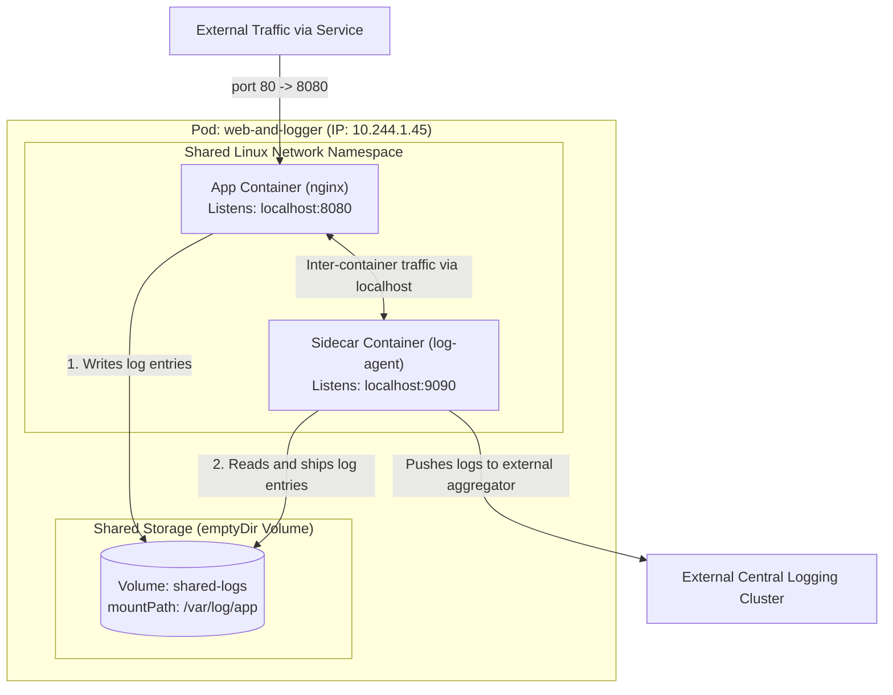
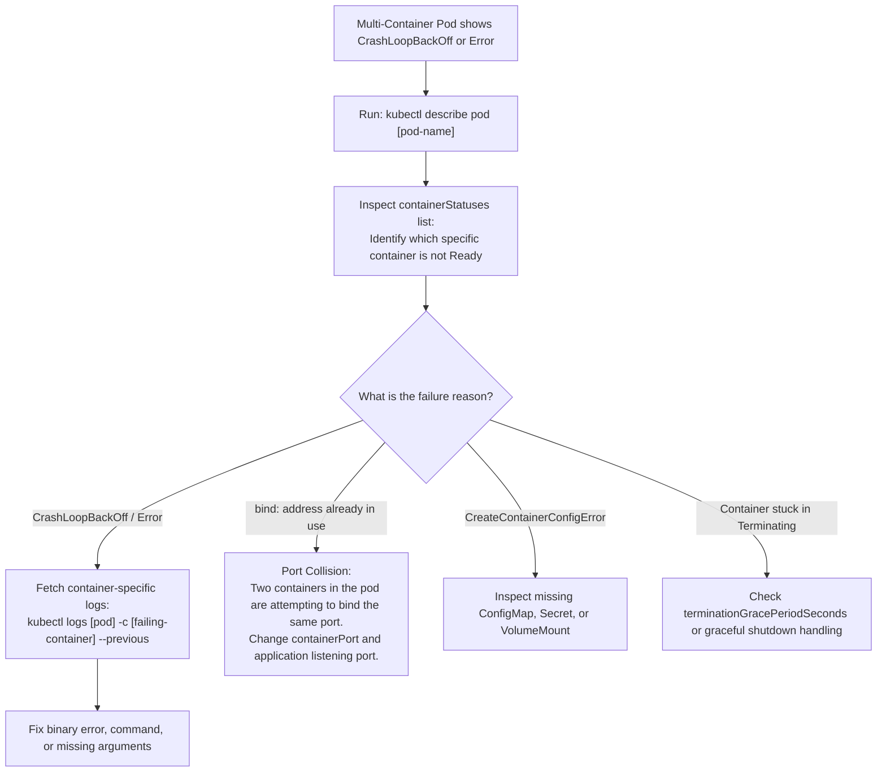

# Multi-Container Pods & Sidecar Patterns - CKA Exam Notes

> **Exam Domain**: Application Lifecycle Management (15%) / Troubleshooting (30%)  
> **Weight / Importance**: High (Tested across sidecar logging, shared volume communication, and container-specific CLI debugging)  
> **Target Version**: Verified against v1.31 / v1.32 (Current CKA Curriculum)  
> **Allowed Docs Search Keywords**: `Multi-container Pods`, `sidecar containers`, `shareProcessNamespace`, `kubectl logs container`  
> **Source**: Generated from `application-lifecycle-management/08-multicontainer-pods-raw.md`

---

## 1. Quick-Reference Summary

- **Primary Role of Multi-Container Pods**: Groups multiple tightly coupled container processes into a single atomic scheduling unit on the same worker node.
- **The Three Shared Primitives**:
  1. **Lifecycle**: Containers in a Pod are co-located, co-scheduled on the exact same host, and created/destroyed together.
  2. **Network Space**: Containers share the same network namespace, Pod IP address, and port space. They communicate with each other over **`localhost`** (`127.0.0.1`).
  3. **Storage Volumes**: Containers can mount the exact same storage volumes (such as `emptyDir`), enabling direct file-level data sharing.
- **The `containerPort` Reality**:
  - Declaring `ports.containerPort` is **informational only**; it documents the port for humans and tools. Omitting it does not prevent listening or traffic.
  - **Port Collision Rule**: Because containers share the same network namespace, **two containers in the same Pod CANNOT listen on the same port**. Doing so causes an immediate `bind: address already in use` error.
- **Essential Multi-Container CLI Flag (`-c`)**:
  - When running `logs` or `exec` on a multi-container pod, you **must specify the target container** using `-c <container-name>`:
    ```bash
    kubectl logs <pod-name> -c <container-name>
    kubectl exec -it <pod-name> -c <container-name> -- /bin/sh
    ```
- **The Three Core Design Patterns**:
  - **Sidecar**: Extends/enhances the primary container (e.g., log shippers like Fluentd, config reloaders).
  - **Adapter**: Standardizes or normalizes application outputs/metrics for external monitoring.
  - **Ambassador**: Proxies local network communication from the main container to external services.
- **Native Sidecar Support (v1.28+ / v1.29+ / Current v1.31+)**:
  - `initContainers` with `restartPolicy: Always` act as native sidecars that start before app containers and run for the lifetime of the Pod.

---

## 2. Conceptual Overview & Mental Model

### Dual-Layer Architectural Understanding

- **Simple English Explanation (How It Works)**:
  - **The Tight Coupling Dilemma**:
    In software engineering, you frequently have a secondary utility process that must accompany your primary service: for example, an Nginx web application writing access logs to disk, and a secondary log shipper that parses those logs and streams them to a centralized indexing platform.
    - If you bundle both processes into a single Docker image, you violate process separation, complicate Unix signal handling (`SIGTERM`), and bloat the code repository.
    - If you deploy them as two completely separate Pods, they might get scheduled onto different physical nodes across the data center, requiring complex network services, ingress routing, and network volume synchronization just to read a local log file.
  - **The Multi-Container Pod Solution**:
    Kubernetes resolves this by allowing multiple containers within a single Pod. 
    1. **Co-Scheduling**: `kube-scheduler` places the entire Pod onto a single worker node.
    2. **Namespace Sharing**: The container runtime creates an infrastructure ("pause") container that holds a Linux network namespace. All containers in the Pod join this shared network namespace, allowing them to communicate via `localhost` at memory-bus speeds.
    3. **Volume Sharing**: By declaring an ephemeral shared volume (an `emptyDir`), the web server writes to `/var/log/nginx/access.log`, and the log-shipping container mounts that exact directory to `/var/log/app/` and streams the files out.




- **Standard / Production Definition**:
  - **Multi-Container Pod**: An architectural deployment construct where two or more heterogeneous container specifications are declared within a single Pod manifest (`spec.containers`). The containers share an identical lifecycle boundary, Linux network and IPC namespaces, and storage volume mounts, implementing collaborative patterns without polluting independent container images.

---

## 3. Deep-Dive Technical Breakdown

### 3.1 The Three Shared Primitives


#### 1. Shared Network Namespace
- All containers in the Pod share the network stack created by the pod sandbox pause container.
- They have a single assigned Pod IP address.
- Communication between containers is conducted over `localhost` or `127.0.0.1`.
- **Port Conflict Rule**: A network port can only be bound by a single process inside the network namespace. If Container A listens on port 8080, Container B cannot listen on port 8080.

#### 2. Shared Storage Volumes
- Volumes are defined once at the Pod level under `spec.volumes`.
- Each container declares a `volumeMounts` entry referencing the volume.
- Mount paths can be identical or completely different in each container:
  - App container mounts `shared-data` at `/var/log/app/`.
  - Sidecar container mounts `shared-data` at `/usr/src/logs/`.
  - Both containers see and manipulate the exact same filesystem blocks in real time.

#### 3. Shared Process Namespace (`shareProcessNamespace`)
By default, each container maintains an isolated Linux PID namespace (Container A cannot see the processes of Container B). 
Setting `spec.shareProcessNamespace: true` allows containers within the Pod to share a single process table:
```yaml
spec:
  shareProcessNamespace: true
```
- A sidecar container can inspect process lists (`ps aux`) of neighboring containers.
- A sidecar can send Unix signals (such as `kill -HUP <PID>`) directly to processes in another container.

---

### 3.2 The Role of `containerPort` Explained

The raw notes requested verification of `containerPort`:
> *Explain the role of mentioning containerport for each container specified.*

#### Technical Reality:
1. **Informational & Non-Restricting**:
   Declaring `ports.containerPort: 8080` in Kubernetes is **purely informational metadata**. 
   - Omitting `containerPort` does **not** block the container from listening on that port or receiving external traffic.
   - Declaring `containerPort` does **not** expose the port outside the Pod or on the host node.
2. **Cluster Documentation & Tooling**:
   - It informs cluster administrators and tools which ports the container intends to use.
   - It allows ports to be named (e.g., `name: http-web`), enabling Services to bind to the port by name (`targetPort: http-web`).
3. **Crucial Rule on Port Discrepancies**:
   In a multi-container pod:
   ```yaml
   spec:
     containers:
     - name: web
       image: nginx
       ports:
       - containerPort: 80
     - name: metrics-exporter
       image: exporter
       ports:
       - containerPort: 9113
   ```
   Each container must use a **distinct port**. Setting both to port 80 will cause the second container to crash with a port binding failure.

---

### 3.3 Multi-Container Design Patterns

| Pattern | Functional Role | Concrete Example |
| :--- | :--- | :--- |
| **Sidecar** | Enhances or extends the main application without altering its source code. | A log collector (Fluentd/Promtail) reading files written by the main application to a shared `emptyDir`. |
| **Adapter** | Normalizes and transforms heterogeneous application output or metrics into a unified format. | An adapter that exposes proprietary app monitoring metrics into Prometheus-compliant `/metrics` format. |
| **Ambassador** | Acts as an intelligent local reverse proxy to simplify external connectivity. | A local database proxy connecting to a sharded Redis/Postgres cluster, abstracting cluster topology from the main app. |
| **Init Container** | Runs to completion sequentially before any application containers are initialized. | Running database schema migrations, verifying network connectivity, or downloading seed files. |

---

### 3.4 Native Sidecars (Kubernetes v1.29+ / v1.31+ Standard)

Historically, sidecars were standard containers listed under `spec.containers`, which meant Kubernetes could not guarantee their startup order or ensure they remained alive during pod shutdown.

In modern Kubernetes, **Native Sidecar Containers** are defined under `spec.initContainers` with `restartPolicy: Always`:

```yaml
spec:
  initContainers:
  - name: vault-agent-sidecar
    image: vault:1.15
    restartPolicy: Always       # <--- Defines this init container as a native sidecar
  containers:
  - name: main-app
    image: my-app:v1
```
- **Startup Guarantee**: The native sidecar starts **first**, passes its readiness probe, and then the main application container starts.
- **Shutdown Guarantee**: The native sidecar stays alive until the main application container terminates completely.

---

## 4. Declarative Manifests & Scaffolding Patterns

### Complete Multi-Container Pod with Shared Volume (`pod-multi.yaml`)

```yaml
apiVersion: v1
kind: Pod
metadata:
  name: app-and-log-shipper
  labels:
    app: web-service
spec:
  # 1. Ephemeral shared volume created at Pod level
  volumes:
  - name: log-storage
    emptyDir: {}

  containers:
  # 2. Main Application Container
  - name: web-app
    image: busybox:1.36
    command: ["/bin/sh", "-c"]
    args:
    - >
      while true; do
        echo "$(date) - INFO - Web request handled successfully" >> /var/log/app/access.log;
        sleep 2;
      done
    volumeMounts:
    - name: log-storage
      mountPath: /var/log/app
    ports:
    - name: app-port
      containerPort: 8080

  # 3. Sidecar Logging Container
  - name: log-shipper
    image: busybox:1.36
    command: ["/bin/sh", "-c"]
    args:
    - >
      tail -n+1 -f /var/log/source/access.log | while read line; do
        echo "SHIPPED TO CENTRAL: $line";
      done
    volumeMounts:
    - name: log-storage
      mountPath: /var/log/source   # Different mount path; same shared volume!
    ports:
    - name: metrics-port
      containerPort: 9090
```

---

## 5. Command Translation & Operational Mapping Tables

### Single-Container vs. Multi-Container CLI Operations

| Task | Single-Container Pod | Multi-Container Pod |
| :--- | :--- | :--- |
| **Inspect Logs** | `kubectl logs <pod>` | `kubectl logs <pod> -c <container>` |
| **Stream / Follow Logs** | `kubectl logs -f <pod>` | `kubectl logs -f <pod> -c <container>` |
| **View Previous Crashed Logs**| `kubectl logs <pod> --previous` | `kubectl logs <pod> -c <container> --previous` |
| **Interactive Shell** | `kubectl exec -it <pod> -- sh` | `kubectl exec -it <pod> -c <container> -- sh` |
| **Run One-Off Command** | `kubectl exec <pod> -- env` | `kubectl exec <pod> -c <container> -- env` |
| **Check Port Listening** | `netstat -tlpn` inside container | Shows all ports across all containers in the Pod |

---

## 6. High-Yield CLI & Verification Commands

```bash
# 1. View logs of the sidecar container specifically
kubectl logs app-and-log-shipper -c log-shipper

# 2. Stream logs of the main web container
kubectl logs -f app-and-log-shipper -c web-app

# 3. Execute a shell command inside the sidecar container
kubectl exec -it app-and-log-shipper -c log-shipper -- ls -la /var/log/source

# 4. View detailed status of each container in the pod
kubectl get pod app-and-log-shipper -o jsonpath='{range .status.containerStatuses[*]}{.name}{"\t"}{.state}{"\tReady: "}{.ready}{"\n"}{end}'

# 5. Verify inter-container localhost connectivity
kubectl exec app-and-log-shipper -c web-app -- wget -qO- http://localhost:9090
```

---

## 7. Troubleshooting & Diagnostic Runbook

### Decision Tree: Troubleshooting Multi-Container Pod Failures



### Step-by-Step Triage Sequence

1. **Identify the Failing Container**:
   In a multi-container pod, `kubectl get pods` showing `1/2 Ready` indicates that one container is healthy while the other is failing.
   Run:
   ```bash
   kubectl describe pod <pod-name>
   ```
   Scroll down to `Containers:` and compare the `State` of each container to isolate the broken process.

2. **Inspect Container-Specific Logs**:
   Running bare `kubectl logs <pod-name>` will default to the first container and might mask errors in the second. Always specify `-c`:
   ```bash
   kubectl logs <pod-name> -c <failing-container-name> --previous
   ```

3. **Verify Volume Mount File Availability**:
   If the sidecar complains of missing files:
   ```bash
   kubectl exec <pod-name> -c <app-container> -- ls -la <app-mount-path>
   kubectl exec <pod-name> -c <sidecar-container> -- ls -la <sidecar-mount-path>
   ```
   Ensure both containers point to the exact same volume name in `spec.volumes`.

---

## 8. CKA Exam Tips, Gotchas & Traps

> [!WARNING]
> **The Omitted `-c` Flag Failure in `kubectl exec`**:
> If you execute `kubectl exec -it multi-pod -- /bin/sh` without `-c`, `kubectl` will error out:
> `Defaulting container name to "app". Use -c to specify.`
> If the command fails because the target tool is in the *second* container, you waste time. Always develop the habit of writing `-c <container-name>`.

> [!IMPORTANT]
> **The Port Collision Trap**:
> Never configure two containers in the same Pod to use the same network port. Because they share a single network namespace (`localhost`), the second container to start will crash with:
> `Error: listen tcp :8080: bind: address already in use`.

> [!TIP]
> **Pod Resource Calculation**:
> When defining resource requests and limits in a multi-container pod, remember that `kube-scheduler` sums the requests of **all** containers in the Pod to determine node placement feasibility:
> $$\text{Pod Total Request} = \sum \text{Container Requests}$$
> If Container A requests 1 CPU and Container B requests 2 CPU, the Pod requires a node with at least 3 allocatable CPUs.

---

## 9. Self-Test / Active Recall

1. **How do two containers in the same Pod communicate over the network?**
2. **Can two containers inside the same Pod listen on the same TCP port? Why or why not?**
3. **What is the command to view the previous logs of a crashing sidecar container named `log-collector` in pod `web`?**
4. **Is declaring `containerPort` mandatory for a container to accept network traffic? What is its primary role?**
5. **How can you enable two containers in the same Pod to see and signal each other's processes?**
6. **In modern Kubernetes (v1.29+), how is a native sidecar container declared?**
7. **If Container 1 requests 500m CPU and Container 2 requests 1500m CPU, how much total CPU must a node have available for `kube-scheduler` to place the Pod?**

<details>
<summary>Reveal Answers</summary>

1. Over the loopback interface (`localhost` / `127.0.0.1`), because they share the same Linux network namespace.
2. No. They share the same network namespace and port space. Attempting to bind the same port results in a `bind: address already in use` error.
3. `kubectl logs web -c log-collector --previous`.
4. No. It is informational metadata for documentation, port naming, and API reflection. It does not control runtime port binding.
5. By setting `spec.shareProcessNamespace: true` in the Pod specification.
6. Under `spec.initContainers` with `restartPolicy: Always`.
7. At least $2000\text{m}$ (2.0 CPUs). The scheduler calculates placement feasibility based on the sum of all container requests in the Pod.
</details>

---

### Official Documentation Bookmarks

Allowed for reference during the live exam at [kubernetes.io/docs](https://kubernetes.io/docs/home/):

| Topic | Direct Search Term | Recommended Anchor |
| :--- | :--- | :--- |
| **Multi-Container Pods** | `Communicating between containers in the same Pod` | Concepts > Workloads > Pods > Communicating between containers |
| **Sidecar Containers** | `Sidecar Containers` | Concepts > Workloads > Pods > Sidecar containers |
| **Share Process Namespace** | `Share Process Namespace between Containers` | Tasks > Configure Pods and Containers > Share Process Namespace between Containers in a Pod |
| **Kubectl Logs Reference** | `kubectl logs` | Reference > Command-Line Tools > kubectl > kubectl logs |
