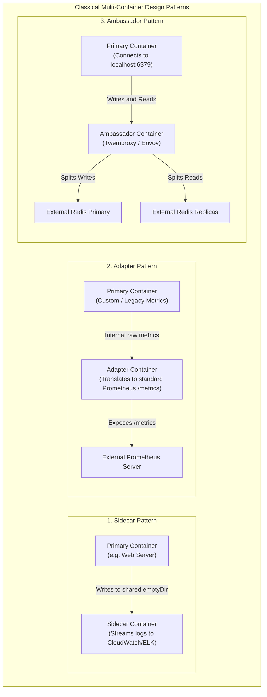
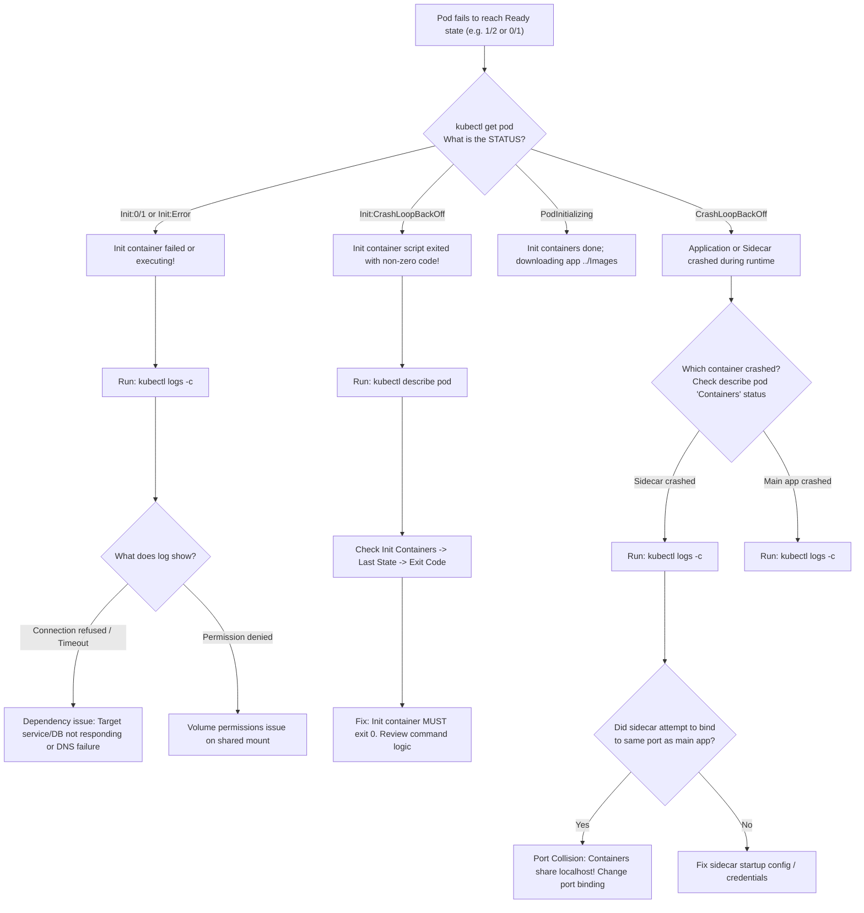

# Multi-Container Design Patterns - CKA Exam Notes

> **Exam Domain**: Application Lifecycle Management (15%) / Core Concepts  
> **Weight / Importance**: High (Core architecture topic testing co-located containers, sequential init containers, native sidecars with `restartPolicy: Always`, shared volume IPC, and logging/proxy design patterns)  
> **Target Version**: Verified against v1.31 / v1.32 (Current CKA Curriculum)  
> **Allowed Docs Search Keywords**: `Init Containers`, `Sidecar Containers`, `Multi-container Pods`, `restartPolicy: Always`, `Communicating between containers in the same Pod`  
> **Source**: Generated from `application-lifecycle-management/09-multicontainer-pods-design-patterns-raw.md`

---

## 1. Quick-Reference Summary

- **The Three Multi-Container Paradigms**:
  1. **Co-located Containers (`spec.containers[]`)**: Peer application containers that run concurrently throughout the entire Pod lifecycle. Started in parallel by Kubelet without guaranteed startup ordering.
  2. **Regular Init Containers (`spec.initContainers[]`)**: Specialized sequential initialization containers. Run strictly one at a time to completion (`exit 0`) before any application containers start. Once completed, they stop and consume zero CPU/memory.
  3. **Native Sidecar Containers (`spec.initContainers[]` with `restartPolicy: Always`)**: Init containers that start *before* the main application, enter a running state, and remain active for the duration of the Pod's lifecycle. Terminate *after* main application containers exit.
- **The Core Classical Patterns**:
  - **Sidecar Pattern**: Enhances or extends the main container (e.g. log shipper like Fluentd/Vector, dynamic secret fetcher, config reloader).
  - **Adapter Pattern**: Standardizes heterogeneous application outputs into a unified interface (e.g. converting custom JSON metrics into Prometheus `/metrics` exposition format).
  - **Ambassador Pattern**: Simplifies network access by acting as a local proxy representing external backends (e.g. local Redis proxy handling read/write splitting, database connection pooler).
- **Inter-Container Communication**:
  - **Network**: All containers in a Pod share the exact same Linux network namespace and IP address; they communicate over **`localhost`** (`127.0.0.1`).
  - **Port Collision Rule**: Two containers inside the same Pod **cannot bind to the same port**; doing so triggers an immediate `bind: address already in use` error.
  - **Storage**: Data sharing between containers is achieved by mounting the same shared volume (e.g. an **`emptyDir`**).
- **Execution & Termination Sequencing**:
  - **Startup**: `initContainers` (sequential) $\to$ Native Sidecars (start and become ready) $\to$ App Containers (parallel).
  - **Termination**: App Containers (`SIGTERM` in parallel) $\to$ Native Sidecars (`SIGTERM` after app containers terminate).
- **Resource Request / Limit Calculation**:
  - Effective Pod requests/limits are calculated dynamically:
    - $\text{Effective Request} = \max\left(\sum \text{App Requests}, \max \text{Init Container Request}\right)$.
    - $\text{Effective Limit} = \max\left(\sum \text{App Limits}, \max \text{Init Container Limit}\right)$.
- **Essential Multi-Container CLI Flags**:
  - `kubectl logs <pod-name> -c <container-name>` (must specify container when multiple exist).
  - `kubectl exec -it <pod-name> -c <container-name> -- sh`.

---

## 2. Conceptual Overview & Mental Model

### Dual-Layer Architectural Understanding

- **Simple English Explanation (How It Works)**:
  - In microservice architectures, you often have secondary helper tasks that must accompany your primary application process. For example:
    - Waiting for a database schema migration to complete before launching the web server.
    - Continuously streaming application log files from local disk to a central logging cluster.
    - Acting as a local proxy to route database read/write queries to the correct cluster nodes.
  - Putting both processes into a single Docker image breaks process isolation, complicates Unix signal handling (`SIGTERM`), and blurs container boundaries.
  - Deploying them as separate Pods places them on different physical nodes across the cluster, preventing them from sharing fast in-memory communication or local disk volumes.
  - Kubernetes solves this through **Multi-Container Pods**. All containers in a Pod are scheduled onto the same physical node, join the same Linux network namespace, share the same Pod IP address, and can mount the same local `emptyDir` volumes.


- **Formal Kubernetes Definition**:
  - Multi-container Pods are an atomic scheduling unit where two or more tightly coupled containers share resources, storage volumes, and network namespaces. Containers inside a Pod are co-located, co-scheduled, and coordinate via shared volumes, process namespaces, or local network interfaces (`localhost`).

```mermaid
flowchart TD
    subgraph MultiContainerArchetypes["Multi-Container Pod Lifecycle Archetypes"]
        direction TB

        subgraph CoLocated["1. Co-Located Containers"]
            C1["Main App Container<br/>(spec.containers[0])"]
            C2["Secondary App Container<br/>(spec.containers[1])"]
            C1 <-->|Run concurrently in parallel| C2
        end

        subgraph InitSequential["2. Regular Init Containers"]
            I1["Init Container 1<br/>(e.g. wait-for-db)<br/>Must exit 0"] -->|Success| I2["Init Container 2<br/>(e.g. run-migrations)<br/>Must exit 0"]
            I2 -->|Success| Main1["Main App Container<br/>(Starts only after all inits finish)"]
        end

        subgraph NativeSidecar["3. Native Sidecar Containers (restartPolicy: Always)"]
            S1["Native Sidecar<br/>(spec.initContainers with restartPolicy: Always)"] -->|Starts first and enters Ready| Main2["Main App Container<br/>(Runs concurrently with Sidecar)"]
            Main2 -.->|Terminates first on Pod shutdown| S1Term["Sidecar receives SIGTERM<br/>ONLY after Main App exits"]
        end
    end
```



---

## 3. Deep-Dive Technical Breakdown

### 3.1 The Three Structural Categories

#### Category 1: Co-Located Containers (`spec.containers[]`)
- **Definition**: Two or more peer application containers defined inside the standard `spec.containers` array.
- **Lifecycle Mechanics**:
  - Kubelet starts all containers in `spec.containers` virtually in parallel. There is **no guaranteed startup order**.
  - All containers are expected to run indefinitely throughout the lifetime of the Pod.
  - If any container crashes, Kubelet restarts that individual container according to the Pod's `spec.restartPolicy` (default: `Always`). Other containers in the Pod continue running uninterrupted.


```yaml
apiVersion: v1
kind: Pod
metadata:
  name: simple-webapp
  labels:
    name: simple-webapp
spec:
  containers:
    - name: web-app
      image: web-app
      ports:
        - containerPort: 8080
    - name: main-app
      image: main-app
```

---

#### Category 2: Regular Init Containers (`spec.initContainers[]`)
- **Definition**: Specialized containers configured in `spec.initContainers` that run prior to the startup of application containers.
- **Lifecycle Mechanics**:
  - **Sequential Execution**: Run strictly in linear order as listed in the manifest ($Init_1 \to Init_2 \to \dots \to Init_N$).
  - **Blocking Semantics**: $Init_{N}$ will not start until $Init_{N-1}$ has completed successfully with exit code `0`.
  - **Failure Handling**: If an init container fails (exit code $\neq 0$), Kubelet restarts the init container according to `spec.restartPolicy`. If the policy is `Never`, the entire Pod transitions to `Failed`.
  - **Completion**: Once an init container finishes with exit code `0`, its process terminates. It releases its active CPU and memory back to the node.


```yaml
apiVersion: v1
kind: Pod
metadata:
  name: simple-webapp
  labels:
    name: simple-webapp
spec:
  containers:
    - name: web-app
      image: web-app
      ports:
        - containerPort: 8080
  initContainers:
    - name: db-checker
      image: busybox:1.36
      command: ['sh', '-c', 'until nc -z -w 2 db-service 5432; do echo "waiting for db"; sleep 2; done']
    - name: api-checker
      image: busybox:1.36
      command: ['sh', '-c', 'until nc -z -w 2 api-service 80; do echo "waiting for api"; sleep 2; done']
```

---

#### Category 3: Native Sidecar Containers (`spec.initContainers[]` with `restartPolicy: Always`)
- **Background & Motivation**:
  - Prior to Kubernetes v1.28, sidecar containers had to be defined as regular containers in `spec.containers`. This caused two critical flaws:
    1. **Startup Race Condition**: The main application might start before the logging agent or service mesh proxy was ready to handle traffic.
    2. **Job Termination Deadlock**: In batch `Jobs`, when the main container finished its workload, the sidecar container kept running indefinitely, preventing the Job from ever reaching the `Completed` state.
- **Native Implementation (Beta in v1.29, GA in v1.31 / v1.32)**:
  - Setting `restartPolicy: Always` directly on an entry in `spec.initContainers` turns it into a **Native Sidecar Container**.
  - **Ordered Startup**: Kubelet starts the sidecar in sequence with other init containers. It waits until the sidecar container's startup/readiness probe succeeds before proceeding to the next container.
  - **Continuous Lifetime**: Unlike regular init containers, the sidecar stays active for the entire lifecycle of the Pod.
  - **Ordered Shutdown**: On Pod shutdown or Job completion, Kubelet terminates application containers first (`SIGTERM`). The sidecar container is kept alive until all app containers have fully exited, guaranteeing that logs, telemetry, and network connections are not cut off prematurely.


```yaml
apiVersion: v1
kind: Pod
metadata:
  name: simple-webapp
  labels:
    name: simple-webapp
spec:
  containers:
    - name: web-app
      image: web-app
      ports:
        - containerPort: 8080
  initContainers:
    - name: log-shipper
      image: busybox:1.36
      command: ['sh', '-c', 'tail -F /var/log/app.log']
      restartPolicy: Always # Declares this as a native sidecar container
      volumeMounts:
        - name: log-storage
          mountPath: /var/log
  volumes:
    - name: log-storage
      emptyDir: {}
```

---

### 3.2 Comparison of Multi-Container Approaches

| Dimension | Co-Located Containers (`spec.containers`) | Regular Init Containers (`spec.initContainers`) | Native Sidecar Containers (`initContainers` + `Always`) |
| :--- | :--- | :--- | :--- |
| **Startup Timing** | Concurrent with peer containers | Sequential, before app containers | Sequential, before app containers |
| **Execution Duration** | Full Pod lifecycle | Ephemeral (stops after exit code 0) | Full Pod lifecycle |
| **Exit Expectation** | Expected to run continuously | **Must exit 0** to proceed | Expected to run continuously |
| **Next Step Trigger** | Container process fork | Process exits with code 0 | Startup / Readiness probe passes |
| **Shutdown Sequencing** | Concurrent `SIGTERM` with all peers | N/A (already stopped before shutdown) | **Terminates last** (after app containers exit) |
| **Batch / Job Impact** | Blocks Job completion if still running | No impact (stops before app runs) | **Allows Job completion** (stops when app exits) |
| **Primary Use Cases** | Interdependent service pairs | Schema migrations, pre-flight checks | Log forwarders, proxies, secret refreshers |

---

### 3.3 The Three Classical Multi-Container Design Patterns

Kubernetes recognizes three classical design patterns for multi-container pods:



#### 1. The Sidecar Pattern
- **Role**: Extends, enhances, or complements the core application without touching the application code.
- **Concrete Example**: A primary web server (e.g. Nginx) writes application logs to a shared volume (`/var/log/nginx`). A secondary sidecar container (e.g. Fluentd or Vector) reads `/var/log/nginx/access.log` and ships the logs to a remote OpenSearch/Elasticsearch cluster.

#### 2. The Adapter Pattern
- **Role**: Standardizes and normalizes application output or interfaces to meet external monitoring, logging, or operational standards.
- **Concrete Example**: A legacy application produces performance metrics in custom key-value text or XML over an internal socket. An adapter container consumes those metrics, converts them into OpenMetrics/Prometheus exposition format, and exposes them on `localhost:9100/metrics`.

#### 3. The Ambassador Pattern
- **Role**: Serves as a local network proxy that simplifies and abstracts how the main container connects to external services.
- **Concrete Example**: An application requires a distributed database cluster. Instead of embedding cluster discovery, read/write splitting, or TLS termination inside the application code, the application connects to `localhost:6379`. The ambassador container receives the request and handles connection pooling, circuit breaking, and sharding to the external database cluster.

---

### 3.4 Resource Calculation Mechanics

A critical scheduling and capacity planning rule tested in the CKA exam is how `kube-scheduler` determines node capacity for multi-container Pods:

$$\text{Effective Request} = \max\left(\sum_{i} \text{Request}(\text{App}_i), \max_{j} \text{Request}(\text{Init}_j)\right)$$

$$\text{Effective Limit} = \max\left(\sum_{i} \text{Limit}(\text{App}_i), \max_{j} \text{Limit}(\text{Init}_j)\right)$$

- **Explanation**:
  - Regular init containers run one at a time. Therefore, they do **not** consume resources concurrently with each other or with the main app containers.
  - The scheduler takes the **highest individual request** among all init containers, compares it to the **sum of all running application container requests**, and uses the larger value to find a suitable worker node.
  - **Native Sidecars** (`restartPolicy: Always`): Because native sidecars run concurrently with application containers, their resource requests are added to the sum of application container requests.

---

## 4. Command Translation & Mapping Tables

### Pod Specification Field Mapping

| Pod Spec Field | Scope | Purpose | Lifecycle Behavior |
| :--- | :--- | :--- | :--- |
| `spec.containers[]` | Mandatory | Primary workload containers | Started concurrently; run continuously. |
| `spec.initContainers[]` | Optional | Initialization routines | Sequential execution; must exit `0`. |
| `spec.initContainers[].restartPolicy` | Optional (default: Pod policy) | Set to `Always` to declare a native sidecar | Starts sequentially; runs continuously until app exits. |
| `spec.shareProcessNamespace` | Optional (boolean) | Enables shared PID namespace across all containers | Allows containers to view and signal (`kill`) sibling processes. |

---

### CLI Inspection Flag Mapping

| Task | Command Syntax | Notes |
| :--- | :--- | :--- |
| View logs of specific container | `kubectl logs <pod-name> -c <container-name>` | Mandatory when multiple containers exist. |
| View logs of an init container | `kubectl logs <pod-name> -c <init-container-name>` | Works even after the init container has exited. |
| Stream logs of all containers | `kubectl logs <pod-name> --all-containers=true -f` | Merges log streams with container prefixes. |
| Execute command in specific container | `kubectl exec -it <pod-name> -c <container-name> -- sh` | Connects TTY directly to the target container. |
| Inspect container restart counts | `kubectl get pod <pod-name> -o wide` | Displays aggregate ready ratio (`READY 2/2`). |

---

## 5. High-Yield CLI & Imperative Commands

### 5.1 Practical Realistic Architecture Manifest

Here is a complete, production-grade manifest demonstrating:
1. A **Regular Init Container** verifying database readiness via DNS and TCP port probe.
2. A **Native Sidecar Container** (`restartPolicy: Always`) tailing and shipping logs from a shared `emptyDir`.
3. A **Main Application Container** serving web requests and generating log files.

```yaml
apiVersion: v1
kind: Pod
metadata:
  name: production-microservice
  namespace: default
  labels:
    app.kubernetes.io/name: web-service
spec:
  # Volume shared between Main App and Logging Sidecar
  volumes:
    - name: shared-logs
      emptyDir: {}

  initContainers:
    # 1. Regular Init Container: Blocks startup until database endpoint is reachable
    - name: wait-for-db
      image: busybox:1.36
      command:
        - sh
        - -c
        - |
          echo "Checking database connectivity..."
          until nc -z -w 3 db-service.default.svc.cluster.local 5432; do
            echo "Database unavailable. Retrying in 2 seconds..."
            sleep 2
          done
          echo "Database is ready! Proceeding with pod initialization."

    # 2. Native Sidecar Container: Ships logs continuously throughout Pod lifecycle
    - name: log-collector-sidecar
      image: busybox:1.36
      restartPolicy: Always # Modern Kubernetes Native Sidecar declaration
      command:
        - sh
        - -c
        - |
          echo "Log collector sidecar started."
          touch /var/log/app/app.log
          exec tail -F /var/log/app/app.log
      volumeMounts:
        - name: shared-logs
          mountPath: /var/log/app

  containers:
    # 3. Primary Application Container
    - name: web-application
      image: nginx:1.25-alpine
      ports:
        - containerPort: 80
      command:
        - sh
        - -c
        - |
          mkdir -p /var/log/app
          while true; do
            echo "$(date -u) - [INFO] - Web server health status OK" >> /var/log/app/app.log
            sleep 5
          done
      volumeMounts:
        - name: shared-logs
          mountPath: /var/log/app
```

---

### 5.2 Inspection & Debugging Commands

```bash
# 1. Inspect status of all init and app containers
kubectl describe pod production-microservice

# 2. View logs of the init container to verify dependency resolution
kubectl logs production-microservice -c wait-for-db

# 3. View live streamed logs from the native sidecar container
kubectl logs production-microservice -c log-collector-sidecar -f

# 4. View logs of the primary web application
kubectl logs production-microservice -c web-application

# 5. Extract JSON status of all init containers (including native sidecars)
kubectl get pod production-microservice -o jsonpath='{range .status.initContainerStatuses[*]}{.name}{": ready="}{.ready}{", state="}{.state}{"\n"}{end}'

# 6. Open shell inside the primary container to check the shared directory
kubectl exec -it production-microservice -c web-application -- ls -la /var/log/app
```

---

## 6. Troubleshooting & Diagnostic Runbook

### Diagnostic Decision Tree



---

### Step-by-Step Triage Runbook

#### Symptom 1: Pod Stuck in `Init:0/2` or `Init:CrashLoopBackOff`
1. **Identify which init container is failing**:
   ```bash
   kubectl describe pod <pod-name>
   ```
   Look at the `Init Containers` section:
   ```text
   Init Containers:
     wait-for-db:
       State:          Waiting
         Reason:       CrashLoopBackOff
       Last State:     Terminated
         Reason:       Error
         Exit Code:    1
   ```
2. **Read the logs of the specific init container**:
   ```bash
   kubectl logs <pod-name> -c wait-for-db
   ```
3. **Common root causes**:
   - The upstream service being probed (e.g. database or API) is not online.
   - The probe command returned exit code `1` (e.g. `nc -z` failed).
   - NetworkPolicy prevents DNS or egress traffic from the Pod to the database.
4. **Resolution**:
   - Ensure the dependency service is running and correctly named in CoreDNS.
   - Correct the init container command script to gracefully handle transient network delays before exiting.

---

#### Symptom 2: Container Crashes with `bind: address already in use`
1. **Diagnosis**:
   - All containers in a Pod share the network namespace. If Container A listens on port `8080`, Container B **cannot** listen on `8080`.
2. **Verification**:
   ```bash
   kubectl logs <pod-name> -c <container-name>
   ```
   Look for socket binding errors:
   ```text
   fatal error: failed to listen on :8080: address already in use
   ```
3. **Resolution**:
   - Reconfigure one of the containers to listen on an alternate port (e.g. `8081` or `9090`).

---

#### Symptom 3: Native Sidecar Keeps Job from Completing
1. **Diagnosis**:
   - In a batch `Job`, if a sidecar was declared inside `spec.containers` instead of `spec.initContainers` with `restartPolicy: Always`, Kubelet keeps the Pod in `Running` state forever.
2. **Resolution**:
   - Move the sidecar container definition into `spec.initContainers` and set `restartPolicy: Always`.
   - In Kubernetes v1.29+, Kubelet detects when all main containers exit and sends `SIGTERM` to native sidecar containers automatically.

---

## 7. CKA Exam Tips, Gotchas & Traps

> [!WARNING]
> **Trap 1: Forgetting `-c <container-name>` in Multi-Container Pods**
> - If a Pod has multiple containers and you run `kubectl logs <pod-name>` without `-c`, `kubectl` will return an error:
>   ```text
>   error: a container name must be specified for pod <pod-name>, choose one of: [web-app main-app]
>   ```
> - Always specify the container using `-c`:
>   ```bash
>   kubectl logs my-pod -c web-app
>   kubectl exec -it my-pod -c main-app -- sh
>   ```

> [!IMPORTANT]
> **Trap 2: Init Containers MUST Exit with Code 0**
> - Unlike regular containers, an init container is strictly intended to perform a finite task and exit.
> - If an init container runs a continuous loop (such as `tail -f /dev/null` or `sleep infinity`) without `restartPolicy: Always`, the main application containers will **never start**, leaving the Pod permanently stuck in `Init:0/1`.

> [!IMPORTANT]
> **Trap 3: Native Sidecar Declaration Syntax**
> - To create a native sidecar in modern Kubernetes (v1.28+ / v1.31+), the container **must be placed under `spec.initContainers`**, not under `spec.containers`:
>   ```yaml
>   spec:
>     initContainers:
>       - name: my-sidecar
>         image: busybox
>         restartPolicy: Always # Turns an init container into a persistent sidecar
>     containers:
>       - name: my-app
>         image: nginx
>   ```

> [!WARNING]
> **Trap 4: Inter-Container Port Collisions**
> - Containers in the same Pod cannot share port numbers. Because they share the Linux network stack, `localhost:80` belongs to the entire Pod. Two web containers trying to bind to port `80` will collide.

> [!TIP]
> **Exam Speed Tip: Fast Multi-Container YAML Generation**
> Generate a single container Pod YAML, then duplicate the container block manually:
> ```bash
> kubectl run multi-pod --image=nginx --dry-run=client -o yaml > multi-pod.yaml
> ```
> Open `multi-pod.yaml` and append the second container under `containers:` or create an `initContainers:` block.

---

## 8. Self-Test / Active Recall

1. **How do two containers in the same Pod communicate over the network?**
   <details><summary>Click to view answer</summary>
   They communicate via <b><code>localhost</code></b> (<code>127.0.0.1</code>) because they share the exact same Linux network namespace created by the Pod infrastructure (pause) container.
   </details>

2. **Can two containers inside the same Pod listen on the same TCP port? Why or why not?**
   <details><summary>Click to view answer</summary>
   <b>No.</b> Because they share the same network namespace and IP address, attempting to bind to the same port results in an immediate <code>bind: address already in use</code> error.
   </details>

3. **In what order do regular init containers execute?**
   <details><summary>Click to view answer</summary>
   They execute <b>strictly sequentially</b>, one at a time, in the exact order they are listed in the <code>spec.initContainers</code> array. Each init container must exit with return code <code>0</code> before the next one starts.
   </details>

4. **How do you configure a Native Sidecar container in Kubernetes v1.29+ / v1.31+?**
   <details><summary>Click to view answer</summary>
   Define the container inside <b><code>spec.initContainers</code></b> and set <b><code>restartPolicy: Always</code></b> on that specific container.
   </details>

5. **How does shutdown sequencing differ between regular app containers and Native Sidecar containers?**
   <details><summary>Click to view answer</summary>
   When a Pod terminates, Kubelet sends <code>SIGTERM</code> to the <b>main application containers first</b>. Native sidecars remain alive until all main containers have completely exited, ensuring logs and connections are not dropped prematurely.
   </details>

6. **What is the primary operational difference between the Sidecar pattern and the Adapter pattern?**
   <details><summary>Click to view answer</summary>
   A <b>Sidecar</b> extends or enhances the main application without altering its interfaces (e.g. streaming log files to an external collector). An <b>Adapter</b> standardizes and normalizes heterogeneous application outputs into a unified external format (e.g. converting custom XML metrics into standard Prometheus <code>/metrics</code>).
   </details>

7. **How does an Ambassador container assist a primary application container?**
   <details><summary>Click to view answer</summary>
   An <b>Ambassador</b> acts as a local proxy on <code>localhost</code>, abstracting network routing, cluster topology, read/write splitting, or TLS handshakes to external services (e.g. local Twemproxy routing to a Redis cluster).
   </details>

8. **If a Pod has two init containers requesting 100m CPU and 500m CPU respectively, and an app container requesting 200m CPU, what is the effective Pod CPU request for scheduling?**
   <details><summary>Click to view answer</summary>
   <b>500m CPU</b>. Because regular init containers run sequentially and stop before the app container runs, the effective request is \(\max(\sum \text{App Requests}, \max \text{Init Requests}) = \max(200\text{m}, \max(100\text{m}, 500\text{m})) = 500\text{m}\).
   </details>

9. **What happens if a regular init container exits with status code 1?**
   <details><summary>Click to view answer</summary>
   Kubelet treats the init container as failed. The subsequent init containers and application containers do not start. Kubelet restarts the failed init container according to the Pod's <code>restartPolicy</code>, backing off exponentially (<code>CrashLoopBackOff</code>).
   </details>

10. **What command extracts logs from a specific container named `log-shipper` in Pod `web-pod`?**
    <details><summary>Click to view answer</summary>
    <code>kubectl logs web-pod -c log-shipper</code>
    </details>

---

## 9. Official Documentation Bookmarks

| Page Title | Search Queries | Target Section / Direct URI Anchor |
| :--- | :--- | :--- |
| **Init Containers** | `Init Containers` | [Init Containers Understanding](https://kubernetes.io/docs/concepts/workloads/pods/init-containers/) |
| **Sidecar Containers** | `Sidecar Containers` | [Native Sidecar Containers](https://kubernetes.io/docs/concepts/workloads/pods/sidecar-containers/) |
| **Communicating Between Containers in the Same Pod** | `Communicating between containers in the same Pod` | [Shared Volume Communication](https://kubernetes.io/docs/tasks/access-application-cluster/communicate-between-containers-same-pod/) |
| **Share Process Namespace** | `Share Process Namespace between Containers in a Pod` | [Share Process Namespace](https://kubernetes.io/docs/tasks/configure-pod-container/share-process-namespace/) |
