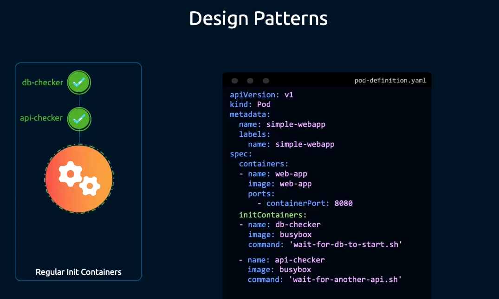
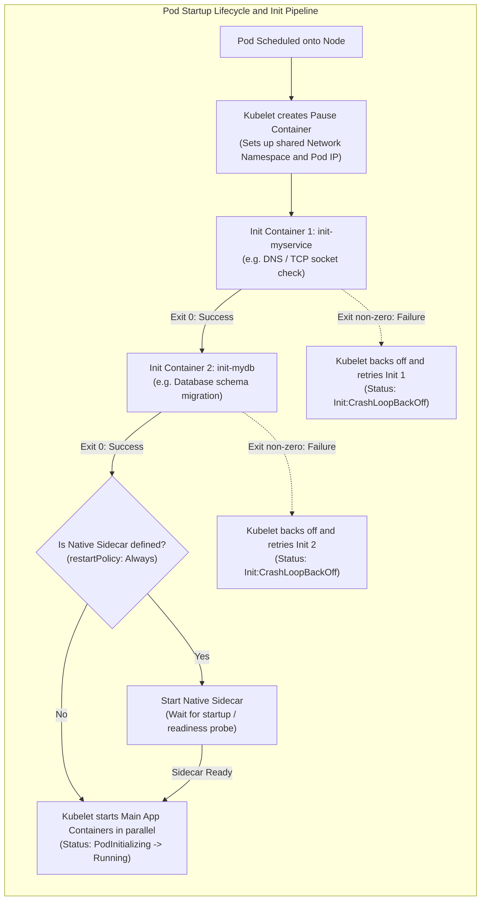
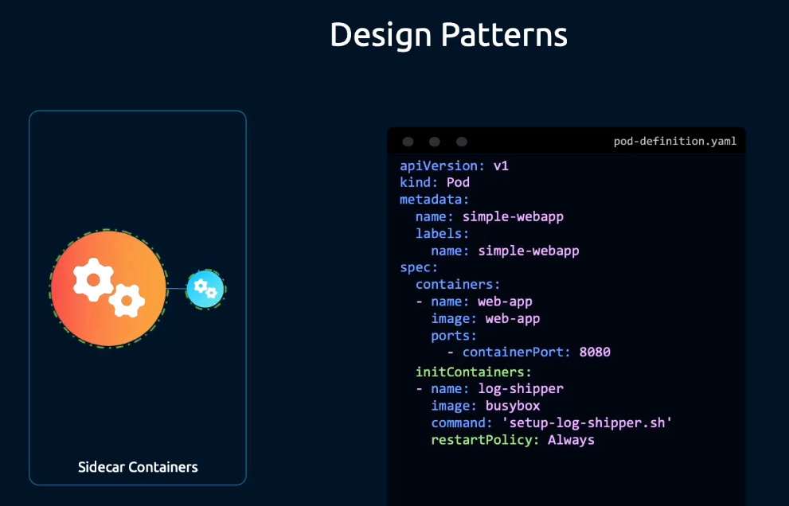
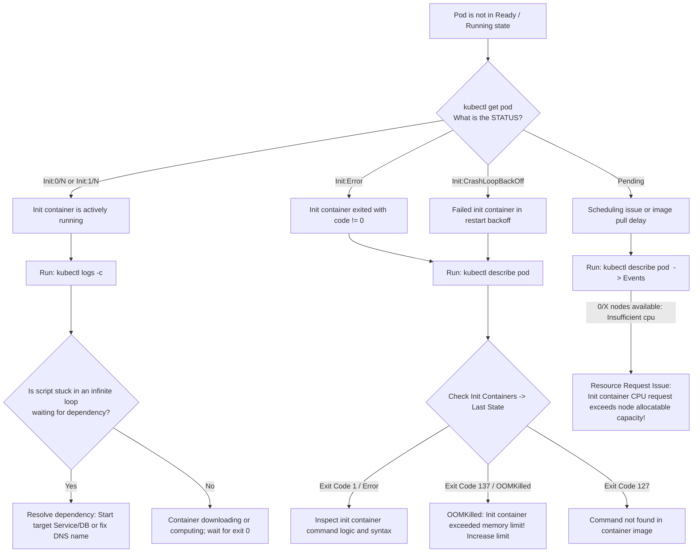

# InitContainers in Kubernetes - CKA Exam Notes

> **Exam Domain**: Application Lifecycle Management (15%) / Core Concepts  
> **Weight / Importance**: High (Core Pod initialization mechanism testing sequential execution order, exit code evaluation, restart policy behavior, status transition debugging, and native sidecar lifecycle)  
> **Target Version**: Verified against v1.31 / v1.32 (Current CKA Curriculum)  
> **Allowed Docs Search Keywords**: `Init Containers`, `Sidecar Containers`, `Pod lifecycle`, `restartPolicy: Always`  
> **Source**: Generated from `application-lifecycle-management/10-init-container-raw.md`

---

## 1. Quick-Reference Summary

- **Primary Role of Init Containers**:
  - Specialized containers that run and complete **before** application containers are started.
  - Used for prerequisite tasks: waiting for external services/databases to become reachable, running database migrations, cloning Git repositories, or generating dynamic configuration files into shared volumes.
- **Sequential Execution Order**:
  - Init containers execute strictly **one at a time**, in the exact order listed in `spec.initContainers[]`.
  - The next init container **will not start** until the previous init container exits successfully with exit code **`0`**.
- **Container vs. Pod Restart Mechanics**:
  - `spec.restartPolicy` (`Always`, `OnFailure`, `Never`) applies at the **container level**, enforced locally by Kubelet.
  - If an init container fails (exit code $\neq 0$):
    - If `restartPolicy: Always` or `OnFailure`: Kubelet restarts the failed init container with exponential backoff (10s, 20s, 40s... up to 5m). Pod status shows **`Init:Error`** or **`Init:CrashLoopBackOff`**.
    - If `restartPolicy: Never`: The entire Pod status immediately transitions to **`Failed`**.
- **Status String Progression**:
  - `Pending` $\to$ `Init:0/N` $\to$ `Init:1/N` $\to$ `PodInitializing` $\to$ `Running`.
- **Mandatory Idempotency**:
  - Init containers must be idempotent: if a node restarts or a subsequent container failure forces a Pod recreation, init containers run again from the beginning without corrupting state.
- **Resource Math for Scheduling**:
  - Effective Pod request = $\max\left(\sum \text{App Requests}, \max \text{Init Requests}\right)$.
  - Effective Pod limit = $\max\left(\sum \text{App Limits}, \max \text{Init Limits}\right)$.
- **Probe Restrictions on Regular Init Containers**:
  - Regular init containers **cannot** define `readinessProbe` or `livenessProbe` (they must run to completion, not serve readiness checks).
- **Native Sidecar Containers (`spec.initContainers[].restartPolicy: Always`)**:
  - Feature history: Alpha in v1.28, Beta (default enabled) in v1.29, GA in v1.31 / v1.32.
  - Declared inside `spec.initContainers[]` with `restartPolicy: Always`.
  - Starts in sequence before subsequent containers; stays running throughout the Pod lifetime; shuts down **after** main app containers exit.
  - **Can** define startup, liveness, and readiness probes.

---

## 2. Conceptual Overview & Mental Model

### Dual-Layer Architectural Understanding

- **Simple English Explanation (How It Works)**:
  - When an application starts, it often requires external conditions to be satisfied before it can safely accept traffic:
    - It needs a database schema migration to finish.
    - It needs an upstream service or cache to be online and reachable via DNS.
    - It needs an encryption certificate or license key downloaded into a shared directory.
  - If you put this pre-flight logic into the main application container, the application must contain complex retry code, shell utilities (`curl`, `nc`, `git`), and elevated database migration privileges, bloating the container image and expanding the security attack surface.
  - Kubernetes solves this by providing **Init Containers**.
  - Init containers run in an isolated environment with their own specialized utilities and privileges before the main application starts.
  - They execute in a strict linear pipeline. Only when every init container finishes cleanly with exit code `0` does Kubelet start the main application containers.



- **Formal Kubernetes Definition**:
  - An `Init Container` is a specialized container that runs before the application containers in a Pod. Init containers can contain utilities or setup scripts not present in an app image. They always run to completion, each container must complete successfully before the next one starts, and if an init container fails, Kubernetes restarts the Pod until the init container succeeds (unless `restartPolicy: Never` is set).



---

## 3. Deep-Dive Technical Breakdown

### 3.1 Lifecycle Execution Phases & Status String Progression

During pod creation, `kubectl get pods` reports several distinct status strings indicating the precise state of the initialization pipeline:

| Pod Phase / Status String | Technical Condition Behind the Status | Next Transition |
| :--- | :--- | :--- |
| **`Pending`** | Pod object accepted by API server and scheduled; container images not yet downloaded or container runtime not ready. | `Init:0/N` |
| **`Init:0/N`** | The first init container (of $N$ total) is actively running or pulling its image. | `Init:1/N` upon exit code 0 |
| **`Init:X/N`** | $X$ init containers have successfully finished with exit code `0`; init container $X+1$ is currently executing. | `Init:(X+1)/N` |
| **`Init:Error`** | An init container failed during execution (exited with a non-zero status code). | `Init:CrashLoopBackOff` |
| **`Init:CrashLoopBackOff`** | The failed init container is waiting in exponential backoff (10s, 20s, 40s... up to 300s) before Kubelet attempts to restart it. | Retries init container |
| **`PodInitializing`** | **All** init containers have exited with status `0`. Kubelet is now creating the main application containers. | `Running` |
| **`Running`** | At least one primary container has started and is running, or is passing readiness checks. | `Completed` or `Terminating` |

---

### 3.2 Container Restart Behavior & Idempotency

#### How Restart Policy Governs Failures
`spec.restartPolicy` governs how Kubelet reacts when an init container process exits:

```yaml
spec:
  restartPolicy: Always # Options: Always (default), OnFailure, Never
```

1. **`Always` (Default)**:
   - For regular init containers: If the container exits with a non-zero code, Kubelet restarts it. If it exits with `0`, Kubelet treats it as completed and starts the next container.
   - For native sidecars (`restartPolicy: Always` on the container): Restarts on any exit (zero or non-zero).
2. **`OnFailure`**:
   - Restarts the init container only when it exits with a non-zero status code.
3. **`Never`**:
   - If an init container fails (exit $\neq 0$), Kubelet does **not** retry the container. The entire Pod immediately transitions into the **`Failed`** phase.

#### Why Idempotency is Mandatory
Because Kubelet may restart an init container multiple times (due to node reboots, network glitches, or pre-flight timeouts), **init container scripts must be idempotent**:
- If an init container creates a database table: It must execute `CREATE TABLE IF NOT EXISTS`, not a raw `CREATE TABLE`.
- If an init container seeds data: It must verify if records already exist before attempting an insert.
- If an init container downloads a file: It should verify file integrity or use atomic replacement so partial downloads do not corrupt shared volumes.

---

### 3.3 Regular Init Containers vs. Application Containers

| Characteristic | Regular Init Containers | Primary Application Containers |
| :--- | :--- | :--- |
| **Manifest Section** | `spec.initContainers[]` | `spec.containers[]` |
| **Execution Timing** | Prior to any application container | Concurrently, after all inits succeed |
| **Execution Order** | Strictly linear and sequential ($1 \to 2 \to 3$) | Concurrent / parallel |
| **Completion Criteria** | **Must exit with status code 0** | Expected to run indefinitely |
| **Readiness / Liveness Probes** | **Prohibited** (fails schema validation) | Supported |
| **Lifecycle Hooks (`postStart` / `preStop`)** | Prohibited | Supported |
| **Service Endpoint Inclusion** | Never receives Service traffic | Included in Endpoints once `Ready` |
| **Resource Consumption** | Ephemeral (released upon exit) | Continuous throughout Pod life |

---

### 3.4 Native Sidecar Containers (`restartPolicy: Always` in `initContainers`)

> [!IMPORTANT]
> **Version & Currency Verification**:
> The raw note mentioned `Kubernetes 1.33+`. This is factually inaccurate.
> - **Alpha**: Kubernetes v1.28
> - **Beta (Enabled by Default)**: Kubernetes v1.29
> - **GA (Generally Available)**: Kubernetes v1.31 / v1.32
> Native sidecar containers are fully supported and enabled by default in all current CKA exam environments (v1.31 / v1.32).



#### How Native Sidecars Work Internally
When an entry under `spec.initContainers` defines `restartPolicy: Always`, Kubelet handles it differently from both regular init containers and regular app containers:

1. **Startup Execution**:
   - Kubelet starts the native sidecar in its declared position within the `initContainers` sequence.
   - If the sidecar has a **`startupProbe`** or **`readinessProbe`**, Kubelet waits until the probe passes before starting the next init container or app container.
   - Unlike regular init containers, the process is **not expected to exit**. Once ready, it remains running in the background.
2. **Pod Runtime**:
   - The native sidecar continues running concurrently alongside the primary application containers.
   - If the sidecar crashes, Kubelet restarts it immediately (enforcing its container-level `restartPolicy: Always`).
3. **Shutdown Order**:
   - When a Pod is terminated (e.g. Deployment scale-down, pod deletion, or batch Job completion):
     1. Kubelet sends `SIGTERM` to the primary application containers in `spec.containers[]`.
     2. The native sidecars remain operational, allowing them to finish capturing logs or draining network proxies.
     3. Only after all main containers have completely exited does Kubelet send `SIGTERM` to the native sidecars (in reverse declaration order).

---

### 3.5 Resource Scheduling Math for Init Containers

When `kube-scheduler` filters nodes for a Pod containing init containers, it applies the following equations:

$$\text{Effective Request} = \max\left(\sum_{i} \text{AppRequest}_i, \max_{j} \text{InitRequest}_j\right)$$

$$\text{Effective Limit} = \max\left(\sum_{i} \text{AppLimit}_i, \max_{j} \text{InitLimit}_j\right)$$

#### Concrete Calculation Example:
Consider a Pod with the following specifications:
- `Init Container 1`: Requests 500m CPU, 512Mi Memory
- `Init Container 2`: Requests 1000m CPU, 256Mi Memory
- `App Container 1`: Requests 300m CPU, 256Mi Memory
- `App Container 2`: Requests 300m CPU, 256Mi Memory

**Calculation**:
- Sum of App Container Requests:
  - $\text{CPU} = 300\text{m} + 300\text{m} = 600\text{m}$
  - $\text{Memory} = 256\text{Mi} + 256\text{Mi} = 512\text{Mi}$
- Maximum of Init Container Requests:
  - $\text{CPU} = \max(500\text{m}, 1000\text{m}) = 1000\text{m}$
  - $\text{Memory} = \max(512\text{Mi}, 256\text{Mi}) = 512\text{Mi}$
- **Effective Request for Scheduling**:
  - $\text{CPU} = \max(600\text{m}, 1000\text{m}) = \mathbf{1000\text{m}}$
  - $\text{Memory} = \max(512\text{Mi}, 512\text{Mi}) = \mathbf{512\text{Mi}}$

> [!WARNING]
> **Scheduling Trap**:
> Even though Init Container 2 only runs for 10 seconds during boot, the Pod requires a node with at least **1000m (1 core)** of allocatable CPU. If no node has 1000m CPU free, the Pod will remain permanently stuck in **`Pending`**!

---

## 4. Command Translation & Mapping Tables

### Comparison of Pod Manifest Blocks

| Parameter | Regular Init Container | Native Sidecar Container | Main Application Container |
| :--- | :--- | :--- | :--- |
| **Manifest Location** | `spec.initContainers[]` | `spec.initContainers[]` | `spec.containers[]` |
| **`restartPolicy`** | None (inherits Pod policy) | **`restartPolicy: Always`** | None (inherits Pod policy) |
| **Execution Trigger** | Completion of prior init container | Completion of prior init container | Completion of all init containers |
| **Readiness Probes** | Prohibited | **Supported** | Supported |
| **Liveness Probes** | Prohibited | **Supported** | Supported |
| **Expected Exit** | Must exit with status code `0` | Expected to run continuously | Expected to run continuously |
| **Shutdown Timing** | Exits before app starts | Terminates after app containers exit | Terminates during pod teardown |

---

## 5. High-Yield CLI & Imperative Commands

### 5.1 Declarative Manifest Patterns

#### Pattern A: Sequential Service Waiters
Waits for both `myservice` and `mydb` DNS records to resolve before starting the application:

```yaml
apiVersion: v1
kind: Pod
metadata:
  name: myapp-pod
  labels:
    app: myapp
spec:
  initContainers:
    # First init container: verifies myservice DNS
    - name: init-myservice
      image: busybox:1.36
      command: ["sh", "-c", "until nslookup myservice.default.svc.cluster.local; do echo 'Waiting for myservice...'; sleep 2; done;"]
    
    # Second init container: starts ONLY after init-myservice exits 0
    - name: init-mydb
      image: busybox:1.36
      command: ["sh", "-c", "until nslookup mydb.default.svc.cluster.local; do echo 'Waiting for mydb...'; sleep 2; done;"]

  containers:
    - name: myapp-container
      image: busybox:1.36
      command: ["sh", "-c", "echo The app is running! && sleep 3600"]
```

---

#### Pattern B: Native Sidecar with Readiness Gating
A native logging sidecar starting before the main application:

```yaml
apiVersion: v1
kind: Pod
metadata:
  name: sidecar-example
  namespace: default
spec:
  volumes:
    - name: log-vol
      emptyDir: {}

  initContainers:
    - name: sidecar-logger
      image: busybox:1.36
      restartPolicy: Always # Declares as native sidecar
      command: ["sh", "-c", "touch /var/log/app.log && tail -F /var/log/app.log"]
      volumeMounts:
        - name: log-vol
          mountPath: /var/log

  containers:
    - name: main-app
      image: busybox:1.36
      command: ["sh", "-c", "echo 'Main app starting' >> /var/log/app.log && sleep 3600"]
      volumeMounts:
        - name: log-vol
          mountPath: /var/log
```

---

### 5.2 High-Yield CLI Debugging Commands

```bash
# 1. Inspect Pod status and determine which init container is running/failing
kubectl get pod myapp-pod

# 2. View full Pod lifecycle events and init container exit codes
kubectl describe pod myapp-pod

# 3. View logs of a specific init container (Mandatory syntax: -c <container-name>)
kubectl logs myapp-pod -c init-myservice

# 4. View logs of previous crashed instance of an init container
kubectl logs myapp-pod -c init-myservice --previous

# 5. Extract init container statuses and exit codes using jsonpath
kubectl get pod myapp-pod -o jsonpath='{range .status.initContainerStatuses[*]}{.name}{": terminated="}{.state.terminated.reason}{", exitCode="}{.state.terminated.exitCode}{"\n"}{end}'

# 6. Stream logs from a running native sidecar container
kubectl logs sidecar-example -c sidecar-logger -f
```

---

## 6. Troubleshooting & Diagnostic Runbook

### Diagnostic Decision Tree



---

### Step-by-Step Triage Runbook

#### Scenario 1: Pod Stuck in `Init:0/2`
1. **Identify which init container is running**:
   ```bash
   kubectl describe pod myapp-pod
   ```
   Check the `Init Containers` section to see which one is in `State: Running`.
2. **Inspect the logs**:
   ```bash
   kubectl logs myapp-pod -c init-myservice
   ```
   Output:
   ```text
   Waiting for myservice...
   Server:    10.96.0.10
   Address:   10.96.0.10:53
   ** server can't find myservice.default.svc.cluster.local: NXDOMAIN
   ```
3. **Resolution**:
   - The init container is looping because Service `myservice` does not exist.
   - Deploy the missing Service:
     ```bash
     kubectl expose pod backend-pod --name=myservice --port=80
     ```
   - Once DNS resolves, `init-myservice` exits `0`, and Kubelet automatically triggers `init-mydb`.

---

#### Scenario 2: Pod Stuck in `Init:CrashLoopBackOff`
1. **Identify the failure**:
   ```bash
   kubectl describe pod myapp-pod
   ```
   Look for:
   ```text
   Init Containers:
     init-db:
       State:          Waiting
         Reason:       CrashLoopBackOff
       Last State:     Terminated
         Reason:       Error
         Exit Code:    1
   ```
2. **Inspect logs of the crashed container**:
   ```bash
   kubectl logs myapp-pod -c init-db
   ```
3. **Common causes**:
   - Syntax error in shell command.
   - Script executed a command that failed (e.g. `psql` connection refused).
   - Exit code was non-zero.
4. **Resolution**:
   - Correct the container `command` or script logic so that it handles transient network drops and terminates with `exit 0`.

---

#### Scenario 3: Init Container Terminated with Exit Code 137 (`OOMKilled`)
1. **Diagnosis**:
   - An init container compiling code, decompressing a large archive, or building assets exceeded its memory limit.
2. **Verification**:
   ```bash
   kubectl describe pod <pod-name>
   ```
   Look for: `Reason: OOMKilled`, `Exit Code: 137`.
3. **Resolution**:
   - Increase `spec.initContainers[].resources.limits.memory` in the Pod manifest.

---

## 7. CKA Exam Tips, Gotchas & Traps

> [!WARNING]
> **Trap 1: Probes on Regular Init Containers Cause API Rejections**
> - You **cannot** configure `livenessProbe`, `readinessProbe`, or `startupProbe` on regular init containers.
> - Attempting to apply a manifest with a probe on a regular init container will fail with:
>   `field is forbidden: readinessProbe is not supported for init containers`.
> - (Note: Native sidecars with `restartPolicy: Always` **do** support probes).

> [!IMPORTANT]
> **Trap 2: `kubectl logs` Requires `-c` on Pods with Init Containers**
> - Even before main app containers start, if you run `kubectl logs <pod-name>`, `kubectl` will reject the request if it cannot determine the target container:
>   ```bash
>   # CORRECT: Always specify the init container name
>   kubectl logs myapp-pod -c init-myservice
>   ```

> [!IMPORTANT]
> **Trap 3: Init Containers Run Sequentially, NOT Concurrently**
> - If `init-1` takes 30 seconds and `init-2` takes 30 seconds, Pod initialization will take at least 60 seconds.
> - If `init-1` hangs, `init-2` will never execute.

> [!WARNING]
> **Trap 4: The 1.33+ Version Misconception**
> - As noted earlier, Native Sidecar support (`restartPolicy: Always`) was introduced in **v1.28**, promoted to Beta in **v1.29**, and is fully GA in **v1.31 / v1.32**.
> - Do not believe claims that it requires v1.33. You can safely use `restartPolicy: Always` in your CKA exam (v1.31/v1.32).

> [!TIP]
> **Exam Speed Tip: Fast Init Container Manifest Injection**
> Generate a baseline Pod YAML and manually insert the `initContainers:` block directly above `containers:`:
> ```bash
> kubectl run myapp --image=busybox:1.36 --dry-run=client -o yaml > pod.yaml
> ```
> Edit `pod.yaml`:
> ```yaml
> spec:
>   initContainers:
>     - name: wait-svc
>       image: busybox:1.36
>       command: ['sh', '-c', 'sleep 5']
>   containers:
>     - name: myapp
>       image: busybox:1.36
> ```

---

## 8. Self-Test / Active Recall

1. **What status code must an init container exit with for Kubernetes to proceed to the next container?**
   <details><summary>Click to view answer</summary>
   It must exit with status code <b><code>0</code></b>. Any non-zero exit code is treated as a failure.
   </details>

2. **In what order do multiple init containers execute?**
   <details><summary>Click to view answer</summary>
   They execute <b>strictly sequentially</b>, one at a time, in the exact order declared in the <code>spec.initContainers[]</code> list.
   </details>

3. **What Pod status string is displayed when all init containers have completed successfully and Kubelet is creating the main app containers?**
   <details><summary>Click to view answer</summary>
   <b><code>PodInitializing</code></b>.
   </details>

4. **Can you define a `readinessProbe` on a regular init container?**
   <details><summary>Click to view answer</summary>
   <b>No.</b> Regular init containers run to completion and do not serve traffic; adding a readiness probe causes an API schema validation rejection. (Only native sidecars with <code>restartPolicy: Always</code> allow readiness probes).
   </details>

5. **What happens if an init container fails in a Pod where `spec.restartPolicy` is set to `Never`?**
   <details><summary>Click to view answer</summary>
   Kubelet will not retry the container. The entire Pod immediately transitions into the <b><code>Failed</code></b> phase.
   </details>

6. **How does Kubelet calculate total CPU requests for scheduling a Pod with 2 init containers requesting 100m and 400m, and an app container requesting 250m?**
   <details><summary>Click to view answer</summary>
   <b>400m CPU</b>. The calculation is \(\max(\sum \text{App Requests}, \max \text{Init Requests}) = \max(250\text{m}, \max(100\text{m}, 400\text{m})) = 400\text{m}\).
   </details>

7. **How do you declare a native sidecar container in Kubernetes v1.29+ / v1.31+?**
   <details><summary>Click to view answer</summary>
   Define the container inside <b><code>spec.initContainers</code></b> and add <b><code>restartPolicy: Always</code></b> to that container definition.
   </details>

8. **Why must init container commands and scripts be written idempotently?**
   <details><summary>Click to view answer</summary>
   Because an init container may be restarted multiple times by Kubelet (e.g. after a node reboot or transient crash). An idempotent script can run multiple times without duplicating data or corrupting state.
   </details>

9. **When a Pod with a native sidecar terminates, in what order are the containers shut down?**
   <details><summary>Click to view answer</summary>
   Kubelet terminates the <b>main application containers first</b>. The native sidecar remains active until all main containers have exited, then receives <code>SIGTERM</code>.
   </details>

10. **What command displays the logs of a previously crashed init container named `init-db`?**
    <details><summary>Click to view answer</summary>
    <code>kubectl logs &lt;pod-name&gt; -c init-db --previous</code>
    </details>

---

## 9. Official Documentation Bookmarks

| Page Title | Search Queries | Target Section / Direct URI Anchor |
| :--- | :--- | :--- |
| **Init Containers** | `Init Containers` | [Init Containers Understanding](https://kubernetes.io/docs/concepts/workloads/pods/init-containers/) |
| **Sidecar Containers** | `Sidecar Containers` | [Native Sidecar Containers](https://kubernetes.io/docs/concepts/workloads/pods/sidecar-containers/) |
| **Pod Lifecycle** | `Pod Lifecycle` | [Pod Status and Phases](https://kubernetes.io/docs/concepts/workloads/pods/pod-lifecycle/) |
| **Configure Pod Initialization** | `Configure Pod Initialization` | [Configure Pod Initialization](https://kubernetes.io/docs/tasks/configure-pod-container/configure-pod-initialization/) |
