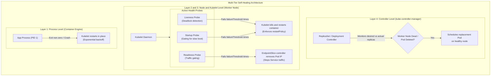
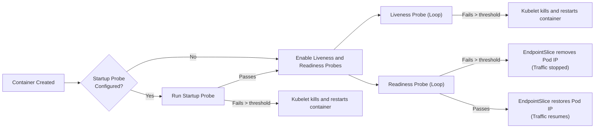
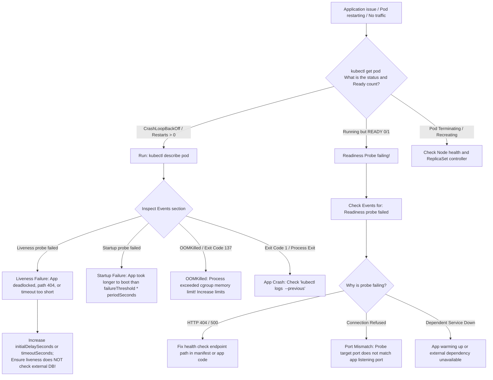

# Self-Healing Applications in Kubernetes - CKA Exam Notes

> **Exam Domain**: Application Lifecycle Management (15%) / Troubleshooting (30%)  
> **Weight / Importance**: High (Core resilience topic testing multi-layer self-healing, container restart policies, controller reconciliation loops, probe-based health checking, and Service endpoint isolation)  
> **Target Version**: Verified against v1.31 / v1.32 (Current CKA Curriculum)  
> **Allowed Docs Search Keywords**: `Configure Liveness, Readiness and Startup Probes`, `Pod Lifecycle`, `ReplicationController`, `ReplicaSet`, `Troubleshooting Applications`  
> **Source**: Generated from `application-lifecycle-management/11-self-healing-application-raw.md`

---

## 1. Quick-Reference Summary

- **The Four Layers of Kubernetes Self-Healing**:
  1. **Node System Level**: Linux `systemd` monitors and automatically restarts the `kubelet` daemon and container runtime engine (e.g. `containerd`).
  2. **Container Process Level**: `kubelet` detects process termination (`exit 1`, `SIGSEGV`, `SIGKILL`) and restarts the failed container in place according to `spec.restartPolicy` (`Always`, `OnFailure`, `Never`).
  3. **Application Health Level (Probes)**: `kubelet` performs active health checks:
     - **`livenessProbe`**: Detects deadlocks and frozen processes; **restarts the container** if failing.
     - **`readinessProbe`**: Detects when an app cannot process requests; **removes the Pod from Service Endpoints** without restarting.
     - **`startupProbe`**: Disables liveness and readiness checks during slow application startup; **restarts container** only if startup exceeds its timeout window.
  4. **Pod Replica & Node Failure Level**: The `ReplicaSet` / `Deployment` controller maintains the desired replica count. If a Pod is deleted or a worker node becomes unresponsive (`NodeNotReady`), the controller schedules replacement Pods onto healthy nodes.
- **Critical Curriculum Correction (CKA vs. CKAD)**:
  - While probe configuration syntax is shared with CKAD, **probe troubleshooting is heavily tested in the CKA exam** under the **Troubleshooting (30%)** domain (e.g. diagnosing why Pods are restarting in `CrashLoopBackOff`, why traffic is not reaching a Pod, or fixing broken probe ports/paths in manifests).
- **Restart Policy Scope**:
  - `spec.restartPolicy` applies at the **container level on the local node**, enforced by Kubelet.
  - Default: `Always` (standard for Deployments, StatefulSets, DaemonSets).
- **Exponential Restart Backoff**:
  - Consecutive container crashes trigger exponential restart delays enforced by Kubelet: 10s $\to$ 20s $\to$ 40s $\to$ 80s $\to$ 160s $\to$ max 300s (5 minutes). The backoff timer resets after the container runs successfully for 10 minutes.
- **Probe Action Handlers**:
  - `httpGet`: Expects HTTP status $200 \le \text{code} < 400$.
  - `tcpSocket`: Expects a successful TCP socket handshake.
  - `exec`: Expects the command inside the container to return exit code `0`.
  - `grpc`: Implements the standard gRPC Health Checking Protocol (GA in v1.27+).

---

## 2. Conceptual Overview & Mental Model

### Dual-Layer Architectural Understanding

- **Simple English Explanation (How It Works)**:
  - Traditional operations required human intervention or complex external watchdog scripts when an application crashed, became unresponsive, or a physical server lost power.
  - Kubernetes embeds automated self-healing at multiple distinct boundaries:
    - **Process Crashes**: If an application process crashes (e.g. out of memory or unhandled exception), Kubelet detects the exited PID and restarts the container immediately.
    - **Application Freezes / Deadlocks**: A process might still be running (PID exists), but its internal thread pool is deadlocked and cannot respond to requests. A **Liveness Probe** actively pings the application; if it fails, Kubelet terminates and restarts the container.
    - **Application Overload**: A container might be alive but temporarily overwhelmed with traffic or warming up an in-memory cache. A **Readiness Probe** signals Kubelet to temporarily disconnect the Pod from the Service load balancer so it receives no incoming traffic until it recovers.
    - **Node Death**: If a worker node crashes or loses network connectivity, the control plane's `node-lifecycle-controller` marks it `NotReady`, evicts the Pods, and the `ReplicaSet` controller creates brand-new replacement Pods on surviving nodes.

- **Formal Kubernetes Definition**:
  - Self-healing in Kubernetes is an autonomous control-loop mechanism whereby controllers continuously compare the current observed state of cluster resources against the desired state stored in etcd. Kubelet provides container-level lifecycle management and health probing, while workload controllers (ReplicaSets, Deployments, StatefulSets, DaemonSets) maintain high availability and replica counts across failure domains.



---

## 3. Deep-Dive Technical Breakdown

### 3.1 The Self-Healing Responsibility Matrix

| Failure Scenario | Detecting Component | Remediating Component | Self-Healing Mechanism |
| :--- | :--- | :--- | :--- |
| **Main Process Crash** (PID 1 exits) | Linux Kernel / Container Runtime | `kubelet` | Restarts container in place via `restartPolicy`. |
| **Application Deadlock** (PID 1 alive, frozen) | `kubelet` (via `livenessProbe`) | `kubelet` | Sends `SIGTERM`/`SIGKILL` to container and restarts it. |
| **Temporary Traffic Overload** | `kubelet` (via `readinessProbe`) | `kube-controller-manager` | Removes Pod IP from Service `EndpointSlices`. |
| **Slow Startup / Cold Cache** | `kubelet` (via `startupProbe`) | `kubelet` | Delays liveness probe execution until startup completes. |
| **Accidental Pod Deletion** | API Server watch event | `ReplicaSet` Controller | Recreates replacement Pod from template. |
| **Worker Node Hard Crash** | `node-lifecycle-controller` | `ReplicaSet` Controller | Evicts Pods after grace period; schedules replacements elsewhere. |
| **Kubelet Crash** | Linux Kernel (`systemd`) | `systemd` | Automatically restarts the `kubelet.service` daemon. |

---

### 3.2 Layer 1 & 2: Controller-Driven Self-Healing (ReplicaSets & ReplicationControllers)

#### ReplicationController vs. ReplicaSet
- **ReplicationController (Legacy)**:
  - Supported only **equality-based selectors** (`app = webapp`).
  - Predecessor to ReplicaSets; largely replaced in modern Kubernetes.
- **ReplicaSet (Modern)**:
  - Supports **set-based selectors** (`environment in (production, staging)`, `tier notin (frontend)`).
  - Managed declaratively by **Deployments**.

#### How Controller Reconciliation Works
The ReplicaSet controller runs an infinite reconciliation loop (`Reconcile()`):

$$\Delta = \text{Desired Replicas} - \text{Current Ready Matching Pods}$$

- If $\Delta > 0$: The controller creates $\Delta$ new Pods via the API server.
- If $\Delta < 0$: The controller deletes $|\Delta|$ Pods, prioritizing Pods in pending/unready states or those on nodes with higher replica density.
- If a Pod is manually deleted (`kubectl delete pod <name>`), the controller detects $\Delta = 1$ and creates an exact clone instantly.

#### Node Failure Eviction Sequence
1. A worker node stops communicating heartbeats to the API server.
2. After `node-monitor-grace-period` (default: 40 seconds), the node controller marks the node `NotReady`.
3. The node controller applies the taint `node.kubernetes.io/unreachable:NoExecute`.
4. Pods without explicit tolerations wait for `tolerationSeconds` (default: **300 seconds / 5 minutes**).
5. Once the timeout expires, the control plane evicts the Pods from the dead node.
6. The ReplicaSet controller notices the missing replicas and creates new Pods, which `kube-scheduler` assigns to healthy surviving nodes.

---

### 3.3 Layer 3: Kubelet Container Process Restart Policy

Every Pod specification defines a `restartPolicy`:

```yaml
spec:
  restartPolicy: Always # Always (default), OnFailure, Never
```

- **`Always`**:
  - Restarts the container upon **any exit**, whether exit code `0` (success) or non-zero (failure).
  - Mandatory for continuous background services (web servers, databases, microservices).
- **`OnFailure`**:
  - Restarts the container **only if it exits with a non-zero status code** or is terminated by the runtime (e.g. OOM killed).
  - Ideal for batch workloads (`Jobs`), where successful completion (`exit 0`) should terminate cleanly.
- **`Never`**:
  - Does not restart the container under any circumstance.
- **CrashLoopBackOff Mechanics**:
  - When a container repeatedly crashes, Kubelet implements an exponential delay to prevent thrashing node CPU and saturating disk I/O:
    $$\text{Backoff Delay} = \min\left(10\text{s} \times 2^{n-1}, 300\text{s}\right)$$
  - Progression: 10s $\to$ 20s $\to$ 40s $\to$ 80s $\to$ 160s $\to$ 300s.
  - If the container remains running steadily for **10 minutes**, Kubelet resets the backoff timer to 0.

---

### 3.4 Layer 4: Health Probes Technical Breakdown

Kubernetes provides three specialized probes executed directly by Kubelet:



#### 1. Startup Probe (`startupProbe`)
- **Primary Function**: Protects slow-starting, legacy, or heavy JVM applications during their initialization window.
- **Behavior**:
  - Disables both Liveness and Readiness probes until the startup probe succeeds.
  - If it fails more than `failureThreshold` times, Kubelet terminates the container and restarts it.
- **Maximum Boot Budget Formula**:
  $$\text{Max Boot Time} = \text{failureThreshold} \times \text{periodSeconds}$$
  *(e.g. `failureThreshold: 30`, `periodSeconds: 10` grants the application up to 300 seconds (5 minutes) to complete its boot sequence without being prematurely killed by the liveness probe).*

#### 2. Liveness Probe (`livenessProbe`)
- **Primary Function**: Detects internal deadlocks, infinite loops, memory leaks, or frozen threads where the application process is running but cannot make progress.
- **Action on Failure**: **Restarts the container**.
- **Crucial Rule**: Never point a liveness probe to an external dependency (such as an external database or cache). If the external database is down, the liveness probe will fail and cause all application pods across the cluster to restart in an infinite cascade loop!

#### 3. Readiness Probe (`readinessProbe`)
- **Primary Function**: Determines whether a container is ready to accept user network traffic.
- **Action on Failure**: **Does NOT restart the container!** Kubelet sets the Pod's `Ready` condition to `False`. The `EndpointSlice` controller immediately removes the Pod IP from all matching Service backends.
- **Use Case**: Warming up caches, loading large machine learning models, or temporary rate limiting / throttling. When the app recovers and the probe passes, the Pod IP is seamlessly restored to Service endpoints.

---

### 3.5 Probe Action Handlers Reference

| Handler Syntax | Execution Mechanism | Success Criteria | Failure Criteria |
| :--- | :--- | :--- | :--- |
| **`httpGet`** | Kubelet sends an HTTP `GET` request directly to the container's IP and specified port. | HTTP Status Code $200 \le \text{code} < 400$ | HTTP Status Code $\ge 400$ or connection timeout/refusal. |
| **`tcpSocket`** | Kubelet attempts to establish a TCP three-way handshake on the specified port. | TCP socket connects successfully. | Connection refused, reset, or timeout. |
| **`exec`** | Kubelet executes a specified command inside the container namespace via the CRI. | Command exits with status code **`0`**. | Command exits with non-zero status code or times out. |
| **`grpc`** | Kubelet calls the standard gRPC Health Check service (`grpc.health.v1.Health`). | gRPC response status is `SERVING`. | Response status is not `SERVING`, or connection timeout. |

---

## 4. Command Translation & Mapping Tables

### Probe Parameters Reference

| Manifest Parameter | Default Value | Description / Operational Impact |
| :--- | :--- | :--- |
| `initialDelaySeconds` | `0` | Number of seconds to wait after container start before executing the first probe. |
| `periodSeconds` | `10` | How often (in seconds) to perform the probe check. |
| `timeoutSeconds` | `1` | Number of seconds after which the probe times out if no response is received. |
| `successThreshold` | `1` | Minimum consecutive successes required to transition from failed to healthy (must be `1` for liveness and startup). |
| `failureThreshold` | `3` | Number of consecutive failures required before Kubelet takes action (restart or endpoint removal). |

---

### Probe Types Functional Comparison

| Dimension | `startupProbe` | `livenessProbe` | `readinessProbe` |
| :--- | :--- | :--- | :--- |
| **Operational Goal** | Gating slow application startup | Catching deadlocks / zombie processes | Protecting client traffic during overload |
| **Remediation Action** | Restarts container | Restarts container | Isolates Pod from Service Endpoints |
| **Execution Window** | Only during initial startup | Continuous throughout Pod life | Continuous throughout Pod life |
| **Impact on Other Probes** | Blocks liveness and readiness | None | None |
| **Service Traffic Impact** | Endpoints remain excluded | Container terminates (drops active connections) | **Stops new traffic cleanly without killing process** |

---

## 5. High-Yield CLI & Imperative Commands

### 5.1 Comprehensive Declarative Manifest: All Probes Combined

```yaml
apiVersion: v1
kind: Pod
metadata:
  name: resilient-webapp
  namespace: default
  labels:
    app: resilient-webapp
spec:
  restartPolicy: Always
  containers:
    - name: webapp
      image: nginx:1.25-alpine
      ports:
        - containerPort: 80
          name: http-port

      # 1. Startup Probe: Allows up to 60 seconds (12 * 5s) for slow boot
      startupProbe:
        httpGet:
          path: /healthz
          port: http-port
        failureThreshold: 12
        periodSeconds: 5

      # 2. Liveness Probe: Checks if the app is responsive; restarts if deadlocked
      livenessProbe:
        httpGet:
          path: /healthz
          port: http-port
        periodSeconds: 10
        timeoutSeconds: 2
        failureThreshold: 3

      # 3. Readiness Probe: Gating incoming Service traffic
      readinessProbe:
        httpGet:
          path: /ready
          port: http-port
        initialDelaySeconds: 5
        periodSeconds: 5
        failureThreshold: 2
```

---

### 5.2 Alternative Probe Handlers

#### `exec` Command Probe (Lock File or Database Check)
```yaml
livenessProbe:
  exec:
    command:
      - cat
      - /tmp/healthy
  initialDelaySeconds: 5
  periodSeconds: 5
```

#### `tcpSocket` Probe (Raw Port Check)
```yaml
readinessProbe:
  tcpSocket:
    port: 3306
  initialDelaySeconds: 10
  periodSeconds: 5
```

---

### 5.3 Diagnostic & Verification Commands

```bash
# 1. Inspect Pod lifecycle events to identify probe failures
kubectl describe pod resilient-webapp

# 2. Check if a Pod is excluded from Service Endpoints due to readiness failure
kubectl get endpoints resilient-webapp-service

# 3. Check EndpointSlices for detailed ready condition
kubectl get endpointslices -l kubernetes.io/service-name=resilient-webapp-service

# 4. View logs of a previously crashed container instance
kubectl logs resilient-webapp --previous

# 5. Filter Pods showing high restart counts across the cluster
kubectl get pods -A --sort-by='.status.containerStatuses[0].restartCount'

# 6. Watch Pod status transitions in real time during a failure
kubectl get pods -l app=resilient-webapp -w
```

---

## 6. Troubleshooting & Diagnostic Runbook

### Diagnostic Decision Tree



---

### Step-by-Step Triage Runbook

#### Symptom 1: Container in `CrashLoopBackOff` Due to Failed Liveness Probe
1. **Identify the failure in Pod events**:
   ```bash
   kubectl describe pod <pod-name>
   ```
   Output:
   ```text
   Warning  Unhealthy  15s (x3 over 35s)  kubelet  Liveness probe failed: HTTP probe failed with statuscode: 500
   Normal   Killing    15s                kubelet  Container webapp failed liveness probe, will be restarted
   ```
2. **Review application logs prior to the restart**:
   ```bash
   kubectl logs <pod-name> --previous
   ```
3. **Common root causes**:
   - The probe endpoint (`/healthz`) returns `500 Internal Server Error` because an unhandled exception occurred.
   - The probe checked an external database that had an outage, killing healthy web pods.
   - `timeoutSeconds: 1` was too aggressive during peak load, causing slow responses to be marked as failures.
4. **Resolution**:
   - Fix the application bug or decouple external dependencies from liveness checks.
   - Increase `timeoutSeconds` or `failureThreshold`.

---

#### Symptom 2: Pod Status is `Running` but `READY` is `0/1` (No Service Traffic)
1. **Inspect Pod describe output**:
   ```bash
   kubectl describe pod <pod-name>
   ```
   Output:
   ```text
   Warning  Unhealthy  8s (x4 over 25s)  kubelet  Readiness probe failed: Get "http://10.244.1.25:8080/ready": dial tcp 10.244.1.25:8080: connect: connection refused
   ```
2. **Verify Service Endpoints**:
   ```bash
   kubectl get endpoints <service-name>
   ```
   Observe that `ENDPOINTS` is empty (`<none>`).
3. **Diagnosis**:
   - The container is running, but the readiness probe is targeting port `8080`, while the application actually listens on port `80`.
4. **Resolution**:
   - Correct the target port in `readinessProbe.httpGet.port`.
   - Once corrected, the readiness probe passes, `READY` becomes `1/1`, and Kubelet immediately registers the Pod IP in the Service Endpoints.

---

## 7. CKA Exam Tips, Gotchas & Traps

> [!WARNING]
> **Trap 1: The "Probes are only for CKAD" Myth**
> - While authoring advanced probes from scratch is prominent in CKAD, **troubleshooting broken probes is a frequent CKA task**:
>   - A scenario might provide a broken Deployment where Pods are cycling in `CrashLoopBackOff`. The root cause is often a typo in `livenessProbe.httpGet.path` (e.g. `/healt` instead of `/healthz`) or an invalid port.
>   - Always check `kubectl describe pod` events first!

> [!IMPORTANT]
> **Trap 2: Liveness Probes Checking External Dependencies (The Cascade Crash Trap)**
> - A liveness probe should **only** verify the internal health of the container itself.
> - If you configure a liveness probe to query an external MySQL database, and the MySQL database experiences a temporary hiccup, **every single application container in your cluster will fail its liveness probe and restart simultaneously**, causing a massive self-inflicted outage.
> - Use readiness probes (not liveness probes) if you need to gate traffic based on external backend availability.

> [!WARNING]
> **Trap 3: Premature Termination of Slow Applications**
> - If a Java or Python application requires 45 seconds to load application contexts and warm its cache, setting `initialDelaySeconds: 5` on a liveness probe with default thresholds ($3 \times 10\text{s} = 30\text{s}$) will kill the container at second 35, before it ever finishes booting!
> - The container will enter a perpetual crash loop.
> - **Solution**: Add a **`startupProbe`** with generous `failureThreshold` (e.g. `failureThreshold: 30`, `periodSeconds: 5` gives 150s), or increase `initialDelaySeconds`.

> [!TIP]
> **Exam Speed Tip: Fast Readiness Check Verification**
> If a question asks why a Service is returning `503 Service Unavailable` or connection refused:
> ```bash
> # 1. Check endpoints immediately
> kubectl get endpoints <svc-name>
>
> # 2. If <none>, check Pod readiness
> kubectl get pods -l <selector>
> ```
> If `READY` is `0/1`, the readiness probe is the culprit!

---

## 8. Self-Test / Active Recall

1. **What component on a worker node is responsible for executing health probes and restarting crashed containers?**
   <details><summary>Click to view answer</summary>
   The <b><code>kubelet</code></b> daemon.
   </details>

2. **What action does Kubelet take when a `readinessProbe` fails? Does it restart the container?**
   <details><summary>Click to view answer</summary>
   <b>No, it does NOT restart the container.</b> Kubelet sets the Pod's <code>Ready</code> condition to <code>False</code>, which prompts the EndpointSlice controller to remove the Pod IP from matching Service backends.
   </details>

3. **What action does Kubelet take when a `livenessProbe` fails?**
   <details><summary>Click to view answer</summary>
   Kubelet terminates the container process (sending <code>SIGTERM</code> followed by <code>SIGKILL</code> if necessary) and <b>restarts the container</b> in place according to <code>spec.restartPolicy</code>.
   </details>

4. **Why is a `startupProbe` preferred over setting a very large `initialDelaySeconds` on a `livenessProbe`?**
   <details><summary>Click to view answer</summary>
   A large <code>initialDelaySeconds</code> delays deadlock detection for the entire duration even if the app boots fast on healthy runs. A <code>startupProbe</code> polls frequently and enables liveness checks the moment the application becomes ready, providing fast boot responsiveness while retaining deadlock protection.
   </details>

5. **What is the maximum backoff delay Kubelet enforces between container restarts during a `CrashLoopBackOff`?**
   <details><summary>Click to view answer</summary>
   <b>300 seconds (5 minutes)</b>.
   </details>

6. **If an application process exits with status code 0 in a Pod with `restartPolicy: OnFailure`, will Kubelet restart it?**
   <details><summary>Click to view answer</summary>
   <b>No.</b> <code>OnFailure</code> only restarts containers that exit with a non-zero exit code.
   </details>

7. **What is the difference between how a ReplicationController and a ReplicaSet select Pods?**
   <details><summary>Click to view answer</summary>
   A <b>ReplicationController</b> only supports equality-based selectors (e.g. <code>app = web</code>), whereas a <b>ReplicaSet</b> supports set-based selectors (e.g. <code>environment in (prod, staging)</code>).
   </details>

8. **If a worker node crashes, how long does the control plane wait by default before evicting Pods to other nodes?**
   <details><summary>Click to view answer</summary>
   By default, the <code>node-monitor-grace-period</code> is 40 seconds (marking the node <code>NotReady</code>), followed by a default pod eviction toleration timeout of <b>300 seconds (5 minutes)</b>.
   </details>

9. **What range of HTTP status codes are considered successful by an `httpGet` probe?**
   <details><summary>Click to view answer</summary>
   Any status code greater than or equal to 200 and less than 400 (\(200 \le \text{status} < 400\)).
   </details>

10. **What command allows you to view the logs of an application container that was killed 20 seconds ago by a failed liveness probe?**
    <details><summary>Click to view answer</summary>
    <code>kubectl logs &lt;pod-name&gt; -c &lt;container-name&gt; --previous</code>
    </details>

---

## 9. Official Documentation Bookmarks

| Page Title | Search Queries | Target Section / Direct URI Anchor |
| :--- | :--- | :--- |
| **Configure Liveness, Readiness and Startup Probes** | `Configure Liveness, Readiness and Startup Probes` | [Define a liveness HTTP request](https://kubernetes.io/docs/tasks/configure-pod-container/configure-liveness-readiness-startup-probes/#define-a-liveness-http-request) |
| **Pod Lifecycle** | `Pod Lifecycle` | [Container Probes](https://kubernetes.io/docs/concepts/workloads/pods/pod-lifecycle/#container-probes) |
| **ReplicaSet** | `ReplicaSet` | [How a ReplicaSet Works](https://kubernetes.io/docs/concepts/workloads/controllers/replicaset/) |
| **Troubleshooting Applications** | `Troubleshooting Applications` | [Debugging Pods](https://kubernetes.io/docs/tasks/debug/debug-application/debug-pods/) |
