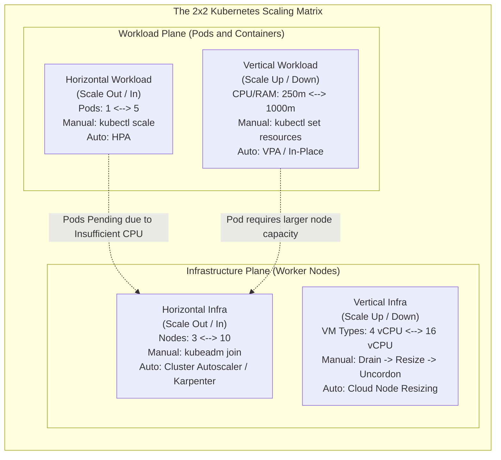
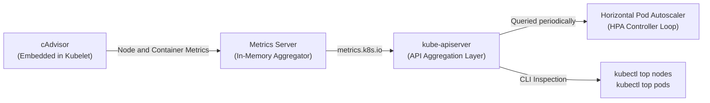
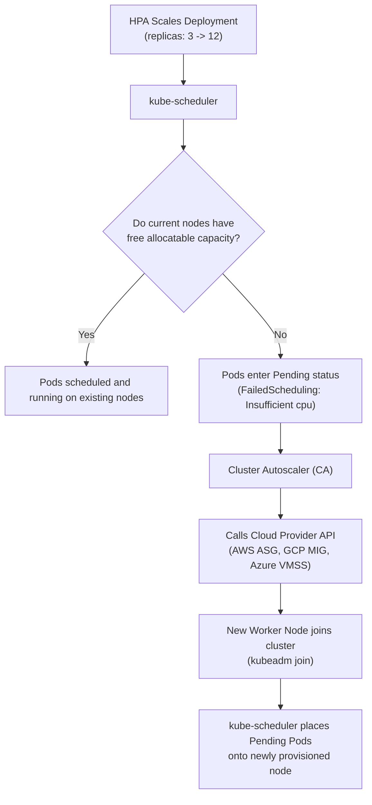
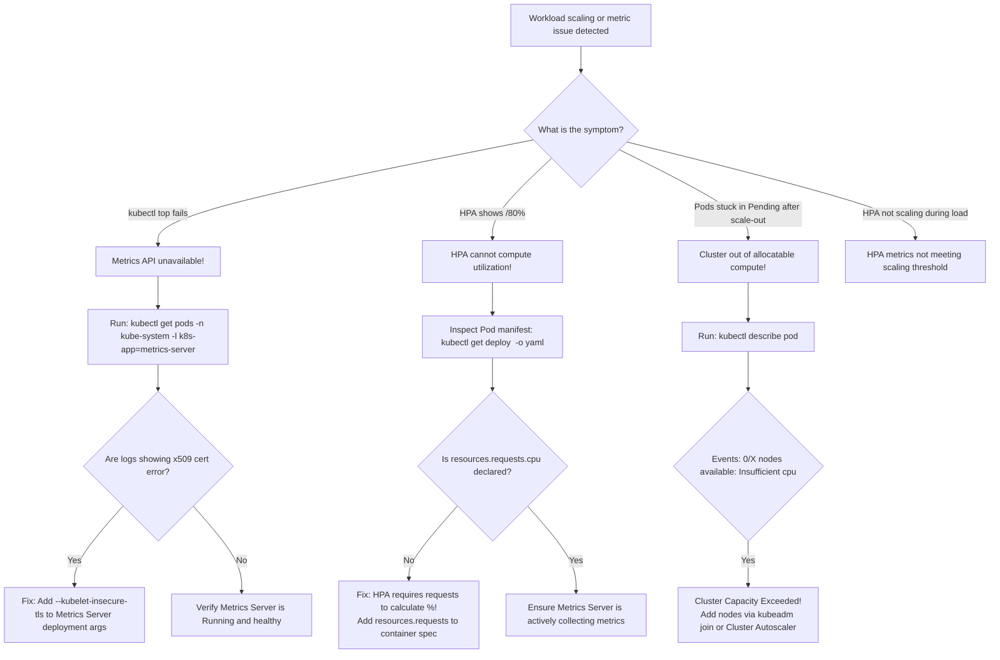

# Introduction to Autoscaling in Kubernetes - CKA Exam Notes

> **Exam Domain**: Application Lifecycle Management (15%) / Cluster Architecture, Installation & Configuration (25%)  
> **Weight / Importance**: High (Foundational scaling concepts testing imperative scaling, declarative configuration, workload vs. infrastructure scaling, HPA vs. VPA distinctions, and metrics pipeline integration)  
> **Target Version**: Verified against v1.31 / v1.32 (Current CKA Curriculum)  
> **Allowed Docs Search Keywords**: `HorizontalPodAutoscaler`, `kubectl scale`, `Resource metrics pipeline`, `Autoscaling`, `Cluster Autoscaler`  
> **Source**: Generated from `application-lifecycle-management/12-introduction-to-autoscaling-raw.md`

---

## 1. Quick-Reference Summary

- **The Two Core Dimensions of Scaling**:
  - **Workload Scaling**: Adding/removing Pods or altering container resource allocations inside the cluster.
  - **Cluster Infrastructure Scaling**: Adding/removing worker node machines or altering underlying compute instance types.
- **The Two Modalities of Scaling**:
  - **Horizontal Scaling ("Scaling Out / In")**: Adding or removing instances (Pods or Nodes).
  - **Vertical Scaling ("Scaling Up / Down")**: Increasing or decreasing compute resources (CPU, Memory) allocated to existing instances.
- **The 2x2 Kubernetes Scaling Matrix**:
  1. *Workload Horizontal*: **Manual**: `kubectl scale deployment <name> --replicas=N`. **Automated**: `HorizontalPodAutoscaler` (HPA).
  2. *Workload Vertical*: **Manual**: `kubectl edit` / `kubectl set resources`. **Automated**: `VerticalPodAutoscaler` (VPA) / In-Place Pod Resizing.
  3. *Infrastructure Horizontal*: **Manual**: Provision VM and execute `kubeadm join`. **Automated**: Kubernetes `Cluster Autoscaler` (CA) / `Karpenter`.
  4. *Infrastructure Vertical*: **Manual**: Drain node, resize VM/hardware, uncordon. **Automated**: Dynamic instance resizing via cloud provider.
- **The Metrics Pipeline Prerequisite**:
  - Automated workload autoscaling requires **Metrics Server** (`metrics.k8s.io`).
  - HPA cannot compute percentage-based CPU/memory scaling unless container **`resources.requests`** are explicitly declared in the Pod manifest!
- **HPA vs. VPA Coexistence Rule**:
  - Do **NOT** configure both HPA and VPA to scale on the same resource metric (e.g. CPU or Memory) on the same workload. They will enter a thrashing contention loop.
  - HPA and VPA can coexist only when HPA scales on **custom/external metrics** (e.g. HTTP request rate, queue depth) while VPA manages **CPU/memory resource limits**.

---

## 2. Conceptual Overview & Mental Model

### Dual-Layer Architectural Understanding

- **Simple English Explanation (How It Works)**:
  - In production, application traffic is never constant; it surges during marketing campaigns or peak business hours and plummets during nights and weekends.
  - Running a fixed number of massive containers wastes expensive cloud compute during idle periods; conversely, running too few containers causes service latency, connection drops, and outages during traffic spikes.
  - Kubernetes approaches scaling along two distinct architectural planes:
    - **Workload Level**: Modulating the application footprint. You either create more Pod replicas across your existing cluster nodes (**Horizontal Pod Autoscaling**) or expand the CPU/RAM boundaries allocated to your existing containers (**Vertical Pod Autoscaling**).
    - **Infrastructure Level**: Modulating the underlying physical or virtual server capacity. When your cluster runs out of allocatable CPU or RAM, new Pods get stuck in `Pending`. You expand cluster capacity by joining new worker nodes to the control plane (**Cluster Autoscaler**).


- **Formal Kubernetes Definition**:
  - Autoscaling is a closed-loop control system that dynamically adjusts compute resources based on real-time utilization telemetry. The Horizontal Pod Autoscaler automatically updates workload resources (such as Deployments or StatefulSets) to match demand, while the Cluster Autoscaler adjusts the size of the Kubernetes node pool when pods fail to schedule due to resource constraints or when nodes are consistently underutilized.



---

## 3. Deep-Dive Technical Breakdown

### 3.1 The 2x2 Scaling Archetypes Reference

| Dimension | Target Object | Manual Trigger | Automated Controller | Primary Advantage | Primary Limitation |
| :--- | :--- | :--- | :--- | :--- | :--- |
| **Workload Horizontal** | `Deployment`, `StatefulSet`, `ReplicaSet` | `kubectl scale --replicas=N` | `HorizontalPodAutoscaler` (HPA) | Rapidly absorbs traffic spikes without downtime | Application must be stateless and horizontally scalable |
| **Workload Vertical** | Container `resources` | `kubectl edit`, `kubectl set resources` | `VerticalPodAutoscaler` (VPA) | Optimizes resource rightsizing; prevents OOM | Standard VPA requires Pod recreation/restart |
| **Cluster Horizontal** | Worker Nodes (`Node`) | Provision VM and execute `kubeadm join` | Kubernetes `Cluster Autoscaler` (CA) / `Karpenter` | Dynamically expands physical cluster capacity | Dependent on cloud provider VM provisioning latency (1-3 min) |
| **Cluster Vertical** | Node hardware / VM flavor | Drain node, shut down VM, upgrade CPU/RAM, restart | Cloud vendor instance scaling | Accommodates single massive monolithic pods | Requires node downtime and pod eviction |

---

### 3.2 The Metrics Collection Pipeline (`metrics.k8s.io`)

Automated scaling decisions depend on continuous resource consumption telemetry:



1. **cAdvisor**: Embedded directly inside the `kubelet` binary on every worker node; reads raw CPU, memory, filesystem, and network statistics directly from the Linux `cgroups` hierarchy.
2. **Metrics Server**: A cluster-wide aggregator that scrapes summary metrics from all Kubelets over HTTPS, stores them in memory, and registers the **`metrics.k8s.io`** API group with `kube-apiserver`.
3. **Consumers**:
   - `kubectl top nodes` / `kubectl top pods`: For human operator inspection.
   - HPA Controller Loop: Evaluates target metrics every 15 seconds (default).

> [!IMPORTANT]
> **The `resources.requests` Requirement**:
> HPA computes percentage utilization as:
> $$\text{Utilization} = \frac{\text{Current Actual Usage}}{\text{Container Resource Request}} \times 100\%$$
> If a Pod manifest does **not** specify `resources.requests.cpu`, HPA cannot compute percentage utilization and the HPA status will report `<unknown>/80%`.

---

### 3.3 Automated Workload Scaling: HPA vs. VPA


#### Horizontal Pod Autoscaler (HPA)
- **Role**: Adjusts the number of Pod replicas based on observed CPU/memory utilization or custom application metrics.
- **Core Formula**:
  $$\text{Desired Replicas} = \left\lceil \text{Current Replicas} \times \left( \frac{\text{Current Metric Value}}{\text{Target Metric Value}} \right) \right\rceil$$
- **Characteristics**:
  - Tracks multiple metrics concurrently (scales on whichever metric demands the highest replica count).
  - Keeps existing Pods running uninterrupted while adding new Pods.
  - Native to core Kubernetes (`autoscaling/v2`).

#### Vertical Pod Autoscaler (VPA)
- **Role**: Automatically analyzes historical and real-time CPU/memory consumption to adjust container `requests` and `limits`.
- **Three Internal Components**:
  1. **Recommender**: Monitors metrics and calculates recommended CPU and memory values.
  2. **Updater**: Evicts Pods whose resource allocations deviate significantly from recommendations.
  3. **Admission Webhook**: Mutates the resource fields of newly created replacement Pods before they are scheduled.
- **Characteristics**:
  - Optimizes costs by preventing over-provisioned idle allocations.
  - Traditional VPA requires **restarting Pods** to apply updated resource boundaries.
  - Subproject under `autoscaler` (installed via CRDs, not built into base `kube-controller-manager`).

---

### 3.4 Key Architectural Differences: HPA vs. VPA


| Evaluation Criteria | Vertical Pod Autoscaler (VPA) | Horizontal Pod Autoscaler (HPA) |
| :--- | :--- | :--- |
| **Scaling Mechanism** | Increases or decreases CPU and Memory of existing Pods | Adds or removes Pod instances based on load |
| **Pod Runtime Behavior** | Restarts Pods to apply new resource values (prior to in-place resize) | Keeps existing Pods running without disruption |
| **Handles Rapid Spikes?** | **No**. Pod restarts add latency during sudden traffic bursts | **Yes**. Rapidly schedules additional parallel replicas |
| **Cost Optimization** | Prevents over-provisioning of CPU and Memory allocations | Eliminates unnecessary idle Pod replicas |
| **Optimal Workload Type** | StatefulSets, single-replica databases (MySQL, Postgres), JVM heaps | Stateless microservices, REST APIs, message queue consumers |
| **Primary Metric Sources** | Sustained average CPU and Memory consumption | Real-time CPU, Memory, HTTP request rate, Queue depth |

---

### 3.5 Infrastructure Scaling: Cluster Autoscaler

When workload autoscalers (HPA) expand replica counts, the cluster may exhaust all available CPU/memory capacity on its current nodes:



- **Scale-Up Condition**: Triggered immediately when one or more Pods cannot be scheduled on any existing node due to resource constraints (`FailedScheduling`).
- **Scale-Down Condition**: Triggered when a node has been consistently underutilized for a prolonged duration (default: 10 minutes) and all its non-DaemonSet Pods can be safely relocated to other existing nodes.

---

## 4. Command Translation & Mapping Tables

### Workload Scaling: Imperative CLI vs. Declarative YAML

| Scaling Operation | Imperative CLI Command | Declarative YAML Snippet |
| :--- | :--- | :--- |
| **Scale Deployment Replicas** | `kubectl scale deployment web-app --replicas=5` | `apiVersion: apps/v1`<br/>`kind: Deployment`<br/>`spec:`<br/>`  replicas: 5` |
| **Conditional Replica Scale** | `kubectl scale deploy web-app --current-replicas=2 --replicas=6` | Handled via CI/CD GitOps pipelines |
| **Scale StatefulSet** | `kubectl scale statefulset db-node --replicas=3` | `apiVersion: apps/v1`<br/>`kind: StatefulSet`<br/>`spec:`<br/>`  replicas: 3` |
| **Create HPA on Deployment** | `kubectl autoscale deploy web-app --min=2 --max=10 --cpu-percent=80` | `apiVersion: autoscaling/v2`<br/>`kind: HorizontalPodAutoscaler`<br/>`spec:`<br/>`  minReplicas: 2`<br/>`  maxReplicas: 10` |
| **Set Container Requests/Limits** | `kubectl set resources deploy web-app -c=app --requests=cpu=250m,memory=512Mi` | `spec.template.spec.containers[0]:`<br/>`  resources:`<br/>`    requests: { cpu: 250m, memory: 512Mi }` |

---

## 5. High-Yield CLI & Imperative Commands

### 5.1 Manual Workload Scaling Commands

```bash
# 1. Scale a Deployment immediately to 4 replicas
kubectl scale deployment my-app --replicas=4

# 2. Scale a Deployment conditionally (only scales if current count matches 2)
kubectl scale deployment my-app --current-replicas=2 --replicas=5

# 3. Scale multiple Deployments simultaneously
kubectl scale deployment web-frontend api-backend --replicas=3

# 4. Scale a ReplicaSet directly
kubectl scale rs my-app-58b4f8496c --replicas=2

# 5. Scale a StatefulSet
kubectl scale statefulset redis-cluster --replicas=6
```

---

### 5.2 Imperative HPA Creation & Telemetry Inspection

```bash
# 1. Autoscale a Deployment maintaining an average CPU target of 75%
kubectl autoscale deployment my-app \
  --min=2 \
  --max=8 \
  --cpu-percent=75

# 2. Inspect active HorizontalPodAutoscalers
kubectl get hpa

# 3. Describe HPA to view scaling events and target metric calculations
kubectl describe hpa my-app

# 4. View real-time resource consumption across all nodes
kubectl top nodes

# 5. View real-time resource consumption across all pods in a namespace
kubectl top pods -n default --containers

# 6. Sort Pods by highest CPU utilization
kubectl top pods -A --sort-by=cpu
```

---

### 5.3 Manual Vertical Workload Adjustment

```bash
# Update container resource requests and limits imperatively on a Deployment
kubectl set resources deployment my-app \
  --containers="my-app" \
  --requests=cpu=500m,memory=1Gi \
  --limits=cpu=1000m,memory=2Gi
```

---

## 6. Troubleshooting & Diagnostic Runbook

### Diagnostic Decision Tree



---

### Step-by-Step Triage Runbook

#### Symptom 1: HPA Shows `<unknown>/80%` in TARGETS Column
1. **Inspect HPA status**:
   ```bash
   kubectl get hpa my-app
   ```
   Output:
   ```text
   NAME     REFERENCE           TARGETS         MINPODS   MAXPODS   REPLICAS   AGE
   my-app   Deployment/my-app   <unknown>/80%   2         10        2          5m
   ```
2. **Inspect Deployment resource definitions**:
   ```bash
   kubectl get deployment my-app -o jsonpath='{.spec.template.spec.containers[*].resources}'
   ```
3. **Diagnosis**:
   - If the output is empty (`{}`), the container does not define `requests.cpu`.
   - The HPA calculation requires `requests.cpu` as the denominator. Without it, percentage utilization cannot be determined.
4. **Resolution**:
   - Add resource requests to the Deployment:
     ```bash
     kubectl set resources deployment my-app --requests=cpu=250m
     ```
   - Within 15-30 seconds, HPA will transition from `<unknown>/80%` to a valid percentage (e.g. `45%/80%`).

---

#### Symptom 2: Pods Stuck in `Pending` After Scaling Up
1. **Inspect the pending Pod**:
   ```bash
   kubectl describe pod my-app-7954b478d6-k9xpl
   ```
   Look at Events:
   ```text
   Warning  FailedScheduling  12s  default-scheduler  0/3 nodes available: 3 Insufficient cpu.
   ```
2. **Diagnosis**:
   - The cluster has exhausted all available allocatable CPU on existing worker nodes.
   - Workload scaling cannot succeed until infrastructure scaling occurs.
3. **Resolution**:
   - Manually provision a new node and run `kubeadm join`.
   - Or configure the cloud provider's **Cluster Autoscaler** to dynamically add a worker node to the pool.

---

## 7. CKA Exam Tips, Gotchas & Traps

> [!WARNING]
> **Trap 1: HPA Requires `resources.requests`**
> - In CKA exam tasks asking you to configure an HPA on an existing Deployment:
>   - Always check if the target Deployment has `resources.requests` defined!
>   - If the Deployment has no requests defined, your HPA will never scale, reporting `<unknown>`.
>   - Add `resources.requests.cpu` before or right after creating the HPA.

> [!IMPORTANT]
> **Trap 2: `kubectl scale` Overwrites vs. Declarative Desync**
> - Running `kubectl scale deployment <name> --replicas=5` imperatively updates etcd immediately.
> - However, if a subsequent `kubectl apply -f deployment.yaml` is run where `replicas: 2` is hardcoded, Kubernetes will immediately scale the workload back down to 2!
> - If an HPA manages a Deployment, remove `spec.replicas` from the Deployment manifest to prevent GitOps reconciliation battles.

> [!WARNING]
> **Trap 3: HPA and VPA Contention Loop**
> - Never configure an HPA and a VPA to scale the same workload on the same resource (CPU or Memory).
> - Example failure loop:
>   1. High CPU load arrives.
>   2. VPA attempts to increase the container's CPU request.
>   3. HPA detects higher overall CPU and attempts to add more Pod replicas.
>   4. Increasing replicas lowers per-pod CPU usage, prompting VPA to scale down CPU requests.
>   5. The system thrashes indefinitely.

> [!TIP]
> **Exam Speed Tip: Fast HPA Manifest Generation**
> Create an HPA imperatively using `kubectl autoscale`:
> ```bash
> kubectl autoscale deployment web-deploy --min=1 --max=5 --cpu-percent=50
> ```
> This takes 5 seconds and generates a fully compliant `autoscaling/v2` object without writing YAML.

---

## 8. Self-Test / Active Recall

1. **What is the difference between horizontal workload scaling and vertical workload scaling?**
   <details><summary>Click to view answer</summary>
   <b>Horizontal workload scaling</b> adjusts the number of Pod replicas (scaling out/in), whereas <b>vertical workload scaling</b> adjusts the CPU and memory limits/requests allocated to existing containers (scaling up/down).
   </details>

2. **Why does an HPA report `<unknown>/80%` in its TARGETS column?**
   <details><summary>Click to view answer</summary>
   The target container in the Pod template lacks an explicit <b><code>resources.requests.cpu</code></b> definition, preventing HPA from calculating percentage utilization against a baseline request.
   </details>

3. **What is the difference between the Cluster Autoscaler and the Horizontal Pod Autoscaler?**
   <details><summary>Click to view answer</summary>
   <b>HPA</b> operates on the workload plane by adding/removing <b>Pods</b> based on application metrics. The <b>Cluster Autoscaler</b> operates on the infrastructure plane by adding/removing <b>worker nodes</b> when Pods cannot be scheduled due to insufficient cluster compute capacity.
   </details>

4. **What Kubernetes sub-system and API group provides resource metrics to HPA and `kubectl top`?**
   <details><summary>Click to view answer</summary>
   The <b>Metrics Server</b> via the <b><code>metrics.k8s.io</code></b> aggregated API group (sourced from <code>cAdvisor</code> on each node's Kubelet).
   </details>

5. **Can HPA and VPA be safely configured to scale the same Deployment based on CPU utilization?**
   <details><summary>Click to view answer</summary>
   <b>No.</b> They will conflict: VPA will resize container requests while HPA resizes replica counts, leading to resource thrashing and unstable scaling loops.
   </details>

6. **What command conditionally scales a Deployment named `backend` to 6 replicas only if the current replica count is 2?**
   <details><summary>Click to view answer</summary>
   <code>kubectl scale deployment backend --current-replicas=2 --replicas=6</code>
   </details>

7. **How does standard VPA apply updated CPU/memory allocations to a running Pod?**
   <details><summary>Click to view answer</summary>
   Standard VPA <b>evicts and terminates the running Pod</b>, allowing the VPA admission webhook to inject the updated resource values into the newly created replacement Pod during scheduling.
   </details>

8. **What trigger causes the Cluster Autoscaler to scale up the number of worker nodes?**
   <details><summary>Click to view answer</summary>
   When one or more Pods enter the <b><code>Pending</code></b> state because <code>kube-scheduler</code> cannot find any node with sufficient allocatable CPU or memory (<code>FailedScheduling: Insufficient cpu/memory</code>).
   </details>

9. **What command imperatively updates a Deployment's container to request 250m CPU and 512Mi memory?**
   <details><summary>Click to view answer</summary>
   <code>kubectl set resources deployment &lt;name&gt; --requests=cpu=250m,memory=512Mi</code>
   </details>

10. **What is the mathematical formula used by HPA to calculate desired replicas?**
    <details><summary>Click to view answer</summary>
    \(\text{Desired Replicas} = \left\lceil \text{Current Replicas} \times \left( \frac{\text{Current Metric Value}}{\text{Target Metric Value}} \right) \right\rceil\)
    </details>

---

## 9. Official Documentation Bookmarks

| Page Title | Search Queries | Target Section / Direct URI Anchor |
| :--- | :--- | :--- |
| **Horizontal Pod Autoscaling** | `Horizontal Pod Autoscaling` | [How an HPA works](https://kubernetes.io/docs/tasks/run-application/horizontal-pod-autoscale/#how-does-an-hpa-work) |
| **Resource Metrics Pipeline** | `Resource metrics pipeline` | [Metrics Server Architecture](https://kubernetes.io/docs/tasks/debug/debug-cluster/resource-metrics-pipeline/) |
| **kubectl scale** | `kubectl scale` | [kubectl scale CLI Reference](https://kubernetes.io/docs/reference/generated/kubectl/kubectl-commands#scale) |
| **Cluster Autoscaler** | `Cluster Autoscaler` | [Cluster Autoscaling FAQ](https://github.com/kubernetes/autoscaler/blob/master/cluster-autoscaler/FAQ.md) |
