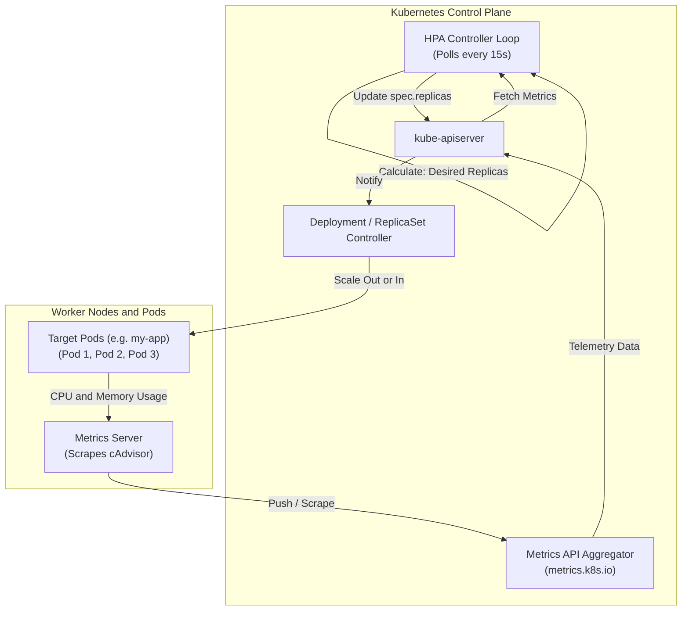
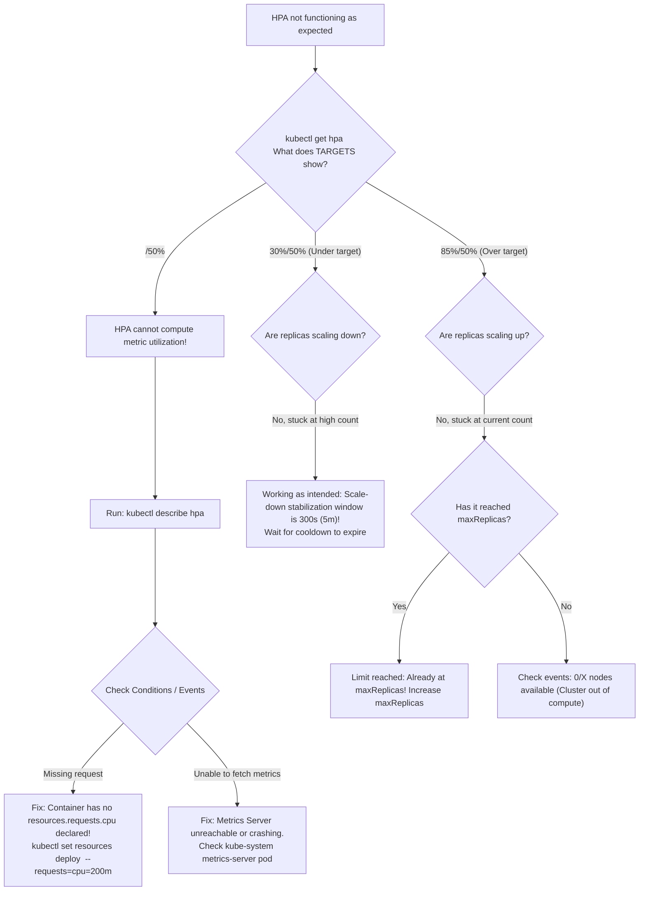

# Horizontal Pod Autoscaler (HPA) - CKA Exam Notes

> **Exam Domain**: Application Lifecycle Management (15%)  
> **Weight / Importance**: High (Core workload autoscaling mechanism testing imperative autoscale commands, declarative `autoscaling/v2` syntax, metric types, stabilization windows, and Metrics Server integration)  
> **Target Version**: Verified against v1.31 / v1.32 (Current CKA Curriculum)  
> **Allowed Docs Search Keywords**: `HorizontalPodAutoscaler`, `kubectl autoscale`, `autoscaling/v2`, `HPA scaling policies`  
> **Source**: Generated from `application-lifecycle-management/13-Horizontal-Pod-Autoscaler-raw.md`

---

## 1. Quick-Reference Summary

- **Primary Role of HPA**:
  - Automatically scales the number of Pod replicas in a workload (`Deployment`, `StatefulSet`, or `ReplicaSet`) up or down based on observed resource utilization (CPU, Memory) or custom/external metrics.
- **Core API Group & Version**:
  - **`apiVersion: autoscaling/v2`** (GA since v1.23; standard in v1.31 / v1.32). Legacy `v1` and `v2beta*` APIs are deprecated or removed.
- **The Core Scaling Algorithm**:
  $$\text{Desired Replicas} = \left\lceil \text{Current Replicas} \times \left( \frac{\text{Current Metric Value}}{\text{Target Metric Value}} \right) \right\rceil$$
  - Includes a default **10% tolerance band** ($\pm 0.1$); scaling actions are suppressed if metric variations remain within tolerance to prevent thrashing.
- **Mandatory Prerequisite**:
  - The cluster **must run Metrics Server** (`metrics.k8s.io`).
  - Containers **must declare `resources.requests`** (specifically CPU or Memory). Without `requests`, HPA cannot calculate percentage utilization and reports `<unknown>/target%`.
- **The Four Supported Metric Types**:
  1. **`Resource`**: CPU or Memory from Metrics Server (Target: `Utilization` or `AverageValue`).
  2. **`Pods`**: Per-pod metrics from custom metrics API (Target: `AverageValue`).
  3. **`Object`**: Cluster object metrics like Ingress request rate (Target: `Value` or `AverageValue`).
  4. **`External`**: Metrics outside the cluster like cloud SQS queues (Target: `Value` or `AverageValue`).
- **Stabilization & Cooldown Windows**:
  - Default **Scale-Down** stabilization window: **300 seconds (5 minutes)** to prevent premature terminations after momentary traffic drops.
  - Default **Scale-Up** stabilization window: **0 seconds** (reacts immediately to traffic surges).
- **Fast Imperative Generation**:
  - `kubectl autoscale deployment <name> --min=1 --max=10 --cpu-percent=50`.

---

## 2. Conceptual Overview & Mental Model

### Dual-Layer Architectural Understanding

- **Simple English Explanation (How It Works)**:
  - In a production cluster, scaling a workload manually (`kubectl scale deployment <name> --replicas=5`) requires an engineer to monitor dashboards, notice traffic spikes, and type commands.
  - The **Horizontal Pod Autoscaler (HPA)** automates this operational task.
  - The HPA controller runs an infinite loop inside `kube-controller-manager` (polling every 15 seconds by default).
  - On each cycle:
    1. It queries the Metrics Server to collect the average CPU/memory consumption across all running Pods belonging to the target Deployment.
    2. It compares the measured utilization against the target threshold defined in the HPA manifest (e.g. 50% CPU).
    3. If consumption is significantly higher than target, it runs the scaling formula to compute the required replica count and updates the `spec.replicas` field of the Deployment.
    4. The Deployment's underlying ReplicaSet creates new Pods to share the workload, bringing average per-pod utilization back down to the target threshold.
    5. When traffic subsides, HPA observes the drop, waits out a 5-minute stabilization window, and scales replicas down to save cluster resources.


- **Formal Kubernetes Definition**:
  - The `HorizontalPodAutoscaler` automatically updates a workload resource (such as a Deployment or StatefulSet), with the aim of automatically scaling the workload to match demand. The HPA is implemented as a Kubernetes API resource and a controller. The resource determines the behavior of the controller. The controller periodically adjusts the number of replicas in a replication controller or deployment to match observed metrics such as average CPU utilization, average memory utilization, or any other custom metric.



---

## 3. Deep-Dive Technical Breakdown

### 3.1 The HPA Scaling Algorithm

The HPA controller evaluates the following mathematical formula on every sync period:

$$\text{Desired Replicas} = \left\lceil \text{Current Replicas} \times \left( \frac{\text{Current Metric Value}}{\text{Target Metric Value}} \right) \right\rceil$$

#### Concrete Scaling Example:
1. A Deployment currently runs **2 replicas**.
2. Target metric: **50% average CPU utilization**.
3. Real-time telemetry: The 2 Pods are currently running at **80% average CPU utilization**.
4. Calculation:
   $$\text{Desired Replicas} = \left\lceil 2 \times \left( \frac{80}{50} \right) \right\rceil = \lceil 2 \times 1.6 \rceil = \lceil 3.2 \rceil = \mathbf{4\text{ replicas}}$$
5. The HPA controller updates the Deployment to **4 replicas**.

#### The 10% Tolerance Band
To prevent unnecessary pod churn when metric fluctuations are negligible, HPA evaluates a tolerance ratio:

$$\text{Ratio} = \frac{\text{Current Metric Value}}{\text{Target Metric Value}}$$

- If $0.90 \le \text{Ratio} \le 1.10$, HPA **takes no action** and does not alter the replica count.

---

### 3.2 The Four Metric Sources (`autoscaling/v2`)


| Metric Type | Provided By | API Group | Target Types Supported | Example Use Cases |
| :--- | :--- | :--- | :--- | :--- |
| **`Resource`** | Metrics Server (cAdvisor) | `metrics.k8s.io` | `Utilization` (percentage) or `AverageValue` (raw millicores/bytes) | Standard CPU and Memory scaling. |
| **`Pods`** | Custom Metrics Adapter (e.g. Prometheus) | `custom.metrics.k8s.io` | `AverageValue` | HTTP requests per second per pod, active WebSocket connections per pod. |
| **`Object`** | Custom Metrics Adapter | `custom.metrics.k8s.io` | `Value` or `AverageValue` | Total Ingress requests per second, queue depth on a database object. |
| **`External`** | External Metrics Adapter (Datadog, Dynatrace, AWS CloudWatch) | `external.metrics.k8s.io` | `Value` or `AverageValue` | AWS SQS message backlog, Datadog metric, Stripe webhook queue. |

---

### 3.3 Declarative Manifest Anatomy (`autoscaling/v2`)


```yaml
apiVersion: autoscaling/v2
kind: HorizontalPodAutoscaler
metadata:
  name: my-app-hpa
  namespace: default
spec:
  scaleTargetRef:
    apiVersion: apps/v1
    kind: Deployment
    name: my-app
  minReplicas: 1
  maxReplicas: 10
  metrics:
    # 1. Resource Metric: Average CPU percentage
    - type: Resource
      resource:
        name: cpu
        target:
          type: Utilization
          averageUtilization: 50
          
    # 2. Resource Metric: Average Memory absolute value
    - type: Resource
      resource:
        name: memory
        target:
          type: AverageValue
          averageValue: 500Mi
```

> [!IMPORTANT]
> **Multi-Metric Evaluation Rule**:
> When an HPA specifies multiple metrics (e.g. CPU at 50% and Memory at 500Mi), HPA calculates the proposed replica count for **each metric independently** and chooses the **highest** replica count. This guarantees that all resource thresholds remain protected.

---

### 3.4 Advanced Scaling Behavior & Stabilization Windows

In `autoscaling/v2`, the `behavior` block gives fine-grained control over scale-up and scale-down velocity:

```yaml
apiVersion: autoscaling/v2
kind: HorizontalPodAutoscaler
metadata:
  name: tuned-hpa
spec:
  scaleTargetRef:
    apiVersion: apps/v1
    kind: Deployment
    name: webapp
  minReplicas: 2
  maxReplicas: 20
  metrics:
    - type: Resource
      resource:
        name: cpu
        target:
          type: Utilization
          averageUtilization: 60
  behavior:
    # Scale-up: Fast response to traffic spikes
    scaleUp:
      stabilizationWindowSeconds: 0 # React immediately without delay
      policies:
        - type: Percent
          value: 100 # Double the number of pods
          periodSeconds: 15
        - type: Pods
          value: 4   # Or add up to 4 pods
          periodSeconds: 15
      selectPolicy: Max # Pick the policy that adds more pods
      
    # Scale-down: Slow, gradual cooldown to avoid thrashing
    scaleDown:
      stabilizationWindowSeconds: 300 # Wait 5 minutes before scaling down
      policies:
        - type: Percent
          value: 10 # Scale down by at most 10% of current pods
          periodSeconds: 60
      selectPolicy: Min # Pick the most conservative policy
```

- **`stabilizationWindowSeconds`**:
  - Restricts scaling by looking back over a specified time window.
  - For scale-down (default 300s), HPA computes the desired replicas over the last 5 minutes and picks the **highest** count, ensuring that a momentary dip in traffic does not prematurely kill pods.

---

## 4. Command Translation & Mapping Tables

### Imperative Flags vs. Declarative Manifest Mapping


| Goal | Imperative CLI Command | Equivalent Declarative YAML Field |
| :--- | :--- | :--- |
| **Target Workload** | `kubectl autoscale deployment my-app` | `spec.scaleTargetRef: { kind: Deployment, name: my-app }` |
| **Minimum Pods** | `--min=2` | `spec.minReplicas: 2` |
| **Maximum Pods** | `--max=10` | `spec.maxReplicas: 10` |
| **Target CPU %** | `--cpu-percent=50` | `spec.metrics[0].resource: { name: cpu, target: { type: Utilization, averageUtilization: 50 } }` |
| **Dry-Run YAML** | `--dry-run=client -o yaml` | Direct manifest export to `.yaml` |

---

## 5. High-Yield CLI & Imperative Commands

### 5.1 Imperative Creation & Inspection Commands

```bash
# 1. Create HPA imperatively on a Deployment (Essential CKA time-saver!)
kubectl autoscale deployment my-app \
  --cpu-percent=50 \
  --min=1 \
  --max=10

# 2. Generate declarative autoscaling/v2 YAML without applying
kubectl autoscale deployment my-app \
  --cpu-percent=50 \
  --min=2 \
  --max=8 \
  --dry-run=client -o yaml > my-app-hpa.yaml

# 3. List all active HPAs in the current namespace
kubectl get hpa

# 4. Inspect detailed HPA calculations, conditions, and recent scaling events
kubectl describe hpa my-app

# 5. Extract specific metric targets and current values using jsonpath
kubectl get hpa my-app -o jsonpath='{.status.currentMetrics[*].resource.current.averageUtilization}'

# 6. Delete an HPA (Workload retains its current replica count!)
kubectl delete hpa my-app
```

---

### 5.2 Generating Load for Testing HPA

```bash
# Run a busybox generator Pod to flood the web application with requests
kubectl run load-generator \
  --image=busybox:1.36 \
  --restart=Never \
  -- /bin/sh -c "while true; do wget -q -O- http://my-app.default.svc.cluster.local; done"

# Monitor HPA scaling reaction in real time
kubectl get hpa my-app -w
```

---

## 6. Troubleshooting & Diagnostic Runbook

### Diagnostic Decision Tree



---

### Step-by-Step Triage Runbook

#### Symptom 1: HPA Reports `<unknown>/50%` in TARGETS
1. **Inspect HPA description**:
   ```bash
   kubectl describe hpa my-app
   ```
   Look for:
   ```text
   Warning  FailedGetResourceMetric  kubelet  missing request for cpu
   ```
2. **Diagnosis**:
   - The target Deployment does not declare `resources.requests.cpu`.
   - The HPA algorithm cannot compute percentage utilization without a baseline request denominator.
3. **Resolution**:
   - Update the Deployment container specification to include requests:
     ```bash
     kubectl set resources deployment my-app --requests=cpu=250m
     ```
   - Within 15-30 seconds, HPA will transition from `<unknown>/50%` to a valid percentage.

---

#### Symptom 2: HPA Does Not Scale Down Immediately After Traffic Stops
1. **Diagnosis**:
   - By design, the default `scaleDown` stabilization window is **300 seconds (5 minutes)**.
   - Kubernetes deliberately prevents rapid scale-downs to avoid pod thrashing during intermittent bursty traffic.
2. **Resolution**:
   - If faster scale-down is required for testing, configure `behavior.scaleDown.stabilizationWindowSeconds: 30`.

---

## 7. CKA Exam Tips, Gotchas & Traps

> [!WARNING]
> **Trap 1: The Missing `requests` Trap**
> - In CKA exam questions asking: *"Create an HPA on deployment webapp that scales between 2 and 8 replicas when CPU hits 70%"*:
>   - Always inspect the Deployment first!
>   - If `resources.requests.cpu` is missing, you must edit the Deployment and add it before the HPA can function.

> [!IMPORTANT]
> **Trap 2: Declarative `replicas:` Conflict with GitOps**
> - If an HPA manages a Deployment, you must remove `spec.replicas` from your deployment manifest file.
> - If `spec.replicas: 2` remains in the file, every time someone executes `kubectl apply -f deployment.yaml`, the Deployment will snap back to 2 replicas, overriding the HPA!

> [!WARNING]
> **Trap 3: Memory-Based Autoscaling Caveat**
> - While HPA supports memory utilization, **scaling on memory is risky**:
>   - Unlike CPU (which is compressible and drops immediately after load decreases), memory is non-compressible.
>   - Applications running on runtimes like Java/Go frequently do not release allocated heap memory back to the operating system immediately.
>   - As a result, an HPA scaling on memory may scale up and **never scale down**. Always prefer CPU or request rate for autoscaling.

> [!TIP]
> **Exam Speed Tip: One-Line Imperative Command**
> Memorize the exact syntax for `kubectl autoscale`:
> ```bash
> kubectl autoscale deployment <deploy-name> --cpu-percent=80 --min=2 --max=6
> ```
> This takes under 10 seconds and automatically generates a valid HPA object.

---

## 8. Self-Test / Active Recall

1. **What is the mathematical equation used by HPA to calculate desired replicas?**
   <details><summary>Click to view answer</summary>
   \(\text{Desired Replicas} = \left\lceil \text{Current Replicas} \times \left( \frac{\text{Current Metric Value}}{\text{Target Metric Value}} \right) \right\rceil\)
   </details>

2. **Why does an HPA report `<unknown>/60%` in `kubectl get hpa`?**
   <details><summary>Click to view answer</summary>
   The Pod template containers lack an explicit <code>resources.requests.cpu</code> declaration, preventing HPA from calculating percentage utilization against a baseline request.
   </details>

3. **What is the default scale-down stabilization window in Kubernetes HPA?**
   <details><summary>Click to view answer</summary>
   <b>300 seconds (5 minutes)</b>, designed to prevent premature pod terminations during fluctuating traffic.
   </details>

4. **What API version should be used when writing declarative HPA manifests in Kubernetes v1.31 / v1.32?**
   <details><summary>Click to view answer</summary>
   <b><code>apiVersion: autoscaling/v2</code></b>.
   </details>

5. **If an HPA specifies both CPU (target 50%) and Memory (target 60%), and CPU requires 4 replicas while Memory requires 7 replicas, how many replicas will HPA set?**
   <details><summary>Click to view answer</summary>
   <b>7 replicas</b>. HPA evaluates all metrics independently and chooses the largest calculated replica count to ensure all thresholds are satisfied.
   </details>

6. **What command creates an HPA targeting Deployment `frontend` with minimum 3 pods, maximum 10 pods, and target CPU 70%?**
   <details><summary>Click to view answer</summary>
   <code>kubectl autoscale deployment frontend --min=3 --max=10 --cpu-percent=70</code>
   </details>

7. **What happens to running Pod replicas when an HPA object is deleted?**
   <details><summary>Click to view answer</summary>
   The Deployment <b>retains its current replica count</b> at the moment of HPA deletion; it does not automatically revert to its original pre-scaling replica count.
   </details>

8. **What tolerance threshold does HPA apply by default before triggering a scaling action?**
   <details><summary>Click to view answer</summary>
   A <b>10% tolerance band</b> (\(\pm 0.1\)). If the ratio of current to target metric is between 0.9 and 1.1, scaling is skipped.
   </details>

9. **What metric type should be used in HPA to scale based on an external message queue like AWS SQS?**
   <details><summary>Click to view answer</summary>
   <b><code>type: External</code></b> (served via <code>external.metrics.k8s.io</code>).
   </details>

10. **Can an HPA target a single standalone Pod?**
    <details><summary>Click to view answer</summary>
    <b>No.</b> HPA targets must be scalable controllers that implement the <code>/scale</code> subresource (such as Deployments, ReplicaSets, or StatefulSets). Standalone Pods cannot be scaled by HPA.
    </details>

---

## 9. Official Documentation Bookmarks

| Page Title | Search Queries | Target Section / Direct URI Anchor |
| :--- | :--- | :--- |
| **Horizontal Pod Autoscaling** | `Horizontal Pod Autoscaling` | [How an HPA works](https://kubernetes.io/docs/tasks/run-application/horizontal-pod-autoscale/#how-does-an-hpa-work) |
| **HorizontalPodAutoscaler Walkthrough** | `HorizontalPodAutoscaler Walkthrough` | [Autoscaling on multiple metrics](https://kubernetes.io/docs/tasks/run-application/horizontal-pod-autoscale-walkthrough/#autoscaling-on-multiple-metrics) |
| **Configuring HPA Scaling Policies** | `Configuring HPA scaling policies` | [Scaling policies](https://kubernetes.io/docs/tasks/run-application/horizontal-pod-autoscale/#scaling-policies) |
| **kubectl autoscale** | `kubectl autoscale` | [kubectl autoscale CLI Reference](https://kubernetes.io/docs/reference/generated/kubectl/kubectl-commands#autoscale) |
