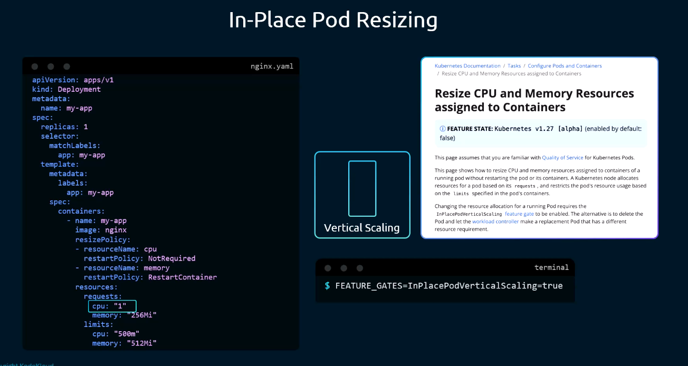
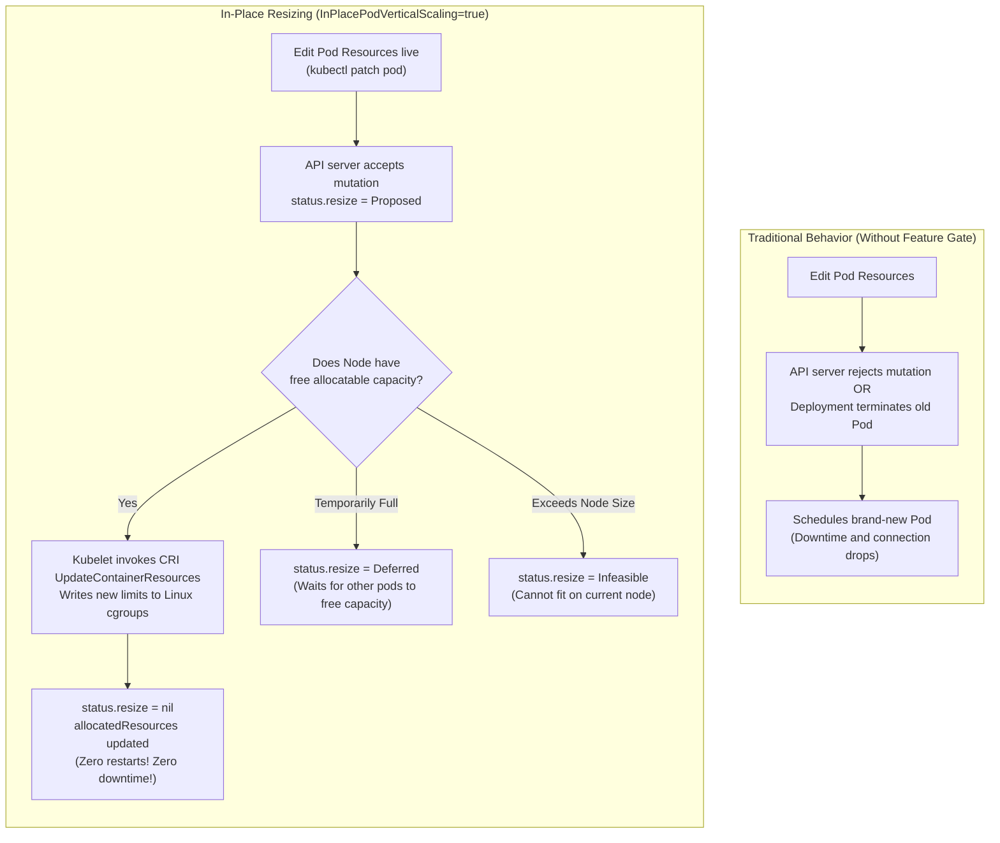
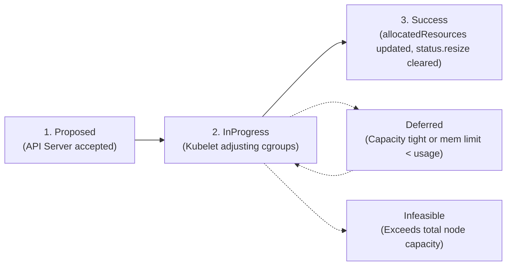
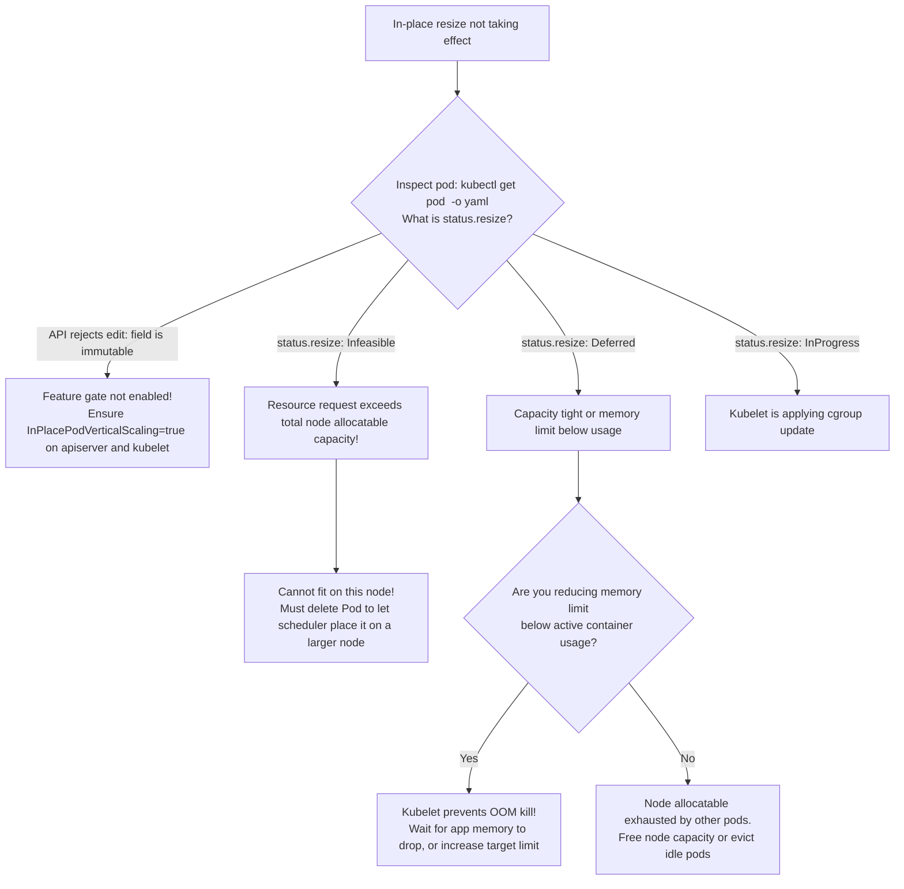

# In-Place Pod Resizing in Kubernetes - CKA Exam Notes

> **Exam Domain**: Application Lifecycle Management (15%) / Core Concepts  
> **Weight / Importance**: High (Modern resource optimization mechanism testing in-place cgroup modification without container restarts, `resizePolicy` controls, feature gate requirements, and operational constraints)  
> **Target Version**: Verified against v1.31 / v1.32 (Current CKA Curriculum)  
> **Allowed Docs Search Keywords**: `Resize CPU and Memory Resources assigned to Containers`, `InPlacePodVerticalScaling`, `resizePolicy`, `allocatedResources`  
> **Source**: Generated from `application-lifecycle-management/14-inplace-pod-resizing-raw.md`

---

## 1. Quick-Reference Summary

- **Core Functionality**:
  - Allows mutating container CPU and memory `requests` and `limits` on **running Pods in place** without terminating the container, dropping connections, or recreating the Pod.
- **Traditional vs. In-Place Behavior**:
  - *Traditional (Default)*: Editing `resources` in a Deployment triggers a rolling update (terminating old Pods and creating new ones). For standalone Pods, `spec.containers[*].resources` was strictly immutable.
  - *In-Place*: Modifies `spec.containers[*].resources` directly. Kubelet dynamically updates the container's Linux cgroup controls (`cpu.max`, `memory.max`) live.
- **Feature Gate Requirement**:
  - **`InPlacePodVerticalScaling`** (Alpha in v1.27, Beta in v1.31 / v1.32). Must be enabled on `kube-apiserver`, `kube-scheduler`, and `kubelet`.
- **The `resizePolicy` Array**:
  - Declares whether changing a resource requires restarting the container:
    - **`resourceName: cpu`**: Typically set to **`restartPolicy: NotRequired`** (kernel instantly alters CPU shares/quotas).
    - **`resourceName: memory`**: Can be **`restartPolicy: NotRequired`** or **`restartPolicy: RestartContainer`** (mandatory for runtimes like JVM where max heap `-Xmx` does not dynamically track cgroup changes).
- **Status Tracking (`status.resize`)**:
  - **`Proposed`**: Mutation accepted by API server; pending Kubelet acknowledgment.
  - **`InProgress`**: Kubelet recognized the resize and is actively adjusting cgroups.
  - **`Deferred`**: Resize cannot be applied immediately (e.g. node temporarily lacks spare capacity, or requested memory limit is below current active usage).
  - **`Infeasible`**: The requested resize can never fit on the current node (exceeds node allocatable capacity).
- **Critical Limitations**:
  - Only applies to **CPU and Memory** (no extended resources, GPUs, or hugepages).
  - **QoS class cannot be modified** (e.g. cannot change from `Guaranteed` to `Burstable`).
  - Init containers and ephemeral containers **cannot** be resized in place.
  - Windows pods are **not supported**.

---

## 2. Conceptual Overview & Mental Model

### Dual-Layer Architectural Understanding

- **Simple English Explanation (How It Works)**:
  - In standard Kubernetes operations, if a database or heavy microservice experiences sudden memory pressure or CPU throttling, increasing its resource limits required restarting the container. This caused brief downtime, dropped active TCP connections, and forced cache invalidation.
  - **In-Place Pod Resizing** removes this limitation.
  - Under the hood, Linux enforces container resource boundaries using **cgroups** (specifically `cpu.max` for CPU throttling and `memory.max` for memory limits).
  - When you update a Pod's resources with In-Place Resizing enabled:
    1. The API server updates the Pod specification without evicting the Pod.
    2. Kubelet on the worker node receives the update.
    3. Kubelet verifies that the local node has enough unallocated CPU and RAM.
    4. Kubelet invokes the Container Runtime Interface (CRI) to write the new values directly into the container's existing cgroup files on the host filesystem.
    5. The Linux kernel immediately enforces the higher limits on existing running threads—with zero downtime and zero container restarts.



- **Formal Kubernetes Definition**:
  - In-place vertical scaling allows resizing CPU and memory resources assigned to containers without restarting the pod or its containers. Kubelet updates the container's resource limits and requests in place via the CRI `UpdateContainerResources` RPC, coordinating node capacity and reflecting progress in `status.resize` and `status.allocatedResources`.



---

## 3. Deep-Dive Technical Breakdown

### 3.1 The `resizePolicy` Specification

Containers define how Kubelet should handle resource adjustments via the `resizePolicy` array:

```yaml
apiVersion: v1
kind: Pod
metadata:
  name: tuned-database
spec:
  containers:
    - name: database
      image: postgres:15-alpine
      resizePolicy:
        # CPU can be dynamically throttled or expanded without restarting the process
        - resourceName: cpu
          restartPolicy: NotRequired

        # Memory can be expanded live, or set to restart if the app cannot detect dynamic RAM
        - resourceName: memory
          restartPolicy: NotRequired # Options: NotRequired, RestartContainer
      resources:
        requests:
          cpu: "1"
          memory: "1Gi"
        limits:
          cpu: "2"
          memory: "2Gi"
```

| Field | Permitted Values | Default | Operational Impact |
| :--- | :--- | :--- | :--- |
| `resourceName` | `cpu`, `memory` | N/A | Identifies the target compute resource. |
| `restartPolicy` | `NotRequired`, `RestartContainer` | `NotRequired` | If `NotRequired`, Kubelet updates cgroups live. If `RestartContainer`, Kubelet restarts the container process to apply the new resource boundaries. |

---

### 3.2 The Lifecycle Progression of `status.resize`

When a Pod's resources are modified, Kubelet manages the transition using distinct status fields:



1. **`status.resize: Proposed`**:
   - The user or controller patched `spec.containers[*].resources`.
   - The API server validated the schema and accepted the mutation.
2. **`status.resize: InProgress`**:
   - Kubelet acknowledged the change and is updating the cgroup boundaries via CRI.
3. **`status.resize: Deferred`**:
   - The node currently does not have enough unallocated CPU or memory to grant the request without violating other Pods' guarantees.
   - Alternatively: A request was made to reduce memory limit, but the container's active working set memory is currently higher than the requested limit. Kubelet defers the reduction until memory usage drops to prevent an immediate kernel `OOMKilled` event.
4. **`status.resize: Infeasible`**:
   - The requested resource exceeds the total allocatable capacity of the node hosting the Pod. The Pod cannot be resized on its current host.
5. **Success / Steady State**:
   - Once applied, `status.containerStatuses[*].allocatedResources` matches `spec.containers[*].resources`, and `status.resize` is unset (cleared).

---

### 3.3 Limitations & Invariant Rules

The following constraints are enforced by the Kubernetes API server and Kubelet:

| Restriction | Technical Rationale |
| :--- | :--- |
| **CPU and Memory Only** | Only Linux CPU and memory controllers support reliable dynamic cgroup quota modification. Extended resources (GPUs, SR-IOV) and hugepages cannot be resized in place. |
| **QoS Class Immutability** | A Pod's Quality of Service class (`Guaranteed`, `Burstable`, `BestEffort`) is assigned at creation time and determines OOM-scoring. An in-place resize that would change the QoS class (e.g. removing limits on a Guaranteed pod) is **rejected by the API server**. |
| **No Init or Ephemeral Containers** | Init containers run prior to Pod startup; ephemeral containers are for ad-hoc debugging. Only `spec.containers` are eligible for in-place resizing. |
| **Memory Floor Protection** | Kubelet will not reduce a container's memory limit below its current active working set. Doing so would force the Linux kernel OOM killer to immediately terminate the container. |
| **No Windows Node Support** | Windows Host Compute Service (HCS) and container isolation model do not support live cgroup modifications of this type. |

---

## 4. Command Translation & Mapping Tables

### Traditional Scaling vs. In-Place Vertical Scaling

| Dimension | Traditional Scaling (Without Feature Gate) | In-Place Resizing (`InPlacePodVerticalScaling`) |
| :--- | :--- | :--- |
| **Pod Mutability** | `spec.containers[*].resources` is immutable on existing Pods | `spec.containers[*].resources` is mutable on existing Pods |
| **Deployment Update** | Triggers ReplicaSet rollout; terminates old Pods | Patches Pods in place; retains running container instances |
| **Network Disruption** | Active TCP connections broken; DNS churn | **Zero network disruption**; IP address and TCP sockets preserved |
| **Cache & State** | In-memory caches wiped; cold boot penalty | **In-memory cache preserved**; no cold boot penalty |
| **Linux Cgroup Action** | New cgroup created for new container | Existing cgroup files (`cpu.max`, `memory.max`) modified live |

---

## 5. High-Yield CLI & Imperative Commands

### 5.1 Enabling the Feature Gate in Cluster Components

In-place resizing requires enabling the feature gate across the control plane and worker nodes:

```yaml
# 1. /etc/kubernetes/manifests/kube-apiserver.yaml
spec:
  containers:
    - command:
        - kube-apiserver
        - --feature-gates=InPlacePodVerticalScaling=true

# 2. /etc/kubernetes/manifests/kube-scheduler.yaml
spec:
  containers:
    - command:
        - kube-scheduler
        - --feature-gates=InPlacePodVerticalScaling=true

# 3. /var/lib/kubelet/config.yaml (on worker nodes)
featureGates:
  InPlacePodVerticalScaling: true
```

---

### 5.2 Patching Pod Resources Live

```bash
# 1. Patch container CPU request live on a running standalone Pod
kubectl patch pod my-app --patch '
{
  "spec": {
    "containers": [
      {
        "name": "my-app",
        "resources": {
          "requests": { "cpu": "500m" },
          "limits": { "cpu": "1" }
        }
      }
    ]
  }
}'

# 2. Patch container memory limits live
kubectl patch pod my-app --patch '
{
  "spec": {
    "containers": [
      {
        "name": "my-app",
        "resources": {
          "requests": { "memory": "512Mi" },
          "limits": { "memory": "1Gi" }
        }
      }
    ]
  }
}'
```

---

### 5.3 Inspecting Resize Progress & Allocation Telemetry

```bash
# 1. Inspect the resize status condition of a Pod
kubectl get pod my-app -o jsonpath='{.status.resize}'

# 2. Compare declared resources vs currently allocated resources
kubectl get pod my-app -o jsonpath='{"Desired: "}{.spec.containers[0].resources}{"\nAllocated: "}{.status.containerStatuses[0].allocatedResources}{"\n"}'

# 3. Check node allocatable headroom to verify if resize fits
kubectl describe node <node-name> | grep -A 8 "Allocated resources:"
```

---

## 6. Troubleshooting & Diagnostic Runbook

### Diagnostic Decision Tree



---

### Step-by-Step Triage Runbook

#### Symptom 1: API Server Rejects Resource Patch
1. **Error Output**:
   ```text
   The Pod "my-app" is invalid: spec.containers[0].resources: Forbidden: pod updates may not change fields other than spec.containers[*].image...
   ```
2. **Diagnosis**:
   - The `InPlacePodVerticalScaling` feature gate is **disabled** on the API server.
3. **Resolution**:
   - Add `--feature-gates=InPlacePodVerticalScaling=true` to `/etc/kubernetes/manifests/kube-apiserver.yaml` and restart Kubelet.

---

#### Symptom 2: Pod Reports `status.resize: Deferred`
1. **Inspect Pod status**:
   ```bash
   kubectl get pod my-app -o jsonpath='{.status.resize}'
   # Output: Deferred
   ```
2. **Inspect container active working set**:
   ```bash
   kubectl top pod my-app --containers
   ```
3. **Diagnosis**:
   - If you attempted to reduce `limits.memory` from `1Gi` to `256Mi`, but the container is currently using `350Mi`, Kubelet defers the resize to protect the process from an instant kernel OOM kill.
4. **Resolution**:
   - Ensure the application reduces heap/cache allocation, or set a target memory limit higher than current consumption.

---

## 7. CKA Exam Tips, Gotchas & Traps

> [!WARNING]
> **Trap 1: QoS Class Transition Rejections**
> - You **cannot** change a Pod's QoS class during an in-place resize:
>   - If a Pod was created with `requests == limits` (Guaranteed QoS), you cannot patch only `requests` without patching `limits` to match!
>   - Doing so would implicitly downgrade the Pod to `Burstable`, which the API server will reject with:
>     `Pod QoS class cannot be changed`.

> [!IMPORTANT]
> **Trap 2: Java / JVM Memory Awareness**
> - Even with `restartPolicy: NotRequired` for memory, certain runtimes (like older JVMs configured with static `-Xmx512m`) will **not detect dynamic memory expansions** without a restart.
> - For such applications, configure `restartPolicy: RestartContainer` under `resizePolicy` for memory.

> [!WARNING]
> **Trap 3: Infeasible Resizing Does Not Automatically Reschedule**
> - If an in-place resize request is marked `Infeasible` because the target node lacks the physical capacity, Kubernetes will **not** automatically evict and move the Pod to a larger node!
> - The Pod stays on the original node with its original resource boundaries until manual intervention.

---

## 8. Self-Test / Active Recall

1. **What is the primary benefit of In-Place Pod Resizing compared to traditional vertical scaling?**
   <details><summary>Click to view answer</summary>
   It allows modifying CPU and memory resources on running containers without terminating the container process, dropping network connections, or restarting the Pod.
   </details>

2. **What feature gate must be enabled to use in-place pod resizing in Kubernetes?**
   <details><summary>Click to view answer</summary>
   <b><code>InPlacePodVerticalScaling=true</code></b>.
   </details>

3. **What are the two permitted values for `restartPolicy` inside a container's `resizePolicy`?**
   <details><summary>Click to view answer</summary>
   <b><code>NotRequired</code></b> (applies changes live to cgroups without restarting) and <b><code>RestartContainer</code></b> (restarts the container process to apply the change).
   </details>

4. **What does `status.resize: Deferred` indicate on a Pod?**
   <details><summary>Click to view answer</summary>
   It indicates that Kubelet cannot apply the requested resize immediately, either because the node temporarily lacks spare allocatable capacity, or because a requested memory reduction is lower than the container's current memory usage.
   </details>

5. **Can you change a Pod's QoS class from Burstable to Guaranteed using in-place resizing?**
   <details><summary>Click to view answer</summary>
   <b>No.</b> Pod QoS classes are immutable; any resize request that would alter the Pod's QoS class is rejected by the API server.
   </details>

6. **How does Kubelet apply CPU limit changes to a running container on Linux without restarting it?**
   <details><summary>Click to view answer</summary>
   Kubelet invokes the CRI <code>UpdateContainerResources</code> RPC, which directly writes the updated quota values into the container's active cgroup files (e.g. <code>cpu.max</code> in cgroup v2).
   </details>

7. **Can init containers or ephemeral containers be resized using In-Place Pod Resizing?**
   <details><summary>Click to view answer</summary>
   <b>No.</b> In-place resizing is strictly restricted to primary application containers (<code>spec.containers</code>).
   </details>

8. **What happens if an in-place resize request exceeds the total physical capacity of the worker node?**
   <details><summary>Click to view answer</summary>
   The Pod enters <b><code>status.resize: Infeasible</code></b>. The Pod remains running on the node with its old resource allocations and is not automatically rescheduled.
   </details>

9. **Why might you configure `restartPolicy: RestartContainer` for memory while keeping CPU as `NotRequired`?**
   <details><summary>Click to view answer</summary>
   Certain runtimes (like the Java Virtual Machine) read max heap parameters (<code>-Xmx</code>) only at process initialization and cannot dynamically expand heap memory when cgroups expand without a container restart.
   </details>

10. **Which status field indicates the actual compute resources currently allocated by Kubelet to a container?**
    <details><summary>Click to view answer</summary>
    <b><code>status.containerStatuses[*].allocatedResources</code></b>.
    </details>

---

## 9. Official Documentation Bookmarks

| Page Title | Search Queries | Target Section / Direct URI Anchor |
| :--- | :--- | :--- |
| **Resize CPU and Memory Resources** | `Resize CPU and Memory Resources assigned to Containers` | [Determine resize policy](https://kubernetes.io/docs/tasks/configure-pod-container/resize-container-resources/#determine-resize-policy) |
| **Pod QoS Classes** | `Configure Quality of Service for Pods` | [QoS Classes](https://kubernetes.io/docs/tasks/configure-pod-container/quality-service-pod/) |
| **Feature Gates** | `Feature Gates Kubernetes` | [Feature Gates Table](https://kubernetes.io/docs/reference/command-line-tools-reference/feature-gates/) |
