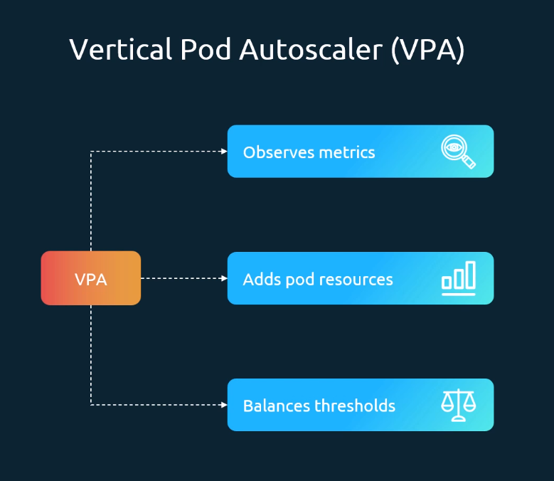
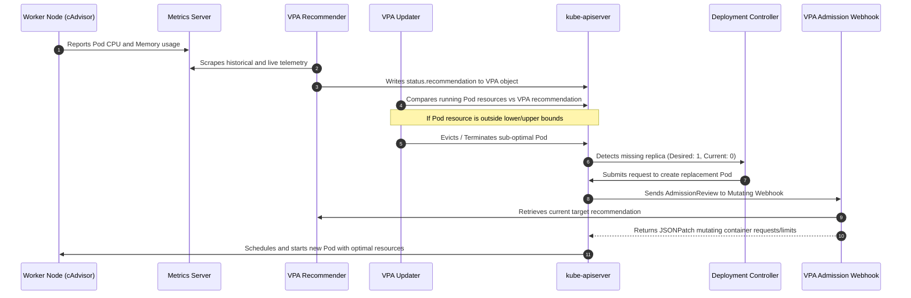
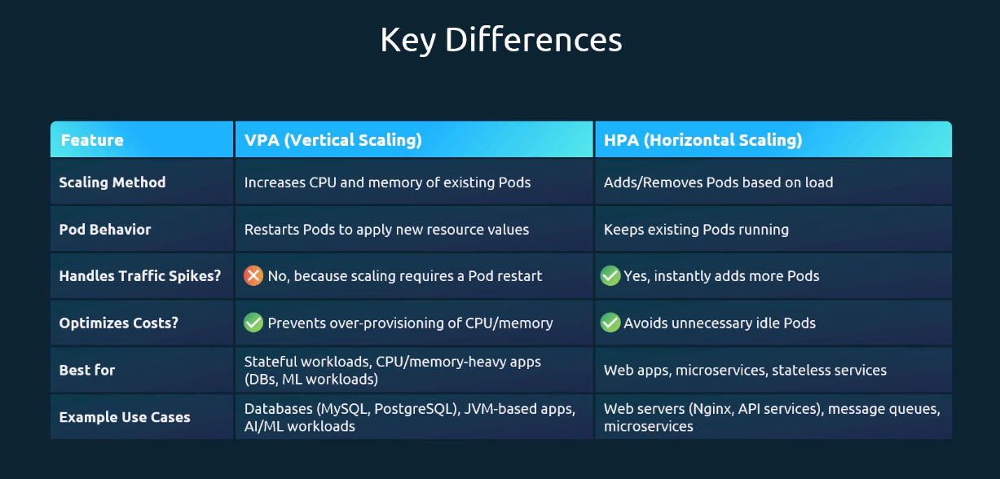

# Vertical Pod Autoscaler (VPA) - CKA Exam Notes

> **Exam Domain**: Application Lifecycle Management (15%) / Cluster Architecture, Installation & Configuration (25%)  
> **Weight / Importance**: High (Core vertical workload scaling mechanism testing the tripartite VPA architecture, update modes, resource boundary policies, CRD installation, and HPA differentiation)  
> **Target Version**: Verified against v1.31 / v1.32 (Current CKA Curriculum)  
> **Allowed Docs Search Keywords**: `Vertical Pod Autoscaler`, `autoscaling.k8s.io/v1`, `VPA Recommender`, `VPA updateMode`, `VPA Admission Controller`  
> **Source**: Generated from `application-lifecycle-management/15-Vertical-Pod-Autoscaler-raw.md`

---

## 1. Quick-Reference Summary

- **Primary Role of VPA**:
  - Automatically adjusts CPU and Memory `requests` and `limits` for containers in a workload based on historical and real-time usage telemetry, eliminating manual guess-work and preventing both resource starvation and costly over-provisioning.
- **External Add-On Status**:
  - Unlike HPA (which is built into `kube-controller-manager`), VPA is an **external add-on** under the `kubernetes/autoscaler` repository. It must be installed into the cluster via Custom Resource Definitions (CRDs) and dedicated controller deployments.
- **The Tripartite Microservice Architecture**:
  1. **VPA Recommender**: Queries Metrics Server / Prometheus, computes statistical usage percentiles (default 95th percentile), and produces recommended CPU/memory targets without altering Pods.
  2. **VPA Updater**: Inspects running Pods against the Recommender's target boundaries. If a Pod's current resources fall outside acceptable bounds, the Updater evicts (terminates) the Pod.
  3. **VPA Admission Controller**: A mutating admission webhook that intercepts Pod creation calls. When a workload controller (e.g. Deployment) creates a replacement Pod, the webhook injects the recommended resource values into the Pod spec before it is scheduled.
- **The Four Operating Update Modes (`updateMode`)**:
  - **`Off`**: Generates recommendations only in `status.recommendation`. Never modifies or restarts Pods (safest mode for production sizing analysis).
  - **`Initial`**: Assigns recommended resources **only upon initial Pod creation**. Never evicts or terminates currently running Pods.
  - **`Recreate`**: Actively evicts running Pods whose resources deviate from recommendations, forcing the Deployment to recreate them with updated sizes.
  - **`Auto`**: Currently behaves identically to `Recreate`. Designed to leverage In-Place Pod Resizing in modern releases without requiring Pod terminations.
- **No Imperative Generation**:
  - There is no `kubectl autoscale` command for VPA. VPA manifests **must be authored declaratively** using `apiVersion: autoscaling.k8s.io/v1`.
- **HPA Coexistence Rule**:
  - VPA and HPA **must NOT scale on the same resource** (e.g. CPU or Memory) on the same workload. They will enter an oscillating contention loop.

---

## 2. Conceptual Overview & Mental Model

### Dual-Layer Architectural Understanding

- **Simple English Explanation (How It Works)**:
  - Sizing container CPU and memory requests is notoriously difficult: developers often request 2 CPU cores and 4GB RAM for a service that averages 100m CPU and 200MB RAM, wasting massive cluster capacity. Conversely, setting requests too low causes OOM kills and CPU throttling.
  - The **Vertical Pod Autoscaler (VPA)** solves this by rightsizing the container itself rather than adding more replicas.
  - It runs as three cooperating background services:
    1. The **Recommender** continually observes actual resource consumption from the Metrics API and logs historical peaks.
    2. If a Pod is significantly undersized or oversized, the **Updater** evicts the running Pod (respecting `PodDisruptionBudgets`).
    3. When the workload controller (Deployment) notices a missing replica and requests a replacement Pod from the API server, the **VPA Admission Controller** catches the request and mutates its CPU/memory specifications to match the Recommender's optimal target.
    4. The newly created Pod starts on a node with the exact resources it needs.



- **Formal Kubernetes Definition**:
  - The `VerticalPodAutoscaler` is an API resource that automates the management of container resource requirements. The VPA controller frees users from needing to configure up-to-date resource limits and requests for their pods. When configured, it automatically sets the requests based on usage and thereby allows proper scheduling onto nodes so that appropriate resource amounts are available for each pod.



---

## 3. Deep-Dive Technical Breakdown

### 3.1 The Tripartite VPA Architecture

Unlike monolithic Kubernetes controllers, VPA is split into three decoupled components:

```mermaid
flowchart TD
    subgraph VPAArchitecture["Vertical Pod Autoscaler Microservices"]
        direction TB

        subgraph Component1["1. vpa-recommender"]
            R1["Gathers Metrics from Metrics Server / Prometheus"]
            R2["Computes 95th Percentile Usage + Safety Margin"]
            R3["Publishes recommendations to VPA CRD status"]
            R1 --> R2 --> R3
        end

        subgraph Component2["2. vpa-updater"]
            U1["Monitors Running Pods"]
            U2["Checks if Pod resources deviate from bounds"]
            U3["Evicts Pods (respects PodDisruptionBudgets)"]
            U1 --> U2 --> U3
        end

        subgraph Component3["3. vpa-admission-controller"]
            A1["Mutating Webhook on Pod creation"]
            A2["Intercepts Deployment replacement Pods"]
            A3["Injects optimal CPU and Memory requests"]
            A1 --> A2 --> A3
        end
    end
```



1. **`vpa-recommender`**:
   - Gathers historical resource telemetry (default: past 8 days of data) and live metrics from the Metrics API.
   - Computes recommended requests using a statistical model (typically the 95th percentile of CPU usage plus a safety overhead).
   - Does **not** modify Pods; it strictly updates the `status.recommendation` block of the `VerticalPodAutoscaler` object.
2. **`vpa-updater`**:
   - Active only when `updateMode` is set to `Recreate` or `Auto`.
   - Periodically scans running Pods managed by the VPA target.
   - If a Pod's allocated resources deviate significantly from the recommended range (`lowerBound` and `upperBound`), the Updater issues an eviction request.
   - **Safety Guard**: It strictly obeys `PodDisruptionBudgets` (PDBs) and will not evict a Pod if doing so violates high-availability minimums.
3. **`vpa-admission-controller`**:
   - Registered as a `MutatingAdmissionWebhook` with `kube-apiserver`.
   - Intercepts every `Pod` creation request matching the VPA `targetRef`.
   - Injects the Recommender's target CPU/memory values into the new Pod manifest before it is committed to etcd or scheduled.

---

### 3.2 The Four VPA Operating Modes (`updateMode`)

The `updatePolicy.updateMode` field governs how aggressively VPA acts on its recommendations:

| `updateMode` | Recommends in Status? | Injects at Pod Creation? | Evicts Running Pods? | Primary Use Case |
| :--- | :--- | :--- | :--- | :--- |
| **`Off`** | **Yes** | **No** | **No** | **Observability & Sizing Audits**. Safe baseline to observe what VPA suggests without risking workload disruption. |
| **`Initial`** | **Yes** | **Yes** | **No** | **Immutable Production**. Applies recommendations only during scheduled rollouts, scaling events, or deployments. |
| **`Recreate`** | **Yes** | **Yes** | **Yes** | **Dynamic Optimization**. Kills running Pods whenever resource consumption changes significantly. |
| **`Auto`** | **Yes** | **Yes** | **Yes** | Currently identical to `Recreate`. Future versions will update resources in place without eviction when combined with `InPlacePodVerticalScaling`. |

---

### 3.3 Resource Policy Controls (`containerPolicies`)

Administrators must set guardrails on VPA to prevent it from requesting too little resource (causing starvation) or too much resource (exhausting node capacity or ballooning cloud costs):

```yaml
apiVersion: autoscaling.k8s.io/v1
kind: VerticalPodAutoscaler
metadata:
  name: my-app-vpa
  namespace: default
spec:
  targetRef:
    apiVersion: apps/v1
    kind: Deployment
    name: my-app
  updatePolicy:
    updateMode: "Auto"
  resourcePolicy:
    containerPolicies:
      - containerName: "my-app"
        mode: "Auto" # Options: Auto (VPA scales it), Off (VPA ignores this container)
        minAllowed:
          cpu: "250m"
          memory: "256Mi"
        maxAllowed:
          cpu: "2"
          memory: "4Gi"
        controlledResources: ["cpu", "memory"] # Restrict scaling to specific dimensions
        controlledValues: "RequestsAndLimits"  # Scale both requests and limits, or RequestsOnly
```

- **`minAllowed`**: Lower bound floor. VPA will never recommend a value lower than this, protecting the container from starvation.
- **`maxAllowed`**: Upper bound ceiling. VPA will never recommend a value exceeding this, preventing a memory leak or runaway thread from consuming an entire worker node.
- **`controlledResources`**: Allows selectively scaling only `cpu` or only `memory`.
- **`controlledValues`**:
  - `RequestsAndLimits` (default): VPA adjusts both requests and limits, maintaining the original request-to-limit ratio.
  - `RequestsOnly`: VPA adjusts only requests, leaving limits untouched.

---

### 3.4 Anatomy of VPA Recommendations (`status.recommendation`)

When you run `kubectl describe vpa <name>`, VPA exposes four distinct values per container:

```yaml
status:
  recommendation:
    containerRecommendations:
      - containerName: my-app
        target:
          cpu: "450m"
          memory: "512Mi"
        lowerBound:
          cpu: "250m"
          memory: "256Mi"
        upperBound:
          cpu: "800m"
          memory: "1Gi"
        uncappedTarget:
          cpu: "1200m"
          memory: "2Gi"
```

1. **`target`**: The actual recommended value injected by the admission webhook. Clamped within `minAllowed` and `maxAllowed`.
2. **`lowerBound`**: Minimum acceptable resource level. If a running Pod's allocated resources fall below this threshold, the `vpa-updater` marks the Pod for eviction.
3. **`upperBound`**: Maximum acceptable resource level. If a running Pod's allocated resources exceed this threshold, the `vpa-updater` marks the Pod for eviction.
4. **`uncappedTarget`**: The raw recommendation computed by the Recommender based solely on historical telemetry, ignoring any `minAllowed` or `maxAllowed` constraints. Useful for identifying whether your policy caps are overly restrictive.

---

### 3.5 VPA vs. HPA Key Differences



| Feature | Vertical Pod Autoscaler (VPA) | Horizontal Pod Autoscaler (HPA) |
| :--- | :--- | :--- |
| **Scaling Axis** | Vertical (adjusts CPU and Memory limits/requests) | Horizontal (adjusts number of Pod replicas) |
| **Pod Lifecycle Impact** | Traditional mode **terminates and recreates Pods** | **Keeps existing Pods running**; creates parallel replicas |
| **Traffic Spike Handling** | **Poor**. Pod restarts introduce downtime and latency | **Excellent**. Rapidly scales out to absorb sudden bursts |
| **Ideal Workload Types** | StatefulSets, single-instance databases (Postgres, MySQL), JVM monoliths | Stateless microservices, REST web servers, message queue consumers |
| **Coexistence** | Can coexist with HPA **only if scaling on different metrics** (e.g. VPA on CPU/Mem, HPA on HTTP requests) | Cannot share the same metric on the same workload |

---

## 4. Command Translation & Mapping Tables

### VPA Update Modes Reference

| Mode Name | Mutates at Startup? | Evicts Running Pods? | Requires Admission Webhook? | Requires Updater? |
| :--- | :--- | :--- | :--- | :--- |
| **`Off`** | No | No | No | No |
| **`Initial`** | **Yes** | No | **Yes** | No |
| **`Recreate`** | **Yes** | **Yes** | **Yes** | **Yes** |
| **`Auto`** | **Yes** | **Yes** | **Yes** | **Yes** |

---

### VPA Recommendation Bounds Reference

| Field Name | Functional Purpose |
| :--- | :--- |
| `target` | The active resource values assigned to new Pods by the Admission Controller. |
| `lowerBound` | Eviction trigger floor: Pods with less resources are evicted by the Updater. |
| `upperBound` | Eviction trigger ceiling: Pods with more resources are evicted by the Updater. |
| `uncappedTarget` | Raw statistical recommendation before applying `minAllowed` and `maxAllowed` caps. |

---

## 5. High-Yield CLI & Imperative Commands

### 5.1 Installing VPA Components on the Cluster

Because VPA is not built into standard `kube-controller-manager`, it must be deployed from its upstream manifests:

```bash
# 1. Download and apply the official VPA release bundle
kubectl apply -f https://github.com/kubernetes/autoscaler/releases/latest/download/vertical-pod-autoscaler.yaml

# 2. Verify all three VPA microservice pods are running in kube-system
kubectl get pods -n kube-system | grep vpa

# Expected output:
# vpa-admission-controller-7f448c4d6f-7x9lp   1/1   Running   0   2m
# vpa-recommender-864bf7864c-k9lpl            1/1   Running   0   2m
# vpa-updater-55c57b9894-s9k4p                1/1   Running   0   2m

# 3. Verify VPA Custom Resource Definitions are registered
kubectl get crd | grep autoscaling.k8s.io
```

---

### 5.2 Declarative Manifest Patterns

#### Pattern A: Production Auto Mode with Strict Guardrails
```yaml
apiVersion: autoscaling.k8s.io/v1
kind: VerticalPodAutoscaler
metadata:
  name: backend-vpa
  namespace: default
spec:
  targetRef:
    apiVersion: apps/v1
    kind: Deployment
    name: backend-service
  updatePolicy:
    updateMode: "Auto"
  resourcePolicy:
    containerPolicies:
      - containerName: "backend"
        minAllowed:
          cpu: "100m"
          memory: "128Mi"
        maxAllowed:
          cpu: "2"
          memory: "2Gi"
        controlledResources: ["cpu", "memory"]
```

#### Pattern B: Recommendation-Only Audit Mode (`Off`)
```yaml
apiVersion: autoscaling.k8s.io/v1
kind: VerticalPodAutoscaler
metadata:
  name: audit-vpa
  namespace: default
spec:
  targetRef:
    apiVersion: apps/v1
    kind: Deployment
    name: legacy-monolith
  updatePolicy:
    updateMode: "Off" # Generates recommendations without touching running pods
```

---

### 5.3 Inspection & Telemetry Extraction

```bash
# 1. List all VPAs in the namespace
kubectl get vpa

# 2. Inspect detailed VPA recommendations, bounds, and status conditions
kubectl describe vpa backend-vpa

# 3. Extract the exact CPU target recommendation using jsonpath
kubectl get vpa backend-vpa -o jsonpath='{.status.recommendation.containerRecommendations[0].target.cpu}'

# 4. Extract all target recommendations in JSON format
kubectl get vpa backend-vpa -o jsonpath='{.status.recommendation.containerRecommendations[*].target}'
```

---

## 6. Troubleshooting & Diagnostic Runbook

### Diagnostic Decision Tree

```mermaid
flowchart TD
    Start["VPA not functioning or recommendations missing"] --> CheckCRD{"Are VPA CRDs and Pods installed?<br/>kubectl get crd | grep autoscaling.k8s.io"}

    CheckCRD -->|No| InstallVPA["Install VPA: kubectl apply -f vertical-pod-autoscaler.yaml"]
    CheckCRD -->|Yes| CheckVPAStatus{"kubectl get vpa <name><br/>Does status show recommendations?"}

    CheckVPAStatus -->|No recommendations (Empty)| CheckMetrics["Inspect vpa-recommender logs:<br/>kubectl logs -n kube-system -l app=vpa-recommender"]
    CheckVPAStatus -->|Recommendations exist, but Pods not updated| CheckMode{"What is spec.updatePolicy.updateMode?"}

    CheckMetrics --> RecErr{"What is the error?"}
    RecErr -->|Metrics API unavailable| FixMS["Fix Metrics Server in cluster"]
    RecErr -->|Insufficient history| WaitHist["Wait 5-10 minutes for recommender to gather samples"]

    CheckMode -->|Off| ExplainOff["Working as intended: Mode is 'Off'. VPA will not modify Pods"]
    CheckMode -->|Initial| ExplainInit["Working as intended: Mode is 'Initial'. Only updates on new Pod creation"]
    CheckMode -->|Recreate or Auto| CheckPDB{"Is a PodDisruptionBudget (PDB)<br/>blocking eviction?"}
    
    CheckPDB -->|Yes: minAvailable 100%| FixPDB["Fix: PDB prevents eviction! Adjust PDB to allow disruption"]
    CheckPDB -->|No| CheckBounds["Check if current Pod resources are within lowerBound and upperBound"]
```

---

### Step-by-Step Triage Runbook

#### Symptom 1: VPA Status Has No Recommendations
1. **Inspect VPA object**:
   ```bash
   kubectl describe vpa <vpa-name>
   ```
   If the `Recommendation:` section is missing or blank:
2. **Inspect `vpa-recommender` logs**:
   ```bash
   kubectl logs -n kube-system -l app=vpa-recommender
   ```
3. **Common causes**:
   - Metrics Server is not running or returning `x509` errors.
   - The workload was created less than 5 minutes ago and the Recommender lacks minimum statistical samples.
   - `targetRef` points to a non-existent Deployment name or mismatched `apiVersion`.
4. **Resolution**:
   - Ensure `kubectl top pods` works.
   - Verify `spec.targetRef` matches the Deployment exactly.

---

#### Symptom 2: Pods Are Not Being Evicted in `Auto` Mode
1. **Diagnosis**:
   - VPA generated recommendations, but the running Pods continue with their old resource requests.
2. **Check 1: Pod Resource Bounds**:
   - Compare the Pod's current resources (`kubectl get pod <name> -o yaml`) against `status.recommendation.lowerBound` and `upperBound`.
   - If the current resources lie **inside** the lower and upper bounds, VPA considers the current sizing acceptable and will **not** trigger an eviction.
3. **Check 2: PodDisruptionBudget (PDB)**:
   ```bash
   kubectl get pdb
   ```
   - If a PDB defines `minAvailable: 1` on a 1-replica Deployment, or `minAvailable: 100%`, the `vpa-updater` is legally forbidden from evicting the Pod.
4. **Resolution**:
   - Temporarily relax the PDB or allow at least 1 disrupted pod (`maxUnavailable: 1`).

---

## 7. CKA Exam Tips, Gotchas & Traps

> [!WARNING]
> **Trap 1: VPA Is Not an Imperative CLI Primitive**
> - You cannot run `kubectl autoscale --mode=vpa`.
> - If an exam scenario asks you to deploy a VPA, you **must write a declarative YAML manifest** using `apiVersion: autoscaling.k8s.io/v1` and `kind: VerticalPodAutoscaler`.

> [!IMPORTANT]
> **Trap 2: The PDB Eviction Deadlock**
> - If a Deployment has `replicas: 1` and a `PodDisruptionBudget` with `minAvailable: 1`:
>   - The `vpa-updater` will **never evict the pod** because doing so violates the PDB.
>   - The Pod will remain stuck with its original resource requests forever.
>   - Always ensure multi-replica workloads or permissive PDBs when using `updateMode: "Recreate"`.

> [!WARNING]
> **Trap 3: The HPA + VPA Oscillation Loop**
> - Never configure an HPA and a VPA to scale on the same resource (e.g. CPU) on the same workload!
> - As load increases, VPA will increase CPU requests while HPA increases replica counts. Once replicas increase, per-pod load drops, prompting VPA to decrease CPU requests while HPA decreases replicas.
> - **Only exception**: HPA scaling on **custom/external metrics** (such as HTTP requests/sec or SQS queue depth) combined with VPA scaling on CPU/memory requests.

> [!TIP]
> **Exam Speed Tip: Fast VPA Manifest Template**
> If asked to create a VPA, write a lean manifest containing only the required fields:
> ```yaml
> apiVersion: autoscaling.k8s.io/v1
> kind: VerticalPodAutoscaler
> metadata:
>   name: web-vpa
> spec:
>   targetRef:
>     apiVersion: apps/v1
>     kind: Deployment
>     name: web-deploy
>   updatePolicy:
>     updateMode: "Off"
> ```

---

## 8. Self-Test / Active Recall

1. **What are the three core microservice components that make up the Vertical Pod Autoscaler?**
   <details><summary>Click to view answer</summary>
   The <b>VPA Recommender</b> (computes recommendations), the <b>VPA Updater</b> (evicts out-of-bounds pods), and the <b>VPA Admission Controller</b> (mutating webhook that injects resources at pod creation).
   </details>

2. **Is VPA built into standard `kube-controller-manager` like HPA?**
   <details><summary>Click to view answer</summary>
   <b>No.</b> VPA is an external add-on under <code>kubernetes/autoscaler</code> and requires deploying CRDs and custom controller pods.
   </details>

3. **What is the difference between VPA `updateMode: "Off"` and `updateMode: "Initial"`?**
   <details><summary>Click to view answer</summary>
   <code>Off</code> only generates recommendations in the VPA status without altering any Pods. <code>Initial</code> applies recommendations only when a Pod is first created (via the mutating webhook) but never evicts running Pods.
   </details>

4. **Why does VPA `updateMode: "Recreate"` cause temporary downtime or traffic rerouting?**
   <details><summary>Click to view answer</summary>
   Because standard Kubernetes Pod resources are immutable; VPA must terminate (evict) the running Pod so that the Deployment controller creates a replacement Pod, allowing the admission webhook to inject updated resource values.
   </details>

5. **What happens if a Pod's current resources fall between `lowerBound` and `upperBound` in the VPA status?**
   <details><summary>Click to view answer</summary>
   The <code>vpa-updater</code> considers the current resource allocation acceptable and <b>will not evict the Pod</b>, avoiding unnecessary restarts.
   </details>

6. **What field in a VPA manifest prevents the autoscaler from recommending fewer than 200m CPU to a container?**
   <details><summary>Click to view answer</summary>
   <code>spec.resourcePolicy.containerPolicies[].minAllowed.cpu: "200m"</code>.
   </details>

7. **How does a PodDisruptionBudget (PDB) affect the VPA Updater?**
   <details><summary>Click to view answer</summary>
   The VPA Updater respects PDBs. If evicting a Pod would violate the PDB (e.g. <code>minAvailable</code> cannot be satisfied), the Updater will not evict the Pod.
   </details>

8. **What does `uncappedTarget` represent in a VPA recommendation?**
   <details><summary>Click to view answer</summary>
   It represents the raw statistical resource estimate calculated by the Recommender before enforcing the <code>minAllowed</code> and <code>maxAllowed</code> policy guardrails.
   </details>

9. **Can HPA and VPA safely scale the same Deployment if HPA scales on HTTP requests/sec and VPA manages CPU/memory?**
   <details><summary>Click to view answer</summary>
   <b>Yes.</b> They can safely coexist because HPA scales horizontally on an application-level custom metric, while VPA scales vertically on system resource boundaries.
   </details>

10. **What command displays the current resource recommendations computed by a VPA named `api-vpa`?**
    <details><summary>Click to view answer</summary>
    <code>kubectl describe vpa api-vpa</code>
    </details>

---

## 9. Official Documentation Bookmarks

| Page Title | Search Queries | Target Section / Direct URI Anchor |
| :--- | :--- | :--- |
| **Vertical Pod Autoscaler GitHub** | `kubernetes autoscaler vertical pod autoscaler` | [VPA Architecture & Components](https://github.com/kubernetes/autoscaler/tree/master/vertical-pod-autoscaler) |
| **VPA Quickstart Guide** | `VPA quickstart kubernetes` | [VPA Quickstart and Installation](https://github.com/kubernetes/autoscaler/blob/master/vertical-pod-autoscaler/README.md#quickstart) |
| **Pod Disruption Budgets** | `Specifying a Disruption Budget for your Application` | [PDB Overview](https://kubernetes.io/docs/tasks/run-application/configure-pdb/) |
| **Mutating Admission Webhooks** | `MutatingWebhookConfiguration` | [Mutating Webhooks](https://kubernetes.io/docs/reference/access-authn-authz/extensible-admission-controllers/) |
