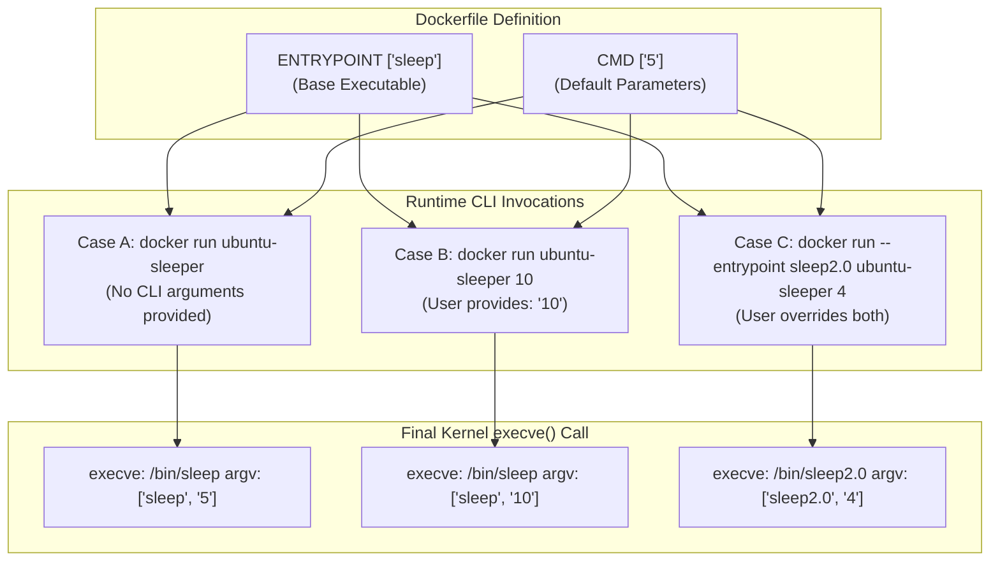
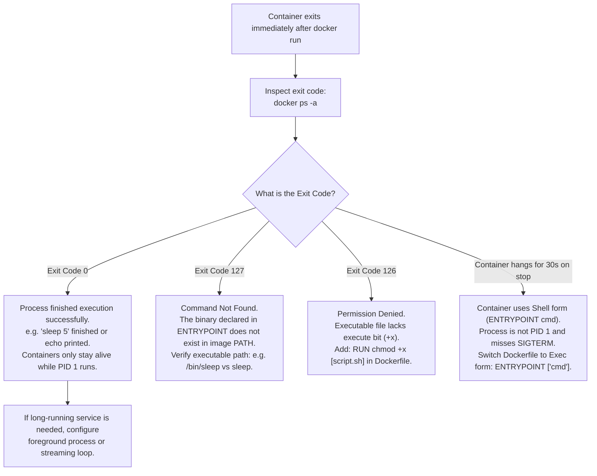

# Container Entrypoint & Commands in Docker - CKA Exam Notes

> **Exam Domain**: Application Lifecycle Management (15%) / Core Concepts (Understanding Pod Command & Arguments)  
> **Weight / Importance**: High (Foundational container knowledge essential for mastering Kubernetes `command` and `args` overrides in Pod specifications)  
> **Target Version**: Verified against OCI Runtime Spec / Modern Docker & containerd  
> **Allowed Docs Search Keywords**: `Define a Command and Arguments for a Container`, `ENTRYPOINT`, `CMD`  
> **Source**: Generated from `application-lifecycle-management/configuring-application/02-commands-and-arguments-in-docker-raw.md`

---

## 1. Quick-Reference Summary

- **`CMD` Instruction**:
  - Defines the default command or default arguments passed to the container executable.
  - Easily overridden at runtime by appending arguments after the image name:
    `docker run <image> <command/args>`
- **`ENTRYPOINT` Instruction**:
  - Defines the fixed executable binary that runs as **PID 1** when the container boots.
  - Not overridden by standard CLI arguments; trailing CLI arguments are appended to the entrypoint.
  - Can only be overridden using the explicit flag:
    `docker run --entrypoint <binary> <image> <args>`
- **The Ideal Collaboration Pattern (`ENTRYPOINT` + `CMD`)**:
  - When combined in Exec form:
    ```dockerfile
    ENTRYPOINT ["sleep"]
    CMD ["5"]
    ```
  - Running `docker run ubuntu-sleeper` executes: **`sleep 5`** (uses default argument from `CMD`).
  - Running `docker run ubuntu-sleeper 10` executes: **`sleep 10`** (CLI argument `10` overrides `CMD ["5"]` while preserving the `sleep` entrypoint).
- **Exec Form vs. Shell Form (Critical Rule)**:
  - **Exec Form (`["executable", "param1"]`)**: Invokes binary directly via kernel `execve()`. The process runs as **PID 1** and properly receives Linux signals (`SIGTERM`, `SIGINT`). **Always use Exec form**.
  - **Shell Form (`executable param1`)**: Wraps execution in `/bin/sh -c`. The shell runs as PID 1, and child processes do not receive `SIGTERM`, causing 30-second shutdown timeouts.
- **The Docker-to-Kubernetes Naming Inversion**:
  - Docker **`ENTRYPOINT`** $\Longleftrightarrow$ Kubernetes **`spec.containers[].command`**
  - Docker **`CMD`** $\Longleftrightarrow$ Kubernetes **`spec.containers[].args`**

---

## 2. Conceptual Overview & Mental Model

### Dual-Layer Architectural Understanding

- **Simple English Explanation (How It Works)**:
  - **How Linux Starts a Containerized Process**:
    A container is essentially an isolated Linux process running inside dedicated namespaces (PID, mount, network, IPC) and constrained by cgroups.
    When a container starts, the container runtime invokes the Linux kernel system call `execve(const char *filename, char *const argv[], char *const envp[])`.
    To execute this system call, the runtime needs two fundamental parameters:
    1. **The Executable Target**: Which binary file should be loaded into memory and run (e.g., `/bin/sleep` or `/usr/local/bin/python`).
    2. **The Argument Vector (`argv`)**: What array of parameters and options should be passed to that executable (e.g., `["10"]` or `["app.py", "--port=8080"]`).
  - **The Roles of `ENTRYPOINT` and `CMD`**:
    - **`ENTRYPOINT`** defines the fixed executable binary (`filename` and initial `argv[0]`). It establishes what the container fundamentally does.
    - **`CMD`** supplies the default parameters (`argv[1..n]`). If the container operator provides no arguments on the command line, `CMD` fills in the blanks. If the operator supplies arguments, `CMD` is completely discarded and replaced with the user's inputs.



- **Standard / Production Definition**:
  - **Container Command & Entrypoint**: Metadata parameters within an OCI-compliant container image configuration that construct the execution vector for the root process (`PID 1`). `ENTRYPOINT` sets the immutable executable prefix, while `CMD` supplies mutable arguments that can be overridden by runtime CLI parameters or orchestrator pod manifests.

---

## 3. Deep-Dive Technical Breakdown

### 3.1 Exec Form vs. Shell Form

Both `CMD` and `ENTRYPOINT` support two distinct syntaxes with dramatically different runtime behaviors:

| Syntax Style | Example Dockerfile Syntax | Underlying Kernel Invocation | Process Identification (PID 1) | Linux Signal Handling (`SIGTERM`) |
| :--- | :--- | :--- | :--- | :--- |
| **Exec Form (Preferred)** | `ENTRYPOINT ["sleep", "10"]` | Directly executes binary via `execve` | The application process **is PID 1** | **Directly receives signals**; enables clean, immediate graceful shutdown. |
| **Shell Form (Avoid)** | `ENTRYPOINT sleep 10` | Executed as `/bin/sh -c "sleep 10"` | `/bin/sh` is PID 1; target app is a child process | **Fails to receive `SIGTERM`**; shell does not forward signals, causing container to hang until killed by `SIGKILL` (default 30s timeout). |

> [!IMPORTANT]
> **Strict JSON Formatting Requirement**:
> Exec form requires strict JSON syntax. You **must use double quotes (`"`)**. Using single quotes (`['sleep', '5']`) causes Docker to treat the instruction as Shell form or fail to parse.

---

### 3.2 The Four Combinations of `ENTRYPOINT` and `CMD`

The interplay between `ENTRYPOINT` and `CMD` governs the final command line executed inside the container:

| Dockerfile `ENTRYPOINT` | Dockerfile `CMD` | Invocation: `docker run <image>` | Invocation: `docker run <image> arg1 arg2` |
| :--- | :--- | :--- | :--- |
| *None* | `CMD ["sleep", "5"]` | `sleep 5` | `arg1 arg2` (Completely replaces `CMD`) |
| `ENTRYPOINT ["sleep"]` | *None* | `sleep` (Fails if binary requires an argument) | `sleep arg1 arg2` |
| **`ENTRYPOINT ["sleep"]`** | **`CMD ["5"]`** | **`sleep 5`** (Uses default argument) | **`sleep arg1 arg2`** (Overrides default argument) |
| `ENTRYPOINT ["sleep"]` | `CMD ["--help"]` | `sleep --help` | `sleep arg1 arg2` |

---

### 3.3 Practical Demonstration: Building `ubuntu-sleeper`

#### Dockerfile 1: Hardcoded Command via `CMD`
```dockerfile
FROM ubuntu:22.04
CMD ["sleep", "5"]
```
- Running `docker run ubuntu-sleeper` $\rightarrow$ executes `sleep 5`.
- To sleep for 10 seconds, the user must re-specify the entire command:
  `docker run ubuntu-sleeper sleep 10`.

#### Dockerfile 2: Hardcoded Executable via `ENTRYPOINT`
```dockerfile
FROM ubuntu:22.04
ENTRYPOINT ["sleep"]
```
- Running `docker run ubuntu-sleeper 10` $\rightarrow$ executes `sleep 10`.
- Problem: Running `docker run ubuntu-sleeper` without arguments fails with:
  `sleep: missing operand`.

#### Dockerfile 3: The Production Standard (Configurable Defaults)
```dockerfile
FROM ubuntu:22.04
ENTRYPOINT ["sleep"]
CMD ["5"]
```
- Running `docker run ubuntu-sleeper` $\rightarrow$ executes `sleep 5` (safe default).
- Running `docker run ubuntu-sleeper 10` $\rightarrow$ executes `sleep 10` (clean override).
- Overriding entrypoint:
  `docker run --entrypoint sleep2.0 ubuntu-sleeper 4` $\rightarrow$ executes `sleep2.0 4`.

---

### 3.4 The Bridge to Kubernetes: Command & Arguments Mapping


When running containers in Kubernetes, the terminology is mapped as follows:

| Docker Term | Kubernetes Pod Spec Field | Purpose |
| :--- | :--- | :--- |
| **`ENTRYPOINT`** | **`spec.containers[].command`** | The executable binary to run inside the container. Overrides the image's `ENTRYPOINT`. |
| **`CMD`** | **`spec.containers[].args`** | The arguments passed to the executable. Overrides the image's `CMD`. |

---

## 4. Declarative Manifests & Scaffolding Patterns

### Dockerfile Scaffolding: Configurable Application Entrypoint

```dockerfile
# Dockerfile
FROM ubuntu:22.04

# Install required dependencies
RUN apt-get update && apt-get install -y --no-install-recommends \
    curl \
    ca-certificates \
    && rm -rf /var/lib/apt/lists/*

# Copy application binary or script
COPY entrypoint.sh /usr/local/bin/entrypoint.sh
RUN chmod +x /usr/local/bin/entrypoint.sh

# Use Exec form for PID 1 signal propagation
ENTRYPOINT ["/usr/local/bin/entrypoint.sh"]

# Provide sensible default parameters
CMD ["--mode=standard", "--port=8080"]
```

```bash
# entrypoint.sh
#!/bin/sh
set -e

echo "Starting container root process..."
# Forward execution directly to application binary so it retains PID 1
exec my-app "$@"
```

---

## 5. Command Translation & Operational Mapping Tables

### Overriding Commands in Docker vs. Kubernetes

| Operational Action | Docker CLI Syntax | Kubernetes Pod Manifest Syntax |
| :--- | :--- | :--- |
| **Override Arguments Only** | `docker run my-image 10` | `spec.containers[0].args: ["10"]` |
| **Override Executable Binary** | `docker run --entrypoint /bin/sh my-image` | `spec.containers[0].command: ["/bin/sh"]` |
| **Override Both Binary & Args** | `docker run --entrypoint /bin/sh my-image -c "date"` | `command: ["/bin/sh"]`<br/>`args: ["-c", "date"]` |
| **Run Container Interactively** | `docker run -it my-image /bin/bash` | `kubectl run -it --rm test --image=my-image -- /bin/bash` |

---

## 6. High-Yield CLI & Imperative Commands

```bash
# 1. Run container using default ENTRYPOINT and default CMD
docker run -d --name sleeper ubuntu-sleeper

# 2. Override default CMD arguments by appending to the command
docker run --name sleeper-10 ubuntu-sleeper 10

# 3. Override ENTRYPOINT and pass new arguments
docker run --name sleeper-custom --entrypoint sleep2.0 ubuntu-sleeper 4

# 4. List currently active (running) containers
docker ps

# 5. List all containers across all states (Up, Exited, Created)
docker ps -a

# 6. Inspect the configured ENTRYPOINT of a container image
docker inspect --format='{{json .Config.Entrypoint}}' ubuntu-sleeper

# 7. Inspect the configured CMD of a container image
docker inspect --format='{{json .Config.Cmd}}' ubuntu-sleeper

# 8. Inspect the running processes inside a container to verify PID 1
docker top sleeper
```

---

## 7. Troubleshooting & Diagnostic Runbook

### Decision Tree: Container Exits Immediately on Startup



---

## 8. CKA Exam Tips, Gotchas & Traps

> [!WARNING]
> **The Docker vs. Kubernetes Terminology Inversion**:
> The most infamous trap in Kubernetes exams:
> - In Docker: `ENTRYPOINT` is the executable, `CMD` is the arguments.
> - In Kubernetes: **`command` is the executable**, **`args` is the arguments**.
> If you write `command: ["5"]` in a Pod manifest intending to change the sleep time, Kubernetes replaces the binary with `"5"`, resulting in `CrashLoopBackOff (exec: "5": executable file not found in $PATH)`.

> [!IMPORTANT]
> **Always Use JSON Double Quotes in Exec Form**:
> When defining `ENTRYPOINT ["bin", "param"]` or Kubernetes `command: ["bin", "param"]`, **always use valid JSON double quotes**. Single quotes (`['bin']`) are rejected by YAML/JSON parsers or cause Docker to execute via shell mode.

> [!TIP]
> **Containers Terminate When PID 1 Exits**:
> A container only stays in the `Up` state as long as its initial root process (`PID 1`) is running. Running `docker run ubuntu` without arguments starts `/bin/bash`, which detects no attached interactive terminal and exits immediately with code `0`.

---

## 9. Self-Test / Active Recall

1. **What is the key functional difference between `CMD` and `ENTRYPOINT` in a Dockerfile?**
2. **If a Dockerfile specifies `ENTRYPOINT ["sleep"]` and `CMD ["5"]`, what command is executed if you run `docker run my-image 10`?**
3. **What is the difference between Exec form and Shell form, and why must you always use Exec form in production containers?**
4. **How do Docker's `ENTRYPOINT` and `CMD` map to the fields of a Kubernetes Pod specification?**
5. **Which Docker CLI flag is used to override an image's hardcoded `ENTRYPOINT`?**
6. **Why does a container created via `docker run ubuntu` exit immediately with code 0?**
7. **If a container takes exactly 30 seconds to terminate whenever `docker stop` or `kubectl delete pod` is executed, what is the most likely root cause in the Dockerfile?**

<details>
<summary>Reveal Answers</summary>

1. `ENTRYPOINT` defines the executable binary that runs as PID 1. `CMD` defines default parameters that can be easily overridden by passing arguments after the image name at runtime.
2. `sleep 10` (the CLI argument `10` overrides `CMD ["5"]`, but appends to `ENTRYPOINT ["sleep"]`).
3. Exec form (`["bin", "arg"]`) runs the binary directly as PID 1 via `execve()`, allowing it to receive `SIGTERM` signals for graceful shutdown. Shell form (`bin arg`) wraps execution in `/bin/sh -c`, preventing child processes from receiving `SIGTERM` and causing delayed SIGKILL termination.
4. Docker `ENTRYPOINT` maps to Kubernetes `command`. Docker `CMD` maps to Kubernetes `args`.
5. `--entrypoint` (e.g. `docker run --entrypoint /bin/sh <image>`).
6. Because the default CMD is `/bin/bash`. Since no interactive TTY is attached (`-it`), bash reaches EOF and terminates immediately. When PID 1 exits, the container stops.
7. The container was started using Shell form (`ENTRYPOINT sleep 100` or `CMD sleep 100`). The shell (`/bin/sh`) runs as PID 1 and fails to forward `SIGTERM` to the child process, forcing Kubernetes or Docker to wait for the full 30-second graceful timeout before issuing `SIGKILL`.
</details>

---

### Official Documentation Bookmarks

Allowed for reference during the live exam at [kubernetes.io/docs](https://kubernetes.io/docs/home/):

| Topic | Direct Search Term | Recommended Anchor |
| :--- | :--- | :--- |
| **Command and Arguments** | `Define a Command and Arguments for a Container` | Tasks > Inject Data Into Applications > Define a Command and Arguments for a Container |
| **Container Lifecycle** | `Container Lifecycle Hooks` | Concepts > Containers > Container Lifecycle Hooks |
| **Docker ENTRYPOINT Reference** | `Dockerfile reference ENTRYPOINT` | Official Dockerfile specification for ENTRYPOINT and CMD |
