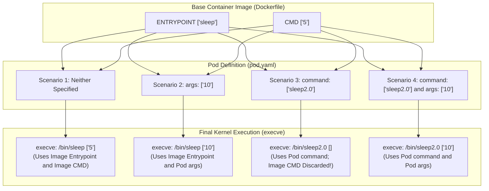
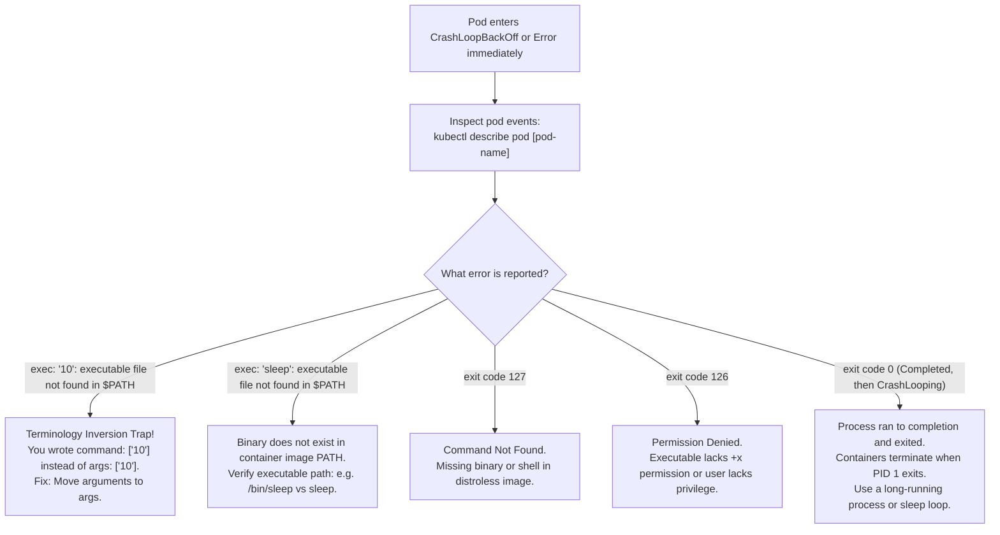

# Commands & Arguments in Kubernetes Pods - CKA Exam Notes

> **Exam Domain**: Application Lifecycle Management (15%) / Core Concepts  
> **Weight / Importance**: High (Critical exam topic testing the precise syntax, override rules, and imperative generation of `command` and `args` in Pod specifications)  
> **Target Version**: Verified against v1.31 / v1.32 (Current CKA Curriculum)  
> **Allowed Docs Search Keywords**: `Define a Command and Arguments for a Container`, `command`, `args`, `Pod spec`  
> **Source**: Generated from `application-lifecycle-management/configuring-application/03-commands-and-arguments-in-pod-raw.md`

---

## 1. Quick-Reference Summary

- **The Docker-to-Kubernetes Mapping Inversion**:
  - Kubernetes **`command`** $\Longleftrightarrow$ Overrides Docker **`ENTRYPOINT`** (The executable binary).
  - Kubernetes **`args`** $\Longleftrightarrow$ Overrides Docker **`CMD`** (The parameters passed to the executable).
- **The 4 Rules of Command/Args Interaction**:
  1. **Supply Neither**: Container executes the image's default `ENTRYPOINT` with the image's default `CMD`.
  2. **Supply `args` Only**: Container executes the image's default `ENTRYPOINT` passed with your custom `args`. (Image's `CMD` is ignored).
  3. **Supply `command` Only**: Container executes your custom `command`. **The image's default `CMD` is completely discarded!**
  4. **Supply Both `command` & `args`**: Container executes your custom `command` with your custom `args`. (Image's `ENTRYPOINT` and `CMD` are both ignored).
- **Imperative `kubectl run` Flag Behavior**:
  - `kubectl run my-pod --image=ubuntu -- 10` $\longrightarrow$ Generates **`args: ["10"]`**
  - `kubectl run my-pod --image=busybox --command -- sleep 3600` $\longrightarrow$ Generates **`command: ["sleep", "3600"]`**
- **Environment Variable Expansion**:
  - Use Kubernetes syntax **`$(VAR_NAME)`** inside `command` or `args` to interpolate values from `env` or `envFrom`.
  - To escape a variable (preventing interpolation), use double dollar signs: **`$$(VAR_NAME)`**.
- **Immutability Constraint**:
  - `command` and `args` are **strictly immutable on running Pods**. You cannot update them using `kubectl edit pod`. You must delete and recreate the Pod (or force-replace via `kubectl replace --force -f pod.yaml`).

---

## 2. Conceptual Overview & Mental Model

### Dual-Layer Architectural Understanding

- **Simple English Explanation (How It Works)**:
  - **Why Containers Need Configuration Overrides**:
    A pre-built container image (such as `python:3.11`, `busybox`, or an in-house microservice) is packaged with a default startup command.
    However, when deploying that image across different environments, you frequently need to customize its behavior—for example, changing a sleep interval from 5 seconds to 3600 seconds, starting a web server with a custom `--config=/etc/app.json` flag, or executing an initialization loop before launching the main binary.
  - **How Kubernetes Passes Commands to the Container Runtime**:
    When `kubelet` instructs the container runtime (`containerd`) to create a container, it constructs an OCI (Open Container Initiative) runtime configuration.
    1. If your Pod spec declares `command`, Kubernetes supplies that array as the primary executable target (`argv[0]`).
    2. If your Pod spec declares `args`, Kubernetes appends those strings to the argument vector (`argv[1..n]`).
    3. If you omit either field, the container runtime inspects the image manifest and fills in the blanks using the image's compiled `Entrypoint` and `Cmd`.
    4. The Linux kernel's `execve()` system call is then invoked with the final unified argument array.



- **Standard / Production Definition**:
  - **Pod Command & Arguments**: Spec fields within the Kubernetes core API (`spec.containers[].command` and `spec.containers[].args`) that override the underlying OCI image configuration's `Entrypoint` and `Cmd` arrays. They define the process execution vector executed as PID 1 within the container's isolated Linux PID namespace.

---

## 3. Deep-Dive Technical Breakdown

### 3.1 Mapping Docker to Kubernetes


The direct mapping between the Dockerfile instructions and the Kubernetes Pod specification fields:

| Dockerfile Instruction | Kubernetes Pod Spec Field | Functional Role |
| :--- | :--- | :--- |
| **`ENTRYPOINT ["executable"]`** | **`spec.containers[].command`** | The executable binary to run. Replaces the image's `ENTRYPOINT`. |
| **`CMD ["arg1", "arg2"]`** | **`spec.containers[].args`** | The arguments passed to the executable. Replaces the image's `CMD`. |

---

### 3.2 The 4 Interaction Scenarios Matrix

Understanding how Kubernetes reconciles container image defaults with Pod specifications is essential for the CKA exam:

| Scenario | Pod Spec `command` | Pod Spec `args` | Image `ENTRYPOINT` | Image `CMD` | Final Command Executed at Runtime |
| :--- | :--- | :--- | :--- | :--- | :--- |
| **1. Default** | *Not set* | *Not set* | `["sleep"]` | `["5"]` | `sleep 5` |
| **2. Override Args** | *Not set* | `["10"]` | `["sleep"]` | `["5"]` | `sleep 10` |
| **3. Override Command** | `["sleep2.0"]` | *Not set* | `["sleep"]` | `["5"]` | **`sleep2.0`** *(Warning: `CMD ["5"]` is dropped!)* |
| **4. Override Both** | `["sleep2.0"]` | `["10"]` | `["sleep"]` | `["5"]` | `sleep2.0 10` |

> [!WARNING]
> **The Dropped CMD Trap (Scenario 3)**:
> If an image has `ENTRYPOINT ["sleep"]` and `CMD ["5"]`, and you specify only `command: ["sleep2.0"]` in your Pod manifest, **the container will NOT run `sleep2.0 5`**. Specifying `command` causes Kubernetes to completely ignore the image's default `CMD`. The container will execute `sleep2.0` with no arguments (which causes an immediate crash if the binary requires an argument).

---

### 3.3 Exec Form vs. Shell Wrapping Patterns

In Kubernetes manifests, you can define commands using two distinct patterns:

#### Pattern 1: Direct Binary Execution (Exec Form)
```yaml
spec:
  containers:
  - name: sleeper
    image: ubuntu-sleeper
    command: ["sleep2.0"]
    args: ["10"]
```
- Direct execution via kernel `execve`.
- The `sleep2.0` process runs as **PID 1**.
- Receives `SIGTERM` signals directly from Kubelet for clean shutdown.

#### Pattern 2: Shell Wrapping with Scripting Logic
If you need shell features (such as environment variable expansion, pipes `|`, conditional logic `&&`, or redirection `>`):
```yaml
spec:
  containers:
  - name: custom-script
    image: busybox:1.36
    command: ["/bin/sh", "-c"]
    args:
    - >
      echo "Initializing database..." &&
      sleep 2 &&
      echo "System ready!" &&
      while true; do date; sleep 10; done
```

> [!TIP]
> **Preserving PID 1 in Shell Scripts via `exec`**:
> When running a shell wrapper that eventually launches your main application, prefix the final binary with **`exec`**:
> `command: ["/bin/sh", "-c", "export PORT=80 && exec my-app"]`  
> The `exec` command replaces the shell process with `my-app`, ensuring `my-app` becomes **PID 1** and receives termination signals!

---

### 3.4 Environment Variable Interpolation in `args`

Kubernetes supports dynamic variable substitution inside `command` and `args` using the `$(VAR_NAME)` syntax:

```yaml
apiVersion: v1
kind: Pod
metadata:
  name: env-interpolation-pod
spec:
  containers:
  - name: demo
    image: busybox:1.36
    env:
    - name: SLEEP_DURATION
      value: "15"
    - name: GREETING
      value: "Hello from Kubernetes"
    command: ["/bin/sh", "-c"]
    args: ["echo $(GREETING) && sleep $(SLEEP_DURATION)"]
```

- **Escaping**: If you want to pass a literal string containing `$(VAR)` without Kubernetes expanding it, escape it with double dollar signs: `$$(VAR)`.

---

## 4. Declarative Manifests & Scaffolding Patterns

### Complete Workflow: Declaring Commands, Arguments, and Environment Interpolation

```yaml
# pod-definition.yaml
apiVersion: v1
kind: Pod
metadata:
  name: ubuntu-sleeper-pod
  labels:
    app: sleeper
spec:
  restartPolicy: OnFailure
  containers:
  - name: ubuntu-sleeper
    image: ubuntu-sleeper:latest
    # Overrides Dockerfile ENTRYPOINT
    command: ["sleep2.0"]
    # Overrides Dockerfile CMD
    args: ["10"]
    resources:
      requests:
        cpu: "50m"
        memory: "64Mi"
      limits:
        cpu: "100m"
        memory: "128Mi"
```

---

## 5. Command Translation & Operational Mapping Tables

### Comparison: `kubectl run` Command Generation

| Imperative CLI Command | Generated Pod Spec `command` | Generated Pod Spec `args` | Final Runtime Execution |
| :--- | :--- | :--- | :--- |
| `kubectl run test --image=busybox` | *None* (uses image default) | *None* (uses image default) | Image default |
| `kubectl run test --image=ubuntu-sleeper -- 10` | *None* | `args: ["10"]` | `sleep 10` (Appends 10 to image ENTRYPOINT) |
| `kubectl run test --image=busybox --command -- sleep 3600` | `command: ["sleep", "3600"]` | *None* | `sleep 3600` |
| `kubectl run test --image=busybox --command -- /bin/sh -c "sleep 60"` | `command: ["/bin/sh", "-c", "sleep 60"]` | *None* | `/bin/sh -c "sleep 60"` |

---

## 6. High-Yield CLI & Imperative Commands

```bash
# 1. Generate pod manifest with custom arguments (without creating)
kubectl run my-pod --image=ubuntu-sleeper --dry-run=client -o yaml -- 10

# 2. Generate pod manifest with custom command and arguments
kubectl run my-pod --image=busybox --dry-run=client -o yaml --command -- /bin/sh -c "sleep 3600"

# 3. Create an ad-hoc debugging container that exits after printing date
kubectl run debug-temp --rm -i --image=busybox --command -- date

# 4. Inspect the exact command and args configured on a running pod
kubectl get pod my-pod -o jsonpath='{.spec.containers[0].command}{"\n"}{.spec.containers[0].args}{"\n"}'

# 5. Live pod replacement when command or args must be modified
kubectl get pod my-pod -o yaml > my-pod.yaml
# Edit command / args in my-pod.yaml
kubectl replace --force -f my-pod.yaml
```

---

## 7. Troubleshooting & Diagnostic Runbook

### Decision Tree: Troubleshooting Command & Args Failures



### Step-by-Step Triage Sequence

#### Scenario: `CrashLoopBackOff` with `executable file not found`
1. **Symptom**: Pod fails to start.
2. **Inspect Error**:
   ```bash
   kubectl describe pod my-pod | grep -A 5 "State:"
   # Last State: Terminated
   #   Reason: ContainerCannotRun
   #   Message: OCI runtime create failed: ... exec: "10": executable file not found in $PATH: unknown
   ```
3. **Root Cause**: The operator specified `command: ["10"]` in the manifest, intending to pass `10` as an argument to `ubuntu-sleeper`. The container runtime attempted to execute a binary named `10`.
4. **Resolution**:
   Update the manifest to:
   ```yaml
   args: ["10"] # Correct! Leaves image ENTRYPOINT intact
   ```
   Recreate the pod:
   ```bash
   kubectl replace --force -f my-pod.yaml
   ```

---

## 8. CKA Exam Tips, Gotchas & Traps

> [!WARNING]
> **The `kubectl run --command` Flag Trap**:
> - If you run: `kubectl run test --image=busybox -- sleep 3600`, Kubernetes generates **`args: ["sleep", "3600"]`**.
> - If you run: `kubectl run test --image=busybox --command -- sleep 3600`, Kubernetes generates **`command: ["sleep", "3600"]`**.  
> Always double-check generated YAML with `--dry-run=client -o yaml` before applying!

> [!IMPORTANT]
> **Always Quote Numeric and Boolean Arguments**:
> In YAML, writing `args: [10]` or `args: [true]` causes the parser to treat values as integers or booleans. Kubernetes Pod specs require strings: `spec.containers[].args: []string`. Always wrap arguments in quotes:
> `args: ["10", "true"]`

> [!CAUTION]
> **Running Pods Cannot Be Edited In-Place**:
> `spec.containers[*].command` and `spec.containers[*].args` are **immutable**. Running `kubectl edit pod` and modifying them will result in an error:
> `The Pod "my-pod" is invalid: spec: Forbidden: pod updates may not change fields other than ...`  
> You must delete and recreate the pod, or edit the parent Deployment.

---

## 9. Self-Test / Active Recall

1. **Which Dockerfile instruction does Kubernetes `command` override?**
2. **Which Dockerfile instruction does Kubernetes `args` override?**
3. **If a container image has `ENTRYPOINT ["python"]` and `CMD ["app.py"]`, what command runs if you specify only `args: ["server.py"]` in the Pod spec?**
4. **If a container image has `ENTRYPOINT ["sleep"]` and `CMD ["5"]`, what command runs if you specify only `command: ["sleep2.0"]` in the Pod spec?**
5. **How does the presence of `--command` change the behavior of `kubectl run my-pod --image=busybox -- <arguments>`?**
6. **How do you interpolate the value of an environment variable named `PORT` into container `args`?**
7. **Why does setting `command: ["5"]` on an `ubuntu-sleeper` pod cause a fatal runtime crash?**

<details>
<summary>Reveal Answers</summary>

1. `ENTRYPOINT`.
2. `CMD`.
3. `python server.py` (The image's default `ENTRYPOINT` is preserved, and custom `args` override `CMD`).
4. `sleep2.0` with no arguments. Specifying `command` causes Kubernetes to discard the image's default `CMD`.
5. Without `--command`, trailing arguments after `--` become `args: [...]`. With `--command`, trailing arguments become `command: [...]`.
6. Use `$(PORT)`.
7. Because `command` sets the executable binary, not the arguments. The container runtime tries to execute a binary named `"5"`, which does not exist in `$PATH`.
</details>

---

### Official Documentation Bookmarks

Allowed for reference during the live exam at [kubernetes.io/docs](https://kubernetes.io/docs/home/):

| Topic | Direct Search Term | Recommended Anchor |
| :--- | :--- | :--- |
| **Command and Arguments** | `Define a Command and Arguments for a Container` | Tasks > Inject Data Into Applications > Define a Command and Arguments for a Container |
| **Pod Specification** | `PodSpec v1 core` | Reference > Kubernetes API > Workload Resources > Pod (v1 core) |
| **Container API Reference** | `Container v1 core` | Reference > Kubernetes API > Workload Resources > Container |
