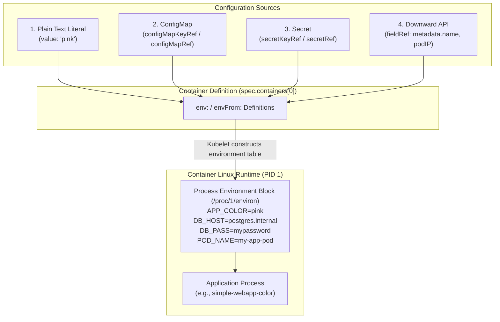
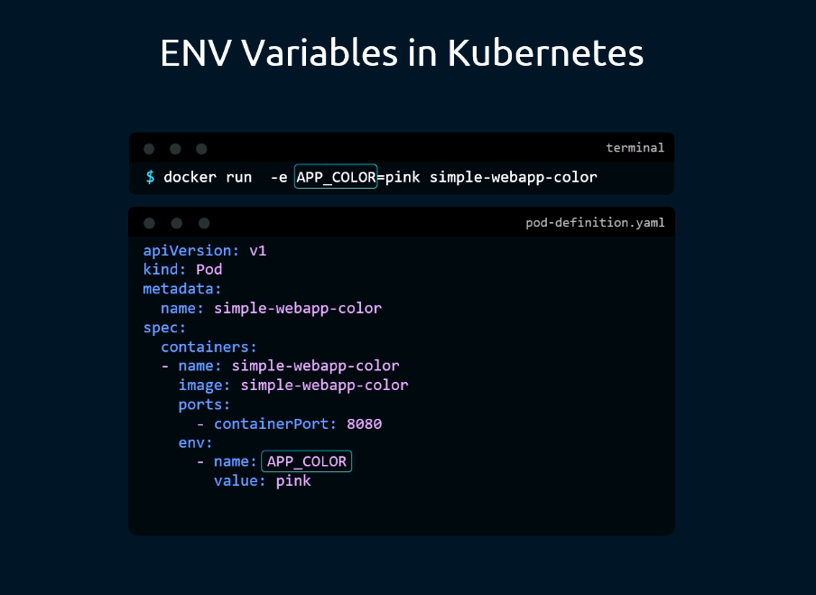
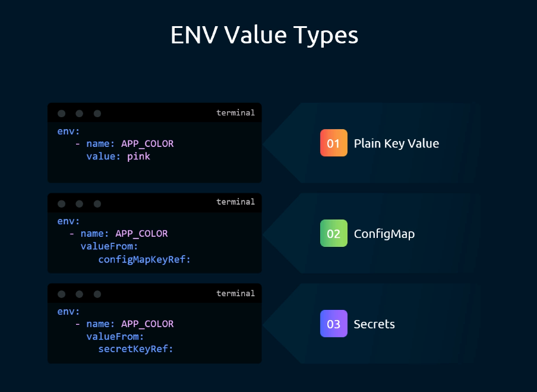
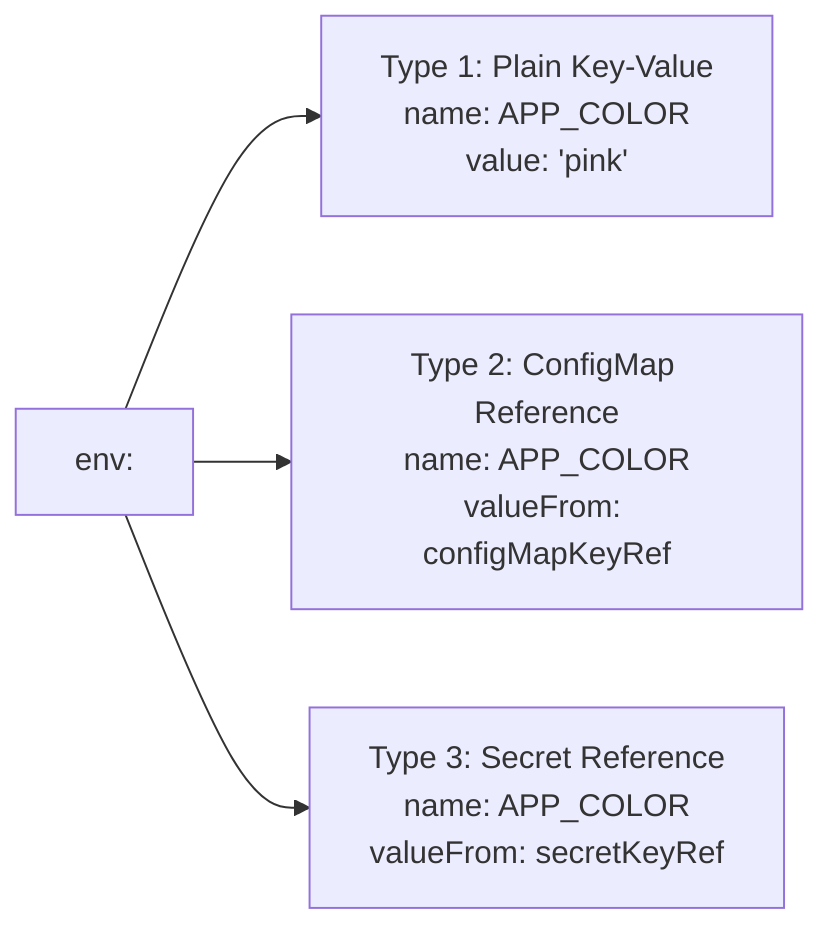
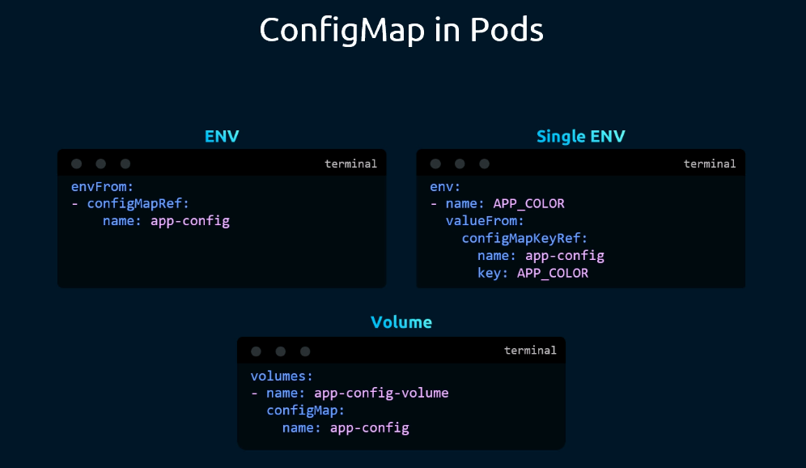
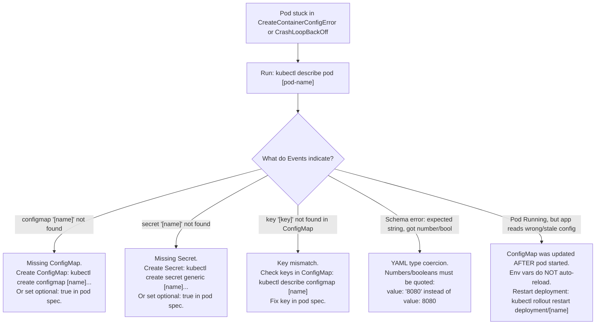

# Configuring Environment Variables in Kubernetes - CKA Exam Notes

> **Exam Domain**: Application Lifecycle Management (15%) / Core Concepts  
> **Weight / Importance**: High (Core configuration topic testing static values, dynamic references via ConfigMaps and Secrets, bulk imports via `envFrom`, and Downward API metadata injection)  
> **Target Version**: Verified against v1.31 / v1.32 (Current CKA Curriculum)  
> **Allowed Docs Search Keywords**: `Define Environment Variables for a Container`, `envFrom`, `valueFrom`, `configMapKeyRef`, `secretKeyRef`  
> **Source**: Generated from `application-lifecycle-management/configuring-application/04-configuring-env-variables-raw.md`

---

## 1. Quick-Reference Summary

- **Container-Level Scope**:
  - Environment variables are declared at the **individual container level** (`spec.containers[].env` or `spec.containers[].envFrom`), not at the Pod root level.
- **The Three Core Value Injection Methods**:
  1. **Plain Key-Value Pair (`value`)**: Static literal string hardcoded in the manifest (`value: "pink"`).
  2. **ConfigMap Key Reference (`configMapKeyRef`)**: Dynamically extracts a single key from a ConfigMap.
  3. **Secret Key Reference (`secretKeyRef`)**: Dynamically extracts a single base64-decoded key from a Secret.
- **Bulk Injection via `envFrom`**:
  - Injects **all key-value pairs** from a ConfigMap or Secret into the container environment simultaneously using **`configMapRef`** or **`secretRef`**.
  - Can append an optional **`prefix`** (e.g. `prefix: "APP_"` turns key `PORT` into `APP_PORT`).
- **The Downward API (`fieldRef` & `resourceFieldRef`)**:
  - Exposes Pod metadata (`metadata.name`, `metadata.namespace`, `status.podIP`, `spec.nodeName`) or container resource requests/limits directly as environment variables.
- **Dependent Variable Chaining**:
  - Variables declared earlier in the `env` list can be referenced by subsequent variables using **`$(VAR_NAME)`** syntax.
- **Critical CKA / YAML Traps**:
  - **Values Must Be Strings**: Numeric or boolean values (e.g., `8080`, `true`) must be quoted (`value: "8080"`). Unquoted integers fail YAML validation with schema errors.
  - **Missing Reference Blocks Pod**: If a Pod references a non-existent ConfigMap, Secret, or key, the Pod gets stuck in **`CreateContainerConfigError`**.

---

## 2. Conceptual Overview & Mental Model

### Dual-Layer Architectural Understanding

- **Simple English Explanation (How It Works)**:
  - **Why Environment Variables are Essential**:
    Following the 12-Factor App methodology, application code and configuration must be strictly separated.
    A single immutable container image (e.g. `simple-webapp-color`) should run across local development, testing, staging, and production environments without being rebuilt.
    Environment variables provide the runtime parameters—such as database hostnames, port bindings, color schemes, and API credentials—that adapt the container to its operational environment.
  - **How Kubernetes Injects Environment Variables**:
    When `kubelet` prepares to launch a container via the Container Runtime Interface (CRI):
    1. It deserializes the `env` and `envFrom` arrays declared in the Pod specification.
    2. For static values, it takes the string directly.
    3. For dynamic references (`valueFrom`), Kubelet queries its local in-memory cache or the API server to resolve the target `ConfigMap` or `Secret`, extracts the specific key, and decodes the secret.
    4. For Downward API references, it extracts the Pod's runtime metadata (such as its assigned Pod IP or node name).
    5. Kubelet merges all key-value pairs into the container's process environment table (`/proc/1/environ`), making them accessible to standard language utilities (e.g. `os.environ["APP_COLOR"]` in Python or `process.env.APP_COLOR` in Node.js).



- **Standard / Production Definition**:
  - **Pod Environment Variables**: Key-value string pairs injected into a container's POSIX execution context at startup via `spec.containers[].env` and `spec.containers[].envFrom`. They decouple runtime parameters, secret credentials, and cluster metadata from static container ../../Images, enabling dynamic workload configuration across deployment tiers.

---

## 3. Deep-Dive Technical Breakdown

### 3.1 Mapping Docker to Kubernetes



In Docker, environment variables are passed imperatively via the `-e` flag:
```bash
docker run -e APP_COLOR=pink simple-webapp-color
```

In Kubernetes, this translates declaratively into the Pod's `env` array:
```yaml
apiVersion: v1
kind: Pod
metadata:
  name: simple-webapp-color
spec:
  containers:
  - name: simple-webapp-color
    image: simple-webapp-color
    ports:
    - containerPort: 8080
    env:
    - name: APP_COLOR
      value: "pink"
```

---

### 3.2 The Three Environment Value Types



Kubernetes supports three distinct mechanisms under `env` to populate an environment variable:



#### Type 1: Plain Key-Value (`value`)
- Direct, hardcoded string.
- Best suited for non-sensitive, static values that rarely change.
```yaml
env:
- name: APP_COLOR
  value: "pink"
```

#### Type 2: Sourced from a ConfigMap (`configMapKeyRef`)
- Separates configuration from pod definitions.
- Changes to the ConfigMap update the central source of truth.
```yaml
env:
- name: APP_COLOR
  valueFrom:
    configMapKeyRef:
      name: app-config         # Target ConfigMap name
      key: APP_COLOR           # Specific key within the ConfigMap
      optional: false          # Default false: Pod fails if missing
```

#### Type 3: Sourced from a Secret (`secretKeyRef`)
- Securely pulls sensitive credentials (passwords, tokens, API keys).
- Value is automatically base64-decoded into the container process.
```yaml
env:
- name: DB_PASSWORD
  valueFrom:
    secretKeyRef:
      name: db-credentials     # Target Secret name
      key: password            # Specific key within the Secret
      optional: false
```

---

### 3.3 Bulk Environment Injection (`envFrom`) vs. Single Injection vs. Volumes



When an application requires dozens of configuration keys, specifying each key manually under `env` is tedious and error-prone. Kubernetes provides **`envFrom`** to bulk-import all keys:

#### 1. Bulk Environment Import (`envFrom`)
Loads every key-value pair in the ConfigMap or Secret as an environment variable in one stanza:
```yaml
spec:
  containers:
  - name: web
    image: nginx
    envFrom:
    - configMapRef:
        name: app-config
    - secretRef:
        name: app-secrets
      prefix: "SEC_"           # Optional: prepends SEC_ to all secret keys
```

#### 2. Single Key Injection (`env` with `valueFrom`)
Explicitly selects one key and maps it to a custom container variable name:
```yaml
spec:
  containers:
  - name: web
    image: nginx
    env:
    - name: APP_COLOR
      valueFrom:
        configMapKeyRef:
          name: app-config
          key: APP_COLOR
```

#### 3. Mounting as a Volume (`volumes` + `volumeMounts`)
Mounts the ConfigMap or Secret as a directory where each key becomes a separate file:
```yaml
spec:
  containers:
  - name: web
    image: nginx
    volumeMounts:
    - name: app-config-volume
      mountPath: /etc/config
      readOnly: true
  volumes:
  - name: app-config-volume
    configMap:
      name: app-config
```

---

### 3.4 Downward API: Injecting Pod & Node Metadata

The Downward API allows containers to consume cluster metadata without directly communicating with the Kubernetes API server:

```yaml
env:
# 1. Pod Name
- name: MY_POD_NAME
  valueFrom:
    fieldRef:
      fieldPath: metadata.name
# 2. Namespace
- name: MY_POD_NAMESPACE
  valueFrom:
    fieldRef:
      fieldPath: metadata.namespace
# 3. Pod IP Address
- name: MY_POD_IP
  valueFrom:
    fieldRef:
      fieldPath: status.podIP
# 4. Host Node Name
- name: MY_NODE_NAME
  valueFrom:
    fieldRef:
      fieldPath: spec.nodeName
# 5. Container CPU Limit
- name: MY_CPU_LIMIT
  valueFrom:
    resourceFieldRef:
      containerName: web
      resource: limits.cpu
```

---

### 3.5 Chained & Dependent Environment Variables

Variables can be dynamically combined inside the manifest:
```yaml
env:
- name: SERVICE_HOST
  value: "api.internal.corp"
- name: SERVICE_PORT
  value: "8080"
- name: SERVICE_URL
  value: "https://$(SERVICE_HOST):$(SERVICE_PORT)/v1"
```
*Result*: `SERVICE_URL` resolves to `"https://api.internal.corp:8080/v1"`.

---

## 4. Declarative Manifests & Scaffolding Patterns

### Complete Production Workflow: Pod Combining All 4 ENV Sources

```yaml
# full-env-pod.yaml
apiVersion: v1
kind: Pod
metadata:
  name: multi-env-demo
  labels:
    app: demo
spec:
  restartPolicy: OnFailure
  containers:
  - name: app
    image: busybox:1.36
    command: ["sh", "-c", "env && sleep 3600"]
    
    # 1. Bulk import all keys from app-config ConfigMap
    envFrom:
    - configMapRef:
        name: app-config
        
    env:
    # 2. Plain static key-value pair
    - name: ENVIRONMENT
      value: "production"
      
    # 3. Single key extracted from Secret
    - name: DATABASE_PASSWORD
      valueFrom:
        secretKeyRef:
          name: db-secret
          key: db_pass
          
    # 4. Downward API metadata
    - name: POD_IP_ADDRESS
      valueFrom:
        fieldRef:
          fieldPath: status.podIP
```

---

## 5. Command Translation & Operational Mapping Tables

### Comparison: `env` (Single Variable) vs. `envFrom` (Bulk Import)

| Feature / Behavior | `env` Array (`value` / `valueFrom`) | `envFrom` Array (`configMapRef` / `secretRef`) |
| :--- | :--- | :--- |
| **Granularity** | Single variable per block | All keys within the referenced resource |
| **Variable Name Mapping** | Can rename: container variable name can differ from ConfigMap key | Container variable name **must exactly match** ConfigMap/Secret key |
| **Prefix Support** | Manual prefixing in `name:` | Built-in via `prefix: "MY_PREFIX_"` |
| **Downward API Support** | **Yes** (`fieldRef`, `resourceFieldRef`) | No (ConfigMaps and Secrets only) |
| **Failure on Missing Resource** | Fails with `CreateContainerConfigError` unless `optional: true` | Fails with `CreateContainerConfigError` unless `optional: true` |

---

## 6. High-Yield CLI & Imperative Commands

```bash
# 1. Create a pod with static environment variables imperatively
kubectl run web-pink --image=nginx --env="APP_COLOR=pink" --env="PORT=8080"

# 2. Add or update environment variables on an existing Deployment
kubectl set env deployment/webapp APP_COLOR=blue

# 3. Import all keys from a ConfigMap into a Deployment as environment variables
kubectl set env deployment/webapp --from=configmap/app-config

# 4. Import all keys from a Secret with a prefix into a Deployment
kubectl set env deployment/webapp --from=secret/db-secret --prefix='DB_'

# 5. List all environment variables configured on a Deployment
kubectl set env deployment/webapp --list

# 6. Remove an environment variable from a Deployment
kubectl set env deployment/webapp APP_COLOR-

# 7. Print and verify environment variables inside a running Pod container
kubectl exec web-pink -- env
# Or target a specific variable:
kubectl exec web-pink -- printenv APP_COLOR
```

---

## 7. Troubleshooting & Diagnostic Runbook

### Decision Tree: Troubleshooting Environment Variable Failures



### Step-by-Step Triage Sequence

#### Scenario: Pod Stuck in `CreateContainerConfigError`
1. **Symptom**: Pod fails to reach `Running` state:
   ```bash
   kubectl get pods
   # NAME         READY   STATUS                       RESTARTS   AGE
   # web-app      0/1     CreateContainerConfigError   0          12s
   ```
2. **Inspect Error Message**:
   ```bash
   kubectl describe pod web-app | grep -A 5 Events:
   # Warning  Failed   15s   kubelet  Error: configmap "app-config" not found
   ```
3. **Resolution**:
   - The Pod cannot launch because `app-config` does not exist in the same namespace.
   - Create the missing ConfigMap:
     ```bash
     kubectl create configmap app-config --from-literal=APP_COLOR=pink
     ```
   - Kubelet automatically detects the resolution and launches the container within seconds.

---

## 8. CKA Exam Tips, Gotchas & Traps

> [!WARNING]
> **The Integer / Boolean Quoting Trap**:
> In Kubernetes YAML, the `value:` field expects a `string`. If you write `value: 3306` or `value: true`, the API server will reject the manifest with:
> `spec.containers[0].env[0].value: Invalid value: 3306: must be a string`  
> Always quote numbers and booleans: `value: "3306"`, `value: "true"`.

> [!IMPORTANT]
> **Environment Variables Do NOT Auto-Update**:
> Unlike ConfigMaps mounted as volumes (which automatically update inside the container after a sync period), **environment variables are injected strictly once during process creation**. If you update a ConfigMap or Secret, running pods will **never** see the new values until you restart them:
> ```bash
> kubectl rollout restart deployment <deployment-name>
> ```

> [!TIP]
> **Preventing Pod Crashes via `optional: true`**:
> If a configuration variable is optional and should not prevent the pod from launching if the ConfigMap/Secret is missing:
> ```yaml
> valueFrom:
>   configMapKeyRef:
>     name: non-existent-cm
>     key: some_key
>     optional: true            # Pod runs successfully even if CM is missing!
> ```

> [!CAUTION]
> **Namespace Scope Alignment**:
> A Pod can **only reference ConfigMaps and Secrets located in its own namespace**. If a Pod in namespace `prod` attempts to reference a Secret in namespace `default`, Kubelet will fail with `secret not found`.

---

## 9. Self-Test / Active Recall

1. **At what level of the Pod manifest are environment variables declared?**
2. **What are the three distinct mechanisms available under `valueFrom` to populate an environment variable?**
3. **What is the difference between `env` and `envFrom` in a container specification?**
4. **How do you inject a Pod's assigned IP address into an environment variable using the Downward API?**
5. **Why does writing `value: 8080` in an environment variable block cause a manifest rejection?**
6. **If you update a ConfigMap value from `red` to `blue`, will a running Pod consuming that ConfigMap via `configMapKeyRef` automatically reflect the change?**
7. **What Pod status is displayed if an environment variable references a Secret key that does not exist?**

<details>
<summary>Reveal Answers</summary>

1. At the container level (`spec.containers[].env` or `spec.containers[].envFrom`).
2. `configMapKeyRef` (from ConfigMap), `secretKeyRef` (from Secret), and `fieldRef` / `resourceFieldRef` (from Downward API).
3. `env` defines individual environment variables and allows renaming or static values. `envFrom` bulk-imports all keys from a ConfigMap or Secret simultaneously.
4. Use `valueFrom.fieldRef.fieldPath: status.podIP`.
5. Because the Kubernetes API schema requires `value` to be a string. Unquoted numbers are parsed as integers. It must be written as `value: "8080"`.
6. **No.** Environment variables are injected only at process startup. To apply changes, the pod must be restarted (`kubectl rollout restart deployment <name>`).
7. `CreateContainerConfigError`.
</details>

---

### Official Documentation Bookmarks

Allowed for reference during the live exam at [kubernetes.io/docs](https://kubernetes.io/docs/home/):

| Topic | Direct Search Term | Recommended Anchor |
| :--- | :--- | :--- |
| **Define Environment Variables** | `Define Environment Variables for a Container` | Tasks > Inject Data Into Applications > Define Environment Variables for a Container |
| **Expose Pod Information** | `Expose Pod Information to Containers Through Files` | Tasks > Inject Data Into Applications > Downward API |
| **Configure Pod via ConfigMap** | `Configure a Pod to Use a ConfigMap` | Tasks > Configure Pods and Containers > Configure a Pod to Use a ConfigMap |
| **Kubectl Set Env** | `kubectl set env` | Reference > Command line tool (kubectl) > kubectl set env |
