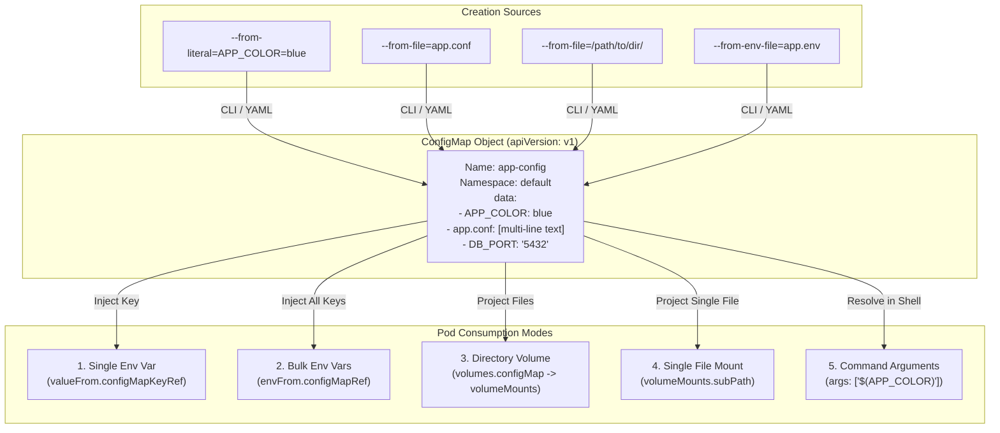
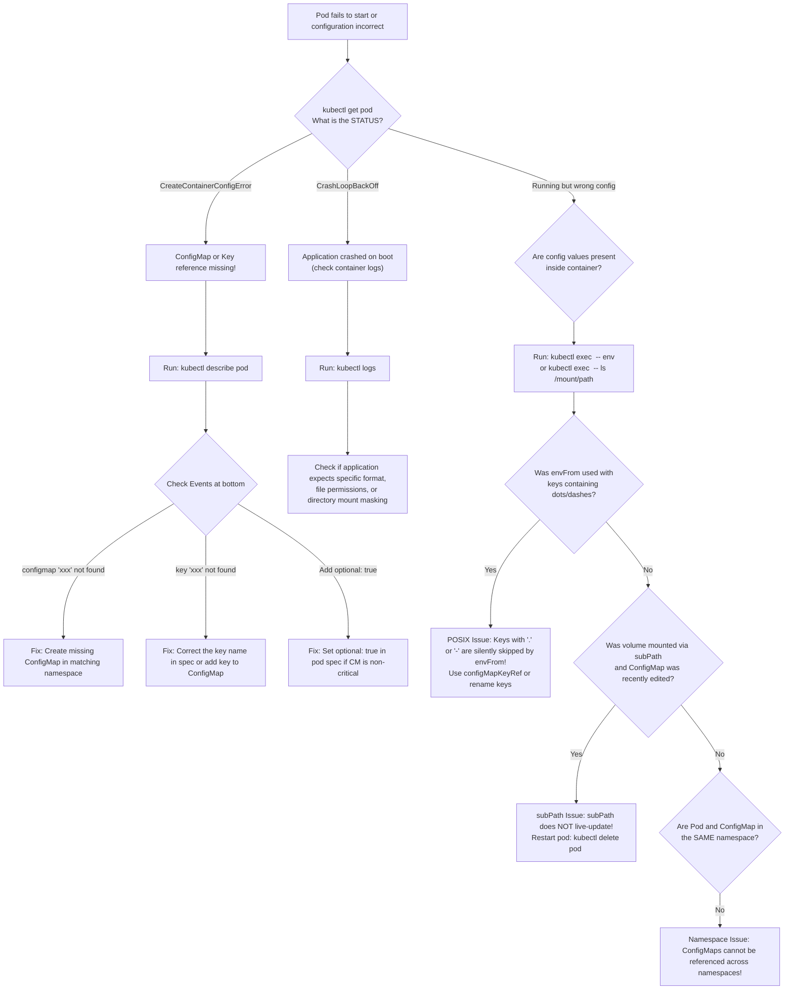

# ConfigMaps in Kubernetes - CKA Exam Notes

> **Exam Domain**: Application Lifecycle Management (15%) / Core Concepts  
> **Weight / Importance**: High (Core configuration primitive testing imperative creation methods, YAML manifests, environment injection, volume projection, atomic updates, and troubleshooting)  
> **Target Version**: Verified against v1.31 / v1.32 (Current CKA Curriculum)  
> **Allowed Docs Search Keywords**: `Configure a Pod to Use a ConfigMap`, `kubectl create configmap`, `configMapKeyRef`, `configMapRef`, `ConfigMap`  
> **Source**: Generated from `application-lifecycle-management/configuring-application/05-config-maps-raw.md`

---

## 1. Quick-Reference Summary

- **Core Purpose**:
  - Decouples non-confidential configuration artifacts (environment variables, config files, command-line arguments, port numbers) from container ../../Images to keep workloads portable across dev, test, and production environments.
- **API Coordinates**:
  - `apiVersion: v1`, `kind: ConfigMap`. Belongs to the core API group (`""`).
- **Namespaced Scope**:
  - ConfigMaps are **namespaced resources**. A Pod can **only** reference a ConfigMap within its own namespace. Cross-namespace referencing is not supported.
- **Creation CLI Variations**:
  - `--from-literal=<key>=<value>`: Directly stores a single key-value pair.
  - `--from-file=<path-to-file>`: Stores the entire file content under the **filename** as the key.
  - `--from-file=<custom-key>=<path-to-file>`: Stores the file content under a specified key.
  - `--from-file=<directory>/`: Creates a key for every file inside the directory (key = filename, value = content).
  - `--from-env-file=<path-to-file>`: Parses lines matching `KEY=VALUE` into separate individual ConfigMap keys (ignores comments `#` and empty lines).
- **Consumption Patterns**:
  - **Individual Env Var**: `spec.containers[].env[].valueFrom.configMapKeyRef`.
  - **Bulk Env Vars**: `spec.containers[].envFrom[].configMapRef` (with optional `prefix`).
  - **Volume Directory Mount**: `spec.volumes[].configMap` mounted via `spec.containers[].volumeMounts[]`.
  - **Single File Mount (`subPath`)**: Mounts an individual key as a single file into a directory without overwriting neighboring files.
- **Dynamic Updates vs. Static Injections**:
  - **Environment Variables**: Static. Initialized at container start via `/proc/1/environ`. Updates to ConfigMaps **never** reflect inside running containers without a Pod restart (`kubectl rollout restart deployment <name>`).
  - **Volume Mounts**: Dynamic (eventually consistent). Kubelet periodically reconciles the projected directory via atomic symlink updates.
  - **`subPath` Mounts**: Static. Volumes mounted with `subPath` do **not** receive automatic live updates.
- **Size Constraint**:
  - Limited to **1 MiB** (`1,048,576` bytes) due to etcd maximum request limits.
- **Immutability (`immutable: true`)**:
  - Prevents subsequent modifications to `.data` and `.binaryData`. Reduces kube-apiserver load by disabling Kubelet watches.

---

## 2. Conceptual Overview & Mental Model

### Dual-Layer Architectural Understanding

- **Simple English Explanation (How It Works)**:
  - In modern software operations (specifically the 12-Factor App pattern), you build an application image once and run it everywhere.
  - You do not want database URLs, listening ports, feature flags, or logging levels baked into the container image.
  - A **ConfigMap** is a dedicated API object that holds configuration data as plain key-value pairs or complete configuration file texts.
  - You create the ConfigMap first, and then attach it to the Pod.
  - Inside the Pod, Kubernetes can either inject those key-value pairs as **environment variables** into the application's process table, or project them as **actual files on disk** into the container's filesystem.


- **Formal Kubernetes Definition**:
  - A `ConfigMap` is an API object used to store non-confidential data in key-value pairs. Pods can consume ConfigMaps as environment variables, command-line arguments, or configuration files in a Volume. A ConfigMap allows you to decouple environment-specific configuration from your container ../../Images, so that your applications are easily portable.



---

## 3. Deep-Dive Technical Breakdown

### 3.1 ConfigMap Resource Schema & Anatomy

A ConfigMap manifest contains two main data payload dictionaries:
1. `data`: For UTF-8 plain text strings and configuration files.
2. `binaryData`: For base64-encoded binary content (e.g. gzipped configs, protocol buffers).

```yaml
apiVersion: v1
kind: ConfigMap
metadata:
  name: app-config
  namespace: default
  labels:
    app.kubernetes.io/name: webapp
immutable: false # If set to true, protects against accidental mutations and disables watch overhead
data:
  # Simple scalar values (MUST be strings)
  APP_COLOR: "blue"
  APP_MODE: "prod"
  PORT: "8080"
  
  # Multi-line configuration file content
  app_config.properties: |
    server.host=0.0.0.0
    server.port=8080
    cache.enabled=true
    database.connection.timeout=30s
binaryData:
  # Base64 encoded binary blob (optional)
  icon.png.gz: "H4sICDxw+VoCA2ljb24ucG5nAN2W70..."
```


---

### 3.2 Imperative Creation Mechanics & The `--from-file` Distinction

A primary source of confusion in CKA exam scenarios is how `kubectl create configmap` maps input arguments to internal `.data` keys:


| CLI Flag Option | Syntax Example | Resulting ConfigMap `.data` Structure | Primary Use Case |
| :--- | :--- | :--- | :--- |
| **`--from-literal`** | `--from-literal=APP_COLOR=blue` | `data: { APP_COLOR: "blue" }` | Setting discrete parameters, ports, flags. |
| **`--from-file` (bare file)** | `--from-file=app_config.properties` | `data: { app_config.properties: "<file contents>" }` | **Key is the filename!** Value is the entire raw file text. Ideal for volume mounting. |
| **`--from-file` (explicit key)** | `--from-file=custom-key.json=config.json` | `data: { custom-key.json: "<file contents>" }` | Assigning a custom key name to a configuration file. |
| **`--from-file` (directory)** | `--from-file=/etc/nginx/conf.d/` | `data: { default.conf: "...", ssl.conf: "..." }` | Populates every regular file in directory as a separate key named after the file. |
| **`--from-env-file`** | `--from-env-file=app.env` | `data: { KEY1: "val1", KEY2: "val2" }` | **Parses lines of key-value pairs!** Does **not** store the filename; extracts individual keys. |

> [!IMPORTANT]
> **Verification of the Raw Note Claim**:
> The raw note asked to confirm whether `--from-file` stores the config under the filename.
> **CONFIRMED**: When using `kubectl create configmap <name> --from-file=<path>`, Kubernetes creates an entry where the **key is the base filename** (e.g. `app_config.properties`), and the **value is the entire multi-line content** of that file.
> If your goal is to import multiple key-value pairs from a file into individual environment variables, you **must use `--from-env-file`**, not `--from-file`.

---

### 3.3 Consuming ConfigMaps in Pods

There are three primary ways to expose ConfigMap data to containers:


#### Pattern A: Bulk Environment Injection (`envFrom`)
Loads all key-value pairs from the ConfigMap into the container's environment in a single declaration.

```yaml
apiVersion: v1
kind: Pod
metadata:
  name: webapp-bulk-env
spec:
  containers:
    - name: webapp
      image: simple-webapp-color
      envFrom:
        - configMapRef:
            name: app-config
            optional: false # Default is false. If true, missing CM won't block pod startup.
          prefix: "CONF_"  # Optional: imported keys become CONF_APP_COLOR, CONF_APP_MODE
```

> [!WARNING]
> **POSIX Key Filtering Trap**:
> When using `envFrom`, any keys in the ConfigMap that do not follow POSIX environment variable naming rules (`[a-zA-Z_][a-zA-Z0-9_]*`) are **silently skipped**! For example, a key named `app_config.properties` contains a period (`.`) and will **not** be exported to the container's environment.

---

#### Pattern B: Single Key Environment Injection (`valueFrom.configMapKeyRef`)
Selectively extracts a single key from a ConfigMap and binds it to a specific environment variable name.

```yaml
apiVersion: v1
kind: Pod
metadata:
  name: webapp-single-env
spec:
  containers:
    - name: webapp
      image: simple-webapp-color
      env:
        - name: APP_COLOR
          valueFrom:
            configMapKeyRef:
              name: app-config
              key: APP_COLOR
              optional: false
```

---

#### Pattern C: Volume Projection (Filesystem Directory & `subPath`)
Mounts the ConfigMap as a volume. By default, every key in `data` becomes a distinct file inside the mount directory.

```yaml
apiVersion: v1
kind: Pod
metadata:
  name: webapp-volume
spec:
  containers:
    - name: webapp
      image: nginx
      volumeMounts:
        # 1. Directory Mount: creates /etc/config/app_config.properties and /etc/config/APP_COLOR
        - name: full-config-vol
          mountPath: /etc/config
          readOnly: true
        
        # 2. Single File Mount (subPath): mounts ONLY one file into /etc/nginx without overwriting other files
        - name: full-config-vol
          mountPath: /etc/nginx/conf.d/app.conf
          subPath: app_config.properties
  volumes:
    - name: full-config-vol
      configMap:
        name: app-config
        defaultMode: 0644 # Sets file permissions (decimal 420 = octal 0644)
        items: # Optional: selectively project only specific keys with custom file names
          - key: app_config.properties
            path: app_config.properties
            mode: 0600
```

---

### 3.4 Volume Mount vs. Environment Variable Lifecycle

| Characteristic | Environment Variables (`env` / `envFrom`) | Directory Volume (`configMap`) | File Mount via `subPath` |
| :--- | :--- | :--- | :--- |
| **Delivery Mechanism** | Linux process environment table (`/proc/1/environ`) | Linux tmpfs directory mounted into container rootfs | Single file bind-mounted over target file path |
| **Live Updates on CM Modification** | **No**. Remains static for container lifecycle. | **Yes**. Automatically updated by Kubelet sync loop. | **No**. Bind-mounted files do not receive live symlink swaps. |
| **Update Latency** | N/A (requires Pod recreation) | Eventual (typically 10-60s, based on Kubelet sync period and cache TTL) | N/A (requires Pod recreation) |
| **Existing Directory Overwrite** | None (pure memory environment) | **Overwrites target directory** (masks pre-existing image files) | **Preserves target directory** (overlays only the single specified file) |
| **Permitted Characters** | POSIX valid characters only (letters, digits, `_`) | Any valid Linux filename (including `.`, `-`, spaces) | Any valid Linux filename |

---

### 3.5 How Kubelet Reconciles Volume-Mounted ConfigMaps (Atomic Symlink Swapping)

When Kubelet mounts a ConfigMap volume to `/etc/config`, it does not write raw files directly to the directory. It builds an atomic symlink tree backed by an in-memory `tmpfs`:

```
/etc/config/
├── ..data -> ..2026_10_04_14_28_01.123456789
├── ..2026_10_04_14_28_01.123456789/
│   ├── app_config.properties
│   └── APP_COLOR
└── app_config.properties -> ..data/app_config.properties
```

- When the ConfigMap is modified in the API server:
  1. Kubelet's ConfigMap manager detects the update via watch or periodic polling.
  2. Kubelet creates a new timestamped directory (e.g. `..2026_10_04_14_35_10.987654321`) containing the new files.
  3. Kubelet creates a new temporary symlink pointing to the new directory.
  4. Kubelet atomically renames the temporary symlink to `..data` using the Linux `rename()` system call.
  5. The application's file descriptors resolve the updated content instantly without file tearing or partial write corruption.
- **Why `subPath` breaks live updates**:
  `subPath` mounts perform a direct Linux bind mount of the individual file. Because it binds to the target inode directly rather than following the `..data` symlink indirection, future symlink swaps are completely invisible to the container.

---

### 3.6 Immutable ConfigMaps

Introduced in Kubernetes v1.19 and GA in v1.21:
```yaml
apiVersion: v1
kind: ConfigMap
metadata:
  name: static-app-config
immutable: true
data:
  DATABASE_URL: "postgres://db.internal:5432/prod"
```

- **Operational Benefit**:
  - Once marked `immutable: true`, neither `.data` nor `.binaryData` can be modified.
  - The API server rejects any `UPDATE` or `PATCH` request with a `422 Unprocessable Entity` error.
  - To change values, you must delete and recreate the ConfigMap or deploy a new ConfigMap with a versioned suffix (`app-config-v2`).
- **Performance Impact**:
  - For large clusters with thousands of Pods mounting the same ConfigMap, Kubelet closes its active watches against the API server. This drastically reduces `kube-apiserver` CPU utilization, network bandwidth, and memory consumption.

---

## 4. Command Translation & Mapping Tables

### Creation Flag Comparison

| Goal | CLI Command Syntax | Generated ConfigMap Key | Generated ConfigMap Value |
| :--- | :--- | :--- | :--- |
| Single key-value | `kubectl create cm my-cm --from-literal=COLOR=red` | `COLOR` | `red` |
| Multiple literals | `kubectl create cm my-cm --from-literal=K1=V1 --from-literal=K2=V2` | `K1`, `K2` | `V1`, `V2` |
| Whole file as key | `kubectl create cm my-cm --from-file=server.conf` | `server.conf` | Exact contents of `server.conf` |
| File with custom key | `kubectl create cm my-cm --from-file=custom_name=server.conf` | `custom_name` | Exact contents of `server.conf` |
| Directory of files | `kubectl create cm my-cm --from-file=/etc/nginx/conf.d/` | `site1.conf`, `site2.conf` | Contents of each file respectively |
| Parse KEY=VALUE file | `kubectl create cm my-cm --from-env-file=params.env` | Individual parsed keys | Individual parsed values |

---

### Consumption Spec Syntax Comparison

| Mode | Pod Manifest Spec Snippet |
| :--- | :--- |
| **All Keys as Env** | `spec.containers[0].envFrom: [{ configMapRef: { name: app-config } }]` |
| **All Keys with Prefix** | `spec.containers[0].envFrom: [{ configMapRef: { name: app-config }, prefix: "APP_" }]` |
| **Single Key as Env** | `spec.containers[0].env: [{ name: COLOR, valueFrom: { configMapKeyRef: { name: app-config, key: APP_COLOR } } }]` |
| **Full Volume Mount** | `spec.volumes: [{ name: v1, configMap: { name: app-config } }]`<br/>`spec.containers[0].volumeMounts: [{ name: v1, mountPath: /etc/cfg }]` |
| **Single Key SubPath** | `spec.volumes: [{ name: v1, configMap: { name: app-config } }]`<br/>`spec.containers[0].volumeMounts: [{ name: v1, mountPath: /etc/app.conf, subPath: server.conf }]` |

---

## 5. High-Yield CLI & Imperative Commands

### 5.1 Imperative Creation & Manifest Generation

```bash
# 1. Create ConfigMap from literals
kubectl create configmap app-config \
  --from-literal=APP_COLOR=blue \
  --from-literal=APP_MODE=prod

# 2. Create ConfigMap from a single file (key will be the filename)
kubectl create configmap config-file-map \
  --from-file=app_config.properties

# 3. Create ConfigMap from a single file with custom key name
kubectl create configmap custom-key-map \
  --from-file=app.properties=app_config.properties

# 4. Create ConfigMap parsing KEY=VALUE pairs from an environment file
kubectl create configmap env-file-map \
  --from-env-file=app.env

# 5. Generate declarative YAML without applying (Essential CKA time-saver!)
kubectl create configmap app-config \
  --from-literal=APP_COLOR=blue \
  --dry-run=client -o yaml > app-config.yaml
```

---

### 5.2 Inspection & Value Extraction

```bash
# List all ConfigMaps in current namespace
kubectl get configmaps

# Describe ConfigMap to inspect keys and truncated values
kubectl describe configmap app-config

# View full manifest with exact data payload
kubectl get configmap app-config -o yaml

# Extract a specific key value using jsonpath
kubectl get configmap app-config -o jsonpath='{.data.APP_COLOR}'

# Extract multi-line file content from ConfigMap
kubectl get configmap config-file-map -o jsonpath='{.data.app_config\.properties}'
```

---

### 5.3 Modifying & Reloading ConfigMaps

```bash
# Edit ConfigMap directly in default editor
kubectl edit configmap app-config

# Update ConfigMap imperatively using dry-run replace pattern
kubectl create configmap app-config \
  --from-literal=APP_COLOR=green \
  --dry-run=client -o yaml | kubectl apply -f -

# Force Pods in a Deployment to reload environment variables after ConfigMap update
kubectl rollout restart deployment webapp-deployment
```

---

## 6. Troubleshooting & Diagnostic Runbook

### Diagnostic Decision Tree



---

### Step-by-Step Triage Runbook

#### Symptom 1: Pod Stuck in `CreateContainerConfigError`
1. **Identify the root cause**:
   ```bash
   kubectl describe pod <pod-name>
   ```
2. **Inspect the Events section**:
   ```text
   Warning  Failed   12s (x3 over 35s)  kubelet  Error: configmap "app-config" not found
   ```
   Or:
   ```text
   Warning  Failed   8s (x2 over 20s)   kubelet  Error: couldn't find key APP_COLOR in ConfigMap default/app-config
   ```
3. **Verify ConfigMap existence and namespace**:
   ```bash
   kubectl get configmaps -n <pod-namespace>
   ```
4. **Resolution**:
   - Create the missing ConfigMap or populate the missing key in the target namespace.
   - If the configuration is optional, add `optional: true` under `configMapKeyRef` or `configMapRef`.

---

#### Symptom 2: Keys Missing After Using `envFrom`
1. **Inspect container environment**:
   ```bash
   kubectl exec <pod-name> -- env
   ```
2. **Diagnosis**:
   - If your ConfigMap was created with `--from-file=app.properties`, the key name is `app.properties`.
   - The dot (`.`) violates POSIX variable naming standards (`[A-Za-z_][A-Za-z0-9_]*`).
   - Kubelet ignores keys with illegal characters when injecting via `envFrom`.
3. **Resolution**:
   - Re-create the ConfigMap using `--from-env-file` so variables are individually parsed without file extensions.
   - Or explicitly bind the key using `valueFrom.configMapKeyRef` where the container env variable name can be arbitrary (e.g. `APP_PROPERTIES`).

---

#### Symptom 3: Volume Directory Mount Erases Pre-Existing Files
1. **Diagnosis**:
   - Mounting a volume directly to an existing directory (e.g. `mountPath: /etc/nginx`) replaces the entire directory with the ConfigMap contents, hiding standard files like `nginx.conf`.
2. **Resolution**:
   - Mount to a subdirectory (e.g. `mountPath: /etc/nginx/conf.d`).
   - Or mount individual files using `subPath` (e.g. `mountPath: /etc/nginx/nginx.conf`, `subPath: nginx.conf`).

---

## 7. CKA Exam Tips, Gotchas & Traps

> [!WARNING]
> **Trap 1: `--from-file` vs. `--from-env-file` Confusion**
> - If an exam question says: *"Create a ConfigMap from file `/tmp/config.txt` where each line is KEY=VALUE and inject them into a Pod as environment variables"*:
>   - If you use `--from-file=/tmp/config.txt`, the key in `.data` is literally `config.txt`! Injecting with `envFrom` will **fail to export the variables** because `config.txt` contains a dot.
>   - You **must use `--from-env-file=/tmp/config.txt`**!

> [!IMPORTANT]
> **Trap 2: Values in ConfigMap `data` MUST Be Strings**
> - In YAML manifests, values like ports (`8080`) or boolean flags (`true`) must be quoted:
>   ```yaml
>   data:
>     PORT: "8080" # CORRECT
>     PORT: 8080   # WRONG: API server validation error (got int, expected string)
>     DEBUG: "true"
>   ```
> - When using `kubectl create configmap --from-literal=PORT=8080`, `kubectl` automatically stores it as a string.

> [!IMPORTANT]
> **Trap 3: Cross-Namespace Referencing Is Prohibited**
> - A Pod in namespace `prod` cannot consume a ConfigMap residing in namespace `default`.
> - If an exam question instructs deploying a Pod in namespace `app-ns` consuming ConfigMap `app-config`, ensure you create `app-config` in `app-ns` (`-n app-ns`).

> [!TIP]
> **Exam Speed Tip: Fast Pod YAML with Inlined ConfigMap Reference**
> Generate a skeleton Pod manifest and inject the ConfigMap without manually typing all fields:
> ```bash
> # 1. Create the ConfigMap
> kubectl create cm web-cm --from-literal=THEME=dark
>
> # 2. Generate Pod skeleton
> kubectl run web-pod --image=nginx --dry-run=client -o yaml > pod.yaml
>
> # 3. Quick-inject envFrom block using standard YAML structure
> ```

> [!WARNING]
> **Trap 4: `subPath` Mounts Do NOT Receive Automatic Live Updates**
> - If a question tests dynamic configuration updates via volumes:
>   - Regular directory volume mounts (`mountPath: /etc/config`) **do** receive updates automatically.
>   - Mounts configured with `subPath` **never** receive live updates. The container must be restarted.

---

## 8. Self-Test / Active Recall

1. **What is the key name created in `.data` when running `kubectl create cm my-cfg --from-file=/etc/redis/redis.conf`?**
   <details><summary>Click to view answer</summary>
   The key name is the base filename: <code>redis.conf</code>. The value is the complete text content of that file.
   </details>

2. **How does `--from-env-file` differ from `--from-file`?**
   <details><summary>Click to view answer</summary>
   <code>--from-env-file</code> parses each line formatted as <code>KEY=VALUE</code> in the target file into individual key-value pairs in the ConfigMap's <code>.data</code> dictionary, ignoring comments and blank lines. <code>--from-file</code> stores the entire file content under a single key named after the file.
   </details>

3. **What happens if a Pod attempts to reference a non-existent ConfigMap without `optional: true`?**
   <details><summary>Click to view answer</summary>
   The Pod fails to start and enters the <code>CreateContainerConfigError</code> state. Kubelet records a <code>Failed</code> event stating <code>Error: configmap "&lt;name&gt;" not found</code>.
   </details>

4. **Why are keys containing dots (e.g. `app.config`) ignored when injected using `envFrom.configMapRef`?**
   <details><summary>Click to view answer</summary>
   Standard POSIX environment variable naming rules only permit letters, numbers, and underscores (<code>[a-zA-Z_][a-zA-Z0-9_]*</code>). Keys containing dots or dashes are invalid POSIX variable names and are silently skipped by Kubelet during bulk injection.
   </details>

5. **If you update a ConfigMap consumed via environment variables in a running Deployment, when do the containers receive the updated values?**
   <details><summary>Click to view answer</summary>
   Environment variables are immutable for the container's lifecycle (set at process startup in <code>/proc/1/environ</code>). The containers will <b>never</b> see the new values until the Pods are restarted or recreated (e.g., via <code>kubectl rollout restart deployment &lt;name&gt;</code>).
   </details>

6. **Do volume-mounted ConfigMaps update automatically when using `subPath`?**
   <details><summary>Click to view answer</summary>
   <b>No.</b> Files mounted using <code>subPath</code> are bound directly to the file inode and do not participate in Kubelet's atomic symlink swapping (<code>..data</code> swap). They require a Pod restart to update.
   </details>

7. **What is the maximum data payload size permitted for a single ConfigMap?**
   <details><summary>Click to view answer</summary>
   <b>1 MiB</b> (<code>1,048,576</code> bytes), constrained by the default request size limit of etcd.
   </details>

8. **Can a Pod in namespace `backend` mount a ConfigMap located in namespace `shared`?**
   <details><summary>Click to view answer</summary>
   <b>No.</b> ConfigMaps are namespace-scoped. Pods can only reference ConfigMaps within their own namespace.
   </details>

9. **What field can be added to a ConfigMap to prevent any future modifications and reduce API server watch load?**
   <details><summary>Click to view answer</summary>
   <code>immutable: true</code> under the ConfigMap root manifest.
   </details>

10. **How can you change file permissions of a volume-mounted ConfigMap to read-only for owner and group (`0640`)?**
    <details><summary>Click to view answer</summary>
    Specify <code>defaultMode: 0640</code> (or decimal <code>416</code>) under the <code>spec.volumes[].configMap</code> definition.
    </details>

---

## 9. Official Documentation Bookmarks

| Page Title | Search Queries | Target Section / Direct URI Anchor |
| :--- | :--- | :--- |
| **Configure a Pod to Use a ConfigMap** | `Configure a Pod to Use a ConfigMap` | [Define container env variables using ConfigMap data](https://kubernetes.io/docs/tasks/configure-pod-container/configure-pod-configmap/#define-container-environment-variables-using-configmap-data) |
| **ConfigMaps Concept** | `ConfigMaps` | [ConfigMap Object](https://kubernetes.io/docs/concepts/configuration/configmap/) |
| **Mounted ConfigMaps are updated automatically** | `Mounted ConfigMaps are updated automatically` | [Mounted ConfigMaps are updated automatically](https://kubernetes.io/docs/tasks/configure-pod-container/configure-pod-configmap/#mounted-configmaps-are-updated-automatically) |
| **kubectl create configmap** | `kubectl create configmap` | [kubectl create configmap CLI Reference](https://kubernetes.io/docs/reference/generated/kubectl/kubectl-commands#create-configmap) |
