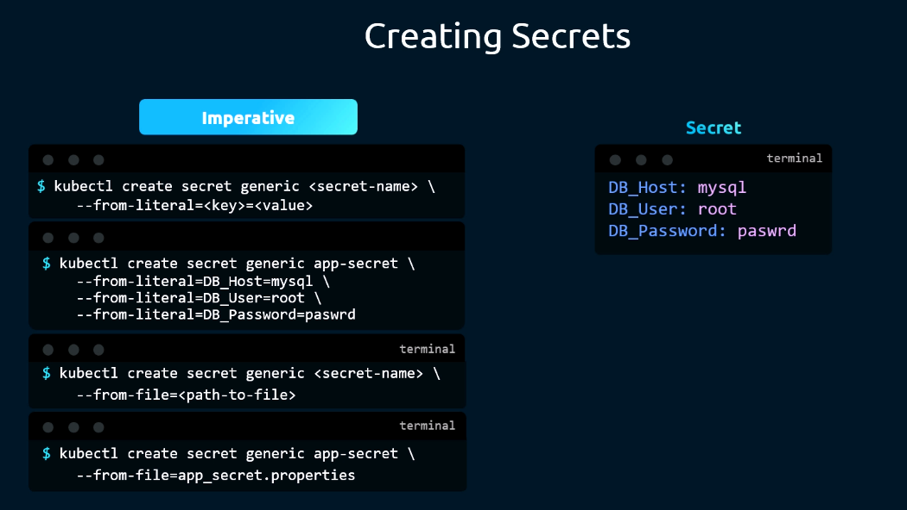
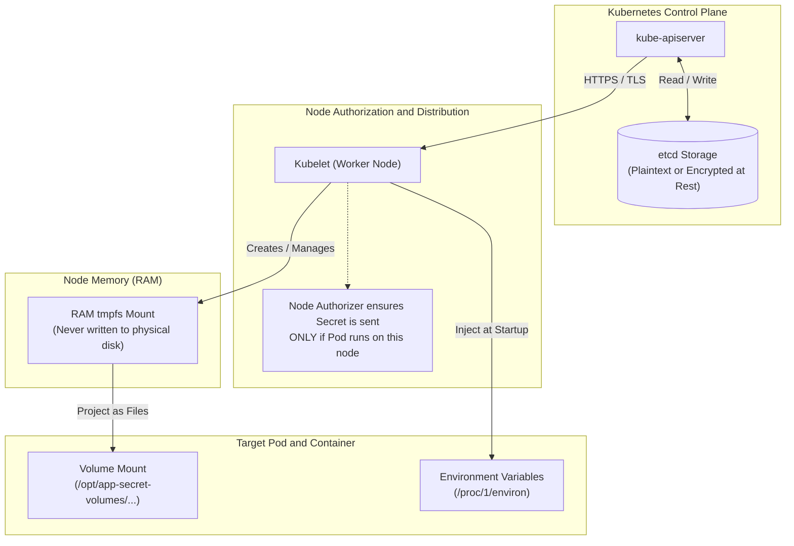
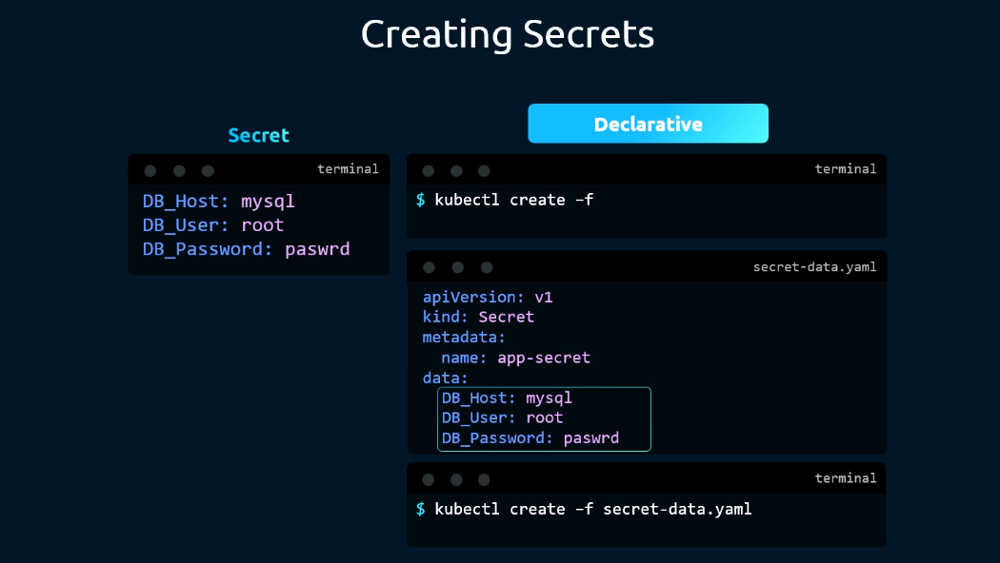
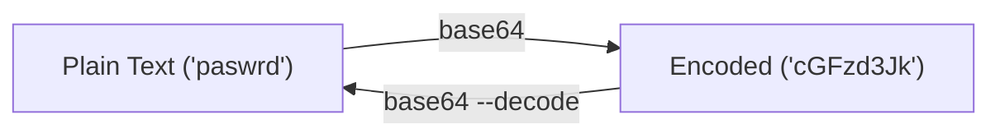
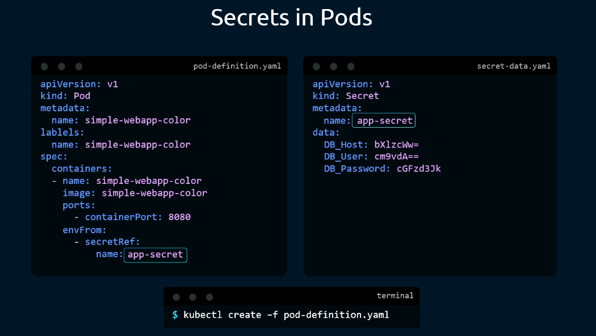
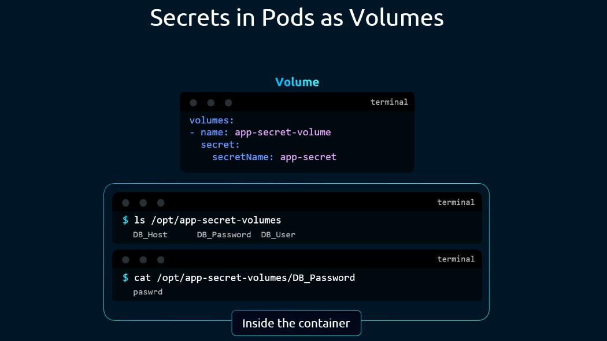
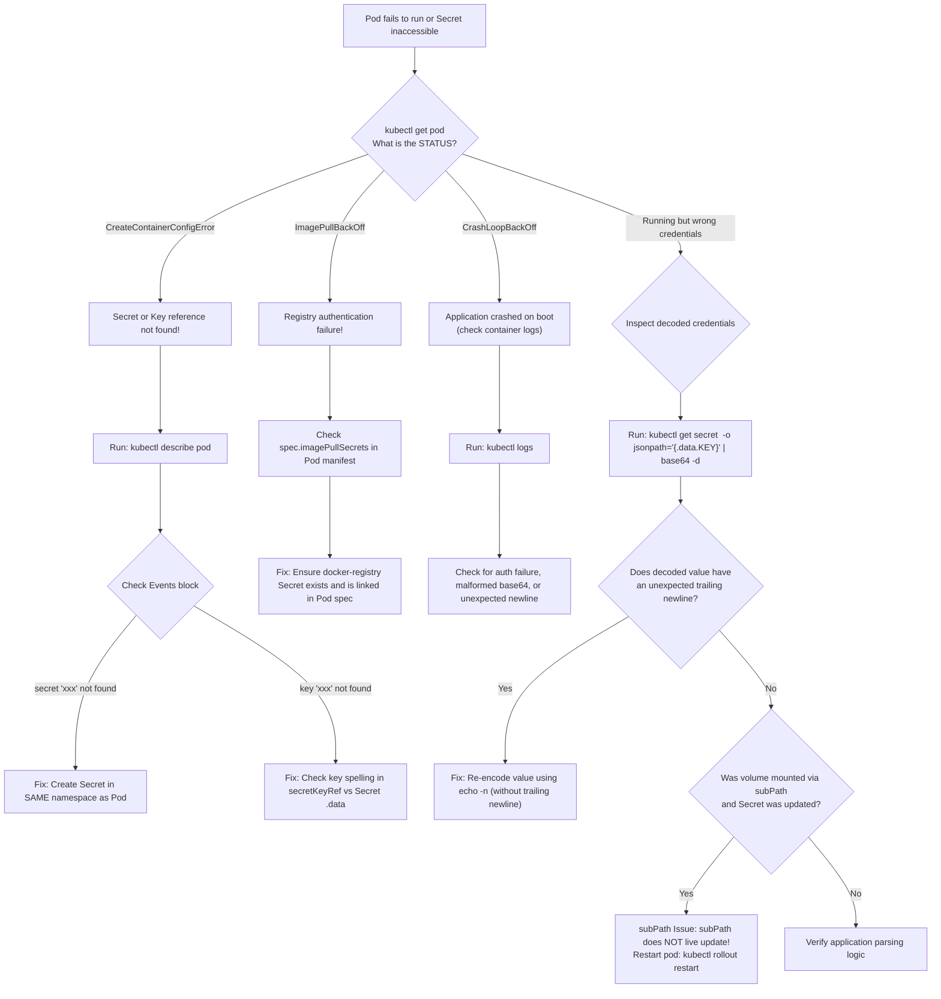

# Secrets in Kubernetes - CKA Exam Notes

> **Exam Domain**: Application Lifecycle Management (15%) / Core Concepts / Security  
> **Weight / Importance**: High (Core Kubernetes configuration and security object testing imperative creation, declarative YAML manifests, base64 encoding vs. encryption, container environment injection, tmpfs volume projection, and image pull credentials)  
> **Target Version**: Verified against v1.31 / v1.32 (Current CKA Curriculum)  
> **Allowed Docs Search Keywords**: `Secrets`, `Managing Secrets using kubectl`, `secretKeyRef`, `secretRef`, `imagePullSecrets`, `Encrypting Confidential Data at Rest`  
> **Source**: Generated from `application-lifecycle-management/configuring-application/06-secrets-raw.md` and `07-note-on-secrets.md`

---

## 1. Quick-Reference Summary

- **Core Purpose**:
  - Stores and manages sensitive configuration data—such as passwords, OAuth tokens, SSH keys, and TLS certificates—decoupled from Pod specifications and container images.
- **API Coordinates**:
  - `apiVersion: v1`, `kind: Secret`. Core API group (`""`).
- **Namespace-Scoped**:
  - Secrets are bound to a specific namespace. A Pod can **only** reference a Secret residing in its own namespace.
- **Base64 Encoding vs. Encryption**:
  - In standard Kubernetes, values in `.data` are **base64-encoded, NOT encrypted**. Base64 is an encoding format designed for safe byte transport across YAML/JSON, not a cryptographic security barrier. Anyone with `kubectl get secret -o yaml` or API access can instantly decode them.
  - True security requires **Encryption at Rest** (`EncryptionConfiguration` in `kube-apiserver`) and external Key Management Services (KMS / Vault).
- **`data` vs. `stringData`**:
  - `data`: Expects **base64-encoded** strings (`echo -n "pass" | base64`).
  - `stringData`: Accepts **plain-text unencoded** strings. It is write-only: `kube-apiserver` base64-encodes the plain text, populates `.data`, and strips `.stringData` before writing to etcd.
- **Volume Key Syntax Difference (Critical YAML Trap)**:
  - In Pod manifests, volume mounting a Secret uses **`secretName`** (`spec.volumes[].secret.secretName`), whereas ConfigMaps use **`name`** (`spec.volumes[].configMap.name`).
- **Node-Level Security Mechanics (Kubelet tmpfs)**:
  - Kubelet never writes Secrets to physical node disk storage.
  - Secrets are projected into a RAM-backed **`tmpfs`** filesystem.
  - Kubelet's Node Authorizer restricts Secret delivery strictly to nodes running Pods that explicitly require them.
  - When the dependent Pod is deleted, Kubelet unmounts and removes the local `tmpfs` copy.
- **Size Limitation**:
  - Maximum size is **1 MiB** (`1,048,576` bytes) per Secret object, dictated by etcd's default request size limit.
- **Common Built-In Types**:
  - `Opaque`: Arbitrary user-defined key-value secret (default).
  - `kubernetes.io/tls`: Stores `tls.crt` and `tls.key` for Ingress or HTTPS endpoints.
  - `kubernetes.io/dockerconfigjson`: Stores container registry authentication tokens (`imagePullSecrets`).
  - `kubernetes.io/service-account-token`: Stores automated ServiceAccount tokens.

---

## 2. Conceptual Overview & Mental Model

### Dual-Layer Architectural Understanding

- **Simple English Explanation (How It Works)**:
  - Applications need sensitive credentials (database passwords, API access tokens, TLS certificates) to communicate with external and internal systems.
  - Storing credentials in container images or hardcoding them into Git repositories introduces severe operational and security liabilities.
  - A Kubernetes **Secret** object stores these credentials in the cluster's control plane data store (etcd).
  - When a Pod needs credentials, Kubernetes passes the Secret to the worker node hosting that Pod.
  - Kubelet mounts the secret directly into memory (**`tmpfs`**) without writing bytes to physical disk, and presents them to the container either as **environment variables** or as **in-memory plain-text files**.



- **Formal Kubernetes Definition**:
  - A `Secret` is an object that contains a small amount of sensitive data such as a password, a token, or a key. Using a Secret means that you do not need to include confidential data in your application code. Because Secrets can be created independently of the Pods that use them, there is less risk of the Secret (and its data) being exposed during the workflow of creating, viewing, and editing Pods.



---

## 3. Deep-Dive Technical Breakdown

### 3.1 Declarative Secret Anatomy: `data` vs. `stringData`

A Secret manifest provides two ways to declare payload values:



#### 1. The `data` Field (Base64 Encoded)
Every entry under `data` must be a valid base64-encoded string.

```yaml
apiVersion: v1
kind: Secret
metadata:
  name: app-secret
  namespace: default
type: Opaque
data:
  DB_Host: bXlzcWw=       # echo -n 'mysql' | base64
  DB_User: cm9vdA==       # echo -n 'root' | base64
  DB_Password: cGFzd3Jk   # echo -n 'paswrd' | base64
```

#### 2. The `stringData` Field (Plain-Text Write-Only)
`stringData` allows writing plain text directly into the manifest without running `base64` manually.

```yaml
apiVersion: v1
kind: Secret
metadata:
  name: app-secret-plain
  namespace: default
type: Opaque
stringData:
  DB_Host: mysql
  DB_User: root
  DB_Password: paswrd
```

> [!IMPORTANT]
> **Mechanics of `stringData`**:
> - `stringData` is **write-only**. When you apply the YAML via `kubectl apply -f`, the API server automatically encodes each value into base64, moves them under `.data`, and discards `.stringData`.
> - If you retrieve the object later via `kubectl get secret app-secret-plain -o yaml`, you will see your values under `data:` in base64 format; `stringData:` will no longer exist.
> - If a key is defined in both `data` and `stringData`, the value from `stringData` takes precedence.

---

### 3.2 The Base64 Reality & Security Best Practices

A fundamental concept tested in the CKA curriculum is the distinction between encoding and encryption:



- **Base64 is NOT Encryption**:
  - Anyone with read access to the Secret (`kubectl get secret <name> -o yaml`) can pipe the value into `base64 --decode` and retrieve the cleartext immediately.
  - Base64 exists solely so binary data, special characters, and multi-line credentials can travel through JSON/YAML payloads without character escaping issues.

#### How Kubernetes Hardens Secrets (Built-In Security Layers)
1. **Node Scoping (Least Privilege)**:
   - A Secret is only transmitted to a worker node if a Pod scheduled on that node explicitly references it.
2. **Kubelet `tmpfs` Memory Storage**:
   - When mounting Secrets as volumes, Kubelet stores them in a memory-backed file system (`tmpfs`). The secret data is **never persisted to physical node disk storage**.
3. **Automatic Lifecycle Cleanup**:
   - As soon as the Pod requiring the Secret is terminated, Kubelet unmounts the `tmpfs` volume and wipes the secret data from memory.
4. **API Hiding**:
   - `kubectl describe secret` purposefully suppresses key values (displaying only byte counts or `<redacted>`) to prevent credentials from leaking during routine cluster inspections or shoulder surfing.

#### Production Security Recommendations
- **Enable Encryption at Rest**: Configure `--encryption-provider-config` on `kube-apiserver` using providers like `aescbc`, `secretbox`, or an external KMS plugin (e.g. AWS KMS, HashiCorp Vault, Google Cloud KMS).
- **Strict RBAC**: Restrict `get`, `list`, and `watch` permissions on `secrets` resources. Do not grant broad cluster-admin or wildcard permissions.
- **GitOps Hygiene**: Never commit plain Secret manifests containing `data` or `stringData` to Git repositories. Utilize tools such as **Sealed Secrets**, **SOPS**, **Helm Secrets**, or dynamic secret injection via the **HashiCorp Vault CSI Provider**.

---

### 3.3 Consuming Secrets in Pods

Kubernetes supports three primary patterns for passing Secret data to container workloads:



#### Pattern 1: Bulk Environment Injection (`envFrom`)
Loads all keys from the Secret as environment variables within the container.

```yaml
apiVersion: v1
kind: Pod
metadata:
  name: simple-webapp-bulk
  namespace: default
spec:
  containers:
    - name: simple-webapp-color
      image: simple-webapp-color
      ports:
        - containerPort: 8080
      envFrom:
        - secretRef:
            name: app-secret
            optional: false # Default false. If true, missing secret won't block pod start
          prefix: "APP_"   # Optional: keys become APP_DB_Host, APP_DB_User, APP_DB_Password
```

---

#### Pattern 2: Single Key Environment Variable (`valueFrom.secretKeyRef`)
Extracts a specific key from a Secret and maps it to a custom container environment variable.

```yaml
apiVersion: v1
kind: Pod
metadata:
  name: simple-webapp-single
  namespace: default
spec:
  containers:
    - name: simple-webapp-color
      image: simple-webapp-color
      env:
        - name: DATABASE_PASSWORD
          valueFrom:
            secretKeyRef:
              name: app-secret
              key: DB_Password
              optional: false
```

---

#### Pattern 3: Volume Mounts (`spec.volumes[].secret`)
Projects each key in the Secret as an individual file containing the plain-text decoded value inside an in-memory directory.



```yaml
apiVersion: v1
kind: Pod
metadata:
  name: simple-webapp-volume
  namespace: default
spec:
  volumes:
    - name: app-secret-volume
      secret:
        secretName: app-secret # NOTE: Field is secretName, NOT name!
        defaultMode: 0400      # File permissions (octal 0400 = read-only for owner)
        items:                 # Optional: selectively project specific keys
          - key: DB_Password
            path: db-pass.txt  # Renames DB_Password to db-pass.txt inside mount directory
  containers:
    - name: simple-webapp-color
      image: simple-webapp-color
      volumeMounts:
        - name: app-secret-volume
          mountPath: /opt/app-secret-volumes
          readOnly: true
```

Inside the container:
```bash
# Listing the volume directory reveals individual files for each secret key
$ ls /opt/app-secret-volumes
DB_Host  DB_Password  DB_User

# Reading a file outputs the decoded cleartext value
$ cat /opt/app-secret-volumes/DB_Password
paswrd
```

---

### 3.4 Volume Mount vs. Environment Variable Comparison

| Feature | Environment Variables (`env` / `envFrom`) | Projected Volume (`secret`) | File Mount via `subPath` |
| :--- | :--- | :--- | :--- |
| **Delivery Medium** | Process environment (`/proc/1/environ`) | In-memory `tmpfs` directory | In-memory file bind-mounted to target file |
| **Live Updates** | **No**. Remains unchanged until Pod recreation. | **Yes**. Kubelet automatically updates symlinks. | **No**. Bind-mounted files do not receive symlink updates. |
| **Exposure Surface** | Visible via `env`, `/proc/<pid>/environ`, and crash logs. | Restricted to file access permissions (`defaultMode: 0400`). | Restricted to file access permissions. |
| **File Overwriting** | N/A | Masks existing directory contents. | Overlays single file without masking directory. |
| **Key Constraints** | Must follow POSIX naming rules (`[a-zA-Z_][a-zA-Z0-9_]*`). | Any valid Linux filename (`.`, `-`, spaces allowed). | Any valid Linux filename. |

---

### 3.5 Built-In Secret Types Reference

| Secret Type | Type String Identifier | Standard Keys / Usage |
| :--- | :--- | :--- |
| **Generic / Opaque** | `Opaque` | Arbitrary user-defined key-value credentials (passwords, tokens). |
| **TLS Certificate** | `kubernetes.io/tls` | `tls.crt` (public cert), `tls.key` (private key). Used for HTTPS / Ingress. |
| **Docker Registry** | `kubernetes.io/dockerconfigjson` | `.dockerconfigjson` (base64 JSON containing registry credentials). Used for `imagePullSecrets`. |
| **Basic Auth** | `kubernetes.io/basic-auth` | `username`, `password`. |
| **SSH Auth** | `kubernetes.io/ssh-auth` | `ssh-privatekey`. |
| **ServiceAccount Token** | `kubernetes.io/service-account-token` | `ca.crt`, `namespace`, `token`. (Legacy/manual token generation). |

---

## 4. Command Translation & Mapping Tables

### Base64 Encoding & Decoding Commands

| Operation | Shell Command | Notes |
| :--- | :--- | :--- |
| **Encode string** | `echo -n 'paswrd' \| base64` | **Crucial**: `-n` prevents newline `\n` from being encoded! |
| **Decode string** | `echo -n 'cGFzd3Jk' \| base64 --decode` | Decodes base64 string back to plaintext. |
| **Encode file** | `base64 -w 0 /path/to/cert.pem` | `-w 0` disables line wrapping on Linux. |
| **Decode file** | `base64 --decode /path/to/encoded.txt > cert.pem` | Restores original file. |

---

### Imperative Creation CLI vs. YAML Specs

| Goal | CLI Command Syntax | Equivalent YAML Structure |
| :--- | :--- | :--- |
| **Generic Literals** | `kubectl create secret generic app-secret --from-literal=DB_Host=mysql --from-literal=DB_User=root` | `kind: Secret`<br/>`type: Opaque`<br/>`data: { DB_Host: ..., DB_User: ... }` |
| **From File** | `kubectl create secret generic app-secret --from-file=app_secret.properties` | `kind: Secret`<br/>`data: { app_secret.properties: ... }` |
| **From Env File** | `kubectl create secret generic app-secret --from-env-file=credentials.env` | `kind: Secret`<br/>`data: { parsed individual keys... }` |
| **TLS Secret** | `kubectl create secret tls web-cert --cert=tls.crt --key=tls.key` | `kind: Secret`<br/>`type: kubernetes.io/tls`<br/>`data: { tls.crt: ..., tls.key: ... }` |
| **Docker Registry** | `kubectl create secret docker-registry reg-cred --docker-server=reg.io --docker-username=u --docker-password=p` | `kind: Secret`<br/>`type: kubernetes.io/dockerconfigjson`<br/>`data: { .dockerconfigjson: ... }` |

---

## 5. High-Yield CLI & Imperative Commands

### 5.1 Imperative Creation Commands

```bash
# 1. Create a generic secret with multiple literals
kubectl create secret generic app-secret \
  --from-literal=DB_Host=mysql \
  --from-literal=DB_User=root \
  --from-literal=DB_Password=paswrd

# 2. Create a generic secret from a file (key becomes the filename)
kubectl create secret generic file-secret \
  --from-file=app_secret.properties

# 3. Create a generic secret parsing lines from an environment file
kubectl create secret generic env-secret \
  --from-env-file=credentials.env

# 4. Create a TLS Secret for Ingress / HTTPS
kubectl create secret tls web-tls-secret \
  --cert=/path/to/tls.crt \
  --key=/path/to/tls.key

# 5. Create a Docker Registry Secret for private container image pulls
kubectl create secret docker-registry private-reg-cred \
  --docker-server=https://index.docker.io/v1/ \
  --docker-username=myuser \
  --docker-password=mypassword \
  --docker-email=user@example.com

# 6. Generate declarative YAML without applying (Essential CKA pattern!)
kubectl create secret generic app-secret \
  --from-literal=DB_Password=paswrd \
  --dry-run=client -o yaml > app-secret.yaml
```

---

### 5.2 Inspection, Extraction & Decoding Commands

```bash
# List all secrets in current namespace
kubectl get secrets

# Describe secret (hides values to prevent accidental exposure)
kubectl describe secret app-secret

# Output raw YAML containing base64 encoded strings
kubectl get secret app-secret -o yaml

# Extract and decode a single key directly in bash using jsonpath
kubectl get secret app-secret -o jsonpath='{.data.DB_Password}' | base64 --decode

# Extract and decode ALL keys in a Secret simultaneously
kubectl get secret app-secret -o json | jq -r '.data | map_values(@base64d)'
```

---

### 5.3 Updating Secrets & Rollout Restart

```bash
# Edit an existing secret (values inside editor are base64 encoded)
kubectl edit secret app-secret

# Imperatively update a secret using dry-run client replace pipeline
kubectl create secret generic app-secret \
  --from-literal=DB_Password=newpassword \
  --dry-run=client -o yaml | kubectl apply -f -

# Force Pods in a Deployment to pick up updated Secret environment variables
kubectl rollout restart deployment simple-webapp-deployment
```

---

## 6. Troubleshooting & Diagnostic Runbook

### Diagnostic Decision Tree



---

### Step-by-Step Triage Runbook

#### Symptom 1: Pod Stuck in `CreateContainerConfigError`
1. **Inspect Pod events**:
   ```bash
   kubectl describe pod <pod-name>
   ```
   Output:
   ```text
   Warning  Failed   10s (x3 over 30s)  kubelet  Error: secret "app-secret" not found
   ```
2. **Verify namespace matching**:
   ```bash
   kubectl get secrets -n <pod-namespace>
   ```
3. **Resolution**:
   - Create the Secret in the same namespace as the Pod.
   - If the Secret is non-critical, specify `optional: true` in `secretKeyRef` or `secretRef`.

---

#### Symptom 2: Password Authentication Fails Due to Trailing Newline
1. **Diagnosis**:
   - Creating base64 strings with `echo 'password' | base64` includes a newline character (`0x0A`).
   - The application receives `password\n` instead of `password`, causing database connection rejections.
2. **Verification**:
   ```bash
   kubectl get secret app-secret -o jsonpath='{.data.DB_Password}' | base64 -d | xxd
   ```
   If output ends with `0a`, a trailing newline is present!
3. **Resolution**:
   - Always encode using `echo -n`:
     ```bash
     echo -n 'password' | base64
     ```
   - Reapply the corrected Secret.

---

#### Symptom 3: `ImagePullBackOff` for Private Registry Images
1. **Diagnosis**:
   - Kubelet fails to authenticate to private registries (e.g. Docker Hub private repos, Quay, Harbor, ACR, ECR, GCR).
2. **Resolution**:
   - Create a `docker-registry` Secret:
     ```bash
     kubectl create secret docker-registry regcred \
       --docker-server=<registry-url> \
       --docker-username=<user> \
       --docker-password=<pass>
     ```
   - Reference the Secret in the Pod specification:
     ```yaml
     spec:
       imagePullSecrets:
         - name: regcred
       containers:
         - name: app
           image: private-registry.io/app:v1
     ```

---

## 7. CKA Exam Tips, Gotchas & Traps

> [!WARNING]
> **Trap 1: The Trailing Newline Trap (`echo` vs. `echo -n`)**
> - When generating base64 values for declarative manifests, **always use `echo -n`**:
>   ```bash
>   # WRONG: Encodes 'mypassword\n' (includes 0x0A newline character)
>   echo 'mypassword' | base64 
>
>   # CORRECT: Encodes exact string 'mypassword'
>   echo -n 'mypassword' | base64
>   ```
> - In passwords and private keys, an accidental newline will cause authentication failures that are painful to debug under exam pressure.

> [!IMPORTANT]
> **Trap 2: `secretName` vs. `name` in Volume Definitions**
> - In Pod volume specifications:
>   - For ConfigMaps: `spec.volumes[].configMap.name: my-config`
>   - For Secrets: `spec.volumes[].secret.secretName: my-secret`
> - Writing `spec.volumes[].secret.name` fails schema validation (`unknown field "name"`).

> [!IMPORTANT]
> **Trap 3: Secrets and Pods MUST Reside in the Same Namespace**
> - Secrets cannot be mounted across namespace boundaries.
> - If an exam question instructs deploying a Pod in namespace `finance` that uses a Secret `db-pass`, you **must create `db-pass` in namespace `finance`** (`-n finance`).

> [!TIP]
> **Exam Speed Tip: Fast Imperative Secret Creation**
> Avoid calculating base64 hashes manually whenever possible. Use `kubectl create secret generic` with `--from-literal`:
> ```bash
> kubectl create secret generic db-secret \
>   --from-literal=password=SuperSecret123 \
>   -n production
> ```
> `kubectl` automatically base64-encodes the literal without trailing newlines!

> [!WARNING]
> **Trap 4: `kubectl describe secret` Does Not Display Values**
> - If a question asks you to verify the exact password stored inside a Secret, running `kubectl describe secret <name>` will only show:
>   ```text
>   Data
>   ====
>   password:  14 bytes
>   ```
> - You **must** extract the value and decode it:
>   ```bash
>   kubectl get secret <name> -o jsonpath='{.data.password}' | base64 -d
>   ```

---

## 8. Self-Test / Active Recall

1. **Why does `echo 'mypassword' | base64` produce an incorrect Secret payload for database passwords?**
   <details><summary>Click to view answer</summary>
   Standard <code>echo</code> appends a trailing newline character (<code>\n</code> or <code>0x0A</code>) to the string before piping to base64. The application receives <code>mypassword\n</code>, which fails password verification. Always use <code>echo -n 'mypassword' | base64</code>.
   </details>

2. **What is the exact field name used under `spec.volumes[].secret` to identify the target Secret?**
   <details><summary>Click to view answer</summary>
   <b><code>secretName</code></b> (e.g. <code>spec.volumes[0].secret.secretName: app-secret</code>). Unlike ConfigMaps (which use <code>name</code>), Secrets require <code>secretName</code>.
   </details>

3. **What is the difference between `data` and `stringData` in a Secret manifest?**
   <details><summary>Click to view answer</summary>
   <code>data</code> expects base64-encoded strings. <code>stringData</code> accepts plain-text unencoded strings. <code>stringData</code> is write-only: upon creation or update, <code>kube-apiserver</code> base64-encodes the plain text, transfers the values to <code>.data</code>, and removes <code>stringData</code> before persisting to etcd.
   </details>

4. **Where does Kubelet store volume-mounted Secrets on worker nodes? Does it write to physical disk?**
   <details><summary>Click to view answer</summary>
   Kubelet mounts Secrets into a RAM-backed <b><code>tmpfs</code></b> filesystem. They are <b>never written to physical disk</b> storage on the node. When the Pod terminates, Kubelet removes the secret files from memory.
   </details>

5. **Are Secrets encrypted by default in Kubernetes?**
   <details><summary>Click to view answer</summary>
   <b>No.</b> By default, Secrets are only base64-encoded and stored as plaintext inside etcd. True encryption requires enabling <b>Encryption at Rest</b> via an <code>EncryptionConfiguration</code> file passed to <code>kube-apiserver</code>.
   </details>

6. **How do you decode a Secret value stored in `.data.token` on the command line?**
   <details><summary>Click to view answer</summary>
   <code>kubectl get secret &lt;secret-name&gt; -o jsonpath='{.data.token}' | base64 --decode</code>
   </details>

7. **How does Kubelet determine whether a worker node has permission to download a Secret?**
   <details><summary>Click to view answer</summary>
   Through the <b>Node Authorizer</b>. The API server only permits a node's Kubelet to access Secrets that are actively referenced by Pods scheduled to run on that specific node.
   </details>

8. **If you update a Secret mounted as a directory volume into a Pod, will the file contents update inside the running container? What if it is mounted via `subPath`?**
   <details><summary>Click to view answer</summary>
   A standard directory volume mount <b>will automatically update</b> via Kubelet's periodic atomic symlink swap (within 10-60s). However, a volume mounted using <b><code>subPath</code> will NOT receive live updates</b> and requires a Pod restart.
   </details>

9. **What built-in Secret type is required when configuring `imagePullSecrets` for private container registries?**
   <details><summary>Click to view answer</summary>
   <b><code>kubernetes.io/dockerconfigjson</code></b> (created imperatively using <code>kubectl create secret docker-registry</code>).
   </details>

10. **What is the maximum data limit for a single Secret object?**
    <details><summary>Click to view answer</summary>
    <b>1 MiB</b> (<code>1,048,576</code> bytes), governed by the etcd maximum request payload limit.
    </details>

---

## 9. Official Documentation Bookmarks

| Page Title | Search Queries | Target Section / Direct URI Anchor |
| :--- | :--- | :--- |
| **Secrets Concept** | `Secrets` | [Kubernetes Secrets Concept](https://kubernetes.io/docs/concepts/configuration/secret/) |
| **Managing Secrets using kubectl** | `Managing Secrets using kubectl` | [Managing Secrets with kubectl](https://kubernetes.io/docs/tasks/configmap-secret/managing-secret-using-kubectl/) |
| **Pull an Image from a Private Registry** | `Pull an Image from a Private Registry` | [Create a Secret by providing credentials on the command line](https://kubernetes.io/docs/tasks/configure-pod-container/pull-image-private-registry/#create-a-secret-by-providing-credentials-on-the-command-line) |
| **Encrypting Confidential Data at Rest** | `Encrypting Confidential Data at Rest` | [Encrypting Secret Data at Rest](https://kubernetes.io/docs/tasks/administer-cluster/encrypt-data/) |
