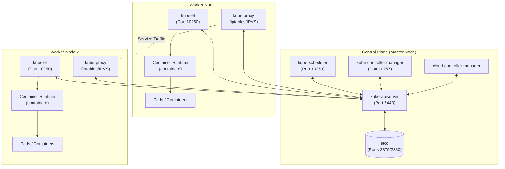
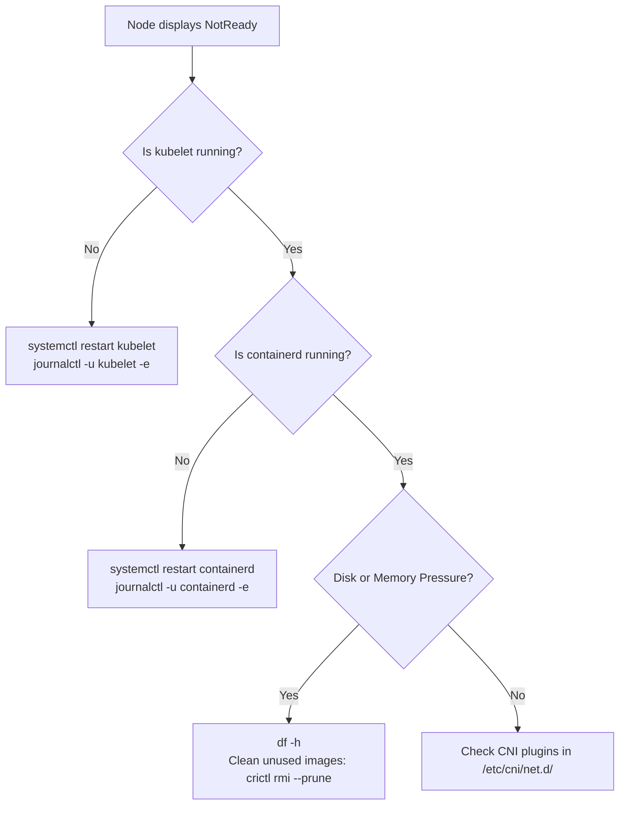

# Kubernetes Cluster Architecture - CKA Exam Notes

> **Exam Domain**: Cluster Architecture, Installation & Configuration (25%)  
> **Weight / Importance**: Critical  
> **Target Version**: Verified against v1.31 / v1.32 (Current CKA Curriculum)  
> **Allowed Docs Search Keywords**: `cluster architecture`, `static pods`, `kubelet configuration`, `crictl`  
> **Source**: Generated from `cluster-architecture-raw.md`

---

## 1. Quick-Reference Summary

- **`kube-apiserver`**: HTTPS `Port 6443`. Static Pod (`/etc/kubernetes/manifests/kube-apiserver.yaml`). The **only** component that interacts directly with `etcd`. Stateless; horizontally scalable behind a load balancer.
- **`etcd`**: Client `Port 2379`, Peer `Port 2380`. Static Pod (`/etc/kubernetes/manifests/etcd.yaml`). Distributed key-value store, source-of-truth for all cluster state. Requires an odd quorum `(N/2)+1`. Data dir: `/var/lib/etcd`.
- **`kube-scheduler`**: Secure `Port 10259`. Static Pod (`/etc/kubernetes/manifests/kube-scheduler.yaml`). Two-phase scheduling: **Filtering (Predicates)** -> **Scoring (Priorities)**. Assigns `nodeName`; does **not** create or run pods.
- **`kube-controller-manager`**: Secure `Port 10257`. Static Pod (`/etc/kubernetes/manifests/kube-controller-manager.yaml`). Continuously drives actual state toward desired state. Node Controller marks `NotReady` after 40s; evicts pods after 5m.
- **`kubelet`**: `Port 10250`. **Systemd Service** (never a pod!). Config at `/var/lib/kubelet/config.yaml`. Communicates with container runtime via CRI (gRPC). Executes probes and static pods.
- **`kube-proxy`**: Metrics `Port 10249`. **DaemonSet** in `kube-system`. Programs host packet filtering rules (`iptables` or `IPVS`) for Service traffic forwarding across nodes.
- **`containerd`**: Systemd Service. Socket: `/run/containerd/containerd.sock`. Config at `/etc/containerd/config.toml`. Requires `SystemdCgroup = true` to match kubelet's cgroup driver.
- **Static Pods**: Monitored by kubelet from `/etc/kubernetes/manifests/`. Mirrored to API server with suffix `-[node-name]`. **Cannot be deleted via `kubectl delete`**; must move or edit the manifest on the node disk.
- **Master Node Taint**: `node-role.kubernetes.io/control-plane:NoSchedule`. Untaint with: `kubectl taint nodes <node> node-role.kubernetes.io/control-plane:NoSchedule-`.
- **Cluster Health Verification**: Modern API health check is `kubectl get --raw='/readyz?verbose'`.

---

## 2. Conceptual Overview & Mental Model

### Dual-Layer Architectural Understanding

- **Simple English Explanation (How It Works)**:
  - **Control Plane (Master Nodes)**: The management and orchestration tier. It does not run user application containers directly; instead, it manages all cluster configuration, decides which worker nodes should run each pod, issues work instructions, and monitors cluster health.
  - **Worker Nodes**: The workload execution machines that host and run the application containers. Each worker node runs an agent (`kubelet`), a network proxy (`kube-proxy`), and a container runtime (`containerd`) to launch containers and manage network traffic.
  - **Container Runtime on Master Nodes**: Master nodes also require a container runtime engine installed because control plane components (`kube-apiserver`, `etcd`, `kube-scheduler`, `kube-controller-manager`) are themselves hosted as containers (static pods).

- **Standard / Production Definition**:
  A Kubernetes cluster is a distributed system partitioned into two distinct operational tiers:
  1. **Control Plane (Master Nodes)**: The management and decision-making layer. Makes global decisions (e.g., scheduling pods, detecting/responding to events), exposes the REST API, and persists cluster state in `etcd`.
  2. **Worker Nodes**: The workload execution layer. Hosts containerized workload pods, allocates CPU/memory resources, configures local pod networking, and reports node health.

> [!IMPORTANT]
> In Kubernetes, the **`kube-apiserver` is the sole central communications hub**. No other control plane or worker component communicates directly with `etcd`. All components (controllers, scheduler, kubelet, and `kubectl` clients) talk **only** to the API server.



---

## 3. Deep-Dive Technical Breakdown

### 3.1 Component Topology & Reference Table

| Component | Management Mode | Manifest / Config Path | Default Port | Log Location / Health |
| :--- | :--- | :--- | :--- | :--- |
| **`kube-apiserver`** | Static Pod | `/etc/kubernetes/manifests/kube-apiserver.yaml` | `6443` | `crictl logs`, `/var/log/pods` |
| **`etcd`** | Static Pod | `/etc/kubernetes/manifests/etcd.yaml` | `2379` (client), `2380` (peer) | `crictl logs`, `/var/lib/etcd` (data) |
| **`kube-scheduler`** | Static Pod | `/etc/kubernetes/manifests/kube-scheduler.yaml` | `10259` (secure) | `crictl logs`, `/var/log/pods` |
| **`kube-controller-manager`** | Static Pod | `/etc/kubernetes/manifests/kube-controller-manager.yaml` | `10257` (secure) | `crictl logs`, `/var/log/pods` |
| **`kubelet`** | **Systemd Service** | `/var/lib/kubelet/config.yaml` | `10250` | `journalctl -u kubelet -f` |
| **`kube-proxy`** | DaemonSet | ConfigMap `kube-proxy` in `kube-system` | Metrics `10249` | `kubectl logs -n kube-system -l k8s-app=kube-proxy` |
| **`containerd` (CRI)** | **Systemd Service** | `/etc/containerd/config.toml` | Socket: `/run/containerd/containerd.sock` | `journalctl -u containerd -f` |

---

### 3.2 Control Plane Components

#### 1. `kube-apiserver`
- **Intuitive Understanding (In Plain English)**:
  The single central communication desk and orchestrator of the entire cluster. It exposes the Kubernetes API: external users (via `kubectl`) submit management operations through it, controllers monitor cluster state and apply changes through it, and worker nodes report health and receive assignments through it. Nothing touches `etcd` or operates in the cluster without going through the API server.
- **Standard / Production Definition**:
  Primary gateway to the cluster. Validates, authenticates, authorizes (RBAC), applies admission controllers, and processes RESTful requests.
- **Key Mechanics**:
  - The **only** component that interacts directly with `etcd`.
  - Stateless; can be horizontally scaled behind a load balancer in high-availability (HA) topologies.
  - Generates audit logs and controls cluster access.

#### 2. `etcd`
- **Intuitive Understanding (In Plain English)**:
  The cluster's master brain and timeline ledger. It is a key-value database whose core purpose is to record all information about which containers exist, which worker nodes host them, their live status, and the chronological timeline of events across the cluster.
- **Standard / Production Definition**:
  Distributed, highly-available, consistent key-value store implementing RAFT consensus.
- **Key Mechanics**:
  - Stores the complete source-of-truth state for all Kubernetes objects, secrets, configs, and node metadata.
  - Implements the **RAFT consensus protocol**; requires an odd number of members (`(N/2)+1` quorum).
  - Data directory default: `/var/lib/etcd`.
  - Critical CKA Task: **Snapshot Backup & Restore** using `etcdctl`.

#### 3. `kube-scheduler`
- **Intuitive Understanding (In Plain English)**:
  The placement matchmaker. When a new container is requested, the scheduler decides which is the best worker node to place it on by comparing the container's resource requirements (CPU/RAM) against worker node capacities, while respecting constraints or policies (such as taints, tolerations, and node affinity rules). It decides *where* to place the container, but does not create it.
- **Standard / Production Definition**:
  Watches for newly created Pods with no assigned `nodeName` and selects the optimal node for them to run on.
- **Two-Phase Decision Process**:
  1. **Filtering (Predicates)**: Eliminates nodes that do not satisfy pod requirements (e.g., insufficient CPU/RAM, taints without tolerations, node selector/affinity mismatch).
  2. **Scoring (Priorities)**: Ranks remaining candidate nodes and picks the node with the highest score.
- Does **not** place the pod itself; it simply updates the pod spec with `nodeName`, delegating actual pod creation to the worker node's `kubelet`.

#### 4. `kube-controller-manager` (KCM)
- **Intuitive Understanding (In Plain English)**:
  The cluster's automated overseers and repair crews packaged in a single binary:
  - **Node Controller**: Handles onboarding new nodes, and continuously monitors worker node health—handling situations where nodes become unavailable or get destroyed.
  - **Replication / ReplicaSet Controller**: The headcount enforcer—ensures that the exact desired number of containers are running at all times in the replication group.
- **Standard / Production Definition**:
  A single daemon that embeds core control loops (controllers) to continuously drive the actual state toward the desired state.
- **Key Sub-Controllers Tested in CKA**:
  - **Node Controller**: Monitors node health; marks nodes `NotReady` if heartbeats stop (default 40s grace period), triggers pod evictions after 5 minutes.
  - **Replication Controller / ReplicaSet Controller**: Ensures the exact desired count of pod replicas are running at all times.
  - **Job Controller**: Manages run-to-completion batch tasks.
  - **EndpointSlice / Endpoints Controller**: Populates endpoints joining Services to Pods.
  - **ServiceAccount & Token Controller**: Creates default accounts and API access tokens for new namespaces.

#### 5. `cloud-controller-manager` (CCM)
- **Intuitive Understanding (In Plain English)**:
  A dedicated bridge allowing Kubernetes to communicate with cloud provider APIs (AWS, GCP, Azure) to provision provider-managed load balancers, node lifecycles, and network routes without hardcoding cloud vendor logic into the core Kubernetes codebase.
- **Standard / Production Definition**:
  Separates cloud-provider-specific logic from Kubernetes core. Runs controllers for cloud Node lifecycle, cloud Routes, and cloud LoadBalancers.

---

### 3.3 Worker Node Components

#### 1. `kubelet`
- **Intuitive Understanding (In Plain English)**:
  The node's resident captain / agent running on each worker and master node. It listens for instructions from the `kube-apiserver` and tells the local container runtime to deploy or destroy containers on that node. It also periodically fetches and sends status reports to the API server regarding the node's health and the containers running on it.
- **Standard / Production Definition**:
  The primary node agent that registers the node with the API server and manages pod lifecycles locally.
- **Key Mechanics**:
  - Runs directly as a **Linux systemd service** (never as a pod).
  - Takes a set of `PodSpecs` (from apiserver or local static pod files) and ensures containers described in those specs are running and healthy.
  - Communicates with the local container runtime via **gRPC** through the Container Runtime Interface (CRI).
  - Performs local liveness, readiness, and startup probe executions.
  - Reports local node resource metrics and health status back to `kube-apiserver`.

#### 2. `kube-proxy`
- **Intuitive Understanding (In Plain English)**:
  The cluster's internal network traffic director. It enables communication across worker nodes when a container on one node needs to talk to a container on another node, and ensures traffic to a Service IP / NodePort gets routed to the appropriate backend container.
- **Standard / Production Definition**:
  Network proxy running on each node that reflects Kubernetes Service concepts.
- **Key Mechanics**:
  - Typically deployed as a `DaemonSet` in the `kube-system` namespace.
  - Programs host packet filtering rules using **iptables** (default) or **IPVS** to forward Service `ClusterIP` and `NodePort` traffic to appropriate backend Pod endpoints.

#### 3. Container Runtime Interface (CRI)
- **Intuitive Understanding (In Plain English)**:
  The underlying container execution engine. A container runtime (such as `containerd` or `CRI-O`) must be installed on all nodes—including master nodes if control plane components are run as containers.
- **Standard / Production Definition**:
  Software responsible for pulling container images, configuring namespaces/cgroups, and running containers via CRI.
- **Modern Standards**:
  - Kubernetes uses the standard **CRI** (Container Runtime Interface).
  - **Supported Runtimes**: `containerd` and `CRI-O`.
  - Low-level execution runtime: `runc`.

> [!WARNING]
> **Dockershim is completely removed** (since Kubernetes v1.24). Do not look for `docker.service` or use `docker ps` on modern CKA exam nodes. Use **`crictl`** to inspect runtime containers on the node directly!

---

## 4. Component Management & Operational Modes

Understanding how components are managed determines how you configure, restart, and debug them:

| Management Mode | Components | How to View Status | How to Restart | Where Configuration Lives |
| :--- | :--- | :--- | :--- | :--- |
| **Systemd Service** | `kubelet`, `containerd` | `systemctl status <service>` | `sudo systemctl restart <service>` | `/var/lib/kubelet/config.yaml`, `/etc/containerd/config.toml` |
| **Static Pod** | `kube-apiserver`, `etcd`, `kube-scheduler`, `kube-controller-manager` | `crictl ps` or `kubectl get pods -n kube-system` | Edit/touch manifest in `/etc/kubernetes/manifests/` | YAML manifests in `/etc/kubernetes/manifests/` |
| **DaemonSet** | `kube-proxy`, CNI plugins (e.g. Flannel, Calico) | `kubectl get daemonsets -n kube-system` | `kubectl rollout restart ds/<name> -n kube-system` | ConfigMaps & DaemonSet spec in `kube-system` |

---

## 5. High-Yield CLI & Imperative Commands

### 5.1 Cluster & Component Inspection

```bash
# 1. View all nodes, status, roles, versions, and internal IPs
kubectl get nodes -o wide

# 2. Inspect all control plane static pods in kube-system
kubectl get pods -n kube-system -o wide

# 3. Check cluster health endpoint (modern replacement for deprecated componentstatuses)
kubectl get --raw='/readyz?verbose'

# 4. View allocatable node capacity vs total capacity
kubectl describe node <node-name> | grep -A 8 "Allocatable:"

# 5. Check master node taints (determines if workloads can schedule on control plane)
kubectl describe node <control-plane-node> | grep -i taints
```

### 5.2 Low-Level Node Debugging with `crictl`

On worker or control plane nodes via SSH:

```bash
# Verify crictl is connected to the CRI socket
crictl info

# List all running containers on the current node
crictl ps

# List all pods (sandboxes) on the current node
crictl pods

# View logs of a specific container directly from runtime (e.g. failing static pod)
crictl logs <container-id>
```

### 5.3 Static Pod Manifest Blueprint

File: `/etc/kubernetes/manifests/static-web.yaml`
```yaml
apiVersion: v1
kind: Pod
metadata:
  name: static-web
  labels:
    role: static-worker
spec:
  containers:
    - name: web
      image: nginx:1.25
      ports:
        - containerPort: 80
```

> [!NOTE]
> Kubelet continuously monitors `/etc/kubernetes/manifests/`. Saving this file automatically launches the pod; moving or deleting the file terminates it.

---

## 6. Declarative YAML Patterns & Configurations

### Kubelet Static Pod Path Configuration
In `/var/lib/kubelet/config.yaml`:
```yaml
staticPodPath: /etc/kubernetes/manifests
```
If an exam question asks to modify the static pod directory, edit this path and reload the daemon:
```bash
sudo systemctl daemon-reload
sudo systemctl restart kubelet
```

---

## 7. Troubleshooting & Diagnostic Runbook

### Scenario A: Worker Node Status is `NotReady`



**Step-by-step triage sequence**:
1. Check node details:
   ```bash
   kubectl describe node <node-name>
   # Look at Conditions: MemoryPressure, DiskPressure, PIDPressure, Ready
   ```
2. SSH into the node:
   ```bash
   ssh <node-name>
   ```
3. Inspect `kubelet` service status and recent error logs:
   ```bash
   systemctl status kubelet
   journalctl -u kubelet -n 50 --no-pager
   ```
4. Verify the container runtime:
   ```bash
   systemctl status containerd
   crictl ps
   ```
5. Verify CNI network plugin configuration files exist:
   ```bash
   ls -la /etc/cni/net.d/
   ```

---

### Scenario B: Control Plane Down (`Connection Refused on Port 6443`)

When `kubectl` commands return `The connection to the server <ip>:6443 was refused`:
1. SSH into the master/control plane node.
2. Check if `kubelet` is active:
   ```bash
   systemctl status kubelet
   ```
   *(If kubelet is stopped, static pods like `kube-apiserver` and `etcd` cannot run!)*
3. Check container runtime status with `crictl`:
   ```bash
   crictl ps -a | grep apiserver
   crictl ps -a | grep etcd
   ```
4. Check static pod manifest files for typos or syntax errors:
   ```bash
   ls -l /etc/kubernetes/manifests/
   # Validate YAML syntax of kube-apiserver.yaml and etcd.yaml
   ```
5. Inspect container crash logs:
   ```bash
   crictl logs $(crictl ps -a --name kube-apiserver -q | head -n 1)
   ```

---

## 8. CKA Exam Tips, Gotchas & Traps

> [!TIP]
> **Static Pod Naming Convention**:
> A static pod created on a node automatically appends `-[node-name]` to its metadata name (e.g., `kube-apiserver-controlplane`, `my-pod-worker1`). When asked to identify static pods, check for this suffix or verify `ownerReferences` (static pods have none).

> [!WARNING]
> **Never try to delete or edit a static pod using `kubectl edit` or `kubectl delete`!**  
> Even if `kubectl delete pod <static-pod>` reports deleted, Kubelet will immediately recreate it because the manifest still exists on disk. You **must** SSH into the node and edit or move the file out of `/etc/kubernetes/manifests/`.

> [!IMPORTANT]
> **`crictl` Endpoint Error Gotcha**:  
> If `crictl ps` outputs `runtime endpoint not set`, check `/etc/crictl.yaml`. Ensure it contains:
> ```yaml
> runtime-endpoint: unix:///run/containerd/containerd.sock
> image-endpoint: unix:///run/containerd/containerd.sock
> timeout: 10
> debug: false
> ```

> [!NOTE]
> **Control Plane Schedulability**:  
> By default, control plane nodes have a taint:
> `node-role.kubernetes.io/control-plane:NoSchedule`  
> If an exam question asks to allow normal user workloads to run on the control plane node, remove the taint:
> ```bash
> kubectl taint nodes <control-plane-node> node-role.kubernetes.io/control-plane:NoSchedule-
> ```

---

## 9. Self-Test / Active Recall

Use these active recall prompts to test your retention. Answer each before clicking to reveal the solution.

1. **Which component is the only one permitted to talk directly to `etcd`?**
2. **Why does `kubectl delete pod <static-pod>` fail to permanently remove a static pod?**
3. **Does `kube-scheduler` create the container process on the chosen worker node?**
4. **Is `kubelet` managed as a static pod, a DaemonSet, or a Linux systemd service?**
5. **If worker node heartbeats cease, after how much time does the Node Controller mark the node `NotReady`, and when does pod eviction occur?**
6. **What exact command removes the master node taint allowing workloads to schedule on the control plane?**
7. **Where does `kubelet` look for static pod manifests by default, and which configuration file governs this path?**

<details>
<summary>Reveal Answers</summary>

1. **`kube-apiserver`**. All other components (controllers, scheduler, kubelet, and client tools) communicate exclusively with the API server.
2. Because the manifest file still resides in Kubelet's `staticPodPath` directory (`/etc/kubernetes/manifests/`). Kubelet continuously reconciles disk state and immediately restarts the pod. You must remove or move the manifest file on the node.
3. **No**. The scheduler only selects the candidate node and populates the `spec.nodeName` field. The `kubelet` on that worker node detects the assignment and delegates container creation to the container runtime via CRI.
4. It runs directly as a **Linux systemd service**.
5. The Node Controller marks the node `NotReady` after a **40-second** grace period (4 consecutive missed 10s heartbeats), and initiates pod eviction after **5 minutes** (`pod-eviction-timeout`).
6. `kubectl taint nodes <control-plane-node> node-role.kubernetes.io/control-plane:NoSchedule-` (note the trailing minus sign `-`).
7. `/etc/kubernetes/manifests`. It is configured via `staticPodPath` in `/var/lib/kubelet/config.yaml`.
</details>

---

### Official Documentation Bookmarks

Allowed for reference during the live exam at [kubernetes.io/docs](https://kubernetes.io/docs/home/):

| Topic | Direct Search Term | Recommended Anchor |
| :--- | :--- | :--- |
| **Cluster Architecture** | `Kubernetes Components` | Concepts > Overview > Kubernetes Components |
| **Static Pods** | `Create static pods` | Tasks > Configure Pods and Containers > Create static pods |
| **Kubelet Configuration** | `Kubelet Configuration (v1beta1)` | Reference > Config API > Kubelet Configuration |
| **Node Debugging** | `Debugging Kubernetes Nodes` | Tasks > Administer a Cluster > Debugging Kubernetes Nodes |
