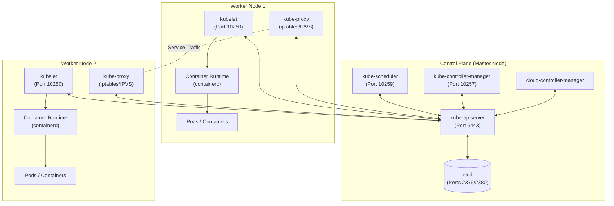
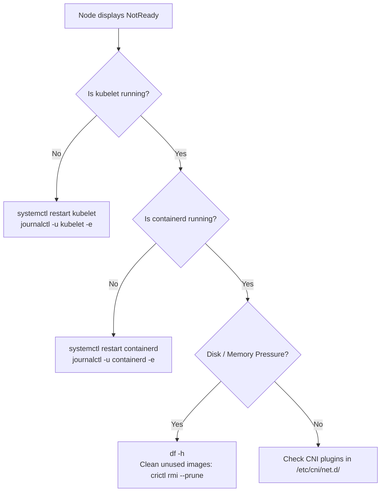

# Kubernetes Cluster Architecture - CKA Exam Notes

> **Exam Domain**: Cluster Architecture, Installation & Configuration (25%)  
> **Weight / Importance**: Critical  
> **Allowed Docs Search Keywords**: `cluster architecture`, `static pods`, `kubelet configuration`, `crictl`

---

## 1. Conceptual Overview & Mental Model

A Kubernetes cluster consists of two distinct tiers of machines:
1. **Control Plane (Master Nodes)**: The brain and management layer. Makes global decisions about the cluster (e.g., scheduling pods, detecting and responding to cluster events), exposes the API, and persists cluster state.
2. **Worker Nodes**: The execution layer. Hosts containerized workload pods, allocates CPU/memory resources, and manages local pod networking.

> [!IMPORTANT]
> In Kubernetes, the **`kube-apiserver` is the sole central communications hub**. No other control plane or worker component communicates directly with `etcd`. All components (controllers, scheduler, kubelet, and `kubectl` clients) talk **only** to the API server.



---

## 2. Deep-Dive Component Breakdown

### 2.1 Component Topology & Reference Table

| Component | Management Mode | Manifest / Config Path | Default Port | Log Location / Health |
| :--- | :--- | :--- | :--- | :--- |
| **`kube-apiserver`** | Static Pod | `/etc/kubernetes/manifests/kube-apiserver.yaml` | `6443` | `crictl logs`, `/var/log/pods` |
| **`etcd`** | Static Pod | `/etc/kubernetes/manifests/etcd.yaml` | `2379` (client), `2380` (peer) | `crictl logs`, `/var/lib/etcd` (data) |
| **`kube-scheduler`** | Static Pod | `/etc/kubernetes/manifests/kube-scheduler.yaml` | `10259` (secure) | `crictl logs`, `/var/log/pods` |
| **`kube-controller-manager`** | Static Pod | `/etc/kubernetes/manifests/kube-controller-manager.yaml` | `10257` (secure) | `crictl logs`, `/var/log/pods` |
| **`kubelet`** | **Systemd Service** | `/var/lib/kubelet/config.yaml` | `10250` | `journalctl -u kubelet -f` |
| **`kube-proxy`** | DaemonSet | ConfigMap `kube-proxy` in `kube-system` | Metrics `10249` | `kubectl logs -n kube-system -l k8s-app=kube-proxy` |
| **`containerd` (CRI)** | **Systemd Service** | `/etc/containerd/config.toml` | Socket: `/run/containerd/containerd.sock` | `journalctl -u containerd -f` |

---

### 2.2 Control Plane Components

#### 1. `kube-apiserver`
- **Role**: Primary gateway to the cluster. Validates, authenticates, authorizes (RBAC), applies admission controllers, and processes RESTful requests.
- **Key Mechanics**:
  - The **only** component that interacts directly with `etcd`.
  - Stateless; can be horizontally scaled behind a load balancer in high-availability (HA) topologies.
  - Generates audit logs and controls cluster access.

#### 2. `etcd`
- **Role**: Distributed, highly-available, consistent key-value store.
- **Key Mechanics**:
  - Stores the complete source-of-truth state for all Kubernetes objects, secrets, configs, and node metadata.
  - Implements the **RAFT consensus protocol**; requires an odd number of members (`(N/2)+1` quorum).
  - Data directory default: `/var/lib/etcd`.
  - Critical CKA Task: **Snapshot Backup & Restore** using `etcdctl`.

#### 3. `kube-scheduler`
- **Role**: Watches for newly created Pods with no assigned `nodeName` and selects the optimal node for them to run on.
- **Two-Phase Decision Process**:
  1. **Filtering (Predicates)**: Eliminates nodes that do not satisfy pod requirements (e.g., insufficient CPU/RAM, taints without tolerations, node selector/affinity mismatch).
  2. **Scoring (Priorities)**: Ranks remaining candidate nodes and picks the node with the highest score.
- Does **not** place the pod itself; it simply updates the pod spec with `nodeName`, delegating actual pod creation to the worker node's `kubelet`.

#### 4. `kube-controller-manager` (KCM)
- **Role**: A single daemon that embeds core control loops (controllers) to continuously drive the actual state toward the desired state.
- **Key Sub-Controllers Tested in CKA**:
  - **Node Controller**: Monitors node health; marks nodes `NotReady` if heartbeats stop (default 40s grace period), triggers pod evictions after 5 minutes.
  - **Replication Controller / ReplicaSet Controller**: Ensures the exact desired count of pod replicas are running at all times.
  - **Job Controller**: Manages run-to-completion batch tasks.
  - **EndpointSlice / Endpoints Controller**: Populates endpoints joining Services to Pods.
  - **ServiceAccount & Token Controller**: Creates default accounts and API access tokens for new namespaces.

#### 5. `cloud-controller-manager` (CCM)
- **Role**: Separates cloud-provider-specific logic from Kubernetes core. Runs controllers for cloud Node lifecycle, cloud Routes, and cloud LoadBalancers.

---

### 2.3 Worker Node Components

#### 1. `kubelet`
- **Role**: The primary node agent that registers the node with the API server and manages pod lifecycles locally.
- **Key Mechanics**:
  - Runs directly as a **Linux systemd service** (never as a pod).
  - Takes a set of `PodSpecs` (from apiserver or local static pod files) and ensures containers described in those specs are running and healthy.
  - Communicates with the local container runtime via **gRPC** through the Container Runtime Interface (CRI).
  - Performs local liveness, readiness, and startup probe executions.
  - Reports local node resource metrics and health status back to `kube-apiserver`.

#### 2. `kube-proxy`
- **Role**: Network proxy running on each node that reflects Kubernetes Service concepts.
- **Key Mechanics**:
  - Typically deployed as a `DaemonSet` in the `kube-system` namespace.
  - Programs host packet filtering rules using **iptables** (default) or **IPVS** to forward Service `ClusterIP` and `NodePort` traffic to appropriate backend Pod endpoints.

#### 3. Container Runtime Interface (CRI)
- **Role**: Software responsible for pulling container images, configuring namespaces/cgroups, and running containers.
- **Modern Standards**:
  - Kubernetes uses the standard **CRI** (Container Runtime Interface).
  - **Supported Runtimes**: `containerd` and `CRI-O`.
  - Low-level execution runtime: `runc`.

> [!WARNING]
> **Dockershim is completely removed** (since Kubernetes v1.24). Do not look for `docker.service` or use `docker ps` on modern CKA exam nodes. Use **`crictl`** to inspect runtime containers on the node directly!
> *Note on historical tools*: `rkt` (Rocket) and direct Docker daemon integrations are deprecated/retired.

---

## 3. High-Yield CLI & Imperative Commands

### 3.1 Cluster & Component Inspection

```bash
# 1. View all nodes, status, roles, versions, and internal IPs
kubectl get nodes -o wide

# 2. Inspect all control plane static pods in kube-system
kubectl get pods -n kube-system -o wide

# 3. Check cluster health endpoint (modern replacement for deprecated componentstatuses)
kubectl get --raw='/readyz?verbose'

# 4. View allocatable node capacity vs capacity
kubectl describe node <node-name> | grep -A 8 "Allocatable:"

# 5. Check master node taints (determines if workloads can schedule on control plane)
kubectl describe node <control-plane-node> | grep -i taints
```

### 3.2 Low-Level Node Debugging with `crictl`

On worker or control plane nodes via SSH:

```bash
# Verify crictl is connected to the CRI socket
crictl info

# List all running containers on the current node
crictl ps

# List all pods (sandboxes) on the current node
crictl pods

# View logs of a specific container directly from the runtime (e.g. failing static pod)
crictl logs <container-id>
```

---

## 4. Declarative YAML Patterns & Configurations

### 4.1 Static Pod Manifest Blueprint
Static pods are managed directly by `kubelet` on a specific node without API server supervision.

File: `/etc/kubernetes/manifests/static-web.yaml`
```yaml
apiVersion: v1
kind: Pod
metadata:
  name: static-web
  labels:
    role: static-worker
spec:
  containers:
    - name: web
      image: nginx:1.25
      ports:
        - containerPort: 80
```

> [!NOTE]
> Kubelet continuously monitors `/etc/kubernetes/manifests/`. As soon as you save this YAML file, Kubelet creates the pod. If you delete the file, Kubelet terminates the pod.

### 4.2 Kubelet Static Pod Path Configuration
In `/var/lib/kubelet/config.yaml`:
```yaml
staticPodPath: /etc/kubernetes/manifests
```
If you ever need to change the static pod directory, edit this path in the config file and reload:
```bash
sudo systemctl daemon-reload
sudo systemctl restart kubelet
```

---

## 5. Troubleshooting & Diagnostic Runbook

### Scenario A: Worker Node Status is `NotReady`



**Step-by-step triage sequence**:
1. Check node details:
   ```bash
   kubectl describe node <node-name>
   # Look at Conditions: MemoryPressure, DiskPressure, PIDPressure, Ready
   ```
2. SSH into the node:
   ```bash
   ssh <node-name>
   ```
3. Inspect `kubelet` service status and recent error logs:
   ```bash
   systemctl status kubelet
   journalctl -u kubelet -n 50 --no-pager
   ```
4. Verify the container runtime:
   ```bash
   systemctl status containerd
   crictl ps
   ```
5. Verify CNI network plugin configuration files exist:
   ```bash
   ls -la /etc/cni/net.d/
   ```

---

### Scenario B: Control Plane Down (`Connection Refused on Port 6443`)

When `kubectl` commands return `The connection to the server <ip>:6443 was refused`:
1. SSH into the master/control plane node.
2. Check if `kubelet` is active:
   ```bash
   systemctl status kubelet
   ```
   *(If kubelet is stopped, static pods like `kube-apiserver` and `etcd` cannot run!)*
3. Check container runtime status with `crictl`:
   ```bash
   crictl ps -a | grep apiserver
   crictl ps -a | grep etcd
   ```
4. Check static pod manifest files for typos or syntax errors:
   ```bash
   ls -l /etc/kubernetes/manifests/
   # Validate YAML syntax of kube-apiserver.yaml and etcd.yaml
   ```
5. Inspect container crash logs:
   ```bash
   crictl logs $(crictl ps -a --name kube-apiserver -q | head -n 1)
   ```

---

## 6. CKA Exam Tips, Gotchas & Traps

> [!TIP]
> **Static Pod Naming Convention**:
> A static pod created on a node automatically appends `-[node-name]` to its metadata name (e.g., `kube-apiserver-controlplane`, `my-pod-worker1`). When asked to identify static pods, check for this suffix or inspect `ownerReferences` (static pods have none).

> [!WARNING]
> **Never try to delete or edit a static pod using `kubectl edit` or `kubectl delete`!**  
> Even if `kubectl delete pod <static-pod>` reports deleted, Kubelet will immediately recreate it because the manifest still exists on disk. You **must** SSH into the node and edit or move the file out of `/etc/kubernetes/manifests/`.

> [!IMPORTANT]
> **`crictl` Endpoint Error Gotcha**:  
> If `crictl ps` outputs `runtime endpoint not set`, check `/etc/crictl.yaml`. Ensure it contains:
> ```yaml
> runtime-endpoint: unix:///run/containerd/containerd.sock
> image-endpoint: unix:///run/containerd/containerd.sock
> timeout: 10
> debug: false
> ```

> [!NOTE]
> **Control Plane Schedulability**:  
> By default, control plane nodes have a taint:
> `node-role.kubernetes.io/control-plane:NoSchedule`  
> If an exam question asks to allow normal user workloads to run on the control plane node, remove the taint:
> ```bash
> kubectl taint nodes <control-plane-node> node-role.kubernetes.io/control-plane:NoSchedule-
> ```

---

## 7. Official Documentation Bookmarks

Allowed for reference during the live exam at [kubernetes.io/docs](https://kubernetes.io/docs/home/):

| Topic | Direct Search Term | Recommended Anchor |
| :--- | :--- | :--- |
| **Cluster Architecture** | `Kubernetes Components` | Concepts > Overview > Kubernetes Components |
| **Static Pods** | `Create static pods` | Tasks > Configure Pods and Containers > Create static pods |
| **Kubelet Configuration** | `Kubelet Configuration (v1beta1)` | Reference > Config API > Kubelet Configuration |
| **Node Debugging** | `Debugging Kubernetes Nodes` | Tasks > Administer a Cluster > Debugging Kubernetes Nodes |

