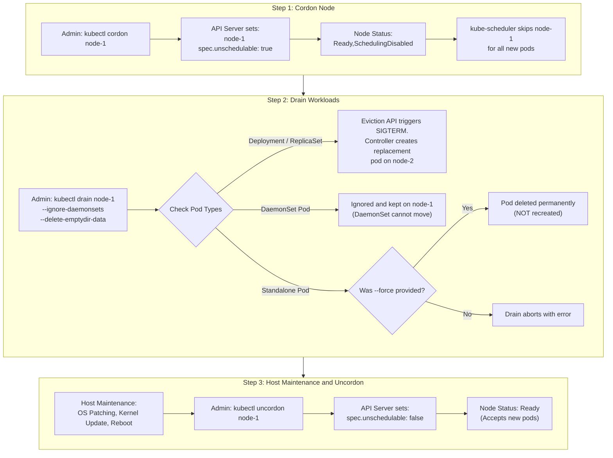
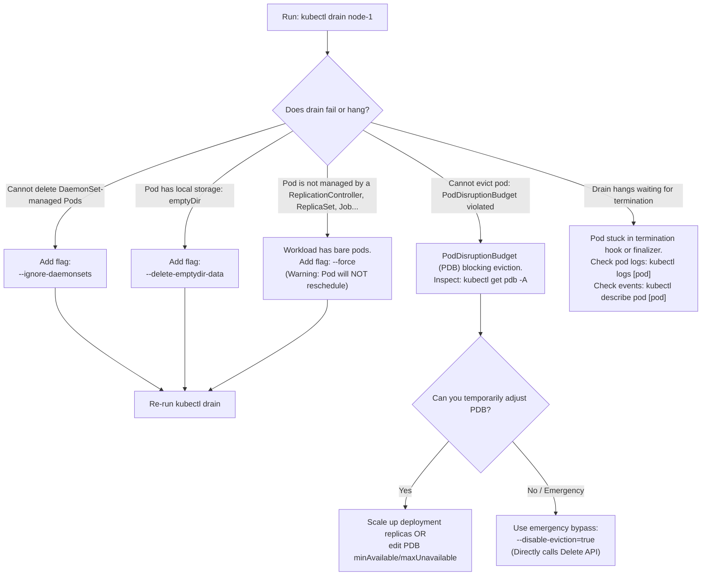

# Kubernetes Node Maintenance & OS Upgrades - CKA Exam Notes

> **Exam Domain**: Cluster Architecture, Installation & Configuration (25%) / Cluster Maintenance  
> **Weight / Importance**: Critical (Frequently tested live scenario in the CKA exam: safely draining worker or control-plane nodes, performing host-level maintenance, and returning nodes to service)  
> **Target Version**: Verified against v1.31 / v1.32 (Current CKA Curriculum)  
> **Allowed Docs Search Keywords**: `Safely Drain a Node`, `kubectl drain`, `kubectl cordon`, `kubectl uncordon`, `PodDisruptionBudget`  
> **Source**: Generated from `cluster-maintainance/os-upgrades-raw.md`

---

## 1. Quick-Reference Summary

- **`kubectl cordon <node>`**:
  - Marks node as unschedulable (`spec.unschedulable: true`).
  - Applies internal taint: `node.kubernetes.io/unschedulable:NoSchedule`.
  - Node status changes to **`Ready,SchedulingDisabled`**.
  - **Zero impact on running pods**: Existing pods remain running without interruption; only new pod scheduling is blocked.
- **`kubectl drain <node>`**:
  - Automatically cordons the node first.
  - Submits eviction requests via the Kubernetes **Eviction API** (`/v1/pods/<name>/eviction`), strictly honoring **`PodDisruptionBudgets` (PDBs)**.
  - Controller-managed pods (Deployments, ReplicaSets, StatefulSets, Jobs) are gracefully terminated on the target node; controllers spin up replacement replicas on other eligible nodes.
  - Mandatory flags for production / exam drains:
    - **`--ignore-daemonsets`**: Mandatory when DaemonSet pods reside on the node (otherwise `drain` fails immediately).
    - **`--delete-emptydir-data`**: Mandatory when pods mount ephemeral `emptyDir` volumes (data is wiped during eviction). Replaced deprecated flag `--delete-local-data`.
    - **`--force`**: Required if standalone (unmanaged / bare) pods exist. Standalone pods are deleted permanently and **will NOT be rescheduled**.
- **`kubectl uncordon <node>`**:
  - Marks node as schedulable (`spec.unschedulable: false`).
  - Node status returns to **`Ready`**.
  - **No Automatic Pod Rebalancing**: Uncordoning does **not** move previously evicted pods back. Existing pods remain where they are until explicitly restarted or scaled.

---

## 2. Conceptual Overview & Mental Model

### Dual-Layer Architectural Understanding

- **Simple English Explanation (How It Works)**:
  - **The Maintenance Problem**:
    Worker and control-plane nodes run on physical servers or virtual machines that require periodic kernel updates, security patching, hardware replacements, or operating system upgrades.
    If you abruptly reboot or power down a worker node while workloads are active, client connections are severed instantly, in-flight transactions are dropped, and pods fail uncleanly before Kubernetes controllers detect node failure after the node-controller timeout (default 40s).
  - **How Cordon and Drain Solve This**:
    1. **Isolation (`cordon`)**: Before touching a node, you signal the Kubernetes scheduler (`kube-scheduler`) to stop sending new pods to that node.
    2. **Graceful Eviction (`drain`)**: The eviction process sends `SIGTERM` signals to running container processes, allowing them to flush state, complete active requests, and shut down cleanly within their `terminationGracePeriodSeconds`. Simultaneously, workload controllers (such as the `ReplicaSetController`) detect the disappearing pods and launch replacement pods onto remaining healthy nodes in the cluster.
    3. **Post-Maintenance Return (`uncordon`)**: Once host upgrades, kernel updates, or reboots are complete and Kubelet reports healthy, the node is marked schedulable again to accept future workloads.



- **Standard / Production Definition**:
  - **`kubectl drain`**: A client-side orchestration command that cordons a target node and iterates through all active non-mirror pods, issuing eviction requests against the Kubernetes Eviction API. Evictions enforce graceful container termination and PodDisruptionBudgets, guaranteeing high availability while transitioning node hardware into an offline maintenance state.

---

## 3. Deep-Dive Technical Breakdown

### 3.1 Node Scheduling States & Taints

When a node's schedulability state transitions, the API server updates both the `Node` spec and its node conditions/taints:

| Operation | Object Field Modified | Node Status Flag | Under-the-Hood Taint | Pod Impact |
| :--- | :--- | :--- | :--- | :--- |
| **`kubectl cordon`** | `spec.unschedulable: true` | `Ready,SchedulingDisabled` | `node.kubernetes.io/unschedulable:NoSchedule` | New pods blocked. Existing pods unaffected. |
| **`kubectl drain`** | `spec.unschedulable: true` + Eviction API | `Ready,SchedulingDisabled` | `node.kubernetes.io/unschedulable:NoSchedule` | Existing managed pods evicted and recreated elsewhere. |
| **`kubectl uncordon`** | `spec.unschedulable: false` | `Ready` | Taint removed | Schedulability restored for subsequent pods. |

---

### 3.2 The Eviction API vs. Pod Deletion

`kubectl drain` does not run `kubectl delete pod` directly. Instead, it interacts with the **Eviction subresource** (`/api/v1/namespaces/{namespace}/pods/{name}/eviction`):
1. **Eviction Creation**: A POST request sends an `Eviction` object containing graceful termination parameters.
2. **PDB Evaluation**: The API server evaluates all active `PodDisruptionBudget` (PDB) objects selecting that pod.
   - If evicting the pod would cause available replicas to drop below `minAvailable` (or exceed `maxUnavailable`), the API server **rejects** the eviction request with HTTP status `429 Too Many Requests`.
   - `kubectl drain` periodically retries until timeout expires.
3. **Graceful Termination**: Once permitted, the Kubelet on the target node sends `SIGTERM` to the containers and waits up to `terminationGracePeriodSeconds` (default 30s) before sending `SIGKILL`.

---

### 3.3 Workload Categories Handled by `drain`

Workloads respond differently during a node drain operation:

| Workload Category | Example Manifests | Default `drain` Reaction | Required Flag to Bypass | Rescheduling Outcome |
| :--- | :--- | :--- | :--- | :--- |
| **ReplicaSet / Deployment** | Microservice APIs, Web servers | Evicted gracefully | *None* | Replacement pods scheduled onto remaining active nodes. |
| **StatefulSet** | Databases, message queues | Evicted gracefully | *None* | Rescheduled onto another node; re-attaches existing PersistentVolume. |
| **DaemonSet** | Flannel, Calico, kube-proxy, Promtail | **Aborts drain** | `--ignore-daemonsets` | Remains running on the node or terminates during reboot. Cannot move to other nodes. |
| **Pods with `emptyDir`** | Caches, scratch storage | **Aborts drain** | `--delete-emptydir-data` | Deleted. All data inside `emptyDir` volumes is permanently lost. |
| **Standalone / Bare Pods** | Pod created via `kubectl run` without controller | **Aborts drain** | `--force` | Deleted permanently. **Will never be rescheduled**. |
| **Static Pods** | `etcd`, `kube-apiserver` (in `/etc/kubernetes/manifests`) | Skipped (Mirror pods ignored) | *None* | Continues running as long as Kubelet is active. Not managed by API server. |

---

## 4. End-to-End OS Upgrade & Node Maintenance Runbook

### The Complete CKA Production Procedure

Follow this exact 5-step sequence whenever an exam question instructs you to perform maintenance, kernel upgrades, or OS upgrades on a cluster node:

```bash
# -------------------------------------------------------------
# STEP 1: Cordon and Drain the Node
# -------------------------------------------------------------
# Safely evict all workloads while ignoring DaemonSets and accepting emptyDir deletion
kubectl drain <node-name> --ignore-daemonsets --delete-emptydir-data --force

# Verify node is cordoned and all workloads have moved
kubectl get nodes
# Expected output: <node-name>   Ready,SchedulingDisabled

kubectl get pods -A -o wide --field-selector spec.nodeName=<node-name>
# Only DaemonSet pods (kube-proxy, CNI plugins) should remain running
```

```bash
# -------------------------------------------------------------
# STEP 2: Access the Node Host via SSH
# -------------------------------------------------------------
ssh <node-name>
sudo -i
```

```bash
# -------------------------------------------------------------
# STEP 3: Perform OS / Kernel Maintenance
# -------------------------------------------------------------
# Update package repositories and upgrade OS packages
apt-get update && apt-get upgrade -y

# If upgrading Kubernetes binaries (kubeadm/kubelet/kubectl):
# apt-mark unhold kubeadm kubelet kubectl
# apt-get install -y kubelet=1.31.0-1.1 kubectl=1.31.0-1.1
# apt-mark hold kubeadm kubelet kubectl
# systemctl daemon-reload && systemctl restart kubelet

# If a kernel or system reboot is required:
systemctl reboot
# (SSH connection will close)
```

```bash
# -------------------------------------------------------------
# STEP 4: Verify Node Reconnects to Cluster
# -------------------------------------------------------------
# From your control-plane or client terminal, monitor until node is Ready:
kubectl get nodes
# Wait until status transitions back to: Ready,SchedulingDisabled
```

```bash
# -------------------------------------------------------------
# STEP 5: Uncordon the Node
# -------------------------------------------------------------
# Restore schedulability to allow new workloads onto the node
kubectl uncordon <node-name>

# Verify node status is fully restored
kubectl get nodes
# Expected output: <node-name>   Ready
```

---

## 5. Command Translation & Operational Mapping Tables

### Comparison of Node Scheduling Management Commands

| Feature / Goal | `kubectl cordon <node>` | `kubectl drain <node>` | `kubectl uncordon <node>` |
| :--- | :--- | :--- | :--- |
| **Primary Intent** | Prevent future scheduling | Evict active pods + cordon | Allow future scheduling |
| **Alters `spec.unschedulable`** | Set to `true` | Set to `true` | Set to `false` |
| **Evicts Running Pods?** | **No** | **Yes** (gracefully via Eviction API) | **No** |
| **Moves Pods Back?** | N/A | N/A | **No** (Pods stay on other nodes) |
| **Requires Workload Flags?** | None | `--ignore-daemonsets`, `--delete-emptydir-data` | None |
| **Typical Use Case** | Canary troubleshooting, temporary isolation | OS patching, hardware reboot, decommissioning | Rejoining node after maintenance completion |

---

## 6. High-Yield CLI & Imperative Commands

```bash
# 1. Cordon a node (prevent new pods without evicting current pods)
kubectl cordon node-1

# 2. Uncordon a node (re-enable pod scheduling)
kubectl uncordon node-1

# 3. Standard CKA drain command (safe for DaemonSets and local emptyDir data)
kubectl drain node-1 --ignore-daemonsets --delete-emptydir-data

# 4. Drain node containing bare/standalone pods (force permanent deletion)
kubectl drain node-1 --ignore-daemonsets --delete-emptydir-data --force

# 5. Drain with a custom graceful termination grace period (in seconds)
kubectl drain node-1 --ignore-daemonsets --delete-emptydir-data --grace-period=60

# 6. Drain with a strict timeout to prevent indefinite blocking
kubectl drain node-1 --ignore-daemonsets --delete-emptydir-data --timeout=5m

# 7. Check which pods are still running on a specific node
kubectl get pods -A --field-selector spec.nodeName=node-1 -o wide

# 8. List all cordoned nodes in the cluster
kubectl get nodes --selector='node.kubernetes.io/unschedulable=true'
# OR via grep:
kubectl get nodes | grep SchedulingDisabled
```

---

## 7. Troubleshooting & Diagnostic Runbook

### Decision Tree: Troubleshooting Blocked Node Drainage



### Step-by-Step Triage Sequence for PDB Eviction Failures

When `kubectl drain` outputs:
`error when evicting pods: Cannot evict pod as it would violate the pod's disruption budget.`

1. **Identify the offending PDB**:
   ```bash
   kubectl get pdb -A
   ```
2. **Inspect PDB details**:
   ```bash
   kubectl describe pdb <pdb-name> -n <namespace>
   ```
   *Look for `DisruptionsAllowed: 0`. If `Allowed disruptions` is 0, no pods can be evicted.*
3. **Resolve the disruption constraint**:
   - Option A: Scale the underlying Deployment so that healthy replicas exceed `minAvailable`:
     ```bash
     kubectl scale deployment <deployment-name> --replicas=5 -n <namespace>
     ```
   - Option B: If authorized during an emergency, temporarily delete the PDB or set `--disable-eviction=true` on modern `kubectl` versions.

---

## 8. CKA Exam Tips, Gotchas & Traps

> [!WARNING]
> **The DaemonSet Drain Trap**:
> Running `kubectl drain <node>` without `--ignore-daemonsets` will **almost always fail** on real clusters because kube-proxy and CNI plugins run as DaemonSets on every node. Always append `--ignore-daemonsets` by default during the CKA exam unless instructed otherwise.

> [!IMPORTANT]
> **Deprecated `--delete-local-data` Flag**:
> In older Kubernetes versions, the flag to remove local data was `--delete-local-data`. This flag has been deprecated and replaced with **`--delete-emptydir-data`**. Using `--delete-local-data` will print a deprecation warning or fail on newer releases.

> [!CAUTION]
> **Unmanaged Pods Are Permanently Lost**:
> If you drain a node containing a Pod created directly using `kubectl run test-pod --image=nginx` (without a Deployment), the flag `--force` is required. **This pod will be deleted permanently and will NOT reappear on another node.** Always check `kubectl get pods -o wide` before draining if workload persistence is required.

> [!TIP]
> **Pods Do NOT Automatically Move Back After `uncordon`**:
> When you run `kubectl uncordon <node>`, the node becomes available for **future** pods. Existing pods that were rescheduled to other worker nodes during `drain` **remain on those other nodes**. They do not rebalance automatically. If you want workloads distributed back onto the uncordoned node, you must perform a rolling restart:
> ```bash
> kubectl rollout restart deployment <deployment-name>
> ```

---

## 9. Self-Test / Active Recall

1. **What is the difference in workload impact between `kubectl cordon` and `kubectl drain`?**
2. **What underlying taint is applied to a node when it is cordoned?**
3. **Why does `kubectl drain` fail by default if DaemonSet pods exist on the node, and what flag resolves this?**
4. **Which flag must be provided to drain a node hosting pods with `emptyDir` volumes? What happened to the old `--delete-local-data` flag?**
5. **If an unmanaged (bare) pod is running on a node, how can you force `kubectl drain` to proceed, and what happens to that pod?**
6. **Do running pods automatically migrate back to a node after you execute `kubectl uncordon`?**
7. **If `kubectl drain` hangs due to a PodDisruptionBudget (PDB) reporting zero allowed disruptions, what two actions can resolve the blockage?**

<details>
<summary>Reveal Answers</summary>

1. `kubectl cordon` only marks the node unschedulable (zero effect on existing running pods). `kubectl drain` marks the node unschedulable AND evicts all running pods gracefully via the Eviction API.
2. `node.kubernetes.io/unschedulable:NoSchedule`.
3. DaemonSet pods cannot be scheduled onto other nodes because they are tied to hardware/local nodes by their controller. Resolving flag: `--ignore-daemonsets`.
4. `--delete-emptydir-data`. The older `--delete-local-data` flag was deprecated and replaced by `--delete-emptydir-data`.
5. Provide the `--force` flag. The unmanaged pod is permanently deleted and is **not** recreated on another node.
6. **No.** Uncordoning allows new pods to be scheduled on the node, but Kubernetes does not automatically rebalance existing running pods.
7. Scale up the deployment so running replicas exceed `minAvailable`, or temporarily adjust/delete the PDB (or use `--disable-eviction=true`).
</details>

---

### Official Documentation Bookmarks

Allowed for reference during the live exam at [kubernetes.io/docs](https://kubernetes.io/docs/home/):

| Topic | Direct Search Term | Recommended Anchor |
| :--- | :--- | :--- |
| **Safely Drain a Node** | `Safely Drain a Node` | Tasks > Administer a Cluster > Safely Drain a Node |
| **Node Maintenance** | `kubectl drain` | Reference > Command line tool (kubectl) > kubectl drain |
| **Pod Disruption Budgets** | `Specifying a Disruption Budget` | Tasks > Run Applications > Configure Pod Disruption Budget |
| **Upgrading Kubeadm Clusters** | `Upgrading kubeadm clusters` | Tasks > Administer a Cluster > Upgrading kubeadm clusters |
