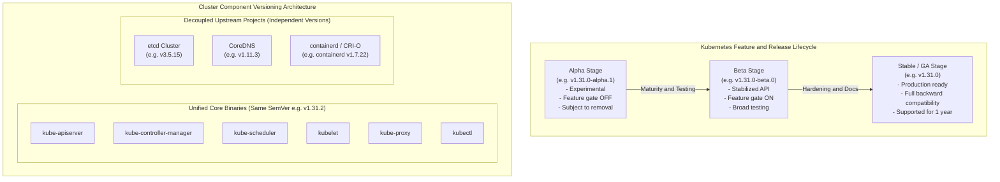
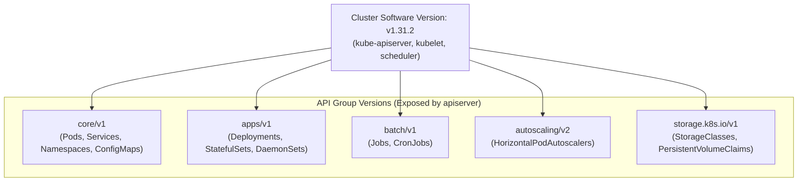
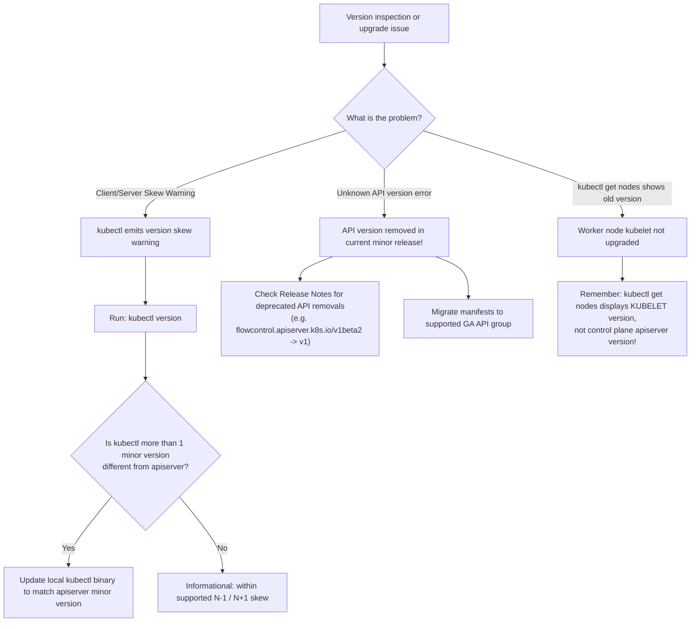

# Kubernetes Releases & Versioning - CKA Exam Notes

> **Exam Domain**: Cluster Architecture, Installation & Configuration (25%) / Cluster Maintenance  
> **Weight / Importance**: High (Foundational cluster lifecycle knowledge testing Semantic Versioning, release cadences, Alpha/Beta/GA progression, unified control plane packages, and decoupled dependency lifecycles)  
> **Target Version**: Verified against v1.31 / v1.32 (Current CKA Curriculum)  
> **Allowed Docs Search Keywords**: `Kubernetes Releases`, `Version Skew Policy`, `Semantic Versioning`, `kubectl version`, `Release Notes`  
> **Source**: Generated from `cluster-maintainance/02-kubernetes-releases-raw.md`

---

## 1. Quick-Reference Summary

- **Semantic Versioning Structure**:
  - Kubernetes releases follow Semantic Versioning (`vMAJOR.MINOR.PATCH`, e.g. `v1.31.2`).
  - **`MAJOR`** (`1`): Incremented for breaking API changes across the platform (remains `v1` for ecosystem stability).
  - **`MINOR`** (`31`): Released **3 times per year** (~every 4 months). Delivers new features, promotes APIs (Alpha $\to$ Beta $\to$ GA), and deprecates older APIs.
  - **`PATCH`** (`2`): Released roughly monthly or as needed. Contains critical bug and security vulnerability (CVE) fixes; introduces no new features.
- **Release Maturity Progression**:
  - **Alpha** (`v1.31.0-alpha.1`): Experimental, feature gates disabled by default, subject to breaking changes or removal.
  - **Beta** (`v1.31.0-beta.0`): Well-tested code, feature gates enabled by default, API schema stabilized.
  - **Stable / GA** (`v1.31.0`): Production ready, strict backward compatibility guarantees, feature gate locked on or graduated.
- **Unified Control Plane vs. Decoupled Dependencies**:
  - **Core Binaries**: `kube-apiserver`, `kube-controller-manager`, `kube-scheduler`, `kubelet`, `kube-proxy`, and `kubectl` are compiled from the core Kubernetes repository and share the exact same version string.
  - **External Dependencies**: Distributed as separate upstream open-source projects with independent versioning schemas:
    - **`etcd`**: CNCF project (e.g. `v3.5.15`).
    - **`CoreDNS`**: CNCF project (e.g. `v1.11.3`).
    - **Container Runtime (CRI)**: `containerd` (`v1.7.x` / `v2.0.x`) or `CRI-O` (`v1.31.x`).
- **Official Support Window**:
  - The Kubernetes project maintains the **three most recent minor versions** (e.g. `v1.31`, `v1.30`, and `v1.29`). Each minor release receives security patch support for approximately **one year**.
- **Crucial CLI Fact**:
  - `kubectl get nodes` displays the **Kubelet version** on each worker node, **not** the control plane `kube-apiserver` version!

---

## 2. Conceptual Overview & Mental Model

### Dual-Layer Architectural Understanding

- **Simple English Explanation (How It Works)**:
  - Operating an enterprise Kubernetes cluster requires clarity on how its software evolves.
  - Kubernetes follows **Semantic Versioning** (`vX.Y.Z`).
  - When you download the core Kubernetes server release archive (`kubernetes-server-linux-amd64.tar.gz`), it contains compiled Linux binaries for all primary components (`kube-apiserver`, `kube-controller-manager`, `kube-scheduler`, `kubelet`, `kube-proxy`, `kubectl`), all sharing an identical version number.
  - However, a complete cluster requires external dependencies that do not share the Kubernetes version number.
  - The distributed database (**etcd**) and cluster DNS server (**CoreDNS**) are independent projects developed under the CNCF. Each Kubernetes minor release specifies a tested, validated compatibility matrix defining which versions of etcd, CoreDNS, and container runtimes (containerd/CRI-O) are supported.
  - Software development flows from **Alpha** (experimental, off by default) to **Beta** (stabilized, on by default) to **GA** (production standard).

- **Formal Kubernetes Definition**:
  - Kubernetes versions are expressed as `x.y.z`, where `x` is the major version, `y` is the minor version, and `z` is the patch version, following Semantic Versioning (SemVer 2.0.0). The Kubernetes release cycle delivers three minor releases per year, providing a predictable schedule for feature graduation and API lifecycle management while decoupled cluster add-ons adhere to separate project compatibility matrices.



---

## 3. Deep-Dive Technical Breakdown

### 3.1 Semantic Versioning (SemVer) Anatomy

Every official release tag is formatted according to SemVer 2.0.0:

$$\mathbf{v}\underbrace{\mathbf{1}}_{\text{MAJOR}}.\underbrace{\mathbf{31}}_{\text{MINOR}}.\underbrace{\mathbf{2}}_{\text{PATCH}}$$

| Version Segment | Release Cadence | Scope & Purpose | Breaking Changes Permitted? |
| :--- | :--- | :--- | :--- |
| **`MAJOR` (`1`)** | Multi-year milestone | Fundamental architectural paradigm shifts; breaking changes across existing stable API contracts. | Yes (Guaranteed stable on `v1` to date). |
| **`MINOR` (`31`)** | **3 times per year** (April, August, December) | New features, feature gate promotions, performance optimizations, deprecation of old APIs. | **No breaking changes to GA APIs**; deprecated APIs removed only after grace period. |
| **`PATCH` (`2`)** | Monthly / As needed | Critical security CVE patches, memory leak fixes, bug remediation; strictly zero feature additions. | **Strictly No**. Must be 100% backward-compatible. |
| **Pre-Release Tag** | Pre-release build | Suffix indicating testing status: `-alpha.X`, `-beta.X`, `-rc.X` (Release Candidate). | Expected to change between iterations. |

---

### 3.2 Feature Lifecycle: Alpha vs. Beta vs. GA

Kubernetes gates new capabilities behind **Feature Gates** (`--feature-gates=FeatureName=true/false`):

| Characteristic | Alpha | Beta | General Availability (GA) / Stable |
| :--- | :--- | :--- | :--- |
| **Default State** | **Disabled** (`false`) | **Enabled** (`true`) | **Enabled** (cannot be disabled in later releases) |
| **API Version** | `v1alpha1`, `v1alpha2` | `v1beta1`, `v1beta2` | `v1`, `v2` |
| **Stability Level** | Early iteration; may contain bugs; zero support guarantee. | Code is well-tested; reliable for non-critical workloads. | Production-grade; highly tested; robust upgrade path. |
| **Deprecation Guarantee** | Can be dropped in any subsequent minor release without warning. | Maintained for at least **3 minor releases** after deprecation before removal. | Maintained for at least **12 months or 3 minor releases** (whichever is longer). |
| **Recommended Usage** | Test clusters / sandboxes only. | Staging / Pre-production testing. | **Production clusters**. |

---

### 3.3 Core Packaging & Decoupled Dependencies

#### The Core Kubernetes Archive
When downloading Kubernetes directly from upstream releases (`dl.k8s.io`):
- Package: `kubernetes-server-linux-amd64.tar.gz`
- Extraction reveals compiled Linux executables for all core components:
  - `kube-apiserver`
  - `kube-controller-manager`
  - `kube-scheduler`
  - `kubelet`
  - `kube-proxy`
  - `kubectl`
- All executables extracted from this package share the identical compile-time SemVer string.

> [!NOTE]
> **Clarification of Raw Note Typo**:
> The raw note referred to downloading `Kubernetes.tar dot js`. This was a phonetic transcription error for `kubernetes-server-linux-amd64.tar.gz` (the standard compressed tar archive containing official ELF binary executables).

#### Decoupled Dependency Compatibility Matrix
Certain essential cluster services are developed outside the primary `kubernetes/kubernetes` repository:

| Dependency Component | Independent Project Origin | Function in Cluster | Versioning Model | Example Supported Version (for K8s v1.31) |
| :--- | :--- | :--- | :--- | :--- |
| **`etcd`** | [etcd.io](https://etcd.io) (CNCF Graduated) | Distributed key-value datastore preserving cluster state. | Independent SemVer (`v3.5.x`) | `v3.5.15` |
| **`CoreDNS`** | [coredns.io](https://coredns.io) (CNCF Graduated) | In-cluster service discovery and internal DNS resolution. | Independent SemVer (`v1.11.x`) | `v1.11.3` |
| **`containerd`** | [containerd.io](https://containerd.io) (CNCF Graduated) | Container runtime implementing the CRI gRPC interface. | Independent SemVer (`v1.7.x` / `v2.0.x`) | `v1.7.22` |
| **`CRI-O`** | [cri-o.io](https://cri-o.io) (CNCF Graduated) | OCI-native container runtime dedicated to Kubernetes. | Synchronized with K8s minor versions | `v1.31.1` |

---

### 3.4 API Versioning vs. Software Release Versioning

A frequent point of confusion in CKA preparation is distinguishing between the **cluster software release** and the **API resource version**:



- A cluster running Kubernetes version `v1.31.2` exposes multiple API versions concurrently.
- APIs graduate along their own track:
  - `autoscaling/v1` $\to$ `autoscaling/v2beta1` $\to$ `autoscaling/v2beta2` $\to$ `autoscaling/v2` (GA).
- Even though the software binary moved from `v1.22` to `v1.31`, stable API resources like `core/v1` (Pods) remain on `v1`.

---

## 4. Command Translation & Mapping Tables

### Version Inspection Commands Reference

| Inspection Goal | Command Syntax | Output Information |
| :--- | :--- | :--- |
| **Full Version (Client and Server)** | `kubectl version` | GitVersion, Major, Minor, Platform, BuildDate for both client and apiserver. |
| **Client Version Only** | `kubectl version --client` | Version of local `kubectl` binary without contacting cluster. |
| **JSON Formatted Version** | `kubectl version -o json` | Parseable JSON structure containing exact commit hashes. |
| **Node Kubelet Versions** | `kubectl get nodes -o wide` | Node status, Kubelet version, Kernel version, Container runtime version. |
| **Control Plane Manifest Versions** | `grep image: /etc/kubernetes/manifests/*.yaml` | Exact container image tags running `apiserver`, `controller-manager`, `scheduler`, and `etcd`. |

---

## 5. High-Yield CLI & Imperative Commands

### 5.1 Inspecting Component Versions

```bash
# 1. Check client and server version details
kubectl version

# 2. Extract only the server GitVersion using jsonpath
kubectl version -o jsonpath='{.serverVersion.gitVersion}'

# 3. View all cluster nodes along with their Kubelet and Container Runtime versions
kubectl get nodes -o wide

# 4. Inspect control plane static pod image versions on a master node
sudo grep -h "image:" /etc/kubernetes/manifests/*.yaml

# Expected output on a v1.31.1 kubeadm cluster:
# image: registry.k8s.io/kube-apiserver:v1.31.1
# image: registry.k8s.io/kube-controller-manager:v1.31.1
# image: registry.k8s.io/kube-scheduler:v1.31.1
# image: registry.k8s.io/etcd:3.5.15-0

# 5. Inspect CoreDNS deployment image version
kubectl get deployment coredns -n kube-system -o jsonpath='{.spec.template.spec.containers[0].image}'
```

---

### 5.2 Querying Available Upstream Package Versions

When planning cluster upgrades, administrators must check what versions are available in the distribution package repository:

```bash
# Ubuntu / Debian (APT):
apt-cache madison kubeadm | head -n 10
apt-cache madison kubelet | head -n 10

# RHEL / CentOS / Rocky (YUM / DNF):
yum list --showduplicates kubeadm --disableexcludes=kubernetes
```

---

## 6. Troubleshooting & Diagnostic Runbook

### Diagnostic Decision Tree



---

### Step-by-Step Triage Runbook

#### Symptom 1: `kubectl` Emits Version Skew Warning
1. **Command Output**:
   ```text
   WARNING: version difference between client (v1.28.0) and server (v1.31.1) exceeds the supported minor version skew (+/- 1)
   ```
2. **Diagnosis**:
   - The `kubectl` binary is supported within **1 minor version** of `kube-apiserver` ($N-1 \le \text{kubectl} \le N+1$).
   - A client at `v1.28` communicating with a server at `v1.31` has a skew of 3 minor versions, which can lead to command-line flag rejections or unparseable JSON payloads.
3. **Resolution**:
   - Upgrade the `kubectl` package on your management workstation to match the server minor version:
     ```bash
     sudo apt-get update && sudo apt-get install -y --allow-change-held-packages kubectl=1.31.1-1.1
     ```

---

#### Symptom 2: Manifest Fails with `no matches for kind ... in version`
1. **Diagnosis**:
   - An API resource previously in Beta (e.g. `autoscaling/v2beta1`) was deprecated and officially removed in the current minor release.
2. **Verification**:
   ```bash
   kubectl api-resources | grep <kind>
   ```
3. **Resolution**:
   - Update `apiVersion:` in the manifest to the graduated GA version (e.g. `autoscaling/v2`).

---

## 7. CKA Exam Tips, Gotchas & Traps

> [!WARNING]
> **Trap 1: `kubectl get nodes` Does NOT Show the Cluster Master Version**
> - In the CKA exam, running `kubectl get nodes` outputs:
>   ```text
>   NAME           STATUS   ROLES           AGE   VERSION
>   controlplane   Ready    control-plane   10d   v1.31.0
>   node01         Ready    <none>          10d   v1.30.0
>   ```
> - The `VERSION` column displays the version of the **`kubelet` daemon running on that specific node**.
> - While `controlplane` typically runs a Kubelet matching the master version, you **must run `kubectl version`** to verify the true `kube-apiserver` version!

> [!IMPORTANT]
> **Trap 2: etcd and CoreDNS Version Independence**
> - Do not expect etcd or CoreDNS to report `v1.31`!
> - etcd follows `v3.x.x` (e.g. `3.5.15`).
> - CoreDNS follows `v1.x.x` (e.g. `1.11.3`).
> - If an exam question asks for the etcd version, inspect `/etc/kubernetes/manifests/etcd.yaml` or run `etcdctl version`.

> [!WARNING]
> **Trap 3: Never Skip Minor Versions During Cluster Upgrades**
> - Kubernetes does **not** support skipping minor releases (e.g. upgrading directly from `v1.29` to `v1.31`).
> - Upgrades must proceed step-by-step: `v1.29` $\to$ `v1.30` $\to$ `v1.31`.
> - Skipping a minor version will cause `kubeadm` to reject the upgrade plan.

---

## 8. Self-Test / Active Recall

1. **What do the three segments in Kubernetes version `v1.31.2` represent?**
   <details><summary>Click to view answer</summary>
   <b>1</b> = Major version (breaking architectural changes), <b>31</b> = Minor version (new features and API graduations, released 3x/year), <b>2</b> = Patch version (bug and security CVE fixes).
   </details>

2. **How often are Kubernetes minor versions released?**
   <details><summary>Click to view answer</summary>
   <b>Three times per year</b> (approximately every 4 months: April, August, December).
   </details>

3. **What is the difference in feature gate status between an Alpha feature and a Beta feature?**
   <details><summary>Click to view answer</summary>
   Alpha features have their feature gates <b>disabled by default</b> and are experimental. Beta features are well-tested and have their feature gates <b>enabled by default</b>.
   </details>

4. **Which control plane components share the same version string as `kube-apiserver`?**
   <details><summary>Click to view answer</summary>
   <code>kube-controller-manager</code>, <code>kube-scheduler</code>, <code>kubelet</code>, <code>kube-proxy</code>, and <code>kubectl</code>.
   </details>

5. **Do `etcd` and `CoreDNS` share the Kubernetes SemVer version number? Why or why not?**
   <details><summary>Click to view answer</summary>
   <b>No.</b> Both etcd and CoreDNS are independent open-source projects under the CNCF with their own distinct versioning schemas, release lifecycles, and repositories.
   </details>

6. **What does the `VERSION` column in `kubectl get nodes` represent?**
   <details><summary>Click to view answer</summary>
   It represents the version of the <b><code>kubelet</code></b> process running on that specific node, not the version of <code>kube-apiserver</code>.
   </details>

7. **How many minor versions of Kubernetes are officially supported with security patches simultaneously?**
   <details><summary>Click to view answer</summary>
   The <b>three most recent minor versions</b> (e.g. v1.31, v1.30, and v1.29), providing approximately 1 year of support for each minor release.
   </details>

8. **Can you upgrade a Kubernetes cluster directly from `v1.29.0` to `v1.31.0` in a single step using `kubeadm`?**
   <details><summary>Click to view answer</summary>
   <b>No.</b> Upgrades cannot skip minor versions. You must upgrade sequentially from <code>v1.29.x</code> to <code>v1.30.x</code>, and then from <code>v1.30.x</code> to <code>v1.31.x</code>.
   </details>

9. **What command outputs only the server version in JSON format?**
   <details><summary>Click to view answer</summary>
   <code>kubectl version -o json</code> (or extract specifically via <code>kubectl version -o jsonpath='{.serverVersion.gitVersion}'</code>).
   </details>

10. **Where can an administrator inspect the exact image tags of control plane components on a static pod kubeadm master?**
    <details><summary>Click to view answer</summary>
    Inside the manifest files in <b><code>/etc/kubernetes/manifests/</code></b> (specifically <code>kube-apiserver.yaml</code>, <code>kube-controller-manager.yaml</code>, <code>kube-scheduler.yaml</code>, and <code>etcd.yaml</code>).
    </details>

---

## 9. Official Documentation Bookmarks

| Page Title | Search Queries | Target Section / Direct URI Anchor |
| :--- | :--- | :--- |
| **Kubernetes Release Cycle** | `Kubernetes Release Cycle` | [Release Cadence](https://kubernetes.io/releases/) |
| **Kubernetes Version and Version-Skew Support Policy** | `version skew policy kubernetes` | [Supported version skew](https://kubernetes.io/releases/version-skew-policy/) |
| **Feature Gates** | `Feature Gates Kubernetes` | [Feature stages](https://kubernetes.io/docs/reference/command-line-tools-reference/feature-gates/) |
| **Kubernetes API Concepts** | `Kubernetes API overview` | [API Versioning](https://kubernetes.io/docs/concepts/overview/kubernetes-api/) |
