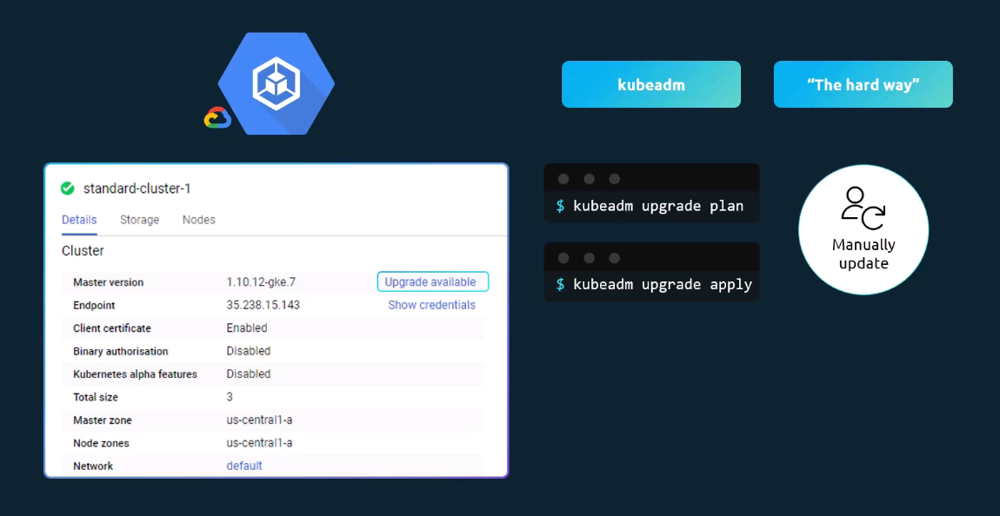
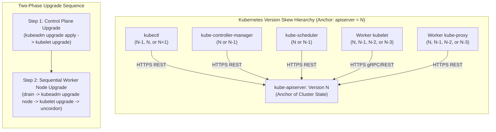
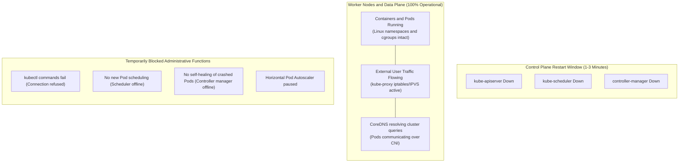
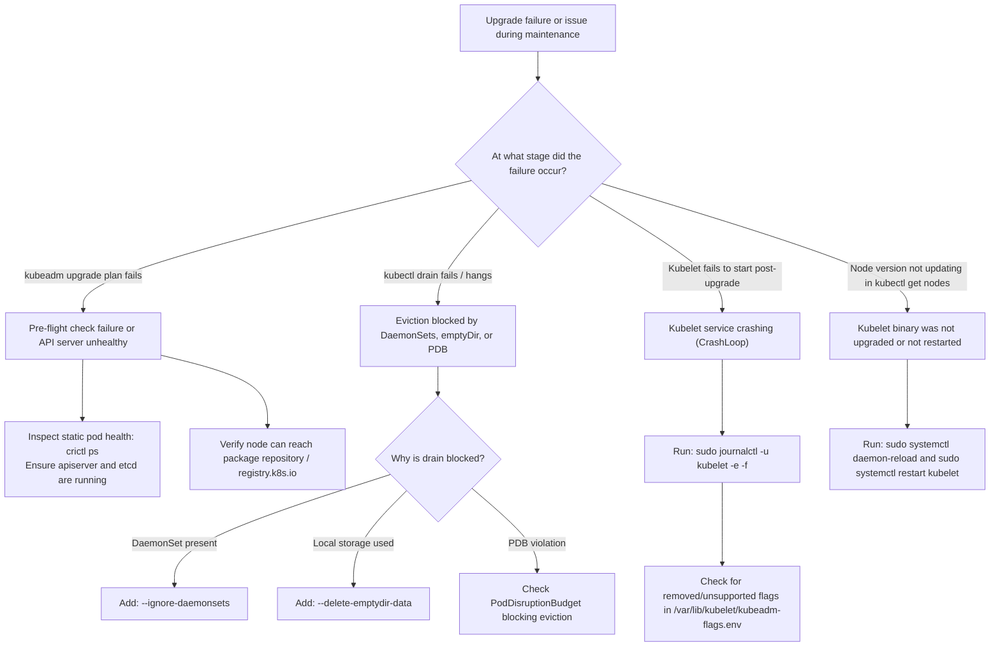

# Cluster Upgrade Architecture & Process - CKA Exam Notes

> **Exam Domain**: Cluster Architecture, Installation & Configuration (25%) / Cluster Maintenance  
> **Weight / Importance**: Critical (Top-tier hands-on CKA exam topic testing the official Version Skew Policy, control plane vs. worker node upgrade sequencing, `kubeadm upgrade plan/apply`, node drainage, and zero-downtime maintenance)  
> **Target Version**: Verified against v1.31 / v1.32 (Current CKA Curriculum)  
> **Allowed Docs Search Keywords**: `Upgrading kubeadm clusters`, `version skew policy`, `kubeadm upgrade plan`, `kubeadm upgrade apply`, `kubectl drain`  
> **Source**: Generated from `cluster-maintainance/03-cluster-upgrade-introduction-raw.md`

---

## 1. Quick-Reference Summary

- **The Official Kubernetes Version Skew Policy**:
  - **`kube-apiserver`** is the central architectural anchor (version $N$).
  - **`kube-controller-manager` & `kube-scheduler`**: Can be at version $N$ or $N-1$ (up to **1 minor version older** than apiserver). Can **never** be newer than apiserver.
  - **`kubelet` & `kube-proxy`**: Can be at version $N, N-1, N-2,$ or $N-3$ (up to **3 minor versions older** than apiserver; expanded from $N-2$ to $N-3$ in v1.28+). Can **never** be newer than apiserver.
  - **`kubectl`**: Supported within **1 minor version** of apiserver ($N-1 \le \text{kubectl} \le N+1$).
  - **HA Control Plane Skew**: Multiple `kube-apiserver` instances can skew by up to 1 minor version ($N$ and $N-1$).
- **Strict Sequential Minor Upgrades**:
  - Kubernetes and `kubeadm` **do not support skipping minor versions**. You must upgrade step-by-step (e.g. `v1.29` $\to$ `v1.30` $\to$ `v1.31`).
- **Two-Phase Upgrade Sequence**:
  1. **Phase 1: Upgrade Control Plane**: Upgrade `kubeadm` $\to$ run `kubeadm upgrade apply` $\to$ upgrade `kubelet` and `kubectl` $\to$ restart `kubelet`.
  2. **Phase 2: Upgrade Worker Nodes**: Drain node $\to$ upgrade `kubeadm` $\to$ run `kubeadm upgrade node` $\to$ upgrade `kubelet` and `kubectl` $\to$ restart `kubelet` $\to$ uncordon node.
- **Impact of Control Plane Downtime**:
  - **Data Plane Unaffected**: Existing Pods running on worker nodes continue serving traffic normally. Network routing via `kube-proxy` and DNS via `CoreDNS` remain operational.
  - **Management Plane Temporarily Paused**: `kubectl` commands fail, new Pod creation or scaling is blocked, and failed Pods will not be auto-rescheduled until the control plane restarts.
- **Kubeadm Scope Boundary**:
  - `kubeadm upgrade` updates static pod manifests, control plane certificates, CoreDNS, and kube-proxy. It **does NOT install or upgrade the `kubelet` or `kubectl` packages**. You must upgrade those via your OS package manager (`apt` / `yum`).

---

## 2. Conceptual Overview & Mental Model

### Dual-Layer Architectural Understanding

- **Simple English Explanation (How It Works)**:
  - Every component in a Kubernetes cluster communicates exclusively with `kube-apiserver`.
  - Because `kube-apiserver` is updated first, it understands both the newest API specifications and older, legacy API calls transmitted by older worker nodes.
  - If a worker node's `kubelet` were upgraded to a version *newer* than the API server, it would attempt to call endpoints or send fields that the older API server has no knowledge of, leading to cluster instability.
  - Therefore, the control plane is always upgraded first, followed by worker nodes.
  - During the few minutes that control plane components (`kube-apiserver`, `kube-scheduler`, `kube-controller-manager`) restart:
    - Worker nodes keep running existing container workloads in their isolated Linux cgroups and network namespaces.
    - User traffic continues flowing without disruption.
    - Only administrative operations (deploying new apps, modifying replica counts, or querying status via `kubectl`) are temporarily paused.
  - Worker nodes are upgraded sequentially one at a time: workloads are safely evicted to other nodes (`kubectl drain`), the node's software is upgraded, and the node is returned to active service (`kubectl uncordon`).



- **Formal Kubernetes Definition**:
  - Cluster upgrade is the process of safely transitioning Kubernetes control plane components, node daemons, and system add-ons to a newer minor or patch version while respecting component version skew constraints. The upgrade lifecycle decouples control plane management from data-plane packet forwarding, allowing rolling zero-downtime maintenance when paired with graceful node eviction via the eviction API and PodDisruptionBudgets.



---

## 3. Deep-Dive Technical Breakdown

### 3.1 Comprehensive Version Skew Reference Matrix

Assuming `kube-apiserver` is running at version **`v1.31`**:

| Component | Allowed Version Range relative to apiserver ($N$) | Valid Versions (if apiserver = 1.31) | Invalid / Prohibited Versions | Key Rule / Rationale |
| :--- | :--- | :--- | :--- | :--- |
| **`kube-apiserver` (HA)** | $N$ or $N-1$ | `1.31`, `1.30` | `1.32`, `1.29` | During rolling control plane upgrades, master instances can differ by at most 1 minor version. |
| **`kube-controller-manager`** | $N$ or $N-1$ | `1.31`, `1.30` | `1.32`, `1.29` | Must not exceed apiserver; can lag by 1 minor version. |
| **`kube-scheduler`** | $N$ or $N-1$ | `1.31`, `1.30` | `1.32`, `1.29` | Must not exceed apiserver; can lag by 1 minor version. |
| **`kubelet`** | $N, N-1, N-2, N-3$ | `1.31`, `1.30`, `1.29`, `1.28` | `1.32`, `1.27` | Expanded to **$N-3$** in v1.28+. Kubelet must **NEVER** be newer than apiserver! |
| **`kube-proxy`** | $N, N-1, N-2, N-3$ | `1.31`, `1.30`, `1.29`, `1.28` | `1.32`, `1.27` | Matches Kubelet skew policy. |
| **`kubectl`** | $N+1, N, N-1$ | `1.32`, `1.31`, `1.30` | `1.33`, `1.29` | Client CLI supports 1 minor version ahead or behind apiserver. |

---

### 3.2 What Happens During Control Plane Upgrade Downtime

When `kubeadm upgrade apply` updates control plane static pod manifests, the control plane components restart:



- **Data Plane (Workloads)**:
  - Worker node processes run uninterrupted under `containerd` / Linux kernel management.
  - Node network packet filtering (`iptables` / `IPVS`) continues routing Service traffic.
  - End users browsing the application experience **zero downtime**.
- **Management Plane**:
  - `kubectl` commands return `connection refused`.
  - Workload controllers cannot reconcile desired state. If a Pod crashes during this 2-minute window, a replacement will not be scheduled until `kube-controller-manager` boots up.

---

### 3.3 Worker Node Upgrade Strategies

When moving from control plane upgrades to worker node upgrades, operators choose among three strategies:

| Strategy | Operational Workflow | Application Impact | Best Suited For |
| :--- | :--- | :--- | :--- |
| **1. Upgrade All at Once** | Shut down all nodes, upgrade packages, reboot simultaneously. | **Severe Outage**. All applications taken offline. | Non-production testing clusters, batch maintenance windows. |
| **2. Rolling Upgrade (One Node at a Time)** | `kubectl drain` Node A $\to$ Upgrade Node A $\to$ `kubectl uncordon` Node A $\to$ Repeat for Node B. | **Zero User Downtime**. Pods migrate gracefully to available nodes. | **Production enterprise standard (Tested on CKA!)**. |
| **3. Ephemeral Node Replacement** | Provision new worker nodes on newer version, join cluster, drain and decommission old nodes. | **Zero User Downtime**. Fast and clean. | Public cloud environments (EKS, GKE, AKS, Cluster Autoscaler). |

---

### 3.4 Deep Dive: The `kubeadm upgrade` Execution Pipeline


#### 1. `kubeadm upgrade plan`
- **What it does**:
  1. Verifies that the cluster is healthy and all control plane static pods are running.
  2. Queries the external registry (`registry.k8s.io`) to discover the latest available minor and patch versions.
  3. Validates that the requested target version conforms to the sequential upgrade policy (cannot skip minor versions).
  4. Displays a detailed table showing current vs. target versions of `kube-apiserver`, `kube-controller-manager`, `kube-scheduler`, `kube-proxy`, `CoreDNS`, and `etcd`.
  5. Outputs the exact command needed to apply the upgrade (`kubeadm upgrade apply v1.31.x`).


#### 2. `kubeadm upgrade apply` (Executed on Master Node)
- **What it does**:
  1. Fetches pre-flight container images for the target version.
  2. Updates static pod manifests in `/etc/kubernetes/manifests/` (`kube-apiserver.yaml`, `kube-controller-manager.yaml`, `kube-scheduler.yaml`, `etcd.yaml`).
  3. Kubelet detects modified manifest files via inotify and restarts the control plane static pods with new image versions.
  4. Automatically renews control plane TLS certificates if they are expiring within 180 days.
  5. Upgrades cluster add-ons: updates the `kube-proxy` DaemonSet and `CoreDNS` Deployment.


#### 3. `kubeadm upgrade node` (Executed on Worker Nodes)
- **What it does**:
  1. Fetches the cluster configuration (`kubeadm-config` ConfigMap) from the upgraded control plane.
  2. Updates local node configuration files (such as `/var/lib/kubelet/config.yaml`).
  3. Prepares the node environment for the new `kubelet` binary.

---

## 4. Command Translation & Mapping Tables

### Master vs. Worker Node Upgrade Commands

| Phase / Responsibility | Primary Control Plane Node | Worker Node |
| :--- | :--- | :--- |
| **1. Upgrade `kubeadm` tool** | `apt-get install -y --allow-change-held-packages kubeadm=1.31.1-1.1` | `apt-get install -y --allow-change-held-packages kubeadm=1.31.1-1.1` |
| **2. Execute Upgrade Command** | `kubeadm upgrade apply v1.31.1 -y` | `kubeadm upgrade node` |
| **3. Evict Workloads** | `kubectl drain <cp-node> --ignore-daemonsets` | `kubectl drain <worker-node> --ignore-daemonsets --delete-emptydir-data` |
| **4. Upgrade Node Packages** | `apt-get install -y --allow-change-held-packages kubelet=1.31.1-1.1 kubectl=1.31.1-1.1` | `apt-get install -y --allow-change-held-packages kubelet=1.31.1-1.1` |
| **5. Restart Node Daemon** | `systemctl daemon-reload && systemctl restart kubelet` | `systemctl daemon-reload && systemctl restart kubelet` |
| **6. Restore Scheduling** | `kubectl uncordon <cp-node>` | `kubectl uncordon <worker-node>` |

---

## 5. High-Yield CLI & Imperative Commands

### 5.1 Complete Step-by-Step Control Plane Upgrade Workflow

Execute on the **Control Plane Node**:

```bash
# -------------------------------------------------------------
# STEP 1: Upgrade the kubeadm utility
# -------------------------------------------------------------
sudo apt-mark unhold kubeadm
sudo apt-get update && sudo apt-get install -y --allow-change-held-packages kubeadm=1.31.1-1.1
sudo apt-mark hold kubeadm

# Verify kubeadm version
kubeadm version

# -------------------------------------------------------------
# STEP 2: Plan and execute control plane upgrade
# -------------------------------------------------------------
sudo kubeadm upgrade plan
sudo kubeadm upgrade apply v1.31.1 -y

# -------------------------------------------------------------
# STEP 3: Drain control plane node (if hosting user workloads or to upgrade kubelet)
# -------------------------------------------------------------
kubectl drain controlplane --ignore-daemonsets

# -------------------------------------------------------------
# STEP 4: Upgrade kubelet and kubectl on control plane
# -------------------------------------------------------------
sudo apt-mark unhold kubelet kubectl
sudo apt-get install -y --allow-change-held-packages kubelet=1.31.1-1.1 kubectl=1.31.1-1.1
sudo apt-mark hold kubelet kubectl

# -------------------------------------------------------------
# STEP 5: Restart Kubelet daemon
# -------------------------------------------------------------
sudo systemctl daemon-reload
sudo systemctl restart kubelet

# -------------------------------------------------------------
# STEP 6: Uncordon control plane node
# -------------------------------------------------------------
kubectl uncordon controlplane

# Verify node status
kubectl get nodes
```

---

### 5.2 Complete Step-by-Step Worker Node Upgrade Workflow

Repeat sequentially for each **Worker Node** (`node01`, `node02`...):

```bash
# -------------------------------------------------------------
# STEP 1: (From Control Plane) Drain the target worker node
# -------------------------------------------------------------
kubectl drain node01 --ignore-daemonsets --delete-emptydir-data --force

# -------------------------------------------------------------
# STEP 2: (SSH into node01) Upgrade kubeadm on worker node
# -------------------------------------------------------------
sudo apt-mark unhold kubeadm
sudo apt-get update && sudo apt-get install -y --allow-change-held-packages kubeadm=1.31.1-1.1
sudo apt-mark hold kubeadm

# -------------------------------------------------------------
# STEP 3: (On node01) Upgrade local node configuration
# -------------------------------------------------------------
sudo kubeadm upgrade node

# -------------------------------------------------------------
# STEP 4: (On node01) Upgrade kubelet and kubectl packages
# -------------------------------------------------------------
sudo apt-mark unhold kubelet kubectl
sudo apt-get install -y --allow-change-held-packages kubelet=1.31.1-1.1 kubectl=1.31.1-1.1
sudo apt-mark hold kubelet kubectl

# -------------------------------------------------------------
# STEP 5: (On node01) Restart Kubelet
# -------------------------------------------------------------
sudo systemctl daemon-reload
sudo systemctl restart kubelet

# -------------------------------------------------------------
# STEP 6: (From Control Plane) Uncordon the upgraded worker node
# -------------------------------------------------------------
kubectl uncordon node01

# Verify all nodes are Healthy and reporting target version
kubectl get nodes -o wide
```

---

## 6. Troubleshooting & Diagnostic Runbook

### Diagnostic Decision Tree



---

### Step-by-Step Triage Runbook

#### Symptom 1: `kubectl drain` Fails with `Cannot delete Pods with local storage`
1. **Error Output**:
   ```text
   error: cannot delete Pods with local storage (use --delete-emptydir-data to override): default/redis-cache
   ```
2. **Diagnosis**:
   - The Pod mounts an ephemeral `emptyDir` volume. Draining the node will permanently discard that temporary in-memory/scratch disk data.
3. **Resolution**:
   - Re-run drain specifying `--delete-emptydir-data`:
     ```bash
     kubectl drain <node-name> --ignore-daemonsets --delete-emptydir-data
     ```

---

#### Symptom 2: `kubeadm upgrade plan` Rejects Target Version
1. **Error Output**:
   ```text
   [upgrade/version] Can not upgrade from 1.28.2 to 1.30.0: version skip not supported
   ```
2. **Diagnosis**:
   - Operator attempted to skip minor version `v1.29`.
3. **Resolution**:
   - Upgrade to `v1.29` first, complete all worker nodes, and then plan the upgrade to `v1.30`.

---

#### Symptom 3: Node Shows `SchedulingDisabled` After Upgrade
1. **Diagnosis**:
   - The node was drained before the upgrade, which automatically applied a cordon. The operator forgot to execute `uncordon`.
2. **Resolution**:
   ```bash
   kubectl uncordon <node-name>
   ```

---

## 7. CKA Exam Tips, Gotchas & Traps

> [!WARNING]
> **Trap 1: The APT Package Hold Trap**
> - In Debian/Ubuntu clusters, Kubernetes packages are protected against accidental upgrades via `apt-mark hold`.
> - If you simply run `apt-get install kubeadm=...`, APT will silently **refuse to upgrade** the held package!
> - You **must** either unhold the package first or pass `--allow-change-held-packages`:
>   ```bash
>   sudo apt-get install -y --allow-change-held-packages kubeadm=1.31.1-1.1
>   ```
> - Remember to re-hold them afterwards: `sudo apt-mark hold kubeadm kubelet kubectl`.

> [!IMPORTANT]
> **Trap 2: `kubeadm upgrade apply` vs. `kubeadm upgrade node`**
> - On the **first Control Plane node**: Run `sudo kubeadm upgrade apply vX.Y.Z`.
> - On **Worker nodes** (and secondary control plane nodes): Run `sudo kubeadm upgrade node`.
> - Running `kubeadm upgrade apply` on a worker node will fail!

> [!WARNING]
> **Trap 3: Draining the Wrong Node**
> - When upgrading worker node `node01`, run `kubectl drain node01` **from the control plane node** (or management workstation), **not** on `node01` itself (unless `kubectl` is configured with credentials on that node).
> - Never forget `--ignore-daemonsets`! Without it, `drain` will fail on nearly every Kubernetes cluster due to `kube-proxy` or CNI daemonsets.

> [!TIP]
> **Exam Speed Tip: Essential Drain Command Flags**
> Memorize the standard non-blocking drain command string:
> ```bash
> kubectl drain <node-name> --ignore-daemonsets --delete-emptydir-data --force
> ```
> This prevents 99% of drain failures during timed exam tasks.

---

## 8. Self-Test / Active Recall

1. **If `kube-apiserver` is running version `v1.31.0`, what is the oldest supported version for a worker node's `kubelet`?**
   <details><summary>Click to view answer</summary>
   <b>v1.28.0</b> (Kubelet can be up to <b>3 minor versions older</b> than apiserver: \(N-3\), expanded in Kubernetes v1.28+).
   </details>

2. **Can a worker node's `kubelet` run version `v1.32.0` if `kube-apiserver` is on `v1.31.0`?**
   <details><summary>Click to view answer</summary>
   <b>No.</b> Under the Kubernetes Version Skew Policy, Kubelet can <b>never be newer</b> than <code>kube-apiserver</code>.
   </details>

3. **What is the difference between `kubeadm upgrade apply` and `kubeadm upgrade node`?**
   <details><summary>Click to view answer</summary>
   <code>kubeadm upgrade apply</code> is executed on the <b>primary control plane node</b> to upgrade static control plane manifests, certificates, and cluster add-ons. <code>kubeadm upgrade node</code> is executed on <b>worker nodes</b> (and additional control plane nodes) to update local node configurations.
   </details>

4. **Does `kubeadm upgrade apply` upgrade the `kubelet` daemon?**
   <details><summary>Click to view answer</summary>
   <b>No.</b> <code>kubeadm</code> manages control plane static pods, certificates, and cluster add-ons, but does <b>not</b> manage OS packages or systemd services. You must manually upgrade the <code>kubelet</code> package via <code>apt</code> or <code>yum</code> and restart the service.
   </details>

5. **What happens to user workloads running on worker nodes when the master node is being upgraded?**
   <details><summary>Click to view answer</summary>
   Workloads <b>continue running and serving user traffic normally</b>. The Linux container runtimes and local network routing (kube-proxy) remain active. Only control plane management functions (e.g. <code>kubectl</code> commands, auto-healing, new pod scheduling) are temporarily paused.
   </details>

6. **What two flags are typically required when draining a worker node that hosts DaemonSets and local scratch storage?**
   <details><summary>Click to view answer</summary>
   <b><code>--ignore-daemonsets</code></b> and <b><code>--delete-emptydir-data</code></b>.
   </details>

7. **Can you upgrade a cluster directly from version `v1.28` to `v1.30` using `kubeadm`?**
   <details><summary>Click to view answer</summary>
   <b>No.</b> Kubernetes does not support skipping minor versions. You must sequentially upgrade from <code>v1.28</code> to <code>v1.29</code>, and then from <code>v1.29</code> to <code>v1.30</code>.
   </details>

8. **How does `kubectl drain` differ from `kubectl cordon`?**
   <details><summary>Click to view answer</summary>
   <code>kubectl cordon</code> only marks the node as unschedulable (preventing new pods from being scheduled). <code>kubectl drain</code> marks the node as unschedulable <b>AND</b> evicts all existing running pods to other available worker nodes.
   </details>

9. **What command is used to return a drained, upgraded node back to an active schedulable state?**
   <details><summary>Click to view answer</summary>
   <code>kubectl uncordon &lt;node-name&gt;</code>
   </details>

10. **Why must `kubeadm` be upgraded before running `kubeadm upgrade apply`?**
    <details><summary>Click to view answer</summary>
    The <code>kubeadm</code> binary contains the upgrade logic, pre-flight checks, and target version definitions. The CLI tool version must match the target cluster version before it can orchestrate the upgrade.
    </details>

---

## 9. Official Documentation Bookmarks

| Page Title | Search Queries | Target Section / Direct URI Anchor |
| :--- | :--- | :--- |
| **Upgrading kubeadm clusters** | `Upgrading kubeadm clusters` | [Upgrade the control plane](https://kubernetes.io/docs/tasks/administer-cluster/kubeadm/kubeadm-upgrade/) |
| **Version Skew Policy** | `version skew policy kubernetes` | [Supported version skew](https://kubernetes.io/releases/version-skew-policy/) |
| **Safely Drain a Node** | `Safely Drain a Node while Respecting PodDisruptionBudget` | [Drain a Node](https://kubernetes.io/docs/tasks/administer-cluster/safely-drain-node/) |
| **kubeadm upgrade** | `kubeadm upgrade` | [kubeadm upgrade CLI Reference](https://kubernetes.io/docs/reference/setup-tools/kubeadm/kubeadm-upgrade/) |
