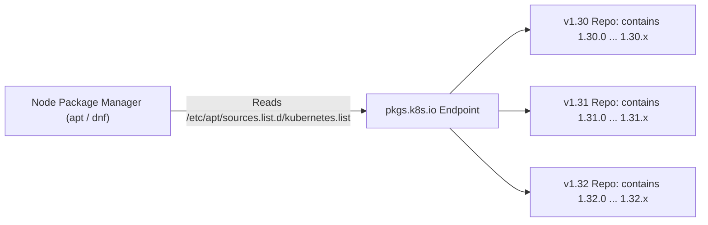
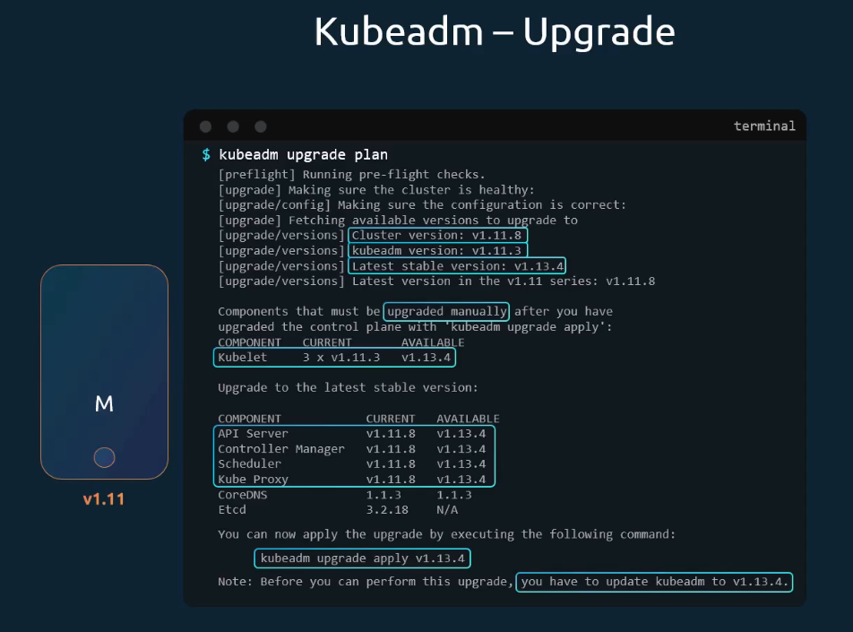
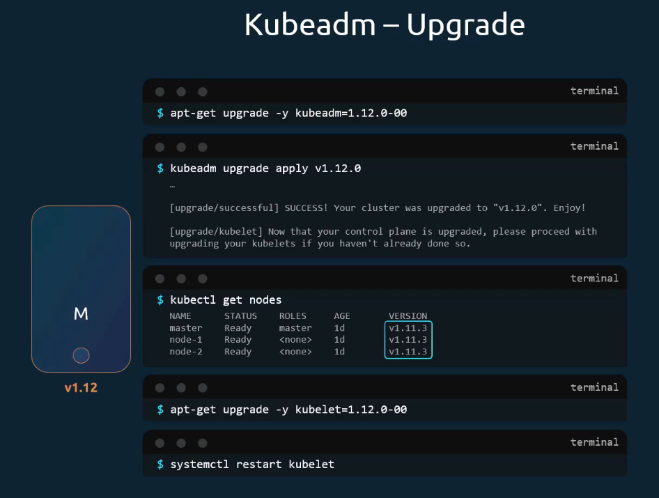
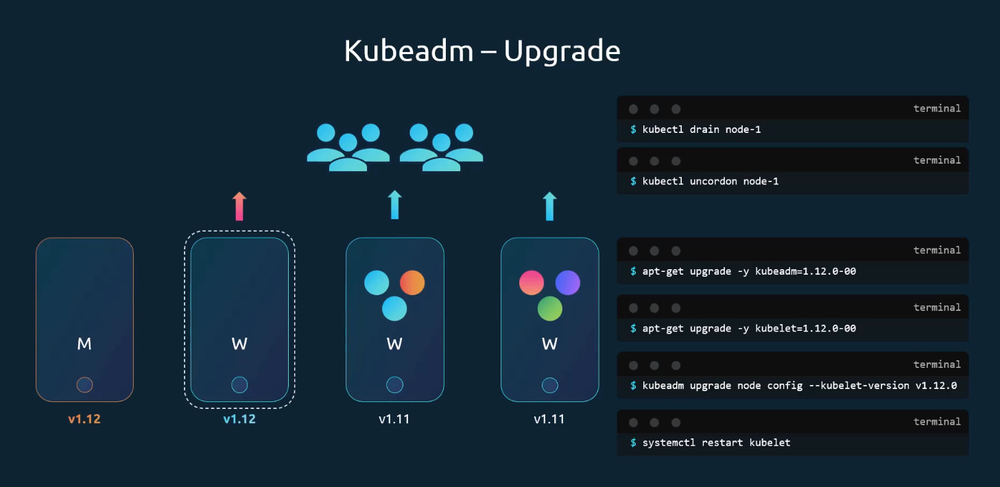
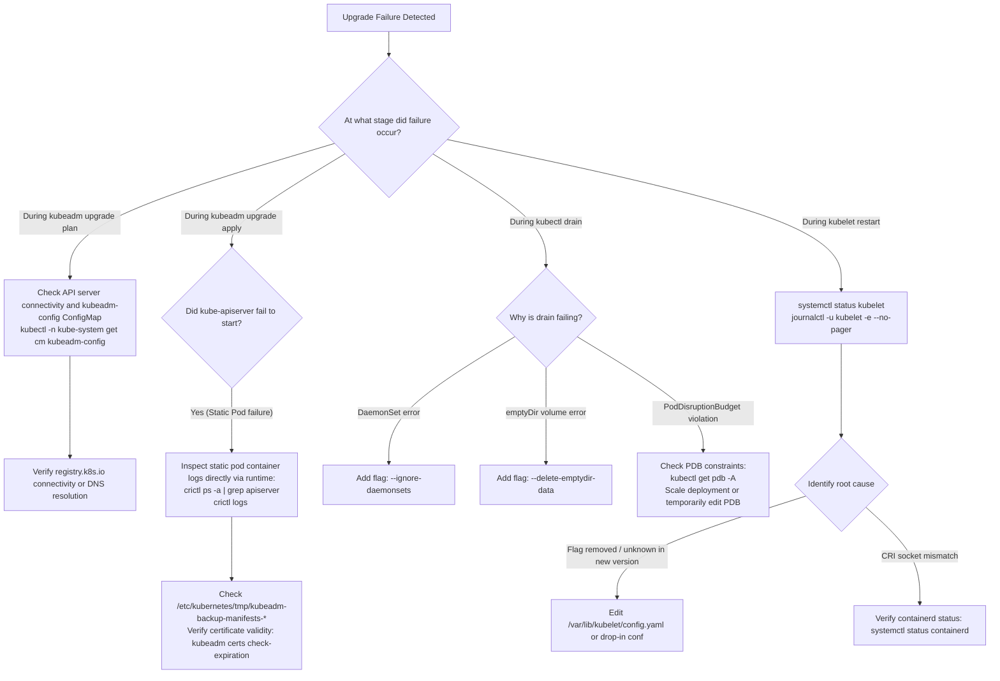

# Live Cluster Upgrade Walkthrough (kubeadm) - CKA Exam Notes

> **Exam Domain**: Cluster Architecture, Installation & Configuration (25%) / Cluster Maintenance  
> **Weight / Importance**: Critical (Core hands-on CKA exam scenario: updating package repositories, performing control-plane upgrades, executing worker node maintenance, handling node drains/uncordons, and restarting systemd daemons)  
> **Target Version**: Verified against v1.31 / v1.32 (Current CKA Curriculum)  
> **Allowed Docs Search Keywords**: `Upgrading kubeadm clusters`, `pkgs.k8s.io`, `kubeadm upgrade plan`, `kubeadm upgrade apply`, `kubeadm upgrade node`, `kubectl drain`, `apt-mark hold`  
> **Source**: Generated from `cluster-maintainance/04-cluster-upgrade-demo-raw.md`

---

## 1. Quick-Reference Summary

- **Strict Phased Upgrade Order**:
  1. **Control Plane First**: Upgrade `kubeadm` $\to$ verify plan $\to$ `kubeadm upgrade apply` $\to$ drain $\to$ upgrade `kubelet` & `kubectl` $\to$ restart `kubelet` $\to$ uncordon.
  2. **Worker Nodes Second**: Drain node $\to$ SSH into worker $\to$ upgrade `kubeadm` $\to$ `kubeadm upgrade node` $\to$ upgrade `kubelet` & `kubectl` $\to$ restart `kubelet` $\to$ exit SSH $\to$ uncordon.
- **Repository Modernization (`pkgs.k8s.io`)**:
  - Legacy repositories (`apt.kubernetes.io`, `packages.cloud.google.com`) are decommissioned.
  - Current community repositories follow dedicated minor-version URL structures:
    - Debian/Ubuntu: `https://pkgs.k8s.io/core:/stable:/v1.31/deb/ /`
    - RHEL/Rocky: `https://pkgs.k8s.io/core:/stable:/v1.31/rpm/`
  - GPG keyring path: `/etc/apt/keyrings/kubernetes-apt-keyring.gpg`.
- **Command Scope Distinction (`apply` vs. `node`)**:
  - `sudo kubeadm upgrade apply vX.Y.Z`: Executed **only once**, on the **first control plane node**. Upgrades cluster-level resources, certificates, static pod manifests, CoreDNS, and kube-proxy.
  - `sudo kubeadm upgrade node`: Executed **locally on worker nodes** (and secondary control plane nodes). Fetches cluster configuration from the API server and updates local node configuration files.
- **Package Pinning (`apt-mark` / `dnf versionlock`)**:
  - Kubernetes packages are pinned (`hold`) by default to prevent unintentional OS-level auto-updates (`unattended-upgrades`).
  - You must explicitly `unhold` packages prior to upgrade and re-`hold` them immediately after.
- **Node Version Display Logic**:
  - `kubectl get nodes` inspects the node status reported by the node daemon (`Node.status.nodeInfo.kubeletVersion`).
  - Upgrading control plane components via `kubeadm upgrade apply` does **not** change the version string in `kubectl get nodes`. The node version updates **only after** the `kubelet` binary is upgraded and restarted.
- **Mandatory Drain Flags**:
  - `kubectl drain <node> --ignore-daemonsets --delete-emptydir-data --force`
  - Neglecting `--ignore-daemonsets` causes the drain command to abort immediately if any DaemonSets exist on the node.

---

## 2. Conceptual Overview & Mental Model

### Dual-Layer Architectural Understanding

- **Simple English Explanation (How It Works)**:
  - Upgrading a live Kubernetes cluster is performed like replacing the engine of a running train: you upgrade the conductor cabin (control plane) first, then each passenger car (worker node) one by one.
  - First, you update your local package manager (`apt` or `dnf`) so it knows where to find the new software binaries on `pkgs.k8s.io`.
  - Next, you upgrade the `kubeadm` tool itself on the control plane. Think of `kubeadm` as the installer script.
  - You run `kubeadm upgrade plan` to let `kubeadm` inspect your cluster, check container image registries, verify TLS certificates, and tell you exactly what versions it will apply.
  - When you execute `kubeadm upgrade apply`, `kubeadm` pulls new container images for the core components (`kube-apiserver`, `kube-controller-manager`, `kube-scheduler`, and `etcd`). It writes new static Pod YAML manifests into `/etc/kubernetes/manifests/`. The local node agent (`kubelet`) detects the changed YAML files on disk and automatically restarts those containers with the new versions.
  - However, `kubeadm` does not upgrade operating system binaries installed via package managers. Therefore, you must manually upgrade `kubelet` and `kubectl` using `apt` or `dnf`, reload systemd, and restart the `kubelet` service.
  - For worker nodes, you first move workloads away using `kubectl drain`. You then log into the worker node, upgrade `kubeadm`, run `kubeadm upgrade node` (which configures the local node to match the upgraded cluster), upgrade the `kubelet` package, restart the service, and finally tell the cluster that the node is ready for work again using `kubectl uncordon`.

- **Formal Kubernetes Definition**:
  - The kubeadm upgrade workflow is a declarative, state-reconciling procedure that synchronizes Kubernetes control-plane static pod specifications, cluster-wide `ConfigMap` resources (`kubeadm-config`, `kube-proxy`), and daemon configurations with a target minor or patch release. Workload availability during node-level binary maintenance is maintained via the Kubernetes Eviction API (`policy/v1`), ensuring compliance with `PodDisruptionBudgets` (PDBs) before host daemons are restarted under systemd supervision.

### Architectural Workflow Diagram

```mermaid
flowchart TD
    subgraph Phase1["Phase 1: Control Plane Upgrade"]
        direction TB
        CP_Repo["1. Update Repository to Target Version<br/>/etc/apt/sources.list.d/kubernetes.list"] --> CP_Kubeadm["2. Upgrade and Hold kubeadm<br/>apt install kubeadm=1.31.x-1.1"]
        CP_Kubeadm --> CP_Plan["3. Run Pre-flight Compatibility Plan<br/>kubeadm upgrade plan"]
        CP_Plan --> CP_Apply["4. Apply Control Plane Upgrade<br/>kubeadm upgrade apply v1.31.x"]
        CP_Apply --> CP_Drain["5. Drain Control Plane Node<br/>kubectl drain controlplane --ignore-daemonsets"]
        CP_Drain --> CP_Kubelet["6. Upgrade kubelet and kubectl<br/>apt install kubelet=1.31.x-1.1 kubectl=1.31.x-1.1"]
        CP_Kubelet --> CP_Restart["7. Restart kubelet Daemon<br/>systemctl daemon-reload and systemctl restart kubelet"]
        CP_Restart --> CP_Uncordon["8. Uncordon Control Plane Node<br/>kubectl uncordon controlplane"]
    end

    subgraph Phase2["Phase 2: Worker Node Upgrade (Sequential per Node)"]
        direction TB
        W_Drain["1. Drain Worker from Control Plane<br/>kubectl drain node01 --ignore-daemonsets --delete-emptydir-data"] --> W_SSH["2. SSH into Worker Node<br/>ssh node01"]
        W_SSH --> W_Repo["3. Update Repository and GPG Key<br/>pkgs.k8s.io v1.31"]
        W_Repo --> W_Kubeadm["4. Upgrade kubeadm Binary<br/>apt install kubeadm=1.31.x-1.1"]
        W_Kubeadm --> W_UpgradeNode["5. Reconcile Node Config<br/>kubeadm upgrade node"]
        W_UpgradeNode --> W_Kubelet["6. Upgrade kubelet and kubectl Packages<br/>apt install kubelet=1.31.x-1.1 kubectl=1.31.x-1.1"]
        W_Kubelet --> W_Restart["7. Restart Worker kubelet<br/>systemctl daemon-reload and systemctl restart kubelet"]
        W_Restart --> W_Exit["8. Exit Worker Shell to Control Plane<br/>exit"]
        W_Exit --> W_Uncordon["9. Uncordon Worker Node<br/>kubectl uncordon node01"]
    end

    Phase1 --> Phase2
    Phase2 --> Verify["Final Verification: kubectl get nodes -o wide"]
```



---

## 3. Deep-Dive Technical Breakdown

### 1. Community Package Repository Architecture (`pkgs.k8s.io`)

In September 2023, the Kubernetes project announced the deprecation of legacy package repositories hosted on Google infrastructure (`apt.kubernetes.io` and `packages.cloud.google.com / yum.kubernetes.io`). In early 2024, these legacy endpoints were permanently decommissioned.

The modern community-managed repository structure at `pkgs.k8s.io` uses dedicated sub-repositories for each minor version:

```plaintext
https://pkgs.k8s.io/core:/stable:/v<MINOR_VERSION>/deb/ /
https://pkgs.k8s.io/core:/stable:/v<MINOR_VERSION>/rpm/
```

#### Why Separate Repositories per Minor Version?
Unlike standard OS repositories where all software releases exist in a single repository index, Kubernetes repository URLs embed the target minor version directly into the path. This design prevents unintended minor-version jumps during routine OS package upgrades (`apt upgrade` or `dnf upgrade`).



#### Repository Configuration Mechanics:
1. **Public Signing Key**: Downloaded as an armored ASCII key and converted to binary format using `gpg --dearmor` into `/etc/apt/keyrings/kubernetes-apt-keyring.gpg`.
2. **Sources List Entry**: Configured in `/etc/apt/sources.list.d/kubernetes.list` using the `[signed-by=...]` directive to restrict key trust strictly to the Kubernetes repository.
3. **APT Index Synchronization**: Running `sudo apt-get update` fetches the remote `InRelease` and `Packages.gz` metadata files from `pkgs.k8s.io` into `/var/lib/apt/lists/`. This updates APT's local package cache and allows `apt-cache madison kubeadm` to query exact target package versions.

---

### 2. The Internal Mechanics of `kubeadm upgrade plan`

When `sudo kubeadm upgrade plan` is executed on a control plane node, the command performs the following sequence:

1. **API Server Connectivity Check**: Verifies that the local or remote `kube-apiserver` is responsive.
2. **Cluster Configuration Retrieval**: Fetches the cluster configuration from the `kubeadm-config` `ConfigMap` stored in the `kube-system` namespace.
3. **Component Version Inspection**:
   - Reads the running image tags of `kube-apiserver`, `kube-controller-manager`, `kube-scheduler`, and `etcd`.
   - Queries `registry.k8s.io` (or an air-gapped custom image repository) to detect the latest patch version available within the target minor release.
4. **Certificate Expiration Audit**: Scans all PKI certificates located in `/etc/kubernetes/pki` and `/etc/kubernetes/pki/etcd` to detect certificates close to expiration.
5. **Output Matrix Generation**: Displays a table detailing component current versions, target upgrade versions, and a list of components requiring manual upgrade (specifically `kubelet`).



---

### 3. The Internal Mechanics of `kubeadm upgrade apply`

The `kubeadm upgrade apply vX.Y.Z` command performs the real control-plane state transition:

```mermaid
sequenceDiagram
    autonumber
    participant Admin as Administrator (CLI)
    participant Kubeadm as kubeadm binary
    participant Disk as Local Manifests (/etc/kubernetes)
    participant Kubelet as Local kubelet Daemon
    participant API as kube-apiserver
    participant Addons as CoreDNS and kube-proxy

    Admin->>Kubeadm: kubeadm upgrade apply v1.31.x
    Kubeadm->>Disk: Backup current manifests to /etc/kubernetes/tmp/
    Kubeadm->>Disk: Renew certificates in /etc/kubernetes/pki if near expiry
    Kubeadm->>Disk: Write new static pod manifests (apiserver, controller-manager, scheduler, etcd)
    Disk-->>Kubelet: inotify detects file write in /etc/kubernetes/manifests/
    Kubelet->>Kubelet: Stops old static pod containers; starts new v1.31.x containers
    Kubeadm->>API: Wait for upgraded kube-apiserver health check (200 OK)
    Kubeadm->>Addons: Upgrade CoreDNS Deployment and kube-proxy DaemonSet specs
    Kubeadm->>API: Update kubeadm-config ConfigMap with new cluster version
    Kubeadm-->>Admin: SUCCESS! Cluster upgraded
```



> [!NOTE]
> Static pods (`kube-apiserver`, `kube-controller-manager`, `kube-scheduler`, and `etcd`) are managed directly by the local `kubelet` watching `/etc/kubernetes/manifests/`. When `kubeadm` modifies those YAML files, `kubelet` detects the timestamp and hash change via the Linux `inotify` subsystem, terminates the old containers, and pulls/runs the new container images.

---

### 4. The Internal Mechanics of `kubeadm upgrade node`

Worker nodes (and secondary control plane nodes in HA clusters) do **not** run `kubeadm upgrade apply`. Instead, they execute:

```bash
sudo kubeadm upgrade node
```



#### What `kubeadm upgrade node` Does on a Worker Node:
1. Reads `/etc/kubernetes/kubelet.conf` to obtain credentials to talk to `kube-apiserver`.
2. Downloads the updated `kubelet-config` `ConfigMap` from the `kube-system` namespace.
3. Rewrites the local node configuration file at `/var/lib/kubelet/config.yaml`.
4. Prepares the node environment for the upgraded `kubelet` binary without modifying running customer Pods.

> [!CAUTION]
> **Common Misconception in Raw Notes**:  
> In some legacy notes, it is incorrectly stated that `kubeadm upgrade node` is executed on the control plane. This is **technically incorrect**.  
> - `kubeadm upgrade apply` is run **on the control plane**.  
> - `kubeadm upgrade node` is run **locally on worker nodes** (via SSH) or on secondary control plane nodes.

---

### 5. Why `kubectl get nodes` Still Shows the Old Version

A frequent source of confusion during upgrades is running `kubectl get nodes` immediately after `kubeadm upgrade apply` succeeds and seeing:

```plaintext
NAME           STATUS   ROLES           AGE   VERSION
controlplane   Ready    control-plane   98m   v1.30.0
node01         Ready    <none>          98m   v1.30.0
```

#### The Reason:
- The `VERSION` column in `kubectl get nodes` displays `Node.status.nodeInfo.kubeletVersion`.
- It reflects the version of the **`kubelet` system service running on that physical host**, registered during heartbeat syncs.
- `kubeadm upgrade apply` updates static pod manifests (API server, controller manager, scheduler), but does **not touch the host's `kubelet` binary**.
- The version string updates only after you:
  1. Upgrade the `kubelet` operating system package via `apt` or `dnf`.
  2. Run `sudo systemctl daemon-reload`.
  3. Run `sudo systemctl restart kubelet`.
  4. Wait for the new `kubelet` to re-register its updated node status with `kube-apiserver`.

---

## 4. Command Translation & Mapping Tables

### Table 1: Package Management Equivalence across Linux Distributions

| Operation | Debian / Ubuntu (`apt`) | RHEL / Rocky / AlmaLinux (`dnf` / `yum`) | Purpose / Impact |
| :--- | :--- | :--- | :--- |
| **Inspect available versions** | `apt-cache madison <pkg>` | `dnf list <pkg> --showduplicates` | Lists repository package versions matching target release |
| **Release package hold** | `sudo apt-mark unhold <pkg>` | `sudo dnf versionlock delete <pkg>` | Allows package manager to modify or replace installed binary |
| **Install target version** | `sudo apt-get install -y <pkg>=1.31.0-1.1` | `sudo dnf install -y <pkg>-1.31.0` | Downloads and installs specified package binary |
| **Re-enable package hold** | `sudo apt-mark hold <pkg>` | `sudo dnf versionlock add <pkg>` | Pins binary to prevent accidental automated OS upgrades |
| **Verify package version** | `dpkg -l \| grep -E 'kubeadm\|kubelet'` | `rpm -qa \| grep -E 'kubeadm\|kubelet'` | Checks installed binary version on local file system |

---

### Table 2: `kubeadm upgrade` Subcommand Scope & Execution Context

| Subcommand | Execution Host | Prerequisites | Actions Performed | Modifies Workloads? |
| :--- | :--- | :--- | :--- | :--- |
| **`upgrade plan`** | Primary Control Plane | Updated `kubeadm` package | Audits cluster state, checks registry images, verifies certificate lifetimes | **No** (Read-only check) |
| **`upgrade apply <v>`** | Primary Control Plane ONLY | Successful `upgrade plan` | Upgrades manifests, certificates, CoreDNS, kube-proxy, kubeadm ConfigMap | **No** (Brief control-plane restart) |
| **`upgrade node`** | Secondary Control Planes & Worker Nodes | Upgraded `kubeadm` package on local node | Fetches cluster configuration from API server, updates `/var/lib/kubelet/config.yaml` | **No** |

---

### Table 3: Component Upgrade Responsibility Matrix

| Component | Upgraded By | Mechanism | Requires Node Drain? |
| :--- | :--- | :--- | :--- |
| **`kubeadm`** | OS Package Manager (`apt` / `dnf`) | Binary replaced in `/usr/bin/kubeadm` | No |
| **`kube-apiserver`** | `kubeadm upgrade apply` | Manifest updated in `/etc/kubernetes/manifests/` | No |
| **`kube-controller-manager`** | `kubeadm upgrade apply` | Manifest updated in `/etc/kubernetes/manifests/` | No |
| **`kube-scheduler`** | `kubeadm upgrade apply` | Manifest updated in `/etc/kubernetes/manifests/` | No |
| **`etcd`** | `kubeadm upgrade apply` | Manifest updated in `/etc/kubernetes/manifests/` | No |
| **`CoreDNS`** | `kubeadm upgrade apply` | Deployment object updated in `kube-system` | No |
| **`kube-proxy`** | `kubeadm upgrade apply` | DaemonSet object updated in `kube-system` | No |
| **`kubelet`** | OS Package Manager (`apt` / `dnf`) | Binary replaced in `/usr/bin/kubelet` + systemd restart | **Yes** (Recommended for safety) |
| **`kubectl`** | OS Package Manager (`apt` / `dnf`) | Binary replaced in `/usr/bin/kubectl` | No |

---

## 5. High-Yield CLI & Imperative Commands

### Scenario: Upgrading a Cluster from v1.30 to v1.31 (Ubuntu/Debian)

---

### Phase 1: Control Plane Upgrade Walkthrough

#### Step 1: Update Package Repository Configuration
If the node's repository still points to an older minor version (e.g., `v1.30`), point it to the target minor version (`v1.31`):

```bash
# 1. Ensure keyrings directory exists
sudo mkdir -p -m 755 /etc/apt/keyrings

# 2. Download and dearmor the public signing key for v1.31
curl -fsSL https://pkgs.k8s.io/core:/stable:/v1.31/deb/Release.key | sudo gpg --dearmor -o /etc/apt/keyrings/kubernetes-apt-keyring.gpg

# 3. Overwrite the repository list entry
echo "deb [signed-by=/etc/apt/keyrings/kubernetes-apt-keyring.gpg] https://pkgs.k8s.io/core:/stable:/v1.31/deb/ /" | sudo tee /etc/apt/sources.list.d/kubernetes.list

# 4. Synchronize local APT index database
sudo apt-get update
```

#### Step 2: Upgrade the `kubeadm` Tool
```bash
# Check available package versions in the new repository
apt-cache madison kubeadm

# Unhold, upgrade kubeadm to target version, and hold
sudo apt-mark unhold kubeadm
sudo apt-get update && sudo apt-get install -y kubeadm=1.31.0-1.1
sudo apt-mark hold kubeadm

# Verify binary version
kubeadm version
```

#### Step 3: Run the Upgrade Plan & Apply
```bash
# Audit compatibility and component upgrade paths
sudo kubeadm upgrade plan

# Apply upgrade to control plane components (static pods & cluster addons)
sudo kubeadm upgrade apply v1.31.0 -y
```

#### Step 4: Drain the Control Plane Node
To safely upgrade the `kubelet` daemon without disrupting running control-plane services or non-DaemonSet pods:

```bash
kubectl drain controlplane --ignore-daemonsets
```

#### Step 5: Upgrade `kubelet` and `kubectl` on Control Plane
```bash
# Unhold, install target version, and re-hold
sudo apt-mark unhold kubelet kubectl
sudo apt-get update && sudo apt-get install -y kubelet=1.31.0-1.1 kubectl=1.31.0-1.1
sudo apt-mark hold kubelet kubectl

# Reload systemd unit definitions and restart kubelet
sudo systemctl daemon-reload
sudo systemctl restart kubelet

# Verify service is running active
sudo systemctl status kubelet --no-pager
```

#### Step 6: Uncordon the Control Plane Node
```bash
kubectl uncordon controlplane

# Verify node status and version
kubectl get nodes
```

---

### Phase 2: Worker Node Upgrade Walkthrough

Perform these steps **sequentially, one worker node at a time**.

#### Step 1: Drain the Worker Node (from Control Plane)
Run this command from the control plane node:

```bash
kubectl drain node01 --ignore-daemonsets --delete-emptydir-data --force
```

#### Step 2: Connect to Worker Node via SSH
```bash
ssh node01
```

#### Step 3: Configure Target Repository on Worker Node
```bash
# Configure community repository for v1.31
sudo mkdir -p -m 755 /etc/apt/keyrings
curl -fsSL https://pkgs.k8s.io/core:/stable:/v1.31/deb/Release.key | sudo gpg --dearmor -o /etc/apt/keyrings/kubernetes-apt-keyring.gpg
echo "deb [signed-by=/etc/apt/keyrings/kubernetes-apt-keyring.gpg] https://pkgs.k8s.io/core:/stable:/v1.31/deb/ /" | sudo tee /etc/apt/sources.list.d/kubernetes.list
sudo apt-get update
```

#### Step 4: Upgrade `kubeadm` on Worker Node
```bash
sudo apt-mark unhold kubeadm
sudo apt-get update && sudo apt-get install -y kubeadm=1.31.0-1.1
sudo apt-mark hold kubeadm
```

#### Step 5: Upgrade Local Node Configuration
```bash
# Reconcile node config against cluster state (DO NOT run 'kubeadm upgrade apply' here!)
sudo kubeadm upgrade node
```

#### Step 6: Upgrade `kubelet` and `kubectl` on Worker Node
```bash
sudo apt-mark unhold kubelet kubectl
sudo apt-get update && sudo apt-get install -y kubelet=1.31.0-1.1 kubectl=1.31.0-1.1
sudo apt-mark hold kubelet kubectl

# Reload systemd and restart kubelet
sudo systemctl daemon-reload
sudo systemctl restart kubelet

# Check status
sudo systemctl status kubelet --no-pager
```

#### Step 7: Exit Worker Node and Uncordon (from Control Plane)
```bash
# Exit SSH session
exit

# Uncordon worker node to allow new pod scheduling
kubectl uncordon node01

# Verify all nodes are Ready and display target version
kubectl get nodes -o wide
```

---

## 6. Troubleshooting & Diagnostic Runbook

### Diagnostic Decision Tree



---

### Step-by-Step Triage Runbook

| Failure Symptom | Probable Root Cause | Verification Command | Corrective Action |
| :--- | :--- | :--- | :--- |
| `kubeadm upgrade plan` fails with `failed to get API server version` | Local `kubeconfig` missing or invalid permissions | `ls -la /etc/kubernetes/admin.conf` | Run command with `sudo` or verify `KUBECONFIG=/etc/kubernetes/admin.conf`. |
| `kubeadm upgrade apply` fails with preflight errors | Pending certificate expiration or skew mismatch | `sudo kubeadm certs check-expiration` | Renew certificates (`kubeadm certs renew all`) or use `--ignore-preflight-errors=...` if safe. |
| `kubectl drain` fails with `Cannot delete Pods with local storage` | Pod uses ephemeral `emptyDir` | `kubectl describe pod <pod-name>` | Append `--delete-emptydir-data` to the `drain` command. |
| `kubectl drain` fails with `DaemonSet-managed Pods found` | DaemonSet pods reside on the host | `kubectl get ds -A` | Append `--ignore-daemonsets` to the `drain` command. |
| `kubelet` fails to start after `apt-get install` | Configuration syntax mismatch in `/var/lib/kubelet/config.yaml` | `journalctl -u kubelet -e` | Check if deprecated flags were passed in `/etc/systemd/system/kubelet.service.d/10-kubeadm.conf`. |
| `kubectl get nodes` shows `SchedulingDisabled` after upgrade | Node was drained but never uncordoned | `kubectl get nodes` | Run `kubectl uncordon <node-name>`. |
| `apt-get install kubeadm` installs old version | APT repository points to legacy Google repo or older minor | `cat /etc/apt/sources.list.d/kubernetes.list` | Update repository string to target minor on `pkgs.k8s.io` and execute `sudo apt-get update`. |

---

## 7. CKA Exam Tips, Gotchas & Traps

> [!CAUTION]
> **Trap 1: Running `kubeadm upgrade apply` on Worker Nodes**  
> Running `kubeadm upgrade apply` on a worker node will fail because worker nodes do not host control-plane static pod manifests. On worker nodes, **always run `kubeadm upgrade node`**.

> [!IMPORTANT]
> **Trap 2: Forgetting to SSH into the Worker Node**  
> Many exam candidates attempt to run `kubeadm upgrade node` directly from the control-plane shell. This command must be executed **on the worker node itself**. You must `ssh <worker-node>`, execute the node upgrade, exit the SSH session, and uncordon from the control plane.

> [!WARNING]
> **Trap 3: Package Manager Held Packages (`apt-mark`)**  
> If packages are pinned with `apt-mark hold`, running `apt-get install kubeadm` will report `kubeadm is already the newest version` or refuse to upgrade. Always run:
> ```bash
> sudo apt-mark unhold kubeadm kubelet kubectl
> ```
> before installing, and re-hold them immediately after. Alternatively, pass `--allow-change-held-packages`.

> [!TIP]
> **Exam Tip 4: Fast Draining Syntax**  
> In exam environments, save time and avoid repetitive errors by combining the three essential drain flags in one shot:
> ```bash
> kubectl drain <node> --ignore-daemonsets --delete-emptydir-data --force
> ```

> [!IMPORTANT]
> **Trap 5: The "Uncordon" Step**  
> After restarting `kubelet` on a node, verify its scheduling state. If a node remains in `Ready,SchedulingDisabled`, you will lose points on automated test graders. Always verify:
> ```bash
> kubectl uncordon <node>
> kubectl get nodes
> ```

> [!NOTE]
> **Trap 6: Forgetting `systemctl daemon-reload`**  
> Upgrading the `kubelet` package frequently drops an updated systemd unit drop-in file (`10-kubeadm.conf`). If you restart `kubelet` without running `systemctl daemon-reload`, systemd prints a warning and may fail to inject updated environment variables. Always execute:
> ```bash
> sudo systemctl daemon-reload && sudo systemctl restart kubelet
> ```

---

## 8. Self-Test / Active Recall

<details>
<summary><strong>1. On which cluster node must <code>kubeadm upgrade apply</code> be executed, and on which nodes must <code>kubeadm upgrade node</code> be executed?</strong></summary>

- `kubeadm upgrade apply` must be executed **only on the primary control plane node** (the first control plane node being upgraded).
- `kubeadm upgrade node` must be executed **on all secondary control plane nodes** (in HA setups) and **on all worker nodes**.
</details>

<details>
<summary><strong>2. Why does <code>kubectl get nodes</code> still display the old Kubernetes version immediately after <code>kubeadm upgrade apply</code> succeeds?</strong></summary>

Because `kubectl get nodes` reads the `kubelet` version reported by the host's `kubelet` daemon (`Node.status.nodeInfo.kubeletVersion`). `kubeadm upgrade apply` upgrades static pod manifests and control plane components, but it does **not** upgrade the host's `kubelet` binary package. The version only changes after you upgrade `kubelet` via `apt`/`dnf` and restart the service.
</details>

<details>
<summary><strong>3. What is the role of <code>sudo apt-get update</code> after editing <code>/etc/apt/sources.list.d/kubernetes.list</code>?</strong></summary>

`apt-get update` synchronizes the local APT package index cache (in `/var/lib/apt/lists/`) with the newly configured remote package repository metadata on `pkgs.k8s.io`. Without running `apt-get update`, APT only knows about package versions from the previously configured repository.
</details>

<details>
<summary><strong>4. Why are Kubernetes packages pinned with <code>apt-mark hold</code> by default?</strong></summary>

To prevent automated OS package updates (such as Ubuntu's `unattended-upgrades`) or broad administrator commands (such as `apt-get upgrade`) from prematurely upgrading Kubernetes binaries, which would violate the Kubernetes version skew policy and break cluster consensus.
</details>

<details>
<summary><strong>5. What three flags are commonly required when draining a worker node in production or exam scenarios?</strong></summary>

1. `--ignore-daemonsets`: Ignores DaemonSet-managed pods so the drain command does not abort.
2. `--delete-emptydir-data`: Permits eviction of pods using ephemeral `emptyDir` local storage.
3. `--force`: Permits eviction of bare/standalone pods not managed by a controller (Deployment, ReplicaSet, Job).
</details>

<details>
<summary><strong>6. Where does <code>kubeadm upgrade apply</code> save backup copies of pre-upgrade static pod manifests?</strong></summary>

It backs them up to:
```plaintext
/etc/kubernetes/tmp/kubeadm-backup-manifests-<timestamp>/
```
These can be used for manual rollback if the new static pods fail to launch.
</details>

<details>
<summary><strong>7. How does the local <code>kubelet</code> detect that control-plane static pod manifests have been upgraded by <code>kubeadm</code>?</strong></summary>

The local `kubelet` watches the `/etc/kubernetes/manifests/` directory using the Linux `inotify` file-monitoring subsystem. When `kubeadm` modifies the YAML files, `kubelet` detects the change, terminates the running containers, and starts new containers with the updated image tags.
</details>

<details>
<summary><strong>8. Can you upgrade directly from v1.29 to v1.31 in a single step using <code>kubeadm</code>?</strong></summary>

**No.** Kubernetes version skew rules and `kubeadm` explicitly prohibit skipping minor versions. You must upgrade sequentially: first from `v1.29` to `v1.30`, and then from `v1.30` to `v1.31`.
</details>

<details>
<summary><strong>9. Why must <code>systemctl daemon-reload</code> be run before restarting the upgraded <code>kubelet</code>?</strong></summary>

Upgrading the package often modifies systemd unit files or drop-ins (such as `/etc/systemd/system/kubelet.service.d/10-kubeadm.conf`). `systemctl daemon-reload` forces systemd to re-read unit configuration files from disk into memory.
</details>

<details>
<summary><strong>10. Does uncordoning a worker node automatically move previously evicted workloads back to that node?</strong></summary>

**No.** `kubectl uncordon` only marks the node as schedulable (`spec.unschedulable: false`) so that *new* pods can be scheduled onto it. Existing pods running on other nodes remain there unless those pods are restarted, scaled down/up, or rebalanced.
</details>

---

## 9. Official Documentation Bookmarks

| Documentation Page | Official URL | Search Keywords | High-Yield Section for Exam |
| :--- | :--- | :--- | :--- |
| **Upgrading kubeadm clusters** | `https://kubernetes.io/docs/tasks/administer-cluster/kubeadm/kubeadm-upgrade/` | `Upgrading kubeadm clusters` | Step-by-step commands for control plane and worker nodes |
| **Changing package repositories** | `https://kubernetes.io/docs/tasks/administer-cluster/kubeadm/change-package-repository/` | `pkgs.k8s.io`, `change package repository` | Official community repository URLs and GPG key commands |
| **Safely Drain a Node** | `https://kubernetes.io/docs/tasks/administer-cluster/safely-drain-node/` | `Safely Drain a Node`, `kubectl drain` | Eviction flags (`--ignore-daemonsets`, `--delete-emptydir-data`) |
| **Kubernetes Version Skew Policy** | `https://kubernetes.io/docs/setup/release/version-skew-policy/` | `version skew policy` | Component version compatibility boundaries |

