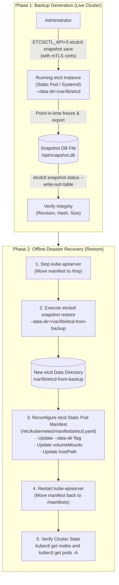
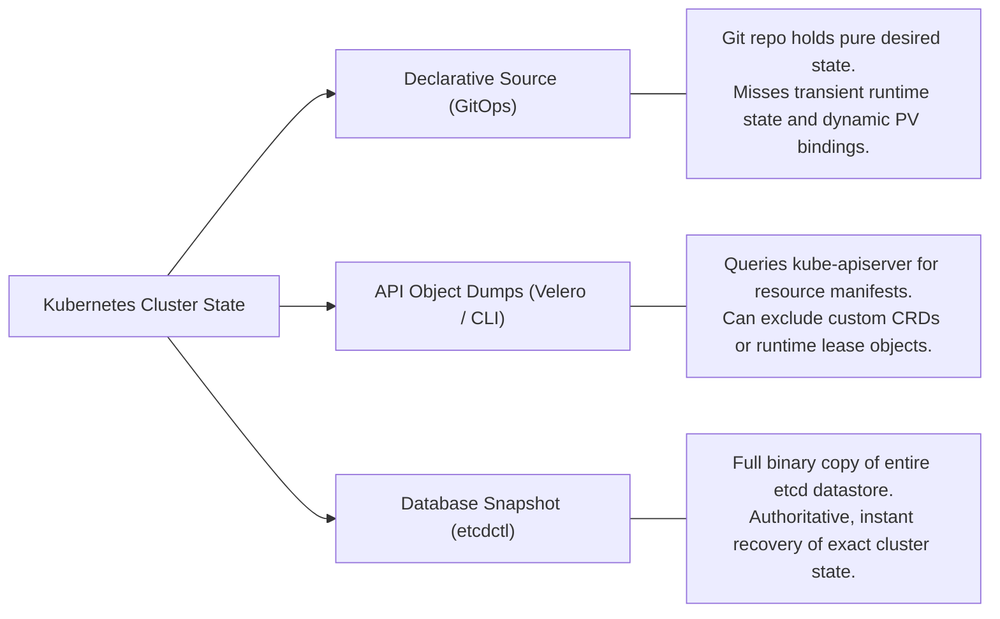
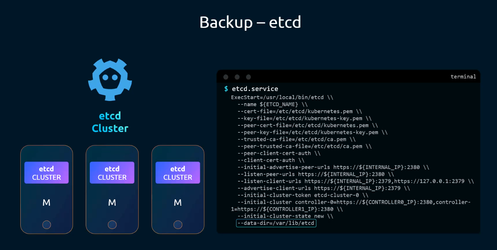
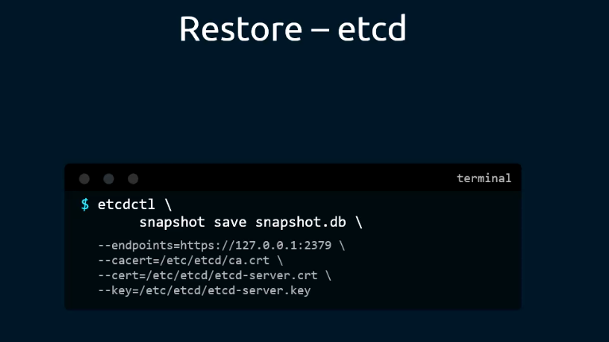
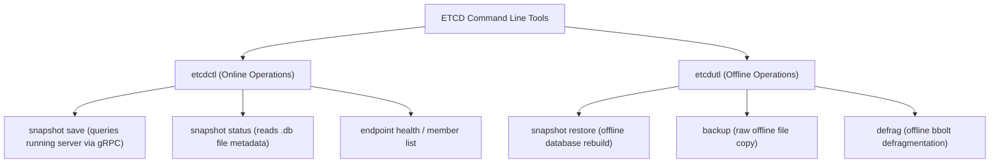
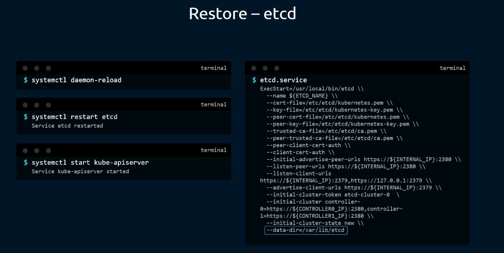
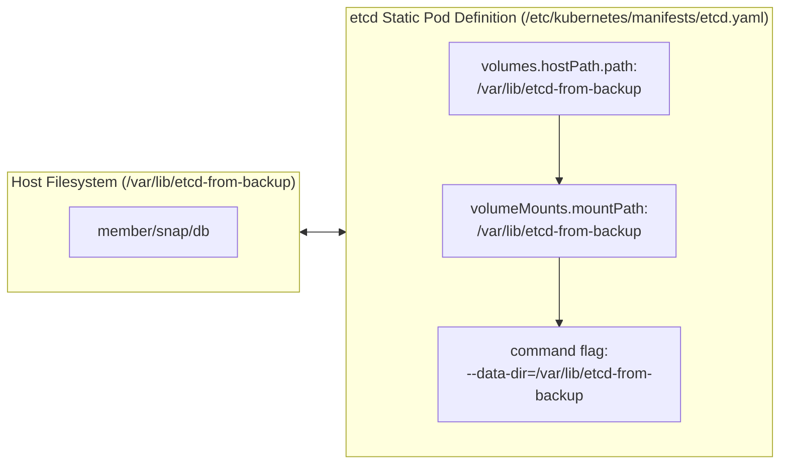
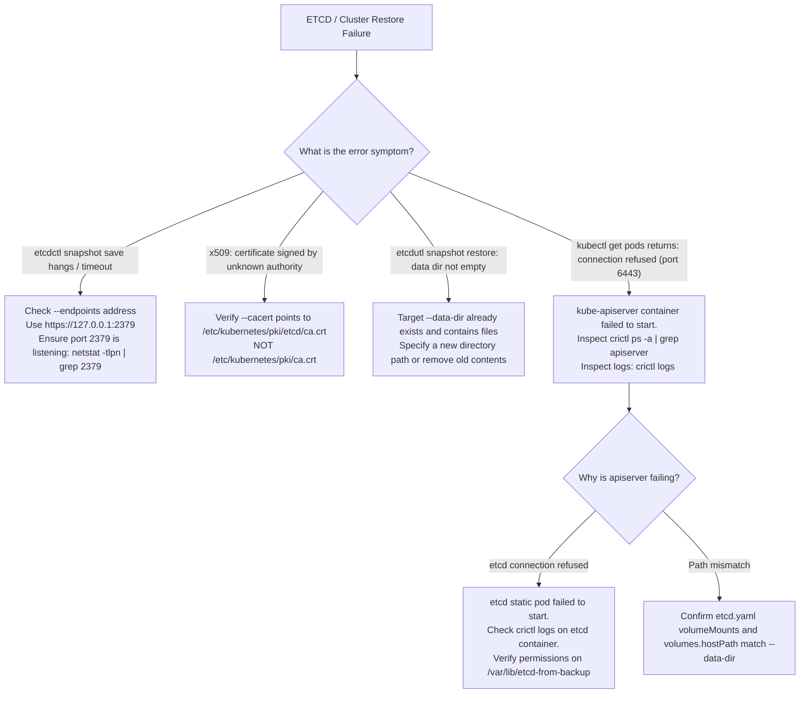

# ETCD Backup & Restore Architecture - CKA Exam Notes

> **Exam Domain**: Cluster Architecture, Installation & Configuration (25%) / Cluster Maintenance  
> **Weight / Importance**: Critical (Top-tier hands-on CKA exam topic tested in nearly 100% of exams: taking an etcd snapshot with TLS authentication, verifying snapshot integrity, performing offline restore to a new data directory, and reconfiguring static pod manifests or systemd daemons)  
> **Target Version**: Verified against v1.31 / v1.32 (Current CKA Curriculum)  
> **Allowed Docs Search Keywords**: `Backing up an etcd cluster`, `etcdctl snapshot save`, `etcdutl snapshot restore`, `etcdctl`, `Operating etcd clusters for Kubernetes`  
> **Source**: Generated from `cluster-maintainance/05-backup-and-restore-methods-raw.md`

---

## 1. Quick-Reference Summary

- **Backup Hierarchy**:
  - **Resource Definition Backup (Declarative)**: Source-controlled Git repositories (GitOps).
  - **Imperative Cluster State Dump**: `kubectl get all -A -o yaml > cluster-backup.yaml` (exports active objects, but misses secrets, custom resources, RBAC bindings, and cluster-scoped metadata).
  - **Cluster Application Backup**: Open-source tools like Velero (formerly Heptio Ark) that interact with the Kubernetes API to backup object manifests and PV snapshots.
  - **Complete Cluster State Backup (Authoritative)**: Point-in-time binary snapshot of the **etcd** key-value datastore (`etcdctl snapshot save`).
- **ETCD Data Location & Storage**:
  - Configured via the `--data-dir` parameter (default kubeadm path: `/var/lib/etcd`).
  - Houses the persistent write-ahead log (WAL) and the underlying bbolt key-value database file (`member/snap/db`).
- **Snapshot Creation Requirements**:
  - Always requires **API version 3** (`ETCDCTL_API=3`).
  - Requires **Mutual TLS (mTLS)** flags:
    - `--endpoints=https://127.0.0.1:2379`
    - `--cacert=/etc/kubernetes/pki/etcd/ca.crt`
    - `--cert=/etc/kubernetes/pki/etcd/server.crt`
    - `--key=/etc/kubernetes/pki/etcd/server.key`
  - The snapshot command is executed **directly on the host OS**, not inside the etcd container.
- **Snapshot Integrity Check**:
  - `ETCDCTL_API=3 etcdctl snapshot status <snapshot.db> --write-out=table`
  - Displays total revision, compact hash, allocated size, and total keys.
- **Restoration Sequence (Offline Restore)**:
  1. Stop `kube-apiserver` (move static pod manifest out of `/etc/kubernetes/manifests/` or `systemctl stop kube-apiserver`).
  2. Restore snapshot to an **isolated target data directory**:
     `etcdutl snapshot restore <snapshot.db> --data-dir=/var/lib/etcd-restored` (or `etcdctl snapshot restore ...`).
  3. Update `/etc/kubernetes/manifests/etcd.yaml`:
     - Update command flag: `--data-dir=/var/lib/etcd-restored`.
     - Update volume mount: `mountPath: /var/lib/etcd-restored`.
     - Update host path volume: `path: /var/lib/etcd-restored`.
  4. Restore `kube-apiserver.yaml` to `/etc/kubernetes/manifests/` if moved.
  5. Restart kubelet / wait for static pods to restart; verify via `crictl ps` and `kubectl get pods -A`.

---

## 2. Conceptual Overview & Mental Model

### Dual-Layer Architectural Understanding

- **Simple English Explanation (How It Works)**:
  - In Kubernetes, all configuration, secrets, pod statuses, deployments, and cluster state live inside a single distributed database: **etcd**. The `kube-apiserver` is the only component that communicates directly with etcd; all other cluster components communicate with the API server.
  - If a worker node crashes, pods can be recreated. But if etcd loses its data, the cluster loses all memory of what should exist.
  - Taking a backup means taking a point-in-time freeze of the etcd database file on disk while the cluster is still running. Because etcd is secured with mutual TLS (mTLS), you must provide client certificates and keys to prove your identity when saving the snapshot.
  - When restoring etcd from a backup file, you must never write directly over a running database. Instead, etcd restore creates a brand-new database directory with a fresh cluster identity.
  - Because the API server cannot function without etcd, you temporarily suspend the API server, instruct etcd to read its data from the newly restored directory, and then let the API server reconnect to the restored etcd instance.

- **Formal Kubernetes Definition**:
  - etcd is a strongly consistent, distributed key-value store implementing the Raft consensus algorithm. In a kubeadm-managed cluster, etcd runs as a host-networked static pod supervised by the local kubelet. Backups are generated by capturing point-in-time consistent read-transactions from etcd's BoltDB storage engine via the v3 client API. Restoring a snapshot initializes a new Raft cluster state machine and generates a new cluster UUID to prevent split-brain collisions with any surviving cluster members.

### Architectural Workflow Diagram



---

## 3. Deep-Dive Technical Breakdown

### 1. Backup Strategies & Comparison Matrix

When architecting disaster recovery for Kubernetes, three distinct paradigms exist:



1. **Declarative Configuration (GitOps)**:
   - All YAML manifests are stored in version control (e.g., Git).
   - *Limitation*: Captures desired state, but not cluster runtime state (e.g., node leases, dynamic volume claims, operator state machines).
2. **Imperative API Extraction (`kubectl get all -A -o yaml`)**:
   - Dumps existing API resources to a flat YAML file.
   - *Limitation*: `kubectl get all` does **not** fetch all resource types. It omits Secrets, ConfigMaps, PersistentVolumeClaims, Custom Resource Definitions (CRDs), and RBAC RoleBindings.
3. **Application Backup Tools (Velero / Heptio Ark)**:
   - Runs in-cluster pods that communicate with the Kubernetes API to backup namespace resources and integrate with cloud storage providers to snapshot block volumes.
4. **ETCD Database Snapshot (`etcdctl snapshot save`)**:
   - The authoritative disaster recovery mechanism for the CKA exam. Dumps the complete bbolt binary file containing every object, lease, event, secret, and configuration in the cluster.

---

### 2. ETCD Storage Internals & Data Layout

etcd stores all data on the node's local filesystem inside the directory specified by `--data-dir`.



Inside `--data-dir` (typically `/var/lib/etcd`), etcd maintains two distinct subdirectories:
- **`wal/` (Write-Ahead Log)**: Contains append-only logs recording every transaction committed by Raft before application to the state machine.
- **`snap/` (Snapshots & Backend DB)**: Contains etcd state snapshots and the primary database file **`db`** (a bbolt key-value store).

```plaintext
/var/lib/etcd/
├── member
│   ├── snap
│   │   └── db             <-- BoltDB binary database file
│   └── wal
│       └── 0000000000000000-0000000000000000.wal
```

> [!NOTE]
> During an online backup (`etcdctl snapshot save`), etcd opens a read transaction, streams the contents of `db` to the specified target path, and appends the latest commit index. The etcd process **does not need to be paused or stopped** to take a snapshot.

---

### 3. Mutual TLS (mTLS) Authentication Requirements

Kubernetes secures etcd endpoints with mutual TLS (mTLS). Both the client and server must validate each other's certificates:



When running `etcdctl` from the control-plane host shell, four parameters are required:

| Flag | Purpose | Standard Kubeadm Location |
| :--- | :--- | :--- |
| **`--endpoints`** | Network target for etcd client traffic | `https://127.0.0.1:2379` |
| **`--cacert`** | CA certificate used to verify the etcd server's certificate | `/etc/kubernetes/pki/etcd/ca.crt` |
| **`--cert`** | Client certificate proving `etcdctl`'s authorization | `/etc/kubernetes/pki/etcd/server.crt` *(or `healthcheck-client.crt`)* |
| **`--key`** | Private key matching the client certificate | `/etc/kubernetes/pki/etcd/server.key` *(or `healthcheck-client.key`)* |

> [!TIP]
> **Exam Discovery Shortcut**: You never need to memorize these certificate paths. Open `/etc/kubernetes/manifests/etcd.yaml` and look under `spec.containers[0].command` to locate `--cert-file`, `--key-file`, and `--trusted-ca-file`.

---

### 4. `etcdctl` vs. `etcdutl` (ETCD v3.5+ Architecture)

In etcd v3.5 and later, maintenance and offline administrative tasks were separated into a dedicated utility: **`etcdutl`**.



- **`etcdctl`**: Primary client for interacting with a **running** etcd cluster over gRPC network connections.
- **`etcdutl`**: Dedicated offline tool that acts directly on database files without needing a running server.
- *Compatibility*: `etcdctl snapshot restore` still functions in many Kubernetes distributions as a wrapper, but `etcdutl snapshot restore` is the modern official command in Kubernetes v1.30+. Both accept identical arguments.

---

### 5. Snapshot Restoration Mechanics & Why `--data-dir` Must Change

When restoring an etcd snapshot via `etcdutl snapshot restore`:



1. **New Cluster Generation**:
   - `etcdutl snapshot restore` creates a brand-new Raft cluster configuration.
   - It assigns a new cluster ID and member ID to the node to prevent split-brain consensus issues with any running peers.
2. **Directory Isolation**:
   - The restore command generates a fresh `member/snap/db` and a fresh `wal/` directory.
   - **Crucial Rule**: The target path specified by `--data-dir` **must not exist or must be empty**. You cannot restore into an existing, populated `/var/lib/etcd` directory without explicitly deleting its contents first.
3. **The 3-Way Path Update in `etcd.yaml`**:
   If restoring to `/var/lib/etcd-from-backup`, you must update **three separate locations** in `/etc/kubernetes/manifests/etcd.yaml`:
   - `spec.containers[0].command`: `--data-dir=/var/lib/etcd-from-backup`
   - `spec.containers[0].volumeMounts`: `mountPath: /var/lib/etcd-from-backup` (for `etcd-data`)
   - `spec.volumes`: `hostPath.path: /var/lib/etcd-from-backup` (for `etcd-data`)



---

### 6. API Server Authorization Modes & Verbosity

#### `--authorization-mode` in `kube-apiserver.yaml`
During recovery, if `kubectl` fails with authorization or RBAC errors (e.g. `User cannot list resource "pods"`), administrators inspect `--authorization-mode` on the API server:
- Default production setting: `--authorization-mode=Node,RBAC`
  - `Node`: Authorizes requests from `kubelet` daemons for their own node resources.
  - `RBAC`: Enforces Role-Based Access Control rules stored in etcd.
- Debugging mode: `--authorization-mode=Node,RBAC,AlwaysAllow`
  - `AlwaysAllow` bypasses authorization checks. In disaster recovery scenarios where RBAC objects are suspected of corruption or misconfiguration, appending `AlwaysAllow` allows `kubectl` to query the cluster regardless of RBAC state.

#### Kubectl Verbosity Levels (`-v=...`)
When diagnosing API server connectivity after an etcd restore, the `-v` flag controls log verbosity:

```bash
kubectl get pods -v=6
```

- **`-v=0` to `-v=4`**: Standard information and warnings.
- **`-v=6`**: Displays HTTP request methods, request URLs, and response status codes.
- **`-v=7`**: Displays HTTP request and response headers.
- **`-v=8`**: Displays full HTTP request and response body contents.
- **`-v=9`**: Displays raw curl commands and raw socket payloads.

---

## 4. Command Translation & Mapping Tables

### Table 1: `etcdctl` vs. `etcdutl` Command Reference

| Operational Task | Command Pattern | Context / Requirements |
| :--- | :--- | :--- |
| **Verify client tool version** | `ETCDCTL_API=3 etcdctl version` | Validates API v3 is active |
| **Save live cluster snapshot** | `ETCDCTL_API=3 etcdctl snapshot save <file.db> [TLS flags]` | Online; etcd must be running |
| **Audit snapshot metadata** | `ETCDCTL_API=3 etcdctl snapshot status <file.db> --write-out=table` | Offline or Online; inspects file header |
| **Restore snapshot (Modern)** | `etcdutl snapshot restore <file.db> --data-dir=<new-dir>` | **Offline**; etcd server stopped |
| **Restore snapshot (Legacy)** | `ETCDCTL_API=3 etcdctl snapshot restore <file.db> --data-dir=<new-dir>` | **Offline**; wrapper around restore logic |
| **Check cluster member health** | `ETCDCTL_API=3 etcdctl endpoint health [TLS flags]` | Online; tests live response time |

---

### Table 2: Static Pod vs. External (Systemd) ETCD Restore Workflows

| Architecture Element | Kubeadm Static Pod Setup | External ETCD Host (Systemd) |
| :--- | :--- | :--- |
| **Process Supervision** | Supervised by `kubelet` watching `/etc/kubernetes/manifests` | Supervised by systemd service (`systemctl status etcd`) |
| **To Stop Process** | Move `kube-apiserver.yaml` and `etcd.yaml` to `/tmp` | `sudo systemctl stop etcd` and `systemctl stop kube-apiserver` |
| **Target Data Path** | Restore to `/var/lib/etcd-restored` | Restore to `/var/lib/etcd-restored` |
| **Service Reconfiguration** | Edit `/etc/kubernetes/manifests/etcd.yaml` (flags & volumes) | Edit `/etc/systemd/system/etcd.service` or `/etc/etcd.env` |
| **Service Restart** | Move manifest back to `/etc/kubernetes/manifests/` | `sudo systemctl daemon-reload && sudo systemctl restart etcd` |
| **File Permissions** | Root ownership default (or etcd UID) | Must run: `sudo chown -R etcd:etcd /var/lib/etcd-restored` |

---

### Table 3: `kubectl` Verbosity Flag Reference

| Flag Level | Information Exposed | Primary Diagnostic Use Case |
| :--- | :--- | :--- |
| **`-v=1`** | General informational messages | Basic CLI debugging |
| **`-v=4`** | Debug-level verbose details | API server endpoint resolution |
| **`-v=6`** | **HTTP Request URL & Response Code** | Checking if API server returns 500, 503, or 401 |
| **`-v=7`** | HTTP Request & Response Headers | Debugging auth tokens, user-agent, content types |
| **`-v=8`** | **HTTP Request & Response Bodies** | Inspecting JSON serialization errors or API payloads |
| **`-v=9`** | Complete curl command representation | Reproducing API requests directly with `curl` |

---

## 5. High-Yield CLI & Imperative Commands

### Complete End-to-End Hands-On Exercise

---

### Part 1: Inspecting ETCD Configuration & Certificate Paths

On the control plane node, extract the active certificate arguments directly from the static pod manifest:

```bash
# Locate client TLS arguments and current data-dir
grep -E '\-\-(data-dir|cert-file|key-file|trusted-ca-file)' /etc/kubernetes/manifests/etcd.yaml
```

*Expected output lines*:
```plaintext
- --cert-file=/etc/kubernetes/pki/etcd/server.crt
- --data-dir=/var/lib/etcd
- --key-file=/etc/kubernetes/pki/etcd/server.key
- --trusted-ca-file=/etc/kubernetes/pki/etcd/ca.crt
```

---

### Part 2: Taking the Snapshot (Live Backup)

Run the snapshot command on the control plane host:

```bash
ETCDCTL_API=3 etcdctl snapshot save /opt/snapshot-pre-boot.db \
  --endpoints=https://127.0.0.1:2379 \
  --cacert=/etc/kubernetes/pki/etcd/ca.crt \
  --cert=/etc/kubernetes/pki/etcd/server.crt \
  --key=/etc/kubernetes/pki/etcd/server.key
```

*Expected output*:
```plaintext
Snapshot saved at /opt/snapshot-pre-boot.db
```

---

### Part 3: Verifying Snapshot Integrity

Verify that the snapshot is healthy and not corrupted:

```bash
ETCDCTL_API=3 etcdctl snapshot status /opt/snapshot-pre-boot.db --write-out=table
```

*Expected output*:
```plaintext
+----------+----------+------------+------------+
|   HASH   | REVISION | TOTAL KEYS | TOTAL SIZE |
+----------+----------+------------+------------+
| 9b54c861 |    28419 |       1450 |     4.2 MB |
+----------+----------+------------+------------+
```

---

### Part 4: Performing the Restore (Disaster Recovery)

#### Step 1: Temporarily Stop `kube-apiserver`
To prevent the API server from attempting writes during etcd restoration, temporarily move its manifest:

```bash
sudo mv /etc/kubernetes/manifests/kube-apiserver.yaml /tmp/

# Confirm the apiserver container has terminated
crictl ps | grep kube-apiserver
```

#### Step 2: Restore Snapshot to a New Directory
Restore into `/var/lib/etcd-from-backup`:

```bash
# Using etcdutl (recommended in v1.30+):
sudo etcdutl snapshot restore /opt/snapshot-pre-boot.db \
  --data-dir=/var/lib/etcd-from-backup

# Alternatively using etcdctl:
# ETCDCTL_API=3 etcdctl snapshot restore /opt/snapshot-pre-boot.db \
#   --data-dir=/var/lib/etcd-from-backup
```

Verify the files are populated in the new directory:
```bash
ls -la /var/lib/etcd-from-backup/member/snap/
```

#### Step 3: Reconfigure `/etc/kubernetes/manifests/etcd.yaml`
Edit `/etc/kubernetes/manifests/etcd.yaml` to update the data directory and host paths:

```yaml
spec:
  containers:
  - command:
    - etcd
    - --advertise-client-urls=https://10.244.213.33:2379
    # 1. Update the --data-dir command argument
    - --data-dir=/var/lib/etcd-from-backup
    ...
    volumeMounts:
    # 2. Update the container mount path
    - mountPath: /var/lib/etcd-from-backup
      name: etcd-data
    - mountPath: /etc/kubernetes/pki/etcd
      name: etcd-certs
  volumes:
  - hostPath:
      # 3. Update the hostPath on the underlying node
      path: /var/lib/etcd-from-backup
      type: DirectoryOrCreate
    name: etcd-data
```

#### Step 4: Restart `kube-apiserver`
Restore the API server static pod manifest:

```bash
sudo mv /tmp/kube-apiserver.yaml /etc/kubernetes/manifests/
```

#### Step 5: Verification
Wait approximately 30-60 seconds for kubelet to restart both static pods, then verify:

```bash
# Verify static pods are running via container runtime
crictl ps | grep -E 'etcd|apiserver'

# Test cluster API responsiveness with HTTP verbosity
kubectl get nodes -v=6
kubectl get pods -A
```

---

## 6. Troubleshooting & Diagnostic Runbook

### Diagnostic Decision Tree



---

### Step-by-Step Triage Runbook

| Failure Symptom | Root Cause | Diagnostic Verification | Remediation Procedure |
| :--- | :--- | :--- | :--- |
| `client: etcd cluster is unavailable or misconfigured` | Client TLS credentials missing or `--endpoints` incorrect | `curl -k https://127.0.0.1:2379/health` | Supply `--cacert`, `--cert`, and `--key` flags explicitly. |
| `remote error: tls: bad certificate` | Used Kubernetes cluster CA instead of ETCD CA | `openssl x509 -in /etc/kubernetes/pki/etcd/server.crt -text -noout` | Point `--cacert` to `/etc/kubernetes/pki/etcd/ca.crt`. |
| `snapshot restore: data-dir is not empty` | Restored into existing `/var/lib/etcd` without deleting it | `ls -la /var/lib/etcd` | Provide a new target path (e.g. `/var/lib/etcd-restored`) or wipe existing dir. |
| `kubectl` commands fail with `The connection to server 127.0.0.1:6443 was refused` | API server static pod crashed because etcd is unreachable | `crictl ps -a \| grep apiserver` | Check etcd logs (`crictl logs <id>`); verify etcd container is running. |
| etcd container crashloops with `permission denied` | Restored data directory owned by `root` in external etcd | `ls -ld /var/lib/etcd-restored` | Change ownership: `sudo chown -R etcd:etcd /var/lib/etcd-restored`. |
| etcd starts with old data despite restore | Updated `--data-dir` flag but forgot to update `hostPath` | `cat /etc/kubernetes/manifests/etcd.yaml` | Ensure `hostPath.path` in volumes matches the new directory. |

---

## 7. CKA Exam Tips, Gotchas & Traps

> [!CAUTION]
> **Trap 1: The Three-Way Volume Mismatch Trap**  
> In kubeadm clusters, modifying only `--data-dir=/var/lib/etcd-from-backup` under `command` is **not sufficient**. The etcd container runs in a mount namespace. You must also update:
> 1. `volumeMounts[name=etcd-data].mountPath`
> 2. `volumes[name=etcd-data].hostPath.path`  
> If you omit the volume update, the container writes data to an ephemeral layer or an unmounted path, causing etcd to fail or lose data on restart.

> [!IMPORTANT]
> **Trap 2: Wrong CA Certificate (`/pki/ca.crt` vs. `/pki/etcd/ca.crt`)**  
> Kubernetes maintains two distinct certificate authorities:
> - Root cluster CA: `/etc/kubernetes/pki/ca.crt`
> - ETCD dedicated CA: `/etc/kubernetes/pki/etcd/ca.crt`  
> Passing `/etc/kubernetes/pki/ca.crt` to `etcdctl --cacert` will fail TLS handshakes with `certificate signed by unknown authority`. Always use the CA in the `/etcd` subfolder.

> [!TIP]
> **Exam Tip 3: Never Run `etcdctl` Inside the Container**  
> Candidates frequently waste time attempting `kubectl exec -it etcd ...`. The etcd static pod image does not contain a shell, and `kubectl` will be unavailable if etcd is broken. Run `etcdctl` directly from the control-plane host shell.

> [!WARNING]
> **Trap 4: Forgetting `ETCDCTL_API=3`**  
> While modern etcd distributions default to v3, some testing shells default to API v2. If API v2 is active, `etcdctl snapshot save` outputs: `Error: unknown command "snapshot" for "etcdctl"`. Always prefix commands with `ETCDCTL_API=3`.

> [!NOTE]
> **Trap 5: Restoring to an Existing Directory**  
> `etcdutl snapshot restore` will abort if the target `--data-dir` exists and has files in it. Always restore into a fresh directory path (e.g. `/var/lib/etcd-restored`) and point `etcd.yaml` to it.

---

## 8. Self-Test / Active Recall

<details>
<summary><strong>1. Why is <code>kubectl get all -A -o yaml</code> insufficient for complete cluster backups?</strong></summary>

Because `kubectl get all` does not return cluster-scoped resources or critical security objects such as Secrets, ConfigMaps, PersistentVolumeClaims, ServiceAccounts, Roles, RoleBindings, and Custom Resource Definitions (CRDs). Only an etcd snapshot captures the entire authoritative cluster state.
</details>

<details>
<summary><strong>2. What environment variable must be set to use the <code>snapshot</code> subcommand with <code>etcdctl</code>?</strong></summary>

`ETCDCTL_API=3`. In etcd v2 API mode, the `snapshot` subcommand does not exist.
</details>

<details>
<summary><strong>3. Where can you find the exact TLS certificate paths to pass to <code>etcdctl</code> on a live kubeadm control plane?</strong></summary>

Inspect `/etc/kubernetes/manifests/etcd.yaml`. The arguments `--cert-file`, `--key-file`, and `--trusted-ca-file` in the container specification list the exact paths on the host.
</details>

<details>
<summary><strong>4. Why must <code>etcdutl snapshot restore</code> specify a new or empty <code>--data-dir</code>?</strong></summary>

`etcdutl` creates a new database and Raft write-ahead log. It refuses to overwrite an existing directory containing files to prevent accidental data destruction and split-brain states.
</details>

<details>
<summary><strong>5. Which three fields in <code>/etc/kubernetes/manifests/etcd.yaml</code> must be modified when restoring to a new data directory?</strong></summary>

1. `spec.containers[0].command`: the `--data-dir` argument.
2. `spec.containers[0].volumeMounts`: `mountPath` for the `etcd-data` volume.
3. `spec.volumes`: `hostPath.path` for the `etcd-data` volume.
</details>

<details>
<summary><strong>6. Does taking an etcd snapshot via <code>etcdctl snapshot save</code> disrupt cluster traffic?</strong></summary>

**No.** `etcdctl snapshot save` opens a point-in-time consistent read transaction against the BoltDB database and streams the data out without requiring etcd or the API server to be stopped.
</details>

<details>
<summary><strong>7. How does the local <code>kubelet</code> know to restart etcd after <code>/etc/kubernetes/manifests/etcd.yaml</code> is modified?</strong></summary>

The `kubelet` uses the Linux `inotify` subsystem to watch `/etc/kubernetes/manifests/`. When the file's hash or timestamp changes, `kubelet` terminates the existing static pod container and spins up a new one matching the updated manifest.
</details>

<details>
<summary><strong>8. What command is used to inspect the integrity, revision, and size of a saved etcd snapshot?</strong></summary>

`ETCDCTL_API=3 etcdctl snapshot status <path-to-db> --write-out=table`.
</details>

<details>
<summary><strong>9. In external etcd deployments managed by systemd, what critical step must be performed on the restored directory before restarting the service?</strong></summary>

File ownership must be updated to the etcd system user:
`sudo chown -R etcd:etcd /var/lib/etcd-restored`.
</details>

<details>
<summary><strong>10. What does <code>kubectl get pods -v=6</code> reveal that default <code>kubectl get pods</code> does not?</strong></summary>

The `-v=6` flag reveals the underlying HTTP requests sent to the API server, including the target URL endpoint, request headers, and the HTTP response code (e.g., 200 OK, 401 Unauthorized, or 503 Service Unavailable).
</details>

---

## 9. Official Documentation Bookmarks

| Documentation Page | Official URL | Search Keywords | High-Yield Section for Exam |
| :--- | :--- | :--- | :--- |
| **Operating etcd clusters for Kubernetes** | `https://kubernetes.io/docs/tasks/administer-cluster/configure-upgrade-etcd/` | `Backing up an etcd cluster`, `etcdctl snapshot` | Exact `snapshot save` and `snapshot restore` command syntax |
| **Backing up an etcd cluster** | `https://kubernetes.io/docs/tasks/administer-cluster/configure-upgrade-etcd/#backing-up-an-etcd-cluster` | `Backing up an etcd cluster` | TLS certificate flags and endpoint references |
| **Restoring an etcd cluster** | `https://kubernetes.io/docs/tasks/administer-cluster/configure-upgrade-etcd/#restoring-an-etcd-cluster` | `Restoring an etcd cluster` | Static pod reconfiguration and data-dir flag adjustments |
| **Troubleshooting Clusters** | `https://kubernetes.io/docs/tasks/debug/debug-cluster/` | `troubleshooting clusters`, `kubectl verbosity` | Diagnostic procedures for unresponsive API servers |

