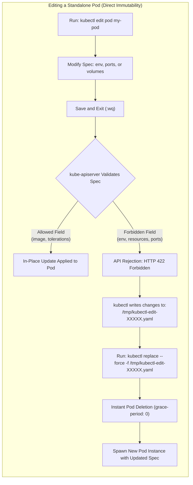
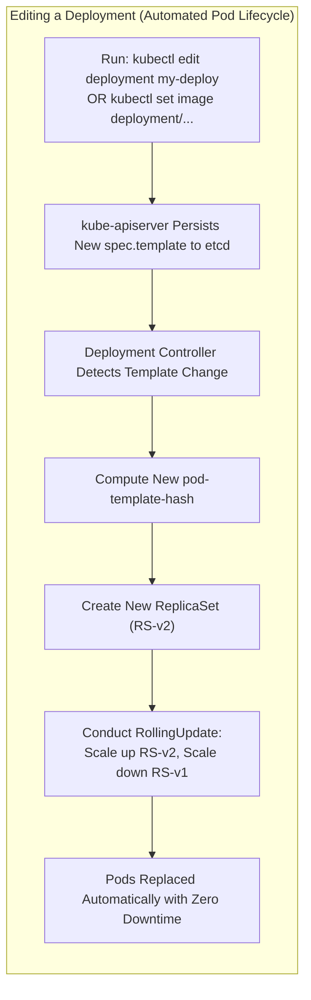
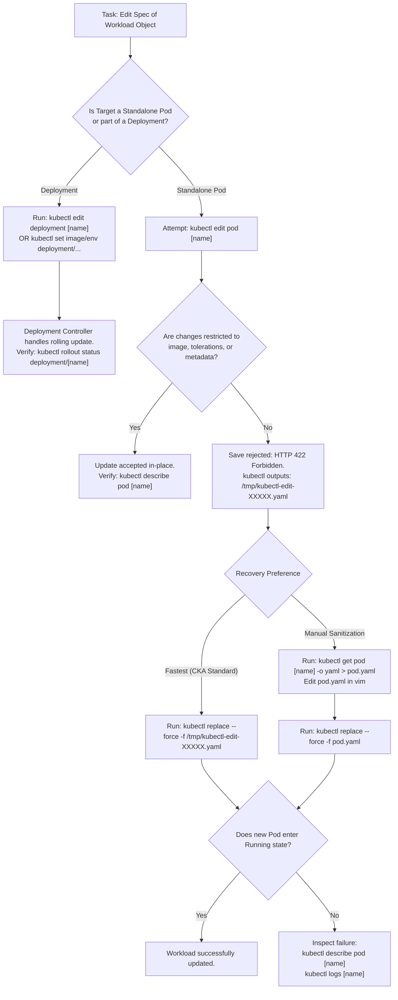

# Editing Pods and Deployments in Kubernetes - CKA Exam Notes

> **Exam Domain**: Workloads and Scheduling (15%) / Troubleshooting (30%)  
> **Weight / Importance**: Critical (Core daily exam workflow; tested across pod lifecycle, configuration changes, and troubleshooting questions)  
> **Target Version**: Verified against v1.31 / v1.32 (Current CKA Curriculum)  
> **Allowed Docs Search Keywords**: `kubectl edit`, `kubectl replace`, `pod spec immutability`, `kubectl set image`, `rollout`  
> **Source**: Generated from `core-concepts/editing-pods-and-deployment-raw.md`

---

## 1. Quick-Reference Summary

- **The Immutability Rule for Pods**: Once scheduled and running, almost all fields in a Pod's `spec` are **strictly immutable**.
- **Mutable Fields on an Existing Pod**:
  - `spec.containers[*].image`
  - `spec.initContainers[*].image`
  - `spec.activeDeadlineSeconds`
  - `spec.tolerations` (additions to existing tolerations only)
  - `metadata.*` (e.g., `labels`, `annotations` are mutable in-place)
- **Immutable Fields on an Existing Pod**:
  - `env`, `envFrom`, `ports`, `volumeMounts`, `volumes`, `resources`, `command`, `args`, `serviceAccountName`, `securityContext`, `nodeSelector`, `affinity`.
- **Handling Failed `kubectl edit pod`**:
  - Editing an immutable field opens the live spec in `$EDITOR`, but saving and quitting (`:wq`) triggers an API rejection error (`spec: Forbidden`).
  - `kubectl` automatically saves your edited buffer locally to a temporary file:
    ```bash
    /tmp/kubectl-edit-XXXXX.yaml
    ```
- **The Golden CKA Exam Shortcut (`replace --force`)**:
  Instead of deleting and manually recreating in two steps (which wastes 30 seconds waiting for graceful termination), immediately run:
  ```bash
  kubectl replace --force -f /tmp/kubectl-edit-XXXXX.yaml
  ```
  This immediately forces Pod deletion (`--grace-period=0`) and recreates it from the modified file in a single operation.
- **Extract, Edit, and Replace Workflow**:
  ```bash
  kubectl get pod <pod-name> -o yaml > pod.yaml
  vim pod.yaml
  kubectl replace --force -f pod.yaml
  ```
- **Deployments (Fully Mutable Pod Templates)**:
  - Unlike standalone Pods, a Deployment's `spec.template` is **fully mutable**.
  - Any edit to `spec.template` (e.g., via `kubectl edit deployment <name>` or `kubectl apply`) triggers the Deployment controller to create a new `ReplicaSet` and execute an automated, zero-downtime rolling update.
  - Modifying top-level fields (e.g., `spec.replicas`) scales the active `ReplicaSet` in-place without triggering a new revision.
- **Fast Imperative Modifiers for Deployments**:
  - Update image: `kubectl set image deployment/<name> <container-name>=<new-image>`
  - Update env vars: `kubectl set env deployment/<name> KEY=VALUE`
  - Update resources: `kubectl set resources deployment/<name> -c=<container> --limits=cpu=200m,memory=512Mi`

---

## 2. Conceptual Overview & Mental Model

### Dual-Layer Architectural Understanding

- **Simple English Explanation (How It Works)**:
  - **Why Pods Cannot Be Edited in Place**:
    When a Pod is scheduled onto a worker node, the node's `kubelet` instructs the container runtime (`containerd`) to construct isolated Linux kernel environments: cgroups (for CPU and memory limits), network namespaces (with dedicated virtual ethernet interfaces and port bindings), IPC namespaces, and storage mount points. 
    Once these processes are actively executing, attempting to mutate low-level kernel namespaces dynamically (such as injecting a new environment variable, mounting a new storage volume, or changing resource limits without a complete restart) is inherently volatile and risks leaving the host operating system and runtime in an inconsistent state. Because Pods are designed as ephemeral, disposable units of execution, Kubernetes enforces a design rule: if you need to alter the execution environment specification, destroy the old Pod instance and construct a new one.
  - **Why Deployments Can Be Edited Freely**:
    A Deployment is an active control loop that manages the lifecycle of your application. It decouples the desired state of your software from the temporary container instances running on nodes. 
    The Deployment specification wraps the Pod specification inside a template field (`spec.template`). When you edit this template, you are not asking the cluster to rewrite the memory or namespaces of live containers. Instead, you are updating the desired blueprint. The Deployment controller detects that the current blueprint differs from what is running, computes a new template hash (`pod-template-hash`), spins up a brand-new `ReplicaSet` with the new blueprint, and incrementally terminates the old Pods while waiting for the new Pods to report healthy.





- **Standard / Production Definition**:
  - **Pod Immutability**: The core Kubernetes Pod API specification enforces immutability on running Pod definitions to ensure operational determinism and avoid non-reproducible runtime state drift. Except for designated metadata and a restricted subset of container image references and toleration additions, any modification to a Pod's functional spec requires complete resource lifecycle recycling (`DELETE` followed by `CREATE`).
  - **Deployment Template Reconciliation**: A Deployment is a higher-order declarative controller that continuously reconciles cluster reality with desired state through sub-controller delegation. Updating `spec.template` triggers generation of a new `ReplicaSet` identified by a deterministic hash, enabling declarative transitions and automated rolling updates without direct operator intervention on individual Pod primitives.

---

## 3. Deep-Dive Technical Breakdown

### 3.1 Pod Field Mutability Matrix

Understanding exactly what can and cannot be changed on an active Pod is critical for both the CKA exam and production triage:

| Object Field | Mutability Status | In-Place Allowed? | Behavior on Modification Attempt |
| :--- | :--- | :--- | :--- |
| `metadata.labels` | **Mutable** | Yes | Instantly updated in `etcd`; triggers controller evaluations if selectors match. |
| `metadata.annotations` | **Mutable** | Yes | Instantly updated in `etcd`; used by ingress controllers, service meshes, etc. |
| `spec.containers[*].image` | **Mutable** | Yes | Container runtime pulls new image and restarts the container process in-place. |
| `spec.initContainers[*].image` | **Mutable** | Yes | Permitted only if the init container has not completed. |
| `spec.activeDeadlineSeconds` | **Mutable** | Yes | Can be updated or transitioned to set an overall Pod execution timeout. |
| `spec.tolerations` | **Partially Mutable** | Yes | **Additions only**. Existing tolerations cannot be modified or removed. |
| `spec.containers[*].env` | **IMMUTABLE** | **NO** | API server rejects update with `Forbidden` error; changes saved to `/tmp`. |
| `spec.containers[*].ports` | **IMMUTABLE** | **NO** | API server rejects update with `Forbidden` error. |
| `spec.containers[*].resources` | **IMMUTABLE**\* | **NO** | Rejected in standard clusters (unless alpha `InPlacePodVerticalScaling` gate is enabled). |
| `spec.volumes` and `volumeMounts`| **IMMUTABLE** | **NO** | API server rejects update with `Forbidden` error. |
| `spec.serviceAccountName` | **IMMUTABLE** | **NO** | API server rejects update with `Forbidden` error. |
| `spec.nodeName` / `nodeSelector` | **IMMUTABLE** | **NO** | Binding is permanent once scheduled by `kube-scheduler`. |

### 3.2 The Anatomy of a Failed `kubectl edit pod`

When you execute:
```bash
kubectl edit pod webapp
```

The underlying sequence operates as follows:
1. `kubectl` issues an HTTP `GET` request to `kube-apiserver` to fetch the live JSON representation of the Pod, converts it to YAML, and stores it in a temporary file under `/tmp/`.
2. It opens your system editor (`$EDITOR` or `vi`).
3. You modify an immutable field (for example, adding an environment variable `DB_HOST=postgres`).
4. You write and exit (`:wq`).
5. `kubectl` submits an HTTP `PUT` request to `kube-apiserver` with the modified manifest.
6. The `kube-apiserver` schema admission handler rejects the payload:
   ```text
   error: pods "webapp" was not valid:
   * spec: Forbidden: pod updates may not change fields other than `spec.containers[*].image`, `spec.initContainers[*].image`, `spec.activeDeadlineSeconds`, or `spec.tolerations` (only additions to existing tolerations)
   ```
7. `kubectl` catches the failure, re-opens the editor, or if you exit without fixing, outputs:
   ```text
   A copy of your changes has been stored to "/tmp/kubectl-edit-172948291.yaml"
   error: Edit cancelled, no changes made.
   ```

### 3.3 The Power of `kubectl replace --force -f`

In standard Kubernetes workflows, recovering from this rejection manually involves:
1. Deleting the existing Pod: `kubectl delete pod webapp` (takes up to 30 seconds due to default `terminationGracePeriodSeconds`).
2. Creating the new Pod from the temporary file: `kubectl create -f /tmp/kubectl-edit-172948291.yaml`.

The CKA time-saving command is:
```bash
kubectl replace --force -f /tmp/kubectl-edit-172948291.yaml
```

**How `replace --force` Works Internally**:
- `kubectl replace` by default performs an in-place HTTP `PUT`. If the field is immutable, `replace` fails.
- When `--force` is appended, `kubectl` completely bypasses the in-place update. It immediately issues an HTTP `DELETE` for the existing resource using a grace period of 0 (`--grace-period=0`), removing it from `etcd` instantly.
- Once deleted, it immediately submits an HTTP `POST` creating the resource anew from the provided YAML file.

### 3.4 Deployments: Declarative In-Place Template Mutations

Deployments manage Pods through underlying ReplicaSets. The relationship between fields determines how changes propagate:


#### Rollout-Triggering Changes vs. Scaling Changes
- **Changes to `spec.template`**:
  - Modifying container image, environment variables, resource limits, readiness probes, volume mounts, or labels inside `spec.template` changes the calculated `pod-template-hash`.
  - The Deployment controller notices the hash mismatch and initiates a rollout:
    ```bash
    kubectl set image deployment/frontend nginx=nginx:1.25.3
    # OR
    kubectl edit deployment frontend
    ```
- **Changes Outside `spec.template`**:
  - Modifying `spec.replicas` or `spec.paused` does **not** change the `pod-template-hash`.
  - The Deployment controller updates the current active `ReplicaSet` in-place without restarting existing Pods or creating a new revision.

---

## 4. Declarative Manifests & Editing Workflows

### 4.1 Pod Extraction and Re-Scaffolding Pattern

When you need to perform extensive edits to a running standalone Pod, extract its manifest and clean up cluster-injected runtime metadata before replacing:

#### Step 1: Export Active Definition
```bash
kubectl get pod webapp -o yaml > webapp.yaml
```

#### Step 2: Clean and Edit (`webapp.yaml`)
Remove cluster runtime status fields that can cause validation warnings, and inject desired modifications:

```yaml
apiVersion: v1
kind: Pod
metadata:
  name: webapp
  namespace: default
  labels:
    app: webapp
spec:
  containers:
  - name: web-app
    image: kodekloud/webapp-color
    env:
    - name: APP_COLOR
      value: green
    resources:
      requests:
        memory: "64Mi"
        cpu: "250m"
      limits:
        memory: "128Mi"
        cpu: "500m"
```

#### Step 3: Atomic Force Replacement
```bash
kubectl replace --force -f webapp.yaml
```

---

## 5. Command Translation & Mapping Tables

### Comparison of Workload Modification Techniques

| Technique | Target Object | Supported Properties | Downtime / Rollout Behavior | CKA Exam Recommendation |
| :--- | :--- | :--- | :--- | :--- |
| `kubectl edit pod <name>` | Standalone Pod | ../Images, tolerations only | In-place (no Pod restart) if image; fails on all other fields. | Use only for quick image or label updates. |
| `kubectl replace --force -f <file>` | Standalone Pod | **All fields** | Pod terminated with grace-period 0; new Pod spawned immediately. | **Primary exam method** when modifying immutable Pod specs. |
| `kubectl edit deployment <name>` | Deployment | **All fields** (`spec.template`, replicas, strategy) | Zero downtime; triggers automated rolling update. | **Primary exam method** for complex Deployment modifications. |
| `kubectl set image deployment/...` | Deployment / Pod | Container image only | Zero downtime rolling update on Deployment; in-place restart on Pod. | **Fastest exam method** for simple image upgrades. |
| `kubectl set env deployment/...` | Deployment | Environment variables | Zero downtime rolling update. | Ideal for fast configuration injection. |
| `kubectl scale deployment/...` | Deployment | Replicas only | Scales active ReplicaSet in-place; no Pod restarts. | Instant imperative scaling. |

---

## 6. High-Yield CLI & Imperative Commands

### 6.1 Modifying Standalone Pods

```bash
# 1. Update image in-place on a running Pod (permitted without recreation)
kubectl set image pod/nginx-pod nginx=nginx:1.25-alpine

# 2. Extract, edit, and force-replace a standalone Pod
kubectl get pod data-processor -o yaml > /tmp/dp.yaml
vim /tmp/dp.yaml
kubectl replace --force -f /tmp/dp.yaml

# 3. Recover from an edit failure using the auto-generated /tmp file
kubectl edit pod backend-service
# (Save is rejected due to immutable fields -> note the /tmp path printed)
kubectl replace --force -f /tmp/kubectl-edit-*.yaml

# 4. Instant deletion if you prefer manual recreation
kubectl delete pod backend-service --force --grace-period=0
kubectl create -f /tmp/kubectl-edit-*.yaml
```

### 6.2 Modifying Deployments Imperatively

```bash
# 1. Open deployment specification in default editor
kubectl edit deployment web-deploy

# 2. Update container image directly (container-name=image:tag)
kubectl set image deployment/web-deploy web-container=nginx:1.25.1

# 3. Inject or update environment variables
kubectl set env deployment/web-deploy DB_HOST=db.prod.svc.cluster.local DB_PORT="5432"

# 4. Update container CPU and memory resource requests and limits
kubectl set resources deployment/web-deploy -c=web-container --limits=cpu=500m,memory=512Mi --requests=cpu=200m,memory=256Mi

# 5. Monitor the progress of the rolling update
kubectl rollout status deployment/web-deploy

# 6. View revision history and roll back if an edit caused failures
kubectl rollout history deployment/web-deploy
kubectl rollout undo deployment/web-deploy
```

---

## 7. Troubleshooting & Diagnostic Runbook

### Decision Tree Flowchart: Resolving Workload Edit Denials



### Step-by-Step Triage Sequence

1. **Verify Controller Ownership Before Editing**:
   Before modifying a Pod, always check whether it is owned by a higher-level controller:
   ```bash
   kubectl get pod <pod-name> -o jsonpath='{.metadata.ownerReferences[0].kind}'
   ```
   - If output is `ReplicaSet` (from a Deployment), **do not edit the Pod**. Edit the parent Deployment instead (`kubectl edit deployment <deploy-name>`).
   - If output is empty or null, it is a standalone ("naked") Pod and requires the Pod replacement workflow.

2. **Capturing the `/tmp` Buffer**:
   When editing an immutable field fails, do not press `Ctrl+C` or close the shell without noting the temporary filename. The exact path is printed on the terminal:
   ```text
   A copy of your changes has been stored to "/tmp/kubectl-edit-3498102.yaml"
   ```
   Reuse this path immediately with `replace --force`.

3. **Handling Replaced Pod Initialization Failures**:
   If the replaced Pod enters `CrashLoopBackOff` or `RunContainerError`:
   ```bash
   # Check pod status and events
   kubectl describe pod <pod-name>
   
   # Inspect container startup logs
   kubectl logs <pod-name> --previous
   ```
   Common causes: invalid environment variable values, malformed commands, or unscheduled volumes.

---

## 8. CKA Exam Tips, Gotchas & Traps

> [!WARNING]
> **The Orphaned Replacement Trap (Editing a Managed Pod Directly)**:
> In the CKA exam, questions often say: *"In pod web-app-7d8b9c-4k2x9, change the environment variable to PRODUCTION"*. 
> Notice the trailing hashes in the name—this Pod is owned by a Deployment! If you run `kubectl edit pod web-app-...` and force-replace it, the Deployment's ReplicaSet will instantly detect an unknown pod or terminate it, reverting to the original spec. **Always check the Deployment name and edit the Deployment**, which will automatically propagate the change to all Pods.

> [!IMPORTANT]
> **Avoid the 30-Second Deletion Stall**:
> Never run bare `kubectl delete pod <name>` followed by `kubectl create -f ...` during the exam unless instructed. Standard deletion waits for the 30-second default `terminationGracePeriodSeconds`. Doing this three or four times wastes multiple minutes. Always use:
> ```bash
> kubectl replace --force -f <file.yaml>
> ```
> Or if deleting manually:
> ```bash
> kubectl delete pod <name> --force --grace-period=0
> ```

> [!TIP]
> **The Container Name Gotcha with `kubectl set image`**:
> When using `kubectl set image deployment/<name> <container-name>=<new-image>`, remember that `<container-name>` is the name defined inside `spec.template.spec.containers[].name`, which often differs from the Deployment name.
> ```bash
> # Find container name fast:
> kubectl get deployment my-deploy -o jsonpath='{.spec.template.spec.containers[*].name}'
> ```

---

## 9. Self-Test / Active Recall

1. **Which fields inside a running Pod's `spec` can be modified in-place without recreating the Pod?**
2. **What HTTP error code and message does `kube-apiserver` return when you attempt to edit an environment variable on a running standalone Pod?**
3. **Where does `kubectl edit` save your modified YAML file when an update is rejected by the API server?**
4. **What single command deletes an existing Pod with zero grace period and creates the new Pod from a YAML file in one step?**
5. **Why does modifying `spec.template` on a Deployment succeed when modifying `spec` on a Pod fails?**
6. **What is the command to change the container image of a Deployment named `frontend` (container name `nginx-app`) to `nginx:1.26` without opening an interactive editor?**
7. **If you modify a Pod that was spawned by a ReplicaSet using `replace --force`, what does the ReplicaSet controller do?**

<details>
<summary>Reveal Answers</summary>

1. `spec.containers[*].image`, `spec.initContainers[*].image` (if not yet run), `spec.activeDeadlineSeconds`, and additions to `spec.tolerations`.
2. HTTP 422 Unprocessable Entity (`spec: Forbidden: pod updates may not change fields other than ...`).
3. Under `/tmp/` in a file named `/tmp/kubectl-edit-XXXXX.yaml` (where `XXXXX` is a random alphanumeric string).
4. `kubectl replace --force -f <file.yaml>` (or `kubectl replace --force -f /tmp/kubectl-edit-XXXXX.yaml`).
5. Because a Deployment is a declarative controller. Modifying `spec.template` updates the desired blueprint; the controller then provisions a new `ReplicaSet` and conducts an automated rolling update. Pods themselves are never modified in-place.
6. `kubectl set image deployment/frontend nginx-app=nginx:1.26`.
7. The ReplicaSet controller detects that the newly created Pod does not match its template hash or existing replica headcount expectations, and may terminate the pod or overwrite its state to maintain the declared Deployment specification.
</details>

---

### Official Documentation Bookmarks

Allowed for reference during the live exam at [kubernetes.io/docs](https://kubernetes.io/docs/home/):

| Topic | Direct Search Term | Recommended Anchor |
| :--- | :--- | :--- |
| **Updating Pods** | `Pod Lifecycle` | Concepts > Workloads > Pods > Pod Lifecycle |
| **Deployments & Rollouts** | `Deployments` | Concepts > Workloads > Controllers > Deployments > Updating a Deployment |
| **Kubectl Replace** | `kubectl replace` | Reference > Command-Line Tools > kubectl > kubectl replace |
| **Kubectl Set Image** | `kubectl set image` | Reference > Command-Line Tools > kubectl > kubectl set image |
