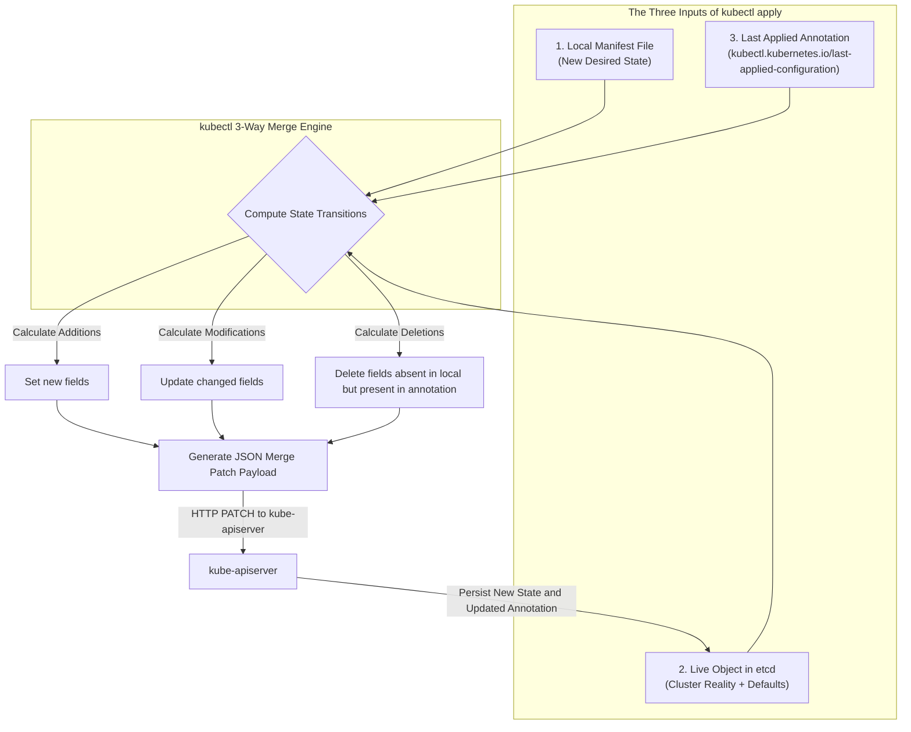
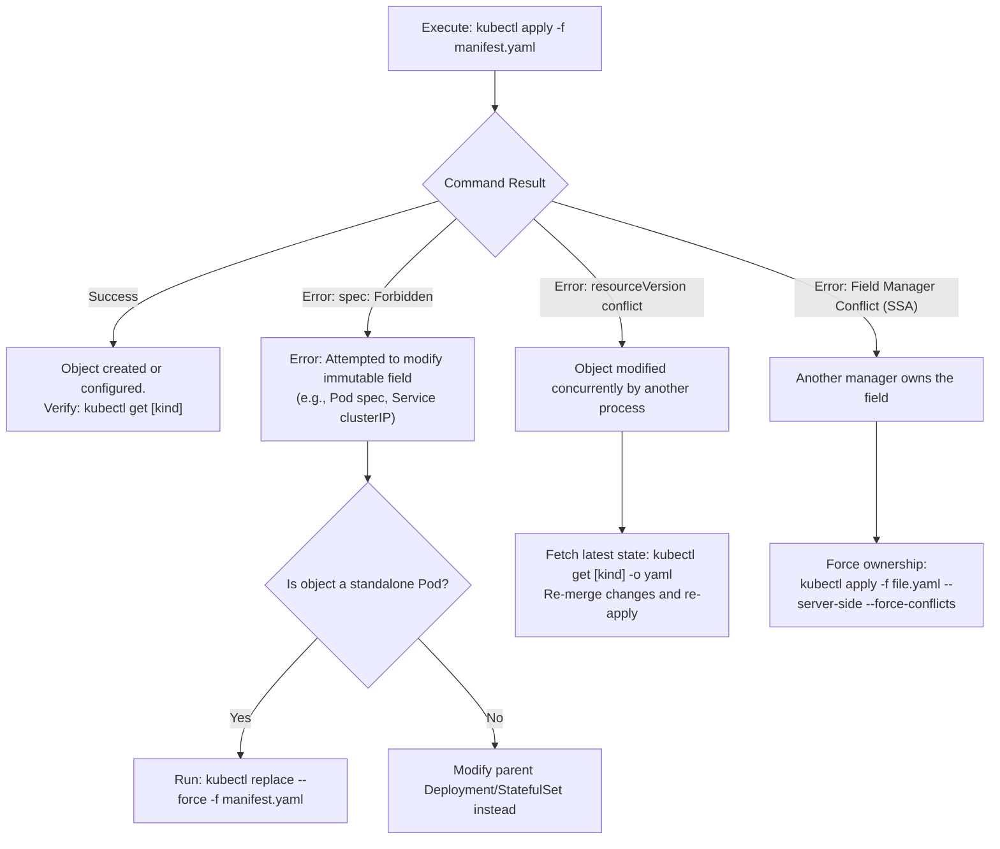

# Kubernetes Declarative Object Management (`kubectl apply` & 3-Way Merge) - CKA Exam Notes

> **Exam Domain**: Core Concepts (15%) / Cluster Architecture, Installation & Configuration (25%) / Troubleshooting (30%)  
> **Weight / Importance**: High (Underpins all declarative GitOps workflows, automated deployments, and manifest reconciliation in Kubernetes)  
> **Target Version**: Verified against v1.31 / v1.32 (Current CKA Curriculum)  
> **Allowed Docs Search Keywords**: `kubectl apply`, `last-applied-configuration`, `3-way merge`, `managedFields`, `kubectl diff`  
> **Source**: Generated from `core-concepts/kubectl-apply-raw.md`

---

## 1. Quick-Reference Summary

- **Core Function of `kubectl apply`**: The standard declarative CLI command used to create, update, and reconcile Kubernetes resources from local YAML or JSON manifests.
- **The 3-Way Merge Mechanism**: `kubectl apply` computes updates by comparing three distinct records:
  1. **The Local Manifest File**: The developer's desired state.
  2. **The Live Object Record in `etcd`**: The current state of the cluster, including runtime status and server-assigned defaults.
  3. **The `last-applied-configuration` Annotation**: The exact snapshot of the manifest submitted during the previous `kubectl apply`.
- **Where `last-applied-configuration` Resides**:
  - It is serialized as a JSON string and stored directly inside the live object's metadata in `etcd`:
    ```yaml
    metadata:
      annotations:
        kubectl.kubernetes.io/last-applied-configuration: "{\"apiVersion\":\"v1\",\"kind\":\"Pod\"...}"
    ```
- **Why Simple Overwrite Fails**:
  - Without comparing against `last-applied-configuration`, Kubernetes cannot distinguish between:
    - A field intentionally removed by the user from their local YAML.
    - A field automatically injected by the control plane (e.g., `clusterIP`, admission webhooks, or horizontal autoscalers).
- **Inspecting Last-Applied Configuration**:
  ```bash
  kubectl get <kind> <name> -o jsonpath='{.metadata.annotations.kubectl\.kubernetes\.io/last-applied-configuration}' | jq .
  ```
- **Previewing Changes Safely**:
  ```bash
  kubectl diff -f manifest.yaml
  ```
- **Client-Side Apply (CSA) vs. Server-Side Apply (SSA)**:
  - CSA (default `kubectl apply`): Merge calculation happens locally in `kubectl` memory; tracks changes via the annotation.
  - SSA (`kubectl apply --server-side`): Merge calculation happens in `kube-apiserver`; tracks field-level ownership via `metadata.managedFields`.

---

## 2. Conceptual Overview & Mental Model

### Dual-Layer Architectural Understanding

- **Simple English Explanation (How It Works)**:
  - **The Problem with 2-Way Diffs in Distributed Systems**:
    In a Kubernetes cluster, a live resource is never just a 1-to-1 copy of your local YAML file. When you submit a Service manifest declaring port 80, the control plane allocates a virtual cluster IP (`spec.clusterIP`), generates an endpoints list, and adds runtime timestamps. 
    If you later edit your local YAML and apply it using a naive 2-way comparison (comparing only your local file against the live object in `etcd`):
    - If the tool overwrote the live object completely with your local file, it would destroy the server-allocated `clusterIP` and runtime status.
    - If the tool simply merged your local file into the live object without knowing what was there previously, and you decided to delete a label or port from your local file, the tool would have no way of knowing whether you intended to delete that field, or if you simply didn't mention it. The deleted field would remain permanently on the cluster.
  - **The 3-Way Merge Solution**:
    Kubernetes resolves this by saving a receipt of what you applied last time. When you run `kubectl apply -f file.yaml`, `kubectl` converts your local manifest into a minified JSON string and injects it as an annotation (`kubectl.kubernetes.io/last-applied-configuration`) on the live object itself.
    On subsequent executions of `kubectl apply`, `kubectl` looks at three inputs:
    1. What did you write in the local file right now?
    2. What is currently stored in `etcd`?
    3. What does the `last-applied-configuration` annotation say you wrote last time?
    - If a field was in the previous annotation but is missing from your new local file, `kubectl` knows with certainty that **you deliberately removed it**, and deletes it from the live object.
    - If a field is in the live object but was never in the annotation or local file, `kubectl` recognizes it as **server-generated** and leaves it alone.



- **Standard / Production Definition**:
  - **Declarative 3-Way Strategic Merge Patch**: A declarative reconciliation algorithm in which the desired configuration, the current live state, and the recorded previous configuration are compared to compute an idempotent delta patch. This allows multi-actor declarative state management without wiping out independent fields managed by control plane admission webhooks or controllers.
  - **Last-Applied-Configuration Annotation**: A system metadata annotation (`kubectl.kubernetes.io/last-applied-configuration`) populated by client-side tooling that stores the serialized JSON representation of the applied specification in the resource's metadata, serving as the historical baseline for strategic merge patching.

---

## 3. Deep-Dive Technical Breakdown

### 3.1 Field Reconciliation Decision Matrix

When `kubectl apply` reconciles differences across the three sources, it evaluates every key using the following deterministic logic:

| Scenario | Local File | Last Applied Annotation | Live State in `etcd` | Reconciliation Action Taken |
| :--- | :--- | :--- | :--- | :--- |
| **New Field Added** | Present (`valA`) | Absent | Absent | **Set field** to `valA` in live object. |
| **Field Modified** | Present (`valB`) | Present (`valA`) | Present (`valA`) | **Update field** to `valB` in live object. |
| **Field Deleted by User** | Absent | Present (`valA`) | Present (`valA`) | **Delete field** from live object. |
| **Server-Injected Default** | Absent | Absent | Present (`clusterIP`) | **Retain field** untouched in live object. |
| **External Live Modification** | Present (`valB`) | Present (`valA`) | Present (`valC`) | **Conflict / Overwrite**: Local `valB` takes precedence over live `valC`. |

---

### 3.2 Anatomy of the `last-applied-configuration` Annotation

When an object is created or updated via `kubectl apply`, `kube-apiserver` stores the full schema in `etcd`. Inspecting the raw YAML of a deployed workload exposes the annotation:

```yaml
apiVersion: apps/v1
kind: Deployment
metadata:
  name: nginx-deployment
  namespace: default
  annotations:
    deployment.kubernetes.io/revision: "1"
    kubectl.kubernetes.io/last-applied-configuration: |
      {"apiVersion":"apps/v1","kind":"Deployment","metadata":{"annotations":{},"name":"nginx-deployment","namespace":"default"},"spec":{"replicas":3,"selector":{"matchLabels":{"app":"nginx"}},"template":{"metadata":{"labels":{"app":"nginx"}},"spec":{"containers":[{"image":"nginx:1.25","name":"nginx","ports":[{"containerPort":80}]}]}}}}
spec:
  replicas: 3
  selector:
    matchLabels:
      app: nginx
...
```

#### Key Characteristics:
1. **Self-Contained in the Cluster**: Because the annotation is stored in `etcd` inside the object's `metadata`, any team member, CI/CD pipeline, or automated agent running `kubectl apply` from any machine has access to the exact baseline of the previous deployment.
2. **Minified JSON**: The annotation strips out unnecessary whitespace and comments to conserve `etcd` storage space.
3. **Size Limitations**: Extremely large resource manifests (approaching `etcd`'s 1.5MB request limit or Kubernetes annotation size thresholds) can cause client-side apply to fail, which is one reason **Server-Side Apply (SSA)** was introduced.

---

### 3.3 Client-Side Apply (CSA) vs. Server-Side Apply (SSA)

Kubernetes supports two distinct apply paradigms:

| Feature / Metric | Client-Side Apply (CSA - Default) | Server-Side Apply (SSA - `--server-side`) |
| :--- | :--- | :--- |
| **Execution Location** | In local `kubectl` binary on client machine | Inside `kube-apiserver` control plane |
| **Tracking Mechanism** | `kubectl.kubernetes.io/last-applied-configuration` annotation | `metadata.managedFields` tracking field managers |
| **Conflict Detection** | "Last writer wins" (overwrites fields unless using resourceVersion) | Detects field ownership conflicts; requires `--force-conflicts` |
| **Large Manifest Handling** | Subject to annotation string length limits | Handles massive manifests natively in the API server |
| **Invocation Command** | `kubectl apply -f manifest.yaml` | `kubectl apply -f manifest.yaml --server-side` |

---

## 4. Command Translation & Operational Mapping Tables

### Comparing Kubernetes Object Modification Verbs

| Command | Mechanism | Idempotent? | Overwrites Controller Fields? | Recommended Use Case |
| :--- | :--- | :--- | :--- | :--- |
| `kubectl create -f file.yaml` | Imperative Create (HTTP `POST`) | **No** (fails if object exists) | No | Initial creation of objects when uniqueness must be enforced. |
| `kubectl replace -f file.yaml` | Imperative Replace (HTTP `PUT`) | **Yes** (if object exists) | **Yes** (wipes unlisted live fields) | Forcing total replacement of an object spec. |
| `kubectl replace --force -f file.yaml` | Immediate Delete + Create | **Yes** | **Yes** (generates fresh UID) | Immediate recovery and replacement of immutable Pod specs. |
| `kubectl apply -f file.yaml` | Declarative 3-Way Merge Patch | **Yes** | **No** (preserves server-injected defaults) | **Standard production and exam method** for declarative workloads. |
| `kubectl patch <kind> <name> -p '...'` | In-place JSON/Strategic Patch | **Yes** | **No** | Quick programmatic updates to a single field. |

---

## 5. High-Yield CLI & Verification Commands

```bash
# 1. Declaratively apply a manifest file
kubectl apply -f deployment.yaml

# 2. Declaratively apply all manifests in a directory
kubectl apply -f ./manifests/

# 3. Apply manifests recursively across subdirectories
kubectl apply -f ./manifests/ -R

# 4. Preview diff between local file and cluster reality without applying
kubectl diff -f deployment.yaml

# 5. Extract and format the last-applied-configuration annotation with jq
kubectl get deployment webapp -o jsonpath='{.metadata.annotations.kubectl\.kubernetes\.io/last-applied-configuration}' | jq .

# 6. Apply using Server-Side Apply (SSA)
kubectl apply -f deployment.yaml --server-side

# 7. Inspect field managers tracked by Server-Side Apply
kubectl get deployment webapp -o jsonpath='{.metadata.managedFields}' | jq .
```

---

## 6. Troubleshooting & Diagnostic Runbook

### Decision Tree: Resolving `kubectl apply` Errors



### Step-by-Step Triage Sequence

1. **Viewing Pending Modifications with `kubectl diff`**:
   Before running `kubectl apply` in a sensitive environment or during exam verification, run:
   ```bash
   kubectl diff -f manifest.yaml
   ```
   - Lines with `-` represent fields that will be removed from the live cluster.
   - Lines with `+` represent fields that will be added or updated.

2. **Resolving `spec: Forbidden` on Standalone Pods**:
   - `kubectl apply` cannot update immutable fields on running Pods (such as `ports`, `env`, or `volumes`).
   - Triage: Use `kubectl replace --force -f manifest.yaml` to trigger an immediate delete/recreate cycle.

3. **Recovering Missing `last-applied-configuration`**:
   - If an object was initially created using `kubectl create -f` instead of `kubectl apply -f`, the `last-applied-configuration` annotation is absent.
   - Running `kubectl apply -f file.yaml` for the first time on such an object automatically creates the annotation and performs a 2-way merge baseline for future 3-way merges.

---

## 7. CKA Exam Tips, Gotchas & Traps

> [!WARNING]
> **The `kubectl edit` vs. `kubectl apply` Configuration Drift Trap**:
> If you create a resource using `kubectl apply -f app.yaml`, and later run `kubectl edit deployment app` to change an image, only the live object in `etcd` is updated. The local `app.yaml` file remains stale. If you subsequently re-run `kubectl apply -f app.yaml`, the 3-way merge will detect that the old image is in `app.yaml` and overwrite your live changes, reverting the application. Always keep local YAML files synchronized with live changes.

> [!IMPORTANT]
> **Do Not Hand-Craft `last-applied-configuration`**:
> Never manually edit the `kubectl.kubernetes.io/last-applied-configuration` annotation. It is managed exclusively by the `kubectl` apply engine. Corrupting this JSON string breaks future declarative merges for that object.

> [!TIP]
> **Use `--dry-run=client -o yaml` Before Applying**:
> If unsure whether your YAML has valid syntax:
> ```bash
> kubectl apply -f manifest.yaml --dry-run=client
> ```
> This validates field names and basic schema client-side without submitting any payload to `kube-apiserver`.

---

## 8. Self-Test / Active Recall

1. **What are the three components evaluated by `kubectl apply` to perform a 3-way merge patch?**
2. **Where is the `last-applied-configuration` stored in the Kubernetes cluster?**
3. **If a field is deleted from a local YAML file and `kubectl apply -f` is executed, how does Kubernetes know to remove that field from the live object?**
4. **Why does `kubectl apply` retain a Service's `clusterIP` even though `clusterIP` is absent from the local YAML manifest?**
5. **What command allows you to preview the exact JSON/unified diff between a local YAML file and the live cluster state?**
6. **How does Server-Side Apply (SSA) track field ownership compared to Client-Side Apply (CSA)?**
7. **What is the operational danger of modifying a live object with `kubectl edit` if that object is maintained via `kubectl apply -f` in GitOps?**

<details>
<summary>Reveal Answers</summary>

1. The Local Manifest File, the Live Object State in `etcd`, and the `last-applied-configuration` annotation.
2. Inside the live object's metadata in `etcd`, specifically in `metadata.annotations["kubectl.kubernetes.io/last-applied-configuration"]`.
3. It compares the local file against the `last-applied-configuration` annotation. Because the field is recorded in the annotation but missing from the local file, `kubectl` concludes that the user explicitly removed it and issues a deletion patch.
4. Because `clusterIP` is absent from both the local file and the `last-applied-configuration` annotation. The merge engine recognizes it as a server-injected default and leaves it untouched.
5. `kubectl diff -f <file.yaml>`.
6. CSA stores a single JSON string in an annotation (`last-applied-configuration`), whereas SSA tracks individual field managers inside `metadata.managedFields` within the API server.
7. `kubectl edit` modifies only the live state in `etcd`. Because the local file is not updated, the next `kubectl apply -f` will detect the discrepancy and overwrite the manual changes with the stale local file.
</details>

---

### Official Documentation Bookmarks

Allowed for reference during the live exam at [kubernetes.io/docs](https://kubernetes.io/docs/home/):

| Topic | Direct Search Term | Recommended Anchor |
| :--- | :--- | :--- |
| **Managing Resources Declaratively** | `Declarative Management` | Tasks > Manage Kubernetes Objects > Declarative Management of Kubernetes Objects Using Configuration Files |
| **Apply Command Reference** | `kubectl apply` | Reference > Command-Line Tools > kubectl > kubectl apply |
| **Server-Side Apply** | `Server-Side Apply` | Reference > API Concepts > Server-Side Apply |
| **Diff Command Reference** | `kubectl diff` | Reference > Command-Line Tools > kubectl > kubectl diff |
