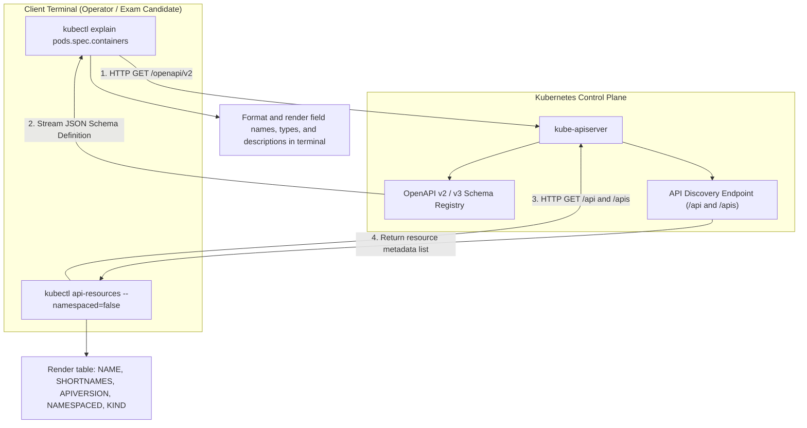
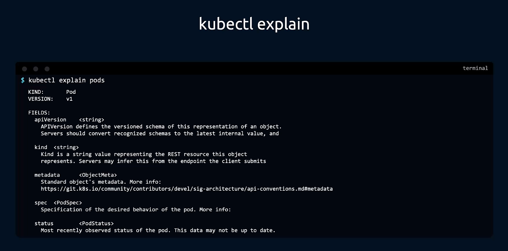
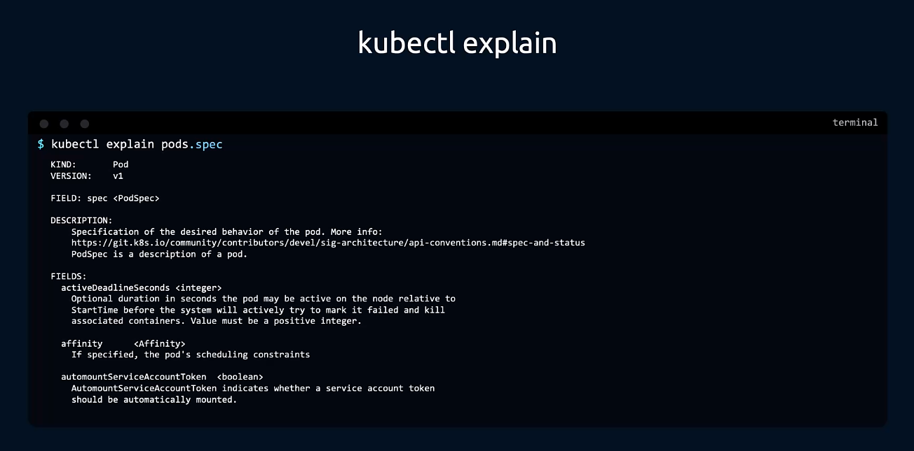
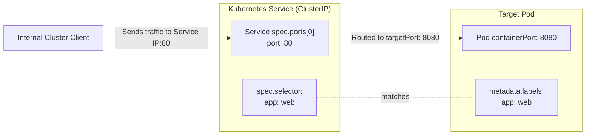
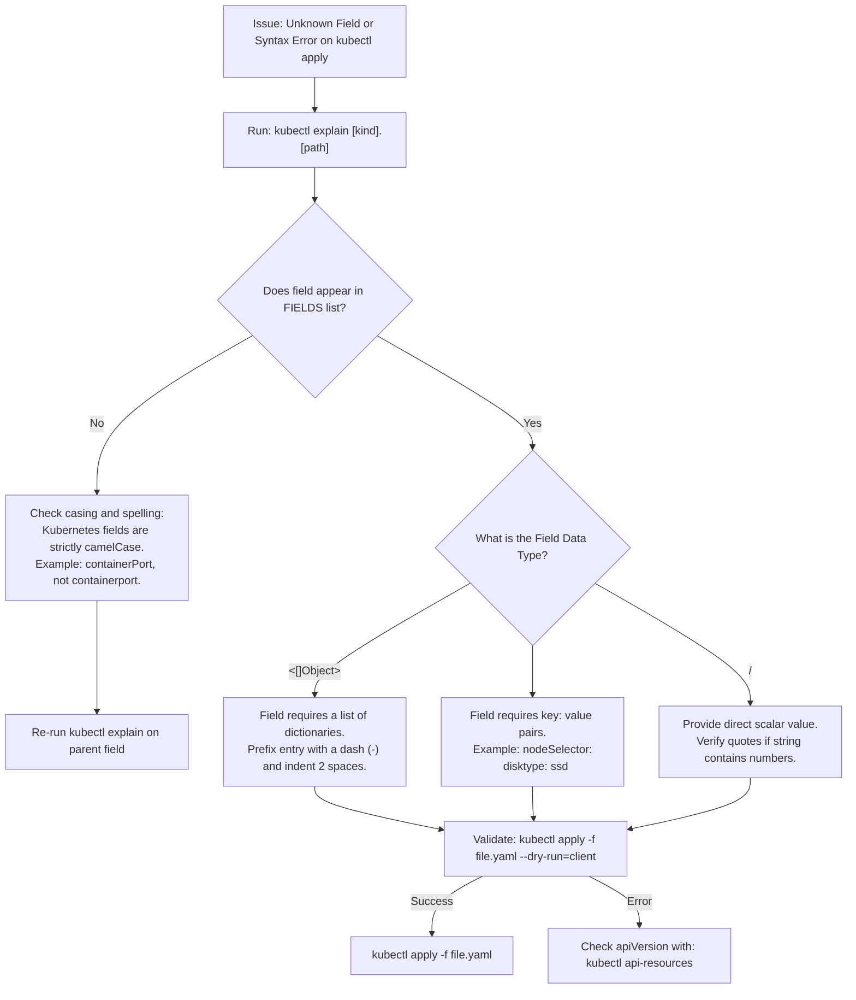

# Kubernetes API Resource Discovery & Schema Inspection (`api-resources` & `explain`) - CKA Exam Notes

> **Exam Domain**: Cluster Architecture, Installation & Configuration (25%) / Core Concepts & Workloads (15%)  
> **Weight / Importance**: Essential (The primary in-terminal mechanism for verifying YAML field syntax, API groups, and rapid object exposure under time constraints)  
> **Target Version**: Verified against v1.31 / v1.32 (Current CKA Curriculum)  
> **Allowed Docs Search Keywords**: `kubectl explain`, `kubectl api-resources`, `kubectl expose`, `imperative commands`  
> **Source**: Generated from `core-concepts/kubectl-explain-cmd-raw.md`

---

## 1. Quick-Reference Summary

- **`kubectl api-resources`**: Queries the `kube-apiserver` discovery endpoints to list all resource types registered in the cluster.
  - Outputs: `NAME`, `SHORTNAMES`, `APIVERSION`, `NAMESPACED` (`true`/`false`), and `KIND`.
  - Filter cluster-scoped resources: `kubectl api-resources --namespaced=false` (e.g., `nodes`, `namespaces`, `persistentvolumes`, `clusterroles`).
  - Filter namespaced resources: `kubectl api-resources --namespaced=true` (e.g., `pods`, `services`, `deployments`).
  - Filter by API group: `kubectl api-resources --api-group=apps`.
- **`kubectl explain`**: Queries the cluster's OpenAPI schema (`/openapi/v2` or `/openapi/v3`) to print in-terminal documentation, field types, and descriptions for any resource without leaving the shell.
  - Basic usage: `kubectl explain <resource>` (e.g., `kubectl explain pods` or `kubectl explain deployment`).
  - Inspect nested properties: `kubectl explain <resource>.<field>.<subfield>` (e.g., `kubectl explain pods.spec.containers.env`).
  - View full schema hierarchy: `kubectl explain <resource> --recursive` (best paired with `grep` or `less`).
- **`kubectl expose` Mechanics**:
  - Automatically creates a `Service` targeting an existing workload (`Pod`, `Deployment`, `ReplicaSet`) using the target's labels as the Service `spec.selector`.
  - **Default Service Type**: `ClusterIP` (unless `--type=NodePort` or `--type=LoadBalancer` is specified).
  - **Port vs. TargetPort Verification**: When `--port=<P>` is specified without `--target-port`, Kubernetes automatically **defaults `targetPort` to the identical port number as `port`**. If the container listens on a different port, `--target-port` must be explicitly declared (e.g., `--port=80 --target-port=8080`).
- **Rapid CKA Imperative Scaffolding**:
  - Pod: `kubectl run custom-nginx --image=nginx --port=8080`
  - Deployment: `kubectl create deployment redis-deploy --image=redis --replicas=2 -n dev-ns`
  - Expose Pod: `kubectl expose pod httpd --name=httpd --port=80`

---

## 2. Conceptual Overview & Mental Model

### Dual-Layer Architectural Understanding

- **Simple English Explanation (How It Works)**:
  - **The Documentation Problem in Timed Exams**:
    During the practical CKA exam, candidates frequently forget the exact spelling or capitalization of nested YAML fields (for example, is it `terminationGracePeriodSeconds` or `gracePeriodSeconds`? Is `containerPort` singular or plural?). Navigating the official Kubernetes documentation website in an embedded exam browser tab is slow, searches can return hundreds of versioned links, and copy-pasting across network latencies introduces errors.
  - **How `kubectl explain` Works**:
    `kube-apiserver` embeds a complete OpenAPI specification describing every registered Kubernetes API resource and field. When you run `kubectl explain pods.spec`, `kubectl` does not query the internet. Instead, it queries the local `kube-apiserver` OpenAPI endpoint, parses the schema definition, and displays the exact field names, expected data types (`<string>`, `<integer>`, `<[]Object>`), and descriptions directly in your terminal.
  - **How `kubectl api-resources` Works**:
    Kubernetes organizes objects into RESTful API groups. Different resources live under different versions (`v1`, `apps/v1`, `batch/v1`, `rbac.authorization.k8s.io/v1`). When authoring manifests, knowing whether a resource is namespaced or cluster-scoped and what API version it requires is essential. `kubectl api-resources` fetches the API server's discovery list, showing every kind, short name, and its namespace-scoping model.



- **Standard / Production Definition**:
  - **OpenAPI Schema Introspection**: `kubectl explain` provides command-line reflection into the OpenAPI specification exposed by the Kubernetes API server. It enables schema discovery, field path traversal, and type validation directly from the authoritative runtime schema of the target cluster.
  - **API Discovery Aggregation**: `kubectl api-resources` reads the API server's aggregated discovery document, providing a comprehensive directory of registered GVKs (Group, Version, Kind), their singular/plural REST endpoints, short names, and namespace isolation boundaries.

---

## 3. Deep-Dive Technical Breakdown

### 3.1 Inspecting Resources with `kubectl explain`



When you execute `kubectl explain <resource>`, `kubectl` outputs:
- `KIND`: The registered resource Kind (e.g., `Pod`, `Deployment`, `Service`).
- `VERSION`: The preferred API version (e.g., `v1`, `apps/v1`).
- `FIELDS`: Top-level root keys of the resource manifest (`apiVersion`, `kind`, `metadata`, `spec`, `status`).

#### Traversing Nested Fields with Dot Notation



Appending field paths allows deep traversal of complex object schemas:
```bash
kubectl explain pods.spec
```

The output contains:
1. `FIELD`: Current property being inspected and its data type (e.g., `spec <PodSpec>`).
2. `DESCRIPTION`: Official Kubernetes API description explaining the purpose of the field.
3. `FIELDS`: Subproperties, each accompanied by its data type indicator:
   - `<string>`: Single text value (e.g., `dnsPolicy <string>`).
   - `<integer>`: Numeric integer value (e.g., `activeDeadlineSeconds <integer>`).
   - `<boolean>`: Boolean flag (`true` / `false`, e.g., `hostNetwork <boolean>`).
   - `<[]string>`: List / array of strings.
   - `<[]Object>`: List of nested objects (requires a leading hyphen `-` in YAML).
   - `<map[string]string>`: Key-value dictionary (e.g., `nodeSelector <map[string]string>`).

#### Using the `--recursive` Flag
To view the complete property tree without drilling down level-by-level:
```bash
kubectl explain pods.spec.containers --recursive
```
Because this prints hundreds of lines, pipe the result to `grep` or `less` to find exact field names:
```bash
kubectl explain pods.spec --recursive | grep -i securitycontext
```

---

### 3.2 Discovering Cluster Schema with `kubectl api-resources`

The `kubectl api-resources` command outputs a tabular overview of every object type available in the cluster:

```text
NAME         SHORTNAMES   APIVERSION   NAMESPACED   KIND
bindings                  v1           true         Binding
componentstatuses   cs    v1           false        ComponentStatus
configmaps          cm    v1           true         ConfigMap
endpoints           ep    v1           true         Endpoints
events              ev    v1           true         Event
namespaces          ns    v1           false        Namespace
nodes               no    v1           false        Node
persistentvolumes   pv    v1           false        PersistentVolume
persistentvolumeclaims pvc v1          true         PersistentVolumeClaim
pods                po    v1           true         Pod
services            svc   v1           true         Service
deployments         deploy apps/v1     true         Deployment
```

#### Understanding the `NAMESPACED` Column
A critical distinction in Kubernetes architecture is whether a resource is isolated by Namespaces or exists globally across the entire cluster:

| Scope | `NAMESPACED` Value | Common Examples | Behavioral Impact |
| :--- | :--- | :--- | :--- |
| **Namespaced** | `true` | `Pods`, `Services`, `Deployments`, `ConfigMaps`, `Secrets`, `PersistentVolumeClaims`, `ServiceAccounts`, `Roles`, `RoleBindings` | Can share identical names across different namespaces; deleted automatically when parent namespace is deleted. |
| **Cluster-Scoped** | `false` | `Nodes`, `Namespaces`, `PersistentVolumes`, `ClusterRoles`, `ClusterRoleBindings`, `StorageClasses`, `IngressClasses` | Must have globally unique names; accessible cluster-wide regardless of current namespace context. |

#### Filtering `api-resources`
```bash
# List only non-namespaced (cluster-scoped) resources
kubectl api-resources --namespaced=false

# List only namespaced resources
kubectl api-resources --namespaced=true

# List resources belonging to a specific API group
kubectl api-resources --api-group=rbac.authorization.k8s.io

# Show supported REST verbs for each resource (create, delete, list, watch, etc.)
kubectl api-resources -o wide
```

---

### 3.3 `kubectl expose` Port vs. TargetPort Verification

The raw notes raised an essential question:
> *`kubectl expose pod redis --name redis-service --port=6379` creates a service of type ClusterIP with port 6379; does this imply target port is also 6379 when not specified?*

#### Verified Technical Behavior:
- **Default Service Type**: When `--type` is omitted, `kubectl expose` **always defaults to `ClusterIP`**.
- **Port vs. TargetPort Inheritance**:
  - In a Kubernetes Service, `spec.ports[].port` is the port exposed **on the Service IP** (inside the cluster).
  - `spec.ports[].targetPort` is the port on the container inside the Pod where traffic is routed.
  - When `--target-port` is **not specified** on the CLI, `kubectl expose` **sets `targetPort` to be exactly identical to `--port`**.
  - If the container listens on port `8080` but the Service should expose port `80`, you **must** supply both flags:
    ```bash
    kubectl expose pod web --port=80 --target-port=8080
    ```
- **Automatic Label Selector Mapping**:
  `kubectl expose` inspects the target resource (`Pod` or `Deployment`), extracts its `metadata.labels`, and automatically copies them into the Service's `spec.selector`. This ensures the Service immediately selects the target Pods without manual YAML configuration.



---

## 4. Declarative Manifests & Scaffolding Patterns

### Generating Manifests via `kubectl explain` Reference

When exam questions require advanced fields not supported by imperative CLI flags (e.g., `livenessProbe` with `httpGet`, `envFrom`, or `nodeAffinity`), use `kubectl explain` to verify the structure, generate a clean base with `--dry-run=client -o yaml`, and inject the fields:

```bash
# 1. Look up exact syntax for livenessProbe
kubectl explain pods.spec.containers.livenessProbe.httpGet

# 2. Generate clean baseline pod manifest
kubectl run webapp --image=nginx --port=80 --dry-run=client -o yaml > pod.yaml
```

#### Final Augmented Manifest (`pod.yaml`):
```yaml
apiVersion: v1
kind: Pod
metadata:
  name: webapp
  labels:
    app: webapp
spec:
  containers:
  - name: webapp
    image: nginx
    ports:
    - containerPort: 80
    # Injected verified fields from kubectl explain:
    livenessProbe:
      httpGet:
        path: /healthz
        port: 80
      initialDelaySeconds: 5
      periodSeconds: 10
```

---

## 5. Command Translation & Operational Mapping Tables

### Discovery & Inspection Command Reference

| Operational Need | Primary Command | Alternative / Filter |
| :--- | :--- | :--- |
| **Find Short Names** | `kubectl api-resources` | `kubectl api-resources \| grep -i <kind>` |
| **Check Namespace Scoping** | `kubectl api-resources --namespaced=false` | `kubectl api-resources --namespaced=true` |
| **Find API Version of a Kind** | `kubectl api-resources \| grep -i <kind>` | `kubectl explain <kind> \| grep VERSION` |
| **Look Up Root Fields** | `kubectl explain <kind>` | `kubectl explain <shortname>` |
| **Look Up Nested Field** | `kubectl explain <kind>.<field>` | `kubectl explain <kind>.<field>.<subfield>` |
| **Find Supported Verbs** | `kubectl api-resources -o wide` | `kubectl auth can-i --list` |
| **Expose Pod as Service** | `kubectl expose pod <p> --port=<P>` | `kubectl create service clusterip ...` |
| **Expose with Different Port** | `kubectl expose pod <p> --port=80 --target-port=8080` | `kubectl create service ... --tcp=80:8080` |

---

## 6. High-Yield CLI & Imperative Commands

### 6.1 Practical Imperative Drills (From Raw Notes)

```bash
# 1. Create a pod called custom-nginx on port 8080
kubectl run custom-nginx --image=nginx --port=8080

# 2. Create a new namespace
kubectl create namespace dev-ns

# 3. Create a deployment in a specific namespace with 2 replicas
kubectl create deployment redis-deploy --image=redis --replicas=2 -n dev-ns

# 4. Create a multi-replica webapp deployment
kubectl create deployment webapp --image=kodekloud/webapp-color --replicas=3

# 5. One-liner: Run httpd pod and expose it as ClusterIP on port 80
kubectl run httpd --image=httpd:alpine
kubectl expose pod httpd --name=httpd --port=80

# 6. Expose Redis pod as a service named redis-service on port 6379
kubectl expose pod redis --name=redis-service --port=6379
```

### 6.2 Advanced Discovery & Schema Lookups

```bash
# 1. Discover all resources that do NOT belong to any namespace
kubectl api-resources --namespaced=false -o name

# 2. Check if PersistentVolume is namespaced
kubectl api-resources | grep -i persistentvolume

# 3. Find exact syntax for readiness probe exec command
kubectl explain pods.spec.containers.readinessProbe.exec

# 4. Find exact structure of container volumeMounts
kubectl explain pods.spec.containers.volumeMounts

# 5. Look up securityContext capabilities syntax
kubectl explain pods.spec.containers.securityContext.capabilities
```

---

## 7. Troubleshooting & Diagnostic Runbook

### Decision Tree Flowchart: Resolving Unknown Fields & Schema Errors



### Step-by-Step Triage Sequence

1. **Diagnosing `error: error validating "": error finding REST mapping`**:
   - Cause: The `apiVersion` or `kind` in your YAML is incorrect or not installed.
   - Solution: Run `kubectl api-resources | grep -i <kind>` to confirm the exact `APIVERSION` and `KIND` spelling.

2. **Diagnosing `error: error converting YAML to JSON: did not find expected key`**:
   - Cause: Indentation error or list hyphens placed at incorrect column depth.
   - Solution: Run `kubectl explain <resource>.<field>` to inspect whether child keys belong to an object or a list of objects (`<[]Object>`).

3. **Verifying Service Endpoint Generation**:
   - When using `kubectl expose`, if traffic does not reach your Pods:
     ```bash
     # Check if the service generated valid endpoints
     kubectl get endpoints <service-name>
     ```
   - If endpoints list is `<none>`, the Service's `spec.selector` does not match the Pod's `metadata.labels`.

---

## 8. CKA Exam Tips, Gotchas & Traps

> [!WARNING]
> **Singular vs. Plural Resource Names in `kubectl explain`**:
> `kubectl explain` accepts both singular and plural forms (e.g., `kubectl explain pod` and `kubectl explain pods` both work). However, subfields **must match the exact schema casing**:
> - `kubectl explain pods.spec.containers` (Correct)
> - `kubectl explain pods.spec.Containers` (Fails: case-sensitive)

> [!IMPORTANT]
> **The `targetPort` Default Trap**:
> When using `kubectl expose`, omitting `--target-port` defaults to the same number as `--port`. If the exam prompt states: *"Expose pod webapp on port 80, routing to container port 8080"*, running `kubectl expose pod webapp --port=80` will route to port 80 and fail test checks. You **must** pass `--port=80 --target-port=8080`.

> [!TIP]
> **Cluster-Scoped Resources Quick Check**:
> In the exam, questions sometimes ask you to create or bind resources in a specific namespace. Remembering which resources are NOT namespaced avoids wasting time adding `-n <namespace>` flags:
> ```bash
> kubectl api-resources --namespaced=false
> ```
> Key cluster-scoped resources to memorize: `Node` (`no`), `Namespace` (`ns`), `PersistentVolume` (`pv`), `ClusterRole`, `ClusterRoleBinding`, `StorageClass` (`sc`).

---

## 9. Self-Test / Active Recall

1. **What command displays the complete list of cluster-scoped (non-namespaced) resources?**
2. **What does the data type indicator `<[]Object>` in `kubectl explain` signify for YAML manifest indentation?**
3. **If you execute `kubectl expose pod nginx --port=8080` without specifying `--target-port`, what value will `targetPort` receive in the generated Service?**
4. **What flag can you append to `kubectl explain pods.spec` to output every nested subfield recursively?**
5. **How can you quickly find the short name and API version for HorizontalPodAutoscalers using `kubectl`?**
6. **Are `PersistentVolumes` and `PersistentVolumeClaims` both namespaced? Explain the distinction.**
7. **What flag on `kubectl api-resources` allows you to inspect the supported REST verbs (`get`, `list`, `create`, `delete`) for each resource?**

<details>
<summary>Reveal Answers</summary>

1. `kubectl api-resources --namespaced=false`.
2. It signifies a list of objects. In YAML, each element must begin with a hyphen (`-`) and child fields must be indented relative to the hyphen.
3. It defaults to `8080` (identical to `--port`).
4. `--recursive` (e.g., `kubectl explain pods.spec --recursive`).
5. `kubectl api-resources | grep -i horizontalpodautoscaler` (or `grep -i hpa`).
6. No. `PersistentVolume` (`pv`) is cluster-scoped (`NAMESPACED: false`), whereas `PersistentVolumeClaim` (`pvc`) is namespaced (`NAMESPACED: true`).
7. `-o wide` (e.g., `kubectl api-resources -o wide`).
</details>

---

### Official Documentation Bookmarks

Allowed for reference during the live exam at [kubernetes.io/docs](https://kubernetes.io/docs/home/):

| Topic | Direct Search Term | Recommended Anchor |
| :--- | :--- | :--- |
| **API Resources Discovery** | `kubectl api-resources` | Reference > Command-Line Tools > kubectl > kubectl api-resources |
| **Explain Command Reference** | `kubectl explain` | Reference > Command-Line Tools > kubectl > kubectl explain |
| **Expose Command Reference** | `kubectl expose` | Reference > Command-Line Tools > kubectl > kubectl expose |
| **Kubernetes API Overview** | `The Kubernetes API` | Concepts > Overview > Working with Kubernetes Objects > The Kubernetes API |
