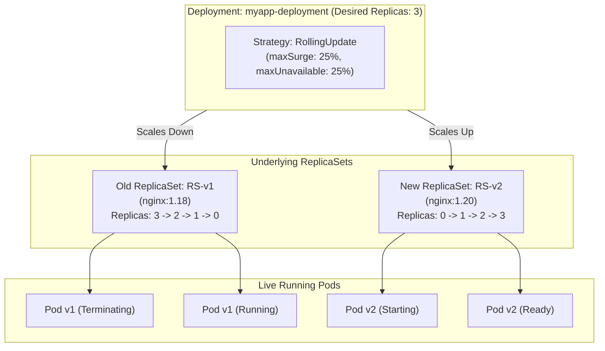
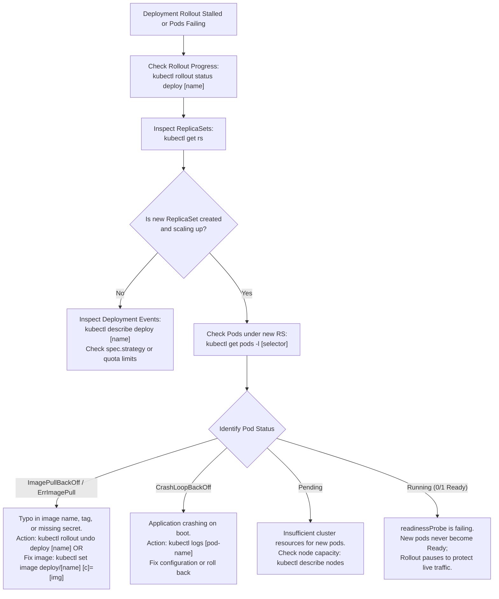

# Kubernetes Deployments & Rollout Management - CKA Exam Notes

> **Exam Domain**: Workloads & Scheduling (15%) / Troubleshooting (30%)  
> **Weight / Importance**: Critical (The primary workload abstraction tested across the CKA exam)  
> **Target Version**: Verified against v1.31 / v1.32 (Current CKA Curriculum)  
> **Allowed Docs Search Keywords**: `deployments`, `rolling update`, `rollout undo`, `maxSurge`, `maxUnavailable`, `revisionHistoryLimit`  
> **Source**: Generated from `deployment-raw.md`

---

## 1. Quick-Reference Summary

- **Primary Role**: The higher-level declarative workload controller that manages Pods through underlying ReplicaSets. Provides declarative zero-downtime rolling updates, automated rollbacks, revision history tracking, pausing/resuming, and horizontal scaling.
- **The Three-Tier Workload Hierarchy**:
  $$\textbf{Deployment} \longrightarrow \textbf{ReplicaSet} \longrightarrow \textbf{Pods}$$
  Deployments **do not manage Pods directly**. A Deployment creates and scales ReplicaSets; each ReplicaSet provisions and monitors the actual Pods.
- **Rollout Trigger Rule**: **Only modifications to the Pod template (`spec.template`) trigger a rollout and create a new ReplicaSet**. Modifying top-level fields (such as `spec.replicas`) scales the active ReplicaSet in-place without creating a new revision.
- **Update Strategies**:
  - **`RollingUpdate` (Default)**: Gradually replaces old Pods with new ones. Regulated by `maxSurge` (maximum surplus pods allowed, default: `25%`) and `maxUnavailable` (maximum allowable offline pods, default: `25%`).
  - **`Recreate`**: All old Pods are terminated simultaneously before new Pods are spawned. Incurs application downtime, but guarantees no two versions run concurrently.
- **Essential Rollout Subcommands**:
  - Check status: `kubectl rollout status deployment/<name>`
  - View revision history: `kubectl rollout history deployment/<name>`
  - Roll back to previous revision: `kubectl rollout undo deployment/<name>`
  - Roll back to specific revision: `kubectl rollout undo deployment/<name> --to-revision=<N>`
  - Restart all pods without spec changes: `kubectl rollout restart deployment/<name>`
- **Naming Architecture (`pod-template-hash`)**:
  - Deployment: `myapp-deployment`
  - ReplicaSet: `myapp-deployment-75675f5897` (hash of `spec.template`)
  - Pod: `myapp-deployment-75675f5897-4k2x9`
- **Fast Exam Generation**:
  `kubectl create deployment <name> --image=<image> --replicas=3 --dry-run=client -o yaml > deploy.yaml`

---

## 2. Conceptual Overview & Mental Model

### Dual-Layer Architectural Understanding

- **Simple English Explanation (How It Works)**:
  - **The Limitation of Lower Abstractions**: A single Pod is an unmanaged, ephemeral process. A ReplicaSet ensures high availability by maintaining a fixed headcount of Pods, but it has no native mechanism for performing application updates (modifying the template of an active ReplicaSet does not touch existing Pods).
  - **The Deployment Solution**: In production, applications require continuous updates: upgrading container images, injecting new environment variables, and rolling out security patches without dropping active user connections.
  - **How the Deployment Controller Works**:
    A Deployment acts as an automated controller for ReplicaSets. Instead of interacting with individual Pods:
    1. When you define a Deployment with 3 replicas of version 1 (`v1`), the Deployment controller creates an underlying ReplicaSet (`RS-v1`) configured with 3 replicas. `RS-v1` then spawns the 3 `v1` Pods.
    2. When you update the image to version 2 (`v2`), the Deployment does not touch the running `v1` Pods. Instead, it creates a brand-new, secondary ReplicaSet (`RS-v2`).
    3. The Deployment begins an incremental swap governed by its `RollingUpdate` parameters:
       - It scales `RS-v2` up from 0 to 1 replica.
       - Once the new `v2` Pod passes its readiness probe, the Deployment scales `RS-v1` down from 3 to 2 replicas.
       - This sequence repeats incrementally until `RS-v2` has 3 active replicas and `RS-v1` has 0 replicas.
    4. **Instant Rollbacks**: The inactive ReplicaSet (`RS-v1`) is preserved in cluster memory with 0 replicas. If the new `v2` release encounters critical runtime bugs, executing a rollback simply instructs the Deployment to scale `RS-v1` back up to 3 and `RS-v2` down to 0, restoring the application instantaneously.



- **Standard / Production Definition**:
  A Deployment provides declarative updates for Pods and ReplicaSets. You describe a desired state in a Deployment, and the Deployment Controller changes the actual state to the desired state at a controlled rate. You can define Deployments to create new ReplicaSets, or to remove existing Deployments and adopt all their resources with new Deployments.

---

## 3. Deep-Dive Technical Breakdown

### 3.1 The Three-Tier Workload Hierarchy

When you create a Deployment, Kubernetes initializes three layers of objects in `etcd`:

```
+-----------------------------------------------------------------------------------------+
|                                    Object Hierarchy                                     |
+-----------------------------------------------------------------------------------------+
| 1. Deployment:  myapp-deployment                                                        |
|    `-- 2. ReplicaSet:  myapp-deployment-75675f5897  (Active generation)                 |
|        `-- 3. Pods:    myapp-deployment-75675f5897-k4d8z                                |
|                        myapp-deployment-75675f5897-p9q12                                |
|                        myapp-deployment-75675f5897-w2m7a                                |
+-----------------------------------------------------------------------------------------+
```

1. **Deployment**: Manages rollout strategies, revisions, and ReplicaSet scaling.
2. **ReplicaSet**: Maintains exact Pod headcount and enforces the Pod template.
3. **Pods**: Execute the container runtimes on worker nodes.

---

### 3.2 Deployment Manifest Anatomy (`deployment-definition.yaml`)

```yaml
apiVersion: apps/v1             # Modern API group for workload controllers
kind: Deployment
metadata:
  name: myapp-deployment        # Unique identifier of the Deployment
  labels:
    app: myapp
    type: front-end
spec:
  replicas: 3                   # Total target number of Pod instances
  selector:                     # Mandatory selector linking Deployment to managed Pods
    matchLabels:
      type: front-end           # Must match template labels below
  strategy:                     # Rollout strategy definition
    type: RollingUpdate         # Options: RollingUpdate or Recreate
    rollingUpdate:
      maxSurge: 25%             # Max pods above desired count during update
      maxUnavailable: 25%       # Max pods allowed offline during update
  template:                     # Pod specification template
    metadata:
      name: myapp-pod
      labels:
        app: myapp
        type: front-end         # Matched by spec.selector
    spec:
      containers:
      - name: nginx-container
        image: nginx            # Updating this image triggers a new revision
```

> [!IMPORTANT]
> **Selector Validation Rule**:  
> In `apps/v1` Deployments, `spec.selector.matchLabels` is strictly immutable after creation and **must exactly match** `spec.template.metadata.labels`. If there is a discrepancy, `kube-apiserver` rejects the manifest at validation.

---

### 3.3 Rollout Strategies: `RollingUpdate` vs. `Recreate`

Kubernetes supports two built-in deployment update strategies under `spec.strategy.type`:

#### 1. `RollingUpdate` Strategy (Default)
Updates Pods in small batches to guarantee zero downtime:
- **`maxSurge`**: The maximum number of Pods that can be scheduled above the desired replica count during an update. Can be an absolute number (e.g., `1`) or a percentage (e.g., `25%`, rounded up).
- **`maxUnavailable`**: The maximum number of Pods that can be unavailable during the update. Can be an absolute number (e.g., `0`) or a percentage (e.g., `25%`, rounded down).

**Example Calculation for 4 Replicas (`maxSurge: 25%`, `maxUnavailable: 25%`)**:
- Max Surge = $4 \times 0.25 = 1$ additional Pod $\to$ Max concurrent Pods = $4 + 1 = \mathbf{5}$.
- Max Unavailable = $4 \times 0.25 = 1$ unavailable Pod $\to$ Min available Pods = $4 - 1 = \mathbf{3}$.
- The controller will create 1 new Pod (total: 5), wait for it to be Ready, terminate 1 old Pod (total: 4), and continue.

> [!TIP]
> **Zero Downtime with Zero Tolerance**:  
> Setting `maxUnavailable: 0` and `maxSurge: 1` guarantees that 100% of the original capacity is always available during the entire rollout.

#### 2. `Recreate` Strategy
Terminates all existing Pods simultaneously before launching new versions:
- `spec.strategy.type: Recreate`
- *Behavior*: Replicas drop to `0`, then new pods are launched up to `spec.replicas`.
- *Use Case*: Applications that cannot run two different versions concurrently (e.g., non-backward-compatible database schema migrations).
- *Downside*: Introduces unavoidable application downtime.

---

### 3.4 Rollout Management & Revision History

Every time `spec.template` is modified, Kubernetes increments the Deployment revision and retains the previous ReplicaSet:

```
Revision 1 (Old)  --> ReplicaSet: myapp-deployment-75675f5897  (replicas=0, image=nginx:1.18)
Revision 2 (Live) --> ReplicaSet: myapp-deployment-64d858548b  (replicas=3, image=nginx:1.20)
```

- **`revisionHistoryLimit`**: Governs how many old ReplicaSets are retained in `etcd` (default: `10`). Setting this to `0` prevents rollbacks.
- **Recording Changes**: The modern way to document the cause of a revision is applying the `kubernetes.io/change-cause` annotation:
  ```bash
  kubectl annotate deployment myapp-deployment kubernetes.io/change-cause="Upgrade nginx to 1.20"
  ```

---

### 3.5 The `pod-template-hash` Label

When the Deployment controller creates a ReplicaSet, it computes a hash string from the `PodTemplateSpec` and injects it as:
- A label: `pod-template-hash: 75675f5897`
- A name suffix for the ReplicaSet: `myapp-deployment-75675f5897`
- A name prefix for the Pod: `myapp-deployment-75675f5897-9k3lp`

This label prevents child ReplicaSets from colliding or adopting each other's Pods when selectors share the same base user labels (`type: front-end`).

---

## 4. Command Translation & Operational Mapping Tables

### 4.1 Workload Abstractions Comparison

| Feature Dimension | Pod | ReplicaSet | Deployment |
| :--- | :--- | :--- | :--- |
| **API Version** | `v1` | `apps/v1` | `apps/v1` |
| **Primary Responsibility** | Run container process | Maintain replica count | Manage rollouts & revisions |
| **Self-Healing?** | No (node failure kills it) | Yes (spawns replacements) | Yes (via ReplicaSets) |
| **Automated Rolling Updates?** | No | No | **Yes (`RollingUpdate`)** |
| **Rollback Capability?** | No | No | **Yes (`rollout undo`)** |
| **Direct Management in Prod?** | Never (naked pods discouraged) | Rarely (managed by Deployments) | **Always (Standard workload unit)** |

---

### 4.2 Rollout Subcommands Cheatsheet

| Command | Action Performed |
| :--- | :--- |
| `kubectl rollout status deploy/<name>` | Streams live rollout progress until all pods are Ready or timed out. |
| `kubectl rollout history deploy/<name>` | Lists all recorded revisions with their change-cause annotations. |
| `kubectl rollout history deploy/<name> --revision=2` | Displays detailed PodSpec of a specific historical revision. |
| `kubectl rollout undo deploy/<name>` | Rolls back to the immediately preceding revision (Revision $N-1$). |
| `kubectl rollout undo deploy/<name> --to-revision=1` | Rolls back to a specific target revision. |
| `kubectl rollout pause deploy/<name>` | Freezes rollout; allows multiple updates without triggering intermediate builds. |
| `kubectl rollout resume deploy/<name>` | Unfreezes rollout and executes a single consolidated update. |
| `kubectl rollout restart deploy/<name>` | Triggers a rolling restart without changing image or configuration. |

---

## 5. High-Yield CLI & Imperative Commands

### 5.1 Rapid Creation & Template Generation (Exam Essential)

```bash
# 1. Alias dry-run flag for exam speed
export do="--dry-run=client -o yaml"

# 2. Imperatively create a Deployment with 3 replicas
kubectl create deployment myapp-deployment --image=nginx --replicas=3

# 3. Generate a Deployment YAML manifest instantly without applying
kubectl create deployment myapp-deployment --image=nginx:1.20 --replicas=3 $do > deployment.yaml

# 4. Generate a Deployment with exposed port
kubectl create deployment web --image=nginx --port=80 $do > web-deploy.yaml
```

---

### 5.2 Modifying and Rolling Out Deployments

```bash
# 1. Update the container image (triggers a rolling update)
kubectl set image deployment/myapp-deployment nginx-container=nginx:1.21

# 2. Watch the rollout progress live
kubectl rollout status deployment/myapp-deployment

# 3. View revision history
kubectl rollout history deployment/myapp-deployment

# 4. Roll back if update fails
kubectl rollout undo deployment/myapp-deployment

# 5. Roll back to a specific historical revision
kubectl rollout undo deployment/myapp-deployment --to-revision=2

# 6. Scale the deployment
kubectl scale deployment/myapp-deployment --replicas=5
```

---

### 5.3 Batch Inspection & Diagnostics

```bash
# 1. View all workload resources at once in the namespace
kubectl get all

# 2. View deployments with wide output (shows containers, images, and selector)
kubectl get deployments -o wide

# 3. View the underlying ReplicaSets created by the Deployment
kubectl get replicasets -o wide

# 4. Filter all pods belonging to a specific deployment
kubectl get pods -l app=myapp --show-labels
```

---

## 6. Troubleshooting & Diagnostic Runbook

### Decision Tree: Deployment Rollout Stuck or Failing



### Step-by-Step Triage Sequence

1. **Step 1: Check Rollout Status**:
   ```bash
   kubectl rollout status deployment myapp-deployment
   ```
   If stalled (e.g., `Waiting for deployment "myapp-deployment" rollout to finish: 1 out of 3 new replicas have been updated...`), do not wait for timeout.

2. **Step 2: Inspect New vs. Old ReplicaSets**:
   ```bash
   kubectl get rs
   ```
   Observe the `DESIRED`, `CURRENT`, and `READY` counts across the two ReplicaSets:
   - If the new ReplicaSet has `DESIRED=1` but `READY=0`, the new Pods are failing health checks.
   - If old Pods remain running at `CURRENT=3`, your application is still serving traffic because `RollingUpdate` protects the live environment!

3. **Step 3: Diagnose New Pod Failures**:
   ```bash
   # Find the pod running under the new ReplicaSet
   kubectl get pods -l type=front-end
   
   # Inspect container startup events
   kubectl describe pod <new-pod-name>
   ```

4. **Step 4: Immediate Remediation (Rollback)**:
   Restore cluster stability immediately:
   ```bash
   kubectl rollout undo deployment myapp-deployment
   ```

---

## 7. CKA Exam Tips, Gotchas & Traps

> [!WARNING]
> **The Stalled Rollout Trap (Bad Image Tag)**:
> If you update a deployment image to a non-existent tag (e.g., `nginx:invalid-tag`), the Deployment creates 1 new Pod that gets stuck in `ImagePullBackOff`. Because of `maxUnavailable: 25%`, your old Pods **remain running and serving traffic**. The rollout never completes, and `kubectl rollout status` hangs indefinitely. In the exam, always verify rollout completion and know how to cancel with `kubectl rollout undo`.

> [!IMPORTANT]
> **The `--record` Flag is Deprecated & Removed**:
> Older study guides teach appending `--record` to commands (e.g., `kubectl set image ... --record`). In modern Kubernetes (v1.31 / v1.32), this flag is removed. The modern CKA-compliant way to annotate revision history is:
> ```bash
> kubectl annotate deployment <name> kubernetes.io/change-cause="Upgraded to v2"
> ```

> [!TIP]
> **Scale vs. Rollout**:
> - Scaling (`kubectl scale deployment <name> --replicas=10`) **does not** create a new revision or a new ReplicaSet.
> - Updating images, environment variables, labels, or volume mounts **does** create a new revision.

---

## 8. Self-Test / Active Recall

Test your comprehension before clicking to reveal the solutions:

1. **Why does a Deployment not manage Pods directly? What intermediary controller does it use?**
2. **What change in a Deployment manifest triggers a new rollout and creates a new ReplicaSet? Does changing `spec.replicas` trigger a rollout?**
3. **In a Deployment with 4 replicas using default `RollingUpdate` parameters (`maxSurge: 25%`, `maxUnavailable: 25%`), what is the maximum number of total Pods that can exist concurrently during an update?**
4. **How does the `Recreate` deployment strategy differ from the `RollingUpdate` strategy?**
5. **Which command rolls back a Deployment named `web-app` to revision 2?**
6. **What does the `pod-template-hash` label on a ReplicaSet represent, and why is it necessary?**
7. **If an updated container image causes a `CrashLoopBackOff`, what command immediately restores the previous functioning version?**

<details>
<summary>Reveal Answers</summary>

1. A Deployment manages **ReplicaSets**, which in turn manage **Pods**. This separates rollout lifecycle management (handled by Deployment) from replica headcount enforcement (handled by ReplicaSet).
2. **Only changes to `spec.template`** trigger a new rollout. Changing `spec.replicas` modifies only the scale of the active ReplicaSet and does **not** create a new revision.
3. **5 Pods**. Desired is 4. `maxSurge: 25%` of 4 is 1. Maximum total pods = $4 + 1 = 5$.
4. `RollingUpdate` updates Pods incrementally with zero downtime. `Recreate` terminates all old Pods simultaneously before creating new ones, incurring downtime.
5. `kubectl rollout undo deployment web-app --to-revision=2`.
6. It is a 32-bit hash of the `PodTemplateSpec` injected by the Deployment controller to ensure unique naming for child ReplicaSets and prevent selector collisions between different revisions.
7. `kubectl rollout undo deployment <name>`.
</details>

---

### Official Documentation Bookmarks

Allowed for reference during the live exam at [kubernetes.io/docs](https://kubernetes.io/docs/home/):

| Topic | Direct Search Term | Recommended Anchor |
| :--- | :--- | :--- |
| **Deployments Overview** | `Deployments` | Concepts > Workloads > Workload Management > Deployments |
| **Updating a Deployment** | `Updating a Deployment` | Concepts > Workloads > Workload Management > Deployments #updating-a-deployment |
| **Rolling Back a Deployment** | `Rolling Back a Deployment` | Concepts > Workloads > Workload Management > Deployments #rolling-back-a-deployment |
| **Deployment Strategies** | `Deployment Strategy` | Concepts > Workloads > Workload Management > Deployments #strategy |

