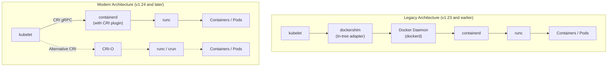
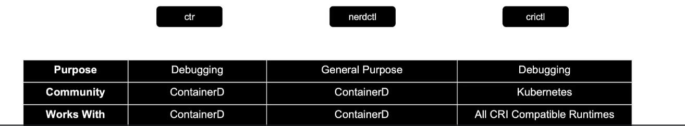
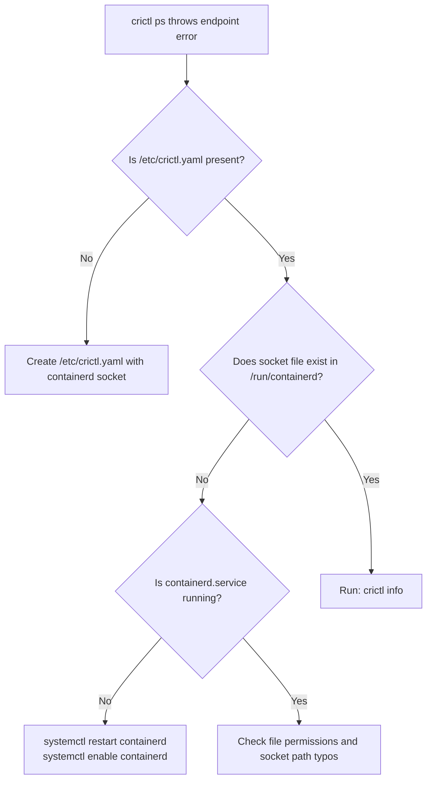

# Container Runtimes: Docker, containerd, CRI-O & crictl - CKA Exam Notes

> **Exam Domain**: Cluster Architecture, Installation & Configuration (25%) / Troubleshooting (30%)  
> **Weight / Importance**: Critical  
> **Allowed Docs Search Keywords**: `container runtimes`, `crictl`, `containerd`, `dockershim removal`

---

## 1. Conceptual Overview & Mental Model

In modern Kubernetes, the node agent (`kubelet`) does **not** manage low-level Linux namespaces, cgroups, or container processes directly. Instead, it delegates all container lifecycle management to an underlying container runtime via the **Container Runtime Interface (CRI)**.

### The Evolution: Docker vs. CRI vs. containerd

1. **Early Kubernetes**: Natively hardcoded to Docker Engine. Kubelet directly invoked Docker's API.
2. **Growth of Alternatives**: New container runtimes emerged (e.g., CoreOS `rkt`, `hyper`). Maintaining custom code inside Kubelet for every runtime was unsustainable.
3. **Introduction of CRI (Kubernetes v1.5)**: A standardized **gRPC interface** allowing any runtime complying with Open Container Initiative (OCI) standards to plug into Kubelet seamlessly.
4. **The "Dockershim" Era**: Because Docker was created before CRI and did not natively implement the CRI gRPC API, Kubernetes introduced an in-tree adapter called **`dockershim`** inside Kubelet.
5. **Dockershim Removal (Kubernetes v1.24+)**: `dockershim` was officially removed. Kubernetes communicates directly with CRI-native runtimes like **`containerd`** and **`CRI-O`**. Docker images remain 100% compatible because both Docker and CRI runtimes adhere to the **OCI Image Specification**.



> [!IMPORTANT]
> **Docker vs. containerd Anatomy**:
> Docker is not just a container runtime; it is a full platform suite containing the Docker CLI, REST API, build tools (`BuildKit`), volume drivers, network drivers, and security wrappers.
> Under the hood, Docker donated its low-level runtime components to open source:
> - **`containerd`**: The container lifecycle daemon (a CNCF graduated project).
> - **`runc`**: The OCI reference implementation for spawning Linux containers.
> Because `containerd` is already CRI-compatible, running `containerd` directly eliminates the extra layer of `dockerd` and `dockershim`.

---

## 2. Standards: OCI & CRI

### 2.1 Open Container Initiative (OCI)
Established by Docker and industry leaders in 2015 under the Linux Foundation to prevent container ecosystem fragmentation. Governed by two key specifications:
1. **Image Specification (`image-spec`)**: Defines the format of container image manifests, filesystem layers, and serialization. This ensures an image built by `docker build` can be pulled and run by `containerd`, `CRI-O`, or `podman`.
2. **Runtime Specification (`runtime-spec`)**: Defines container state, configuration, and execution lifecycle. `runc` is the CLI reference implementation used by containerd and Docker to spawn containers with Linux namespaces and cgroups.

### 2.2 Container Runtime Interface (CRI)
- A plugin interface via **gRPC** allowing Kubelet to use a wide variety of container runtimes without recompiling Kubernetes code.
- Consists of two primary gRPC client services:
  - **`RuntimeService`**: Manages container and Pod sandbox lifecycles (start, stop, status, exec, attach).
  - **`ImageService`**: Manages container image operations (pull, inspect, remove, list).

---

## 3. CLI Ecosystem: `ctr` vs `nerdctl` vs `crictl` vs `docker`

When working on a Kubernetes node running `containerd`, you encounter three different command-line tools:



### 3.1 Tool Comparison Matrix

| Attribute | `ctr` | `nerdctl` | `crictl` | `docker` |
| :--- | :--- | :--- | :--- | :--- |
| **Purpose** | Low-level containerd debugging | General-purpose Docker CLI alternative | Kubernetes node & CRI inspection / debugging | General developer container platform |
| **Community** | containerd project | containerd sub-project | **Kubernetes Community (SIG-Node)** | Docker Inc. |
| **Works With** | `containerd` only | `containerd` only | **All CRI-compatible runtimes** (`containerd`, `CRI-O`) | Docker Engine (`dockerd`) |
| **Kubernetes / Pod Aware?** | No (uses containerd namespaces) | No (Docker-style; supports `-n k8s.io`) | **Yes** (first-class Pod Sandbox concepts) | No |
| **Can Kubelet manage its containers?**| No | No | No (Kubelet kills unmanaged containers) | Only via `cri-dockerd` |
| **Primary Use Case** | containerd maintainer debugging | Developer laptops, compose, rootless containers | **CKA Exam node troubleshooting & diagnostics** | Local container building & development |

> [!WARNING]
> **Do not use `crictl` or `ctr` to launch production pods!**  
> `kubelet` is the authoritative orchestrator on the node. If you create a container manually with `crictl` or `ctr`, Kubelet has no record of it in its target Pod spec and will identify it as an orphaned container and delete/garbage-collect it. Use `crictl` **strictly for inspecting and debugging**.

---

### 3.2 Tool Details & Usage

#### 1. `ctr` (containerd native CLI)
- Shipped directly with the `containerd` binary.
- Very low-level, unintuitive syntax (not user-friendly).
- Requires namespace specification (defaults to `default`, Kubernetes workloads reside in `k8s.io`).

```bash
# Pull an image into containerd
ctr images pull docker.io/library/redis:alpine

# List images in default namespace
ctr images ls

# List images in the Kubernetes namespace
ctr --namespace k8s.io images ls

# Run a test container
ctr run docker.io/library/redis:alpine my-redis-debug
```

#### 2. `nerdctl` (contaiNERD CTL)
- A sub-project of containerd providing a **Docker-compatible CLI UX**.
- Acts as a drop-in replacement for `docker` while talking directly to containerd.
- Supports modern features:
  - Docker Compose (`nerdctl compose up -d`)
  - Lazy pulling (eStargz / Nydus)
  - Encrypted container images
  - P2P image distribution (IPFS)
  - Image signing and verification (Cosign)
  - Directly targeting Kubernetes containers: `nerdctl --namespace k8s.io ps`

#### 3. `crictl` (Kubernetes CRI Debug Tool)
- Maintained by Kubernetes SIG-Node (`cri-tools`).
- Standardized tool across all CRI runtimes (same commands work on containerd or CRI-O).
- Talks directly to the CRI gRPC socket.
- Pre-installed on all CKA exam clusters.

---

## 4. Command Translation Tables

### 4.1 One-to-One Command Mapping: `docker` vs. `nerdctl`

`nerdctl` syntax is virtually identical to `docker`:

| Operation | `docker` Command | `nerdctl` Equivalent |
| :--- | :--- | :--- |
| **Run Container** | `docker run -d --name web -p 80:80 nginx` | `nerdctl run -d --name web -p 80:80 nginx` |
| **List Running Containers** | `docker ps` | `nerdctl ps` |
| **List All Containers** | `docker ps -a` | `nerdctl ps -a` |
| **Inspect Kubernetes Pods** | *Not Supported* | `nerdctl -n k8s.io ps` |
| **Build Container Image** | `docker build -t my-app:1.0 .` | `nerdctl build -t my-app:1.0 .` |
| **Container Exec** | `docker exec -it web sh` | `nerdctl exec -it web sh` |
| **Stream Logs** | `docker logs -f web` | `nerdctl logs -f web` |
| **Inspect Metadata** | `docker inspect web` | `nerdctl inspect web` |
| **Docker Compose** | `docker compose up -d` | `nerdctl compose up -d` |
| **Remove Container** | `docker rm -f web` | `nerdctl rm -f web` |

---

### 4.2 CKA Exam High-Yield Mapping: `docker` vs. `crictl`

On the CKA exam, `docker` is unavailable. Memorize these mappings to debug nodes via `crictl`:

| Operation | `docker` CLI | `crictl` CLI | CKA Exam Context & Key Differences |
| :--- | :--- | :--- | :--- |
| **List Active Containers** | `docker ps` | `crictl ps` | Shows container ID, Pod ID, state, and name. |
| **List All Containers** | `docker ps -a` | `crictl ps -a` | Shows exited/crashed containers (Crucial for CrashLoopBackOff). |
| **List Pods (Sandboxes)** | *N/A (Pod-unaware)* | `crictl pods` | Lists all pod sandboxes on the local node. |
| **Filter by Pod** | *N/A* | `crictl ps --pod <pod-id>` | Shows only containers belonging to a specific pod. |
| **Inspect Container** | `docker inspect <id>` | `crictl inspect <id>` | Returns low-level JSON details (mounts, pid, spec). |
| **Inspect Pod Sandbox** | *N/A* | `crictl inspectp <pod-id>`| Shows pod IP, annotations, cgroup, network namespace. |
| **Container Logs** | `docker logs <id>` | `crictl logs <id>` | Fetches stdout/stderr directly from the CRI runtime. |
| **Tail Container Logs** | `docker logs -f <id>` | `crictl logs -f <id>` | Streams live logs from crashed/hanging containers. |
| **Exec into Container** | `docker exec -it <id> sh` | `crictl exec -it <id> sh`| Interactive shell inside a running container. |
| **List Images** | `docker images` | `crictl images` | Lists locally cached images on the node. |
| **Pull Image** | `docker pull ` | `crictl pull ` | Pre-pulls an image to bypass image pull latency. |
| **Remove Image** | `docker rmi ` | `crictl rmi <image-id>` | Removes cached image from the node. |
| **Prune Unused Images** | `docker image prune -a` | `crictl rmi --prune` | Cleans dangling images to resolve `DiskPressure`. |
| **Stop Container** | `docker stop <id>` | `crictl stop <id>` | Halts container execution. |
| **Remove Container** | `docker rm <id>` | `crictl rm <id>` | Deletes stopped container. |
| **Runtime Diagnostics** | `docker info` | `crictl info` | Displays CRI configuration, cgroup driver, status. |
| **Resource Stats** | `docker stats` | `crictl stats` | Live CPU and Memory utilization per container. |

---

## 5. Runtime Configuration & Endpoints

### 5.1 Common Socket Paths
`crictl` requires a connection to the active runtime's UNIX domain socket:

| Runtime | Socket Path | Status in Modern K8s |
| :--- | :--- | :--- |
| **containerd** | `unix:///run/containerd/containerd.sock` | **Standard Default** |
| **CRI-O** | `unix:///run/crio/crio.sock` | **Supported Standard** |
| **cri-dockerd** | `unix:///var/run/cri-dockerd.sock` | Third-party adapter (Mirantis) |
| **dockershim** | `unix:///var/run/dockershim.sock` | **Removed / Obsolete** |

---

### 5.2 Configuring `crictl` Endpoints

If `crictl` outputs `runtime endpoint not set`, you must configure it using one of the following methods:

#### Method 1: Configuration File (Recommended & Permanent)
File: `/etc/crictl.yaml`
```yaml
runtime-endpoint: "unix:///run/containerd/containerd.sock"
image-endpoint: "unix:///run/containerd/containerd.sock"
timeout: 10
debug: false
```

#### Method 2: Command-Line Flag
```bash
crictl --runtime-endpoint unix:///run/containerd/containerd.sock ps
```

#### Method 3: Environment Variables
```bash
export CONTAINER_RUNTIME_ENDPOINT="unix:///run/containerd/containerd.sock"
export IMAGE_SERVICE_ENDPOINT="unix:///run/containerd/containerd.sock"
```

---

### 5.3 containerd Configuration File (`/etc/containerd/config.toml`)

The central configuration file for containerd:
```toml
version = 2
[plugins]
  [plugins."io.containerd.grpc.v1.cri"]
    [plugins."io.containerd.grpc.v1.cri".containerd]
      default_runtime_name = "runc"
      [plugins."io.containerd.grpc.v1.cri".containerd.runtimes]
        [plugins."io.containerd.grpc.v1.cri".containerd.runtimes.runc]
          runtime_type = "io.containerd.runc.v2"
          [plugins."io.containerd.grpc.v1.cri".containerd.runtimes.runc.options]
            SystemdCgroup = true
```

> [!IMPORTANT]
> **The `SystemdCgroup = true` Requirement**:
> Kubernetes requires both the `kubelet` and the container runtime to use the **same cgroup driver**. On modern Linux distributions with systemd init (Ubuntu, Debian, RHEL, CentOS), both must be configured to use `systemd` (not `cgroupfs`).
> In `/etc/containerd/config.toml`, ensure `SystemdCgroup = true`. After modifying, reload containerd:
> ```bash
> sudo systemctl restart containerd
> ```

---

## 6. Troubleshooting & Diagnostic Runbook

### Scenario A: `crictl` Fails with `runtime endpoint not set`



**Step-by-step resolution**:
```bash
# 1. Verify containerd service status
systemctl status containerd

# 2. Check if the socket file exists
ls -l /run/containerd/containerd.sock

# 3. Write or fix /etc/crictl.yaml
sudo tee /etc/crictl.yaml <<EOF
runtime-endpoint: unix:///run/containerd/containerd.sock
image-endpoint: unix:///run/containerd/containerd.sock
timeout: 10
debug: false
EOF

# 4. Verify crictl connectivity
crictl info
```

---

### Scenario B: Debugging Static Pods or Kubelet Startup Failures

When control plane static pods (e.g. `kube-apiserver`) fail to start, `kubectl` is completely non-functional. You must inspect the container runtime directly:

```bash
# 1. SSH into the master node
ssh controlplane

# 2. List all containers (including crashed/exited ones)
crictl ps -a

# 3. Filter for the crashing component
crictl ps -a --name kube-apiserver

# 4. Fetch the container logs directly from the runtime
crictl logs <container-id>

# 5. Inspect container exit code and termination reason
crictl inspect <container-id> | grep -i exitcode
```

---

### Scenario C: Node DiskPressure & Image Pruning

When a node enters `DiskPressure`, Kubelet attempts to evict pods. If automated garbage collection is lagging, prune unused images manually:

```bash
# 1. Check disk utilization
df -h /var/lib/containerd

# 2. List images and sizes
crictl images

# 3. Prune all unused images immediately
crictl rmi --prune

# 4. Remove a specific dangling image
crictl rmi <image-id>
```

---

## 7. CKA Exam Tips, Gotchas & Traps

> [!TIP]
> **Finding Container IDs Quickly with `crictl`**:
> To get just the container ID of the latest failed container:
> ```bash
> crictl ps -a -q --name <pod-or-container-name> | head -n 1
> ```
> Chain it directly to read logs:
> ```bash
> crictl logs $(crictl ps -a -q --name kube-apiserver | head -n 1)
> ```

> [!WARNING]
> **Docker CLI is Not Installed on Exam Nodes**:
> Do not attempt `docker ps`, `docker run`, or `docker images`. You will receive `command not found: docker`. Always use **`crictl`** on node VMs.

> [!IMPORTANT]
> **`ctr` Namespace Trap**:
> If you ever run `ctr images ls` or `ctr containers ls`, it will appear empty! That is because `ctr` defaults to the `default` namespace.
> Kubernetes objects reside in the **`k8s.io`** namespace:
> ```bash
> ctr -n k8s.io images ls
> ctr -n k8s.io containers ls
> ```
> In contrast, `crictl` automatically defaults to the CRI Kubernetes scope.

> [!NOTE]
> **Generating Default containerd Config**:
> If `/etc/containerd/config.toml` is corrupt or missing, generate a clean default configuration with:
> ```bash
> containerd config default | sudo tee /etc/containerd/config.toml
> ```
> Then edit and set `SystemdCgroup = true` under `[plugins."io.containerd.grpc.v1.cri".containerd.runtimes.runc.options]`.

---

## 8. Official Documentation Bookmarks

Allowed for reference during the live exam at [kubernetes.io/docs](https://kubernetes.io/docs/home/):

| Topic | Direct Search Term | Recommended Anchor |
| :--- | :--- | :--- |
| **Container Runtimes** | `Container Runtimes` | Getting Started > Production environment > Container Runtimes |
| **Debugging with `crictl`** | `crictl` | Tasks > Administer a Cluster > Debugging Kubernetes nodes with crictl |
| **Dockershim Removal FAQ** | `Dockershim FAQ` | Tasks > Administer a Cluster > Check whether Dockershim removal affects you |
| **Cgroup Drivers** | `Cgroup drivers` | Getting Started > Production environment > Container Runtimes #cgroup-drivers |

