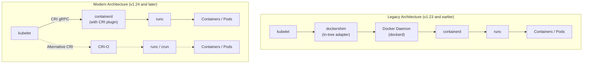
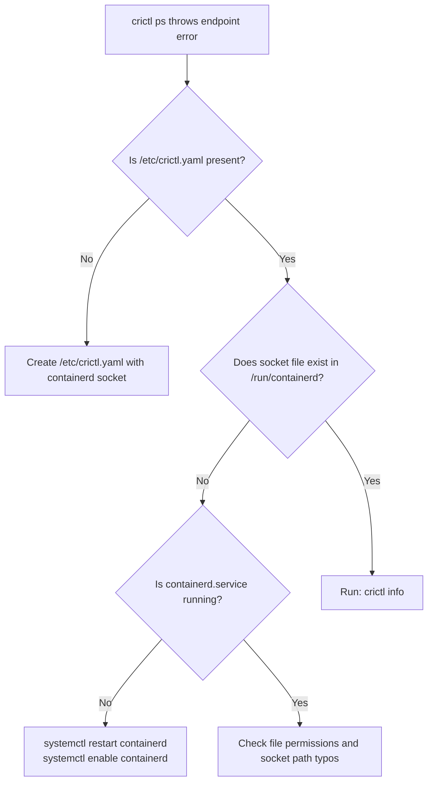

# Container Runtimes: Docker, containerd, CRI-O & crictl - CKA Exam Notes

> **Exam Domain**: Cluster Architecture, Installation & Configuration (25%) / Troubleshooting (30%)  
> **Weight / Importance**: Critical  
> **Target Version**: Verified against v1.31 / v1.32 (Current CKA Curriculum)  
> **Allowed Docs Search Keywords**: `container runtimes`, `crictl`, `containerd`, `dockershim removal`  
> **Source**: Generated from `docker-vs-containerd-raw.md`

---

## 1. Quick-Reference Summary

- **Dockershim Removal**: Removed in Kubernetes v1.24. Direct path is `kubelet -> CRI (gRPC) -> containerd -> runc`.
- **Docker Images**: Images built with `docker build` continue to run seamlessly in `containerd` and `CRI-O` because both comply with the **OCI Image Specification**.
- **`crictl` vs `docker` on Exam**: The `docker` CLI is **not installed** on modern CKA worker nodes. Use `crictl` for all node-level container diagnostics.
- **`crictl` Pod Awareness**: Unlike `docker`, `crictl` natively understands Kubernetes Pods (`crictl pods`, `crictl inspectp`).
- **Kubelet Lifecycle Rule**: `kubelet` maintains the desired pod headcount. If you create a container manually using `crictl` or `ctr`, Kubelet is unaware of it and will immediately terminate/garbage-collect it. Use `crictl` **strictly for debugging and inspection**.
- **CRI Sockets**:
  - `containerd`: `unix:///run/containerd/containerd.sock` (modern standard)
  - `CRI-O`: `unix:///run/crio/crio.sock`
  - `dockershim`: `unix:///var/run/dockershim.sock` (**obsolete / removed**)
- **`crictl` Config**: File `/etc/crictl.yaml` with `runtime-endpoint` and `image-endpoint`. Fixes `runtime endpoint not set` errors.
- **cgroup Driver Parity**: `/etc/containerd/config.toml` must have `SystemdCgroup = true` under runc options to prevent Kubelet startup crashes.
- **`ctr` Namespace Trap**: `ctr` defaults to the `default` namespace. Kubernetes workloads reside in `--namespace k8s.io`.
- **Disk Pressure Remediation**: Prune cached images on a node with `crictl rmi --prune`.

---

## 2. Conceptual Overview & Mental Model

In modern Kubernetes, the node agent (`kubelet`) does **not** manage low-level Linux namespaces, cgroups, or container processes directly. Instead, it delegates all container lifecycle management to an underlying container runtime via the **Container Runtime Interface (CRI)**.

### Dual-Layer Architectural Understanding

- **Intuitive Mental Model (In Plain English)**:
  - **Docker is a Full Suite, Not Just a Runtime**: Docker consists of multiple tools bundled together—the Docker CLI, REST API, build tools (`BuildKit`), volume/network plugins, security profiles, the container supervisor daemon (`containerd`), and the low-level executor (`runc`).
  - **The "Docker Exception" & Dockershim**: When Kubernetes created the CRI standard, other runtimes complied directly, but Docker did not. To support Docker, Kubernetes had to write and maintain a temporary in-tree translation adapter inside `kubelet` called **`dockershim`**.
  - **Why Dockershim Was Removed**: Running Docker meant traffic traveled through redundant hops: `kubelet -> dockershim -> dockerd -> containerd -> runc`. Because `containerd` itself is already fully CRI-compliant, Kubernetes removed `dockershim` in v1.24 to talk directly to `containerd`, eliminating bloat and overhead.
  - **Why Docker Images Still Work**: Images built with `docker build` continue to run seamlessly in `containerd` and `CRI-O` because Docker follows the open industry **OCI Image Specification**.

- **Standard / Production Definition**:
  Kubernetes delegates container execution to runtime engines implementing the **gRPC-based Container Runtime Interface (CRI)**. Since Kubernetes v1.24, in-tree dockershim support is completely removed; nodes run CRI-native runtimes (`containerd`, `CRI-O`) that invoke OCI-compliant runtime handlers (`runc`, `crun`).



> [!IMPORTANT]
> **Docker vs. containerd Anatomy**:
> Under the hood, Docker donated its core runtime components to the open-source community:
> - **`containerd`**: The container lifecycle daemon (a CNCF graduated project).
> - **`runc`**: The OCI reference implementation for spawning Linux containers.
> Because `containerd` is already CRI-compatible via its built-in CRI plugin, running `containerd` directly bypasses `dockerd` and `dockershim`.

---

## 3. Deep-Dive Technical Breakdown

### 3.1 Open Container Initiative (OCI)

- **Intuitive Understanding (In Plain English)**:
  An open governance body founded to establish universal container formats so users aren't locked into any single vendor. It defines two simple, fundamental rules:
  1. **Image Specification (`image-spec`)**: A standard recipe/specification for how container images must be built, layered, and packaged as tarballs. Any image built to this spec can run on any runtime.
  2. **Runtime Specification (`runtime-spec`)**: A standard definition for how any runtime should run and manage container processes (state, environment, lifecycle). `runc` is the universal reference implementation that actually talks to Linux cgroups and namespaces.

- **Standard / Production Definition**:
  The OCI is a Linux Foundation project specifying portable, vendor-neutral container formats:
  1. **OCI Image Specification**: Governs the manifest, layer tarballs, and configuration blobs.
  2. **OCI Runtime Specification**: Defines container execution configuration and lifecycle hooks, implemented by low-level runners like `runc` and `crun`.

---

### 3.2 Container Runtime Interface (CRI)

- **Intuitive Understanding (In Plain English)**:
  The standard plug-in interface introduced by Kubernetes. Instead of Kubernetes hardcoding support for individual engines, Kubernetes created CRI as a universal gRPC socket. Any vendor's runtime can be used by Kubernetes as long as they implement this interface.

- **Standard / Production Definition**:
  A gRPC API consisting of two client services:
  - **`RuntimeService`**: Handles Pod sandbox and container lifecycles (creation, execution, deletion, status).
  - **`ImageService`**: Handles image pull, list, inspect, and remove operations.

---

### 3.3 Socket Paths & Runtime Configuration

`crictl` requires a connection to the active runtime's UNIX domain socket:

| Runtime | Socket Path | Status in Modern K8s |
| :--- | :--- | :--- |
| **containerd** | `unix:///run/containerd/containerd.sock` | **Standard Default** |
| **CRI-O** | `unix:///run/crio/crio.sock` | **Supported Standard** |
| **cri-dockerd** | `unix:///var/run/cri-dockerd.sock` | Third-party adapter (Mirantis) |
| **dockershim** | `unix:///var/run/dockershim.sock` | **Removed / Obsolete** |

#### Persistent `crictl` Endpoint Configuration
File: `/etc/crictl.yaml`
```yaml
runtime-endpoint: "unix:///run/containerd/containerd.sock"
image-endpoint: "unix:///run/containerd/containerd.sock"
timeout: 10
debug: false
```

#### containerd Central Configuration (`/etc/containerd/config.toml`)
```toml
version = 2
[plugins]
  [plugins."io.containerd.grpc.v1.cri"]
    [plugins."io.containerd.grpc.v1.cri".containerd]
      default_runtime_name = "runc"
      [plugins."io.containerd.grpc.v1.cri".containerd.runtimes]
        [plugins."io.containerd.grpc.v1.cri".containerd.runtimes.runc]
          runtime_type = "io.containerd.runc.v2"
          [plugins."io.containerd.grpc.v1.cri".containerd.runtimes.runc.options]
            SystemdCgroup = true
```

> [!IMPORTANT]
> **The `SystemdCgroup = true` Requirement**:
> Kubernetes requires both the `kubelet` and the container runtime to use the **same cgroup driver**. On modern Linux distributions with systemd init (Ubuntu, Debian, RHEL, CentOS), both must be configured to use `systemd` (not `cgroupfs`).
> In `/etc/containerd/config.toml`, ensure `SystemdCgroup = true`. After modifying, reload containerd:
> ```bash
> sudo systemctl restart containerd
> ```

---

## 4. Command Translation & Mapping Tables

When working on a Kubernetes node running `containerd`, you encounter three different command-line tools:


### 4.1 CLI Tool Comparison Matrix

| Attribute | `ctr` | `nerdctl` | `crictl` | `docker` |
| :--- | :--- | :--- | :--- | :--- |
| **Purpose** | Low-level containerd debugging | General-purpose Docker CLI alternative | Kubernetes node & CRI inspection / debugging | General developer container platform |
| **Community** | containerd project | containerd sub-project | **Kubernetes Community (SIG-Node)** | Docker Inc. |
| **Works With** | `containerd` only | `containerd` only | **All CRI-compatible runtimes** (`containerd`, `CRI-O`) | Docker Engine (`dockerd`) |
| **Kubernetes / Pod Aware?** | No (uses containerd namespaces) | No (Docker-style; supports `-n k8s.io`) | **Yes** (first-class Pod Sandbox concepts) | No |
| **Can Kubelet manage its containers?**| No | No | No (Kubelet kills unmanaged containers) | Only via `cri-dockerd` |
| **Primary Use Case** | containerd maintainer debugging | Developer laptops, compose, rootless containers | **CKA Exam node troubleshooting & diagnostics** | Local container building & development |

---

### 4.2 Tool Details & Usage

#### 1. `ctr` (containerd native CLI)
- **Intuitive Understanding (In Plain English)**:
  A bare-bones diagnostic CLI shipped bundled directly with `containerd`. It is designed solely for containerd maintainers to test the engine in isolation. It has an awkward, low-level syntax and is **not** used to run or manage containers in production or everyday development.
- **Standard / Production Definition**:
  Low-level development client for `containerd`. Does not speak the Kubernetes CRI API and defaults to the `default` namespace (requiring `--namespace k8s.io` to inspect Kubernetes pods).

```bash
# Pull an image into containerd
ctr images pull docker.io/library/redis:alpine

# List images in default namespace
ctr images ls

# List images in the Kubernetes namespace
ctr --namespace k8s.io images ls

# Run a test container
ctr run docker.io/library/redis:alpine my-redis-debug
```

#### 2. `nerdctl` (contaiNERD CTL)
- **Intuitive Understanding (In Plain English)**:
  A modern, user-friendly CLI that gives containerd the exact same look and feel as `docker`. It allows developers to use familiar commands (`run`, `ps`, `build`) and supports `docker compose`, while also supporting containerd's cutting-edge capabilities (lazy pulling, encrypted images, and seeing Kubernetes pods with `-n k8s.io`).
- **Standard / Production Definition**:
  A sub-project under `containerd` providing Docker CLI parity, rootless support, full Compose integration, and advanced containerd plugins (eStargz, IPFS, Cosign).

#### 3. `crictl` (Kubernetes CRI Debug Tool)
- **Intuitive Understanding (In Plain English)**:
  A diagnostic Swiss-army knife created and maintained by the Kubernetes community to interact with **any** CRI-compliant container runtime.
  - *Why not create production pods with it?* Remember that `kubelet` is solely responsible for maintaining the desired number of pods on each node. If you create a container manually using `crictl`, `kubelet` is completely unaware of it and will immediately treat it as an alien/orphaned container and terminate it.
  - *What is it best for?* It is the ideal tool for low-level node inspection, debugging failing containers, and checking runtime health when `kubectl` is unreachable.
- **Standard / Production Definition**:
  The official CLI tool maintained by Kubernetes SIG-Node (`cri-tools`) that speaks CRI directly over gRPC UNIX sockets to manage and inspect Pod sandboxes, containers, and cached node images across any CRI runtime (`containerd`, `CRI-O`).

---

### 4.3 One-to-One Command Mapping: `docker` vs. `nerdctl`

`nerdctl` syntax is virtually identical to `docker`:

| Operation | `docker` Command | `nerdctl` Equivalent |
| :--- | :--- | :--- |
| **Run Container** | `docker run -d --name web -p 80:80 nginx` | `nerdctl run -d --name web -p 80:80 nginx` |
| **List Running Containers** | `docker ps` | `nerdctl ps` |
| **List All Containers** | `docker ps -a` | `nerdctl ps -a` |
| **Inspect Kubernetes Pods** | *Not Supported* | `nerdctl -n k8s.io ps` |
| **Build Container Image** | `docker build -t my-app:1.0 .` | `nerdctl build -t my-app:1.0 .` |
| **Container Exec** | `docker exec -it web sh` | `nerdctl exec -it web sh` |
| **Stream Logs** | `docker logs -f web` | `nerdctl logs -f web` |
| **Inspect Metadata** | `docker inspect web` | `nerdctl inspect web` |
| **Docker Compose** | `docker compose up -d` | `nerdctl compose up -d` |
| **Remove Container** | `docker rm -f web` | `nerdctl rm -f web` |

---

### 4.4 CKA Exam High-Yield Mapping: `docker` vs. `crictl`

On the CKA exam, `docker` is unavailable. Memorize these mappings to debug nodes via `crictl`:

| Operation | `docker` CLI | `crictl` CLI | CKA Exam Context & Key Differences |
| :--- | :--- | :--- | :--- |
| **List Active Containers** | `docker ps` | `crictl ps` | Shows container ID, Pod ID, state, and name. |
| **List All Containers** | `docker ps -a` | `crictl ps -a` | Shows exited/crashed containers (Crucial for CrashLoopBackOff). |
| **List Pods (Sandboxes)** | *N/A (Pod-unaware)* | `crictl pods` | Lists all pod sandboxes on the local node. |
| **Filter by Pod** | *N/A* | `crictl ps --pod <pod-id>` | Shows only containers belonging to a specific pod. |
| **Inspect Container** | `docker inspect <id>` | `crictl inspect <id>` | Returns low-level JSON details (mounts, pid, spec). |
| **Inspect Pod Sandbox** | *N/A* | `crictl inspectp <pod-id>`| Shows pod IP, annotations, cgroup, network namespace. |
| **Container Logs** | `docker logs <id>` | `crictl logs <id>` | Fetches stdout/stderr directly from the CRI runtime. |
| **Tail Container Logs** | `docker logs -f <id>` | `crictl logs -f <id>` | Streams live logs from crashed/hanging containers. |
| **Exec into Container** | `docker exec -it <id> sh` | `crictl exec -it <id> sh`| Interactive shell inside a running container. |
| **List Images** | `docker images` | `crictl images` | Lists locally cached images on the node. |
| **Pull Image** | `docker pull ` | `crictl pull ` | Pre-pulls an image to bypass image pull latency. |
| **Remove Image** | `docker rmi ` | `crictl rmi <image-id>` | Removes cached image from the node. |
| **Prune Unused Images** | `docker image prune -a` | `crictl rmi --prune` | Cleans dangling images to resolve `DiskPressure`. |
| **Stop Container** | `docker stop <id>` | `crictl stop <id>` | Halts container execution. |
| **Remove Container** | `docker rm <id>` | `crictl rm <id>` | Deletes stopped container. |
| **Runtime Diagnostics** | `docker info` | `crictl info` | Displays CRI configuration, cgroup driver, status. |
| **Resource Stats** | `docker stats` | `crictl stats` | Live CPU and Memory utilization per container. |

---

## 5. High-Yield CLI & Imperative Commands

### 5.1 Practical `crictl` Debugging Commands

```bash
# 1. Verify CRI socket connectivity and cgroup driver
crictl info

# 2. List all Pod sandboxes on the current node
crictl pods

# 3. List all containers including crashed/exited ones
crictl ps -a

# 4. Filter containers by pod ID
crictl ps -a --pod <pod-id>

# 5. Extract container logs directly from CRI runtime
crictl logs <container-id>

# 6. Stream live logs from container
crictl logs -f <container-id>

# 7. Execute command inside container
crictl exec -it <container-id> sh

# 8. Check live CPU/Memory utilization of containers on node
crictl stats
```

### 5.2 One-Liner Shortcuts for CKA Exam Speed

```bash
# Find container ID of the latest failed container
crictl ps -a -q --state Exited | head -n 1

# Immediately read logs of a crashing static pod (e.g. kube-apiserver)
crictl logs $(crictl ps -a -q --name kube-apiserver | head -n 1)

# Inspect pod sandbox network status
crictl inspectp $(crictl pods -q --name <pod-name> | head -n 1) | grep -i ip
```

---

## 6. Troubleshooting & Diagnostic Runbook

### Scenario A: `crictl` Fails with `runtime endpoint not set`



**Step-by-step resolution**:
```bash
# 1. Verify containerd service status
systemctl status containerd

# 2. Check if the socket file exists
ls -l /run/containerd/containerd.sock

# 3. Write or fix /etc/crictl.yaml
sudo tee /etc/crictl.yaml <<EOF
runtime-endpoint: unix:///run/containerd/containerd.sock
image-endpoint: unix:///run/containerd/containerd.sock
timeout: 10
debug: false
EOF

# 4. Verify crictl connectivity
crictl info
```

---

### Scenario B: Debugging Static Pods or Kubelet Startup Failures

When control plane static pods (e.g. `kube-apiserver`) fail to start, `kubectl` is completely non-functional. You must inspect the container runtime directly:

```bash
# 1. SSH into the master node
ssh controlplane

# 2. List all containers (including crashed/exited ones)
crictl ps -a

# 3. Filter for the crashing component
crictl ps -a --name kube-apiserver

# 4. Fetch the container logs directly from the runtime
crictl logs <container-id>

# 5. Inspect container exit code and termination reason
crictl inspect <container-id> | grep -i exitcode
```

---

### Scenario C: Node DiskPressure & Image Pruning

When a node enters `DiskPressure`, Kubelet attempts to evict pods. If automated garbage collection is lagging, prune unused images manually:

```bash
# 1. Check disk utilization
df -h /var/lib/containerd

# 2. List images and sizes
crictl images

# 3. Prune all unused images immediately
crictl rmi --prune

# 4. Remove a specific dangling image
crictl rmi <image-id>
```

---

## 7. CKA Exam Tips, Gotchas & Traps

> [!WARNING]
> **Docker CLI is Not Installed on Exam Nodes**:
> Do not attempt `docker ps`, `docker run`, or `docker images`. You will receive `command not found: docker`. Always use **`crictl`** on node VMs.

> [!IMPORTANT]
> **`ctr` Namespace Trap**:
> If you ever run `ctr images ls` or `ctr containers ls`, it will appear empty! That is because `ctr` defaults to the `default` namespace.
> Kubernetes objects reside in the **`k8s.io`** namespace:
> ```bash
> ctr -n k8s.io images ls
> ctr -n k8s.io containers ls
> ```
> In contrast, `crictl` automatically defaults to the CRI Kubernetes scope.

> [!NOTE]
> **Generating Default containerd Config**:
> If `/etc/containerd/config.toml` is corrupt or missing, generate a clean default configuration with:
> ```bash
> containerd config default | sudo tee /etc/containerd/config.toml
> ```
> Then edit and set `SystemdCgroup = true` under `[plugins."io.containerd.grpc.v1.cri".containerd.runtimes.runc.options]`.

---

## 8. Self-Test / Active Recall

Test your comprehension before looking at the answers:

1. **Why was dockershim deprecated and completely removed from Kubernetes in v1.24?**
2. **Why do container images built with `docker build` continue to run without issue on containerd and CRI-O?**
3. **What happens if you use `crictl` to launch a new container directly on a worker node?**
4. **When executing `ctr images ls` on a Kubernetes node, why does the output return empty even though pods are running?**
5. **If running `crictl ps` outputs `runtime endpoint not set`, how do you make the endpoint persistent?**
6. **Which configuration directive in `/etc/containerd/config.toml` must be set to `true` to ensure systemd cgroup compatibility with Kubelet?**
7. **What `crictl` command removes all dangling and unused container images to alleviate node DiskPressure?**

<details>
<summary>Reveal Answers</summary>

1. Because Docker did not natively implement CRI, requiring an in-tree adapter (`dockershim`) inside Kubelet that added architectural complexity, memory bloat, and extra hops (`kubelet -> dockershim -> dockerd -> containerd -> runc`). Since `containerd` natively speaks CRI, removing dockershim enables Kubelet to talk directly to `containerd`.
2. Both Docker and modern CRI runtimes adhere strictly to the **Open Container Initiative (OCI) Image Specification**.
3. `kubelet` is the authoritative manager of pod headcount on the node. Since Kubelet is unaware of containers created directly via `crictl`, it identifies them as orphaned/unmanaged and terminates or garbage-collects them.
4. `ctr` defaults to the `default` namespace. Kubernetes workloads are isolated inside the **`k8s.io`** namespace (`ctr -n k8s.io images ls`).
5. Populate `/etc/crictl.yaml` with `runtime-endpoint: unix:///run/containerd/containerd.sock` and `image-endpoint: unix:///run/containerd/containerd.sock`.
6. `SystemdCgroup = true` under `[plugins."io.containerd.grpc.v1.cri".containerd.runtimes.runc.options]`.
7. `crictl rmi --prune`.
</details>

---

## 9. Official Documentation Bookmarks

Allowed for reference during the live exam at [kubernetes.io/docs](https://kubernetes.io/docs/home/):

| Topic | Direct Search Term | Recommended Anchor |
| :--- | :--- | :--- |
| **Container Runtimes** | `Container Runtimes` | Getting Started > Production environment > Container Runtimes |
| **Debugging with `crictl`** | `crictl` | Tasks > Administer a Cluster > Debugging Kubernetes nodes with crictl |
| **Dockershim Removal FAQ** | `Dockershim FAQ` | Tasks > Administer a Cluster > Check whether Dockershim removal affects you |
| **Cgroup Drivers** | `Cgroup drivers` | Getting Started > Production environment > Container Runtimes #cgroup-drivers |
