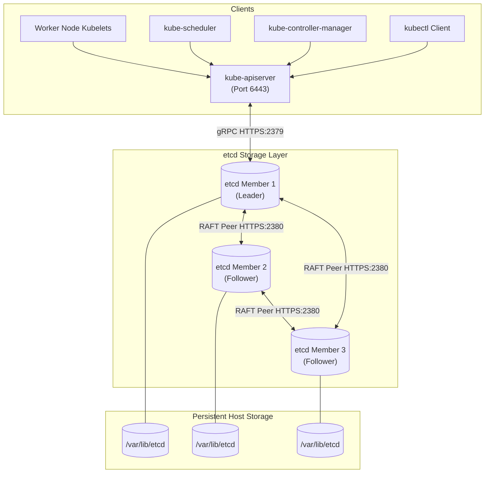
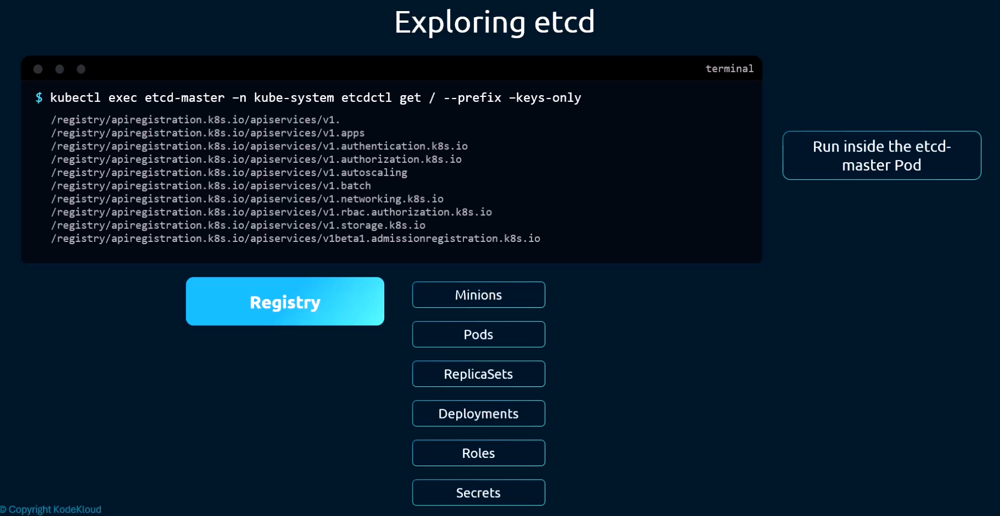
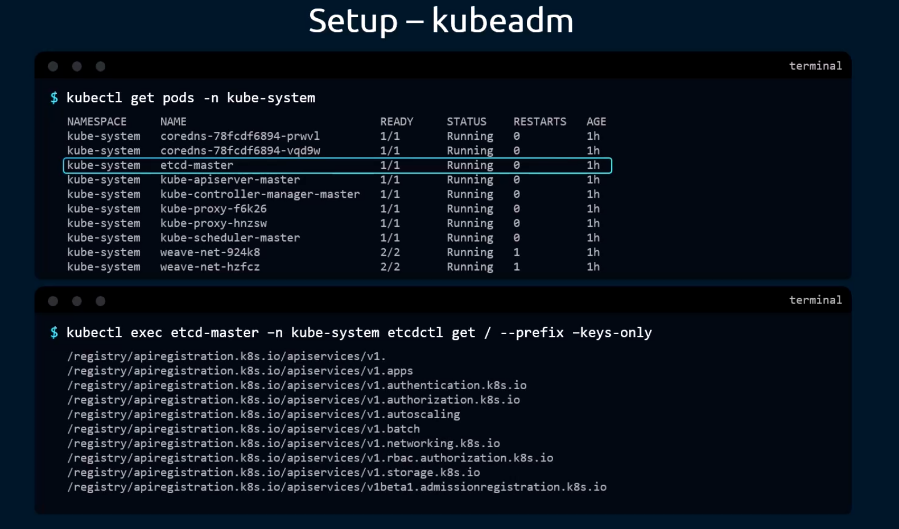
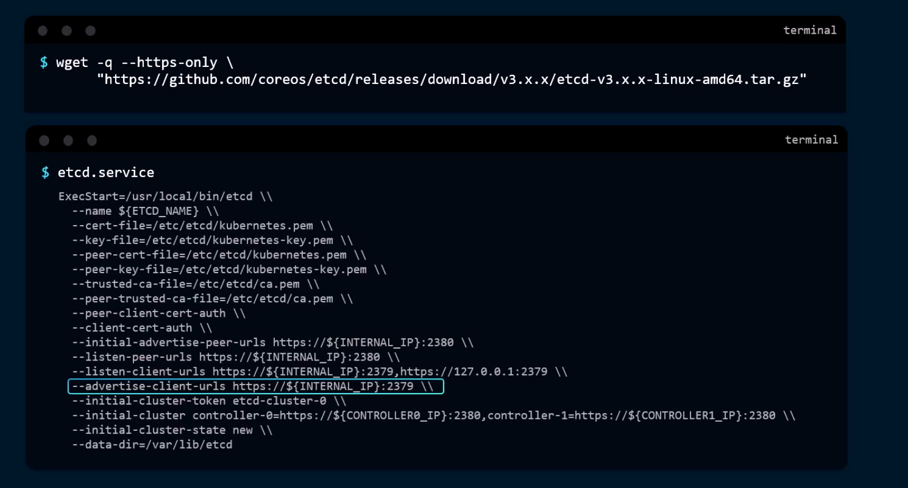
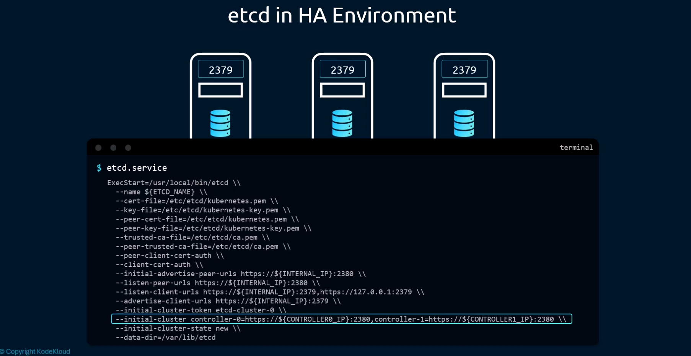
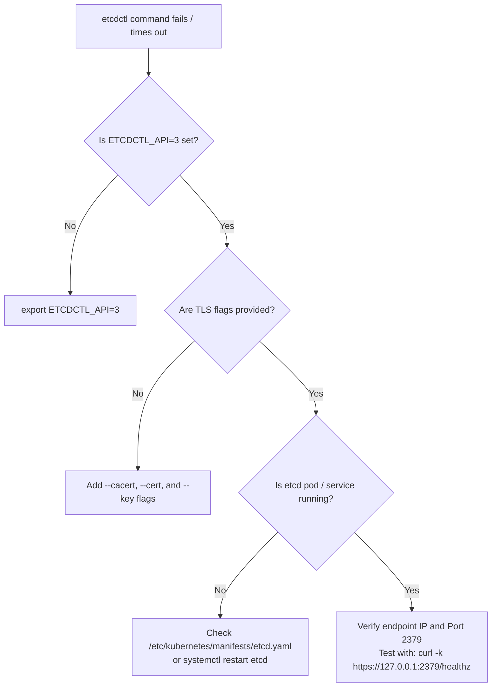

# ETCD Architecture, Operations & Backup/Restore - CKA Exam Notes

> **Exam Domain**: Cluster Architecture, Installation & Configuration (25%) / Troubleshooting (30%)  
> **Weight / Importance**: Critical  
> **Target Version**: Verified against v1.31 / v1.32 (Current CKA Curriculum) | etcd v3.5.x  
> **Allowed Docs Search Keywords**: `etcd`, `backup etcd`, `operating etcd clusters for kubernetes`, `etcdctl`  
> **Source**: Generated from `etcd-raw.md`

---

## 1. Quick-Reference Summary

- **Role & Protocol**: Distributed, consistent, ACID key-value store implementing **RAFT consensus**. Serves as the single source-of-truth for all Kubernetes cluster objects.
- **Default Ports**:
  - `2379`: Client requests (e.g. `kube-apiserver` <-> `etcd`, `etcdctl` CLI).
  - `2380`: Peer-to-peer communication between etcd cluster members in HA setups.
- **Quorum Formula**: `Quorum = floor(N / 2) + 1`. A 3-node cluster tolerates 1 failure (Quorum 2); a 5-node cluster tolerates 2 failures (Quorum 3). Clusters should always have an **odd** member count.
- **Deployment Models**:
  - **Kubeadm (Default)**: Static Pod running on the control plane node at `/etc/kubernetes/manifests/etcd.yaml`. Data directory on host: `/var/lib/etcd`.
  - **Manual (External / Systemd)**: Deployed as a Linux systemd service (`etcd.service`).
- **Data Key Hierarchy**: All Kubernetes objects are stored under the `/registry` prefix (e.g., `/registry/pods`, `/registry/deployments`, `/registry/secrets`, `/registry/minions`).
- **CKA Mandatory Environment Variable**: Always ensure `ETCDCTL_API=3` is active (or prefix commands with `ETCDCTL_API=3`).
- **Standard TLS Flags for `etcdctl`**:
  - `--endpoints=https://127.0.0.1:2379`
  - `--cacert=/etc/kubernetes/pki/etcd/ca.crt`
  - `--cert=/etc/kubernetes/pki/etcd/server.crt`
  - `--key=/etc/kubernetes/pki/etcd/server.key`
- **Snapshot Backup Command**:
  `ETCDCTL_API=3 etcdctl --endpoints=https://127.0.0.1:2379 --cacert=... --cert=... --key=... snapshot save /opt/snapshot.db`
- **Snapshot Restore Command**:
  `ETCDCTL_API=3 etcdctl --data-dir=/var/lib/etcd-backup snapshot restore /opt/snapshot.db`
- **Restore Critical Step**: After running `snapshot restore` to a new data directory, you **must** update the `hostPath` volume for `etcd-data` in `/etc/kubernetes/manifests/etcd.yaml` to point to the new directory (`/var/lib/etcd-backup`).

---

## 2. Conceptual Overview & Mental Model

In Kubernetes, **etcd** is the cluster's memory and state ledger. It holds the complete specification and live state of every object in the system.

### Dual-Layer Architectural Understanding

- **Simple English Explanation (How It Works)**:
  - **What is a Key-Value Store?**: Unlike relational databases that require fixed schemas, tables, and foreign keys, a key-value store directly associates a piece of data (the value) with a unique identifier (the key). The stored value can be plain text, structured attributes, or serialized JSON. Because it avoids rigid schemas and complex multi-table joins, lookups and writes are **extremely fast, lightweight, and flexible**.
  - **The Cluster State Store**: `etcd` stores the entire state of the Kubernetes cluster. When you run `kubectl get`, `kube-apiserver` retrieves the records from `etcd`. When you create a pod, scale a deployment, or join a worker node, the new state is saved to `etcd`. A cluster operation is only finalized once it is committed to `etcd`.
  - **Single Source of Truth**: Kubelet, Scheduler, and Controllers never talk directly to `etcd`. All components interact solely through `kube-apiserver`, which enforces security and acts as the single reader and writer for `etcd`.

- **Standard / Production Definition**:
  `etcd` is an open-source, strongly consistent, distributed, transactional key-value store developed by CoreOS (now a CNCF graduated project). It implements the **RAFT consensus algorithm** to provide sequential consistency for writes, linearizable reads, and high availability across distributed nodes. In Kubernetes, it persists the entire declarative state and runtime status of all resources in the cluster.



---

## 3. Deep-Dive Technical Breakdown

### 3.1 Key-Value Data Representation & Storage Model

In etcd, values stored against keys can range from simple strings to complex serialized documents:

```
Key: user:john_doe
Value: name=John Doe, age=45, location=New York, salary=5000

or JSON:
Key: user:john_doe
Value: {"name": "John Doe", "age": 45, "location": "New York", "salary": 5000}
```

In Kubernetes, objects are serialized into Protobuf/JSON and stored under a strictly organized hierarchical directory structure:



#### Kubernetes Key Space Organization (`/registry`)

Every Kubernetes object type is categorized under the root key `/registry`:
- `/registry/minions` (or `/registry/nodes`): Node health, allocatable resources, internal IPs. *(Note: "Minions" was the early Kubernetes terminology for worker nodes, still visible in historical key paths)*.
- `/registry/pods`: Specifications, status, container IPs, and scheduling bindings.
- `/registry/replicasets`: Desired vs actual replica counts and selector labels.
- `/registry/deployments`: Rollout revisions, strategies, and pod templates.
- `/registry/roles` & `/registry/rolebindings`: RBAC permissions and subject assignments.
- `/registry/secrets` & `/registry/configmaps`: Sensitive credentials and configuration data.
- `/registry/apiregistration.k8s.io`: Internal API service routing.

---

### 3.2 Deployment Models: Kubeadm vs. Manual (Systemd)

Kubernetes supports two primary methods for deploying etcd:

#### 1. Kubeadm Managed Setup (Static Pod)
By default, clusters bootstrapped via `kubeadm` deploy etcd as a **Static Pod** in the `kube-system` namespace.



- **Static Pod Manifest**: `/etc/kubernetes/manifests/etcd.yaml`
- **Host Data Directory**: `/var/lib/etcd`
- **PKI Certificates**: `/etc/kubernetes/pki/etcd/`
- **Lifecycle**: Managed directly by the control plane's local `kubelet`. If the process exits, Kubelet restarts it immediately.

#### 2. Manual / External Setup (Linux Systemd Service)
In enterprise or "Hard Way" topologies, etcd is installed directly onto dedicated machines or control plane nodes as an independent systemd service.



- **Binary Installation**: Binaries extracted and placed in `/usr/local/bin/etcd` and `/usr/local/bin/etcdctl`.
- **Systemd Unit File**: `/etc/systemd/system/etcd.service`
- **Core Configuration Parameters in `etcd.service`**:
  - `--name`: Unique human-readable name for this node (e.g. `controller-0`).
  - `--data-dir`: Local disk path for storage (e.g. `/var/lib/etcd`).
  - `--listen-client-urls`: Interface and port for client traffic (`https://${INTERNAL_IP}:2379,https://127.0.0.1:2379`).
  - `--advertise-client-urls`: Client address advertised to other components (`https://${INTERNAL_IP}:2379`).
  - `--listen-peer-urls`: Interface and port for peer traffic (`https://${INTERNAL_IP}:2380`).
  - `--initial-advertise-peer-urls`: Peer address advertised to fellow etcd nodes (`https://${INTERNAL_IP}:2380`).
  - `--cert-file`, `--key-file`, `--trusted-ca-file`: TLS client certificates.
  - `--peer-cert-file`, `--peer-key-file`, `--peer-trusted-ca-file`: TLS peer certificates.

---

### 3.3 High-Availability (HA) Clustering & RAFT Quorum

In production high-availability environments, etcd is distributed across multiple control plane nodes:



#### Peer Discovery & `--initial-cluster`
To form an HA cluster, each etcd member must know the addresses of all other initial members. This is configured via the `--initial-cluster` parameter:

```ini
--initial-cluster controller-0=https://${CONTROLLER0_IP}:2380,controller-1=https://${CONTROLLER1_IP}:2380,controller-2=https://${CONTROLLER2_IP}:2380 \
--initial-cluster-state new \
--initial-cluster-token etcd-cluster-0
```

#### The Quorum Rule & Failure Tolerance

etcd uses the **RAFT consensus algorithm**. For any write to succeed, a **majority (Quorum)** of members must acknowledge the transaction:

$$\text{Quorum} = \left\lfloor \frac{N}{2} \right\rfloor + 1$$

| Total Nodes ($N$) | Majority Quorum Needed | Tolerated Node Failures | Why Even Node Counts Are Discouraged |
| :---: | :---: | :---: | :--- |
| **1** | 1 | 0 | Single point of failure; zero fault tolerance. |
| **3** | 2 | **1** | Standard minimum for production HA. Tolerates 1 lost node. |
| **4** | 3 | **1** | Requires 3 nodes for quorum; still only tolerates 1 failure, but adds network overhead! |
| **5** | 3 | **2** | Recommended for high-scale enterprise clusters. Tolerates 2 lost nodes. |
| **7** | 4 | **3** | Tolerates 3 failures; higher latency during raft synchronization. |

> [!IMPORTANT]
> **Always Use an Odd Number of Nodes!**  
> An etcd cluster of 4 nodes requires 3 nodes for a quorum. If 2 nodes fail, the cluster goes read-only/down. Therefore, a 4-node cluster provides **no extra fault tolerance** over a 3-node cluster, while introducing more points of hardware failure and latency.

---

## 4. Command Translation & Parameter Mapping Tables

### 4.1 CLI Tool Evolution: `etcdctl` v2 vs v3

Kubernetes v1.20+ exclusively uses **etcd v3 API**. In etcd v3, commands and flags changed significantly from the legacy v2 API:

| Operation | Legacy API (`ETCDCTL_API=2`) | Modern API (`ETCDCTL_API=3`) [CKA Standard] | Key Differences in v3 |
| :--- | :--- | :--- | :--- |
| **Set a key** | `etcdctl set key val` | `etcdctl put key val` | Replaced `set` with `put`. |
| **Read a key** | `etcdctl get key` | `etcdctl get key` | Outputs key on line 1, value on line 2. |
| **Delete a key** | `etcdctl rm key` | `etcdctl del key` | Replaced `rm` with `del`. |
| **List keys by prefix** | `etcdctl ls /path` | `etcdctl get /path --prefix` | No `ls` command; use `--prefix`. |
| **Display keys only** | `etcdctl ls` | `etcdctl get /path --prefix --keys-only` | Suppresses printing the values. |
| **Check cluster health** | `etcdctl cluster-health` | `etcdctl endpoint health` | Replaced with `endpoint health`. |
| **Cluster member status**| `etcdctl member list` | `etcdctl member list -w table` | Supports JSON, table, or simple output format. |
| **Backup snapshot** | `etcdctl backup ...` | `etcdctl snapshot save <file>` | Creates an atomic, point-in-time snapshot. |
| **Restore snapshot** | *External scripts* | `etcdctl snapshot restore <file>` | Rebuilds an etcd data directory from file. |

---

### 4.2 Kubeadm Static Pod vs. Systemd Parameter Mapping

| Configuration Parameter | Static Pod Manifest (`etcd.yaml`) | Systemd Unit (`etcd.service`) | Purpose |
| :--- | :--- | :--- | :--- |
| **Data Directory** | `--data-dir=/var/lib/etcd` | `--data-dir=/var/lib/etcd` | Physical directory on the host storing database files. |
| **Client Listen URL** | `--listen-client-urls=https://127.0.0.1:2379...` | `--listen-client-urls=https://...:2379` | Socket/IP on which etcd listens for incoming API server requests. |
| **Peer Listen URL** | `--listen-peer-urls=https://...:2380` | `--listen-peer-urls=https://...:2380` | Socket/IP on which etcd listens for other etcd cluster members. |
| **CA Certificate** | `--trusted-ca-file=/etc/kubernetes/pki/etcd/ca.crt` | `--trusted-ca-file=/etc/etcd/ca.pem` | Certificate authority validating client certificates. |
| **Server Certificate** | `--cert-file=/etc/kubernetes/pki/etcd/server.crt` | `--cert-file=/etc/etcd/kubernetes.pem` | Server TLS certificate presented to clients. |
| **Server Private Key** | `--key-file=/etc/kubernetes/pki/etcd/server.key` | `--key-file=/etc/etcd/kubernetes-key.pem`| Private key for the server certificate. |

---

## 5. High-Yield CLI & Imperative Commands

### 5.1 Standalone `etcdctl` Basics (Local Testing)

```bash
# 1. Set modern API environment variable
export ETCDCTL_API=3

# 2. Write a key
etcdctl put course "CKA Masterclass"

# 3. Read a key
etcdctl get course

# 4. Read only the value
etcdctl get course --print-value-only

# 5. Delete a key
etcdctl del course

# 6. Check client and API version
etcdctl version
```

---

### 5.2 Kubernetes Production `etcdctl` Commands (With TLS)

In a secured Kubernetes cluster, running `etcdctl` without TLS certificates will return `context deadline exceeded` or `connection refused`. Always pass the mandatory TLS parameters:

```bash
# Export the API version
export ETCDCTL_API=3

# Common TLS flag shortcut (Define as environment variables or shell alias)
alias k8s-etcdctl="ETCDCTL_API=3 etcdctl \
  --endpoints=https://127.0.0.1:2379 \
  --cacert=/etc/kubernetes/pki/etcd/ca.crt \
  --cert=/etc/kubernetes/pki/etcd/server.crt \
  --key=/etc/kubernetes/pki/etcd/server.key"

# 1. Check endpoint health
k8s-etcdctl endpoint health

# 2. Check cluster membership and status in a tabular view
k8s-etcdctl endpoint status -w table

# 3. List all cluster members
k8s-etcdctl member list -w table

# 4. Explore all Kubernetes keys registered in etcd
k8s-etcdctl get / --prefix --keys-only

# 5. Inspect keys for a specific resource type (e.g. all pods)
k8s-etcdctl get /registry/pods --prefix --keys-only
```

---

### 5.3 Querying etcd via `kubectl exec` inside Static Pod

If `etcdctl` is not installed on the master node host OS, execute commands directly inside the static pod:

```bash
kubectl exec -n kube-system etcd-controlplane -- \
  etcdctl \
  --cacert=/etc/kubernetes/pki/etcd/ca.crt \
  --cert=/etc/kubernetes/pki/etcd/server.crt \
  --key=/etc/kubernetes/pki/etcd/server.key \
  get / --prefix --keys-only
```

---

## 6. CKA Exam Critical Runbook: Snapshot Backup & Restore

> [!IMPORTANT]
> **This is one of the highest-weight tasks on the CKA exam.** Practice the exact sequence below until it is second nature.

### Step 1: Identify etcd Configuration & Certificate Paths

Before taking a backup, verify the exact certificate paths and endpoints from the running static pod manifest:

```bash
cat /etc/kubernetes/manifests/etcd.yaml | grep -E "cert-file|key-file|trusted-ca-file|listen-client-urls"
```

Look for:
- `--cacert`: `--trusted-ca-file=/etc/kubernetes/pki/etcd/ca.crt`
- `--cert`: `--cert-file=/etc/kubernetes/pki/etcd/server.crt`
- `--key`: `--key-file=/etc/kubernetes/pki/etcd/server.key`
- `--endpoints`: Typically `https://127.0.0.1:2379`

---

### Step 2: Take the Snapshot Backup

Save the database snapshot to the requested backup path (e.g. `/opt/snapshot-pre-boot.db`):

```bash
ETCDCTL_API=3 etcdctl \
  --endpoints=https://127.0.0.1:2379 \
  --cacert=/etc/kubernetes/pki/etcd/ca.crt \
  --cert=/etc/kubernetes/pki/etcd/server.crt \
  --key=/etc/kubernetes/pki/etcd/server.key \
  snapshot save /opt/snapshot-pre-boot.db
```

#### Verify the Snapshot File Integrity
Immediately verify that the snapshot is healthy and non-empty:
```bash
ETCDCTL_API=3 etcdctl snapshot status /opt/snapshot-pre-boot.db -w table
```
Ensure `TOTAL REVISIONS` and `TOTAL KEYS` are greater than 0.

---

### Step 3: Restore the Snapshot to a New Data Directory

> [!WARNING]
> **Never restore into the existing active directory (`/var/lib/etcd`)!**  
> Always restore to a **new, dedicated path** (e.g. `/var/lib/etcd-backup` or `/var/lib/etcd-previous`). Overwriting a live directory can cause file lock errors and database corruption.

```bash
ETCDCTL_API=3 etcdctl \
  --data-dir=/var/lib/etcd-backup \
  snapshot restore /opt/snapshot-pre-boot.db
```

---

### Step 4: Update the Static Pod Manifest to Mount the New Directory

Edit `/etc/kubernetes/manifests/etcd.yaml`:
```bash
sudo vim /etc/kubernetes/manifests/etcd.yaml
```

Find the `volumes` and `volumeMounts` sections for `etcd-data` and update the host path:

```yaml
spec:
  containers:
  - name: etcd
    # ...
    volumeMounts:
    - mountPath: /var/lib/etcd
      name: etcd-data
  volumes:
  - name: etcd-data
    hostPath:
      path: /var/lib/etcd-backup # <--- UPDATE THIS TO THE RESTORED DIRECTORY
      type: DirectoryOrCreate
```

*(Optional alternative)*: You can also update the `--data-dir=/var/lib/etcd-backup` flag in the container command, but updating the host volume path `hostPath.path` is cleaner and standard.

---

### Step 5: Verify Cluster Recovery

As soon as `/etc/kubernetes/manifests/etcd.yaml` is saved:
1. Kubelet detects the change and automatically terminates and recreates the etcd static pod.
2. Wait 20–30 seconds for the pod to restart and `kube-apiserver` to reconnect.
3. Test cluster health:

```bash
# Verify etcd container is up
crictl ps | grep etcd

# Verify API server responds
kubectl get nodes
kubectl get pods -A
```

---

## 7. Troubleshooting & Diagnostic Runbook

### Scenario A: `etcdctl` Returns `context deadline exceeded` or `connection refused`



---

### Scenario B: Restoring Snapshot on External (Systemd) etcd Cluster

If the exam scenario asks you to restore etcd running as a systemd service:
```bash
# 1. Stop the etcd service
sudo systemctl stop etcd

# 2. Restore snapshot to new directory
ETCDCTL_API=3 etcdctl --data-dir=/var/lib/etcd-restored snapshot restore /opt/snapshot.db

# 3. Ensure correct file ownership for etcd service user
sudo chown -R etcd:etcd /var/lib/etcd-restored

# 4. Update the service unit file
sudo vim /etc/systemd/system/etcd.service
# Change: --data-dir=/var/lib/etcd-restored

# 5. Reload systemd and start etcd
sudo systemctl daemon-reload
sudo systemctl start etcd
sudo systemctl status etcd
```

---

## 8. CKA Exam Tips, Gotchas & Traps

> [!WARNING]
> **API Version Gotcha (`ETCDCTL_API=3`)**:
> On Ubuntu/Debian, `etcdctl` defaults to the legacy API version 2 if the environment variable is not explicitly set. If you run `etcdctl snapshot save` without `ETCDCTL_API=3`, it will fail with `unknown command "snapshot"`. **Always set `export ETCDCTL_API=3` before typing any commands.**

> [!IMPORTANT]
> **Finding TLS Flags Fast Without Guessing**:
> Do not waste time memorizing long certificate file names. Simply view the static pod manifest:
> ```bash
> grep -E "(cert-file|key-file|trusted-ca-file)" /etc/kubernetes/manifests/etcd.yaml
> ```
> The exact paths are right there! Copy and paste them into your command.

> [!TIP]
> **Snapshot File Verification**:
> Never assume `snapshot save` succeeded just because the command returned 0. Always execute:
> ```bash
> ETCDCTL_API=3 etcdctl snapshot status <backup-file>
> ```
> If the file size is 0 bytes or errors, your backup is invalid.

> [!CAUTION]
> **Static Pod Reload Timing**:
> After editing `/etc/kubernetes/manifests/etcd.yaml`, do not panic if `kubectl get nodes` immediately outputs `connection refused`. It takes 15–30 seconds for the etcd container to restart and the API server to re-establish its gRPC connection. Check progress with `crictl ps | grep etcd`.

---

## 9. Self-Test / Active Recall

Test your active recall before expanding the solutions:

1. **What is the default port used for client communication with etcd, and what port is used for peer-to-peer clustering?**
2. **If an etcd cluster has 5 member nodes, what is the minimum quorum needed to process writes, and how many node failures can it tolerate?**
3. **What is the root key prefix under which all Kubernetes resources (pods, secrets, nodes) are stored in etcd?**
4. **Why will `etcdctl snapshot save` fail on a default Linux host if you do not set `ETCDCTL_API=3`?**
5. **Which three certificate flags are strictly required when issuing `etcdctl` commands against a secure Kubernetes etcd instance?**
6. **When restoring a snapshot on a Kubeadm cluster, why should you restore to `/var/lib/etcd-backup` instead of the original `/var/lib/etcd`?**
7. **After restoring an etcd snapshot to `/var/lib/etcd-backup`, what specific file must be modified to point Kubelet to the new data?**

<details>
<summary>Reveal Answers</summary>

1. **Port 2379** for client requests (API server <-> etcd); **Port 2380** for peer communication between etcd members.
2. Quorum is **3** (`floor(5/2) + 1 = 3`). It can tolerate **2** failed nodes.
3. `/registry` (e.g. `/registry/pods`, `/registry/deployments`, `/registry/secrets`).
4. Because older/default distributions of `etcdctl` default to API version 2, which does not contain the `snapshot` command (snapshot is an API v3 feature).
5. `--cacert` (trusted CA certificate), `--cert` (client/server certificate), and `--key` (private key).
6. To avoid file lock collisions and corruption with the active database, and to preserve the original directory as an immediate fallback if the restore file is damaged.
7. `/etc/kubernetes/manifests/etcd.yaml`. You must update the `hostPath.path` of the `etcd-data` volume to point to `/var/lib/etcd-backup`.
</details>

---

### Official Documentation Bookmarks

Allowed for reference during the live exam at [kubernetes.io/docs](https://kubernetes.io/docs/home/):

| Topic | Direct Search Term | Recommended Anchor |
| :--- | :--- | :--- |
| **ETCD Backup & Restore** | `Backing up an etcd cluster` | Tasks > Administer a Cluster > Backing up an etcd cluster |
| **Operating ETCD Clusters** | `Operating etcd clusters for Kubernetes` | Tasks > Administer a Cluster > Operating etcd clusters for Kubernetes |
| **Static Pods** | `Create static pods` | Tasks > Configure Pods and Containers > Create static pods |

