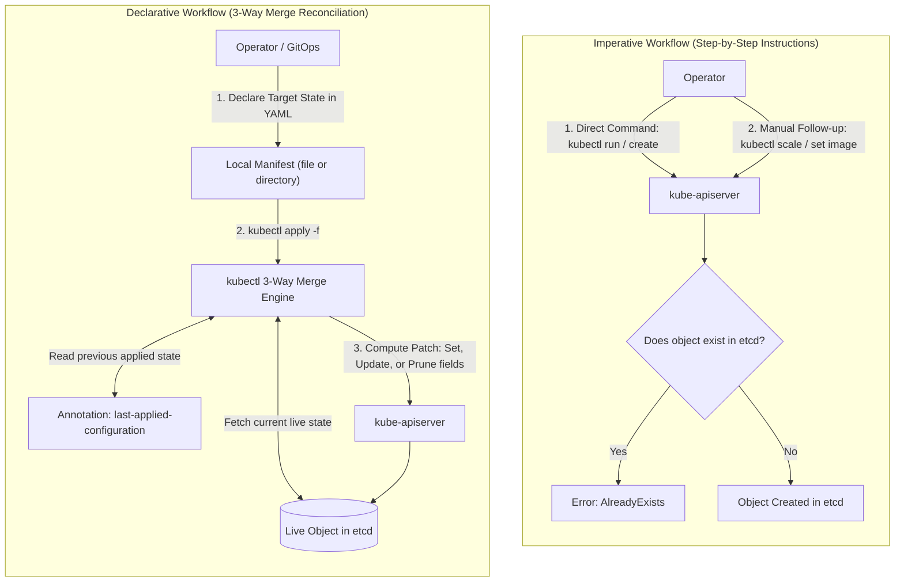
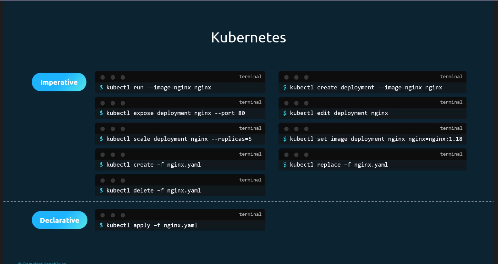
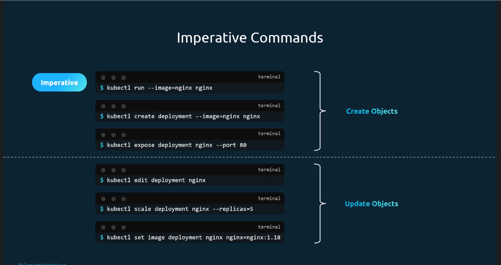
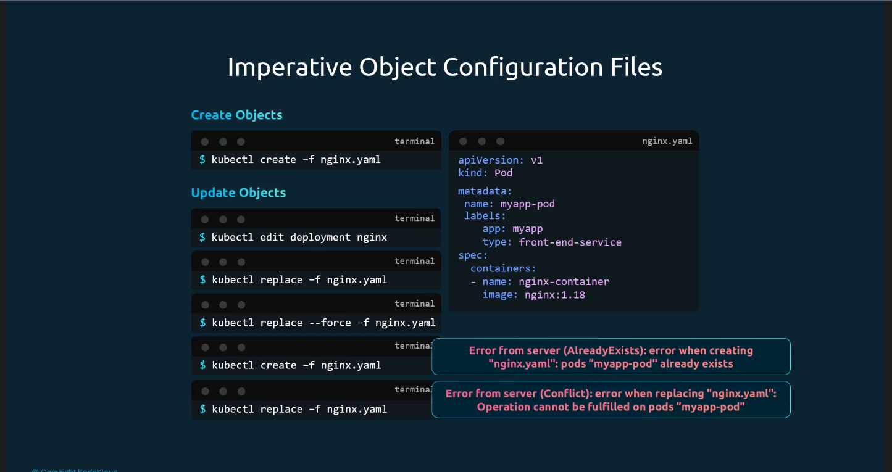
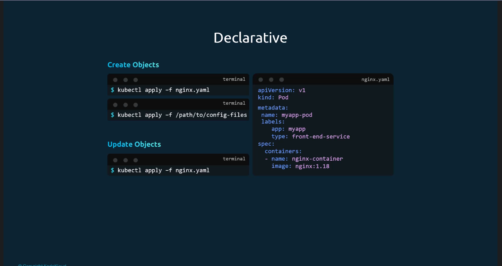
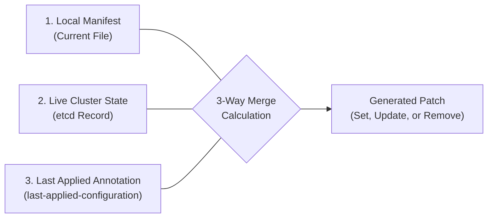
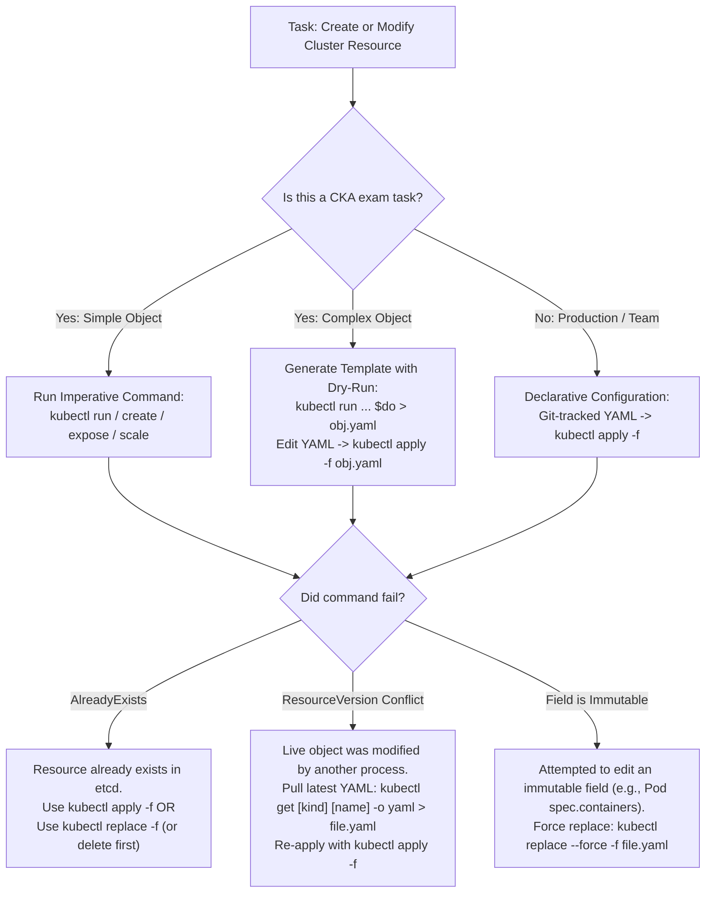

# Kubernetes Imperative vs. Declarative Management - CKA Exam Notes

> **Exam Domain**: Cluster Architecture, Installation & Configuration (25%) / Workloads & Scheduling (15%) / Troubleshooting (30%)  
> **Weight / Importance**: High (Core methodology for executing tasks throughout the exam)  
> **Target Version**: Verified against v1.31 / v1.32 (Current CKA Curriculum)  
> **Allowed Docs Search Keywords**: `kubectl apply`, `imperative management`, `declarative management`, `manage resources`  
> **Source**: Generated from `imperative-vs-declarative-raw.md`

---

## 1. Quick-Reference Summary

- **Three Management Approaches**:
  1. **Imperative Commands**: Direct CLI execution (`kubectl run`, `kubectl create`, `kubectl expose`, `kubectl scale`, `kubectl set image`). Fastest for the CKA exam; modifies cluster state immediately without local files.
  2. **Imperative Object Configuration**: Local YAML manifests manipulated using imperative verbs (`kubectl create -f`, `kubectl replace -f`, `kubectl delete -f`). Not idempotent; fails if the object already exists or has version conflicts.
  3. **Declarative Object Configuration**: Local YAML manifests submitted using `kubectl apply -f <file-or-dir>`. Idempotent; automatically calculates additions, modifications, and deletions.
- **The 3-Way Merge Mechanism**: `kubectl apply` computes changes by comparing three states:
  - **Local file**: The new desired state specified by the user.
  - **Live state**: The current state stored in `etcd`.
  - **Last-applied configuration**: Stored in the live object's `metadata.annotations[kubectl.kubernetes.io/last-applied-configuration]`.
- **CKA Golden Rule for Speed**:
  - Never write YAML manifests completely from scratch.
  - Generate template manifests imperatively using:
    `kubectl <command> --dry-run=client -o yaml > manifest.yaml`
  - Modify the generated YAML file to add complex fields (e.g., volume mounts, affinity rules, environment variables).
  - Deploy using `kubectl apply -f manifest.yaml` or `kubectl create -f manifest.yaml`.
- **Idempotency Comparison**:
  - `kubectl create -f`: **Not idempotent**. Errors with `AlreadyExists` if the object exists.
  - `kubectl replace -f`: **Not idempotent**. Fails if the object does not exist or has a resource version `Conflict`.
  - `kubectl apply -f`: **Idempotent**. Creates if missing; updates if existing; retains unmanaged live fields.

---

## 2. Conceptual Overview & Mental Model

### Dual-Layer Architectural Understanding

- **Simple English Explanation (How It Works)**:
  - **The Imperative Approach (Action-Centric)**:
    In an imperative model, you issue step-by-step operational instructions to the system. You explicitly command the system *what action to perform* (e.g., "create a pod", "scale this deployment to 5 replicas", "update the container image to 1.18").
    - The operator is responsible for knowing the current state of the cluster before running a command.
    - If you instruct the system to "create" an object that already exists, the operation fails because the instruction does not match the real-world condition.
    - Commands executed directly in the terminal are lost in shell history and provide no version-controlled record of what was deployed.
  - **The Declarative Approach (State-Centric)**:
    In a declarative model, you declare *the final target state* of your applications in configuration files (e.g., "there should be a deployment named nginx with 5 replicas running image nginx:1.18").
    - You do not specify the individual operational steps to reach that state.
    - You submit the configuration file using `kubectl apply`.
    - The Kubernetes control plane reads the declared file, inspects the current state stored in `etcd`, calculates the exact differences, and triggers reconciliation loops to bring actual state in line with declared state.
    - If the object does not exist, Kubernetes creates it. If the object already exists with 3 replicas, Kubernetes scales it to 5. If the object already has 5 replicas, Kubernetes does nothing.
    - The configuration files can be committed to a Git repository, providing a single source of truth, auditability, and reproducible deployments.



- **Standard / Production Definition**:
  In Kubernetes, declarative object management uses configuration files to define the desired state of cluster objects. Rather than executing explicit mutation procedures (`create`, `replace`, `delete`), users apply configuration files using `kubectl apply`. The system relies on a three-way merge patch between the local configuration, the live cluster record, and the `last-applied-configuration` annotation to calculate minimal state transitions, ensuring idempotency and GitOps compatibility.

---

## 3. Deep-Dive Technical Breakdown

### 3.1 The Three Resource Management Approaches

Kubernetes supports three distinct methods for creating, updating, and deleting cluster objects:



#### Approach 1: Pure Imperative CLI Commands
Direct commands that specify resource operations on the command line without saving definitions to local files:



- **Object Creation**:
  - `kubectl run nginx --image=nginx` (Creates a Pod)
  - `kubectl create deployment nginx --image=nginx` (Creates a Deployment)
  - `kubectl expose deployment nginx --port=80` (Creates a Service)
- **Object Modification**:
  - `kubectl edit deployment nginx` (Opens live object in text editor)
  - `kubectl scale deployment nginx --replicas=5` (Mutates replica count)
  - `kubectl set image deployment nginx nginx=nginx:1.18` (Updates container image)
- **Strengths**: Fastest execution time; indispensable for solving CKA exam scenarios under tight time constraints.
- **Weaknesses**: No change history, no version control, difficult to reproduce, unsuitable for complex configurations (such as multi-container pods or volume mounts).

---

### 3.2 Imperative Object Configuration Files

In this hybrid approach, object specifications are written to local YAML or JSON files, but manipulated using imperative subcommands (`create`, `replace`, `delete`):



```yaml
# nginx.yaml
apiVersion: v1
kind: Pod
metadata:
  name: myapp-pod
  labels:
    app: myapp
    type: front-end-service
spec:
  containers:
  - name: nginx-container
    image: nginx:1.18
```

#### Operational Mechanics & Inherent Pitfalls:
1. **Creation**:
   ```bash
   kubectl create -f nginx.yaml
   ```
   If the Pod `myapp-pod` already exists in the cluster, this command fails:
   ```
   Error from server (AlreadyExists): error when creating "nginx.yaml": pods "myapp-pod" already exists
   ```
2. **Updating via `replace`**:
   To update an existing object from a modified local file:
   ```bash
   kubectl replace -f nginx.yaml
   ```
   - If the object does not already exist in the cluster, `kubectl replace` fails.
   - If another process updated the live object in the meantime (incrementing `metadata.resourceVersion`), `kubectl replace` rejects the update with a version conflict error:
     ```
     Error from server (Conflict): error when replacing "nginx.yaml": Operation cannot be fulfilled on pods "myapp-pod"
     ```
3. **Updating via `replace --force`**:
   If an update involves immutable fields (e.g., container ports or commands in a Pod):
   ```bash
   kubectl replace --force -f nginx.yaml
   ```
   This performs a **delete followed by an immediate recreate**, resulting in service interruption and a newly assigned UID and Pod IP.

---

### 3.3 Declarative Object Configuration & The 3-Way Merge

In the declarative approach, users operate exclusively against local configuration files using `kubectl apply`:



```bash
# Create or update an individual object
kubectl apply -f nginx.yaml

# Create or update an entire directory of manifests
kubectl apply -f /path/to/config-files/

# Recursively process subdirectories
kubectl apply -f /path/to/config-files/ -R
```

#### How `kubectl apply` Works: The 3-Way Merge Patch Engine
Unlike `kubectl replace` (which replaces the entire object spec), `kubectl apply` calculates a minimal patch by analyzing three components:

```
+-------------------------------------------------------------------------------------------------------+
|                                    The 3-Way Merge Calculation                                        |
+-------------------------------------------------------------------------------------------------------+
| 1. Local File:                 What the user currently desires in their manifest                      |
| 2. Live State (etcd):          What currently exists in the running cluster (including server defaults)|
| 3. Last-Applied-Configuration: What was declared in the previous 'kubectl apply' operation            |
+-------------------------------------------------------------------------------------------------------+
```



#### Field Reconciliation Decision Matrix:
| Field Scenario | Calculation Logic | Resulting Action |
| :--- | :--- | :--- |
| **Field present in Local File, different in Live State** | User explicitly updated their manifest. | Field in Live State is **updated** to match Local File. |
| **Field present in Local File, absent in Live State** | User added a new field to their manifest. | Field is **added** to Live State. |
| **Field absent in Local File, present in Last-Applied** | Field was previously declared, but user has now deleted it from the file. | Field is **removed** from Live State. |
| **Field absent in Local File, absent in Last-Applied, present in Live State** | Field was added by an admission controller, horizontal pod autoscaler, or server default (e.g., `clusterIP`). | Field is **retained** in Live State without modification. |

> [!IMPORTANT]
> **Where is Last-Applied Configuration Stored?**  
> `kubectl apply` serializes the applied configuration into a JSON string and stores it directly inside the live object's metadata:
> `metadata.annotations[kubectl.kubernetes.io/last-applied-configuration]`  
> Because this annotation is stored within the object itself in `etcd`, any developer or CI/CD runner executing `kubectl apply` from any machine has access to the exact baseline of the previous deployment.

---

## 4. Command Translation & Operational Mapping Tables

### 4.1 Comparison of Resource Management Approaches

| Feature | Imperative CLI Commands | Imperative Object Config | Declarative Object Config |
| :--- | :--- | :--- | :--- |
| **Primary Command** | `kubectl run`, `create`, `scale` | `kubectl create -f`, `replace -f` | `kubectl apply -f` |
| **Configuration Medium** | Command-line arguments | Local YAML/JSON files | Local YAML/JSON files |
| **Idempotent?** | No | No (errors if exists or missing) | **Yes** |
| **Supports Directories?** | No | Yes (`-f <dir>`) | **Yes (`-f <dir>` and `-R`)** |
| **Version Controlled?** | No (only shell history) | Yes (Git) | **Yes (Git / GitOps standard)**|
| **Field Pruning Support?** | No | No | **Yes (`--prune`)** |
| **CKA Exam Value** | **Maximum speed for simple tasks** | Moderate | **Best for complex & multi-object tasks** |

---

### 4.2 Operational Mapping: Common Administrative Tasks

| Administrative Task | Imperative CLI Command | Imperative Object Config | Declarative Object Config |
| :--- | :--- | :--- | :--- |
| **Create a Pod** | `kubectl run nginx --image=nginx` | `kubectl create -f pod.yaml` | `kubectl apply -f pod.yaml` |
| **Create a Deployment** | `kubectl create deployment web --image=nginx` | `kubectl create -f deploy.yaml` | `kubectl apply -f deploy.yaml` |
| **Scale Workload** | `kubectl scale deployment web --replicas=4` | Edit `deploy.yaml` $\to$ `kubectl replace -f deploy.yaml` | Edit `deploy.yaml` $\to$ `kubectl apply -f deploy.yaml` |
| **Update Image** | `kubectl set image deploy/web nginx=nginx:1.20` | Edit `deploy.yaml` $\to$ `kubectl replace -f deploy.yaml` | Edit `deploy.yaml` $\to$ `kubectl apply -f deploy.yaml` |
| **Expose a Service** | `kubectl expose deploy web --port=80` | `kubectl create -f svc.yaml` | `kubectl apply -f svc.yaml` |
| **Delete an Object** | `kubectl delete pod nginx` | `kubectl delete -f pod.yaml` | `kubectl delete -f pod.yaml` |

---

## 5. High-Yield CLI & Imperative Commands

### 5.1 The CKA Hybrid Pattern: Fast Manifest Generation

Under the strict time constraints of the CKA exam, the optimal strategy combines the speed of imperative commands with the precision of declarative files:

```bash
# 1. Alias the dry-run flags in your shell
export do="--dry-run=client -o yaml"

# 2. Generate a Pod manifest instantly
kubectl run my-pod --image=nginx $do > pod.yaml

# 3. Generate a Deployment with 3 replicas
kubectl create deployment my-deploy --image=nginx --replicas=3 $do > deploy.yaml

# 4. Generate a Service exposing a deployment
kubectl expose deployment my-deploy --name=my-service --port=80 --target-port=8080 $do > svc.yaml

# 5. Generate a Job manifest
kubectl create job my-job --image=busybox $do -- /bin/sh -c "echo Hello; sleep 5" > job.yaml

# 6. Generate a ConfigMap imperatively
kubectl create configmap app-config --from-literal=DB_HOST=mysql --from-literal=DB_PORT=3306 $do > cm.yaml
```

---

### 5.2 Declarative Inspection & Diffing

Before applying changes to a production cluster or during troubleshooting:

```bash
# 1. Preview changes between local file and live state without applying
kubectl diff -f deploy.yaml

# 2. Inspect the last-applied-configuration annotation directly
kubectl get deployment my-deploy -o jsonpath='{.metadata.annotations.kubectl\.kubernetes\.io/last-applied-configuration}' | jq .

# 3. Apply all manifests in a directory
kubectl apply -f ./manifests/

# 4. Apply all manifests recursively through subdirectories
kubectl apply -f ./manifests/ -R
```

---

## 6. Troubleshooting & Diagnostic Runbook

### Decision Tree: Choosing the Right Approach & Resolving Failures



### Step-by-Step Triage Sequence

1. **Resolving `Error from server (AlreadyExists)`**:
   - Occurs when running `kubectl create -f file.yaml` or `kubectl run` against an existing object.
   - *Fix*: Switch to `kubectl apply -f file.yaml`, or export and inspect the existing object:
     ```bash
     kubectl get <kind> <name> -o yaml
     ```

2. **Resolving `Error from server (Conflict)` on Replace**:
   - Occurs when the live object has updated its `resourceVersion` since the local file was exported.
   - *Fix*: Use `kubectl apply -f file.yaml` (which uses a 3-way merge patch and ignores stale resource versions), or fetch a fresh copy of the object before replacing:
     ```bash
     kubectl get <kind> <name> -o yaml > fresh.yaml
     # Make edits to fresh.yaml
     kubectl replace -f fresh.yaml
     ```

3. **Resolving Immutable Field Modification Errors**:
   - Pod specifications (except for `spec.containers[*].image`, `activeDeadlineSeconds`, and `tolerations`) are immutable.
   - *Fix*: Execute a force-replacement:
     ```bash
     kubectl replace --force -f pod.yaml
     ```
     This instructs `kube-apiserver` to immediately delete the live object and recreate it with the new definition.

---

## 7. CKA Exam Tips, Gotchas & Traps

> [!WARNING]
> **The Danger of Mixing Imperative and Declarative Approaches**:
> If an object is created with `kubectl apply`, modifying it subsequently with `kubectl edit` or imperative CLI commands (`kubectl set image`) creates drift between your local YAML file and the live cluster state. If someone later runs `kubectl apply -f file.yaml`, the 3-way merge may overwrite the imperative modifications! Always keep your local files updated if you plan to reuse them.

> [!IMPORTANT]
> **Time Management in the Exam**:
> Never open an empty file in `vim` and write a Kubernetes YAML manifest from scratch. You will lose valuable minutes on indentation and spelling errors. Always generate boilerplate using `kubectl <subcommand> $do > file.yaml`, open the file, make the required modifications, and apply it.

> [!TIP]
> **`kubectl create` vs. `kubectl apply` in Exam Scenarios**:
> - If an exam task says *"Create a pod named nginx using image nginx"*, running `kubectl run nginx --image=nginx` is completely acceptable and scores full points.
> - If an exam task provides an existing manifest file (e.g., `/opt/course/12/pod.yaml`), prefer running `kubectl apply -f /opt/course/12/pod.yaml`. If the object already exists in the cluster, `kubectl create` will throw an error, whereas `kubectl apply` safely reconciles it.

---

## 8. Self-Test / Active Recall

Test your comprehension before clicking to reveal the solutions:

1. **What are the three components evaluated by `kubectl apply` to perform a 3-way merge patch?**
2. **Where is the `last-applied-configuration` stored in the Kubernetes cluster?**
3. **If a field is deleted from a local YAML file and `kubectl apply -f` is executed, how does Kubernetes know to remove that field from the live object?**
4. **What happens if you run `kubectl create -f pod.yaml` when a pod with that exact name already exists in the namespace?**
5. **How does `kubectl replace --force -f manifest.yaml` update an object that has immutable fields?**
6. **What shell syntax allows you to preview the generated YAML specification of a Deployment without creating it in the cluster?**
7. **What is the operational risk of using `kubectl edit` on a resource that is regularly deployed via CI/CD with `kubectl apply -f`?**

<details>
<summary>Reveal Answers</summary>

1. **The Local Configuration File**, **The Live Object State (in etcd)**, and **The Last-Applied-Configuration Annotation**.
2. Inside the live object's metadata in `etcd`, specifically in the annotation: `metadata.annotations["kubectl.kubernetes.io/last-applied-configuration"]`.
3. It compares the local file with the `last-applied-configuration` annotation. Because the field is present in `last-applied-configuration` but missing from the local file, `kubectl apply` concludes that the user explicitly removed it, and issues a patch to delete the field from the live state.
4. It fails with an error: `Error from server (AlreadyExists): pods "..." already exists`.
5. It performs a **delete followed by an immediate recreate** (`DELETE` followed by `POST`), assigning a new UID and starting fresh containers.
6. `kubectl create deployment <name> --image=<image> --dry-run=client -o yaml`
7. `kubectl edit` modifies only the live object in `etcd`. Because the local file is not updated, the next `kubectl apply` will overwrite or conflict with the manual changes, wiping them out.
</details>

---

### Official Documentation Bookmarks

Allowed for reference during the live exam at [kubernetes.io/docs](https://kubernetes.io/docs/home/):

| Topic | Direct Search Term | Recommended Anchor |
| :--- | :--- | :--- |
| **Kubectl Object Management** | `Managing Resources` | Tasks > Manage Kubernetes Objects > Managing Kubernetes Objects Using Imperative Commands |
| **Declarative Management** | `Declarative Management of Kubernetes Objects` | Tasks > Manage Kubernetes Objects > Declarative Management of Kubernetes Objects Using Configuration Files |
| **Kubectl Cheat Sheet** | `kubectl Cheat Sheet` | Reference > kubectl CLI > kubectl Cheat Sheet |
| **Kubectl Apply Documentation** | `kubectl apply` | Reference > Command-Line Tools > kubectl > kubectl apply |

