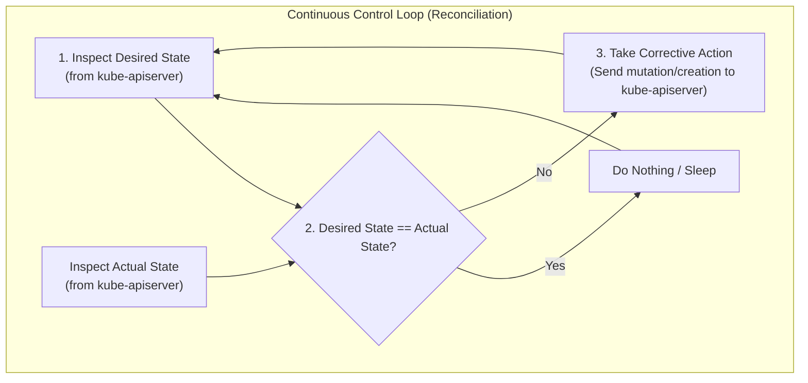
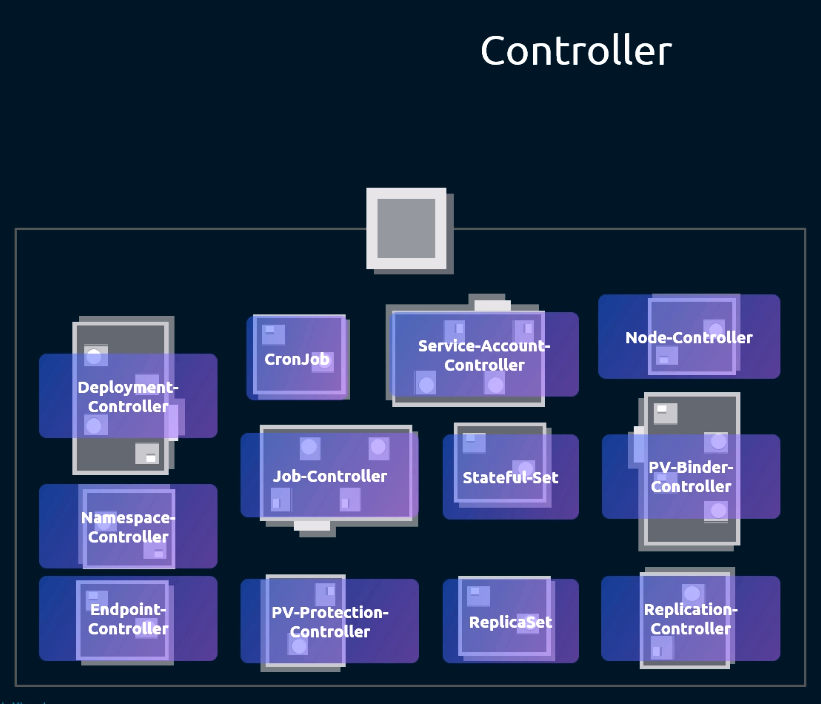
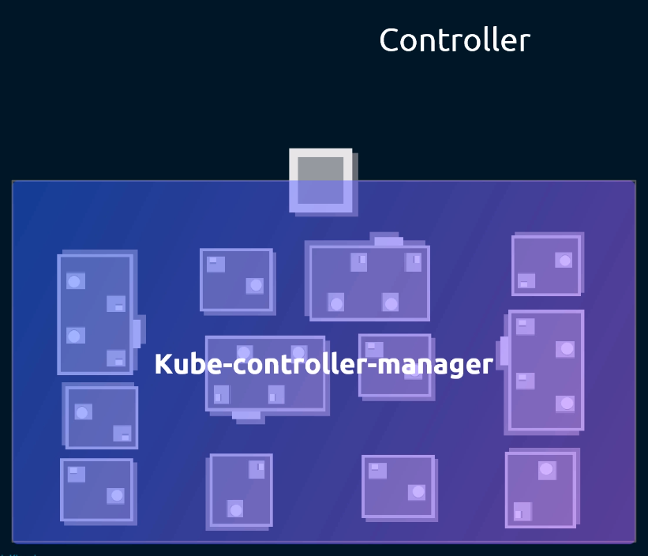
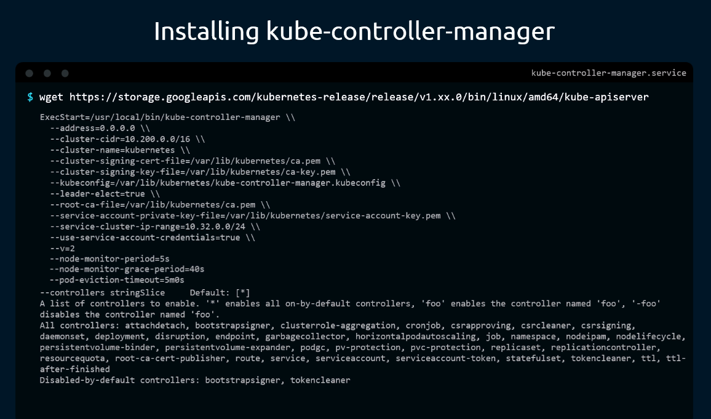
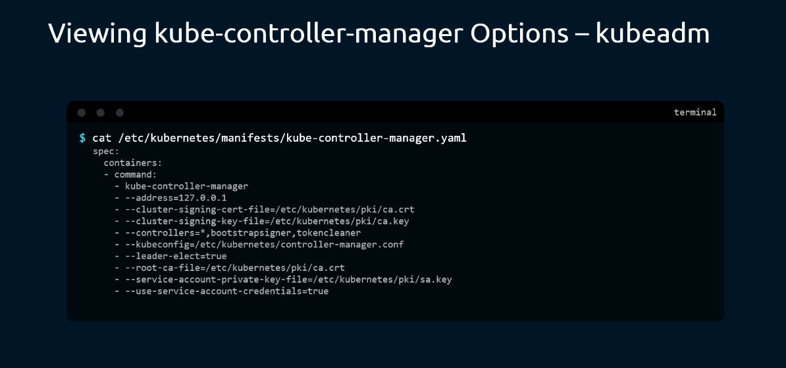
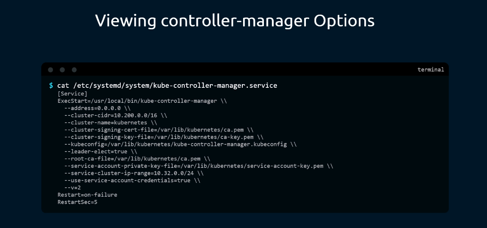
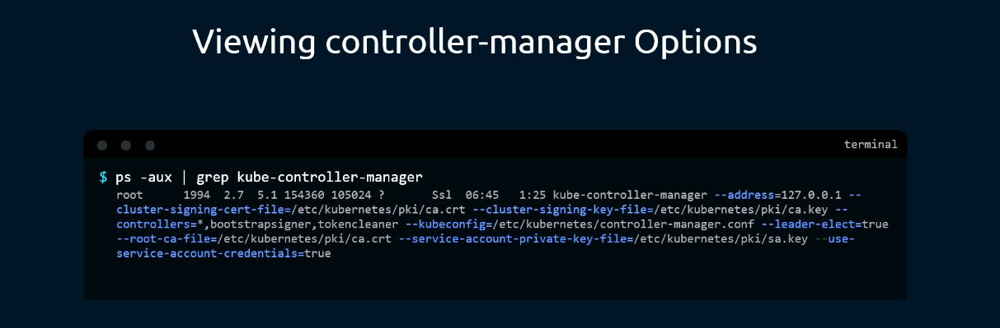
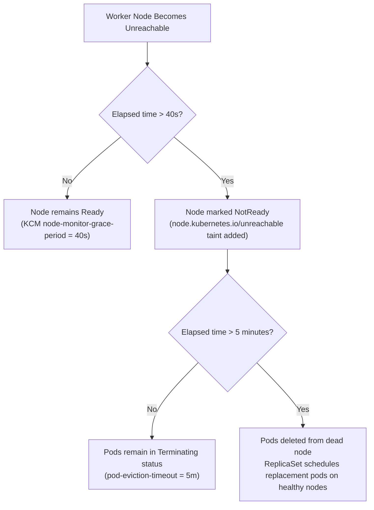

# Kubernetes Controller Manager (`kube-controller-manager`) - CKA Exam Notes

> **Exam Domain**: Cluster Architecture, Installation & Configuration (25%) / Troubleshooting (30%)  
> **Weight / Importance**: Critical  
> **Target Version**: Verified against v1.31 / v1.32 (Current CKA Curriculum)  
> **Allowed Docs Search Keywords**: `kube-controller-manager`, `kube-controller-manager options`, `static pods`  
> **Source**: Generated from `kube-controller-manager-raw.md`

---

## 1. Quick-Reference Summary

- **Primary Role**: The brain's autonomous control loop engine. Embeds multiple specialized controllers into a single process to continuously monitor cluster state via `kube-apiserver` and reconcile actual state toward the desired state.
- **Default Port**: Secure HTTPS port **`10257`** (metrics and health check). Legacy insecure port `10252` is deprecated/disabled.
- **Deployment Mode**:
  - **Kubeadm (Default)**: Static Pod located at `/etc/kubernetes/manifests/kube-controller-manager.yaml`. Managed directly by the master node's `kubelet`.
  - **Manual / Hard Way**: Linux systemd service located at `/etc/systemd/system/kube-controller-manager.service`.
- **Three Ways to View Configured Options**:
  1. Inspect static pod manifest: `cat /etc/kubernetes/manifests/kube-controller-manager.yaml`
  2. Inspect systemd service file: `cat /etc/systemd/system/kube-controller-manager.service`
  3. Inspect running host process: `ps -aux | grep kube-controller-manager`
- **Node Lifecycle Timing Parameters (CKA Critical)**:
  - `--node-monitor-period=5s`: How frequently KCM polls/checks node heartbeats.
  - `--node-monitor-grace-period=40s`: How long KCM waits before marking a silent node `NotReady` / unreachable.
  - `--pod-eviction-timeout=5m0s`: How long KCM waits on an unreachable node before evicting pods and triggering ReplicaSet recreation on healthy nodes.
- **High Availability & Leader Election**:
  - In multi-master clusters, multiple KCM instances run, but only **one active leader** runs the control loops.
  - Controlled by `--leader-elect=true`. Standby instances continuously compete for a Lease lock in `kube-system`.
- **Enabling/Disabling Controllers**:
  - Controlled via `--controllers=<list>`. Default is `*` (all on-by-default controllers).
  - Prefix with `-` to disable (e.g. `--controllers=*,-bootstrapsigner`).

---

## 2. Conceptual Overview & Mental Model

### Dual-Layer Architectural Understanding

- **Simple English Explanation (How It Works)**:
  - **The Reconciliation Control Loop**: A controller in Kubernetes is a background process that continuously monitors the state of cluster components and takes action to bring the system to the desired functioning state. It operates in a non-stop loop:
    1. **Observe Actual State**: Regularly queries `kube-apiserver` to check the real-world status of resources (e.g. how many pods are actually running, or whether nodes are sending heartbeats).
    2. **Compare with Desired State**: Checks whether the actual state matches the target configuration defined by the user in the resource specifications (e.g. `spec.replicas: 3`).
    3. **Take Corrective Action**: If a discrepancy exists (e.g. only 2 pods are running instead of 3), it sends requests to `kube-apiserver` to create, update, or remove resources until the actual state matches the desired state.
  - **Why Bundle Everything into `kube-controller-manager`?**:
    Kubernetes relies on dozens of separate controllers (such as the Node Controller, ReplicaSet Controller, Deployment Controller, and Namespace Controller). Running each controller as an independent Linux daemon would introduce unnecessary process management complexity, resource waste, and configuration overhead. Kubernetes bundles all of these essential control loops into a **single unified binary**: the `kube-controller-manager`.



- **Standard / Production Definition**:
  The Kubernetes controller manager is a daemon that embeds the core control loops shipped with Kubernetes. In applications of robotics and automation, a control loop is a non-terminating loop that regulates the state of the system. In Kubernetes, a controller tracks at least one Kubernetes resource type, and objects have a `spec` field that represents the desired state.

---

## 3. Deep-Dive Technical Breakdown

### 3.1 The Multi-Controller Ecosystem

All essential Kubernetes controllers are packaged together inside the `kube-controller-manager`:





#### 1. Node Controller
Responsible for observing node health and responding when worker nodes go down:
- **Node Monitor Period (`--node-monitor-period=5s`)**: Checks the status of every node every 5 seconds.
- **Node Monitor Grace Period (`--node-monitor-grace-period=40s`)**: If a node stops sending heartbeats, the Node Controller waits 40 seconds before marking the node `NotReady` (applying the `node.kubernetes.io/unreachable:NoSchedule` taint).
- **Pod Eviction Timeout (`--pod-eviction-timeout=5m0s`)**: If the node remains unreachable for 5 minutes, the Node Controller triggers pod deletion from that node. If those pods belong to a ReplicaSet or Deployment, the ReplicaSet Controller immediately schedules replacements onto healthy nodes.

#### 2. Replication Controller & ReplicaSet Controller
- **Headcount Enforcer**: Continuously ensures that the exact number of pod replicas specified in `spec.replicas` are running.
- If a pod crashes or is terminated due to node eviction, it issues a request to `kube-apiserver` to create a new pod. If there are excess pods (e.g., after scale-down), it terminates the surplus pods.

#### 3. Deployment Controller
- Orchestrates progressive rollouts and rollbacks.
- Creates and updates underlying ReplicaSets when a Deployment's pod template is updated.

#### 4. Namespace Controller
- Handles namespace lifecycle. When a namespace is deleted, this controller deletes all resources residing inside that namespace before permanently removing the namespace object.

#### 5. ServiceAccount Controller & Token Controller
- Creates a default `ServiceAccount` automatically whenever a new namespace is created.
- Handles creation and injection of API access tokens for ServiceAccounts.

#### 6. EndpointSlice & Endpoints Controller
- Watches Services and Pods. Whenever pods matching a Service's label selector become `Ready`, it creates and updates EndpointSlice objects mapping the Service's ClusterIP to the live Pod IPs.

#### 7. Job & CronJob Controller
- Manages run-to-completion batch tasks. Spawns pods to execute batch jobs, monitors container exit codes, and retries jobs upon failure.

---

### 3.2 Installation Topologies: Kubeadm vs. Manual Service

#### 1. Kubeadm Static Pod Setup (Standard)
On clusters provisioned with `kubeadm`, KCM runs as a **Static Pod** managed by `kubelet`.
- **Manifest Location**: `/etc/kubernetes/manifests/kube-controller-manager.yaml`
- **Kubeconfig Path**: `/etc/kubernetes/controller-manager.conf` (authenticated via client certificates to communicate with `kube-apiserver`).
- **Lifecycle**: Any edit to `/etc/kubernetes/manifests/kube-controller-manager.yaml` triggers an automatic container restart by `kubelet`.

#### 2. Manual / Systemd Service Installation ("Hard Way")
In manual installations, the binary is downloaded directly from Google storage repositories and registered as a native systemd unit:



```bash
# 1. Download the official binary
wget https://storage.googleapis.com/kubernetes-release/release/v1.31.0/bin/linux/amd64/kube-controller-manager
chmod +x kube-controller-manager
sudo mv kube-controller-manager /usr/local/bin/

# 2. Configure systemd unit file (/etc/systemd/system/kube-controller-manager.service)
sudo systemctl daemon-reload
sudo systemctl start kube-controller-manager
sudo systemctl enable kube-controller-manager
```

---

## 4. Viewing & Inspecting Controller Manager Options

On the CKA exam, you may be asked to inspect or modify KCM settings (e.g. adjusting node grace periods or enabling specific controllers). There are three standard methods:

### Method 1: Inspect the Kubeadm Static Pod Manifest

If the cluster was initialized using `kubeadm`:



```bash
cat /etc/kubernetes/manifests/kube-controller-manager.yaml
```

Key lines under `spec.containers[0].command`:
```yaml
spec:
  containers:
  - command:
    - kube-controller-manager
    - --bind-address=127.0.0.1
    - --cluster-signing-cert-file=/etc/kubernetes/pki/ca.crt
    - --cluster-signing-key-file=/etc/kubernetes/pki/ca.key
    - --controllers=*,bootstrapsigner,tokencleaner
    - --kubeconfig=/etc/kubernetes/controller-manager.conf
    - --leader-elect=true
    - --root-ca-file=/etc/kubernetes/pki/ca.crt
    - --service-account-private-key-file=/etc/kubernetes/pki/sa.key
    - --use-service-account-credentials=true
```

---

### Method 2: Inspect the Systemd Service File (Manual Deployments)

If running as an independent host service:



```bash
cat /etc/systemd/system/kube-controller-manager.service
```

Look for flags appended to `ExecStart=/usr/local/bin/kube-controller-manager`.

---

### Method 3: Inspect the Running Process with `ps -aux` (Universal)

To see the exact live flags active in memory across all deployment models:



```bash
ps -aux | grep kube-controller-manager
```

---

## 5. Command Translation & Operational Mapping Tables

### 5.1 Inspection Methods Comparison

| Feature | Kubeadm Static Pod (`kube-controller-manager.yaml`) | Systemd Unit (`kube-controller-manager.service`) | Running Process (`ps -aux`) |
| :--- | :--- | :--- | :--- |
| **Path** | `/etc/kubernetes/manifests/kube-controller-manager.yaml` | `/etc/systemd/system/kube-controller-manager.service` | Live in kernel process table |
| **How to Edit** | Edit file directly using `vim` / `nano` | Edit file with `vim` / `nano` | Read-only runtime view |
| **Reload Trigger** | Automatically detected & recreated by `kubelet` | `systemctl daemon-reload && systemctl restart kube-controller-manager` | Requires restarting parent service |
| **Log Location** | `crictl logs <container-id>` or `/var/log/pods` | `journalctl -u kube-controller-manager -f` | Output sent to journal / container log |

---

### 5.2 Key Command-Line Flags Reference Table

| Flag Name | Example / Default | Description & CKA Importance |
| :--- | :--- | :--- |
| `--controllers` | `*` | Comma-separated list of controllers to enable. Prepending `-` disables a controller (e.g. `--controllers=*,-cronjob`). |
| `--node-monitor-period` | `5s` | Polling interval for node controller health checks. |
| `--node-monitor-grace-period` | `40s` | Time window before an unresponsive node is marked `NotReady`. |
| `--pod-eviction-timeout` | `5m0s` | Grace period after node failure before pods are evicted. |
| `--leader-elect` | `true` | Enables active/standby leader election across multi-master nodes. |
| `--kubeconfig` | `/etc/kubernetes/controller-manager.conf` | Path to kubeconfig used to authenticate against `kube-apiserver`. |
| `--cluster-signing-cert-file` | `/etc/kubernetes/pki/ca.crt` | CA certificate used to sign CertificateSigningRequests (CSRs). |
| `--cluster-signing-key-file` | `/etc/kubernetes/pki/ca.key` | Private key used to sign CertificateSigningRequests (CSRs). |
| `--root-ca-file` | `/etc/kubernetes/pki/ca.crt` | Root CA injected into Pod ServiceAccount token secrets. |

---

## 6. High-Yield CLI & Imperative Commands

### 6.1 Inspecting Controller Manager Status & Logs

```bash
# 1. Verify that the controller manager static pod is Running
kubectl get pods -n kube-system -l k8s-app=kube-controller-manager

# 2. View live logs from the active controller manager
kubectl logs -n kube-system -l k8s-app=kube-controller-manager --tail=50

# 3. Check leader election status (identify which master holds the active lock)
kubectl get lease kube-controller-manager -n kube-system -o yaml | grep holderIdentity

# 4. Filter active flags using ps
ps -aux | grep kube-controller-manager | grep -o -- "--[a-z0-9-]*=[^ ]*"
```

---

### 6.2 Low-Level Node Diagnostics with `crictl`

On the control plane node when the API server or `kubectl` is unresponsive:

```bash
# List all controller-manager containers
crictl ps -a --name kube-controller-manager

# View container logs directly from CRI runtime
crictl logs $(crictl ps -a -q --name kube-controller-manager | head -n 1)
```

---

## 7. Troubleshooting & Diagnostic Runbook

### Scenario: Node Goes Down, But Pods Are Not Rescheduled Immediately



#### Step-by-Step Triage Sequence:
1. **Verify Controller Manager Health**:
   ```bash
   kubectl get pods -n kube-system | grep controller
   ```
2. **Inspect Leader Election Lease**:
   If running multi-master, verify that a leader is actively holding the lock:
   ```bash
   kubectl get lease -n kube-system kube-controller-manager
   ```
   If `HOLDER` is empty or renewal is stale, KCM instances may be crashing or unable to reach `kube-apiserver`.
3. **Inspect Crash Logs**:
   ```bash
   kubectl logs -n kube-system kube-controller-manager-controlplane
   ```
   *Common errors to look for*:
   - `x509: certificate has expired`: Cluster PKI certificates need renewal (`kubeadm certs renew all`).
   - `connection refused to 127.0.0.1:6443`: `kube-apiserver` is down or starting up.
   - `invalid flag`: Typo introduced during an edit to `/etc/kubernetes/manifests/kube-controller-manager.yaml`.

---

## 8. CKA Exam Tips, Gotchas & Traps

> [!WARNING]
> **The 5-Minute Node Eviction Delay**:
> If an exam question asks: *"Why haven't pods on worker-2 rescheduled after worker-2 was stopped?"*, remember that KCM waits **40 seconds** (`--node-monitor-grace-period`) to mark the node `NotReady`, and then waits an additional **5 minutes** (`--pod-eviction-timeout`) before evicting pods! Total delay is ~340 seconds. Do not assume KCM is broken if pods do not move immediately.

> [!IMPORTANT]
> **Leader Election (`--leader-elect=true`) in HA Clusters**:
> If you inspect a secondary control plane node and notice that `kube-controller-manager` is using 0% CPU and not taking actions, **this is normal behavior**. KCM runs in an **Active/Standby** configuration. Only one master node acts as the leader; all other master KCMs stand by waiting to acquire the Lease lock if the leader fails.

> [!TIP]
> **Modifying Flags Safely in Static Pods**:
> Always take a quick backup before editing KCM manifests:
> ```bash
> sudo cp /etc/kubernetes/manifests/kube-controller-manager.yaml /tmp/kcm.yaml.bak
> ```
> If KCM fails to restart after your edit, check Kubelet logs immediately:
> ```bash
> journalctl -u kubelet -n 30 --no-pager
> ```

---

## 9. Self-Test / Active Recall

Test your comprehension before clicking to reveal the solutions:

1. **What is the fundamental operational loop performed by every Kubernetes controller?**
2. **Why are 30+ distinct controllers bundled together into the single `kube-controller-manager` binary instead of running as independent daemons?**
3. **How long does the Node Controller wait after node heartbeats stop before marking the node `NotReady`?**
4. **After a node is marked `NotReady`, what is the default timeout before the Node Controller initiates pod eviction?**
5. **In a high-availability cluster with 3 master nodes, how many `kube-controller-manager` instances are actively executing control loops at any given moment?**
6. **What command-line flag syntax would you add to `/etc/kubernetes/manifests/kube-controller-manager.yaml` to disable the `cronjob` controller while keeping all other default controllers enabled?**
7. **Which component does `kube-controller-manager` communicate with to read cluster state and issue resource creation/deletion requests?**

<details>
<summary>Reveal Answers</summary>

1. A non-terminating reconciliation loop: **Sense** (read actual state from API server) $\to$ **Compare** (evaluate difference between actual state and desired state) $\to$ **Act** (send mutation/creation commands to the API server to reconcile differences).
2. To eliminate process management overhead, simplify packaging and operational maintenance, and conserve system memory and CPU resources on control plane nodes.
3. **40 seconds** (governed by `--node-monitor-grace-period=40s`).
4. **5 minutes** (governed by `--pod-eviction-timeout=5m0s`).
5. **Only 1 active leader**. The other two instances run in standby mode, continuously competing for the leader election Lease object in the `kube-system` namespace.
6. `--controllers=*,-cronjob`.
7. **Exclusively with `kube-apiserver`**. KCM never communicates directly with `etcd`, `kubelet`, or worker nodes.
</details>

---

### Official Documentation Bookmarks

Allowed for reference during the live exam at [kubernetes.io/docs](https://kubernetes.io/docs/home/):

| Topic | Direct Search Term | Recommended Anchor |
| :--- | :--- | :--- |
| **kube-controller-manager Reference** | `kube-controller-manager` | Reference > Command-Line Tools > kube-controller-manager |
| **Kubernetes Components** | `Kubernetes Components` | Concepts > Overview > Kubernetes Components |
| **Static Pods** | `Create static pods` | Tasks > Configure Pods and Containers > Create static pods |
| **Node Lifecycle & Heartbeats** | `Node Controller` | Concepts > Architecture > Nodes #node-controller |

