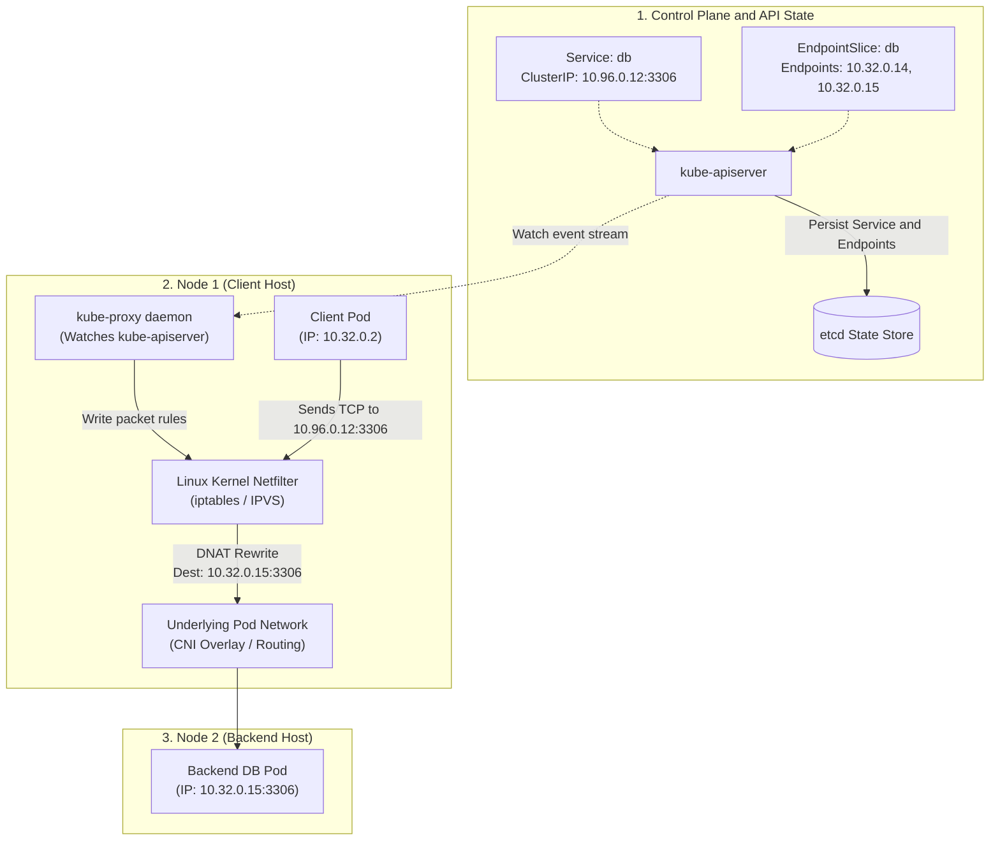
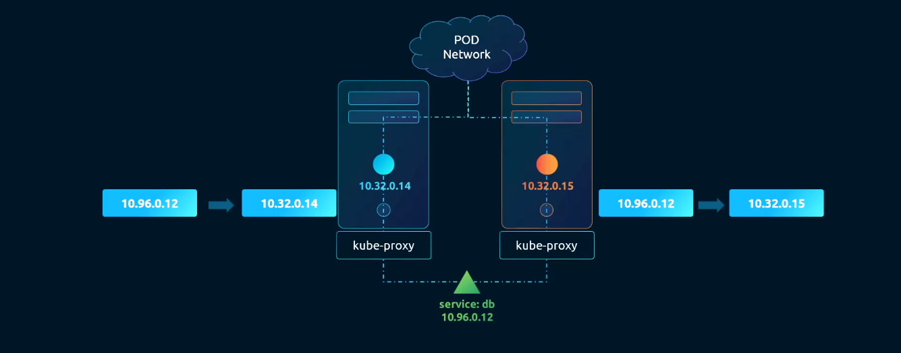
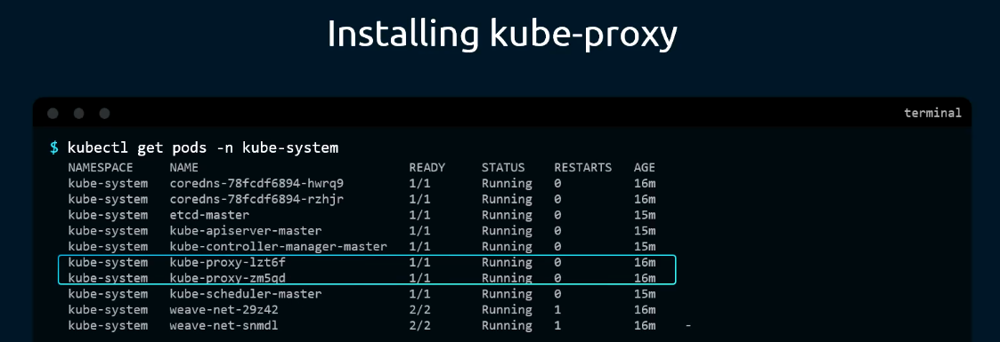
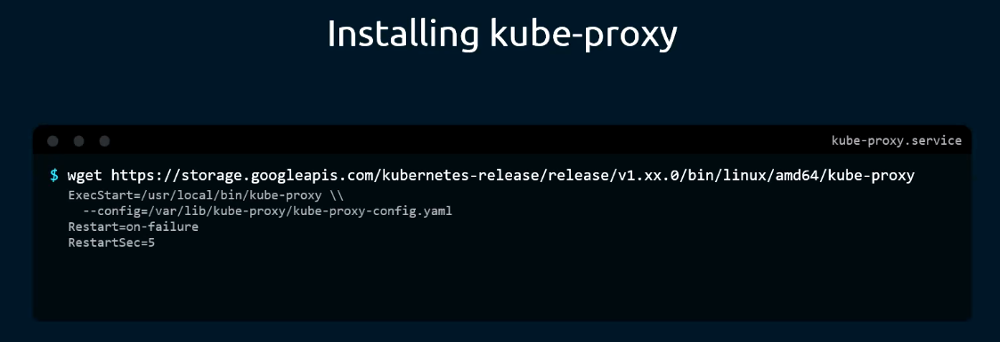
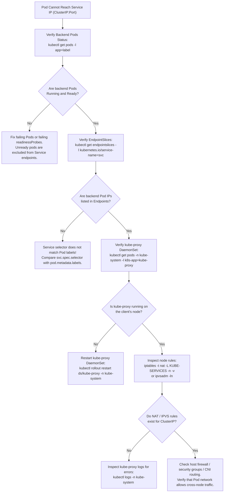

# Kubernetes Network Proxy (`kube-proxy`) - CKA Exam Notes

> **Exam Domain**: Services & Networking (20%) / Troubleshooting (30%)  
> **Weight / Importance**: High  
> **Target Version**: Verified against v1.31 / v1.32 (Current CKA Curriculum)  
> **Allowed Docs Search Keywords**: `kube-proxy`, `kube-proxy configuration`, `service network`, `iptables proxy mode`, `ipvs`  
> **Source**: Generated from `kube-proxy-raw.md`

---

## 1. Quick-Reference Summary

- **Primary Role**: A network daemon running on every node in the cluster that implements the Kubernetes Service abstraction. It monitors `kube-apiserver` for Service and EndpointSlice changes and programs local host packet-forwarding rules (via `iptables`, `IPVS`, or `nftables`) to map virtual Service ClusterIPs to healthy backend Pod IPs.
- **The Service Illusion**: A Kubernetes `Service` is not an application process, daemon, or network interface. It is an abstract API object that assigns a stable virtual IP (`ClusterIP`) in cluster memory. Without `kube-proxy` configuring packet translation rules on each host, packets sent to a Service IP would be dropped by the operating system kernel as unroutable.
- **Packet Translation Mechanism**: Performs Layer 4 (TCP/UDP/SCTP) Destination Network Address Translation (DNAT). When traffic targets `<ClusterIP>:<ServicePort>`, the host kernel translates the destination to a selected backend `<PodIP>:<ContainerPort>` before the packet leaves the network stack.
- **Proxy Modes**:
  - **`iptables` (Default)**: Uses Linux Netfilter `iptables` chains. Rules are evaluated sequentially ($O(N)$ complexity). Random load distribution is achieved using Netfilter statistic match modules.
  - **`ipvs`**: High-performance kernel IP Virtual Server using hash tables ($O(1)$ complexity). Supports advanced scheduling algorithms (round-robin, least connection, destination hashing). Recommended for clusters with thousands of services.
  - **`nftables` (Modern / Beta in v1.31+)**: Successor to `iptables` providing improved throughput and native atomic rule updates.
  - **`userspace` (Obsolete)**: Packets were forwarded via a user-space proxy socket; removed due to performance overhead of repeated context switching.
- **Deployment Topologies**:
  - **Kubeadm (Default)**: Runs as a **DaemonSet** named `kube-proxy` in the `kube-system` namespace. Configuration is stored in the `kube-proxy` ConfigMap in `kube-system`.
  - **Manual / Hard Way**: Executed directly as a native systemd unit located at `/etc/systemd/system/kube-proxy.service` reading `/var/lib/kube-proxy/kube-proxy-config.yaml`.
- **Default Ports**:
  - **`10249`** (Metrics): Prometheus metrics scraping endpoint.
  - **`10256`** (Health Check): HTTP health check endpoint (`/healthz`).
- **ICMP Limitation**: A Service `ClusterIP` **does not respond to ICMP ping**. Network verification must use Layer 4 connection tools like `curl`, `nc`, or `wget`.

---

## 2. Conceptual Overview & Mental Model

### Dual-Layer Architectural Understanding

- **Simple English Explanation (How It Works)**:
  - **The Problem: Ephemeral Pods**: In Kubernetes, Pods are non-permanent entities. When a Pod crashes, scales down, or is redeployed during a rollout, it is destroyed. Its replacement receives an entirely new IP address from the Pod CIDR. If applications communicated with each other directly using Pod IPs, every configuration would break whenever Pods cycle.
  - **The Abstraction: Services**: To solve this, Kubernetes provides a `Service`. A Service gives a group of Pods a permanent virtual IP address (`ClusterIP`) and a DNS name (e.g., `db.default.svc.cluster.local`). Application clients send requests exclusively to this stable Service IP.
  - **The Missing Link: Services Don't Exist in the OS**: A Service is purely an API resource defined in `etcd`. No network interface is created for the Service IP, and no host process listens on the Service port. If a Pod attempts to send a packet to `10.96.0.12`, the Linux kernel would normally drop the packet because that IP does not belong to any local adapter or known route.
  - **What `kube-proxy` Does**: `kube-proxy` runs on every single node in the cluster. It constantly watches `kube-apiserver` for new or updated Services and their corresponding `EndpointSlice` resources (which track the current live Pod IPs).
  - Whenever a Service is created or changed, `kube-proxy` injects packet-filtering rules directly into the node's Linux kernel network subsystem (using `iptables` or `IPVS`).
  - When any Pod on that node transmits data to `10.96.0.12:80`, the Linux kernel intercepts the packet in the Netfilter subsystem, replaces the destination IP `10.96.0.12` with one of the live backend Pod IPs (e.g., `10.32.0.15`), and forwards the modified packet across the Pod network.



- **Standard / Production Definition**:
  `kube-proxy` is a network proxy that runs on each node in your cluster, implementing part of the Kubernetes Service concept. It maintains network rules on nodes that allow network communication to your Pods from network sessions inside or outside of your cluster. It uses the operating system packet filtering layer if there is one and it's available. Otherwise, `kube-proxy` forwards the traffic itself.

---

## 3. Deep-Dive Technical Breakdown

### 3.1 Enabling the Service Concept

The core task of `kube-proxy` is translating the abstract Service definition into physical packet routing rules across all cluster nodes:



As shown in the architecture above:
1. The service `db` is assigned a virtual ClusterIP `10.96.0.12`.
2. Two backend Pods run on separate nodes with real IPs `10.32.0.14` and `10.32.0.15`.
3. `kube-proxy` instances running on each node program local forwarding rules:
   - Any packet arriving on Node 1 addressed to `10.96.0.12` is rewritten via DNAT to `10.32.0.14` or `10.32.0.15`.
   - Any packet arriving on Node 2 addressed to `10.96.0.12` is likewise rewritten to one of the backend Pod IPs.

---

### 3.2 Kube-Proxy Modes: `iptables` vs. `ipvs` vs. `nftables`

#### 1. `iptables` Mode (Default)
In `iptables` mode, `kube-proxy` configures Linux Netfilter `nat` table chains:
- **Chain Hierarchy**:
  - `PREROUTING` / `OUTPUT` $\to$ `KUBE-SERVICES`
  - `KUBE-SERVICES` identifies traffic matching the Service's ClusterIP and jumps to `KUBE-SVC-<SERVICE-HASH>`.
  - `KUBE-SVC-<SERVICE-HASH>` contains child rules jumping to `KUBE-SEP-<ENDPOINT-HASH>` (Service EndPoint) chains.
- **Random Load Balancing**:
  Because `iptables` is a packet filter and lacks a native load-balancer engine, `kube-proxy` uses the `statistic` match module with probability weights:
  ```bash
  # First backend chosen with 50% probability (1 / 2)
  -A KUBE-SVC-XYZ -m statistic --mode random --probability 0.5000000000 -j KUBE-SEP-AAA
  # Remaining traffic falls through to the second backend
  -A KUBE-SVC-XYZ -j KUBE-SEP-BBB
  ```
- **Performance Characteristics**:
  `iptables` rules are structured as a linear array. Evaluating packets requires sequentially checking each rule until a match is found ($O(N)$ complexity). In large clusters with tens of thousands of Services, updating and evaluating `iptables` chains consumes significant kernel CPU and introduces latency.

#### 2. `ipvs` Mode (High-Performance)
In `ipvs` mode, `kube-proxy` utilizes the Linux IP Virtual Server (IPVS) kernel module:
- **Hash Table Architecture**: Uses kernel hash tables to look up virtual IP and port combinations ($O(1)$ complexity), maintaining consistent latency regardless of whether there are 10 or 10,000 services.
- **Dedicated Load Balancing Algorithms**:
  - `rr` (Round Robin - Default)
  - `lc` (Least Connection)
  - `dh` (Destination Hashing)
  - `sh` (Source Hashing)
  - `sed` (Shortest Expected Delay)
  - `nq` (Never Queue)
- **Kernel Requirements**: Requires host kernel modules `ip_vs`, `ip_vs_rr`, `ip_vs_wrr`, `ip_vs_sh`, and `nf_conntrack` to be loaded prior to starting `kube-proxy`. Uses `ipset` to store IP collections.

#### 3. `nftables` Mode (Modern Replacement)
Introduced as beta in recent Kubernetes versions (v1.31), `nftables` mode directly utilizes the modern Linux `nftables` subsystem. It eliminates the dual IPv4/IPv6 rule overhead of `iptables` and supports atomic rule set transactions natively in the kernel.

---

### 3.3 Installation Topologies: Kubeadm vs. Manual Service

#### 1. Kubeadm DaemonSet Setup (Standard)
On clusters initialized with `kubeadm`, `kube-proxy` is deployed automatically as a **DaemonSet** in the `kube-system` namespace:



```bash
# Verify the kube-proxy DaemonSet
kubectl get daemonsets -n kube-system kube-proxy

# Verify that a pod is running on every node
kubectl get pods -n kube-system -l k8s-app=kube-proxy -o wide
```

- **Configuration Source**: The DaemonSet mounts configuration from a ConfigMap named `kube-proxy` in `kube-system`.
- **Privileged Access**: The container runs with `privileged: true` and mounts the host `/lib/modules` and host network namespace (`hostNetwork: true`) to manipulate kernel Netfilter tables.

#### 2. Manual Systemd Service Installation ("The Hard Way")
In manual installations, the binary is downloaded directly from Google storage and configured as a host service:



```bash
# 1. Download official binary for target release (e.g., v1.31.0)
wget https://storage.googleapis.com/kubernetes-release/release/v1.31.0/bin/linux/amd64/kube-proxy
chmod +x kube-proxy
sudo mv kube-proxy /usr/local/bin/

# 2. Configure systemd unit file: /etc/systemd/system/kube-proxy.service
```

Example `/etc/systemd/system/kube-proxy.service`:
```ini
[Unit]
Description=Kubernetes Kube-Proxy
Documentation=https://github.com/kubernetes/kubernetes

[Service]
ExecStart=/usr/local/bin/kube-proxy \
  --config=/var/lib/kube-proxy/kube-proxy-config.yaml
Restart=on-failure
RestartSec=5

[Install]
WantedBy=multi-user.target
```

---

## 4. Viewing & Inspecting Kube-Proxy Configuration

On the CKA exam, you may need to inspect or adjust `kube-proxy` settings (such as changing the proxy mode between `iptables` and `ipvs` or checking cluster CIDR settings). There are four primary inspection techniques:

### Method 1: Inspect the Kubeadm ConfigMap (Standard)

```bash
# Export and view the live KubeProxyConfiguration
kubectl get configmap -n kube-system kube-proxy -o yaml
```

Key fields in `data.config.conf`:
```yaml
apiVersion: kubeproxy.config.k8s.io/v1alpha1
kind: KubeProxyConfiguration
bindAddress: 0.0.0.0
clientConnection:
  kubeconfig: /var/lib/kube-proxy/kubeconfig.conf
clusterCIDR: 10.244.0.0/16
mode: "iptables"  # Can be "iptables", "ipvs", or "nftables"
iptables:
  masqueradeAll: false
  syncPeriod: 30s
ipvs:
  scheduler: "rr"
  syncPeriod: 30s
```

---

### Method 2: Inspect DaemonSet Pod Logs

```bash
# View active startup logs from a kube-proxy pod
kubectl logs -n kube-system -l k8s-app=kube-proxy --tail=50
```

Look for confirmation of the active mode:
- `Using iptables Proxier.`
- `Using ipvs Proxier.`

---

### Method 3: Inspect the Systemd Service File (Manual Deployments)

```bash
cat /etc/systemd/system/kube-proxy.service
cat /var/lib/kube-proxy/kube-proxy-config.yaml
```

---

### Method 4: Inspect the Running Process with `ps -aux`

```bash
ps -aux | grep kube-proxy
```

Reveals the exact binary path and `--config` file passed at startup.

---

## 5. Command Translation & Operational Mapping Tables

### 5.1 Proxy Modes Comparison

| Feature | `iptables` Mode | `ipvs` Mode | `nftables` Mode |
| :--- | :--- | :--- | :--- |
| **Complexity** | $O(N)$ linear rule traversal | $O(1)$ hash table lookup | Set-based tree lookup |
| **Recommended Scale** | Up to 1,000 - 2,000 Services | Tens of thousands of Services | Modern replacement for `iptables` |
| **Load Balancing Algorithms** | Random (probability distribution) | Multiple: `rr`, `lc`, `dh`, `sh`, `sed`, `nq` | Dynamic load distribution |
| **Host Dependencies** | `iptables` command and Netfilter | Linux kernel modules (`ip_vs`), `ipset`, `ipvsadm` | Modern Linux kernel (`>= 5.13`) |
| **Inspection CLI** | `iptables -t nat -L -n -v` | `ipvsadm -ln` | `nft list ruleset` |

---

### 5.2 Deployment Models Comparison

| Dimension | Kubeadm Deployment | Manual Systemd Deployment |
| :--- | :--- | :--- |
| **Resource Type** | Kubernetes `DaemonSet` (`kube-system/kube-proxy`) | Systemd Linux service (`kube-proxy.service`) |
| **Node Coverage** | Automatically scheduled onto every new node | Must be manually installed & enabled on each node |
| **Configuration Path** | ConfigMap `kube-system/kube-proxy` | Local file `/var/lib/kube-proxy/kube-proxy-config.yaml` |
| **Restart Command** | `kubectl rollout restart ds/kube-proxy -n kube-system` | `systemctl daemon-reload && systemctl restart kube-proxy` |
| **Log Inspection** | `kubectl logs -n kube-system <pod-name>` | `journalctl -u kube-proxy -f` |

---

### 5.3 Key Configuration Parameters Reference

| Parameter / Flag | Default / Example | Purpose & CKA Exam Importance |
| :--- | :--- | :--- |
| `mode` | `"iptables"` | Proxy mode (`"iptables"`, `"ipvs"`, or `"nftables"`). |
| `clusterCIDR` | `10.244.0.0/16` | Pod network CIDR. Used to determine which packets require source SNAT/masquerading. |
| `bindAddress` | `0.0.0.0` | IP address on which `kube-proxy` listens for node traffic. |
| `healthzBindAddress` | `0.0.0.0:10256` | Address and port for the `/healthz` health check endpoint. |
| `metricsBindAddress` | `127.0.0.1:10249` | Address and port for Prometheus metrics. |
| `ipvs.scheduler` | `"rr"` | Scheduling algorithm when `mode: "ipvs"` is used (`rr`, `lc`). |

---

## 6. High-Yield CLI & Imperative Commands

### 6.1 Inspecting Kube-Proxy Status & Configuration

```bash
# 1. Verify that all kube-proxy DaemonSet pods are Running
kubectl get daemonsets -n kube-system kube-proxy
kubectl get pods -n kube-system -l k8s-app=kube-proxy -o wide

# 2. Check the active proxy mode from live pod logs
kubectl logs -n kube-system -l k8s-app=kube-proxy | grep -i "Using.*Proxier"

# 3. Check node health check endpoint
curl -I http://localhost:10256/healthz
```

---

### 6.2 Switching Proxy Mode in Kubeadm Clusters

If a CKA question requires configuring `ipvs` mode:

```bash
# 1. Edit the ConfigMap
kubectl edit configmap -n kube-system kube-proxy
# Change: mode: "iptables"  -->  mode: "ipvs"

# 2. Restart the DaemonSet pods to reload the updated ConfigMap
kubectl rollout restart daemonset/kube-proxy -n kube-system

# 3. Watch rollout completion
kubectl rollout status daemonset/kube-proxy -n kube-system

# 4. Verify new pods started with IPVS proxier
kubectl logs -n kube-system -l k8s-app=kube-proxy --tail=10 | grep -i "Using ipvs Proxier"
```

---

### 6.3 Low-Level Kernel Forwarding Inspection

On the worker node host shell:

```bash
# 1. Inspect iptables NAT table chains for Kubernetes Services
sudo iptables -t nat -L KUBE-SERVICES -n -v | head -n 30

# 2. Inspect rules for a specific Service ClusterIP (e.g., 10.96.0.1)
sudo iptables -t nat -L -n -v | grep 10.96.0.1

# 3. Inspect IPVS routing table (if running in IPVS mode)
sudo ipvsadm -ln

# 4. Inspect IP sets created by IPVS proxier
sudo ipset list
```

---

## 7. Troubleshooting & Diagnostic Runbook

### Decision Tree: Traffic to Service ClusterIP Failing



### Step-by-Step Triage Sequence

1. **Verify Service Endpoints**:
   ```bash
   kubectl get endpoints <service-name>
   kubectl get endpointslices -l kubernetes.io/service-name=<service-name>
   ```
   If `ENDPOINTS` is `<none>`, `kube-proxy` will **not** generate any forwarding rules. Ensure:
   - The Pod labels match `spec.selector` in the Service manifest.
   - The backend Pods pass their `readinessProbe`.

2. **Verify `kube-proxy` Pod on the Specific Node**:
   ```bash
   kubectl get pods -n kube-system -l k8s-app=kube-proxy -o wide
   ```
   Find the `kube-proxy` Pod running on the exact node where the client request fails. Inspect its logs:
   ```bash
   kubectl logs -n kube-system <kube-proxy-pod-name>
   ```

3. **Verify Kernel Forwarding Rules on the Node**:
   SSH into the worker node where the client Pod runs:
   ```bash
   # Check if iptables has rules for the Service's ClusterIP
   sudo iptables -t nat -S KUBE-SERVICES | grep <cluster-ip>
   ```
   If no rule appears, `kube-proxy` is failing to sync with `kube-apiserver`.

4. **Verify Direct Pod-to-Pod Connectivity**:
   ```bash
   kubectl exec -it <client-pod> -- curl -m 3 http://<backend-pod-ip>:<container-port>
   ```
   If connecting directly to the Pod IP fails, the issue is with the **CNI plugin** (overlay network routing), not `kube-proxy`.

---

## 8. CKA Exam Tips, Gotchas & Traps

> [!WARNING]
> **Services Do Not Respond to Ping (ICMP)**:
> In the exam, never test Service availability using `ping <cluster-ip>`. Netfilter and IPVS rules created by `kube-proxy` specifically match **TCP or UDP destination ports**. ICMP echo requests pass straight through to the host routing table and are discarded. Always test with `curl <cluster-ip>:<port>` or `nc -zvw3 <cluster-ip> <port>`.

> [!IMPORTANT]
> **The Missing Endpoints Trap**:
> If a question states that a Service is unreachable, 9 times out of 10 the problem is an incorrect selector in the Service YAML (e.g., `app: web-server` instead of `app: web`). Without valid endpoints, `kube-proxy` installs a rejection rule:
> ```
> -A KUBE-SVC-XYZ -m comment --comment "default/my-service has no endpoints" -j REJECT
> ```
> Connections will be immediately refused until the labels are fixed.

> [!TIP]
> **Restarting After Editing ConfigMap**:
> Editing `kubectl edit configmap -n kube-system kube-proxy` does **not** automatically restart the live `kube-proxy` containers! You must always run:
> ```bash
> kubectl rollout restart daemonset/kube-proxy -n kube-system
> ```
> to force the DaemonSet to launch new Pods mounting the revised configuration.

---

## 9. Self-Test / Active Recall

Test your comprehension before clicking to reveal the solutions:

1. **Why is a Service ClusterIP unable to route traffic without `kube-proxy` running on the node?**
2. **Does `kube-proxy` act as an application-layer reverse proxy that terminates HTTP connections?**
3. **What Linux kernel subsystem does `kube-proxy` configure by default to perform destination network address translation?**
4. **Why does `ipvs` mode scale significantly better than `iptables` mode in large clusters with thousands of services?**
5. **How is `kube-proxy` deployed by default in a cluster initialized using `kubeadm`?**
6. **If a Service's `selector` has a typo that does not match any running Pods, what will `kubectl get endpoints` display, and how will `kube-proxy` handle incoming requests?**
7. **Which command forces all `kube-proxy` pods to restart after updating the `kube-proxy` ConfigMap in `kube-system`?**

<details>
<summary>Reveal Answers</summary>

1. A Service ClusterIP is a purely virtual construct that exists only in Kubernetes API memory; no host interface or process is bound to it. `kube-proxy` must program local kernel packet rules (DNAT) so packets to that IP are redirected to live Pod IPs.
2. **No**. `kube-proxy` operates at Layer 4 (transport layer). It does not terminate TCP sessions or inspect HTTP/L7 headers; it rewrites IP packet headers in the kernel.
3. **Linux Netfilter** (via `iptables` chains).
4. `iptables` evaluates rules as a sequential list ($O(N)$), causing high CPU latency as rules accumulate. `ipvs` uses kernel hash tables ($O(1)$ lookup time), maintaining constant-time performance regardless of cluster size.
5. As a **DaemonSet** named `kube-proxy` in the `kube-system` namespace.
6. `kubectl get endpoints` will display `<none>`. `kube-proxy` will configure a rule that rejects or drops incoming packets destined for that Service ClusterIP.
7. `kubectl rollout restart daemonset/kube-proxy -n kube-system`.
</details>

---

### Official Documentation Bookmarks

Allowed for reference during the live exam at [kubernetes.io/docs](https://kubernetes.io/docs/home/):

| Topic | Direct Search Term | Recommended Anchor |
| :--- | :--- | :--- |
| **Kube-Proxy Reference** | `kube-proxy` | Reference > Command-Line Tools > kube-proxy |
| **Virtual IPs and Service Proxies** | `Virtual IPs and Service Proxies` | Concepts > Services, Load Balancing, and Networking > Service #virtual-ips-and-service-proxies |
| **KubeProxyConfiguration** | `KubeProxyConfiguration` | Reference > Configuration APIs > KubeProxyConfiguration (v1alpha1) |
| **Debugging Services** | `Debug Services` | Tasks > Debug, Troubleshoot, and Mine > Debug Services |
