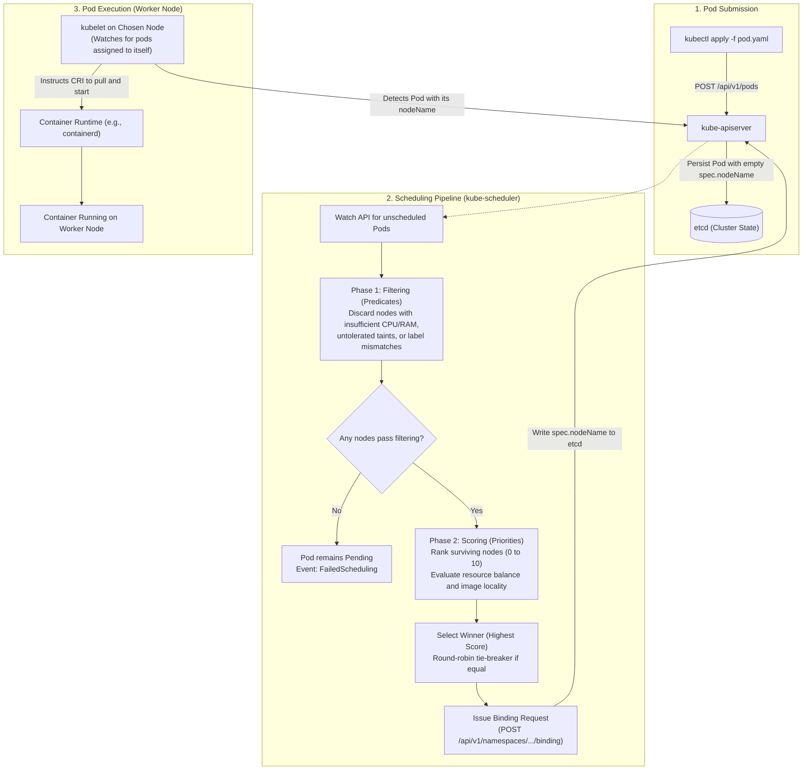
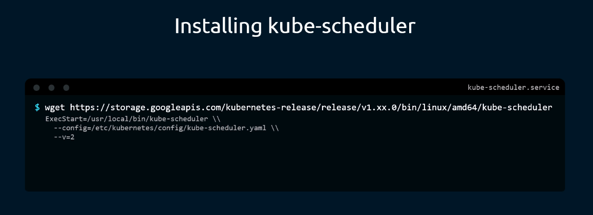
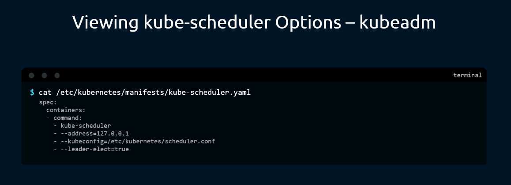
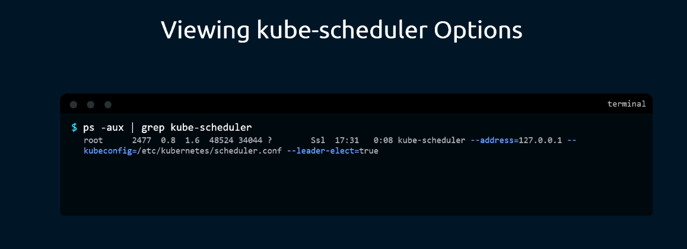
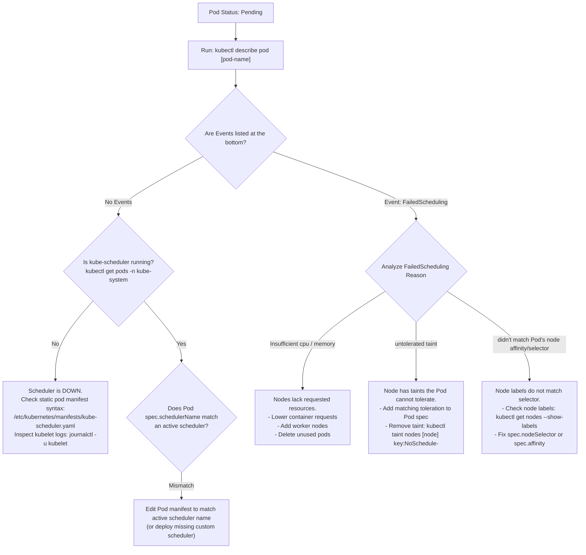

# Kubernetes Scheduler (`kube-scheduler`) - CKA Exam Notes

> **Exam Domain**: Cluster Architecture, Installation & Configuration (25%) / Troubleshooting (30%) / Workloads & Scheduling (15%)  
> **Weight / Importance**: Critical  
> **Target Version**: Verified against v1.31 / v1.32 (Current CKA Curriculum)  
> **Allowed Docs Search Keywords**: `kube-scheduler`, `kube-scheduler configuration`, `scheduling framework`, `static pods`  
> **Source**: Generated from `kube-scheduler-raw.md`

---

## 1. Quick-Reference Summary

- **Primary Role**: The control plane component responsible for determining which worker node should host an unscheduled Pod. It watches for Pods with an empty `spec.nodeName` and assigns them to the best candidate node.
- **Decision vs. Execution Separation**: The scheduler **only decides placement**; it does **not** create, pull, or run containers on worker nodes. It creates a `Binding` object that sets `spec.nodeName` via `kube-apiserver`. The worker node's `kubelet` detects this assignment and executes the containers.
- **Default Port**: Secure HTTPS port **`10259`** (healthz, livez, metrics). Legacy insecure port `10251` is deprecated and removed.
- **Two-Phase Scheduling Cycle**:
  1. **Filtering (Predicates)**: Disqualifies nodes that cannot run the Pod (insufficient CPU/memory, taints without tolerations, node selectors/affinity mismatches, port collisions).
  2. **Scoring (Priorities)**: Ranks surviving candidate nodes on a scale from 0 to 10 (or 0 to 100 in the framework) using configurable scoring algorithms (e.g., node resource availability, image locality). The node with the highest aggregate score wins. Ties are broken via round-robin.
- **Deployment Topologies**:
  - **Kubeadm (Default)**: Static Pod located at `/etc/kubernetes/manifests/kube-scheduler.yaml`. Managed directly by `kubelet`.
  - **Manual / Hard Way**: Linux systemd service located at `/etc/systemd/system/kube-scheduler.service`.
- **Three Ways to View Configured Options**:
  1. Inspect static pod manifest: `cat /etc/kubernetes/manifests/kube-scheduler.yaml`
  2. Inspect systemd service file: `cat /etc/systemd/system/kube-scheduler.service`
  3. Inspect running host process: `ps -aux | grep kube-scheduler`
- **Configuration Format**:
  - Legacy: Direct command-line arguments (e.g., `--leader-elect=true`, `--kubeconfig=...`).
  - Modern (v1.25+): ComponentConfig file (`kubescheduler.config.k8s.io/v1` `KubeSchedulerConfiguration`) passed via `--config=/etc/kubernetes/config/kube-scheduler.yaml`.
- **High Availability & Leader Election**:
  - Multi-master control planes run multiple scheduler instances, but only **one active leader** schedules workloads.
  - Enabled via `--leader-elect=true`. Standby instances maintain active Lease locks in the `kube-system` namespace.
- **Bypassing the Scheduler**: A Pod can be assigned directly to a specific node by defining `spec.nodeName: <node-name>` in the Pod manifest prior to creation. This bypasses the scheduler completely.

---

## 2. Conceptual Overview & Mental Model

### Dual-Layer Architectural Understanding

- **Simple English Explanation (How It Works)**:
  - **The Placement Problem**: In a Kubernetes cluster, worker nodes vary in physical capacity (CPU, RAM, storage, GPU), topology zones, and applied constraints (taints, labels). When a user submits a Pod to the cluster without naming a node, `spec.nodeName` remains empty, leaving the Pod in a `Pending` state.
  - **What the Scheduler Does**: `kube-scheduler` is a continuous control plane process that monitors `kube-apiserver` specifically for newly created Pods that lack a `spec.nodeName`. When it detects an unscheduled Pod, it runs a two-step computational pipeline:
    1. **Filtering**: It checks each node in the cluster against the Pod's constraints (e.g., does the node have at least the requested CPU/RAM? Does it satisfy node selectors? Does it have taints the Pod cannot tolerate?). Any node that fails even one constraint is immediately eliminated.
    2. **Scoring**: From the surviving candidate nodes, the scheduler calculates a numerical score for each node based on configured optimization strategies (for example, favoring nodes that have more free memory after placing the Pod, or nodes that already have the container image cached locally).
    3. **Binding**: The node with the highest score is chosen. The scheduler sends an HTTP POST request (`Binding` object) to `kube-apiserver` to write the winning node's name into the Pod's `spec.nodeName` field in `etcd`.
  - **What the Scheduler Does NOT Do**: The scheduler never connects to worker nodes, never downloads container images, and never starts containers. It purely makes an algorithmic calculation and updates the API record. Once `spec.nodeName` is recorded in `etcd`, the `kubelet` daemon running on that chosen worker node notices the assignment via its watch loop on `kube-apiserver`, pulls the image via the local Container Runtime Interface (CRI), and launches the container.



- **Standard / Production Definition**:
  The Kubernetes scheduler (`kube-scheduler`) is the core control plane component responsible for assigning Pods to Nodes. It implements the Kubernetes Scheduling Framework, evaluating workload resource requests, quality of service (QoS) requirements, hardware/software affinity and anti-affinity constraints, data locality, inter-workload interference, and tolerations to achieve deterministic, policy-compliant, and resource-efficient workload placement.

---

## 3. Deep-Dive Technical Breakdown

### 3.1 The Two-Phase Scheduling Cycle

The scheduling process for each unscheduled Pod executes in two distinct sequential phases:

```
+-----------------------------------------------------------------------+
|                       All Nodes in the Cluster                        |
+-----------------------------------------------------------------------+
                                   |
                                   v
+-----------------------------------------------------------------------+
| Phase 1: Filtering (Predicates)                                       |
| - Check Resource Requests (CPU, RAM, ephemeral storage)               |
| - Check Taints and Tolerations                                        |
| - Check NodeName, NodeSelector, and NodeAffinity                      |
| - Check HostPort collisions and Volume limits                         |
+-----------------------------------------------------------------------+
                                   |
                                   v  (Ineligible nodes filtered out)
+-----------------------------------------------------------------------+
| Candidate Nodes (Feasible Nodes)                                      |
+-----------------------------------------------------------------------+
                                   |
                                   v
+-----------------------------------------------------------------------+
| Phase 2: Scoring (Priorities)                                         |
| - Score nodes on scale 0 to 10 (or 0 to 100)                          |
| - LeastAllocated / MostAllocated / RequestedToCapacityRatio           |
| - ImageLocality (points if container image already cached)           |
| - NodeAffinity priority scoring                                       |
| - PodTopologySpread priority scoring                                  |
+-----------------------------------------------------------------------+
                                   |
                                   v  (Weighted sum of all scoring plugins)
+-----------------------------------------------------------------------+
| Winning Node (Highest Score) -> Binding API Object Created            |
+-----------------------------------------------------------------------+
```

#### Phase 1: Filtering (Predicates)
In this phase, `kube-scheduler` determines which nodes are capable of running the Pod. It evaluates built-in predicate filter plugins:
- **`NodeResourcesFit`**: Checks if the node has enough allocatable CPU, memory, and ephemeral storage to satisfy the sum of all container `requests` in the Pod.
- **`NodeName`**: Checks if the Pod manifest specified a hard `spec.nodeName`. If specified, only that exact node matches.
- **`NodePorts`**: Checks whether network ports requested via `spec.containers[*].ports[*].hostPort` are already bound on the node.
- **`NodeAffinity`**: Evaluates required node affinity (`requiredDuringSchedulingIgnoredDuringExecution`) and `nodeSelector` key-value pairs against node labels.
- **`TaintToleration`**: Verifies that the Pod has matching `tolerations` for all `taints` present on the node with `NoSchedule` or `NoExecute` effects.
- **`NodeVolumeLimits`**: Verifies that attaching the Pod's requested persistent volumes will not exceed the node's maximum volume attach limit (e.g., AWS EBS or GCE PD limits).

> [!NOTE]
> If **no nodes** pass the filtering phase, the Pod cannot be scheduled. It remains in the `Pending` state, and the scheduler generates a `FailedScheduling` event (e.g., `0/3 nodes are available: 3 Insufficient cpu`). The scheduler retries automatically when cluster state changes.

#### Phase 2: Scoring (Priorities)
From the surviving candidate nodes that passed filtering, the scheduler calculates an aggregate score (typically from 0 to 10 or 0 to 100) for each node:
- **Resource Allocation Strategy**:
  - **`LeastAllocated` (Default)**: Favors nodes with fewer allocated resources, spreading Pods evenly across the cluster to maintain balanced resource availability.
  - **`MostAllocated`**: Favors nodes with higher allocated resources, packing Pods densely onto fewer nodes (common in cluster autoscaling environments to allow empty nodes to scale down).
- **`ImageLocality`**: Awards higher scores to nodes that already have the container images cached locally in their container runtime, reducing image pull latency.
- **`NodeAffinityScoring`**: Awards additional points to nodes matching `preferredDuringSchedulingIgnoredDuringExecution` affinity rules.
- **`PodTopologySpread`**: Distributes Pods evenly across failure domains (zones, racks, hosts) to enhance high availability.

Each scoring plugin has an assigned weight. The final score is computed as:
$$\text{Final Score} = \sum (\text{Plugin Score} \times \text{Weight})$$

The node with the highest aggregate score is chosen. If multiple nodes tie with the exact same score, `kube-scheduler` selects one using a round-robin mechanism.

---

### 3.2 The Kubernetes Scheduling Framework

Modern Kubernetes schedulers (v1.25+) use a plugin-based architecture called the **Scheduling Framework**. The framework exposes extension points across the scheduling and binding cycles:

| Extension Point | Purpose & Behavior |
| :--- | :--- |
| **`QueueSort`** | Sorts Pods waiting in the scheduling queue (default: priority and creation timestamp). |
| **`PreFilter`** | Pre-processes Pod information or checks cluster conditions before filtering begins. |
| **`Filter`** | Evaluates whether a candidate node can run the Pod (predicates). |
| **`PostFilter`** | Invoked when no nodes pass the Filter stage (e.g., triggers Pod preemption to evict lower-priority pods). |
| **`PreScore`** | Performs setup work for scoring plugins before actual scoring runs. |
| **`Score`** | Computes numerical ranking scores for all nodes that passed the Filter stage. |
| **`Reserve`** | Temporarily reserves node resources before binding to prevent race conditions. |
| **`Permit`** | Can pause or delay Pod binding (e.g., waiting for gang-scheduling quorum). |
| **`PreBind`** | Performs necessary pre-binding operations (e.g., provisioning network or volume attachments). |
| **`Bind`** | Posts the `Binding` object to `kube-apiserver` to assign `spec.nodeName`. |
| **`PostBind`** | Clean up and informational logging after successful binding. |

---

### 3.3 Installation & Packaging Topologies

#### 1. Kubeadm Static Pod Setup (Standard)
On clusters initialized with `kubeadm`, `kube-scheduler` runs as a **Static Pod** directly supervised by the master node's `kubelet`:
- **Manifest Path**: `/etc/kubernetes/manifests/kube-scheduler.yaml`
- **Kubeconfig Path**: `/etc/kubernetes/scheduler.conf`
- **Port**: HTTPS `10259`
- **Configuration Format**: Static Pod manifest mounts `/etc/kubernetes/scheduler.conf` to authenticate requests to `kube-apiserver`.

#### 2. Manual / Systemd Service Installation ("The Hard Way")
In manual installations, the compiled binary is downloaded directly, configured with systemd, and executed as a host daemon:



```bash
# 1. Download official binary for target release (e.g., v1.31.0)
wget https://storage.googleapis.com/kubernetes-release/release/v1.31.0/bin/linux/amd64/kube-scheduler
chmod +x kube-scheduler
sudo mv kube-scheduler /usr/local/bin/

# 2. Configure systemd unit file: /etc/systemd/system/kube-scheduler.service
# Key ExecStart parameters:
#   --config=/etc/kubernetes/config/kube-scheduler.yaml
#   --v=2
sudo systemctl daemon-reload
sudo systemctl start kube-scheduler
sudo systemctl enable kube-scheduler
```

---

## 4. Viewing & Inspecting Scheduler Options

On the CKA exam, you will need to inspect how the scheduler is configured, verify leader election, or check which configuration files are passed. There are three standard methods:

### Method 1: Inspect the Kubeadm Static Pod Manifest

For clusters deployed with `kubeadm`:



```bash
cat /etc/kubernetes/manifests/kube-scheduler.yaml
```

Key lines under `spec.containers[0].command`:
```yaml
spec:
  containers:
  - command:
    - kube-scheduler
    - --authentication-kubeconfig=/etc/kubernetes/scheduler.conf
    - --authorization-kubeconfig=/etc/kubernetes/scheduler.conf
    - --bind-address=127.0.0.1
    - --kubeconfig=/etc/kubernetes/scheduler.conf
    - --leader-elect=true
```

> [!NOTE]
> In older Kubernetes versions, `--address=127.0.0.1` was used as shown in legacy materials. In modern Kubernetes (v1.31 / v1.32), this flag has been replaced by `--bind-address=127.0.0.1`.

---

### Method 2: Inspect the Systemd Service File (Manual Deployments)

For manual installations or clusters configured via systemd:

```bash
cat /etc/systemd/system/kube-scheduler.service
```

Example unit definition:
```ini
[Unit]
Description=Kubernetes Scheduler
Documentation=https://github.com/kubernetes/kubernetes

[Service]
ExecStart=/usr/local/bin/kube-scheduler \
  --config=/etc/kubernetes/config/kube-scheduler.yaml \
  --v=2
Restart=on-failure
RestartSec=5

[Install]
WantedBy=multi-user.target
```

---

### Method 3: Inspect the Running Process with `ps -aux` (Universal)

To verify the active command-line flags and configuration files currently loaded in memory:



```bash
ps -aux | grep kube-scheduler
```

This reveals the exact arguments passed to the running process regardless of whether it is managed by `kubelet` (static pod) or `systemd`.

---

## 5. Command Translation & Operational Mapping Tables

### 5.1 Inspection Methods Comparison

| Feature | Kubeadm Static Pod | Systemd Service Unit | Running Process (`ps -aux`) |
| :--- | :--- | :--- | :--- |
| **Primary Location** | `/etc/kubernetes/manifests/kube-scheduler.yaml` | `/etc/systemd/system/kube-scheduler.service` | Host OS kernel process table |
| **Component Configuration** | Embedded flags or `/etc/kubernetes/config/kube-scheduler.yaml` | Referenced via `--config=...` | Shown inline in process arguments |
| **Editing Method** | Edit manifest with `vim` / `nano` | Edit service file with `vim` / `nano` | Read-only in memory |
| **Restart Mechanism** | Auto-detected & restarted by `kubelet` in ~10s | `systemctl daemon-reload && systemctl restart kube-scheduler` | Requires restarting parent service or pod |
| **Live Logs** | `kubectl logs -n kube-system <pod-name>` or `crictl logs` | `journalctl -u kube-scheduler -f` | Inspect active stdout / journal log |

---

### 5.2 Key Command-Line Flags & Configuration Parameters

| Flag / Parameter | Default / Example | Purpose & CKA Exam Importance |
| :--- | :--- | :--- |
| `--config` | `/etc/kubernetes/config/kube-scheduler.yaml` | Path to `KubeSchedulerConfiguration` YAML file (modern v1 format). |
| `--kubeconfig` | `/etc/kubernetes/scheduler.conf` | Path to kubeconfig used to authenticate against `kube-apiserver`. |
| `--leader-elect` | `true` | Enables leader election for high availability across multiple master nodes. |
| `--bind-address` | `127.0.0.1` | IP address to bind the secure HTTPS port. |
| `--secure-port` | `10259` | HTTPS port for health checking (`/healthz`, `/livez`) and Prometheus metrics. |
| `--scheduler-name` | `default-scheduler` | Identifies the name of the scheduler instance. Pods targeting this instance specify `spec.schedulerName`. |
| `--v` | `2` | Log verbosity level (levels 2 through 4 are useful for debugging scheduling decisions). |

---

## 6. High-Yield CLI & Imperative Commands

### 6.1 Checking Scheduler Health & Leader Election

```bash
# 1. Verify scheduler static pod is running in kube-system
kubectl get pods -n kube-system -l component=kube-scheduler

# 2. Check cluster-wide health status endpoint (modern replacement for componentstatuses)
kubectl get --raw='/readyz?verbose' | grep -i scheduler

# 3. Identify which master node currently holds the scheduler leader election lease
kubectl get lease kube-scheduler -n kube-system -o yaml | grep holderIdentity

# 4. View recent scheduler log entries
kubectl logs -n kube-system -l component=kube-scheduler --tail=50
```

---

### 6.2 Manual Pod Scheduling (Bypassing the Scheduler)

If the scheduler is down, or if you need to force a Pod onto a specific node during troubleshooting or an exam task, set `spec.nodeName` directly:

```yaml
apiVersion: v1
kind: Pod
metadata:
  name: manual-scheduled-pod
spec:
  nodeName: node01   # Bypasses kube-scheduler completely!
  containers:
  - name: nginx
    image: nginx:alpine
```

```bash
# Verify the pod was directly scheduled to node01 without scheduler intervention
kubectl get pod manual-scheduled-pod -o wide
```

> [!WARNING]
> **Immutability of `spec.nodeName`**: You cannot set or modify `spec.nodeName` on an existing Pod using `kubectl edit` or `kubectl patch`. If a Pod was created without a node and is stuck `Pending` because no scheduler is running, you must either:
> 1. Delete and recreate the Pod with `spec.nodeName` included in the manifest, OR
> 2. Submit a raw `Binding` API request to `kube-apiserver`.

#### Manually Binding an Existing Pending Pod via Binding Object:
```bash
curl -k -X POST -H "Content-Type: application/json" \
  --data '{"apiVersion":"v1","kind":"Binding","metadata":{"name":"pending-pod"},"target":{"apiVersion":"v1","kind":"Node","name":"node01"}}' \
  http://127.0.0.1:8001/api/v1/namespaces/default/pods/pending-pod/binding
```

---

### 6.3 Deploying a Custom / Secondary Scheduler

The CKA exam frequently tests deploying an additional custom scheduler alongside the default scheduler:

```yaml
# custom-scheduler.yaml (KubeSchedulerConfiguration v1)
apiVersion: kubescheduler.config.k8s.io/v1
kind: KubeSchedulerConfiguration
clientConnection:
  kubeconfig: /etc/kubernetes/scheduler.conf
leaderElection:
  leaderElect: false # Set to false if running single replica to prevent lease conflicts
profiles:
  - schedulerName: my-custom-scheduler
```

To schedule a Pod using this custom scheduler, set `spec.schedulerName`:

```yaml
apiVersion: v1
kind: Pod
metadata:
  name: custom-scheduled-pod
spec:
  schedulerName: my-custom-scheduler  # Directs the Pod to your custom scheduler
  containers:
  - name: nginx
    image: nginx:alpine
```

---

### 6.4 Low-Level Node Diagnostics with `crictl`

When `kubectl` is unreachable or the static pod fails to start:

```bash
# List scheduler containers on the master node
crictl ps -a --name kube-scheduler

# Inspect container crash logs directly via CRI
crictl logs $(crictl ps -a -q --name kube-scheduler | head -n 1)
```

---

## 7. Troubleshooting & Diagnostic Runbook

### Decision Tree: Pod Stuck in `Pending` State



### Step-by-Step Triage Sequence

1. **Inspect Pod Status and Events**:
   ```bash
   kubectl describe pod <pod-name>
   ```
   Scroll to the `Events` section. Look for `Warning FailedScheduling`:
   - `0/3 nodes are available: 3 Insufficient cpu`: Total requested CPU across all containers in the Pod exceeds free assignable capacity on all available nodes.
   - `0/3 nodes are available: 1 node(s) had untolerated taint {node-role.kubernetes.io/control-plane: }`: Pod lacks tolerations for master/control-plane taints.
   - `0/3 nodes are available: 3 node(s) didn't match Pod's node affinity/selector`: No worker node currently possesses the required labels.

2. **Verify Scheduler Pod Health**:
   ```bash
   kubectl get pods -n kube-system | grep scheduler
   ```
   If the Pod is in `CrashLoopBackOff`, check container logs:
   ```bash
   kubectl logs -n kube-system <kube-scheduler-pod-name>
   ```
   *Common causes*:
   - Typo in flag names inside `/etc/kubernetes/manifests/kube-scheduler.yaml`.
   - Expired or invalid client certificates in `/etc/kubernetes/scheduler.conf`.

3. **Check Kubelet Logs on Master Node**:
   If the static pod disappeared completely from `kubectl get pods`:
   ```bash
   journalctl -u kubelet -n 50 --no-pager | grep -i scheduler
   ```
   This typically indicates invalid YAML syntax (e.g., tab characters or incorrect indentation) in `/etc/kubernetes/manifests/kube-scheduler.yaml`.

---

## 8. CKA Exam Tips, Gotchas & Traps

> [!WARNING]
> **The Immutable `nodeName` Trap**:
> If an exam question asks you to assign an existing, currently pending Pod to a specific node, running `kubectl edit pod <name>` and adding `nodeName: node01` will fail with an API validation error: `field is immutable`. You must either export the YAML (`kubectl get pod <name> -o yaml > pod.yaml`), delete the existing Pod, edit `pod.yaml` to add `nodeName`, and recreate it, or use the raw `Binding` API.

> [!IMPORTANT]
> **Static Pod Manifest Safety**:
> When asked to modify scheduler options (e.g., configuring leader election or adding flags), **always back up the static pod manifest first**:
> ```bash
> sudo cp /etc/kubernetes/manifests/kube-scheduler.yaml /tmp/kube-scheduler.yaml.bak
> ```
> `kubelet` continuously watches `/etc/kubernetes/manifests/`. If you save an invalid YAML file, `kubelet` immediately terminates the scheduler container, and it will no longer show up under `kubectl get pods -n kube-system`. Having a backup allows immediate restoration (`sudo cp /tmp/kube-scheduler.yaml.bak /etc/kubernetes/manifests/kube-scheduler.yaml`).

> [!TIP]
> **Custom Schedulers in Exam Tasks**:
> When creating a Pod configured for a secondary scheduler, ensure `spec.schedulerName` matches the exact string defined in the secondary scheduler's configuration (`profiles[0].schedulerName` or `--scheduler-name`). If there is a spelling mismatch, the Pod will remain `Pending` indefinitely with zero scheduling events generated.

---

## 9. Self-Test / Active Recall

Test your comprehension before clicking to reveal the solutions:

1. **Does `kube-scheduler` place, run, or pull containers onto worker nodes? If not, what actually performs that work?**
2. **What are the two core computational phases of the Kubernetes scheduling cycle, and what occurs in each?**
3. **What is the difference between the `LeastAllocated` and `MostAllocated` scoring strategies?**
4. **How can you force a Pod to run on a specific worker node without going through `kube-scheduler`?**
5. **In a high-availability cluster with 3 control plane nodes, how many `kube-scheduler` instances actively schedule Pods at the same time?**
6. **What is the default secure HTTPS port used by `kube-scheduler` for metrics and health checks?**
7. **If a Pod is stuck in `Pending` state and `kubectl describe pod` shows NO events at all, what should you suspect first?**

<details>
<summary>Reveal Answers</summary>

1. **No**. `kube-scheduler` only computes the placement decision and creates a `Binding` object that updates `spec.nodeName` via `kube-apiserver`. The `kubelet` on that assigned worker node detects the assignment, downloads the container images, and starts the containers via the Container Runtime Interface (CRI).
2. **Filtering (Predicates)**: Eliminates nodes that do not satisfy Pod constraints (insufficient resources, taints, selectors). **Scoring (Priorities)**: Evaluates and scores surviving candidate nodes on a 0–10 scale using priority algorithms, selecting the node with the highest aggregate score.
3. `LeastAllocated` spreads Pods across nodes by favoring nodes with the most remaining unallocated resources. `MostAllocated` packs Pods onto fewer nodes by favoring nodes with higher allocated resources, facilitating node scale-down in autoscaled environments.
4. Set `spec.nodeName: <node-name>` directly inside the Pod specification before creating the Pod.
5. **Only 1 active leader**. The other two instances run in standby mode, waiting to acquire the leader election Lease lock in the `kube-system` namespace if the leader fails.
6. **Port `10259`**. Legacy insecure port `10251` has been removed.
7. Either the `kube-scheduler` component is down / crashed, or the Pod has `spec.schedulerName` set to a custom scheduler that is not currently running in the cluster.
</details>

---

### Official Documentation Bookmarks

Allowed for reference during the live exam at [kubernetes.io/docs](https://kubernetes.io/docs/home/):

| Topic | Direct Search Term | Recommended Anchor |
| :--- | :--- | :--- |
| **kube-scheduler Reference** | `kube-scheduler` | Reference > Command-Line Tools > kube-scheduler |
| **KubeSchedulerConfiguration** | `KubeSchedulerConfiguration` | Reference > Configuration APIs > KubeSchedulerConfiguration (v1) |
| **Kubernetes Scheduling Framework** | `Scheduling Framework` | Concepts > Scheduling, Preemption, and Eviction > Scheduling Framework |
| **Assigning Pods to Nodes** | `Assigning Pods to Nodes` | Concepts > Scheduling, Preemption, and Eviction > Assigning Pods to Nodes |
| **Configure Multiple Schedulers** | `Configure Multiple Schedulers` | Tasks > Extend Kubernetes > Configure Multiple Schedulers |

