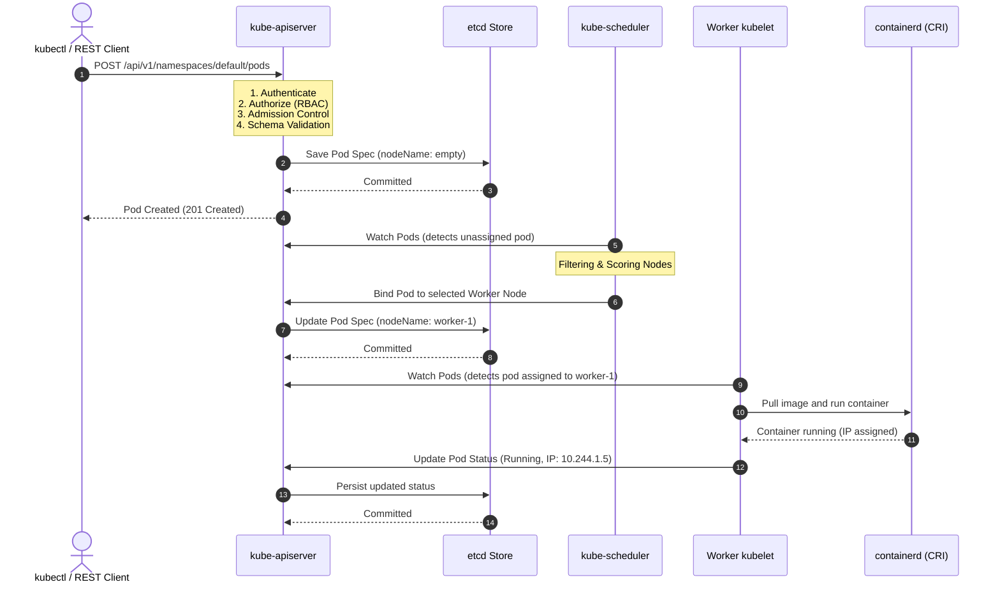
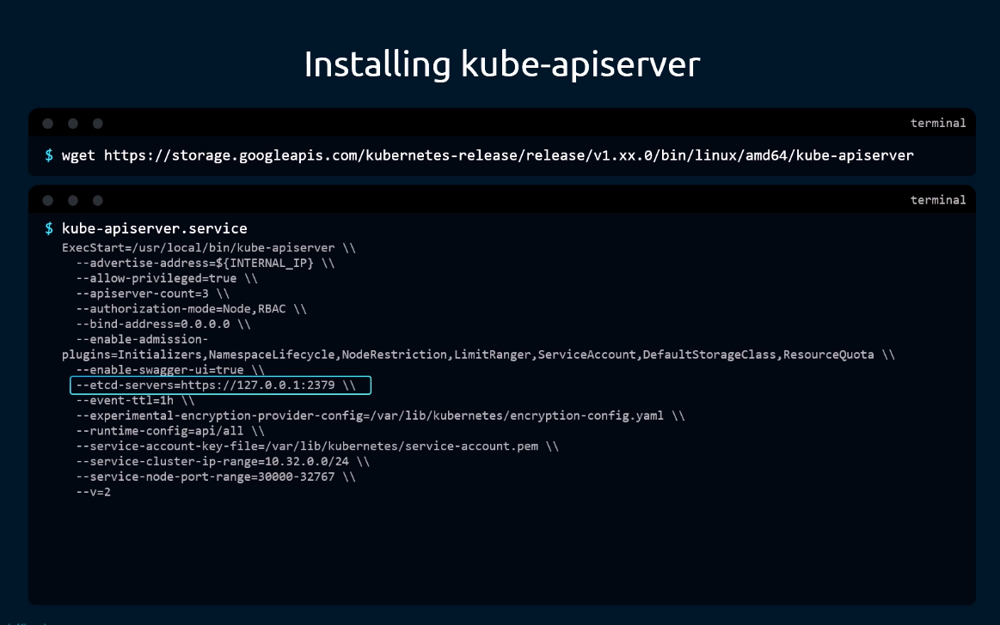
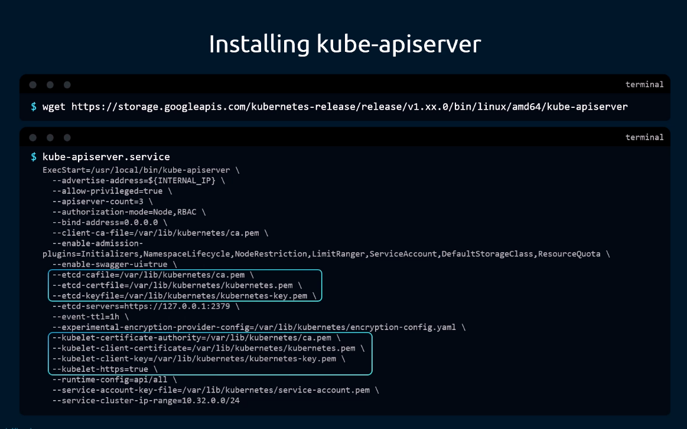
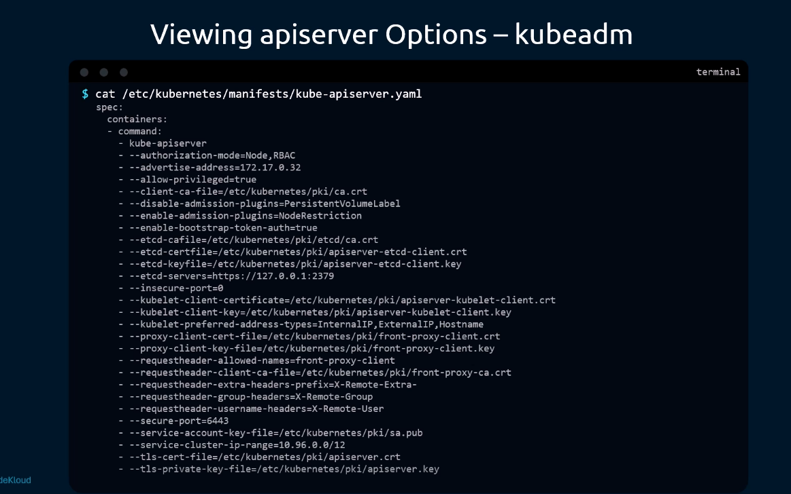
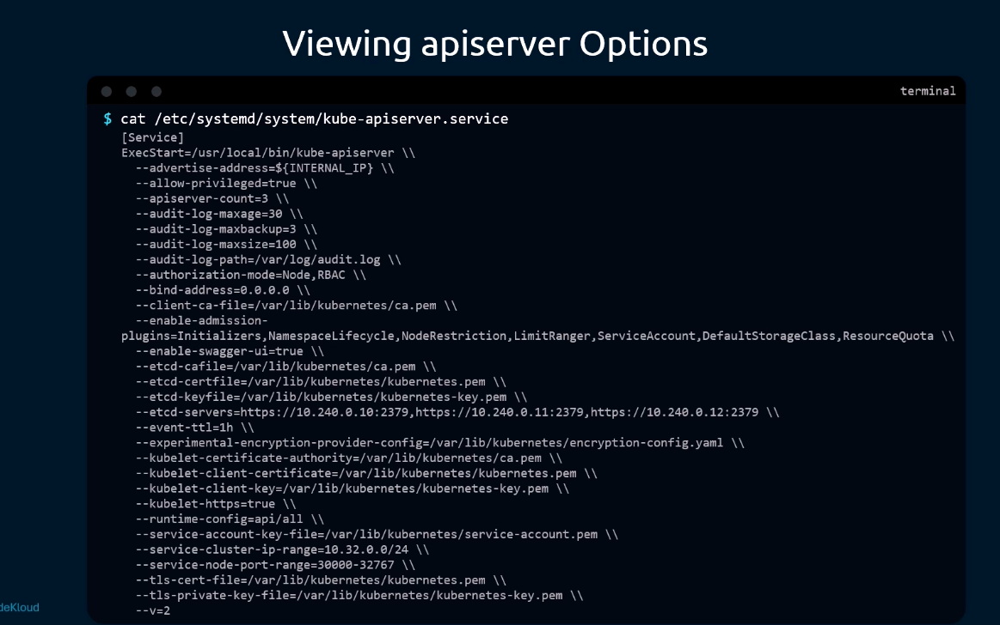
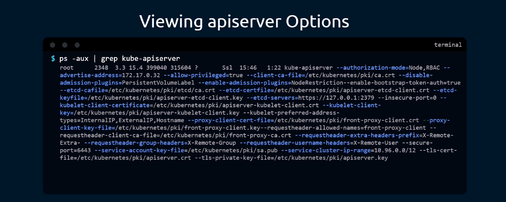
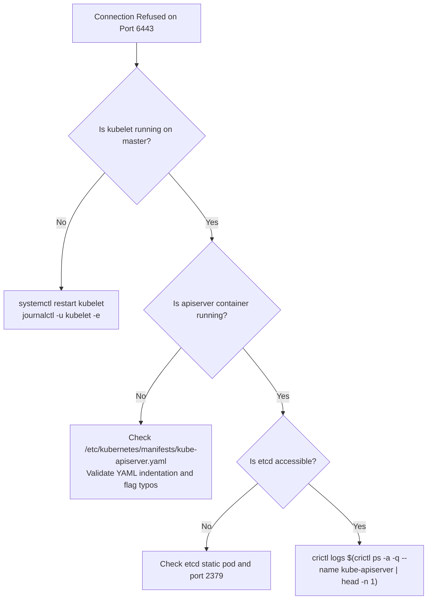

# Kubernetes API Server (`kube-apiserver`) - CKA Exam Notes

> **Exam Domain**: Cluster Architecture, Installation & Configuration (25%) / Troubleshooting (30%)  
> **Weight / Importance**: Critical  
> **Target Version**: Verified against v1.31 / v1.32 (Current CKA Curriculum)  
> **Allowed Docs Search Keywords**: `kube-apiserver`, `kube-apiserver options`, `static pods`, `admission controllers`  
> **Source**: Generated from `kubeapi-server-raw.md`

---

## 1. Quick-Reference Summary

- **Primary Role**: Central management gateway and orchestration hub. Exposes the Kubernetes REST API, handles authentication, authorization (RBAC), admission control, schema validation, and is the **only** component that interacts directly with `etcd`.
- **Default Port**: Secure HTTPS port **`6443`** (configurable via `--secure-port=6443`). Legacy insecure port `8080` is permanently removed.
- **Deployment Mode**:
  - **Kubeadm (Default)**: Static Pod located at `/etc/kubernetes/manifests/kube-apiserver.yaml`. Managed directly by `kubelet`.
  - **Manual / Hard Way**: Linux systemd service located at `/etc/systemd/system/kube-apiserver.service`.
- **Three Ways to View Configured Options**:
  1. Inspect static pod manifest: `cat /etc/kubernetes/manifests/kube-apiserver.yaml`
  2. Inspect systemd service: `cat /etc/systemd/system/kube-apiserver.service`
  3. Inspect running process: `ps -aux | grep kube-apiserver`
- **Critical Flags to Know for CKA**:
  - `--etcd-servers=https://127.0.0.1:2379`: Endpoint to the cluster's backing storage.
  - `--etcd-cafile`, `--etcd-certfile`, `--etcd-keyfile`: TLS client certificates to talk to `etcd`.
  - `--enable-admission-plugins`: Comma-separated admission plugins (e.g. `NodeRestriction,NamespaceLifecycle`).
  - `--service-cluster-ip-range`: CIDR block allocated for Service ClusterIPs.
- **Stateless Architecture**: Horizontally scalable across multiple master nodes behind a network load balancer.

---

## 2. Conceptual Overview & Mental Model

The `kube-apiserver` is the front desk, administrative gateway, and sole coordinator of all cluster activity.

### Dual-Layer Architectural Understanding

- **Intuitive Mental Model (In Plain English)**:
  - **The Airport Control Tower / Front Desk**: Nothing happens in a Kubernetes cluster without going through the API server. No component talks to each other in secret. If `kube-scheduler` wants to place a pod, it tells the API server. When `kubelet` finishes launching a container, it tells the API server. When you run `kubectl`, you are talking to the API server.
  - **The Sole Gatekeeper to the Ledger (`etcd`)**: The `etcd` database does not allow arbitrary connections. The API server is the *only* component allowed to talk to `etcd`. If you want to read or write any cluster state, you must pass through the API server's checkpoints:
    1. **Authentication**: *Who are you?* (Verifies TLS certificate, bearer token, or webhook).
    2. **Authorization**: *Are you allowed to do this?* (Evaluates RBAC roles, rolebindings, or Node authorizer).
    3. **Admission Control**: *Does this comply with cluster policies?* (Mutates defaults, validates quotas, limits).
    4. **Schema Validation**: *Is the YAML/JSON syntactically and semantically valid?*
  - **The Lifecycle of a Pod Creation Request**:
    1. **Submission**: You run `kubectl run nginx --image=nginx` (or submit a REST call `curl -X POST /api/v1/namespaces/default/pods`).
    2. **Verification & Unscheduled State**: The API server authenticates, authorizes, and validates the request. It creates a Pod object **without assigning a node** (`spec.nodeName` is empty), saves it to `etcd`, and informs the client that the Pod object has been created.
    3. **Scheduler Watch & Placement**: The `kube-scheduler` continuously monitors (watches) the API server. It notices a new Pod with no node assigned. It evaluates worker nodes (filtering and scoring), picks the optimal node, and reports its decision back to the API server. The API server updates `spec.nodeName` in `etcd`.
    4. **Kubelet Watch & Execution**: The `kubelet` on that specific worker node continuously watches the API server. It notices a Pod newly assigned to its node. It instructs the local container runtime (e.g., `containerd`) to pull the image and run the containers.
    5. **Status Update**: Once the containers are running, `kubelet` reports the updated status (e.g., `Running`, Pod IP) back to the API server. The API server commits this new status to `etcd`.

- **Standard / Production Definition**:
  The `kube-apiserver` validates and configures data for the api objects which include pods, services, replicationcontrollers, and others. The API Server services REST operations and provides the frontend to the cluster's shared state through which all other components interact.



---

## 3. Deep-Dive Technical Breakdown

### 3.1 Responsibilities of `kube-apiserver`

1. **Authentication**: Supports X.509 client certificates, OpenID Connect (OIDC) tokens, Webhook tokens, and Bootstrap tokens.
2. **Authorization**: Evaluates authorization modes in sequential order (configured via `--authorization-mode=Node,RBAC`).
3. **Admission Control**: Software plugins that intercept requests after authorization but before persistence. They can modify (mutate) the object or reject (validate) the request (e.g. `NamespaceLifecycle`, `LimitRanger`, `ResourceQuota`, `NodeRestriction`).
4. **Data Retrieval & Querying**: Serves all `kubectl get` and `kubectl describe` requests by reading deserialized state from `etcd`.
5. **State Synchronization (`etcd` Communication)**: Acts as the sole gatekeeper committing updates to `etcd`.
6. **Coordination Hub**: Serves as the central publish-subscribe message board where `kube-scheduler`, `kube-controller-manager`, and `kubelet` register watches and receive change notifications.

---

### 3.2 Connecting `kube-apiserver` to `etcd`

Because `etcd` stores all confidential cluster state (including secrets and tokens), communication between `kube-apiserver` and `etcd` is secured via mutual TLS (mTLS).



#### Key Configuration Flags:
- `--etcd-servers=https://127.0.0.1:2379`: IP and port of the etcd cluster members. In HA clusters, multiple endpoints are passed as a comma-separated list.
- `--etcd-cafile=/etc/kubernetes/pki/etcd/ca.crt`: CA certificate used to verify the etcd server's certificate.
- `--etcd-certfile=/etc/kubernetes/pki/apiserver-etcd-client.crt`: Client certificate presented by the API server to authenticate against etcd.
- `--etcd-keyfile=/etc/kubernetes/pki/apiserver-etcd-client.key`: Private key corresponding to the client certificate.

---

### 3.3 Installation & Deployment Topologies

#### 1. Kubeadm Deployed Setup (Static Pod)
In standard clusters built with `kubeadm`, the API server runs as a **Static Pod** on control plane nodes.

- Manifest Path: `/etc/kubernetes/manifests/kube-apiserver.yaml`
- Managed By: Local `kubelet` systemd service.
- Behavior: Kubelet automatically watches this manifest. Any edit to this file causes Kubelet to terminate the existing static pod container and recreate it with the updated configuration.

#### 2. Manual / "Hard Way" Setup (Systemd Service)
In customized or bare-metal enterprise deployments, the API server binary is downloaded directly and managed as a Linux systemd unit.



- Binary Download:
  ```bash
  wget https://storage.googleapis.com/kubernetes-release/release/v1.31.0/bin/linux/amd64/kube-apiserver
  chmod +x kube-apiserver
  sudo mv kube-apiserver /usr/local/bin/
  ```
- Service File: `/etc/systemd/system/kube-apiserver.service`
- Service Management:
  ```bash
  sudo systemctl daemon-reload
  sudo systemctl start kube-apiserver
  sudo systemctl status kube-apiserver
  ```

---

## 4. Viewing & Inspecting API Server Options

On the CKA exam, you will frequently need to inspect how the API server is configured (e.g., to verify enabled admission plugins, certificate paths, or etcd endpoints). There are three standard methods:

### Method 1: Inspect the Kubeadm Static Pod Manifest (Recommended for Kubeadm)

If the cluster was provisioned with `kubeadm`, view the manifest:



```bash
cat /etc/kubernetes/manifests/kube-apiserver.yaml
```

Key lines to examine under `spec.containers[0].command`:
```yaml
spec:
  containers:
  - command:
    - kube-apiserver
    - --advertise-address=172.17.0.32
    - --allow-privileged=true
    - --authorization-mode=Node,RBAC
    - --client-ca-file=/etc/kubernetes/pki/ca.crt
    - --enable-admission-plugins=NodeRestriction
    - --enable-bootstrap-token-auth=true
    - --etcd-cafile=/etc/kubernetes/pki/etcd/ca.crt
    - --etcd-certfile=/etc/kubernetes/pki/apiserver-etcd-client.crt
    - --etcd-keyfile=/etc/kubernetes/pki/apiserver-etcd-client.key
    - --etcd-servers=https://127.0.0.1:2379
    - --secure-port=6443
    - --service-cluster-ip-range=10.96.0.0/12
    - --tls-cert-file=/etc/kubernetes/pki/apiserver.crt
    - --tls-private-key-file=/etc/kubernetes/pki/apiserver.key
```

---

### Method 2: Inspect the Systemd Service File (For Manual Setups)

If the cluster runs the API server as a native Linux service:



```bash
cat /etc/systemd/system/kube-apiserver.service
```

Look at the `ExecStart=/usr/local/bin/kube-apiserver \\` directive and all appended flags.

---

### Method 3: Inspect the Running Process with `ps -aux` (Universal)

This method works in **all environments** regardless of whether it is managed by Kubelet or systemd:



```bash
ps -aux | grep kube-apiserver
```

This displays the exact live parameters and flag arguments passed to the running process.

---

## 5. Command Translation & Operational Mapping Tables

### 5.1 Inspection Methods Comparison

| Feature | Kubeadm Static Pod (`kube-apiserver.yaml`) | Systemd Unit (`kube-apiserver.service`) | Running Process (`ps -aux`) |
| :--- | :--- | :--- | :--- |
| **File Location** | `/etc/kubernetes/manifests/kube-apiserver.yaml` | `/etc/systemd/system/kube-apiserver.service` | Live in kernel process table |
| **How to Edit** | Edit file with `vim` / `nano` | Edit file with `vim` / `nano` | Cannot edit directly; restart source |
| **Reload Procedure** | Auto-detected & restarted by `kubelet` | `systemctl daemon-reload && systemctl restart kube-apiserver` | Managed by parent supervisor |
| **Viewing Logs** | `crictl logs <container-id>` or `/var/log/pods` | `journalctl -u kube-apiserver -f` | N/A (redirected to stdout/journal) |
| **Best Used For** | Verifying desired declarative configuration | Verifying service unit definitions | Verifying actual runtime flags currently active |

---

### 5.2 Key Command-Line Flags & What They Control

| Flag Name | Example Value | Description & CKA Importance |
| :--- | :--- | :--- |
| `--etcd-servers` | `https://127.0.0.1:2379` | Specifies the backing etcd storage locations. |
| `--authorization-mode` | `Node,RBAC` | Controls authz engines. Must include `RBAC` for role-based controls and `Node` for kubelet scoping. |
| `--enable-admission-plugins` | `NodeRestriction,LimitRanger` | Activates specific admission controllers. Top exam task! |
| `--disable-admission-plugins` | `ResourceQuota` | Explicitly deactivates admission controllers. |
| `--secure-port` | `6443` | HTTPS listening port. Default is `6443`. |
| `--service-cluster-ip-range` | `10.96.0.0/12` | CIDR block reserved for virtual Service `ClusterIP` allocation. |
| `--service-account-key-file` | `/etc/kubernetes/pki/sa.pub` | Public key used to verify ServiceAccount JWT tokens. |
| `--service-account-signing-key-file` | `/etc/kubernetes/pki/sa.key` | Private key used to sign ServiceAccount JWT tokens. |
| `--client-ca-file` | `/etc/kubernetes/pki/ca.crt` | Root CA to authenticate incoming client X.509 certificates. |

---

## 6. High-Yield CLI & Imperative Commands

### 6.1 Checking API Server Status & Endpoints

```bash
# 1. Test API health status endpoint directly
kubectl get --raw='/readyz?verbose'
kubectl get --raw='/livez?verbose'

# 2. View cluster control plane component endpoints
kubectl cluster-info

# 3. Quickly verify enabled admission plugins from running process
ps -aux | grep kube-apiserver | grep -o -- "--enable-admission-plugins=[^ ]*"

# 4. Filter static pod manifest for specific options
grep -E "admission-plugins|authorization-mode|etcd-servers" /etc/kubernetes/manifests/kube-apiserver.yaml
```

---

### 6.2 Testing API Server Directly with `curl` (REST API)

You can interact with the API server directly without `kubectl`:

```bash
# 1. Start local proxy to bypass TLS authentication for manual testing
kubectl proxy --port=8001 &

# 2. Query pod list via REST API
curl http://localhost:8001/api/v1/namespaces/default/pods

# 3. Or query directly via HTTPS using service account token
APISERVER=$(kubectl config view --minify -o jsonpath='{.clusters[0].cluster.server}')
TOKEN=$(kubectl create token default)
curl -k -H "Authorization: Bearer $TOKEN" $APISERVER/api/v1/namespaces/default/pods
```

---

## 7. Troubleshooting & Diagnostic Runbook

### Scenario: API Server Down (`The connection to the server <ip>:6443 was refused`)



#### Step-by-Step Triage Sequence:
1. **SSH into the Control Plane Node**:
   ```bash
   ssh controlplane
   ```
2. **Verify Kubelet Service Health**:
   If Kubelet is down, static pods cannot run.
   ```bash
   systemctl status kubelet
   ```
3. **Inspect Runtime Containers**:
   Check if the API server container is crashing or failing to start:
   ```bash
   crictl ps -a | grep kube-apiserver
   ```
4. **Inspect Container Crash Logs**:
   Read the direct stderr output from the crashed container:
   ```bash
   crictl logs $(crictl ps -a -q --name kube-apiserver | head -n 1)
   ```
   *Common errors to look for*:
   - `invalid flag`: Typo in a command flag inside `kube-apiserver.yaml`.
   - `connection refused to https://127.0.0.1:2379`: The `etcd` static pod is down or failing.
   - `certificate signed by unknown authority`: Mismatched or corrupted TLS certificates.
5. **Validate Manifest Syntax**:
   Verify that `/etc/kubernetes/manifests/kube-apiserver.yaml` has valid YAML indentation. A single missing space or bad indent will prevent Kubelet from parsing the file.

---

## 8. CKA Exam Tips, Gotchas & Traps

> [!IMPORTANT]
> **Modifying Static Pods Without Breaking the Cluster**:
> Always make a backup copy of `/etc/kubernetes/manifests/kube-apiserver.yaml` before editing it:
> ```bash
> cp /etc/kubernetes/manifests/kube-apiserver.yaml /tmp/kube-apiserver.yaml.bak
> ```
> If you make a syntax error, the API server will crash and `kubectl` will stop working! You will have to fix it using `vim` directly on the manifest file.

> [!WARNING]
> **Static Pod Reload Grace Period**:
> After editing `/etc/kubernetes/manifests/kube-apiserver.yaml`, the API server pod takes **15–30 seconds** to terminate and restart. Do not immediately assume your change failed if `kubectl get nodes` returns connection refused for the first few seconds. Watch the container launch with `crictl ps`.

> [!TIP]
> **Enabling Admission Plugins Quickly**:
> If an exam question asks to enable an admission plugin (e.g. `NodeRestriction`):
> 1. Open `/etc/kubernetes/manifests/kube-apiserver.yaml`.
> 2. Search for `--enable-admission-plugins`.
> 3. If the line exists, append the new plugin with a comma (no spaces!):
>    `--enable-admission-plugins=NodeRestriction,NamespaceLifecycle`
> 4. If it does not exist, add a new line under the `command:` array.
> 5. Save and exit. Kubelet handles the reload automatically.

---

## 9. Self-Test / Active Recall

Test your comprehension before looking at the solutions:

1. **Why does the API server need to be the only component that communicates directly with `etcd`?**
2. **What are the four sequential validation and checkpoint phases a request undergoes inside the API server before being committed to `etcd`?**
3. **When a user creates a new Pod, does the API server assign a worker node to it immediately?**
4. **What is the default secure port on which `kube-apiserver` listens for incoming HTTPS requests?**
5. **What are the three different ways on a master node to view the command-line options configured for `kube-apiserver`?**
6. **Which specific admission plugin ensures that Kubelets can only modify their own Node and Pod resources, preventing compromised nodes from modifying other nodes' workloads?**
7. **If you edit `/etc/kubernetes/manifests/kube-apiserver.yaml` and introduce a YAML typo, why does `kubectl get pods` immediately fail with a connection refused error, and how do you find the error log?**

<details>
<summary>Reveal Answers</summary>

1. To maintain strict data integrity, consistency, and security. By routing all state access through the API server, Kubernetes enforces centralized authentication, authorization (RBAC), admission control policies, and schema validation.
2. 1) **Authentication** (identity verification), 2) **Authorization** (RBAC permission check), 3) **Admission Control** (policy enforcement and mutation), and 4) **Schema Validation** (structural syntax verification).
3. **No**. The API server creates the Pod object with an empty `spec.nodeName` and commits it to `etcd`. The `kube-scheduler` watches the API server, selects the optimal node, and issues a bind request back to the API server to update `spec.nodeName`.
4. **Port `6443`**.
5. 1) Inspecting `/etc/kubernetes/manifests/kube-apiserver.yaml` (Kubeadm), 2) Inspecting `/etc/systemd/system/kube-apiserver.service` (manual service), and 3) Inspecting `ps -aux | grep kube-apiserver` (live running process).
6. **`NodeRestriction`** (enabled via `--enable-admission-plugins=NodeRestriction`).
7. Because Kubelet fails to parse the invalid YAML and cannot run the API server container, leaving port 6443 closed. You can find the error log using `crictl logs` on the crashed container or by viewing Kubelet's own journal logs: `journalctl -u kubelet -e`.
</details>

---

### Official Documentation Bookmarks

Allowed for reference during the live exam at [kubernetes.io/docs](https://kubernetes.io/docs/home/):

| Topic | Direct Search Term | Recommended Anchor |
| :--- | :--- | :--- |
| **kube-apiserver Reference** | `kube-apiserver` | Reference > Command-Line Tools > kube-apiserver |
| **Admission Controllers** | `Admission Controllers Reference` | Reference > Accessing the API > Admission Controllers Reference |
| **Control Plane Components** | `Kubernetes Components` | Concepts > Overview > Kubernetes Components |
| **Static Pods** | `Create static pods` | Tasks > Configure Pods and Containers > Create static pods |

