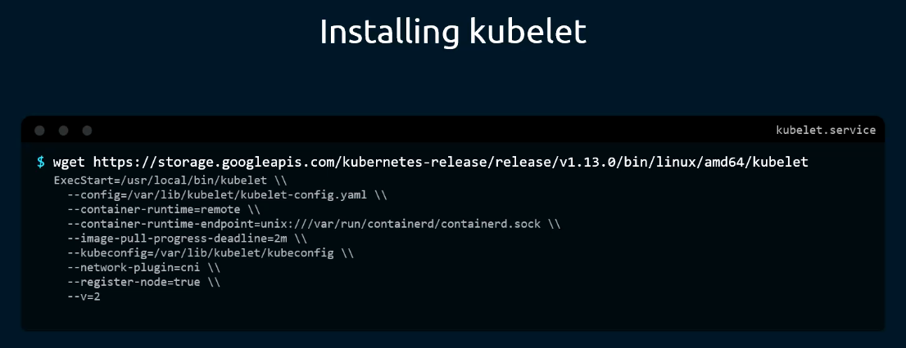
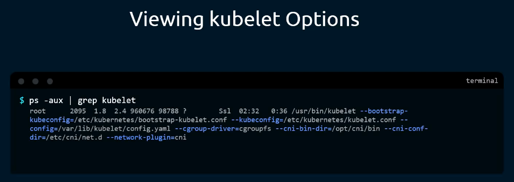
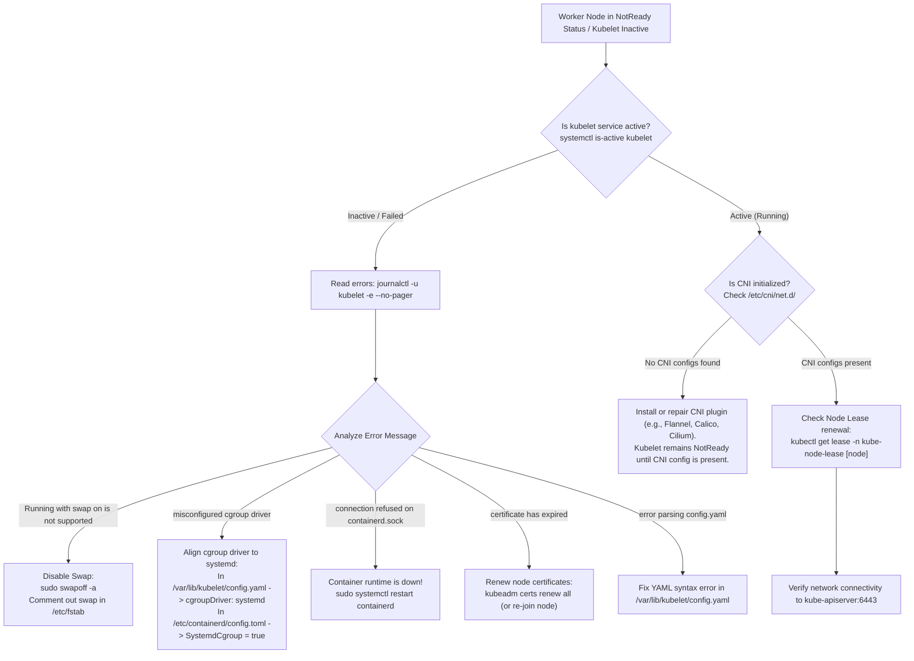

# Kubernetes Node Agent (`kubelet`) - CKA Exam Notes

> **Exam Domain**: Cluster Architecture, Installation & Configuration (25%) / Troubleshooting (30%)  
> **Weight / Importance**: Critical  
> **Target Version**: Verified against v1.31 / v1.32 (Current CKA Curriculum)  
> **Allowed Docs Search Keywords**: `kubelet`, `kubelet configuration`, `static pods`, `node registration`, `cgroupDriver`  
> **Source**: Generated from `kubelet-raw.md`

---

## 1. Quick-Reference Summary

- **Primary Role**: The primary node-level agent running on every node (control plane and workers). It registers the host as a `Node` object in `kube-apiserver`, watches for Pods assigned to its node (`spec.nodeName`), and interacts with the host container runtime to ensure containers are started, healthy, and running as declared.
- **Direct Host Daemon (NOT a Container)**: `kubelet` is the **only core Kubernetes component that is never containerized**. It runs directly on the host operating system as a native `systemd` service (`kubelet.service`).
- **Kubeadm Does NOT Install Kubelet**: Neither `kubeadm init` nor `kubeadm join` installs the `kubelet` binary or container runtime. Administrators must manually install `kubelet`, `kubeadm`, and `kubectl` using the Linux package manager (`apt` or `dnf`/`yum`) on every machine before running `kubeadm`.
- **Default Ports**:
  - **`10250`** (HTTPS): Primary Kubelet API. Used by `kube-apiserver` to fetch pod logs (`kubectl logs`), attach to containers (`kubectl exec`), and port-forward (`kubectl port-forward`).
  - **`10248`** (HTTP): Health check endpoint (`http://127.0.0.1:10248/healthz`).
  - Legacy **`10255`**: Insecure read-only port (deprecated and removed).
- **Core Interfaces Driven by Kubelet**:
  - **CRI (Container Runtime Interface)**: Communicates with the container runtime (e.g., `containerd`) over a Unix domain socket (`unix:///run/containerd/containerd.sock`) via gRPC.
  - **CNI (Container Network Interface)**: Invokes network binary plugins in `/opt/cni/bin` reading definitions in `/etc/cni/net.d/` to create pod network namespaces and configure IP addresses.
  - **CSI (Container Storage Interface)**: Coordinates volume attachment, mounting, and unmounting into container paths.
- **Static Pod Supervisor**: Independently watches `/etc/kubernetes/manifests/` for Pod YAML definitions. It creates and manages these Pods directly without the intervention of `kube-scheduler` or `kube-apiserver`.
- **Configuration Hierarchy**:
  - Main configuration: ComponentConfig file `/var/lib/kubelet/config.yaml` (`KubeletConfiguration` `kubelet.config.k8s.io/v1beta1`).
  - Systemd service drop-in: `/etc/systemd/system/kubelet.service.d/10-kubeadm.conf`.
  - Cluster authentication: `/etc/kubernetes/kubelet.conf`.
- **Node Heartbeats**: Periodically updates its `Lease` object in the `kube-node-lease` namespace (every 10s by default) to notify the Node Controller that the node is alive and ready.

---

## 2. Conceptual Overview & Mental Model

### Dual-Layer Architectural Understanding

- **Simple English Explanation (How It Works)**:
  - **The Boundary Between API and Compute**: The Kubernetes control plane (`kube-apiserver`, `etcd`, `kube-scheduler`, `kube-controller-manager`) manages cluster state and determines where workloads belong. However, control plane binaries do not log into host servers, install container packages, or run processes on worker machines.
  - **How a Node Joins the Cluster**: To become an active participant in the cluster, every host machine must run a persistent background daemon: the `kubelet`. When `kubelet` boots, it authenticates against `kube-apiserver` using TLS bootstrap certificates and issues an API registration request. This registration advertises the host's identity: its total CPU cores, allocatable memory, architecture, operating system kernel, and network IP addresses.
  - **Executing Workloads**: Once registered, `kubelet` establishes a constant watch connection to `kube-apiserver` for any Pod whose `spec.nodeName` matches its local hostname. When an assigned Pod is detected:
    1. It reads the declarative PodSpec (container images, resource requests, volume mounts, probes).
    2. It sends gRPC calls across a local Unix domain socket to the Container Runtime Interface (CRI)—such as `containerd`—to pull container images and spawn an isolated network sandbox (the pause container).
    3. It executes CNI network plugins to wire the container network interface into the cluster virtual network.
    4. It instructs CRI to start the application containers within that sandbox.
  - **Continuous Supervision**: Once containers are running, `kubelet` acts as the local supervisor. It executes configured `livenessProbe`, `readinessProbe`, and `startupProbe` checks. If a container process dies, `kubelet` triggers local restarts according to the Pod's `restartPolicy`. It continuously sends node status and Pod condition reports back to `kube-apiserver`.
  - **Why Kubelet Cannot Run as a Pod**: Because `kubelet` is the very entity that commands the container runtime to start Pods, it cannot depend on a container engine to start itself. It must be installed directly on the host operating system and supervised by Linux `systemd`.

```mermaid
flowchart TD
    subgraph ControlPlane["1. Control Plane"]
        API["kube-apiserver"] -->|Stores Node and Pod specs| ETCD[("etcd State Store")]
        LeaseNS["kube-node-lease Namespace"] -.-> API
    end

    subgraph Host["2. Worker Node Host OS (systemd)"]
        Kubelet["kubelet daemon<br/>(Runs as native systemd service)"]
        KubeletConfig["/var/lib/kubelet/config.yaml"] --> Kubelet
        StaticManifests["/etc/kubernetes/manifests/<br/>(Static Pod Manifests)"] --> Kubelet
    end

    subgraph RuntimeSubsystems["3. Node Subsystems and Interfaces"]
        CRI["Container Runtime (containerd)<br/>unix:///run/containerd/containerd.sock"]
        CNI["CNI Plugins<br/>/etc/cni/net.d/ and /opt/cni/bin/"]
        PodContainers["Running Containers<br/>(Pod Sandboxes)"]
    end

    API -->|1. Watches for Pods where spec.nodeName == this node| Kubelet
    Kubelet -->|2. Heartbeat Node Leases (every 10s)| LeaseNS
    Kubelet -->|3. gRPC: RunPodSandbox, PullImage, StartContainer| CRI
    Kubelet -->|4. Configure Pod Network Interface| CNI
    CRI -->|5. Spawns and manages| PodContainers
    Kubelet -->|6. Periodic Liveness / Readiness Probes| PodContainers
```

- **Standard / Production Definition**:
  The `kubelet` is the primary "node agent" that runs on each node. It works in terms of a `PodSpec`, a declarative YAML or JSON object that describes a Pod. The `kubelet` takes a set of PodSpecs provided through various mechanisms (primarily through the API server, or locally via static pod manifests and HTTP endpoints) and ensures that the containers described in those PodSpecs are running and healthy.

---

## 3. Deep-Dive Technical Breakdown

### 3.1 Installation Topologies & The Kubeadm Paradigm

Unlike other Kubernetes components (`kube-apiserver`, `kube-scheduler`, `kube-controller-manager`, `etcd`, `kube-proxy`) which `kubeadm` deploys automatically as static pods or DaemonSets, **`kubelet` must be installed manually on every node before running `kubeadm`**:



#### 1. Package Installation (Standard Ubuntu/Debian)
```bash
# Update repository and install core node binaries
sudo apt-get update
sudo apt-get install -y apt-transport-https ca-certificates curl gpg
curl -fsSL https://pkgs.k8s.io/core:/stable:/v1.31/deb/Release.key | sudo gpg --dearmor -o /etc/apt/keyrings/kubernetes-apt-keyring.gpg
echo 'deb [signed-by=/etc/apt/keyrings/kubernetes-apt-keyring.gpg] https://pkgs.k8s.io/core:/stable:/v1.31/deb/ /' | sudo tee /etc/apt/sources.list.d/kubernetes.list

sudo apt-get update
sudo apt-get install -y kubelet kubeadm kubectl
sudo apt-mark hold kubelet kubeadm kubectl
```

#### 2. Manual Binary & Systemd Installation ("The Hard Way")
In manual installations, the raw binary is downloaded from Google storage and registered as a systemd unit:

```bash
# 1. Download official binary
wget https://storage.googleapis.com/kubernetes-release/release/v1.31.0/bin/linux/amd64/kubelet
chmod +x kubelet
sudo mv kubelet /usr/local/bin/

# 2. Configure systemd unit (/etc/systemd/system/kubelet.service)
```

Example `/etc/systemd/system/kubelet.service`:
```ini
[Unit]
Description=Kubernetes Kubelet
Documentation=https://github.com/kubernetes/kubernetes
After=containerd.service
Requires=containerd.service

[Service]
ExecStart=/usr/local/bin/kubelet \
  --config=/var/lib/kubelet/config.yaml \
  --container-runtime-endpoint=unix:///run/containerd/containerd.sock \
  --kubeconfig=/etc/kubernetes/kubelet.conf \
  --register-node=true \
  --v=2
Restart=always
StartLimitInterval=0
RestartSec=10

[Install]
WantedBy=multi-user.target
```

```bash
sudo systemctl daemon-reload
sudo systemctl enable --now kubelet
```

> [!IMPORTANT]
> **CLI Flags Evolution (v1.27 - v1.32 Changes)**:
> In older Kubernetes releases (as shown in legacy screenshots):
> - `--container-runtime=remote` $\to$ **REMOVED**. The only supported runtime model is remote CRI via gRPC.
> - `--network-plugin=cni` $\to$ **REMOVED**. CNI is now the only supported networking model.
> - `--cgroup-driver` $\to$ **REMOVED from CLI**. Cgroup configuration must now be specified inside `/var/lib/kubelet/config.yaml` as `cgroupDriver: systemd`.

---

### 3.2 Kubelet ComponentConfig (`/var/lib/kubelet/config.yaml`)

Modern Kubernetes versions configure `kubelet` via a declarative `KubeletConfiguration` file:

```yaml
apiVersion: kubelet.config.k8s.io/v1beta1
kind: KubeletConfiguration
address: 0.0.0.0
port: 10250
readOnlyPort: 0                            # Disabled for security
cgroupDriver: systemd                      # Must match containerd's SystemdCgroup setting
clusterDNS:
  - 10.96.0.10                             # CoreDNS Service ClusterIP
clusterDomain: cluster.local
containerRuntimeEndpoint: unix:///run/containerd/containerd.sock
staticPodPath: /etc/kubernetes/manifests   # Directory monitored for Static Pods
authentication:
  anonymous:
    enabled: false
  webhook:
    enabled: true
  x509:
    clientCAFile: /etc/kubernetes/pki/ca.crt
authorization:
  mode: Webhook
failSwapOn: true                           # Must be false only if running with swap enabled
evictionHard:
  memory.available: "100Mi"
  nodefs.available: "10%"
  nodefs.inodesFree: "5%"
  imagefs.available: "15%"
```

---

### 3.3 Core Kubelet Subsystems

1. **Pod Lifecycle Event Generator (PLEG)**:
   - Periodically queries the container runtime (via CRI `ListPodSandbox` and `ListContainers`) to inspect container state transitions.
   - Converts raw runtime state changes into internal `PodLifecycleEvent` records to keep the Kubelet's local cache in sync. If the runtime freezes, PLEG reports `PLEG is not healthy`, causing the node to turn `NotReady`.

2. **Cgroup Management & Driver Alignment**:
   - Manages Linux control groups (`cgroups`) for resource limits (CPU shares, memory constraints).
   - **Critical Rule**: Both `kubelet` (`cgroupDriver: systemd`) and `containerd` (`SystemdCgroup = true`) **must use the same cgroup driver**. Mismatches prevent `kubelet` from starting.

3. **Node Lease / Heartbeat Subsystem**:
   - Every 10 seconds, `kubelet` updates its `Lease` object in the `kube-node-lease` namespace.
   - If the Node Controller in `kube-controller-manager` stops receiving heartbeat lease renewals for 40 seconds (`--node-monitor-grace-period`), it marks the node `NotReady`.

4. **Static Pod Controller**:
   - Uses Linux filesystem notify (`inotify`) to watch `/etc/kubernetes/manifests/`.
   - When a manifest is added, modified, or removed, `kubelet` immediately launches, reconfigures, or terminates the corresponding container on the host.
   - Automatically creates a **Mirror Pod** on `kube-apiserver` so static pods are visible in `kubectl get pods`.

---

## 4. Viewing & Inspecting Kubelet Options

On the CKA exam, you will frequently need to inspect how `kubelet` is configured, determine its static pod directory, or verify its container runtime endpoint. There are four primary methods:

### Method 1: Inspect the Running Process with `ps -aux` (Universal)



```bash
ps -aux | grep kubelet
```

Key flags visible in the process table:
- `--config=/var/lib/kubelet/config.yaml`: The primary ComponentConfig file.
- `--kubeconfig=/etc/kubernetes/kubelet.conf`: Credentials for communicating with `kube-apiserver`.
- `--bootstrap-kubeconfig=/etc/kubernetes/bootstrap-kubelet.conf`: Initial TLS bootstrap credentials.

---

### Method 2: Inspect `/var/lib/kubelet/config.yaml` (ComponentConfig)

```bash
# View the live declarative settings
cat /var/lib/kubelet/config.yaml
```

Check this file to locate:
- `staticPodPath` (where static pod manifests must be placed)
- `cgroupDriver` (`systemd` or `cgroupfs`)
- `clusterDNS` and `clusterDomain`

---

### Method 3: Inspect the Systemd Service & Drop-In Files

```bash
# View the base service unit
cat /lib/systemd/system/kubelet.service

# View the kubeadm drop-in overrides
cat /etc/systemd/system/kubelet.service.d/10-kubeadm.conf
```

Typical drop-in contents:
```ini
[Service]
Environment="KUBELET_KUBECONFIG_ARGS=--bootstrap-kubeconfig=/etc/kubernetes/bootstrap-kubelet.conf --kubeconfig=/etc/kubernetes/kubelet.conf"
Environment="KUBELET_CONFIG_ARGS=--config=/var/lib/kubelet/config.yaml"
ExecStart=
ExecStart=/usr/bin/kubelet $KUBELET_KUBECONFIG_ARGS $KUBELET_CONFIG_ARGS $KUBELET_KUBEADM_ARGS $KUBELET_EXTRA_ARGS
```

---

### Method 4: Inspect Active Systemd Journal Logs

```bash
# Follow live kubelet execution logs
journalctl -u kubelet -f --no-pager
```

---

## 5. Command Translation & Operational Mapping Tables

### 5.1 Configuration Paths & Responsibilities

| Path | Format | Description & Exam Importance |
| :--- | :--- | :--- |
| `/var/lib/kubelet/config.yaml` | YAML (`KubeletConfiguration`) | Primary configuration file: static pod path, cgroup driver, cluster DNS. |
| `/etc/kubernetes/kubelet.conf` | Kubeconfig (YAML) | Authentication credentials and client certificates used by kubelet to connect to `kube-apiserver`. |
| `/etc/kubernetes/manifests/` | YAML manifests | Default Static Pod manifest directory. Monitored continuously by `kubelet`. |
| `/etc/systemd/system/kubelet.service.d/10-kubeadm.conf` | Systemd drop-in | Specifies runtime environment flags passed to `/usr/bin/kubelet`. |
| `/var/lib/kubelet/pki/` | TLS Certificates | Node client and server certificates (`kubelet-client-current.pem`). |

---

### 5.2 Key Configuration Parameters Reference

| Parameter | Default / Recommended | Purpose & CKA Exam Impact |
| :--- | :--- | :--- |
| `staticPodPath` | `/etc/kubernetes/manifests` | Directory where static pod manifests must be stored. |
| `cgroupDriver` | `systemd` | Must match container runtime cgroup driver. |
| `clusterDNS` | `[10.96.0.10]` | IP address injected into `/etc/resolv.conf` of every Pod for cluster DNS resolution. |
| `clusterDomain` | `cluster.local` | Base search domain for internal Kubernetes DNS. |
| `containerRuntimeEndpoint` | `unix:///run/containerd/containerd.sock` | gRPC socket for communicating with the CRI runtime. |
| `failSwapOn` | `true` | When `true`, kubelet refuses to start if swap memory is active on the Linux host. |
| `authentication.webhook.enabled`| `true` | Delegates API authentication to `kube-apiserver`. |
| `authorization.mode` | `Webhook` | Ensures requests to port `10250` are authorized via RBAC. |

---

## 6. High-Yield CLI & Imperative Commands

### 6.1 Managing the Kubelet Service

```bash
# 1. Check if kubelet is running
systemctl status kubelet

# 2. Reload systemd and restart kubelet after editing config.yaml or drop-in files
sudo systemctl daemon-reload
sudo systemctl restart kubelet

# 3. View the last 50 error logs from kubelet
journalctl -u kubelet -n 50 --no-pager -p err
```

---

### 6.2 Working with Static Pods

To create a static pod on a specific node:

```bash
# 1. Find the configured staticPodPath
grep -i staticpodpath /var/lib/kubelet/config.yaml
# Output: staticPodPath: /etc/kubernetes/manifests

# 2. Create a Pod manifest directly in the static pod directory
sudo tee /etc/kubernetes/manifests/my-static-web.yaml <<EOF
apiVersion: v1
kind: Pod
metadata:
  name: my-static-web
spec:
  containers:
  - name: nginx
    image: nginx:alpine
EOF

# 3. Verify that kubelet automatically starts the pod (name will append node name)
kubectl get pods -o wide | grep my-static-web
```

---

### 6.3 Checking Node Registration & Capacity

```bash
# 1. Verify node conditions (Ready, DiskPressure, MemoryPressure)
kubectl get nodes -o wide

# 2. Inspect Allocatable vs Capacity resources
kubectl describe node <node-name> | grep -A 8 -i "Allocatable:"

# 3. Query the Kubelet health endpoint directly on the host
curl -k -s https://localhost:10250/healthz
# Returns: ok
```

---

## 7. Troubleshooting & Diagnostic Runbook

### Decision Tree: Kubelet Fails to Start or Node `NotReady`



### Step-by-Step Triage Sequence

1. **Inspect Node Condition via `kubectl`**:
   ```bash
   kubectl describe node <node-name>
   ```
   Scroll to the `Conditions` section:
   - `Ready: False` with message `network plugin is not ready: cni config uninitialized`: Missing CNI configuration in `/etc/cni/net.d/`.
   - `Ready: Unknown`: `kubelet` has stopped sending heartbeats to `kube-apiserver`.

2. **Inspect Kubelet Status and Logs on the Affected Node**:
   ```bash
   sudo systemctl status kubelet
   sudo journalctl -u kubelet -n 50 --no-pager
   ```
   Look for fatal startup exits:
   - `failed to run Kubelet: running with swap on is not supported`: Run `sudo swapoff -a`.
   - `failed to run Kubelet: misconfigured cgroup driver`: Update `/var/lib/kubelet/config.yaml` to set `cgroupDriver: systemd`.

3. **Verify Container Runtime Health**:
   ```bash
   sudo systemctl status containerd
   sudo crictl --runtime-endpoint unix:///run/containerd/containerd.sock info
   ```

4. **Verify Client Certificate Validity**:
   ```bash
   openssl x509 -in /var/lib/kubelet/pki/kubelet-client-current.pem -noout -dates
   ```
   If the certificate is expired, delete it and restart `kubelet` to trigger automatic certificate rotation via TLS bootstrapping.

---

## 8. CKA Exam Tips, Gotchas & Traps

> [!WARNING]
> **The Swap Trap**:
> The most common exam reason for `kubelet` refusing to start after a worker node reboot is that Linux swap was re-enabled from `/etc/fstab`. Always run:
> ```bash
> sudo swapoff -a
> ```
> And verify with `free -m` that swap usage is `0`.

> [!IMPORTANT]
> **Static Pod Deletion Trap**:
> Running `kubectl delete pod <static-pod-name>` will **not** delete a static pod! The `kube-apiserver` simply deletes the mirror pod, and within seconds, `kubelet` sees the local file in `/etc/kubernetes/manifests/` and recreates the mirror pod. To delete a static pod, you **must SSH into that specific node** and delete or move the manifest file:
> ```bash
> sudo rm /etc/kubernetes/manifests/<pod-name>.yaml
> ```

> [!TIP]
> **Finding the Static Pod Path Quickly**:
> If a task asks to deploy or troubleshoot a static pod on a node and you do not know where manifests are stored:
> ```bash
> grep -i staticpodpath /var/lib/kubelet/config.yaml
> ```
> If that file is missing, check the running process:
> ```bash
> ps -aux | grep kubelet | grep -o -- "--config=[^ ]*"
> ```

---

## 9. Self-Test / Active Recall

Test your comprehension before clicking to reveal the solutions:

1. **Why does `kubelet` run as a native host systemd service instead of as a container or static pod?**
2. **Does running `kubeadm init` or `kubeadm join` install the `kubelet` binary on the host?**
3. **What is the primary gRPC interface and Unix socket path `kubelet` uses to communicate with `containerd`?**
4. **If you run `kubectl delete pod` against a Static Pod, what happens? How do you permanently delete a Static Pod?**
5. **What file holds the primary declarative configuration settings for modern `kubelet` instances?**
6. **What is the default port used by `kube-apiserver` to connect to `kubelet` for streaming commands like `kubectl logs` and `kubectl exec`?**
7. **If `kubelet` fails to start with `running with swap on is not supported`, what immediate command resolves the failure?**

<details>
<summary>Reveal Answers</summary>

1. Because `kubelet` is the component responsible for instructing the container runtime to start and manage containers. It cannot depend on a container runtime to start itself.
2. **No**. `kubelet`, `kubeadm`, and `kubectl` must be installed manually via the system package manager (`apt` or `dnf`/`yum`) before invoking `kubeadm`.
3. The **Container Runtime Interface (CRI)**, typically via `unix:///run/containerd/containerd.sock`.
4. The API server deletes the mirror pod object, but the local `kubelet` detects that the manifest still exists in `/etc/kubernetes/manifests/` and immediately recreates the mirror pod. To permanently delete it, delete the YAML manifest file from the host's static pod directory.
5. `/var/lib/kubelet/config.yaml` (`KubeletConfiguration` API).
6. **Port `10250`** (HTTPS).
7. `sudo swapoff -a` (and disable swap permanently in `/etc/fstab`).
</details>

---

### Official Documentation Bookmarks

Allowed for reference during the live exam at [kubernetes.io/docs](https://kubernetes.io/docs/home/):

| Topic | Direct Search Term | Recommended Anchor |
| :--- | :--- | :--- |
| **Kubelet Reference** | `kubelet` | Reference > Command-Line Tools > kubelet |
| **KubeletConfiguration** | `KubeletConfiguration` | Reference > Configuration APIs > KubeletConfiguration (v1beta1) |
| **Create Static Pods** | `Create static pods` | Tasks > Configure Pods and Containers > Create static pods |
| **Node Authorizer & Kubelet TLS** | `Node Authorization` | Reference > Accessing the API > Node Authorization |
| **Troubleshooting Nodes** | `Troubleshoot Clusters` | Tasks > Debug, Troubleshoot, and Mine > Troubleshoot Clusters |
