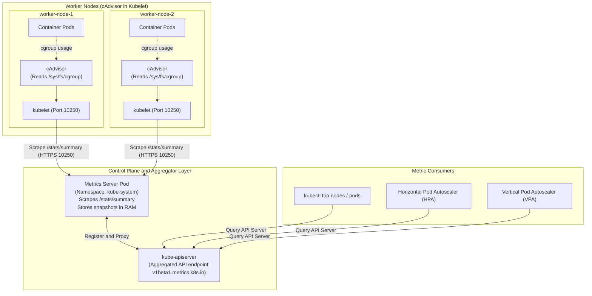
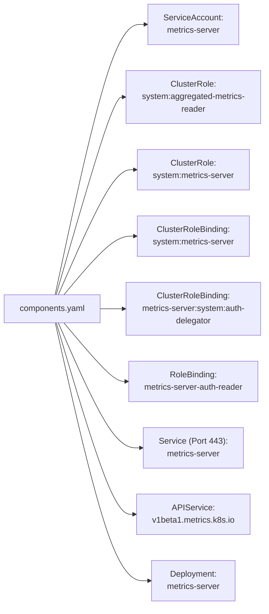
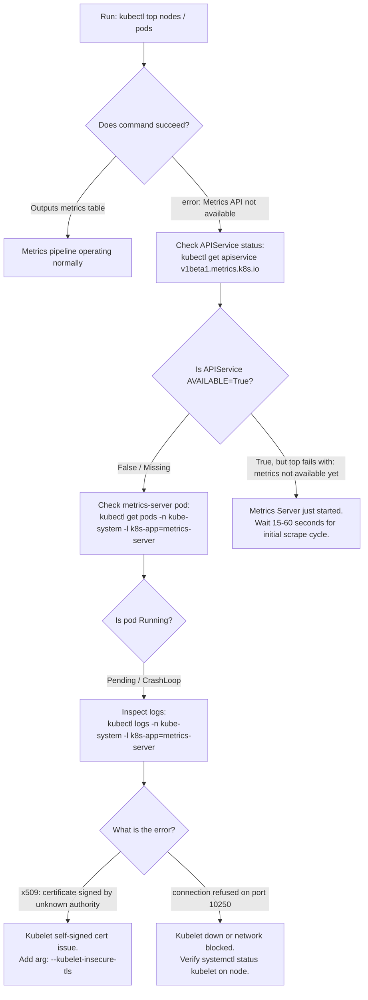

# Kubernetes Cluster Monitoring & Metrics Server - CKA Exam Notes

> **Exam Domain**: Logging & Monitoring (10%) / Troubleshooting (30%)  
> **Weight / Importance**: High (Essential exam topic testing cluster resource observability, deploying/troubleshooting Metrics Server, and analyzing resource consumption via `kubectl top`)  
> **Target Version**: Verified against v1.31 / v1.32 (Current CKA Curriculum)  
> **Allowed Docs Search Keywords**: `Resource metrics pipeline`, `Metrics Server`, `kubectl top`, `cAdvisor`  
> **Source**: Generated from `logging-and-monitoring/01-monitor-cluster-components-raw.md`

---

## 1. Quick-Reference Summary

- **Primary Role of Metrics Server**:
  - A lightweight, in-memory aggregation daemon that collects real-time CPU and memory metrics from nodes and pods.
  - Replaced the deprecated and retired **Heapster** pipeline.
- **In-Memory Architecture (Zero Historical Persistence)**:
  - Metrics Server **does not store historical time-series data on disk**.
  - It maintains only the most recent scrape window in RAM.
  - For long-term historical retention, alerting, and trend visualization, full-featured monitoring platforms like **Prometheus** or the **Elastic Stack** are required.
- **The Metric Source: cAdvisor**:
  - **cAdvisor (Container Advisor)** is an embedded subcomponent inside the **Kubelet** daemon on every worker node.
  - cAdvisor reads Linux control groups (`cgroups`) from `/sys/fs/cgroup/` to measure exact CPU cycles and memory usage per container.
  - Kubelet exposes these metrics securely over HTTPS on port **`10250`** via the `/stats/summary` endpoint.
- **Aggregated API Registration (`v1beta1.metrics.k8s.io`)**:
  - Metrics Server registers an **APIService** with the API Server (`v1beta1.metrics.k8s.io`).
  - When you run `kubectl top`, the request hits `kube-apiserver`, which proxies it directly to `metrics-server` in the `kube-system` namespace.
- **Primary Consumers**:
  - **CLI Observability**: `kubectl top nodes` and `kubectl top pods`.
  - **Autoscaling Engines**: Horizontal Pod Autoscaler (**HPA**) and Vertical Pod Autoscaler (**VPA**).
- **The #1 CKA / Lab Installation Trap**:
  - In self-signed or kubeadm environments where Kubelet serving certificates are not signed by the cluster CA, Metrics Server fails with `x509: certificate signed by unknown authority`.
  - Resolution: Add the flag **`--kubelet-insecure-tls`** to the Metrics Server deployment container args.

---

## 2. Conceptual Overview & Mental Model

### Dual-Layer Architectural Understanding

- **Simple English Explanation (How It Works)**:
  - **Why Resource Monitoring is Required**:
    Kubernetes manages containers by allocating host CPU and memory. Without real-time observability into how much compute workloads consume, cluster administrators cannot detect memory leaks, identify crashing containers, diagnose CPU starvation, or automatically scale workloads during traffic spikes.
  - **How the Metrics Pipeline Collects and Delivers Data**:
    1. **Collection at Host Level (cAdvisor)**: Every worker node runs `kubelet`. Built directly inside `kubelet` is `cAdvisor`, which inspects the Linux kernel `cgroup` filesystem (`/sys/fs/cgroup/cpu` and `/sys/fs/cgroup/memory`). It continuously records the actual CPU time and memory bytes used by each container process.
    2. **Scraping by Metrics Server**: The `metrics-server` pod runs in the `kube-system` namespace. On a periodic cycle (default: every 15–60 seconds), it connects over HTTPS to the Kubelet on every node (`https://<node-ip>:10250/stats/summary`) and retrieves the latest snapshot of compute usage.
    3. **In-Memory Aggregation**: Metrics Server calculates cluster-wide totals and stores this current snapshot entirely in RAM.
    4. **Serving via API Aggregation**: When a user runs `kubectl top node` or an HPA checks replica load, they send requests to `kube-apiserver`. The API server's Aggregator layer proxies the query to `metrics-server` via the `metrics.k8s.io` API.



- **Standard / Production Definition**:
  - **Metrics Server**: An aggregated, in-cluster cluster addon that provides resource utilization statistics (CPU and memory) for pods and nodes. It polls Kubelet's embedded cAdvisor via the `/stats/summary` endpoint and exposes standardized metrics through the `metrics.k8s.io` subresource, serving as the canonical metrics provider for `kubectl top` and Kubernetes autoscaling pipelines.

---

## 3. Deep-Dive Technical Breakdown

### 3.1 Ecosystem Comparison: Available Monitoring Solutions


Kubernetes workloads can be monitored using native in-memory tools or external time-series observability stacks:

| Monitoring Platform | Type / Storage Model | Target Metrics Collected | Historical Persistence? | Built for Alerting & Visuals? | Typical Use Case |
| :--- | :--- | :--- | :--- | :--- | :--- |
| **Metrics Server** | In-Cluster / **In-Memory (RAM only)** | Basic CPU & Memory (Nodes/Pods) | **No** (Current snapshot only) | **No** (No dashboard or alerting engine) | Powering `kubectl top`, HPA, and VPA. |
| **Prometheus** | In-Cluster or External / **TSDB (Disk/SSD)** | System, Container, App-level, Custom | **Yes** (Configurable retention) | **Yes** (Alertmanager & Grafana) | End-to-end production cluster observability. |
| **Elastic Stack (ELK/EFK)** | In-Cluster or External / **Elasticsearch** | Application logs, system metrics | **Yes** (Index retention policies) | **Yes** (Kibana dashboards & alerts) | Centralized logging, trace analysis, and event log auditing. |
| **Datadog / Dynatrace** | SaaS / Commercial Cloud Agent | Full-stack APM, traces, logs, metrics | **Yes** (Cloud retention) | **Yes** (Managed dashboards & AI alerts) | Enterprise managed multi-cloud monitoring. |

---

### 3.2 Metrics Pipeline Sources: cAdvisor & Kubelet


1. **cAdvisor Role**:
   - Integrated directly into the `kubelet` binary since early Kubernetes versions.
   - Discovers all containers running on the host via the Container Runtime Interface (CRI).
   - Scrapes kernel-level accounting data from `/sys/fs/cgroup/cpu` (or cgroup v2 `/sys/fs/cgroup/cpu.stat`) and `/sys/fs/cgroup/memory`.
2. **Kubelet Serving Endpoints**:
   - `/stats/summary`: Returns JSON-formatted aggregate metrics for the node, runtime, network interfaces, and individual containers.
   - `/metrics`: Standard Prometheus-formatted operational metrics of Kubelet itself.
   - `/metrics/cadvisor`: Prometheus-formatted container metrics directly from cAdvisor.
3. **Metrics Server Scraping Architecture**:
   - The Metrics Server deployment runs a single pod (optionally high-availability with multiple replicas).
   - It scrapes `/stats/summary` on all nodes every 15 seconds (configurable via `--metric-resolution`).
   - Translates raw cgroup nanoseconds of CPU and bytes of memory into normalized metrics:
     - **CPU**: Expressed in millicores (`m`), where $1000\text{m} = 1\text{ CPU core}$.
     - **Memory**: Expressed in binary mebibytes (`Mi`) or gigabytes (`Gi`), where $1\text{Mi} = 1024 \times 1024\text{ bytes}$.

---

### 3.3 Deploying Metrics Server: `components.yaml` Breakdown


Metrics Server is deployed by applying the official manifest bundle ([`logging-and-monitoring/components.yaml`](file:///home/likhith/Documents/cka-notes/logging-and-monitoring/components.yaml)).

The bundle creates 8 distinct Kubernetes resources:



#### Detailed Breakdown of Manifest Components

1. **`ServiceAccount` (`metrics-server`)**:
   - Identifies the Metrics Server pod for API authentication.
2. **RBAC Bindings**:
   - `metrics-server:system:auth-delegator`: Allows Metrics Server to delegate client authentication to the main API server.
   - `metrics-server-auth-reader`: Allows Metrics Server to read the `extension-apiserver-authentication` ConfigMap in `kube-system`.
   - `system:metrics-server`: Grants read access to `nodes`, `nodes/metrics`, `nodes/stats`, and `pods`.
3. **`APIService` (`v1beta1.metrics.k8s.io`)**:
   - Registers `metrics.k8s.io` with `kube-apiserver`.
   - Instructs the API server to forward all `/apis/metrics.k8s.io/v1beta1/*` calls to the `metrics-server` Service in `kube-system`.
4. **`Deployment` (`metrics-server`)**:
   - Runs the container image `registry.k8s.io/metrics-server/metrics-server:v0.9.0`.
   - Exposes container port `10250` over HTTPS.

---

## 4. Declarative Manifests & Scaffolding Patterns

### Complete Installation Workflow: Setting Up Metrics Server

#### Step 1: Deploy Metrics Server from Local Manifest
In this repository, the pre-configured manifest is located at `logging-and-monitoring/components.yaml`:
```bash
kubectl apply -f logging-and-monitoring/components.yaml
```

*Alternatively, from upstream GitHub*:
```bash
kubectl apply -f https://github.com/kubernetes-sigs/metrics-server/releases/latest/download/components.yaml
```

#### Step 2: The Critical Fix for Lab & Kubeadm Environments
In kubeadm clusters, Kubelet certificates are generated by default without SAN IP entries, or are self-signed. This causes Metrics Server to fail TLS verification with:
`x509: cannot validate certificate for <ip> because it doesn't contain any IP SANs`

To fix this, edit the Deployment to bypass TLS verification for Kubelets:
```bash
kubectl -n kube-system patch deployment metrics-server --type='json' -p='[
  {
    "op": "add",
    "path": "/spec/template/spec/containers/0/args/-",
    "value": "--kubelet-insecure-tls"
  }
]'
```

*Or edit directly using `kubectl edit -n kube-system deployment metrics-server`*:
```yaml
spec:
  template:
    spec:
      containers:
      - name: metrics-server
        args:
        - --cert-dir=/tmp
        - --secure-port=10250
        - --kubelet-preferred-address-types=InternalIP,ExternalIP,Hostname
        - --kubelet-use-node-status-port
        - --metric-resolution=15s
        - --kubelet-insecure-tls          # <-- ADD THIS ARGUMENT
```

#### Step 3: Verify Deployment and APIService
```bash
# 1. Verify Metrics Server pod is Running
kubectl get pods -n kube-system -l k8s-app=metrics-server

# 2. Verify the APIService registration is Available
kubectl get apiservice v1beta1.metrics.k8s.io
# Expected output:
# NAME                     SERVICE                       AVAILABLE   AGE
# v1beta1.metrics.k8s.io   kube-system/metrics-server   True        1m
```

---

## 5. Command Translation & Operational Mapping Tables

### Comparison of Resource Units & Metrics Output

| Metric Column | Unit | Representation / Meaning | Example Raw Value |
| :--- | :--- | :--- | :--- |
| **CPU (`m`)** | Millicores | $1000\text{m} = 1\text{ full vCPU / CPU core}$. $250\text{m} = 0.25\text{ cores}$. | `250m` |
| **CPU (`%`)** | Percentage | Consumed millicores divided by Node's total allocatable CPU. | `12%` |
| **Memory (`Mi`)** | Mebibytes | Binary mebibytes ($1\text{Mi} = 2^{20}\text{ bytes} = 1{,}048{,}576\text{ bytes}$). | `512Mi` |
| **Memory (`Gi`)** | Gibibytes | Binary gibibytes ($1\text{Gi} = 2^{30}\text{ bytes} = 1{,}073{,}741{,}824\text{ bytes}$). | `2Gi` |
| **Memory (`%`)** | Percentage | Consumed memory divided by Node's total allocatable RAM. | `45%` |

---

## 6. High-Yield CLI & Imperative Commands

```bash
# 1. View CPU and memory consumption across all nodes
kubectl top nodes

# 2. Sort nodes by CPU consumption (descending)
kubectl top nodes --sort-by=cpu

# 3. Sort nodes by Memory consumption (descending)
kubectl top nodes --sort-by=memory

# 4. View CPU and memory for pods in the current namespace
kubectl top pods

# 5. View pod metrics across ALL namespaces
kubectl top pods -A

# 6. Sort pods by memory consumption across the entire cluster
kubectl top pods -A --sort-by=memory

# 7. View individual container resource usage inside multi-container pods
kubectl top pods <pod-name> --containers

# 8. Query raw JSON metrics from the aggregated API directly
kubectl get --raw "/apis/metrics.k8s.io/v1beta1/nodes" | jq .
kubectl get --raw "/apis/metrics.k8s.io/v1beta1/pods" | jq .
```

---

## 7. Troubleshooting & Diagnostic Runbook

### Decision Tree: Troubleshooting `kubectl top` Failures



### Step-by-Step Triage Sequence

#### Scenario: `error: Metrics API not available`
1. **Verify Metrics Server Pod**:
   ```bash
   kubectl get pods -n kube-system -l k8s-app=metrics-server
   ```
   If status is `CrashLoopBackOff`, inspect logs:
   ```bash
   kubectl logs -n kube-system -l k8s-app=metrics-server
   ```
2. **Check for TLS Handshake Rejection**:
   If logs display:
   `Get "https://192.168.1.20:10250/stats/summary": x509: cannot validate certificate for 192.168.1.20 because it doesn't contain any IP SANs`
   - **Fix**: Patch the deployment with `--kubelet-insecure-tls` as detailed in Section 4.
3. **Check the APIService**:
   ```bash
   kubectl get apiservice v1beta1.metrics.k8s.io
   ```
   If `AVAILABLE` is `False`, check the reason:
   ```bash
   kubectl describe apiservice v1beta1.metrics.k8s.io
   ```
   Verify that the `Service` named `metrics-server` exists in `kube-system` and has valid Endpoints targeting the running pod:
   ```bash
   kubectl get endpoints -n kube-system metrics-server
   ```

---

## 8. CKA Exam Tips, Gotchas & Traps

> [!WARNING]
> **The Warm-up Delay Gotcha**:
> Immediately after deploying Metrics Server or restarting its pod, running `kubectl top pods` will return:
> `error: metrics not available yet`  
> **Do not panic!** Metrics Server requires at least 1 to 2 complete collection cycles (15–60 seconds) to calculate initial rate derivatives for CPU. Wait 30 seconds and retry.

> [!IMPORTANT]
> **The `--kubelet-insecure-tls` Exam Requirement**:
> In the CKA exam or Kill.sh mock environments, if an exam question instructs you: *"Deploy the Metrics Server and ensure `kubectl top` works"*, applying the standard upstream manifest **will fail by default** due to Kubelet TLS verification errors. Always inspect the logs, and be prepared to add `--kubelet-insecure-tls` to the container arguments.

> [!TIP]
> **Sorting for Resource Bottlenecks**:
> When an exam question asks: *"Find the pod consuming the highest memory in namespace web and record its name"*, avoid manually scanning numbers. Use the built-in sorting flag:
> ```bash
> kubectl top pods -n web --sort-by=memory --no-headers | head -n 1
> ```

> [!CAUTION]
> **No Historical Metrics Storage**:
> Remember that Metrics Server **does not persist history**. If an exam or interview question asks for the peak CPU usage of a pod from 3 hours ago, `kubectl top` cannot answer it. That requires Prometheus or an external logging/metrics backend.

---

## 9. Self-Test / Active Recall

1. **What is the primary difference in data retention between Metrics Server and Prometheus?**
2. **Which subcomponent running inside Kubelet is responsible for extracting container metrics from Linux cgroups?**
3. **On which port and endpoint does Kubelet expose container and node metrics to Metrics Server?**
4. **Which APIService resource does Metrics Server register with the Kubernetes API aggregator?**
5. **What CLI command displays the individual resource consumption of containers inside a multi-container pod?**
6. **Why does Metrics Server frequently fail to scrape Kubelet in freshly bootstrapped kubeadm clusters, and what flag resolves this?**
7. **If you just deployed Metrics Server 5 seconds ago and `kubectl top nodes` returns `error: metrics not available yet`, what should you do?**

<details>
<summary>Reveal Answers</summary>

1. Metrics Server stores only the latest scrape snapshot in RAM (zero historical persistence). Prometheus stores time-series data on disk with configurable retention periods for querying historical trends and alerts.
2. `cAdvisor` (Container Advisor).
3. HTTPS port `10250` at `/stats/summary`.
4. `v1beta1.metrics.k8s.io`.
5. `kubectl top pods <pod-name> --containers`.
6. Because Kubelet serving certificates in kubeadm clusters are typically self-signed or lack IP SANs, causing TLS verification to fail. Resolved by adding `--kubelet-insecure-tls` to the Metrics Server container args.
7. Wait 15–60 seconds for Metrics Server to complete at least one full scraping cycle and populate its in-memory metrics window.
</details>

---

### Official Documentation Bookmarks

Allowed for reference during the live exam at [kubernetes.io/docs](https://kubernetes.io/docs/home/):

| Topic | Direct Search Term | Recommended Anchor |
| :--- | :--- | :--- |
| **Resource Metrics Pipeline** | `Resource metrics pipeline` | Tasks > Debug, Troubleshoot, and Monitor > Resource metrics pipeline |
| **Tools for Monitoring** | `Tools for Monitoring Resources` | Tasks > Debug, Troubleshoot, and Monitor > Tools for Monitoring Resources |
| **Kubectl Top** | `kubectl top` | Reference > Command line tool (kubectl) > kubectl top |
| **Metrics Server GitHub** | `kubernetes-sigs/metrics-server` | Upstream repository for manifest components |
