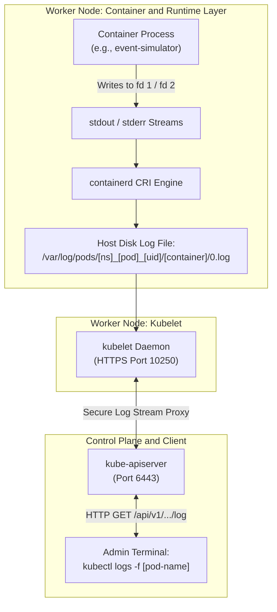
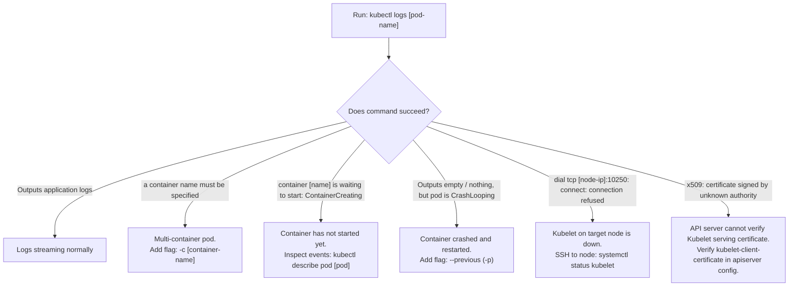

# Managing Application Logs in Kubernetes - CKA Exam Notes

> **Exam Domain**: Logging & Monitoring (10%) / Troubleshooting (30%)  
> **Weight / Importance**: Critical (Indispensable diagnostic tool for the CKA exam: isolating container crashes, inspecting multi-container logs, streaming real-time events, and debugging `CrashLoopBackOff`)  
> **Target Version**: Verified against v1.31 / v1.32 (Current CKA Curriculum)  
> **Allowed Docs Search Keywords**: `Logging Architecture`, `kubectl logs`, `Basic logging in Kubernetes`, `Log rotation`  
> **Source**: Generated from `logging-and-monitoring/02-managing-application-logs-raw.md`

---

## 1. Quick-Reference Summary

- **Standard Output / Error Streams (`stdout` / `stderr`)**:
  - Kubernetes logging captures anything an application process writes directly to Linux standard output (file descriptor `1`) or standard error (file descriptor `2`).
  - Processes writing to custom log files inside the container must use sidecar streaming agents or volume mounts to make logs visible to `kubectl logs`.
- **Host Log Storage Location**:
  - The container runtime (`containerd`) writes logs to the host filesystem at:
    `/var/log/pods/<namespace>_<pod-name>_<pod-uid>/<container-name>/<restart-count>.log`
  - Symlinked for convenience under:
    `/var/log/containers/<pod-name>_<namespace>_<container-name>-<container-id>.log`
- **Single vs. Multi-Container Logging**:
  - **Single-container pod**: `kubectl logs <pod-name>` automatically outputs that container's log stream.
  - **Multi-container pod**: You **must specify the container name** using **`-c <container-name>`** (or positional syntax: `kubectl logs <pod> <container>`).
  - **All containers simultaneously**: Append **`--all-containers=true`**.
- **The #1 Crash Diagnostic Flag (`--previous` / `-p`)**:
  - If a container crashed and restarted (`CrashLoopBackOff`), standard `kubectl logs <pod>` only shows the *current new* container instance (which may be empty or healthy).
  - Use **`kubectl logs -p <pod>`** to print the logs of the **previously terminated container instance** to identify the fatal panic, OOM, or stack trace.
- **Log Streaming & Time Slicing**:
  - Stream live logs: **`-f`** or **`--follow`**
  - Tail recent lines: **`--tail=50`**
  - Filter by duration: **`--since=1h`** or **`--since=15m`**
  - Prepend timestamps: **`--timestamps=true`**

---

## 2. Conceptual Overview & Mental Model

### Dual-Layer Architectural Understanding

- **Simple English Explanation (How It Works)**:
  - **How Logs Flow from Code to Terminal**:
    When an application code executes `print("User logged in")` or `console.error("DB connection timeout")`, the operating system writes those characters to the container's standard output (`stdout`) or standard error (`stderr`) stream.
    1. **Runtime Interception**: The container runtime daemon (`containerd`) manages the container's Linux namespaces and pseudo-terminal (`pty`). It captures these streams and appends them to a formatted log file on the host disk under `/var/log/pods/`.
    2. **Kubelet Log Endpoint**: The node agent (`kubelet`) monitors this directory and exposes an authenticated HTTP endpoint on port `10250`: `/containerLogs/{namespace}/{pod}/{container}`.
    3. **API Server Proxying**: When an administrator runs `kubectl logs my-pod`, the command calls `kube-apiserver`. The API server initiates an internal TLS stream to the target node's `kubelet:10250`, reads the log file from disk, and streams the lines back to the user's terminal.
  - **Log Ephemerality**:
    Kubernetes does **not** provide built-in cluster-wide log aggregation. If a Pod is deleted from the cluster, its local log files on the worker node are permanently garbage collected by Kubelet. To preserve logs permanently, clusters deploy central log collectors (e.g., Fluent Bit, Promtail, or Elasticsearch).



- **Standard / Production Definition**:
  - **Kubernetes Application Logging**: An in-tree observability mechanism that redirects containerized standard output and standard error streams via the Container Runtime Interface (CRI) into host-level log files. The `kubelet` exposes these logs over its authenticated HTTPS serving port, enabling the API server to dynamically proxy log streams directly to `kubectl` clients or node-level log shipping agents.

---

## 3. Deep-Dive Technical Breakdown

### 3.1 Single-Container Pod Logging


When a Pod contains exactly one container, `kubectl` automatically selects that container:

```yaml
# event-simulator.yaml
apiVersion: v1
kind: Pod
metadata:
  name: event-simulator-pod
spec:
  containers:
  - name: event-simulator
    image: kodekloud/event-simulator
```

```bash
# Deploy and stream logs
kubectl create -f event-simulator.yaml
kubectl logs -f event-simulator-pod
```

*Sample Output*:
```text
2026-10-04 15:57:15,937 - root - INFO - USER1 logged in
2026-10-04 15:57:16,943 - root - INFO - USER2 logged out
2026-10-04 15:57:17,944 - root - INFO - USER2 is viewing page2
```

---

### 3.2 Multi-Container Pod Logging


When a Pod contains multiple containers (e.g. an application container and a sidecar or processor container):

```yaml
# event-simulator-multicontainer.yaml
apiVersion: v1
kind: Pod
metadata:
  name: event-simulator-pod
spec:
  containers:
  - name: event-simulator
    image: kodekloud/event-simulator
  - name: image-processor
    image: some-image-processor
```

#### The Ambiguity Error
If you omit the container name on a multi-container pod:
```bash
kubectl logs event-simulator-pod
```
*Output*:
```text
error: a container name must be specified for pod event-simulator-pod, choose one of: [event-simulator image-processor]
```

#### Specifying the Target Container
To view logs from a specific container:
```bash
# Using the explicit -c flag (recommended for clarity and scripts)
kubectl logs -f event-simulator-pod -c event-simulator

# Using positional argument syntax
kubectl logs -f event-simulator-pod event-simulator

# Streaming logs from all containers simultaneously
kubectl logs -f event-simulator-pod --all-containers=true
```

#### Setting a Default Container Annotation
You can instruct `kubectl` to default to a specific container when `-c` is omitted by adding the `kubectl.kubernetes.io/default-container` annotation to the Pod metadata:
```yaml
metadata:
  name: event-simulator-pod
  annotations:
    kubectl.kubernetes.io/default-container: event-simulator
```

---

### 3.3 Host Filesystem Layout & Direct `crictl` Inspection

When `kubectl` is unavailable (e.g. during control-plane outages or Kubelet communication failures), an administrator can inspect logs directly on the worker node.

#### Host File Paths
1. **Pod Log Directory**:
   ```bash
   /var/log/pods/<namespace>_<pod-name>_<pod-uid>/<container-name>/<restart-count>.log
   ```
2. **Container Symlink Directory**:
   ```bash
   ls -la /var/log/containers/
   # Symlinks point into /var/log/pods/
   ```

#### Inspecting via `crictl` on Worker Node
```bash
# 1. Identify container ID on the host
crictl ps --name event-simulator

# 2. View container logs directly through the container runtime
crictl logs <container-id>

# 3. Stream runtime logs live
crictl logs -f <container-id>
```

---

## 4. Declarative Manifests & Scaffolding Patterns

### Complete Workflow: Diagnosing a Crashing Workload via Previous Logs

#### Step 1: Deploy a Faulty Workload
```yaml
# crash-pod.yaml
apiVersion: v1
kind: Pod
metadata:
  name: crash-demo
spec:
  restartPolicy: Always
  containers:
  - name: failing-app
    image: busybox:1.36
    command: ["sh", "-c", "echo 'Initializing application...'; sleep 5; echo 'FATAL: Null pointer exception at startup'; exit 1"]
```
```bash
kubectl apply -f crash-pod.yaml
```

#### Step 2: Observe Pod Enters `CrashLoopBackOff`
```bash
kubectl get pod crash-demo
# NAME         READY   STATUS             RESTARTS      AGE
# crash-demo   0/1     CrashLoopBackOff   2 (20s ago)   45s
```

#### Step 3: Extract the Fatal Error Using `--previous`
If you run `kubectl logs crash-demo` while the pod is sleeping or restarting, output may be missing. Inspect the terminated instance:
```bash
kubectl logs crash-demo -c failing-app --previous
```
*Output*:
```text
Initializing application...
FATAL: Null pointer exception at startup
```

---

## 5. Command Translation & Operational Mapping Tables

### Comparison: `docker logs` vs. `crictl logs` vs. `kubectl logs`

| Feature / Operation | Docker CLI (`docker`) | CRI Tool (`crictl`) | Kubernetes CLI (`kubectl`) |
| :--- | :--- | :--- | :--- |
| **Operational Scope** | Single Docker host | Single worker node (containerd/CRI-O) | **Entire Cluster (via API Server)** |
| **Stream Live Logs** | `docker logs -f <id>` | `crictl logs -f <id>` | `kubectl logs -f <pod>` |
| **Inspect Previous Crash** | Not supported natively | Inspect `/var/log/pods/` | **`kubectl logs -p <pod>`** |
| **Multi-Container Pods** | N/A (Docker knows containers only) | N/A (Targets container ID) | **`kubectl logs <pod> -c <container>`** |
| **All Containers in Pod** | N/A | N/A | **`kubectl logs <pod> --all-containers`** |
| **Filter by Time Window** | `docker logs --since 10m` | `crictl logs --since 10m` | **`kubectl logs --since=10m`** |
| **Filter by Workload Label** | N/A | N/A | **`kubectl logs -l app=frontend`** |

---

## 6. High-Yield CLI & Verification Commands

```bash
# 1. Basic log retrieval for a single-container pod
kubectl logs event-simulator-pod

# 2. Stream logs in real time (Ctrl+C to stop)
kubectl logs -f event-simulator-pod

# 3. Specify a container in a multi-container pod
kubectl logs event-simulator-pod -c event-simulator

# 4. Stream logs from ALL containers in a multi-container pod simultaneously
kubectl logs event-simulator-pod --all-containers -f

# 5. Retrieve logs from the previously crashed container instance (CrashLoopBackOff)
kubectl logs event-simulator-pod -c event-simulator --previous

# 6. Tail the last 30 lines of logs
kubectl logs event-simulator-pod --tail=30

# 7. View logs generated in the last 15 minutes
kubectl logs event-simulator-pod --since=15m

# 8. View logs with RFC3339 timestamps prepended to every line
kubectl logs event-simulator-pod --timestamps=true

# 9. Stream logs from all pods matching a label selector (e.g. all replicas of a deployment)
kubectl logs -f -l app=event-simulator --all-containers=true

# 10. Direct log retrieval from a Deployment or ReplicaSet
kubectl logs deployment/event-simulator-deployment -c event-simulator --tail=50
```

---

## 7. Troubleshooting & Diagnostic Runbook

### Decision Tree: Troubleshooting `kubectl logs` Failures



### Step-by-Step Triage Sequence

#### Scenario 1: `kubectl logs` Fails with `connection refused` on Port 10250
1. **Symptom**: `kubectl logs my-pod` returns:
   `Error from server: Get "https://192.168.1.15:10250/containerLogs/default/my-pod/web": dial tcp 192.168.1.15:10250: connect: connection refused`
2. **Root Cause**: The API server cannot establish an HTTPS connection to the Kubelet on worker node `192.168.1.15`.
3. **Resolution**:
   - SSH to the worker node: `ssh 192.168.1.15`
   - Check Kubelet service status: `sudo systemctl status kubelet`
   - If stopped or failed, inspect system logs: `sudo journalctl -u kubelet -e`
   - Restart Kubelet: `sudo systemctl restart kubelet`

#### Scenario 2: Container Crashes on Startup and `kubectl logs` Returns Blank
1. **Symptom**: Pod status is `CrashLoopBackOff` or `Error`. Running `kubectl logs my-pod` produces zero lines of output.
2. **Root Cause**: The container crashed immediately, Kubelet restarted it, and the new container hasn't written anything to stdout yet.
3. **Resolution**:
   - Query the previous instance's buffer:
     ```bash
     kubectl logs my-pod --previous
     ```
   - If multi-container, specify `-c`:
     ```bash
     kubectl logs my-pod -c app-container --previous
     ```

---

## 8. CKA Exam Tips, Gotchas & Traps

> [!WARNING]
> **The Ambiguity Error in Multi-Container Pods**:
> In the CKA exam, troubleshooting questions frequently feature Pods with 2 containers (e.g. an application container and a logging sidecar). Running `kubectl logs <pod-name>` without `-c <container-name>` will fail with an error. Always check `kubectl get pod <pod-name> -o jsonpath='{.spec.containers[*].name}'` to know your container names!

> [!IMPORTANT]
> **The `--previous` Flag is Your Best Friend**:
> Whenever a pod is in `CrashLoopBackOff`, the **first command you should run** is:
> ```bash
> kubectl logs <pod-name> --previous
> ```
> 90% of the time, the fatal application stack trace (e.g. syntax error, missing environment variable, failed DB connection) is visible only in the previous container's logs.

> [!TIP]
> **Combine `--timestamps` and `--since` for Precision**:
> Under time pressure during an exam, searching through 10,000 lines of log output wastes valuable minutes. Filter the output to the last 2 minutes with timestamps:
> ```bash
> kubectl logs <pod-name> --since=2m --timestamps
> ```

> [!CAUTION]
> **Deleted Pods Have No Logs**:
> If a Pod is deleted via `kubectl delete pod`, its logs are immediately lost from `kubectl`. If an exam task asks you to inspect why a deleted pod failed, check the node's `/var/log/pods` before Kubelet garbage collection runs, or inspect Kubernetes events (`kubectl get events`).

---

## 9. Self-Test / Active Recall

1. **Which two Linux standard streams are captured by the container runtime and surfaced by `kubectl logs`?**
2. **On the worker node filesystem, where does `containerd` store container log files?**
3. **What error occurs if you run `kubectl logs` on a multi-container pod without specifying the container?**
4. **Which flag must be appended to `kubectl logs` to view the error that caused a container to enter `CrashLoopBackOff`?**
5. **How can you stream logs from all containers in a multi-container pod simultaneously?**
6. **What command streams logs from all pods across a cluster matching the label `tier=backend`?**
7. **If `kubectl logs` returns `connection refused` on port `10250`, which component on the worker node is down or unreachable?**

<details>
<summary>Reveal Answers</summary>

1. Standard Output (`stdout`, file descriptor 1) and Standard Error (`stderr`, file descriptor 2).
2. `/var/log/pods/<namespace>_<pod-name>_<pod-uid>/<container-name>/<restart-count>.log` (symlinked under `/var/log/containers/`).
3. `error: a container name must be specified for pod <name>, choose one of: [...]`.
4. `--previous` (or `-p`).
5. `kubectl logs <pod-name> --all-containers=true` (optionally with `-f`).
6. `kubectl logs -f -l tier=backend`.
7. The `kubelet` daemon on that worker node.
</details>

---

### Official Documentation Bookmarks

Allowed for reference during the live exam at [kubernetes.io/docs](https://kubernetes.io/docs/home/):

| Topic | Direct Search Term | Recommended Anchor |
| :--- | :--- | :--- |
| **Logging Architecture** | `Logging Architecture` | Concepts > Cluster Administration > Logging Architecture |
| **Basic Logging** | `Basic logging in Kubernetes` | Concepts > Cluster Administration > Logging Architecture > Basic logging |
| **Kubectl Logs Reference** | `kubectl logs` | Reference > Command line tool (kubectl) > kubectl logs |
| **Investigating Pod Failures** | `Determine the Reason for Pod Failure` | Tasks > Debug, Troubleshoot, and Monitor > Determine the Reason for Pod Failure |
