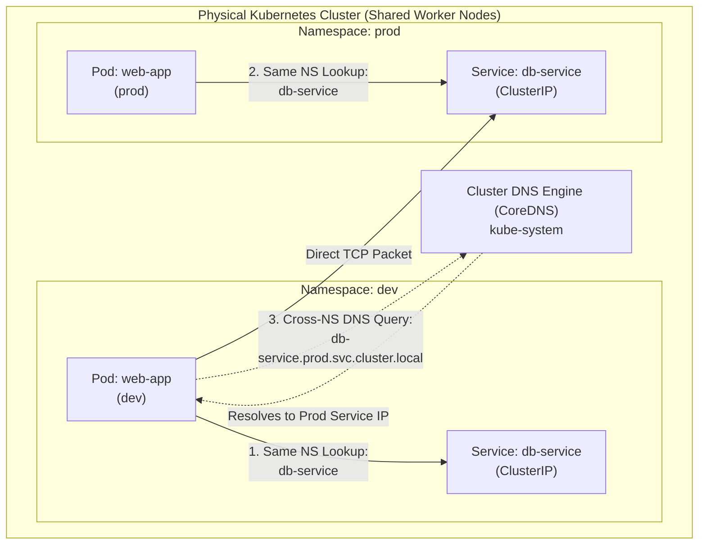
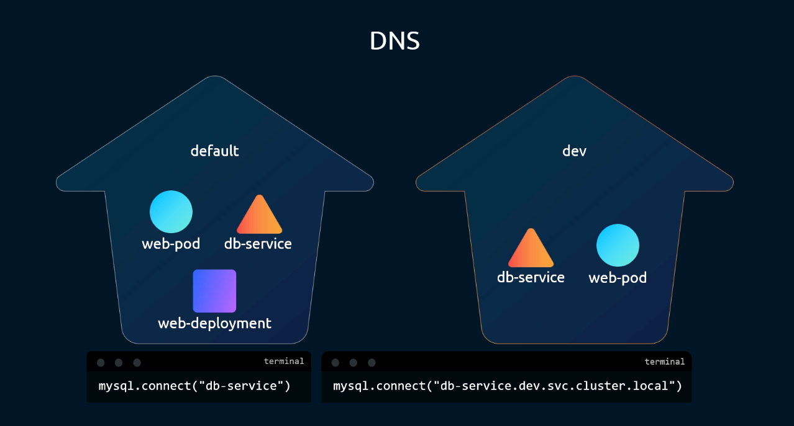
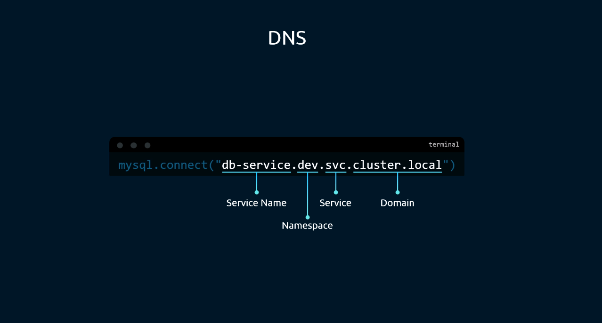
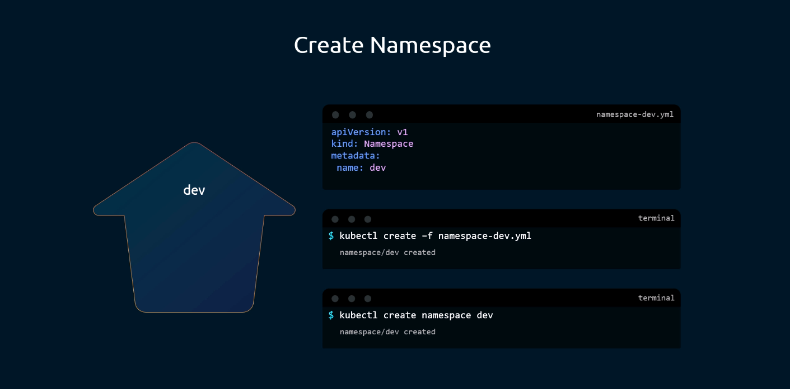
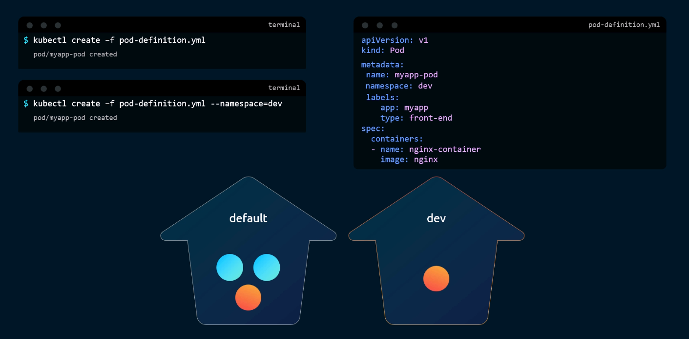
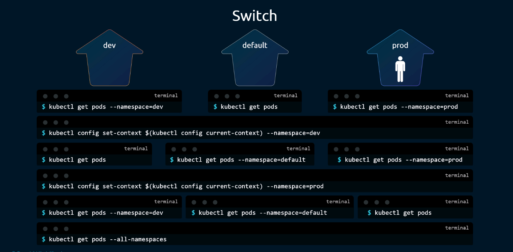
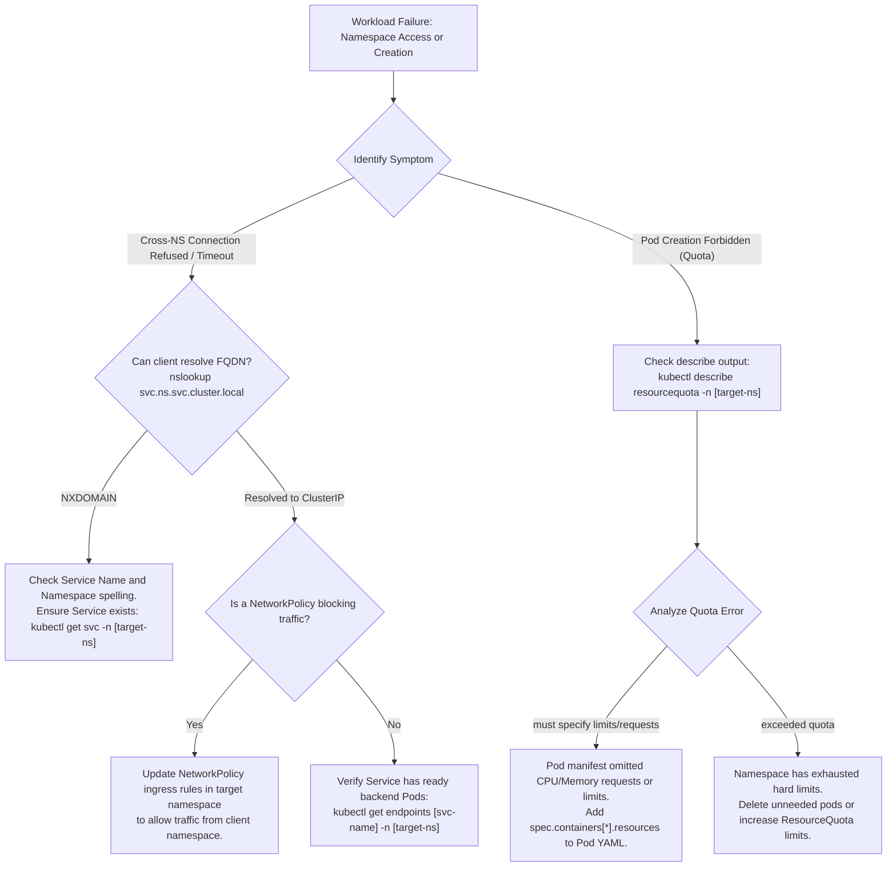

# Kubernetes Namespaces & Resource Isolation - CKA Exam Notes

> **Exam Domain**: Cluster Architecture, Installation & Configuration (25%) / Workloads & Scheduling (15%) / Troubleshooting (30%)  
> **Weight / Importance**: High (Foundational multi-tenancy and resource boundary mechanism)  
> **Target Version**: Verified against v1.31 / v1.32 (Current CKA Curriculum)  
> **Allowed Docs Search Keywords**: `namespaces`, `resourcequota`, `kube-system`, `kube-public`, `kube-node-lease`, `dns for services and pods`  
> **Source**: Generated from `namespace-raw.md`

---

## 1. Quick-Reference Summary

- **Primary Role**: Provides virtual cluster partitioning within a single physical Kubernetes cluster. Provides scoping for resource names, role-based access control (RBAC), network policies, and resource allocation limits (ResourceQuotas).
- **Default System Namespaces (4 Built-in)**:
  1. **`default`**: Default workspace for objects created without an explicit `--namespace` / `metadata.namespace`.
  2. **`kube-system`**: Reserved for control plane daemons, cluster addons (CoreDNS, kube-proxy, CNI plugins).
  3. **`kube-public`**: Globally readable namespace containing public bootstrap data (e.g., `cluster-info` ConfigMap).
  4. **`kube-node-lease`**: Holds node heartbeat `Lease` objects used by the Node Controller to track node health.
- **Cross-Namespace DNS Resolution (FQDN)**:
  - Same namespace: `http://<service-name>` (e.g., `db-service`)
  - Across namespaces: `http://<service-name>.<namespace>.svc.cluster.local` (e.g., `db-service.dev.svc.cluster.local`)
- **Namespaced vs. Cluster-Scoped Resources**:
  - **Namespaced**: Pods, Deployments, Services, ReplicaSets, ConfigMaps, Secrets, PVCs, ServiceAccounts, ResourceQuotas, NetworkPolicies.
  - **Cluster-Scoped (Non-Namespaced)**: Nodes, Namespaces, PersistentVolumes (PVs), StorageClasses, ClusterRoles, ClusterRoleBindings, CustomResourceDefinitions (CRDs).
- **Context Switching**:
  `kubectl config set-context $(kubectl config current-context) --namespace=<target-ns>`
- **Resource Quotas & Admission**: If a `ResourceQuota` enforces CPU or memory limits in a namespace, **every Pod submitted to that namespace MUST declare resource requests/limits**, otherwise the API server rejects the Pod at admission.

---

## 2. Conceptual Overview & Mental Model

### Dual-Layer Architectural Understanding

- **Simple English Explanation (How It Works)**:
  - **Virtual Partitioning**: In a Kubernetes cluster shared by multiple development teams or deployment tiers (e.g., `dev`, `staging`, `prod`), running all workloads inside a single flat space creates naming collisions, security risks, and resource contention.
  - **What a Namespace Does**: A Namespace acts as a logical boundary within the Kubernetes API.
    1. **Name Uniqueness**: Resource names only need to be unique *within* their namespace. You can have a Pod named `web-app` in the `dev` namespace and another Pod named `web-app` in the `prod` namespace without conflict.
    2. **DNS Routing**: Kubernetes CoreDNS creates hierarchical domain records for Services. While Pods in the `dev` namespace can reach local services simply by typing `db-service`, reaching a database in another namespace requires qualifying the name with the target namespace (e.g., `db-service.prod.svc.cluster.local`).
    3. **Resource Boundaries**: By attaching a `ResourceQuota` object to a namespace, cluster administrators prevent any single team from consuming all CPU, memory, or storage in the underlying physical cluster.
  - **What a Namespace Does NOT Do**:
    - A Namespace is **not** a physical network partition by default. Unless a `NetworkPolicy` is explicitly applied, Pods in `dev` can route IP packets directly to Pods in `prod`.
    - A Namespace is **not** tied to physical nodes. Pods from different namespaces are co-scheduled onto the same physical worker nodes according to node capacity and scheduler priority.



- **Standard / Production Definition**:
  Kubernetes namespaces provide a mechanism for isolating groups of resources within a single cluster. Names of resources must be unique within a namespace, but not across namespaces. Namespace-based scoping is applicable only for namespaced objects (e.g. Deployments, Services) and not for cluster-wide objects (e.g. StorageClass, Nodes, PersistentVolumes). Namespaces divide cluster resources among multiple users via resource quotas and provide scope for RBAC policies.

---

## 3. Deep-Dive Technical Breakdown

### 3.1 Default Namespaces in Kubernetes

Every freshly initialized cluster automatically provisions four default system namespaces:

| Namespace | Created By | Purpose & Managed Workloads |
| :--- | :--- | :--- |
| **`default`** | System | Default workspace for workloads when no namespace is specified. |
| **`kube-system`** | System | Dedicated to control plane components, CNI networking daemons, CoreDNS, and `kube-proxy`. Protected against accidental user modification. |
| **`kube-public`** | System | Publicly accessible to all authenticated and unauthenticated clients. Holds public cluster bootstrap information (e.g., `cluster-info` ConfigMap for token discovery). |
| **`kube-node-lease`**| System | Stores `Lease` objects for every node. Used by `kubelet` to publish regular heartbeats (every 10s) with low API overhead. |

---

### 3.2 DNS Resolution Architecture & Cross-Namespace Access

Kubernetes deploys CoreDNS in the `kube-system` namespace. CoreDNS continuously tracks all Services and endpoints, generating DNS A/AAAA and SRV records formatted by namespace:





#### The Fully Qualified Domain Name (FQDN) Format:
$$\textbf{\texttt{<service-name>}}.\textbf{\texttt{<namespace>}}.\textbf{\texttt{svc}}.\textbf{\texttt{<cluster-domain>}}$$

- **Service Name**: The name defined in `metadata.name` of the Service object (e.g., `db-service`).
- **Namespace**: The namespace where the target Service resides (e.g., `dev` or `prod`).
- **`svc`**: Subdomain designating that the record belongs to a Kubernetes Service.
- **Cluster Domain**: The base cluster domain configured in `kubelet` and CoreDNS (default: `cluster.local`).

#### How Intra-Namespace vs. Cross-Namespace Resolution Works:
When a Pod makes a network request, its container `/etc/resolv.conf` contains search domains configured by `kubelet`:
```ini
nameserver 10.96.0.10
search default.svc.cluster.local svc.cluster.local cluster.local
options ndots:5
```
1. **Intra-Namespace (`default` $\to$ `default`)**:
   Querying `curl http://db-service` triggers the resolver to append `default.svc.cluster.local`, resolving immediately.
2. **Cross-Namespace (`default` $\to$ `dev`)**:
   Querying `curl http://db-service` from `default` will fail because it resolves to `db-service.default.svc.cluster.local`.
   The client must specify at least `db-service.dev` (which appends `svc.cluster.local` from the search path) or the complete FQDN:
   ```bash
   curl http://db-service.dev.svc.cluster.local:3306
   ```

---

### 3.3 Namespace Lifecycle & Resource Creation

#### 1. Creating Namespaces (Imperative & Declarative)



- **Declarative Manifest (`namespace-dev.yaml`)**:
  ```yaml
  apiVersion: v1
  kind: Namespace
  metadata:
    name: dev
  ```
- **Execution Commands**:
  ```bash
  # Declarative create
  kubectl create -f namespace-dev.yaml

  # Imperative create (Preferred for CKA exam speed)
  kubectl create namespace dev
  ```

#### 2. Assigning Resources to a Specific Namespace



When creating resources, the target namespace can be defined either in the YAML manifest or overridden on the command line:

```yaml
# pod-definition.yaml
apiVersion: v1
kind: Pod
metadata:
  name: myapp-pod
  namespace: dev        # Statically declares the destination namespace
  labels:
    app: myapp
    type: front-end
spec:
  containers:
  - name: nginx-container
    image: nginx
```

```bash
# 1. Deploys into the namespace declared inside the YAML ('dev')
kubectl create -f pod-definition.yaml

# 2. Command-line flag explicitly targets or overrides the destination namespace
kubectl create -f pod-definition.yaml --namespace=dev
kubectl run myapp-pod --image=nginx -n dev
```

> [!WARNING]
> **Namespace Deletion Cascades!**  
> Deleting a namespace with `kubectl delete namespace <name>` **permanently deletes all objects residing within that namespace** (Pods, Deployments, Services, Secrets, PVCs). In production and CKA exam tasks, never delete a namespace unless explicitly commanded.

---

### 3.4 Context Switching & Active Namespace Configuration

By default, every `kubectl` command targets the `default` namespace unless the `-n` / `--namespace` flag is supplied. To avoid typing `-n <namespace>` repeatedly during an exam task:



```bash
# 1. Check current active context
kubectl config current-context

# 2. Permanently set the active namespace for the current context
kubectl config set-context $(kubectl config current-context) --namespace=dev

# 3. Subsequent commands now automatically target 'dev' without the -n flag
kubectl get pods
# Equivalent to: kubectl get pods -n dev

# 4. View resources across ALL cluster namespaces
kubectl get pods --all-namespaces
# Shortcut:
kubectl get pods -A
```

---

### 3.5 Limiting Resources via ResourceQuota

To prevent a single namespace from monopolizing cluster compute and storage capacity, administrators configure a `ResourceQuota`:

```yaml
# compute-quota.yaml
apiVersion: v1
kind: ResourceQuota
metadata:
  name: compute-quota
  namespace: dev          # The quota binds exclusively to this namespace
spec:
  hard:
    pods: "10"            # Maximum of 10 concurrent Pods
    requests.cpu: "4"     # Sum of all container CPU requests cannot exceed 4 cores
    requests.memory: 5Gi  # Sum of all container memory requests cannot exceed 5 GiB
    limits.cpu: "10"      # Sum of all container CPU limits cannot exceed 10 cores
    limits.memory: 10Gi   # Sum of all container memory limits cannot exceed 10 GiB
```

```bash
# Create the resource quota
kubectl create -f compute-quota.yaml

# Inspect current consumption vs. hard limits
kubectl get resourcequota -n dev
kubectl describe resourcequota compute-quota -n dev
```

> [!IMPORTANT]
> **The ResourceQuota Requirement Trap**:  
> Once a `ResourceQuota` with CPU or memory constraints is activated in a namespace, **any Pod created without explicit `resources.requests` and `resources.limits` will be rejected by the API Server admission controller** with an error:
> `Error from server (Forbidden): error when creating "pod.yaml": pods "my-pod" is forbidden: failed quota: compute-quota: must specify limits.cpu, limits.memory, requests.cpu, requests.memory`.

---

## 4. Command Translation & Operational Mapping Tables

### 4.1 Namespaced vs. Cluster-Scoped Resources Reference

| Scope | Resource Types (API Kinds) | Discovery Command |
| :--- | :--- | :--- |
| **Namespaced** | `Pod`, `Deployment`, `Service`, `ReplicaSet`, `StatefulSet`, `DaemonSet`, `Job`, `CronJob`, `ConfigMap`, `Secret`, `PersistentVolumeClaim` (PVC), `ServiceAccount`, `Role`, `RoleBinding`, `ResourceQuota`, `LimitRange`, `NetworkPolicy` | `kubectl api-resources --namespaced=true` |
| **Cluster-Scoped** | `Node`, `Namespace`, `PersistentVolume` (PV), `StorageClass`, `ClusterRole`, `ClusterRoleBinding`, `CertificateSigningRequest`, `IngressClass`, `CustomResourceDefinition` (CRD) | `kubectl api-resources --namespaced=false` |

---

### 4.2 Namespace Inspection & Context Commands Comparison

| Goal | CLI Command | Purpose |
| :--- | :--- | :--- |
| **List Namespaces** | `kubectl get namespaces` (or `kubectl get ns`) | Lists all namespaces with their phase (`Active` / `Terminating`). |
| **Query Specific NS** | `kubectl get pods -n <namespace>` | Limits the query to the designated namespace. |
| **Query All NS** | `kubectl get pods -A` | Queries objects across every namespace simultaneously. |
| **Change Default NS**| `kubectl config set-context --current --namespace=<ns>` | Sets default namespace for all future commands in this shell. |
| **View Context NS** | `kubectl config view --minify \| grep namespace` | Displays the default namespace configured in the active context. |

---

## 5. High-Yield CLI & Imperative Commands

### 5.1 Rapid Namespace Operations (CKA Essential)

```bash
# 1. Create a namespace instantly
kubectl create namespace dev

# 2. Generate a namespace YAML manifest without creating it
kubectl create namespace staging --dry-run=client -o yaml > ns-staging.yaml

# 3. Switch active context namespace using modern syntax
kubectl config set-context --current --namespace=dev

# 4. Verify which namespace is active
kubectl config view --minify | grep namespace:
```

---

### 5.2 Deploying and Querying Workloads Across Namespaces

```bash
# 1. Deploy a Pod into a specific namespace imperatively
kubectl run nginx-dev --image=nginx -n dev

# 2. Expose a deployment in a specific namespace
kubectl expose deployment web-app --port=80 -n dev

# 3. View detailed object configuration in a namespace
kubectl get service db-service -n dev -o wide

# 4. View ResourceQuota utilization
kubectl describe resourcequota compute-quota -n dev
```

---

### 5.3 Testing Cross-Namespace DNS Connectivity

```bash
# Run a temporary diagnostic container in the 'default' namespace
kubectl run test-dns --image=busybox:1.36 -it --rm -- nslookup db-service.dev.svc.cluster.local

# Connect across namespaces using curl
kubectl run curl-test --image=curlimages/curl -it --rm -- curl -I http://web-service.prod.svc.cluster.local
```

---

## 6. Troubleshooting & Diagnostic Runbook

### Decision Tree: Cross-Namespace Communication & Quota Failures



### Step-by-Step Triage Sequence

1. **Diagnosing Pod Rejected by ResourceQuota**:
   - Symptom: `Error from server (Forbidden): ... failed quota: compute-quota: must specify limits.cpu`.
   - *Fix*: Edit the Pod manifest to add explicit resource requests and limits:
     ```yaml
     resources:
       requests:
         cpu: "200m"
         memory: "256Mi"
       limits:
         cpu: "500m"
         memory: "512Mi"
     ```

2. **Diagnosing Namespace Stuck in `Terminating` Status**:
   - Symptom: `kubectl get ns` displays a namespace in `Terminating` for minutes or hours.
   - *Cause*: A finalizer is blocked waiting for underlying resources (such as metrics APIs, un-deleted CRDs, or unresponsive admission webhooks) to clean up.
   - *Investigation*:
     ```bash
     kubectl get namespace <terminating-ns> -o yaml
     ```
     Inspect `spec.finalizers` and `status.conditions`.

3. **Verifying Cross-Namespace Service Reachability**:
   - Always verify that the target Service actually has endpoints:
     ```bash
     kubectl get endpoints <service-name> -n <target-ns>
     ```
   - If endpoints exist but connection times out, verify that a `NetworkPolicy` is not isolating the namespace.

---

## 7. CKA Exam Tips, Gotchas & Traps

> [!WARNING]
> **The Forgotten Namespace Flag (`-n`)**:
> The #1 source of lost points on the CKA exam is executing commands in the wrong namespace! Exam questions explicitly state: *"In namespace `finance`, create a pod named `bank`"*. If you forget `-n finance`, the pod will be created in `default` or the current context's namespace, scoring **0 points**. Always check or append `-n <ns>` to every command.

> [!IMPORTANT]
> **`kubectl config set-context` Exam Shortcut**:
> If an exam question involves 4–5 sequential operations in a specific namespace (e.g., `marketing`), switch your active context immediately:
> ```bash
> kubectl config set-context --current --namespace=marketing
> ```
> This guarantees that all subsequent `kubectl` commands automatically target `marketing` without having to type `-n marketing` every time.

> [!TIP]
> **Discovering Resource Scope**:
> If you are unsure whether a specific resource belongs inside a namespace or is cluster-scoped, query the API server directly:
> ```bash
> kubectl api-resources | grep -i <resource-kind>
> ```
> The `NAMESPACED` column will clearly display `true` or `false`.

---

## 8. Self-Test / Active Recall

Test your comprehension before clicking to reveal the solutions:

1. **What are the four default namespaces created automatically upon cluster initialization?**
2. **What is the complete FQDN format used by a Pod in namespace `prod` to reach a service named `api-service` in namespace `dev` on default cluster domain `cluster.local`?**
3. **If you delete a namespace with `kubectl delete namespace dev`, what happens to the Pods, Deployments, and PVCs inside it?**
4. **Is a `PersistentVolume` (PV) namespaced or cluster-scoped? What about a `PersistentVolumeClaim` (PVC)?**
5. **What CLI command permanently changes the default namespace of your active context to `engineering`?**
6. **If a namespace has a `ResourceQuota` enforcing CPU limits, why will a standard `kubectl run test --image=nginx` command fail?**
7. **Which command lists all resources in the cluster that are NOT namespaced?**

<details>
<summary>Reveal Answers</summary>

1. **`default`**, **`kube-system`**, **`kube-public`**, and **`kube-node-lease`**.
2. **`api-service.dev.svc.cluster.local`**.
3. They are **all deleted immediately and permanently**. Namespace deletion cascades across all enclosed namespaced resources.
4. `PersistentVolume` (PV) is **cluster-scoped** (`namespaced=false`). `PersistentVolumeClaim` (PVC) is **namespaced** (`namespaced=true`).
5. `kubectl config set-context --current --namespace=engineering` (or `kubectl config set-context $(kubectl config current-context) --namespace=engineering`).
6. Because the admission controller requires every Pod in that namespace to explicitly define `resources.requests` and `resources.limits`. Standard `kubectl run` creates Pods without resource requests.
7. `kubectl api-resources --namespaced=false`.
</details>

---

### Official Documentation Bookmarks

Allowed for reference during the live exam at [kubernetes.io/docs](https://kubernetes.io/docs/home/):

| Topic | Direct Search Term | Recommended Anchor |
| :--- | :--- | :--- |
| **Namespaces Overview** | `Namespaces` | Concepts > Overview > Working with Objects > Namespaces |
| **DNS for Services and Pods** | `DNS for Services and Pods` | Concepts > Services, Load Balancing, and Networking > DNS for Services and Pods |
| **Resource Quotas** | `Resource Quotas` | Concepts > Policy > Resource Quotas |
| **Namespace Resource Limits** | `Configure Default Memory Requests and Limits` | Tasks > Configure Pods and Containers > Configure Default Memory Requests and Limits for a Namespace |
