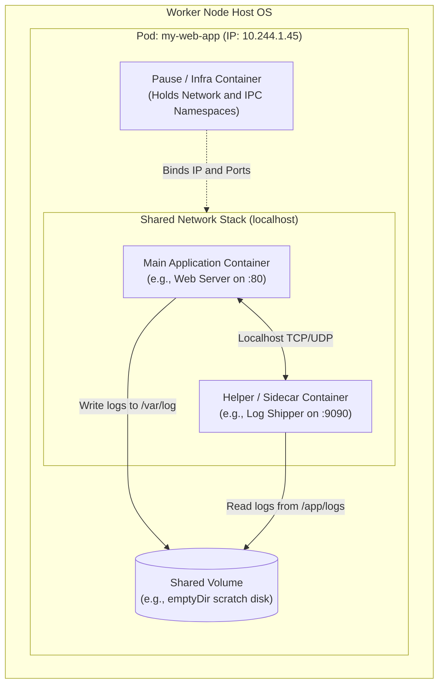
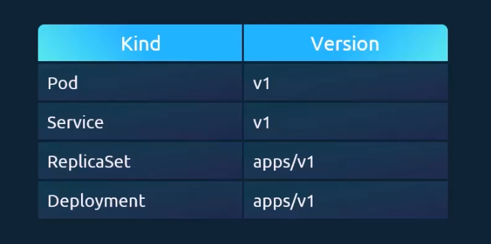
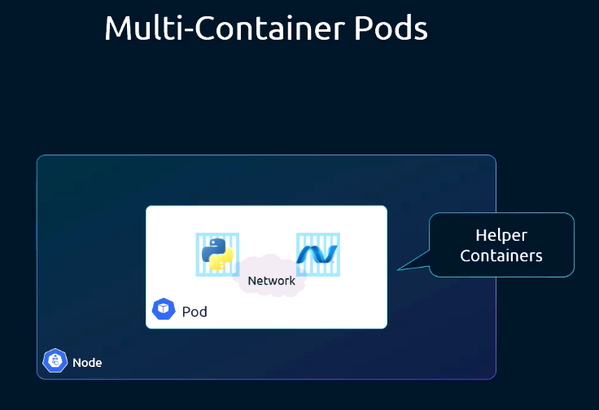
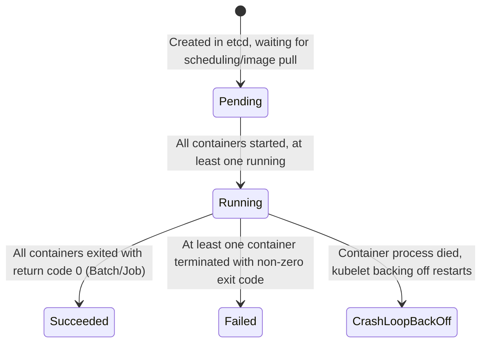
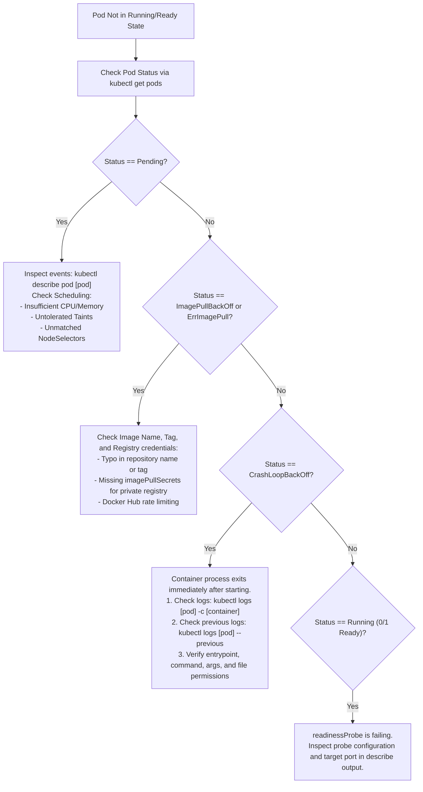

# Kubernetes Pods & Multi-Container Pods - CKA Exam Notes

> **Exam Domain**: Workloads & Scheduling (15%) / Cluster Architecture, Installation & Configuration (25%) / Troubleshooting (30%)  
> **Weight / Importance**: Fundamental / High  
> **Target Version**: Verified against v1.31 / v1.32 (Current CKA Curriculum)  
> **Allowed Docs Search Keywords**: `pod`, `pods`, `multi-container pod`, `init containers`, `sidecar containers`, `kubectl run`, `pod template`  
> **Source**: Generated from `pods-raw.md`

---

## 1. Quick-Reference Summary

- **Primary Role**: The smallest, most fundamental deployable unit in Kubernetes. Represents a single instance of a running application process, encapsulating one or more application containers, shared network context, and shared storage resources.
- **The 4 Root Manifest Keys**: Every Kubernetes object manifest requires four top-level keys:
  1. `apiVersion`: API group/version (`v1` for core Pods).
  2. `kind`: Object type (`Pod`).
  3. `metadata`: Object metadata dictionary (`name`, `labels`, `annotations`, `namespace`).
  4. `spec`: Resource specifications dictionary (`containers` list).
- **Atomicity & Placement**: All containers inside a single Pod are **co-located and co-scheduled** onto the exact same worker node. A Pod cannot span across multiple physical or virtual nodes.
- **Shared vs. Isolated Resources**:
  - **Shared**: Network namespace (same Pod IP, shared port space, inter-container communication via `localhost`), IPC namespace, and declared storage Volumes.
  - **Isolated**: Linux mount/filesystem namespaces (independent container images), cgroups (individual container CPU and memory resource requests/limits).
- **Horizontal Scaling Model**: Applications scale horizontally by adding **more Pod replicas**, not by adding identical duplicate application containers inside the same Pod (which causes network port binding collisions).
- **Multi-Container Pod Patterns**:
  - **Sidecar**: Enhances or extends the main container (e.g., log shippers like Fluentd, metrics scrapers, service mesh proxies).
  - **Adapter**: Standardizes and normalizes output, metrics, or formats across heterogeneous applications.
  - **Ambassador**: Acts as a local reverse proxy connecting the main application to external services (e.g., local database proxy).
  - **Init Containers**: Sequential pre-setup tasks that run to completion before application containers start.
- **Naked Pods vs. Controllers**: Running raw ("naked") Pods in production is strongly discouraged. Workloads should be managed by controllers (`Deployment`, `StatefulSet`, `DaemonSet`, `Job`) to guarantee automated healing, self-recovery, rolling updates, and replication.
- **Deployment Workflows**:
  - Declarative: `kubectl apply -f pod-definition.yaml` or `kubectl create -f pod-definition.yaml`.
  - Imperative: `kubectl run my-pod --image=nginx --dry-run=client -o yaml > pod.yaml`.
- **Viewing & Filtering**:
  - `kubectl get pods`: Lists pods in the current namespace.
  - `kubectl get pods -l <selector>`: Filters pods by label key-value pairs.
  - `kubectl describe pod <name>`: Deep inspection showing container state, conditions, IPs, and live events.
- **Container Runtime Truth**: In modern Kubernetes (v1.24+ following dockershim removal), Kubernetes commands CRI runtimes (e.g., `containerd` or `CRI-O`) to pull OCI-compliant images and run OCI containers.

---

## 2. Conceptual Overview & Mental Model

### Dual-Layer Architectural Understanding

- **Simple English Explanation (How It Works)**:
  - **The Container Isolation Problem**: Under standard Linux containerization, each container runs inside its own isolated namespaces (separate network stack, distinct loopback interface, separate IPC, and isolated filesystems). 
  - **The Need for Close Collaboration**: Often, an application architecture requires two tightly coupled processes to cooperate: for example, a web server writing log files to disk, and a secondary process that parses those files and transmits them to a centralized storage service. If these two processes are placed into entirely separate containers on different hosts, communication introduces network latency, security complexity, and volume synchronization overhead. Placing both processes into a single Docker image breaks process separation, confuses standard Unix process termination signals (`SIGTERM`), and mixes logging streams.
  - **The Kubernetes Solution**: Kubernetes resolves this by grouping containers into a **Pod**. The Pod is an architectural wrapper around Linux namespaces.
  - **The Underlying Mechanics (The Pause Container)**:
    When `kubelet` schedules a Pod onto a worker node, the container runtime first launches a tiny, low-overhead container known as the **infrastructure/pause container**.
    1. The pause container requests and holds the **Network** and **IPC** namespaces for the Pod from the host kernel.
    2. It configures a virtual ethernet pair (`veth`) and receives a unique IP address from the cluster's CNI network plugin.
    3. The actual workload containers (e.g., the web server and the log helper) are then launched inside the *exact same* network namespace as the pause container.
  - **The Concrete Consequences**:
    - **Localhost Communication**: Because all containers in the Pod share the network namespace, they can reach each other directly via `localhost:<port>`.
    - **Port Collisions**: Two containers in the same Pod cannot listen on the same TCP/UDP port (e.g., two web servers cannot both bind to `0.0.0.0:80`).
    - **Shared Volumes**: Declared Kubernetes storage volumes (such as an `emptyDir` scratch disk) can be mounted simultaneously into distinct filesystem directories inside each container, enabling high-speed local disk exchange.



- **Standard / Production Definition**:
  A Pod is the smallest deployable unit of computing that you can create and manage in Kubernetes. A Pod is a group of one or more containers, with shared storage and network resources, and a specification for how to run the containers. A Pod's contents are always co-located and co-scheduled, and run in a shared context.

---

## 3. Deep-Dive Technical Breakdown

### 3.1 Declarative Manifest Anatomy: The 4 Root Keys & `pod-definition.yaml`

Every declarative YAML manifest submitted to Kubernetes is structured around **four mandatory top-level keys**:

```
+-----------------------------------------------------------------------------------------+
|                               Kubernetes Manifest Structure                             |
+-----------------------------------------------------------------------------------------+
| 1. apiVersion: string  --> Defines API group and endpoint version (e.g., v1)            |
| 2. kind: string        --> Defines the resource schema type (e.g., Pod)                 |
| 3. metadata: dict      --> Object identification data (name, labels, namespace)        |
|    |-- name: string    --> DNS-compliant unique identifier (sibling of labels)          |
|    `-- labels: dict    --> Arbitrary string key-value pairs used for grouping/filtering |
| 4. spec: dict          --> Operational desired state specification                      |
|    `-- containers: [ ] --> List of container definition dictionaries (name, image)     |
+-----------------------------------------------------------------------------------------+
```

#### Annotated `pod-definition.yaml`
```yaml
# pod-definition.yaml
apiVersion: v1              # API Version: v1 for core Kubernetes workload objects like Pods
kind: Pod                   # Resource Kind: Identifies this manifest as a Pod object
metadata:                   # Metadata Dictionary: Data describing the object itself
  name: myapp-pod           # Pod Name: Unique identifier within the namespace (sibling to labels)
  labels:                   # Labels Dictionary: Key-value tags for query filtering and Service binding
    app: myapp              # Custom label key 'app' with value 'myapp'
    type: front-end         # Custom label key 'type' with value 'front-end'
spec:                       # Spec Dictionary: Defines the exact desired operational state
  containers:               # Containers List: A list of container maps to execute in the Pod
  - name: nginx-container   # Container Name: Unique name for this container within the Pod
    image: nginx            # Container Image: OCI image pulled from registry (Docker Hub / private)
```



> [!NOTE]
> **Resource Kind vs. API Version Mapping**:
> As illustrated in the mapping reference above:
> - **Core Objects**: `Pod` and `Service` reside in the core API group, represented as `apiVersion: v1`.
> - **Workload Controllers**: Higher-level controller abstractions such as `ReplicaSet` and `Deployment` reside in the applications group, represented as `apiVersion: apps/v1`.

> [!IMPORTANT]
> **YAML Structure Pitfall**:
> - `metadata` and `spec` are **dictionaries (key-value maps)**.
> - `metadata.labels` is a **dictionary**. `name` and `labels` are direct siblings under `metadata`.
> - `spec.containers` is a **list of dictionaries**. The dash (`- `) before `name:` indicates an item in that list.

---

### 3.2 Single-Container vs. Multi-Container Pods



#### 1. Single-Container Pods ("One-Container-Per-Pod")
The standard Kubernetes deployment pattern. In this model, the Pod acts as a direct wrapper around a single application container:
- Scaled by deploying additional Pod replicas across the cluster.
- Simplifies resource allocation (CPU/RAM requests and limits map directly to a single application process).

#### 2. Multi-Container Pods
Multiple containers are packaged together into a single Pod **only when they are tightly coupled and must share lifecycle, network, or storage**:
- **Lifecycle Coupling**: When the Pod is created, all regular containers are started concurrently. When the Pod is terminated, all containers receive `SIGTERM` concurrently.
- **Inter-Container Communication**: Containers talk across `localhost`.
- **Shared Storage**: Containers access the same directory using different volume mount paths:

```yaml
apiVersion: v1
kind: Pod
metadata:
  name: multi-container-example
spec:
  volumes:
  - name: shared-log-volume
    emptyDir: {}
  containers:
  - name: web-app
    image: nginx:alpine
    volumeMounts:
    - name: shared-log-volume
      mountPath: /var/log/nginx
  - name: log-collector
    image: busybox
    command: ["/bin/sh", "-c", "tail -n+1 -F /var/log/nginx/access.log"]
    volumeMounts:
    - name: shared-log-volume
      mountPath: /var/log/nginx
```

---

### 3.3 Classic Multi-Container Architectural Patterns

| Pattern | Purpose | Example Use Case |
| :--- | :--- | :--- |
| **Sidecar** | Augments or enhances the primary application container without modifying its code. | Log collector (Fluentd/Filebeat) tailing logs from a shared volume, local metrics exporter. |
| **Adapter** | Normalizes heterogeneous output or API formats into a standardized interface. | Transforming proprietary application monitoring logs into Prometheus-formatted metrics. |
| **Ambassador** | Proxies network connections on behalf of the application, abstracting network topology. | Local Redis/Database proxy routing queries to primary/read-replica instances outside the pod. |
| **Init Containers** | Specialized containers that execute sequentially to completion before app containers start. | Waiting for a database service to become reachable, downloading configuration files or certificates. |

> [!NOTE]
> **Native Sidecar Containers (Kubernetes v1.28+ / v1.29+ Standard)**:
> In modern Kubernetes, native sidecar containers are defined inside `initContainers` by adding `restartPolicy: Always`. Unlike standard init containers, native sidecars remain running for the entire lifetime of the Pod and shut down gracefully only after main containers terminate.

---

### 3.4 Pod Lifecycle & Container States



#### Pod Phases:
- **`Pending`**: Pod accepted by the cluster, but one or more containers are not yet running (e.g., unscheduled, downloading images).
- **`Running`**: Pod bound to a node, all containers created, and at least one container is currently executing or restarting.
- **`Succeeded`**: All containers terminated successfully (exit code `0`); will not restart (typical for Jobs).
- **`Failed`**: All containers terminated, with at least one container failing with non-zero exit status.
- **`Unknown`**: State cannot be obtained, typically due to communication failure between `kube-apiserver` and the node's `kubelet`.

#### Container States:
- **`Waiting`**: Still performing setup operations (e.g., `ImagePullBackOff`, `CrashLoopBackOff`).
- **`Running`**: Process is executing normally inside the container namespace.
- **`Terminated`**: Process finished execution or was killed.

---

## 4. Viewing & Inspecting Pods

On the CKA exam, speed and precision with `kubectl` pod inspection are vital:

### 4.1 Basic Listing & Label Filtering
```bash
# 1. List pods in default namespace
kubectl get pods

# 2. List pods displaying assigned labels
kubectl get pods --show-labels

# 3. Filter pods by label selector (matches pod-definition.yaml)
kubectl get pods -l app=myapp
kubectl get pods -l type=front-end
kubectl get pods -l 'app=myapp,type=front-end'

# 4. List pods with wide output (shows Pod IP and Assigned Node)
kubectl get pods -o wide

# 5. List pods across all cluster namespaces
kubectl get pods -A
```

---

### 4.2 Deep-Dive Inspection with `kubectl describe pod`

```bash
kubectl describe pod myapp-pod
```

`kubectl describe pod` queries the live API state and compiles an exhaustive diagnostic report:
- **Header & Placement**:
  - `Name`: `myapp-pod`
  - `Namespace`: `default`
  - `Node`: Hostname and internal IP of the assigned worker node.
  - `Status`: Current Pod phase (`Running`, `Pending`, etc.).
  - `IP`: Cluster network IP assigned to the Pod by CNI.
- **Metadata**:
  - `Labels`: `app=myapp`, `type=front-end`.
  - `Annotations`: Non-identifying metadata (e.g., build hashes or deployment notes).
- **Containers Section**:
  - Detailed state of each container: `State`, `Reason`, `Exit Code`, `Ready` (`True`/`False`), `Restart Count`.
  - Image reference and exact Image ID SHA digest.
  - Resource Requests & Limits (CPU/Memory).
  - Environment variables and Volume Mounts.
- **Conditions**:
  - `Initialized`: Init containers executed successfully.
  - `Ready`: All containers pass readiness checks and can receive Service traffic.
  - `ContainersReady`: All containers inside the pod are in ready state.
  - `PodScheduled`: Scheduler successfully placed the pod onto a node.
- **Events (Critical for CKA Troubleshooting)**:
  Chronological log at the bottom displaying scheduling decisions (`Scheduled`), image operations (`Pulling`, `Pulled`), container creations (`Created`), and container launches (`Started`), or failure events (`FailedScheduling`, `FailedCreatePodSandBox`, `BackOff`).

---

### 4.3 Inspecting Logs in Multi-Container Pods
```bash
# In a single-container pod
kubectl logs myapp-pod

# In a multi-container pod, you MUST specify the container name with -c
kubectl logs multi-container-example -c web-app

# View previous terminated instance logs (vital for debugging CrashLoopBackOff)
kubectl logs multi-container-example -c web-app --previous

# Stream logs in real-time
kubectl logs -f myapp-pod -c nginx-container
```

---

## 5. Command Translation & Operational Mapping Tables

### 5.1 The 4 Root Manifest Keys Architecture

| Root Key | Data Type | Purpose | Example from `pod-definition.yaml` |
| :--- | :--- | :--- | :--- |
| **`apiVersion`** | `string` | Identifies which API version schema validates the object. | `v1` |
| **`kind`** | `string` | Specifies the type of Kubernetes resource to instantiate. | `Pod` |
| **`metadata`** | `dictionary` | Unique identification, scoping, and organization tags. | `name: myapp-pod`, `labels: {app: myapp, type: front-end}` |
| **`spec`** | `dictionary` | Defines the desired state of the workload. | `containers: [{name: nginx-container, image: nginx}]` |

---

### 5.2 Deployment Workflows: Imperative vs. Declarative

| Method | Command Syntax | Behavior & CKA Use Case |
| :--- | :--- | :--- |
| **Imperative Run** | `kubectl run myapp-pod --image=nginx` | Immediately submits a raw Pod to the API. Fastest for quick tests. |
| **Imperative Create** | `kubectl create -f pod-definition.yaml` | Creates object from file. Fails with error if object already exists. |
| **Declarative Apply** | `kubectl apply -f pod-definition.yaml` | Idempotent. Creates object if missing; merges updates if already existing. |
| **Dry-Run Export** | `kubectl run myapp-pod --image=nginx --dry-run=client -o yaml > pod.yaml` | Generates a clean YAML file locally without sending API request. |

---

### 5.3 Shared vs. Isolated Namespaces in a Pod

| Linux Namespace / Resource | Scope | Operational Meaning |
| :--- | :--- | :--- |
| **Network Namespace** | **Shared** | All containers share the Pod IP, loopback, and port space (`localhost:<port>`). |
| **IPC Namespace** | **Shared** | Containers can communicate via POSIX shared memory or semaphores. |
| **Storage Volumes** | **Shared** | Containers mount common declared volumes into arbitrary local filesystem paths. |
| **Mount / Filesystem** | **Isolated** | Each container maintains its own isolated root filesystem (`/`) from its image. |
| **PID Namespace** | **Isolated by default** | Processes cannot see each other unless `shareProcessNamespace: true` is enabled in PodSpec. |
| **Control Groups (cgroups)** | **Isolated** | CPU and Memory requests/limits are enforced per individual container. |

---

## 6. High-Yield CLI & Imperative Commands

### 6.1 Creating and Managing Pods via YAML Manifests

```bash
# 1. Create a pod from a definition file
kubectl create -f pod-definition.yaml

# 2. Alternatively, apply declaratively (recommended for production updates)
kubectl apply -f pod-definition.yaml

# 3. View the created pod
kubectl get pods myapp-pod -o wide

# 4. View detailed status and events
kubectl describe pod myapp-pod
```

---

### 6.2 Essential Manifest Generation Shortcuts (Exam Critical)

```bash
# 1. Alias the dry-run flags for rapid typing in the exam shell
export do="--dry-run=client -o yaml"

# 2. Generate a standard Pod manifest instantly
kubectl run my-pod --image=nginx $do > pod.yaml

# 3. Generate a Pod with labels and exposed port
kubectl run web --image=nginx --port=80 -l "app=myapp,type=front-end" $do > pod.yaml

# 4. Generate a Pod with custom command and arguments
kubectl run busybox --image=busybox $do -- /bin/sh -c "sleep 3600" > sleep-pod.yaml

# 5. Launch a one-shot interactive container that cleans up after exit
kubectl run test-pod --image=busybox:1.36 -it --rm -- sh
```

---

### 6.3 Executing Commands Inside Multi-Container Pods

```bash
# 1. Execute an interactive shell inside a specific container
kubectl exec -it multi-container-example -c log-collector -- /bin/sh

# 2. Run a one-off diagnostic command inside a specific container
kubectl exec multi-container-example -c web-app -- ps aux

# 3. Test inter-container localhost connectivity
kubectl exec multi-container-example -c log-collector -- wget -qO- http://localhost:80
```

---

### 6.4 Force-Replacing Immutable Pod Definitions

Pods are mostly immutable after creation. If you must edit an immutable field (e.g., adding an environment variable or volume mount):

```bash
# 1. Export live pod YAML to disk
kubectl get pod myapp-pod -o yaml > myapp-pod.yaml

# 2. Modify myapp-pod.yaml using vim/nano

# 3. Force replace (deletes old pod and immediately creates new one)
kubectl replace --force -f myapp-pod.yaml
```

---

## 7. Troubleshooting & Diagnostic Runbook

### Decision Tree: Pod Failures & Crash Diagnoses



### Step-by-Step Triage Sequence

1. **Step 1: Check Pod Status & Restarts**:
   ```bash
   kubectl get pods -o wide
   ```
   Note the `STATUS` and `RESTARTS` count. A non-zero restart count indicates the container crashed and `kubelet` restarted it.

2. **Step 2: Inspect Kubernetes Events**:
   ```bash
   kubectl describe pod <pod-name>
   ```
   Scroll to the bottom. Events pinpoint:
   - `FailedScheduling`: Cluster has no eligible nodes for this Pod.
   - `FailedCreatePodSandBox`: CNI network plugin error or IP exhaustion.
   - `Failed`: Failed to pull container image or failed liveness check.

3. **Step 3: Check Container Standard Output / Errors**:
   ```bash
   # Check active logs
   kubectl logs <pod-name> -c <container-name>
   
   # Check logs of the crashed container instance that died earlier
   kubectl logs <pod-name> -c <container-name> --previous
   ```

4. **Step 4: Check Exit Code**:
   In `kubectl describe pod`, locate `Last State: Terminated`:
   - `Exit Code 0`: Completed successfully (normal for run-to-completion Jobs, but causes restart loops if running in a Deployment expecting a long-running daemon).
   - `Exit Code 1 / 255`: Application error / unhandled exception.
   - `Exit Code 137`: Process received `SIGKILL`—**Out of Memory (OOMKilled)**! The container exceeded its memory limit (`spec.containers[*].resources.limits.memory`).
   - `Exit Code 143`: Process received `SIGTERM`—graceful termination request.

---

## 8. CKA Exam Tips, Gotchas & Traps

> [!WARNING]
> **The Port Collision Trap in Multi-Container Pods**:
> If you configure two containers in the same Pod to listen on the same port (e.g., both containers specify `containerPort: 80`), the Pod will schedule and start, but the second container will crash with `bind: address already in use` because they share the same network namespace!

> [!IMPORTANT]
> **`kubectl create -f` vs. `kubectl apply -f`**:
> If a Pod already exists, running `kubectl create -f pod.yaml` will fail with an error:
> `Error from server (AlreadyExists): pods "myapp-pod" already exists`.
> In contrast, `kubectl apply -f pod.yaml` is declarative and idempotent—it updates mutable fields without failing.

> [!IMPORTANT]
> **Pod Immutability**:
> You cannot edit arbitrary Pod fields on the fly using `kubectl edit pod`. The only fields on an active Pod that can be updated in-place are:
> 1. `spec.containers[*].image`
> 2. `spec.initContainers[*].image`
> 3. `spec.activeDeadlineSeconds`
> 4. `spec.tolerations` (additions only)
> If an exam question requires changing environment variables, ports, or volumes on an existing Pod, you must delete and recreate it (or use `kubectl replace --force -f <file>`).

> [!TIP]
> **`kubectl run` vs. `kubectl create deployment`**:
> - `kubectl run my-pod --image=nginx` creates a **single naked Pod**.
> - `kubectl create deployment my-dep --image=nginx` creates a **Deployment** that manages underlying ReplicaSets and Pods.
> Read the exam question wording carefully: if it asks for a *Pod*, use `kubectl run`; if it asks for a *Deployment*, use `kubectl create deployment`.

---

## 9. Self-Test / Active Recall

Test your comprehension before clicking to reveal the solutions:

1. **What are the four mandatory top-level keys required in every Kubernetes object manifest?**
2. **In a Pod manifest, what is the syntactic relationship between `metadata.name` and `metadata.labels`?**
3. **What is the difference in YAML data types between `metadata` and `spec.containers`?**
4. **How do two containers within the same Pod communicate over network sockets?**
5. **If two containers in the same Pod attempt to bind to port 8080 on `0.0.0.0`, what happens?**
6. **What command allows you to view all Pods that have the label `app=myapp`?**
7. **What is the operational difference between `kubectl create -f pod.yaml` and `kubectl apply -f pod.yaml` if the pod already exists?**
8. **What section of `kubectl describe pod` displays chronological lifecycle logs from the scheduler, kubelet, and container runtime?**

<details>
<summary>Reveal Answers</summary>

1. **`apiVersion`**, **`kind`**, **`metadata`**, and **`spec`**.
2. They are **direct siblings** inside the `metadata` dictionary/object.
3. `metadata` is a **dictionary (key-value map)**, whereas `spec.containers` is a **list of dictionaries** (items prefixed with `- `).
4. Via the local loopback interface: **`localhost:<port>`**, because they share the same network namespace.
5. The first container will successfully bind to port 8080; the second container will fail to start and crash with `bind: address already in use`.
6. `kubectl get pods -l app=myapp` (or `kubectl get pods --selector app=myapp`).
7. `kubectl create -f` will fail with an `AlreadyExists` error; `kubectl apply -f` will idempotently merge updates without throwing an error.
8. The **`Events:`** section at the bottom of the output.
</details>

---

### Official Documentation Bookmarks

Allowed for reference during the live exam at [kubernetes.io/docs](https://kubernetes.io/docs/home/):

| Topic | Direct Search Term | Recommended Anchor |
| :--- | :--- | :--- |
| **Pods Overview** | `Pods` | Concepts > Workloads > Pods |
| **Pod Manifests & Templates** | `Pod Template` | Concepts > Workloads > Pods #pod-templates |
| **Multi-Container Pods** | `Communicating Between Containers` | Tasks > Access Applications in a Cluster > Communicate Between Containers in the Same Pod Using a Shared Volume |
| **Init Containers** | `Init Containers` | Concepts > Workloads > Pods > Init Containers |
| **Native Sidecar Containers** | `Sidecar Containers` | Concepts > Workloads > Pods > Sidecar Containers |
| **Pod Lifecycle & Container States** | `Pod Lifecycle` | Concepts > Workloads > Pods > Pod Lifecycle |
