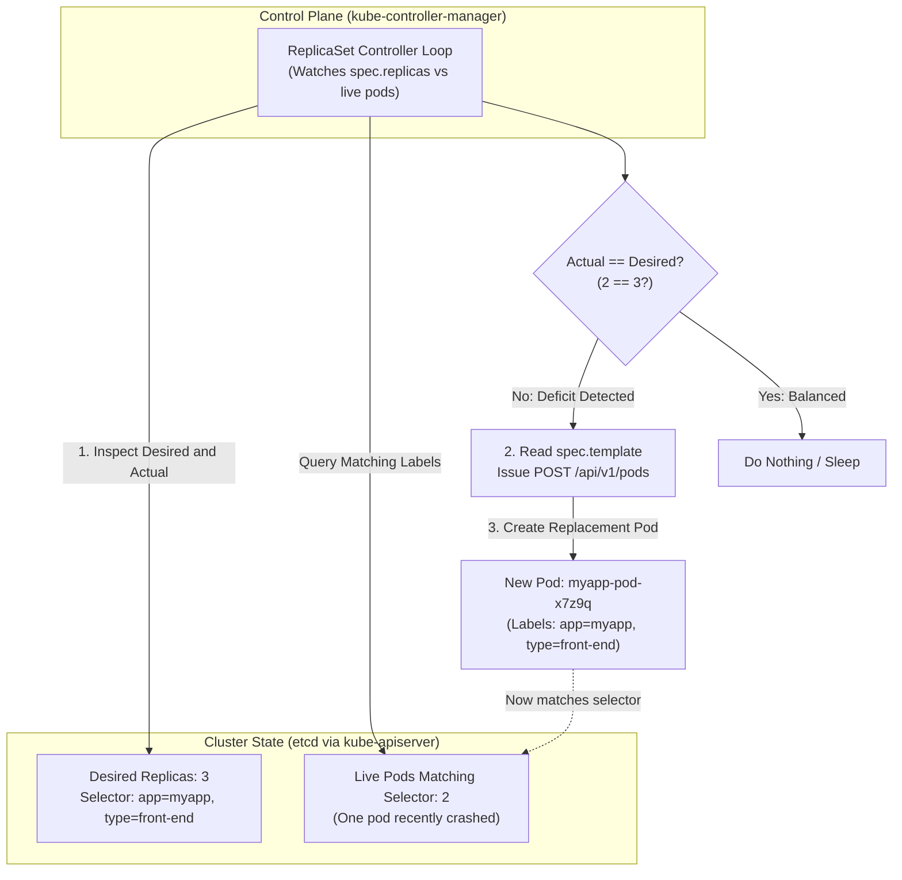
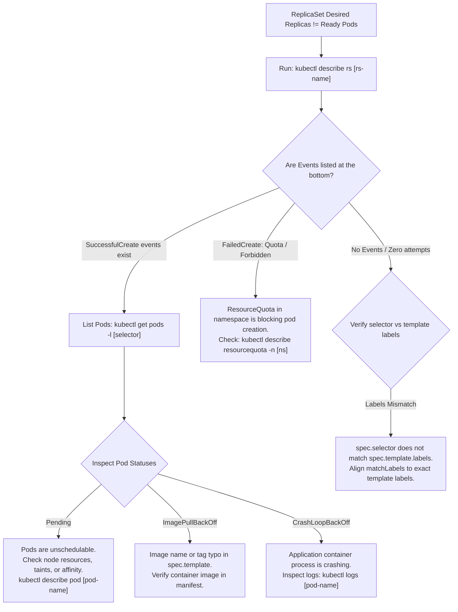

# Kubernetes ReplicaSets & ReplicationControllers - CKA Exam Notes

> **Exam Domain**: Workloads & Scheduling (15%) / Troubleshooting (30%)  
> **Weight / Importance**: High (Core workload controller and foundational building block for Deployments)  
> **Target Version**: Verified against v1.31 / v1.32 (Current CKA Curriculum)  
> **Allowed Docs Search Keywords**: `replicaset`, `replicationcontroller`, `labels and selectors`, `scale replicaset`  
> **Source**: Generated from `replica-sets-raw.md`

---

## 1. Quick-Reference Summary

- **Primary Role**: The core workload controller responsible for maintaining a stable, declared population of identical Pod replicas (`spec.replicas`) running at all times. If Pods crash, are terminated, or node hardware fails, the ReplicaSet controller detects the deficit and automatically launches replacements.
- **Generational Evolution**:
  - **`ReplicationController` (`apiVersion: v1`)**: Legacy generation. Supports only equality-based label selectors (`key: value`).
  - **`ReplicaSet` (`apiVersion: apps/v1`)**: Modern generation. Supports advanced set-based label selectors (`matchLabels` and `matchExpressions`). Supersedes ReplicationController.
- **The Mandatory Selector**: In a ReplicaSet, `spec.selector` is **mandatory**. Furthermore, `spec.selector.matchLabels` **must exactly match** the labels defined in `spec.template.metadata.labels`, or the API server will reject the manifest with a validation error.
- **Pod Adoption & Orphaning**: A ReplicaSet does not strictly "own" Pods by parent-child lineage. It discovers and manages any Pod in the namespace whose labels match its selector:
  - If matching Pods already exist before the ReplicaSet is created, the ReplicaSet **adopts** them into its replica count rather than creating duplicates.
  - If a managed Pod's labels are modified so they no longer match, the ReplicaSet **orphans** it and immediately provisions a new replacement Pod.
- **The Template Update Trap**: Modifying `spec.template` (such as changing the container image) on a running ReplicaSet **does not update or restart existing running Pods**. It only applies to future Pods created when existing ones are deleted or scaled up.
- **Production Standard (Deployments)**: In modern production Kubernetes, **never deploy raw ReplicaSets directly**. Always use a `Deployment` (`apiVersion: apps/v1`), which manages underlying ReplicaSets automatically to provide rolling updates, rollbacks, and declarative lifecycle management.

---

## 2. Conceptual Overview & Mental Model

### Dual-Layer Architectural Understanding

- **Simple English Explanation (How It Works)**:
  - **The Ephemeral Pod Problem**: An individual Kubernetes Pod is a mortal process. If the node hosting a standalone ("naked") Pod loses power or crashes, the Pod dies and is never recreated. If user traffic surges, a single Pod cannot scale across multiple machines.
  - **The Headcount Controller**: The `ReplicaSet` solves this by introducing automated state reconciliation. It is driven by the `kube-controller-manager` running in the control plane.
  - **The Reconciliation Control Loop**:
    The ReplicaSet controller continuously executes a three-step non-terminating loop:
    1. **Sense**: It queries `kube-apiserver` to count how many live Pods in the namespace currently carry labels matching its `spec.selector.matchLabels`.
    2. **Compare**: It evaluates the difference between the actual number of matching Pods and the desired count declared in `spec.replicas`.
    3. **Act**:
       - If **Actual < Desired** (e.g., 2 pods running, 3 desired): It reads its embedded `spec.template` and sends API requests to create new Pods.
       - If **Actual > Desired** (e.g., 4 pods running, 3 desired): It selects excess Pods and sends API deletion requests.
       - If **Actual == Desired**: It sleeps until the next sync period or state change event.
  - **Why Decouple Selectors from Templates?**: By separating the selector (`spec.selector`) from the Pod template (`spec.template`), the controller does not care *how* a Pod was originally launched. If an existing Pod with matching labels is already running, the controller incorporates it into its target headcount.



- **Standard / Production Definition**:
  A ReplicaSet is a core workload API resource whose purpose is to maintain a stable set of replica Pods running at any given time. It is defined with fields including a selector that specifies how to identify Pods it can acquire, a number of replicas indicating how many Pods it should be maintaining, and a pod template specifying the data of new Pods it should create to meet the number of replicas criteria.

---

## 3. Deep-Dive Technical Breakdown

### 3.1 Architectural Evolution: ReplicationController vs. ReplicaSet

| Feature Dimension | Legacy: `ReplicationController` | Modern: `ReplicaSet` |
| :--- | :--- | :--- |
| **API Version** | `v1` (Core API group) | `apps/v1` |
| **Kind** | `ReplicationController` | `ReplicaSet` |
| **Selector Syntax** | Equality-based only (`spec.selector`) | Set-based (`spec.selector.matchLabels` and `matchExpressions`) |
| **Selector Requirement** | Optional (defaults to template labels) | **Mandatory** (`spec.selector` must be explicitly defined) |
| **Parent Controller** | None (standalone legacy controller) | Managed automatically by `Deployment` objects |
| **Current Status** | Deprecated in practice (retained for backward compatibility) | Active Kubernetes standard |

---

### 3.2 Manifest Anatomy & Configurations

#### 1. Legacy ReplicationController Manifest (`rc-definition.yaml`)
```yaml
apiVersion: v1
kind: ReplicationController
metadata:
  name: myapp-rc
  labels:
    app: myapp
    type: front-end
spec:
  replicas: 3
  template:                     # Pod specification template
    metadata:
      name: myapp-pod
      labels:
        app: myapp
        type: front-end
    spec:
      containers:
      - name: nginx-container
        image: nginx
```

#### 2. Modern ReplicaSet Manifest (`replicaset-definition.yaml`)
```yaml
apiVersion: apps/v1             # Modern apps/v1 API group
kind: ReplicaSet
metadata:
  name: myapp-replicaset
  labels:
    app: myapp
    type: front-end
spec:
  replicas: 3                   # Desired number of concurrent pods
  selector:                     # Mandatory selector identifying managed pods
    matchLabels:
      type: front-end           # Must match template labels below
  template:                     # Pod template used when creating new pods
    metadata:
      name: myapp-pod
      labels:
        app: myapp
        type: front-end         # Evaluated by matchLabels above
    spec:
      containers:
      - name: nginx-container
        image: nginx
```

> [!IMPORTANT]
> **The Selector Validation Rule**:  
> In `apps/v1` ReplicaSets, `spec.selector.matchLabels` is strictly validated against `spec.template.metadata.labels`. If `matchLabels` specifies a label that is not present on the Pod template, `kube-apiserver` rejects the configuration with an error:
> `The ReplicaSet "myapp-replicaset" is invalid: spec.template.metadata.labels: Invalid value: ... selector does not match template labels`.

---

### 3.3 Advanced Label Matching: Set-Based Selectors

While `ReplicationController` only supported direct key-value equality (`type: front-end`), `ReplicaSet` supports powerful set-based expressions via `matchExpressions`:

```yaml
spec:
  replicas: 3
  selector:
    matchLabels:
      app: myapp
    matchExpressions:
      - key: tier
        operator: In
        values: [frontend, api]
      - key: environment
        operator: NotIn
        values: [legacy]
      - key: monitoring
        operator: Exists
```

#### Supported `matchExpressions` Operators:
- **`In`**: The label value must match one of the specified strings in `values`.
- **`NotIn`**: The label value must not match any of the strings in `values`.
- **`Exists`**: The Pod must possess the specified `key` (no `values` array required).
- **`DoesNotExist`**: The Pod must not possess the specified `key`.

---

### 3.4 Pod Adoption, Relabeling, and Lifecycle Dynamics

#### 1. Pod Adoption
If 2 standalone Pods with `labels: {type: front-end}` already exist in the namespace, and you execute `kubectl apply -f replicaset-definition.yaml` requesting 3 replicas:
1. The ReplicaSet controller lists all pods matching `type: front-end`.
2. It detects 2 matching pods and sets their `metadata.ownerReferences` to point to the ReplicaSet.
3. It creates only **1 new Pod** to fulfill the requirement of 3 replicas.

#### 2. Pod Relabeling (Debugging Technique)
Because the ReplicaSet controller only tracks pods matching its selector, altering a Pod's labels removes it from the ReplicaSet without killing the process:
```bash
# Relabel a pod to isolate it for debugging
kubectl label pod <pod-name> type=debug --overwrite
```
- The ReplicaSet immediately loses track of that pod (actual count drops from 3 to 2).
- The ReplicaSet immediately spawns a brand new Pod to bring the count back to 3.
- The isolated pod remains running, allowing you to attach a debugger or inspect logs in isolation without receiving live Service traffic.

#### 3. The Template Update Gotcha
If you edit `replicaset-definition.yaml` to change `image: nginx` to `image: nginx:1.21` and apply it:
```bash
kubectl apply -f replicaset-definition.yaml
```
- **Existing Pods are NOT restarted or updated!** They continue running the old `nginx` image.
- Only if you manually delete an existing Pod (`kubectl delete pod <name>`) will the ReplicaSet controller spin up a replacement using the new `nginx:1.21` image.
- *Production Solution*: This is why **Deployments** exist—Deployments manage progressive rolling updates between ReplicaSets automatically.

---

## 4. Command Translation & Operational Mapping Tables

### 4.1 Workload Controllers Comparison

| Dimension | `ReplicationController` | `ReplicaSet` | `Deployment` |
| :--- | :--- | :--- | :--- |
| **API Version** | `v1` | `apps/v1` | `apps/v1` |
| **Selector Model** | Equality-based | Set-based (`matchExpressions`) | Set-based (`matchExpressions`) |
| **Rolling Updates?** | No | No (manual pod deletion required) | **Yes (automated zero-downtime)** |
| **Rollback Support?** | No | No | **Yes (`kubectl rollout undo`)** |
| **Pause & Resume?** | No | No | **Yes (`kubectl rollout pause`)** |
| **Modern Best Practice** | Obsolete | Managed child object of Deployment | **Industry Standard** |

---

### 4.2 ReplicaSet Mutation & Scaling Methods

| Goal | Method / Command | Operational Effect |
| :--- | :--- | :--- |
| **Declarative Scaling** | Edit `replicas: 6` in YAML $\to$ `kubectl apply -f rs.yaml` | Idempotent; records changes in `last-applied-configuration`. |
| **Imperative CLI Scaling** | `kubectl scale rs myapp-replicaset --replicas=6` | Immediately scales live object; does not update local YAML. |
| **Interactive Live Edit** | `kubectl edit rs myapp-replicaset` | Opens live object in editor; takes effect immediately on save. |
| **Replace Entire Spec** | `kubectl replace -f rs.yaml` | Overwrites live spec; fails if `resourceVersion` conflicts. |
| **Cascade Delete** | `kubectl delete rs myapp-replicaset` | Deletes ReplicaSet **and all managed Pods** (default). |
| **Orphan Delete** | `kubectl delete rs myapp-replicaset --cascade=orphan` | Deletes the ReplicaSet controller but **leaves Pods running**. |

---

## 5. High-Yield CLI & Imperative Commands

### 5.1 Inspecting ReplicaSets and Managed Pods

```bash
# 1. List all ReplicaSets in the current namespace (shortcut: rs)
kubectl get replicaset
kubectl get rs

# 2. List ReplicaSets with wide output (shows current, desired, ready, and images)
kubectl get rs -o wide

# 3. View detailed status, selector, conditions, and creation events
kubectl describe rs myapp-replicaset

# 4. List all pods managed by this ReplicaSet's labels
kubectl get pods -l type=front-end --show-labels
```

---

### 5.2 Scaling Workloads

```bash
# 1. Scale an existing ReplicaSet imperatively
kubectl scale rs myapp-replicaset --replicas=5

# 2. Scale using the configuration file
kubectl scale --replicas=5 -f replicaset-definition.yaml

# 3. Verify that the additional pods are running
kubectl get pods -l type=front-end
```

---

### 5.3 Modifying and Replacing ReplicaSets

```bash
# 1. Interactively edit the ReplicaSet in vim/nano
kubectl edit rs myapp-replicaset

# 2. Replace the ReplicaSet with an updated YAML file
kubectl replace -f replicaset-definition.yaml

# 3. Force replace (destroys and recreates the ReplicaSet object)
kubectl replace --force -f replicaset-definition.yaml
```

---

### 5.4 Deletion Workflows (Cascade vs. Orphan)

```bash
# 1. Standard deletion: deletes the ReplicaSet AND all its running pods
kubectl delete rs myapp-replicaset

# 2. Orphan deletion: deletes ONLY the controller; pods remain running as naked pods
kubectl delete rs myapp-replicaset --cascade=orphan

# 3. Delete from file
kubectl delete -f replicaset-definition.yaml
```

---

## 6. Troubleshooting & Diagnostic Runbook

### Decision Tree: ReplicaSet Not Reaching Desired Pod Count



### Step-by-Step Triage Sequence

1. **Step 1: Compare Desired vs. Current vs. Ready**:
   ```bash
   kubectl get rs
   ```
   - `DESIRED`: Number of replicas requested in manifest.
   - `CURRENT`: Number of pods currently created by the controller.
   - `READY`: Number of pods passing readiness probes.
   - If `CURRENT < DESIRED`: The controller is failing to create pods (check Events in `describe rs`).
   - If `CURRENT == DESIRED` but `READY < CURRENT`: Pods are scheduled, but applications are failing health checks (check `kubectl describe pod`).

2. **Step 2: Inspect Controller Events**:
   ```bash
   kubectl describe rs <replicaset-name>
   ```
   Look at the `Events:` section. Common errors:
   - `FailedCreate: pods "..." is forbidden: failed quota`: Namespace ResourceQuota reached.
   - `FailedCreate: pods "..." is forbidden: exceeded quota: requests.cpu`: Container requests not specified.

3. **Step 3: Verify Label Selectors**:
   If pods exist but the ReplicaSet is ignoring them, check for a label mismatch:
   ```bash
   # View ReplicaSet selector
   kubectl get rs <rs-name> -o jsonpath='{.spec.selector.matchLabels}'
   
   # View Pod labels
   kubectl get pods --show-labels
   ```

---

## 7. CKA Exam Tips, Gotchas & Traps

> [!WARNING]
> **The Immutable Selector Trap**:
> Once a ReplicaSet is created, **its `spec.selector` field is completely immutable**! If you attempt to update `spec.selector.matchLabels` via `kubectl edit` or `kubectl apply`, the API server will reject the change. To modify a selector, you must delete the ReplicaSet and recreate it.

> [!IMPORTANT]
> **The Updating Image Gotcha**:
> If an exam question asks you to update the image of an existing ReplicaSet to `nginx:1.22`, updating the YAML and running `kubectl apply` will **NOT** update the existing running pods!
> You must run:
> ```bash
> kubectl delete pods -l <selector>
> ```
> This causes the ReplicaSet to spawn new replacement pods that pick up the newly specified image.

> [!TIP]
> **Creating ReplicaSets Fast in the Exam**:
> `kubectl` does not have a direct imperative command like `kubectl create replicaset`.
> To generate a ReplicaSet quickly:
> 1. Generate a Deployment YAML:
>    ```bash
>    kubectl create deployment my-rs --image=nginx --replicas=3 --dry-run=client -o yaml > rs.yaml
>    ```
> 2. Open `rs.yaml` and change `kind: Deployment` to `kind: ReplicaSet`.
> 3. Delete any Deployment-specific strategy blocks (if present) and apply:
>    ```bash
>    kubectl apply -f rs.yaml
>    ```

---

## 8. Self-Test / Active Recall

Test your comprehension before clicking to reveal the solutions:

1. **What is the primary technical difference between a `ReplicationController` and a `ReplicaSet`?**
2. **What occurs if you update the container image inside `spec.template` of an active, running ReplicaSet?**
3. **If 3 Pods with label `app=frontend` are already running, and you create a ReplicaSet with `replicas: 3` and `matchLabels: {app: frontend}`, how many new Pods will be created?**
4. **What happens if you delete a ReplicaSet using the `--cascade=orphan` flag?**
5. **Why will `kube-apiserver` reject a ReplicaSet manifest if `spec.selector.matchLabels` has `tier: web` but `spec.template.metadata.labels` has `tier: api`?**
6. **Which command imperatively scales a ReplicaSet named `worker-rs` to 8 replicas?**
7. **In modern Kubernetes production environments, why are workloads deployed using `Deployments` rather than directly as `ReplicaSets`?**

<details>
<summary>Reveal Answers</summary>

1. `ReplicationController` (`apiVersion: v1`) supports only equality-based selectors. `ReplicaSet` (`apiVersion: apps/v1`) supports both equality-based and set-based selectors (`matchExpressions` with `In`, `NotIn`, `Exists`, `DoesNotExist`).
2. **Nothing happens to the currently running Pods**. Existing Pods continue running the old image. The new image will only be used if existing Pods are deleted or if the ReplicaSet is scaled up.
3. **Zero new Pods**. The ReplicaSet adopts the 3 existing Pods because their labels match its selector, satisfying its desired count of 3.
4. The ReplicaSet controller object is deleted, but all of its managed Pods remain running in the cluster as standalone ("naked") Pods.
5. Because Kubernetes strictly validates that a ReplicaSet's selector matches its own Pod template. If they do not match, the ReplicaSet would immediately spawn Pods that it cannot manage, causing an infinite creation loop.
6. `kubectl scale rs worker-rs --replicas=8`.
7. Because Deployments manage ReplicaSets declaratively, enabling zero-downtime rolling updates, canary deployments, instant rollbacks (`kubectl rollout undo`), and revision history tracking.
</details>

---

### Official Documentation Bookmarks

Allowed for reference during the live exam at [kubernetes.io/docs](https://kubernetes.io/docs/home/):

| Topic | Direct Search Term | Recommended Anchor |
| :--- | :--- | :--- |
| **ReplicaSet Overview** | `ReplicaSet` | Concepts > Workloads > Workload Management > ReplicaSet |
| **ReplicationController** | `ReplicationController` | Concepts > Workloads > Workload Management > ReplicationController |
| **Labels and Selectors** | `Labels and Selectors` | Concepts > Overview > Working with Objects > Labels and Selectors |
| **Deployments vs. ReplicaSets** | `Deployments` | Concepts > Workloads > Workload Management > Deployments |
