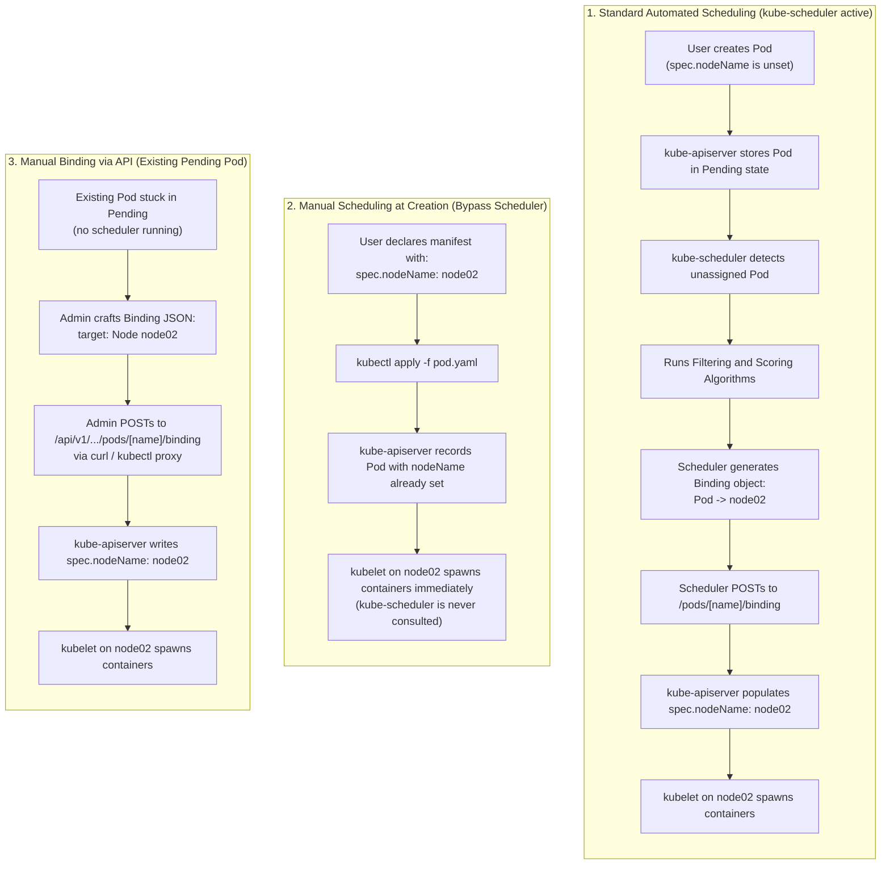
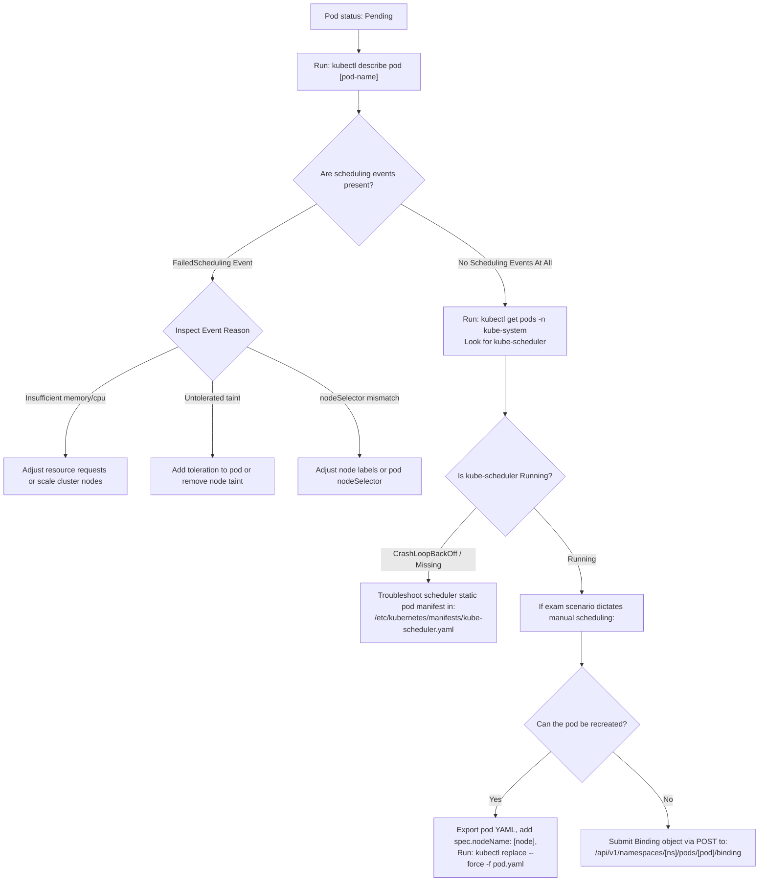

# Manual Pod Scheduling & the Binding API - CKA Exam Notes

> **Exam Domain**: Scheduling (15%) / Troubleshooting (30%)  
> **Weight / Importance**: High (Core scheduling troubleshooting technique tested when `kube-scheduler` is offline, broken, or when pods must bypass the scheduling queue)  
> **Target Version**: Verified against v1.31 / v1.32 (Current CKA Curriculum)  
> **Allowed Docs Search Keywords**: `Assigning Pods to Nodes`, `nodeName`, `Binding`, `manual scheduling`  
> **Source**: Generated from `scheduling/01-manual-scheduling-raw.md`

---

## 1. Quick-Reference Summary

- **The Scheduling Prerequisite (`nodeName`)**: Every Pod definition includes an optional field: `spec.nodeName`. When left empty (`""`, the default), the Pod enters the `Pending` phase awaiting assignment by `kube-scheduler`.
- **How `kube-scheduler` Operates**:
  - Continuously monitors `kube-apiserver` for Pods where `spec.nodeName` is unset.
  - Runs filtering (predicates) and scoring (priorities) algorithms across all cluster nodes.
  - Generates a **`Binding` object** (`kind: Binding`, `apiVersion: v1`) pointing the Pod to the winning node and submits it to the API server's `/binding` subresource.
- **Symptom of a Down/Missing Scheduler**:
  - Newly created Pods without an explicit `nodeName` remain indefinitely in the `Pending` status.
  - Running `kubectl get events` or `kubectl describe pod <name>` shows **no scheduling events**.
- **Method 1: Manual Scheduling at Creation Time (`spec.nodeName`)**:
  - Hardcode `spec.nodeName: <node-name>` in the Pod manifest before applying it.
  - **Completely bypasses `kube-scheduler`**: The Pod is written directly to `etcd` with the assignment already made. The target node's `kubelet` picks it up and runs it immediately.
- **The Immutability Constraint**:
  - `spec.nodeName` is **strictly immutable** on an existing, live Pod.
  - Running `kubectl edit pod` or `kubectl patch` to modify `spec.nodeName` is rejected by `kube-apiserver` with `spec: Forbidden`.
  - For existing pending pods, you must either:
    1. Extract, edit, and force-replace: `kubectl replace --force -f pod.yaml`.
    2. Submit a `Binding` object directly to the pod's REST API endpoint.
- **Method 2: Manual Scheduling via the `Binding` REST API**:
  - Used to schedule an existing `Pending` Pod **without deleting it**.
  - Construct a `Binding` JSON manifest and POST it to:
    ```http
    POST /api/v1/namespaces/<namespace>/pods/<pod-name>/binding
    ```

---

## 2. Conceptual Overview & Mental Model

### Dual-Layer Architectural Understanding

- **Simple English Explanation (How It Works)**:
  - **The Pod Placement Problem**:
    A Pod is not an active computing process on its own; it is simply a record in the `etcd` database specifying what containers should run. The worker node's `kubelet` only executes containers for Pods that are explicitly assigned to its specific hostname.
  - **The Role of the Automated Scheduler**:
    Under standard cluster operations, the `kube-scheduler` acts as a matching engine. It continuously watches the API server for newly created Pods that have no assigned node (`spec.nodeName == ""`). When it discovers one, it evaluates node capacity, node taints, affinities, and resource limits, picks the best node, and instructs `kube-apiserver` to bind the Pod to that node.
  - **What Manual Scheduling Does**:
    If the scheduler process is stopped, misconfigured, or crashed, the cluster cannot make automated placement decisions. Manual scheduling is the operational bypass:
    1. **Pre-Assignment**: If you know which node should host the workload, you explicitly write `nodeName: node01` directly into the Pod blueprint. `kube-apiserver` accepts this, and the scheduler never needs to inspect the Pod.
    2. **Post-Creation Binding**: If the Pod already exists in cluster memory and is stuck in `Pending`, you mimic what the scheduler does internally: you generate a `Binding` object and send an HTTP `POST` request directly to the Pod's binding subresource in `kube-apiserver`.



- **Standard / Production Definition**:
  - **Manual Node Assignment**: The direct assignment of a Pod to a specific cluster node by explicitly populating the `spec.nodeName` field. This bypasses the scheduler's filtration and priority calculation phases entirely, binding the workload directly to the target node's `kubelet` sync loop.
  - **Binding Subresource**: A specialized Kubernetes core API subresource (`/api/v1/namespaces/{namespace}/pods/{name}/binding`) that allows authorized actors (primarily `system:kube-scheduler`) to atomically associate an unscheduled Pod with an execution Node.

---

## 3. Deep-Dive Technical Breakdown

### 3.1 How Scheduling Operates Internally


Under normal circumstances, `kube-scheduler` executes a three-stage pipeline for every unassigned Pod:
1. **Queueing & Inspection**: The scheduler picks up Pods from its active scheduling queue where `spec.nodeName` is not set.
2. **Filtering (Predicates)**: It eliminates nodes that cannot support the Pod (e.g., node is out of memory/CPU, node has a taint without matching toleration, or node label does not match `nodeSelector`).
3. **Scoring (Priorities)**: It ranks remaining nodes based on resource balance, topology spread, and image locality.
4. **Binding**: The scheduler creates a `Binding` resource pointing the Pod to the highest-scoring node and transmits it to `kube-apiserver`.

---

### 3.2 Method 1: Specifying `nodeName` at Creation Time


When `kube-scheduler` is completely absent or non-functional:
- Pods submitted without `nodeName` show `0/1 Pending` indefinitely.
- Pods submitted with `spec.nodeName: node02` immediately enter `1/1 Running` on `node02`.

#### Example Manifest (`pod-with-nodename.yaml`):
```yaml
apiVersion: v1
kind: Pod
metadata:
  name: nginx-manual
  labels:
    app: web
spec:
  nodeName: node02
  containers:
  - name: nginx
    image: nginx
    ports:
    - containerPort: 8080
```

#### Why You Cannot Edit `nodeName` on a Live Pod:
The Kubernetes API admission handler marks `spec.nodeName` as **immutable** once written. If a Pod was submitted without `nodeName`, attempting:
```bash
kubectl edit pod nginx
# Adding 'nodeName: node02' under spec
```
results in immediate rejection:
```text
error: pods "nginx" was not valid:
* spec: Forbidden: pod updates may not change fields other than `spec.containers[*].image`, ...
```

---

### 3.3 Method 2: Manually Binding an Existing Pod via the REST API


When an existing Pod is already in the `Pending` state and the exam or production scenario forbids recreating or deleting the Pod, you must simulate the scheduler by submitting a `Binding` object.

#### 1. The `Binding` Manifest (`binding-def.yaml`)
```yaml
apiVersion: v1
kind: Binding
metadata:
  name: nginx
  namespace: default
target:
  apiVersion: v1
  kind: Node
  name: node02
```

#### 2. Convert Manifest to JSON
The Kubernetes API endpoint for binding expects a minified JSON payload:
```json
{
  "apiVersion": "v1",
  "kind": "Binding",
  "metadata": {
    "name": "nginx",
    "namespace": "default"
  },
  "target": {
    "apiVersion": "v1",
    "kind": "Node",
    "name": "node02"
  }
}
```

#### 3. Submit the Binding via HTTP POST
Because `kube-apiserver` requires TLS authentication, the easiest way to interact with the raw API in a shell environment is using `kubectl proxy`:

```bash
# Step 1: Open an authenticated local proxy in the background
kubectl proxy &

# Step 2: Send the POST request to the pod's binding subresource
curl -s -X POST \
  http://127.0.0.1:8001/api/v1/namespaces/default/pods/nginx/binding \
  -H "Content-Type: application/json" \
  --data @binding.json
```

#### Verification:
Upon successful binding, `kube-apiserver` returns HTTP `201 Created`, sets `spec.nodeName: node02`, and the node's `kubelet` launches the containers:
```bash
kubectl get pod nginx -o wide
# Outputs: NAME: nginx | STATUS: Running | NODE: node02
```

---

## 4. Declarative Manifests & Scaffolding Patterns

### Scaffolding a Pod with Hardcoded `nodeName`

```bash
# Imperatively scaffold baseline pod manifest
kubectl run test-pod --image=nginx --dry-run=client -o yaml > pod.yaml
```

Inject `nodeName` under `spec`:
```yaml
apiVersion: v1
kind: Pod
metadata:
  name: test-pod
spec:
  nodeName: worker-node-1    # <--- Direct assignment
  containers:
  - name: test-pod
    image: nginx
```

Apply to cluster:
```bash
kubectl apply -f pod.yaml
```

---

## 5. Command Translation & Operational Mapping Tables

### Comparison of Node Assignment Mechanisms

| Method | Syntax Location | Requires Scheduler? | Modifiable on Live Pod? | Filtering / Constraint Checking | Recommended CKA Use Case |
| :--- | :--- | :--- | :--- | :--- | :--- |
| **`spec.nodeName`** | Pod manifest `spec` | **NO** (Bypasses scheduler) | **NO** (Immutable) | None (Bypasses resource and taint checks) | Scheduler is down; force assignment onto a specific node. |
| **Binding Subresource** | HTTP `POST` to `/binding` | **NO** (Mimics scheduler) | **YES** (Assigns live pending pod) | None (Direct assignment) | Existing pending pod must be scheduled without deletion. |
| **`spec.nodeSelector`** | Pod manifest `spec` | **YES** | **NO** | Exact key-value label match | Simple scheduling to a tier or group of nodes. |
| **`spec.affinity.nodeAffinity`** | Pod manifest `spec` | **YES** | **NO** | Complex expressions (`In`, `NotIn`, preferred/required) | Production policy scheduling (e.g., spread, hardware flags). |

---

## 6. High-Yield CLI & Verification Commands

```bash
# 1. Discover all cluster nodes and their exact hostnames
kubectl get nodes

# 2. Check if kube-scheduler is running in the cluster
kubectl get pods -n kube-system -l component=kube-scheduler

# 3. Check for pods stuck in Pending state across all namespaces
kubectl get pods -A --field-selector=status.phase=Pending

# 4. Extract an existing pending pod, inject nodeName, and force-replace it
kubectl get pod web-app -o yaml > web-app.yaml
# Edit web-app.yaml to add 'nodeName: node01' under spec
kubectl replace --force -f web-app.yaml

# 5. One-liner to manually bind a pending pod using curl and kubectl proxy
kubectl proxy --port=8001 &
curl -s -X POST \
  http://localhost:8001/api/v1/namespaces/default/pods/my-pod/binding \
  -H "Content-Type: application/json" \
  -d '{"apiVersion":"v1","kind":"Binding","metadata":{"name":"my-pod"},"target":{"apiVersion":"v1","kind":"Node","name":"node01"}}'
kill %1

# 6. Verify which node the pod is scheduled on
kubectl get pod my-pod -o jsonpath='{.spec.nodeName}'
```

---

## 7. Troubleshooting & Diagnostic Runbook

### Decision Tree: Resolving Pods Stuck in `Pending`



### Step-by-Step Triage Sequence

1. **Verify if `kube-scheduler` is Active**:
   ```bash
   kubectl get pods -n kube-system | grep scheduler
   ```
   If no scheduler pod exists, or if it is in `CrashLoopBackOff` (often caused by an invalid flag or broken kubeconfig path in `/etc/kubernetes/manifests/kube-scheduler.yaml`), newly created Pods cannot be scheduled automatically.

2. **Verify Target Node Readiness**:
   Before manually assigning a Pod to a node, ensure the node is in `Ready` state:
   ```bash
   kubectl get nodes
   ```
   If the node is `NotReady`, the `kubelet` on that node will not be able to pull images or launch containers.

3. **Check for Node Taints (`NoExecute`)**:
   `spec.nodeName` bypasses the scheduler, meaning `NoSchedule` taints will not prevent the Pod from being scheduled. However, if the node has a `NoExecute` taint and the Pod lacks a matching toleration, `kubelet` or the node lifecycle controller will evict the Pod immediately after placement. Verify taints with:
   ```bash
   kubectl describe node <node-name> | grep -i taints
   ```

---

## 8. CKA Exam Tips, Gotchas & Traps

> [!WARNING]
> **The Case-Sensitivity Trap with Node Names**:
> Node names in `spec.nodeName` are strictly case-sensitive and must match the exact string returned by `kubectl get nodes`. Setting `spec.nodeName: Node01` when the node is registered as `node01` will cause the Pod to hang indefinitely in `Pending`, as no `kubelet` will claim ownership of the Pod.

> [!IMPORTANT]
> **The In-Place `kubectl edit` Trap on `nodeName`**:
> If an exam question asks: *"Pod custom-app is pending; schedule it onto node01"*, do not attempt `kubectl edit pod custom-app` to add `nodeName`. The API server will reject the edit because `spec.nodeName` is immutable. You must use `kubectl get pod custom-app -o yaml > app.yaml`, edit the file, and run `kubectl replace --force -f app.yaml`.

> [!TIP]
> **How to Spot a "Broken Scheduler" Question**:
> If you start a question and find multiple pods in `Pending` state, immediately run:
> ```bash
> kubectl get pods -n kube-system
> ```
> If `kube-scheduler-controlplane` is missing or restarting, inspect `/etc/kubernetes/manifests/kube-scheduler.yaml` for syntax errors or bad file paths, or check if the prompt explicitly requires manual assignment.

---

## 9. Self-Test / Active Recall

1. **What field in the Pod specification determines which node will run the Pod?**
2. **What happens to newly created Pods if the `kube-scheduler` static pod fails to start on the control plane?**
3. **Can you edit `spec.nodeName` on an already-running or pending Pod using `kubectl edit`? Why or why not?**
4. **How does `spec.nodeName` differ from `spec.nodeSelector` in terms of scheduler involvement?**
5. **What API subresource does `kube-scheduler` call to bind a Pod to a Node?**
6. **If you assign a Pod to a node using `spec.nodeName`, will the Pod run on a node with a `NoSchedule` taint?**
7. **What is the fastest way during the CKA exam to reschedule an existing pending Pod to `node01` if deletion and recreation is permitted?**

<details>
<summary>Reveal Answers</summary>

1. `spec.nodeName`.
2. They remain in the `Pending` state indefinitely, with no scheduling events recorded.
3. No. `spec.nodeName` is immutable once the Pod object is recorded in `etcd`. Modifications trigger an HTTP 422 `spec: Forbidden` rejection.
4. `spec.nodeName` bypasses `kube-scheduler` entirely and pins directly to a specific hostname. `spec.nodeSelector` requires `kube-scheduler` to evaluate node labels against the selector rules.
5. `/api/v1/namespaces/{namespace}/pods/{pod-name}/binding`.
6. Yes. Bypassing the scheduler means `NoSchedule` taints are ignored during placement (though `NoExecute` taints can still trigger eviction if untolerated).
7. `kubectl get pod <pod> -o yaml > pod.yaml` -> add `nodeName: node01` under `spec` -> `kubectl replace --force -f pod.yaml`.
</details>

---

### Official Documentation Bookmarks

Allowed for reference during the live exam at [kubernetes.io/docs](https://kubernetes.io/docs/home/):

| Topic | Direct Search Term | Recommended Anchor |
| :--- | :--- | :--- |
| **Assigning Pods to Nodes** | `Assigning Pods to Nodes` | Concepts > Scheduling, Preemption and Eviction > Assigning Pods to Nodes |
| **NodeName Reference** | `nodeName` | Concepts > Scheduling > Assigning Pods to Nodes > nodename |
| **Kubernetes Scheduler** | `kube-scheduler` | Reference > Command-Line Tools > kube-scheduler |
| **Pod Binding API** | `Binding` | Reference > Kubernetes API > Workload Resources > Binding v1 |
