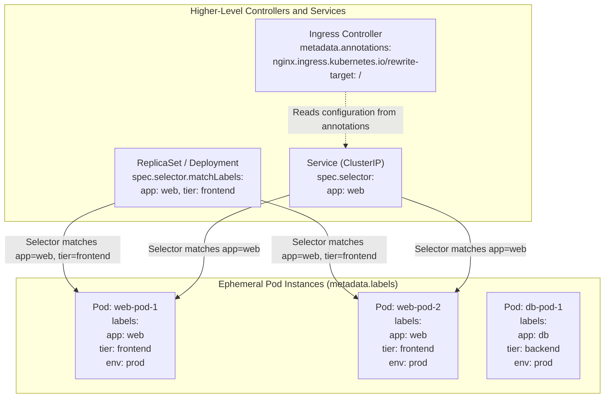
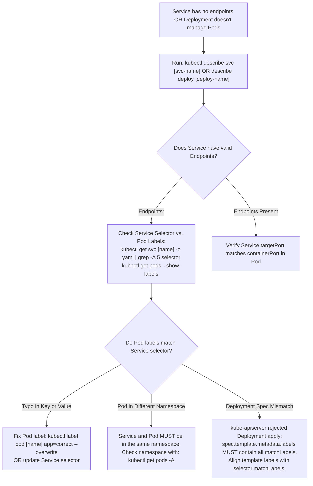

# Kubernetes Labels, Selectors & Annotations - CKA Exam Notes

> **Exam Domain**: Scheduling (15%) / Core Concepts (15%) / Troubleshooting (30%)  
> **Weight / Importance**: Essential (Labels and selectors are the foundational grouping and routing mechanism across Pods, Services, Deployments, and NetworkPolicies)  
> **Target Version**: Verified against v1.31 / v1.32 (Current CKA Curriculum)  
> **Allowed Docs Search Keywords**: `Labels and Selectors`, `Annotations`, `kubectl label`, `kubectl annotate`, `matchLabels`  
> **Source**: Generated from `scheduling/02-lables-and-selectors-raw.md`

---

## 1. Quick-Reference Summary

- **Primary Role of Labels**: Key-value pairs attached to Kubernetes objects (`metadata.labels`) that identify, organize, and categorize resources into meaningful groups.
- **Primary Role of Selectors**: Query expressions used by operators, CLI commands, and control plane controllers to filter and bind to subsets of labeled objects.
- **Two Selector Paradigms**:
  1. **Equality-Based**: Supports `=`, `==`, `!=` (used in CLI `-l` and Service `spec.selector`).
  2. **Set-Based**: Supports `in`, `notin`, `exists`, `doesnotexist` (used in CLI `-l` and Deployment/ReplicaSet `spec.selector.matchExpressions`).
- **Core Controller-to-Workload Contract**:
  - In a `ReplicaSet` or `Deployment`, the labels defined under `spec.template.metadata.labels` **must satisfy all key-value pairs** declared in `spec.selector.matchLabels`. If they do not match, `kube-apiserver` rejects the manifest at admission.
- **Service-to-Pod Routing**:
  - A Service routes traffic exclusively to Pods whose `metadata.labels` match the Service's `spec.selector`. Matching Pods populate the Service's `Endpoints` / `EndpointSlices`.
- **Imperative CLI Operations**:
  - Add label: `kubectl label pod <name> env=prod`
  - Overwrite label: `kubectl label pod <name> env=uat --overwrite`
  - Remove label: `kubectl label pod <name> env-` (append a trailing hyphen `-`)
  - Filter resources: `kubectl get pods -l env=prod,tier=frontend`
  - Set-based filter: `kubectl get pods -l 'env in (prod, stage)'`
  - Show all labels: `kubectl get pods --show-labels`
  - Label as column: `kubectl get pods -L env,tier`
- **Annotations (`metadata.annotations`)**:
  - Non-identifying key-value metadata used to store tool metadata, build IDs, release timestamps, or controller configurations (e.g., Ingress rewrite rules, sidecar injection directives).
  - **Not indexed for querying**: You cannot filter objects using annotations (`kubectl get pods -l` only works on labels).

---

## 2. Conceptual Overview & Mental Model

### Dual-Layer Architectural Understanding

- **Simple English Explanation (How It Works)**:
  - **The Loose Coupling Architecture**:
    In a Kubernetes cluster, higher-level resources (such as `Services`, `Deployments`, `ReplicaSets`, and `NetworkPolicies`) do not maintain static arrays of hardcoded Pod names or IP addresses. Because Pods are ephemeral and frequently recreated with new names and IP addresses, hardcoding direct references would cause immediate system failure.
  - **How Labels and Selectors Solve Dynamic Membership**:
    Instead of hardcoded relationships, Kubernetes uses a pub/sub matching model:
    1. A Pod advertises its operational attributes by defining key-value pairs in its `metadata.labels` dictionary (e.g., `app: web`, `tier: frontend`, `env: prod`).
    2. A controller (e.g., a `ReplicaSet`) declares a filter expression in its `spec.selector` (e.g., "manage all Pods where `app == web`").
    3. The Kubernetes API server indexes these labels in memory. Whenever a controller needs to count active replicas, or whenever a Service routes incoming HTTP traffic, it executes a selector query against the indexed labels. Any Pod that possesses the matching labels is dynamically incorporated into the workload pool.
  - **Labels vs. Annotations**:
    - **Labels are for identification and selection**: They are indexed by the API server and intended to group resources. They have strict size limits (max 63 characters for keys and values) to ensure query performance.
    - **Annotations are for non-identifying metadata**: They are not indexed and cannot be queried via selectors. They carry structured or unstructured configuration payloads for external tools, continuous delivery pipelines, or third-party controllers (such as Ingress annotations or Git commit hashes).



- **Standard / Production Definition**:
  - **Labels**: Structured key-value string pairs attached to the metadata of Kubernetes API resources. Labels are indexed by the API server database (`etcd`) to enable multi-dimensional object grouping, selection, and controller reconciliation loops without explicit hierarchical coupling.
  - **Label Selectors**: Query primitives that support equality-based and set-based filtering operations against resource labels. Selectors serve as the fundamental binding mechanism linking autonomous controllers (`Deployments`, `DaemonSets`, `StatefulSets`, `Services`) to target Pod instances.
  - **Annotations**: Unindexed metadata key-value mappings stored within an object's metadata record. Designed to store arbitrary structured or unstructured operational data consumed by client tooling, CI/CD systems, and admission webhooks without polluting the indexed label namespace.

---

## 3. Deep-Dive Technical Breakdown

### 3.1 Label Syntax and Validation Constraints

Because labels are indexed in memory by the API server, Kubernetes enforces strict character sets and length boundaries:

#### 1. Label Keys
A label key consists of two parts: an **optional prefix** and a **mandatory name**, separated by a slash (`/`):
```text
[prefix/]name
```
- **Name Segment**:
  - Maximum 63 characters.
  - Must begin and end with an alphanumeric character (`[a-z0-9A-Z]`).
  - May contain dashes (`-`), underscores (`_`), dots (`.`), and alphanumerics.
- **Prefix Segment** (Optional):
  - Must be a valid DNS 1123 subdomain (e.g., `kubernetes.io/`, `app.company.com/`).
  - Maximum 253 characters.
  - Prefixes ending in `kubernetes.io/` and `k8s.io/` are reserved for core Kubernetes components.

#### 2. Label Values
- Maximum 63 characters.
- Must begin and end with an alphanumeric character (`[a-z0-9A-Z]`).
- May contain dashes (`-`), underscores (`_`), dots (`.`), and alphanumerics, or may be left empty (`""`).

---

### 3.2 Equality-Based vs. Set-Based Selectors

Kubernetes provides two distinct querying syntaxes:

| Selector Type | Supported Operators | Evaluated In | Syntax Example (YAML / CLI) |
| :--- | :--- | :--- | :--- |
| **Equality-Based** | `=`, `==`, `!=` | `kubectl -l`, Services, ReplicationControllers | CLI: `kubectl get pods -l env=prod,tier=frontend`<br/>YAML: `spec.selector: { app: webapp }` |
| **Set-Based** | `in`, `notin`, `exists`, `doesnotexist` | `kubectl -l`, Deployments, ReplicaSets, NetworkPolicies | CLI: `kubectl get pods -l 'env in (prod, stage)'`<br/>YAML: `matchExpressions` (see below) |

#### Set-Based Manifest Example (`matchExpressions`):
```yaml
apiVersion: apps/v1
kind: Deployment
metadata:
  name: complex-filter-deploy
spec:
  replicas: 3
  selector:
    matchLabels:
      app: core-app
    matchExpressions:
    - key: environment
      operator: In
      values: [production, staging]
    - key: tier
      operator: NotIn
      values: [legacy]
    - key: monitoring
      operator: Exists
  template:
    metadata:
      labels:
        app: core-app
        environment: production
        monitoring: enabled
    spec:
      containers:
      - name: app
        image: nginx
```

---

### 3.3 The Controller-to-Pod Match Contract

In any controller manifest that spawns Pods (e.g., `ReplicaSet`, `Deployment`, `DaemonSet`), there are three distinct places where `labels` appear:

```yaml
apiVersion: apps/v1
kind: ReplicaSet
metadata:
  name: myapp-replicaset
  labels:                  # 1. Labels identifying the ReplicaSet itself (Arbitrary)
    app: myapp
    tier: controller
spec:
  replicas: 3
  selector:                # 2. Selector defining which Pods the ReplicaSet manages
    matchLabels:
      type: front-end      # <-- MUST MATCH Pod template labels
  template:
    metadata:
      name: myapp-pod
      labels:              # 3. Labels stamped onto every Pod created by this controller
        app: myapp
        type: front-end    # <-- MUST SATISFY the selector above!
    spec:
      containers:
      - name: nginx-container
        image: nginx
```

> [!CRITICAL]
> The labels under `spec.template.metadata.labels` **must be a superset** of the labels declared in `spec.selector.matchLabels`. If `spec.selector.matchLabels` specifies `type: front-end`, but the Pod template labels omit `type: front-end`, `kube-apiserver` rejects the object creation with a schema validation error.

---

### 3.4 Labels vs. Annotations

| Characteristic | Labels (`metadata.labels`) | Annotations (`metadata.annotations`) |
| :--- | :--- | :--- |
| **Primary Purpose** | Identifying and selecting subsets of objects | Storing non-identifying, arbitrary metadata and tool configs |
| **Indexed by API Server?** | **YES** (Optimized for in-memory querying) | **NO** (Not queryable via index) |
| **Selectable via CLI `-l`?** | **YES** (`kubectl get pods -l env=prod`) | **NO** (Cannot filter by annotations) |
| **Max String Length** | 63 characters per key/value | No 63-char limit; can hold large JSON blobs (up to object size limit) |
| **Target Consumers** | Operators, Deployments, Services, Schedulers | CI/CD systems, Ingress controllers, Monitoring agents, humans |
| **Example Values** | `app: web`, `tier: frontend`, `env: prod` | `git-commit: 8f4a12c`, `contact: devops@example.com` |

---

## 4. Declarative Manifests & Scaffolding Patterns

### Service Exposing Pods via Label Matching

#### Pod Manifest (`pod.yaml`):
```yaml
apiVersion: v1
kind: Pod
metadata:
  name: simple-webapp
  labels:
    app: webapp-app1
    function: front-end
spec:
  containers:
  - name: simple-webapp
    image: kodekloud/webapp-color
    ports:
    - containerPort: 8080
```

#### Service Manifest (`service.yaml`):
```yaml
apiVersion: v1
kind: Service
metadata:
  name: webapp-service
spec:
  type: ClusterIP
  ports:
  - port: 80
    targetPort: 8080
  selector:
    # Matches the labels declared in the pod above:
    app: webapp-app1
    function: front-end
```

---

## 5. Command Translation & Operational Mapping Tables

### Label Manipulation Command Reference

| Action | Command Syntax | Notes |
| :--- | :--- | :--- |
| **Add Label to Pod** | `kubectl label pod <name> key=value` | Fails if `key` already exists on the resource. |
| **Overwrite Existing Label** | `kubectl label pod <name> key=newvalue --overwrite` | Required whenever modifying an existing label value. |
| **Remove Label from Pod** | `kubectl label pod <name> key-` | Appending a trailing hyphen (`-`) removes the key. |
| **Label All Pods in Namespace** | `kubectl label pods --all env=prod` | Applies the label to every pod in the current namespace. |
| **Add Annotation** | `kubectl annotate pod <name> key="value"` | Stores unindexed metadata. |
| **Overwrite Annotation** | `kubectl annotate pod <name> key="newvalue" --overwrite` | Overwrites existing annotation value. |
| **Remove Annotation** | `kubectl annotate pod <name> key-` | Trailing hyphen removes the annotation. |
| **Filter by Single Equality** | `kubectl get pods -l key=value` | Equivalent to `--selector key=value`. |
| **Filter by Multiple Labels** | `kubectl get pods -l key1=val1,key2=val2` | Logical `AND` across all comma-separated selectors. |
| **Filter by Set Inclusion** | `kubectl get pods -l 'env in (prod, uat)'` | Must be enclosed in single quotes in bash. |
| **Filter by Key Existence** | `kubectl get pods -l env` | Matches any resource containing key `env` regardless of value. |
| **Filter by Key Absence** | `kubectl get pods -l '!env'` | Matches resources that do NOT have the `env` label key. |
| **Display Labels as Columns** | `kubectl get pods -L env,tier` | Promotes specified label values into dedicated table columns. |
| **Display All Labels** | `kubectl get pods --show-labels` | Appends a `LABELS` column displaying all key-value pairs. |

---

## 6. High-Yield CLI & Imperative Commands

```bash
# 1. Filter all resources matching multiple label selectors
kubectl get all --selector env=prod,bu=finance,tier=frontend

# 2. Add an environment label to an existing pod
kubectl label pod nginx-web env=production

# 3. Update an existing label value using --overwrite
kubectl label pod nginx-web env=staging --overwrite

# 4. Remove the label completely using the trailing minus
kubectl label pod nginx-web env-

# 5. List all pods and show their labels
kubectl get pods --show-labels

# 6. List pods and display 'tier' and 'app' as dedicated output columns
kubectl get pods -L tier,app

# 7. Select pods where env is either prod or stage, and tier is NOT backend
kubectl get pods -l 'env in (prod, stage),tier!=backend'

# 8. Add build and team metadata using annotations
kubectl annotate pod nginx-web build.version="v2.4.1" team.owner="infra-team"

# 9. Verify annotations on a pod
kubectl get pod nginx-web -o jsonpath='{.metadata.annotations}' | jq .
```

---

## 7. Troubleshooting & Diagnostic Runbook

### Decision Tree: Troubleshooting Label Selector Discrepancies



### Step-by-Step Triage Sequence

1. **Investigating Empty Service Endpoints**:
   When client requests to a Service time out or fail with `503 Service Unavailable`:
   ```bash
   kubectl get endpoints <service-name>
   ```
   If the `ENDPOINTS` column displays `<none>`, inspect the Service's selector:
   ```bash
   kubectl get svc <service-name> -o jsonpath='{.spec.selector}'
   ```
   Then query the cluster using that exact selector:
   ```bash
   kubectl get pods -l <selector-key>=<selector-value>
   ```
   If no Pods return, the Pod labels are missing, misspelled, or located in a different namespace.

2. **Resolving Deployment Selector Immutability**:
   Once a `Deployment` or `ReplicaSet` is created, its `spec.selector` is **immutable**. You cannot change the selector of an active Deployment via `kubectl edit`. If you must modify the selector:
   - Export manifest: `kubectl get deployment <name> -o yaml > deploy.yaml`.
   - Update `spec.selector` and `spec.template.metadata.labels`.
   - Execute: `kubectl replace --force -f deploy.yaml`.

---

## 8. CKA Exam Tips, Gotchas & Traps

> [!WARNING]
> **The Bash Quoting Trap for Set-Based Selectors**:
> In bash, parentheses `()` and exclamation marks `!` are special shell characters. If you run:
> ```bash
> kubectl get pods -l env in (prod, stage)   # FAILS: syntax error near unexpected token '('
> kubectl get pods -l !env                  # FAILS: event not found
> ```
> **Always enclose set-based and negation queries in single quotes**:
> ```bash
> kubectl get pods -l 'env in (prod, stage)'
> kubectl get pods -l '!env'
> ```

> [!IMPORTANT]
> **The Trailing Dash (`-`) for Label/Annotation Deletion**:
> To remove a label or annotation from a live resource via the CLI, append a dash to the key name:
> ```bash
> kubectl label pod webapp env-
> kubectl annotate pod webapp build-
> ```
> Forgetting this requires manual YAML editing via `kubectl edit`, wasting valuable exam minutes.

> [!TIP]
> **Using `-L` to Quickly Locate Workloads**:
> When an exam prompt requires inspecting 20 pods to find which ones belong to `tier=frontend` and `env=prod`, avoid running multiple commands. Use `-L`:
> ```bash
> kubectl get pods -L tier,env
> ```
> This creates readable table columns for both keys, allowing instant visual identification of pod roles.

---

## 9. Self-Test / Active Recall

1. **What is the command to remove an existing label named `tier` from a pod named `api-server`?**
2. **What is the difference between an equality-based selector and a set-based selector? Give one example of each.**
3. **If a Service defines `spec.selector.app: frontend`, will it route traffic to a Pod labeled `app: frontend` and `tier: web`?**
4. **Why does `kube-apiserver` reject a Deployment manifest if `spec.selector.matchLabels` has `app: web` while `spec.template.metadata.labels` has `app: api`?**
5. **Can you filter resources using `kubectl get` based on an annotation? Explain why or why not.**
6. **What command allows you to view all Pods in the cluster while displaying their `env` label values as a custom output column?**
7. **What flag must be passed to `kubectl label` if you are updating an existing label's value on a Pod?**

<details>
<summary>Reveal Answers</summary>

1. `kubectl label pod api-server tier-`.
2. Equality-based selectors filter by exact match or inequality (`=`, `==`, `!=`, e.g., `env=prod`). Set-based selectors filter by membership in a set or key existence (`in`, `notin`, `exists`, `!key`, e.g., `env in (prod, stage)`).
3. Yes. The Pod's labels must satisfy the Service selector's requirements. Additional labels on the Pod are ignored.
4. Because the Deployment controller would be unable to manage the Pods it creates, violating the controller contract. The template labels must satisfy all matchLabels.
5. No. Annotations are non-identifying metadata and are not indexed by the Kubernetes API server for selector filtering.
6. `kubectl get pods -A -L env`.
7. `--overwrite` (e.g., `kubectl label pod nginx env=prod --overwrite`).
</details>

---

### Official Documentation Bookmarks

Allowed for reference during the live exam at [kubernetes.io/docs](https://kubernetes.io/docs/home/):

| Topic | Direct Search Term | Recommended Anchor |
| :--- | :--- | :--- |
| **Labels and Selectors** | `Labels and Selectors` | Concepts > Overview > Working with Kubernetes Objects > Labels and Selectors |
| **Annotations** | `Annotations` | Concepts > Overview > Working with Kubernetes Objects > Annotations |
| **Kubectl Label** | `kubectl label` | Reference > Command-Line Tools > kubectl > kubectl label |
| **Kubectl Annotate** | `kubectl annotate` | Reference > Command-Line Tools > kubectl > kubectl annotate |
