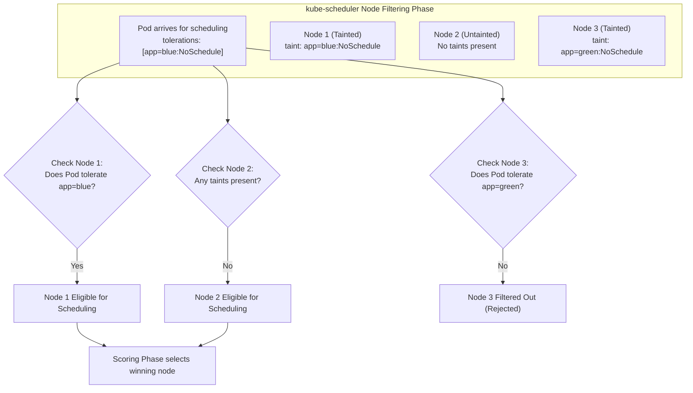
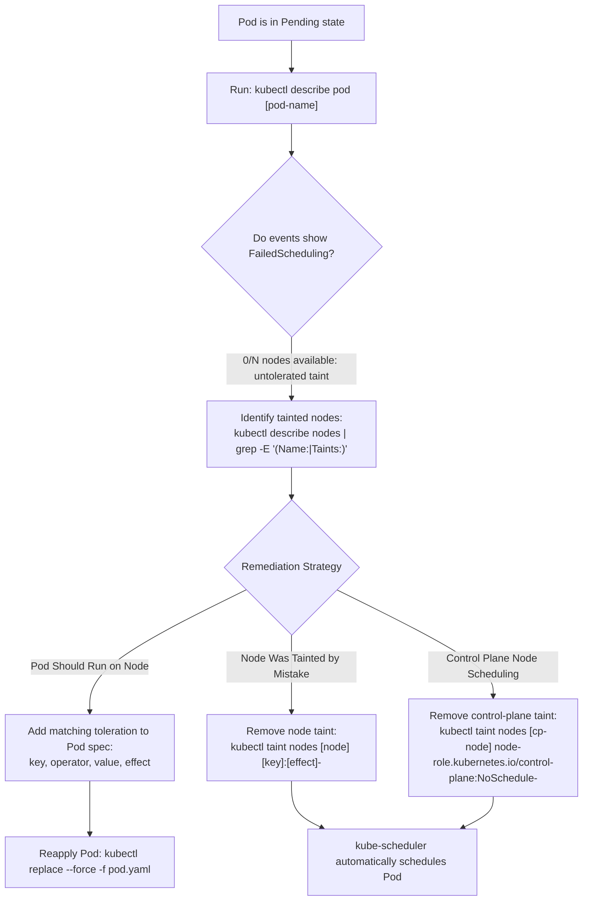

# Kubernetes Taints & Tolerations - CKA Exam Notes

> **Exam Domain**: Scheduling (15%) / Troubleshooting (30%)  
> **Weight / Importance**: Critical (High-frequency topic tested across node dedication, workload isolation, and control plane troubleshooting)  
> **Target Version**: Verified against v1.31 / v1.32 (Current CKA Curriculum)  
> **Allowed Docs Search Keywords**: `Taints and Tolerations`, `kubectl taint`, `NoSchedule`, `NoExecute`, `tolerationSeconds`  
> **Source**: Generated from `scheduling/03-taints-and-tolerations-raw.md`

---

## 1. Quick-Reference Summary

- **Primary Role of Taints**: Configured on **Nodes** to repel any Pods that do not possess an explicit, matching toleration.
- **Primary Role of Tolerations**: Configured on **Pods** (`spec.tolerations`) allowing the scheduler to place the Pod onto a Node with a matching taint.
- **The Core Rule**: Taints and tolerations **do not attract or pull** Pods to a specific Node. They merely **permit** placement on tainted nodes. To guarantee that a Pod lands on a specific node, you must pair tolerations with `nodeSelector` or `nodeAffinity`.
- **The Three Taint Effects**:
  1. **`NoSchedule`**: Strong filter. New untolerating Pods are never scheduled on the node. Existing running Pods remain unaffected.
  2. **`PreferNoSchedule`**: Soft filter. The scheduler avoids placing untolerating Pods on the node unless no other nodes have available capacity.
  3. **`NoExecute`**: Strong eviction filter. New untolerating Pods are rejected, and **existing untolerating Pods on the node are immediately evicted**.
- **Taint Syntax (CLI)**:
  - Add taint: `kubectl taint nodes <node-name> key=value:<effect>`
  - Remove taint: `kubectl taint nodes <node-name> key=value:<effect>-` (append trailing hyphen `-`)
  - Remove all taints with key: `kubectl taint nodes <node-name> key-`
- **Control Plane Taint (Exam Classic)**:
  - Modern Kubernetes (v1.24+): `node-role.kubernetes.io/control-plane:NoSchedule`
  - Legacy Kubernetes (<v1.24): `node-role.kubernetes.io/master:NoSchedule`
  - Allow user workloads on control plane:
    ```bash
    kubectl taint nodes controlplane node-role.kubernetes.io/control-plane:NoSchedule-
    ```
- **Toleration Operators**:
  - `Equal`: Requires exact match of `key`, `value`, and `effect`.
  - `Exists`: Matches any taint with the specified `key` regardless of `value`.

---

## 2. Conceptual Overview & Mental Model

### Dual-Layer Architectural Understanding

- **Simple English Explanation (How It Works)**:
  - **The Workload Segregation Problem**:
    In a shared cluster, certain nodes are provisioned for dedicated purposes: nodes equipped with expensive GPUs, nodes dedicated to PCI-DSS compliant payment processing, or control plane nodes running critical cluster infrastructure (`etcd`, `kube-apiserver`). If any random developer deploys an unconstrained Pod, `kube-scheduler` might place that generic Pod onto these specialized or critical nodes, starving them of compute resources.
  - **How Taints and Tolerations Work**:
    Kubernetes solves this with an opt-in admission barrier:
    1. An administrator applies a **Taint** to a Node (e.g., `specialty=gpu:NoSchedule`). From that moment on, the node repels all workloads by default.
    2. When `kube-scheduler` filters candidate nodes for a generic Pod, it encounters the node's taint. Because the Pod has no declared exception, the scheduler eliminates that node from consideration.
    3. To run on that node, a developer must explicitly declare a **Toleration** inside their Pod blueprint matching the node's taint key, value, and effect. When the scheduler sees the matching toleration, the node is allowed back into the scheduling pool.
  - **Tolerations Do Not Attract Workloads**:
    A common misconception is that adding a toleration to a Pod forces it onto the tainted node. It does not. A Pod with a GPU toleration can still be scheduled onto an untainted generic worker node if the scheduler scores it higher. To achieve dedicated placement, the Pod must declare **both** a toleration (to pass the node's barrier) and a `nodeSelector` / `nodeAffinity` (to attract the Pod specifically to that node).




- **Standard / Production Definition**:
  - **Taints**: Node attributes consisting of a key, value, and effect that instruct the scheduler to filter out or evict Pods that do not explicitly tolerate the specified configuration.
  - **Tolerations**: Declarative Pod specification fields (`spec.tolerations`) applied to workloads that override node taints during scheduling filtering (for `NoSchedule` / `PreferNoSchedule`) and prevent eviction during node state reconciliation (for `NoExecute`).

---

## 3. Deep-Dive Technical Breakdown

### 3.1 Comparison of Taint Effects

The effect parameter determines the enforcement severity applied to untolerating Pods:

| Taint Effect | Impact on New Pods | Impact on Existing Running Pods | Production Use Case |
| :--- | :--- | :--- | :--- |
| **`NoSchedule`** | Pod will **never** be placed on the node by `kube-scheduler`. | Existing Pods continue running undisturbed. | Dedicated nodes (e.g., GPU hardware, batch processing, control plane isolation). |
| **`PreferNoSchedule`** | Scheduler **attempts to avoid** placing the Pod on the node, but will place it if no other nodes are available. | Existing Pods continue running undisturbed. | Soft workload preferences during maintenance or temporary resource constraints. |
| **`NoExecute`** | Pod will **never** be placed on the node. | Existing untolerating Pods are **immediately evicted** from the node. | Node drainage, hardware decommissioning, responding to fatal node failure conditions. |

---

### 3.2 Deep Dive into `NoExecute` and `tolerationSeconds`

When a node receives a `NoExecute` taint, the node lifecycle controller evaluates all active containers currently running on the node:


*Before: Node 1 runs both Pod D (which tolerates the taint) and Pod C (which has no toleration).*


*After: Once the `NoExecute` taint is applied, Pod C is immediately evicted, while Pod D remains executing.*

#### Grace Periods via `tolerationSeconds`
A Pod tolerating a `NoExecute` taint can specify `tolerationSeconds` to define how long it may remain before being evicted:

```yaml
tolerations:
- key: "node.kubernetes.io/unreachable"
  operator: "Exists"
  effect: "NoExecute"
  tolerationSeconds: 300
```
- When a node becomes unreachable or not ready, Kubernetes automatically adds built-in `NoExecute` taints.
- Pods with the above toleration stay alive on the node for 300 seconds (5 minutes) before the control plane evicts them, preventing unnecessary pod churn during temporary node reboots or transient network partitions.

---

### 3.3 Toleration Operators: `Equal` vs. `Exists`

Kubernetes supports two matching operators inside `spec.tolerations`:

#### 1. Operator `Equal` (Default)
Requires that both the key and the value match the node taint:
```yaml
tolerations:
- key: "tier"
  operator: "Equal"
  value: "frontend"
  effect: "NoSchedule"
```

#### 2. Operator `Exists`
Matches any taint with the specified key, **ignoring the value**:
```yaml
tolerations:
- key: "tier"
  operator: "Exists"
  effect: "NoSchedule"
```

#### 3. Wildcard Tolerations
- **Match all keys with a specific effect**:
  ```yaml
  tolerations:
  - operator: "Exists"
    effect: "NoSchedule"
  ```
- **Match all taints unconditionally**:
  ```yaml
  tolerations:
  - operator: "Exists"
  ```
  *(Used by DaemonSets like CNI plugins and monitoring agents that must run on every node regardless of taints).*

---

### 3.4 Built-In System Taints

Kubernetes automatically injects taints on nodes when hardware or network faults occur:

| Built-In Node Taint | Effect | Trigger Condition |
| :--- | :--- | :--- |
| `node.kubernetes.io/not-ready` | `NoExecute` | Node is reporting `Ready = False` to the control plane. |
| `node.kubernetes.io/unreachable` | `NoExecute` | Node controller lost contact with `kubelet` (`Ready = Unknown`). |
| `node.kubernetes.io/memory-pressure` | `NoSchedule` | Node memory usage exceeds eviction thresholds. |
| `node.kubernetes.io/disk-pressure` | `NoSchedule` | Root filesystem or image filesystem is running out of disk space. |
| `node.kubernetes.io/pid-pressure` | `NoSchedule` | Operating system process ID limit is exhausted. |
| `node.kubernetes.io/network-unavailable` | `NoSchedule` | Host networking or CNI plugin is not yet initialized. |
| `node.kubernetes.io/unschedulable` | `NoSchedule` | Node has been cordoned via `kubectl cordon <node>`. |

---

## 4. Declarative Manifests & Scaffolding Patterns

### Dedicated Node Configuration Pattern (Taint + NodeSelector)

To ensure that only `red` application pods run on `node01`, and that `red` application pods **only** run on `node01`:

#### Step 1: Taint and Label the Node
```bash
# Apply taint to repel all other pods
kubectl taint nodes node01 app=red:NoSchedule

# Apply label to attract red pods specifically
kubectl label nodes node01 app=red
```

#### Step 2: Declare Pod Manifest with Both Toleration and NodeSelector (`red-pod.yaml`)
```yaml
apiVersion: v1
kind: Pod
metadata:
  name: red-app
  labels:
    app: red
spec:
  # 1. Toleration allows placement on tainted node01:
  tolerations:
  - key: "app"
    operator: "Equal"
    value: "red"
    effect: "NoSchedule"
  # 2. NodeSelector ensures placement specifically on node01:
  nodeSelector:
    app: red
  containers:
  - name: nginx
    image: nginx:alpine
```

---

## 5. Command Translation & Operational Mapping Tables

### Taint Management Cheatsheet

| Task | Command Syntax |
| :--- | :--- |
| **Inspect Node Taints** | `kubectl describe node <name> \| grep -i taints` |
| **Apply NoSchedule Taint** | `kubectl taint nodes <name> key=value:NoSchedule` |
| **Apply PreferNoSchedule Taint** | `kubectl taint nodes <name> key=value:PreferNoSchedule` |
| **Apply NoExecute Taint** | `kubectl taint nodes <name> key=value:NoExecute` |
| **Apply Key-Only Taint** | `kubectl taint nodes <name> key:NoSchedule` |
| **Remove Specific Taint** | `kubectl taint nodes <name> key=value:NoSchedule-` |
| **Remove All Taints with Key** | `kubectl taint nodes <name> key-` |
| **Untaint Control Plane (v1.24+)** | `kubectl taint nodes controlplane node-role.kubernetes.io/control-plane:NoSchedule-` |
| **Untaint Control Plane (Legacy)** | `kubectl taint nodes master node-role.kubernetes.io/master:NoSchedule-` |

---

## 6. High-Yield CLI & Imperative Commands

```bash
# 1. View all nodes and their active taints in a clean JSONPath format
kubectl get nodes -o custom-columns=NAME:.metadata.name,TAINTS:.spec.taints

# 2. Apply a dedicated hardware taint to worker-node-1
kubectl taint nodes worker-node-1 dedicated=gpu:NoSchedule

# 3. Apply a soft preference taint to worker-node-2
kubectl taint nodes worker-node-2 maintenance=pending:PreferNoSchedule

# 4. Remove the dedicated taint from worker-node-1
kubectl taint nodes worker-node-1 dedicated=gpu:NoSchedule-

# 5. Untaint all control plane nodes in the cluster
kubectl taint nodes -l node-role.kubernetes.io/control-plane node-role.kubernetes.io/control-plane:NoSchedule-

# 6. Scaffold a pod and append a toleration imperatively
kubectl run tolerating-pod --image=nginx --dry-run=client -o yaml > pod.yaml
# Add spec.tolerations block in vim, then apply
kubectl apply -f pod.yaml
```

---

## 7. Troubleshooting & Diagnostic Runbook

### Decision Tree: Troubleshooting `FailedScheduling` Taint Rejections



### Step-by-Step Triage Sequence

1. **Identifying Taint Failures**:
   ```bash
   kubectl describe pod <pending-pod>
   ```
   Look for the warning:
   `Warning  FailedScheduling  default-scheduler  0/3 nodes are available: 1 node(s) had untolerated taint {node-role.kubernetes.io/control-plane: }, 2 node(s) had untolerated taint {dedicated: gpu}.`

2. **Checking the Target Node's Taints**:
   ```bash
   kubectl describe node <target-node> | grep -A 3 -i taints
   ```

3. **Verifying Exact Toleration String Matching**:
   Ensure the Pod's `key`, `value`, and `effect` strings match character-for-character with the node's taint. Remember that `key` and `value` are case-sensitive.

---

## 8. CKA Exam Tips, Gotchas & Traps

> [!WARNING]
> **The Toleration Does NOT Guarantee Node Placement Trap**:
> In the exam, a question might say: *"Configure pod nginx to run on node01, which is tainted with app=blue:NoSchedule"*.
> If you only add the toleration `app=blue:NoSchedule` to the Pod, the scheduler is permitted to run it on `node01`, but it might schedule it on `node02` instead! You **must** configure both `tolerations` and `nodeSelector: { app: blue }` (or `nodeName: node01`) to guarantee placement.

> [!IMPORTANT]
> **Control Plane Taint Key in Modern Clusters (v1.24+)**:
> In older documentation or courses, you will see `node-role.kubernetes.io/master:NoSchedule`. In all modern Kubernetes versions (v1.24 through v1.31/v1.32), this was renamed to:
> ```text
> node-role.kubernetes.io/control-plane:NoSchedule
> ```
> Always check the node description first (`kubectl describe node controlplane | grep Taints`) before attempting to remove the taint.

> [!TIP]
> **Removing Taints Quickly in the Exam**:
> You do not need to type the full key, value, and effect to remove a taint. Appending a minus sign directly to the key removes all taints associated with that key:
> ```bash
> kubectl taint nodes node01 dedicated-
> ```

---

## 9. Self-Test / Active Recall

1. **What command removes a taint with key `env`, value `prod`, and effect `NoSchedule` from node `worker-1`?**
2. **What is the difference between `NoSchedule` and `NoExecute`?**
3. **If a Pod has a toleration for a node's taint, does that guarantee the Pod will be scheduled on that node? Why or why not?**
4. **How do you configure a toleration in YAML to match any taint with key `hardware`, regardless of its value?**
5. **What is the purpose of `tolerationSeconds` on a `NoExecute` toleration?**
6. **What is the modern taint key applied automatically to Kubernetes control plane nodes?**
7. **What happens to currently running Pods on a node if you add a taint with effect `PreferNoSchedule`?**

<details>
<summary>Reveal Answers</summary>

1. `kubectl taint nodes worker-1 env=prod:NoSchedule-` (or `kubectl taint nodes worker-1 env-`).
2. `NoSchedule` prevents new untolerating pods from being scheduled on the node while leaving existing pods running. `NoExecute` prevents new pods AND immediately evicts existing untolerating pods from the node.
3. No. Tolerations only remove the barrier; they do not attract the workload. The scheduler can still place the pod on any other untainted node unless guided by `nodeSelector`, `nodeAffinity`, or `nodeName`.
4. Use `operator: "Exists"` without declaring a `value` (e.g., `{ key: "hardware", operator: "Exists", effect: "NoSchedule" }`).
5. It specifies how long a pod is allowed to remain executing on the node before being evicted after a `NoExecute` taint is applied (or triggered by node failure conditions).
6. `node-role.kubernetes.io/control-plane:NoSchedule`.
7. Nothing. Existing Pods remain running undisturbed; `PreferNoSchedule` only influences future scheduling decisions.
</details>

---

### Official Documentation Bookmarks

Allowed for reference during the live exam at [kubernetes.io/docs](https://kubernetes.io/docs/home/):

| Topic | Direct Search Term | Recommended Anchor |
| :--- | :--- | :--- |
| **Taints and Tolerations** | `Taints and Tolerations` | Concepts > Scheduling, Preemption and Eviction > Taints and Tolerations |
| **Kubectl Taint** | `kubectl taint` | Reference > Command-Line Tools > kubectl > kubectl taint |
| **Built-in Taints** | `Taint based Evictions` | Concepts > Scheduling > Taints and Tolerations > Taint based Evictions |
