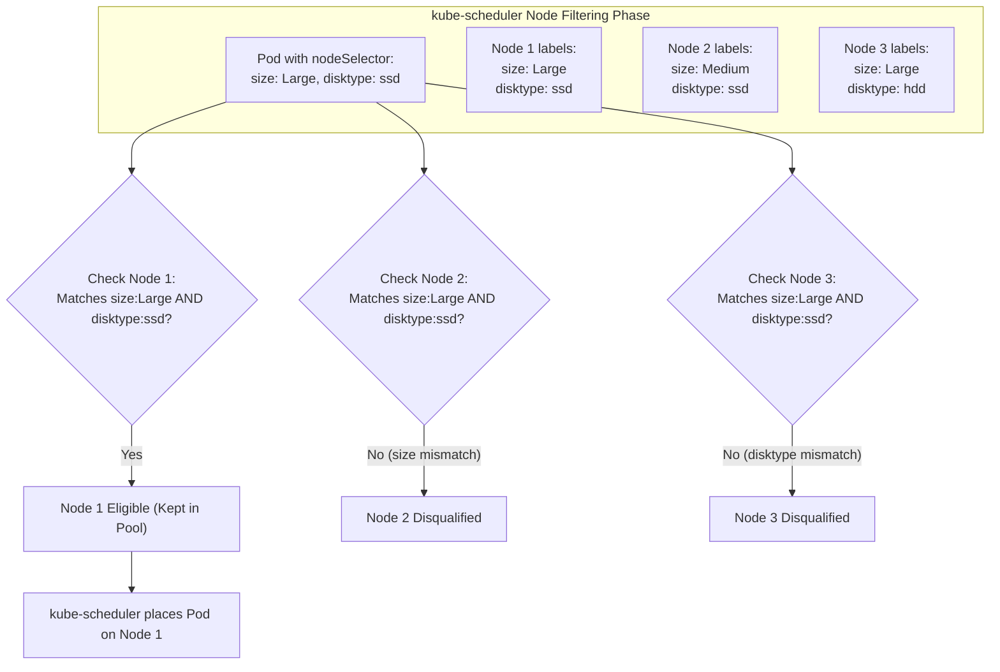
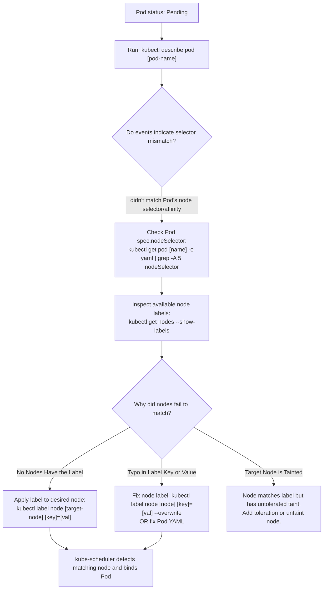

# Kubernetes Node Selectors (`nodeSelector`) - CKA Exam Notes

> **Exam Domain**: Scheduling (15%) / Troubleshooting (30%)  
> **Weight / Importance**: High (The simplest, fastest method for constraining Pods to specific worker nodes in the CKA exam)  
> **Target Version**: Verified against v1.31 / v1.32 (Current CKA Curriculum)  
> **Allowed Docs Search Keywords**: `Assigning Pods to Nodes`, `nodeSelector`, `kubectl label node`  
> **Source**: Generated from `scheduling/04-node-selector-raw.md`

---

## 1. Quick-Reference Summary

- **Primary Role of `nodeSelector`**: The simplest mechanism to constrain a Pod to run only on worker nodes that possess specific labels.
- **Where Defined**: Inside the Pod specification as a key-value dictionary under `spec.nodeSelector`.
- **Matching Rule**: **Strict equality (Logical AND)**. If a Pod declares multiple key-value pairs, a Node must match **every single pair** to be eligible.
- **Node Labeling Command**:
  ```bash
  kubectl label node <node-name> <key>=<value>
  ```
- **Example Usage**:
  ```yaml
  spec:
    nodeSelector:
      size: Large
      disktype: ssd
  ```
- **Scheduler Failure Symptom**:
  If no nodes possess matching labels, the Pod stays in `Pending` state with:
  `0/N nodes available: N node(s) didn't match Pod's node selector/affinity.`
- **Key Limitations**:
  - **No Logical OR / Set Operations**: Cannot match `size=Large OR size=Medium`; cannot exclude nodes (`NotIn`).
  - **Hard Constraints Only**: Cannot express soft preferences ("prefer SSD, but use HDD if SSD is full").
  - **No Key-Only Checks**: Cannot check for the existence of a label key regardless of its value.
  - *Resolution*: When complex expressions or soft preferences are needed, use **Node Affinity** (`spec.affinity.nodeAffinity`).

---

## 2. Conceptual Overview & Mental Model

### Dual-Layer Architectural Understanding

- **Simple English Explanation (How It Works)**:
  - **The Workload Routing Problem**:
    In a Kubernetes cluster with heterogeneous worker nodes (some nodes with large memory pools, some with fast NVMe disks, some in specific physical racks), you often need specific application processes (such as data processors or databases) to land on nodes with corresponding hardware specifications.
  - **How `nodeSelector` Solves This**:
    1. An operator stamps arbitrary labels on worker nodes (e.g., `kubectl label node worker-1 disktype=ssd`).
    2. When deploying a Pod, the developer adds the `spec.nodeSelector` field declaring `{ disktype: ssd }`.
    3. When `kube-scheduler` filters available nodes during its scheduling pass, it inspects each node's `metadata.labels`.
    4. Any node whose labels do not contain `disktype: ssd` is eliminated.
    5. The scheduler scores the remaining qualifying nodes and places the Pod.
  - **Why It Differs from `nodeName`**:
    `spec.nodeName` hardcodes a single node hostname and completely bypasses the scheduler. In contrast, `nodeSelector` relies on `kube-scheduler` to dynamically choose from any node in the cluster that satisfies the declared label requirement.



- **Standard / Production Definition**:
  - **NodeSelector**: A core Pod specification field (`spec.nodeSelector`) representing a map of string key-value pairs that defines hard scheduling constraints. During the scheduling filtering phase, `kube-scheduler` evaluates `nodeSelector` as a predicate filter, qualifying only those nodes whose `metadata.labels` dictionary is a superset of the declared key-value pairs.

---

## 3. Deep-Dive Technical Breakdown

### 3.1 Node Labeling Mechanics

Worker nodes are standard Kubernetes API objects and can be labeled imperatively:

```bash
# Label a specific node
kubectl label node worker-1 size=Large

# Verify assigned labels
kubectl get nodes --show-labels

# Query nodes matching specific labels
kubectl get nodes -l size=Large
```

#### Updating and Removing Node Labels
```bash
# Overwrite an existing label value
kubectl label node worker-1 size=ExtraLarge --overwrite

# Remove a label from a node (trailing hyphen)
kubectl label node worker-1 size-
```

---

### 3.2 Standard Built-In Kubernetes Node Labels

Kubernetes automatically populates standard topological and architectural labels on every registered node:

| Label Key | Description / Example Values |
| :--- | :--- |
| `kubernetes.io/hostname` | The exact node hostname (e.g., `worker-1`). |
| `kubernetes.io/os` | Node operating system (`linux`, `windows`). |
| `kubernetes.io/arch` | Node CPU architecture (`amd64`, `arm64`). |
| `topology.kubernetes.io/zone` | Cloud availability zone (e.g., `us-east-1a`). |
| `topology.kubernetes.io/region` | Geographic region (e.g., `us-east-1`). |
| `node.kubernetes.io/instance-type` | Cloud compute instance type (e.g., `c5.xlarge`). |

> [!TIP]
> You can target these built-in labels immediately using `nodeSelector` without running `kubectl label node`:
> ```yaml
> spec:
>   nodeSelector:
>     kubernetes.io/arch: arm64
> ```

---

### 3.3 Limitations of `nodeSelector`

While `nodeSelector` is fast and simple, it has architectural constraints that limit its use in advanced production topologies:

| Capability | Supported by `nodeSelector`? | Alternative / Solution |
| :--- | :--- | :--- |
| **Exact Equality (`key=val`)** | **YES** | Native capability. |
| **Multiple Conditions (Logical AND)** | **YES** | All listed key-value pairs must match. |
| **Logical OR (`size=Large OR size=Medium`)** | **NO** | Requires Node Affinity `operator: In`. |
| **Negation (`tier != legacy`)** | **NO** | Requires Node Affinity `operator: NotIn`. |
| **Key Existence (`Exists` regardless of value)** | **NO** | Requires Node Affinity `operator: Exists`. |
| **Soft Preferences ("Nice to have")** | **NO** | Requires Node Affinity `preferredDuringSchedulingIgnoredDuringExecution`. |

---

## 4. Declarative Manifests & Scaffolding Patterns

### Complete Manifest Example (`data-processor-pod.yaml`)

```yaml
apiVersion: v1
kind: Pod
metadata:
  name: myapp-pod
  labels:
    app: data-processor
spec:
  nodeSelector:
    size: Large
    hardware: high-mem
  containers:
  - name: data-processor
    image: data-processor:v1
    resources:
      requests:
        memory: "4Gi"
        cpu: "2"
    ports:
    - containerPort: 8080
```

---

## 5. Command Translation & Operational Mapping Tables

### Comparing Node Assignment Primitives

| Primitive | Evaluated By | Hard / Soft | Expressiveness | Bypasses Scheduler? |
| :--- | :--- | :--- | :--- | :--- |
| **`spec.nodeName`** | `kubelet` directly | Hard | Hostname string only | **YES** |
| **`spec.nodeSelector`** | `kube-scheduler` | Hard only | Exact key-value equality | **NO** |
| **`nodeAffinity` (required)** | `kube-scheduler` | Hard | Set-based (`In`, `NotIn`, `Exists`, `Gt`) | **NO** |
| **`nodeAffinity` (preferred)** | `kube-scheduler` | Soft (weighted) | Set-based with priority scoring | **NO** |

---

## 6. High-Yield CLI & Imperative Commands

```bash
# 1. Label worker node 'node-1' with size=Large
kubectl label node node-1 size=Large

# 2. Check labels on node-1
kubectl get node node-1 --show-labels

# 3. Filter nodes by custom label
kubectl get nodes -l size=Large

# 4. View node labels as dedicated table columns
kubectl get nodes -L size,kubernetes.io/os

# 5. Overwrite an existing label on node-1
kubectl label node node-1 size=Medium --overwrite

# 6. Delete the label from node-1
kubectl label node node-1 size-

# 7. Scaffold a pod and inject nodeSelector quickly
kubectl run data-proc --image=data-processor --dry-run=client -o yaml > pod.yaml
# Add nodeSelector block in vim, then apply
kubectl apply -f pod.yaml
```

---

## 7. Troubleshooting & Diagnostic Runbook

### Decision Tree: Troubleshooting `nodeSelector` Scheduling Failures



### Step-by-Step Triage Sequence

1. **Verify Pod Failure Events**:
   ```bash
   kubectl describe pod <pending-pod>
   ```
   Look for:
   `Warning  FailedScheduling  default-scheduler  0/3 nodes are available: 3 node(s) didn't match Pod's node selector/affinity.`

2. **Inspect the Pod's Declared Selectors**:
   ```bash
   kubectl get pod <pending-pod> -o jsonpath='{.spec.nodeSelector}'
   ```

3. **Verify Which Nodes Match the Selector**:
   ```bash
   kubectl get nodes -l <key>=<value>
   ```
   If no nodes return, you must either label the node or correct the spelling in the Pod specification. Once a node receives the matching label, `kube-scheduler` automatically transitions the Pod from `Pending` to `ContainerCreating`.

---

## 8. CKA Exam Tips, Gotchas & Traps

> [!WARNING]
> **Case Sensitivity in Label Values**:
> Kubernetes label keys and values are strictly case-sensitive. If you set `size: Large` in the Pod's `nodeSelector`, but the node is labeled `size=large`, `kube-scheduler` will treat this as a mismatch and the Pod will hang in `Pending`. Always verify capitalization with `kubectl get nodes --show-labels`.

> [!IMPORTANT]
> **Multiple Selectors Mean Logical AND**:
> Declaring:
> ```yaml
> nodeSelector:
>   env: prod
>   tier: frontend
> ```
> requires that a single node possess **both** `env=prod` and `tier=frontend`. If one node has `env=prod` and another has `tier=frontend`, the Pod cannot be scheduled on either.

> [!TIP]
> **Labeling Nodes Before Applying Pods**:
> In the CKA exam, always label the node **before** applying a manifest containing `nodeSelector`. While `kube-scheduler` will eventually pick up the Pod once the node is labeled, applying the label first ensures instantaneous scheduling and avoids confusing pending states during verification checks.

---

## 9. Self-Test / Active Recall

1. **Under which section of a Pod manifest is `nodeSelector` defined?**
2. **What command assigns the label `tier=backend` to node `worker-2`?**
3. **If a Pod specifies two key-value pairs under `nodeSelector`, does a node need to match both or just one?**
4. **How do you remove an existing label named `size` from a node?**
5. **What happens to an existing running Pod if you remove the label from the node it is executing on?**
6. **Can `nodeSelector` express an OR condition, such as running on either `zone-a` or `zone-b`? If not, what feature should be used?**
7. **Name two built-in labels automatically populated on nodes by Kubernetes.**

<details>
<summary>Reveal Answers</summary>

1. Under `spec.nodeSelector`.
2. `kubectl label node worker-2 tier=backend`.
3. It must match **both** (strict equality and logical AND).
4. `kubectl label node <node-name> size-` (trailing hyphen).
5. The Pod continues to run undisturbed. `nodeSelector` is evaluated only during the scheduling phase; removing the label does not trigger eviction.
6. No. `nodeSelector` only supports exact equality. Use **Node Affinity** (`spec.affinity.nodeAffinity`) with `operator: In` for OR conditions.
7. `kubernetes.io/hostname`, `kubernetes.io/os`, `kubernetes.io/arch`, `topology.kubernetes.io/zone`, `topology.kubernetes.io/region`.
</details>

---

### Official Documentation Bookmarks

Allowed for reference during the live exam at [kubernetes.io/docs](https://kubernetes.io/docs/home/):

| Topic | Direct Search Term | Recommended Anchor |
| :--- | :--- | :--- |
| **Assigning Pods to Nodes** | `Assigning Pods to Nodes` | Concepts > Scheduling, Preemption and Eviction > Assigning Pods to Nodes |
| **NodeSelector** | `nodeSelector` | Concepts > Scheduling > Assigning Pods to Nodes > nodeselector |
| **Label Nodes** | `kubectl label` | Reference > Command-Line Tools > kubectl > kubectl label |
