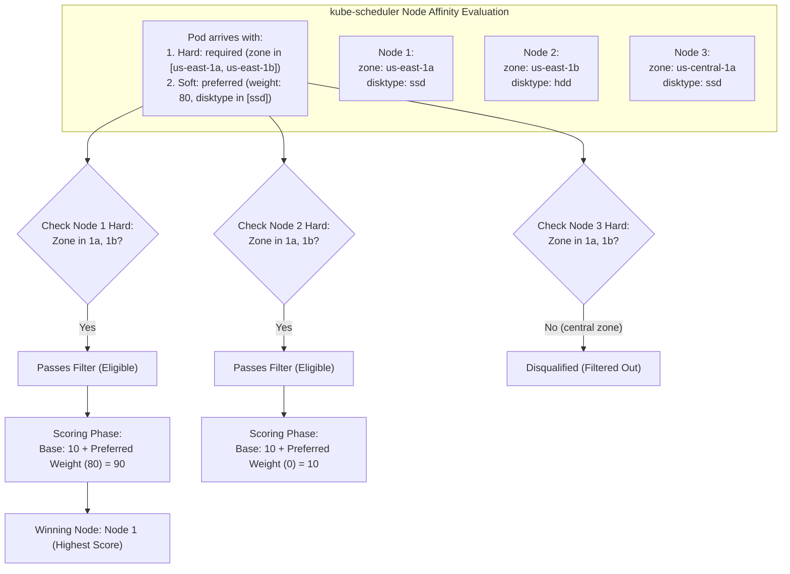
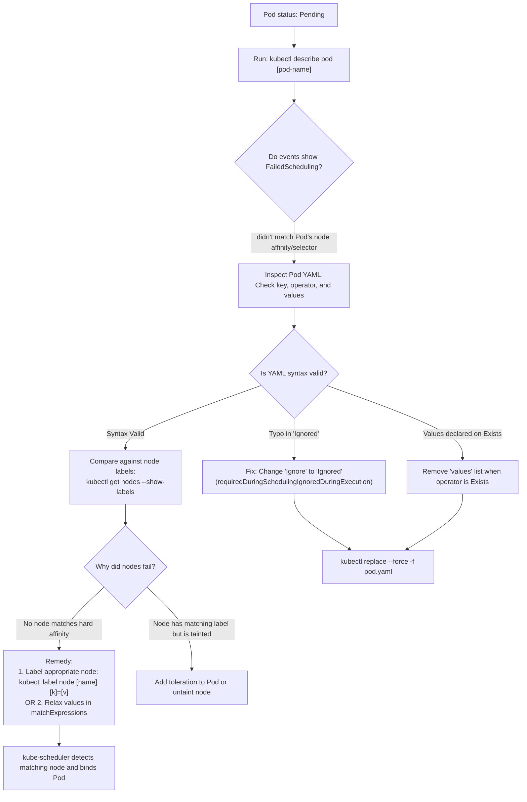

# Kubernetes Node Affinity (`nodeAffinity`) - CKA Exam Notes

> **Exam Domain**: Scheduling (15%) / Troubleshooting (30%)  
> **Weight / Importance**: High (The standard declarative mechanism for advanced, expressive Pod-to-Node placement constraints in Kubernetes)  
> **Target Version**: Verified against v1.31 / v1.32 (Current CKA Curriculum)  
> **Allowed Docs Search Keywords**: `Assigning Pods to Nodes`, `nodeAffinity`, `requiredDuringSchedulingIgnoredDuringExecution`, `preferredDuringSchedulingIgnoredDuringExecution`  
> **Source**: Generated from `scheduling/05-node-affinity-raw.md`

---

## 1. Quick-Reference Summary

- **Primary Role of Node Affinity**: An expressive, set-based language used to constrain which nodes a Pod can be scheduled on, expanding upon the limitations of `nodeSelector`.
- **The Two Affinity Types**:
  1. **`requiredDuringSchedulingIgnoredDuringExecution` (Hard Affinity)**:
     - **DuringScheduling**: Mandatory. The scheduler **must** satisfy this rule. If no matching nodes exist, the Pod remains stuck in the `Pending` state.
     - **IgnoredDuringExecution**: If node labels change or are removed after the Pod is already running, the Pod is **not evicted** and continues executing.
  2. **`preferredDuringSchedulingIgnoredDuringExecution` (Soft Affinity)**:
     - **DuringScheduling**: Best-effort. The scheduler attempts to place the Pod on matching nodes, adding a specified `weight` (1 to 100) to the node's ranking score. If no matching nodes exist, the Pod is still placed on another eligible node.
     - **IgnoredDuringExecution**: Node label changes do not affect running Pods.
- **Supported Operators**:
  - `In`: Label value matches one of the listed values.
  - `NotIn`: Label value does not match any listed value (or key does not exist).
  - `Exists`: Label key exists on the node (must **not** declare `values`).
  - `DoesNotExist`: Label key does not exist on the node (must **not** declare `values`).
  - `Gt` / `Lt`: Integer comparison (greater than / less than).
- **Logical AND vs. OR Rules**:
  - Multiple `matchExpressions` in a single term = **Logical AND**.
  - Multiple items in `values` array = **Logical OR**.
  - Multiple `nodeSelectorTerms` = **Logical OR**.
- **The Classic Syntax Trap**:
  - Notice the trailing **`d`**: It is `IgnoredDuringExecution`, **NOT** `IgnoreDuringExecution`.

---

## 2. Conceptual Overview & Mental Model

### Dual-Layer Architectural Understanding

- **Simple English Explanation (How It Works)**:
  - **The Limitation of Simple Matching**:
    `nodeSelector` only allows exact equality checks (`size=Large`). In production, you often need richer placement logic:
    - *"Run on any node in zone-a OR zone-b, but NEVER on legacy hardware."*
    - *"Try your best to place this pod on high-memory nodes, but if none are available, run it on standard nodes rather than crashing the deployment."*
  - **How Node Affinity Solves This**:
    Node Affinity provides an advanced declarative query engine evaluated by `kube-scheduler`:
    1. **Predicate Phase (Hard Affinity)**: When evaluating candidate nodes, the scheduler tests `requiredDuringSchedulingIgnoredDuringExecution`. Nodes that do not meet the expression are rejected immediately.
    2. **Priority Phase (Soft Affinity)**: For all surviving nodes, the scheduler evaluates `preferredDuringSchedulingIgnoredDuringExecution`. If a node satisfies a preferred rule, the scheduler adds that rule's configured weight (from 1 to 100) to the node's total score. The node with the highest cumulative score wins the placement.
  - **Why It is Called "IgnoredDuringExecution"**:
    Kubernetes scheduling decisions are evaluated only once: at the moment the Pod is placed. If a cluster administrator subsequently removes or modifies the labels on the worker node, Kubernetes does not interrupt or evict the running workload.



- **Standard / Production Definition**:
  - **Node Affinity**: An expressive scheduling constraint framework defined under `spec.affinity.nodeAffinity` that controls Pod placement based on Node labels. It is split into mandatory predicate filters (`requiredDuringSchedulingIgnoredDuringExecution`) and weighted priority functions (`preferredDuringSchedulingIgnoredDuringExecution`), supporting set-based boolean logic (`In`, `NotIn`, `Exists`, `DoesNotExist`, `Gt`, `Lt`).

---

## 3. Deep-Dive Technical Breakdown

### 3.1 Hard Node Affinity (`requiredDuringSchedulingIgnoredDuringExecution`)

Hard affinity acts as a strict gating requirement. If no nodes satisfy the expression, the Pod remains in `Pending`.

#### Manifest Structure:
```yaml
apiVersion: v1
kind: Pod
metadata:
  name: data-processor
spec:
  containers:
  - name: processor
    image: data-processor:v1
  affinity:
    nodeAffinity:
      requiredDuringSchedulingIgnoredDuringExecution:
        nodeSelectorTerms:
        - matchExpressions:
          - key: size
            operator: In
            values:
            - Large
            - Medium
```

#### Logical AND vs. Logical OR Rules:

```yaml
affinity:
  nodeAffinity:
    requiredDuringSchedulingIgnoredDuringExecution:
      nodeSelectorTerms:
      # --- TERM 1 (Logical OR with Term 2) ---
      - matchExpressions:
        - key: topology.kubernetes.io/zone    # Condition A
          operator: In
          values: [us-east-1a, us-east-1b]    # (us-east-1a OR us-east-1b)
        - key: disktype                       # Condition B (Condition A AND Condition B)
          operator: In
          values: [ssd]
      # --- TERM 2 (Logical OR with Term 1) ---
      - matchExpressions:
        - key: high-priority-node
          operator: Exists
```

- **Rule 1**: Expressions within a **single** `matchExpressions` list are evaluated with **Logical AND**.
- **Rule 2**: Multiple `nodeSelectorTerms` items are evaluated with **Logical OR**.
- **Rule 3**: Multiple values inside a single `values` block are evaluated with **Logical OR**.

---

### 3.2 Soft Node Affinity (`preferredDuringSchedulingIgnoredDuringExecution`)

Soft affinity specifies preferences rather than absolute requirements. If matching nodes are available, they receive higher scores. If not, the Pod is still placed on non-matching nodes.

#### Manifest Structure:
```yaml
apiVersion: v1
kind: Pod
metadata:
  name: myapp-soft
spec:
  containers:
  - name: web
    image: nginx
  affinity:
    nodeAffinity:
      preferredDuringSchedulingIgnoredDuringExecution:
      - weight: 80
        preference:
          matchExpressions:
          - key: disktype
            operator: In
            values:
            - ssd
      - weight: 20
        preference:
          matchExpressions:
          - key: network
            operator: In
            values:
            - 10gbps
```

#### Weight Calculation Mechanics:
- `weight` is an integer ranging from **1 to 100**.
- When `kube-scheduler` scores nodes:
  - Node matching `disktype=ssd` gets `+80` points.
  - Node matching `network=10gbps` gets `+20` points.
  - Node matching **both** gets `+100` points.
  - Node matching **neither** gets `+0` points (but is still eligible if hard rules pass).

---

### 3.3 Node Affinity Operator Matrix

| Operator | Requires `values`? | Description | Example Syntax |
| :--- | :--- | :--- | :--- |
| **`In`** | **YES** | Matches if the node label equals any value in the list. | `values: [Large, Medium]` |
| **`NotIn`** | **YES** | Matches if the node label does not equal any value in the list (or key is absent). | `values: [Small]` |
| **`Exists`** | **NO** | Matches if the node possesses the label key, regardless of value. | `key: gpu-accelerated`, no `values` |
| **`DoesNotExist`** | **NO** | Matches if the node does NOT possess the label key. | `key: maintenance`, no `values` |
| **`Gt`** | **YES** (Single int) | Matches if the node label's integer value is strictly greater than the declared integer. | `values: ["4"]` |
| **`Lt`** | **YES** (Single int) | Matches if the node label's integer value is strictly less than the declared integer. | `values: ["8"]` |

> [!CAUTION]
> If you specify the `Exists` or `DoesNotExist` operator, you **must not** define the `values` field. Providing an empty or populated `values` array with `Exists` causes an API schema validation error.

---

## 4. Declarative Manifests & Scaffolding Patterns

### Combining Hard AND Soft Node Affinity in a Single Workload

A common real-world and CKA exam pattern: *"The Pod MUST run in `us-east-1a` or `us-east-1b`, and PREFERS nodes labeled with `disktype=ssd`."*

```yaml
apiVersion: v1
kind: Pod
metadata:
  name: production-database
  labels:
    tier: database
spec:
  containers:
  - name: db
    image: postgres:15
    ports:
    - containerPort: 5432
  affinity:
    nodeAffinity:
      # 1. HARD CONSTRAINT (Mandatory)
      requiredDuringSchedulingIgnoredDuringExecution:
        nodeSelectorTerms:
        - matchExpressions:
          - key: topology.kubernetes.io/zone
            operator: In
            values:
            - us-east-1a
            - us-east-1b
      # 2. SOFT CONSTRAINT (Preferred)
      preferredDuringSchedulingIgnoredDuringExecution:
      - weight: 100
        preference:
          matchExpressions:
          - key: disktype
            operator: In
            values:
            - ssd
```

---

## 5. Command Translation & Operational Mapping Tables

### Comparing Node Placement Primitives

| Feature | `spec.nodeName` | `spec.nodeSelector` | `nodeAffinity` (required) | `nodeAffinity` (preferred) |
| :--- | :--- | :--- | :--- | :--- |
| **Evaluator** | `kubelet` | `kube-scheduler` | `kube-scheduler` | `kube-scheduler` |
| **Constraint Level** | Absolute | Hard only | Hard only | Soft (Weighted 1-100) |
| **Logic Supported** | Exact string | Exact key=val | Set-based (`In`, `NotIn`, `Exists`, `Gt`) | Set-based (`In`, `NotIn`, `Exists`, `Gt`) |
| **Logical OR Support** | No | No (AND only) | **Yes** (`nodeSelectorTerms`) | **Yes** (Multiple preferences) |
| **Bypasses Scheduler?** | **YES** | No | No | No |

---

## 6. High-Yield CLI & Verification Commands

```bash
# 1. Quick look-up of the exact YAML structure using kubectl explain
kubectl explain pods.spec.affinity.nodeAffinity.requiredDuringSchedulingIgnoredDuringExecution.nodeSelectorTerms

# 2. Quick look-up for preferred affinity
kubectl explain pods.spec.affinity.nodeAffinity.preferredDuringSchedulingIgnoredDuringExecution

# 3. Label nodes for affinity testing
kubectl label node worker-1 size=Large disktype=ssd
kubectl label node worker-2 size=Small disktype=hdd

# 4. View node labels as dedicated columns to verify affinity candidates
kubectl get nodes -L size,disktype,topology.kubernetes.io/zone

# 5. Scaffold baseline pod manifest imperatively
kubectl run affinity-pod --image=nginx --dry-run=client -o yaml > pod.yaml
# Add affinity block in vim, then apply
kubectl apply -f pod.yaml

# 6. Verify which node the pod landed on
kubectl get pod affinity-pod -o wide
```

---

## 7. Troubleshooting & Diagnostic Runbook

### Decision Tree: Troubleshooting Node Affinity Failures



### Step-by-Step Triage Sequence

1. **Diagnosing `didn't match Pod's node affinity/selector`**:
   ```bash
   kubectl describe pod <pending-pod>
   ```
   If events display `0/N nodes available: N node(s) didn't match Pod's node affinity/selector`:
   - Inspect the Pod's `required` node affinity block.
   - Run `kubectl get nodes --show-labels` to verify if any nodes satisfy the condition.

2. **Diagnosing Schema Validation Errors on `kubectl apply`**:
   - Error: `unknown field "requiredDuringSchedulingIgnoreDuringExecution"`:
     - *Cause*: Missing the letter `d` in `Ignored`.
   - Error: `values: Invalid value: []string{...}: values must be empty when operator is 'Exists'`:
     - *Cause*: A `values` field was provided with `operator: Exists`. Remove the `values` block.

---

## 8. CKA Exam Tips, Gotchas & Traps

> [!WARNING]
> **The `Ignored` vs. `Ignore` Typo Trap**:
> The single most common failure in node affinity questions is forgetting the trailing `d` in `IgnoredDuringExecution`:
> - `requiredDuringSchedulingIgnoreDuringExecution` (FAILS at admission)
> - `requiredDuringSchedulingIgnoredDuringExecution` (CORRECT)
> If you are unsure of the spelling during the exam, use:
> ```bash
> kubectl explain pods.spec.affinity.nodeAffinity
> ```

> [!IMPORTANT]
> **Do NOT Put `values` on `Exists` or `DoesNotExist`**:
> ```yaml
> # WRONG (Triggers schema validation error):
> - key: size
>   operator: Exists
>   values:
>   - Large
> 
> # CORRECT:
> - key: size
>   operator: Exists
> ```

> [!TIP]
> **Logical OR vs. Logical AND Indentation in the Exam**:
> If an exam question asks: *"Run on nodes where size is Large OR zone is us-east-1a"*, you cannot place them in the same `matchExpressions` list (that is an AND). You must define two separate list items under `nodeSelectorTerms`:
> ```yaml
> nodeSelectorTerms:
> - matchExpressions:
>   - key: size
>     operator: In
>     values: [Large]
> - matchExpressions:
>   - key: zone
>     operator: In
>     values: [us-east-1a]
> ```

---

## 9. Self-Test / Active Recall

1. **What is the difference between `requiredDuringSchedulingIgnoredDuringExecution` and `preferredDuringSchedulingIgnoredDuringExecution`?**
2. **What does `IgnoredDuringExecution` mean if a cluster administrator removes a node label while a Pod with node affinity is running on that node?**
3. **What is the valid range of integers for the `weight` field in `preferredDuringSchedulingIgnoredDuringExecution`?**
4. **How do you express an OR condition between two different label keys in hard node affinity?**
5. **Which two operators in `matchExpressions` require that the `values` field be completely omitted?**
6. **If both `spec.nodeSelector` and `spec.affinity.nodeAffinity` are defined on the same Pod, does the node need to satisfy both or just one?**
7. **What `kubectl explain` command allows you to verify the exact structure of `nodeSelectorTerms`?**

<details>
<summary>Reveal Answers</summary>

1. `required...` is a mandatory hard filter (Pod stays `Pending` if no nodes match). `preferred...` is a soft preference where matching nodes receive higher scores (weighted 1-100), but Pods are still scheduled on non-matching nodes if necessary.
2. The Pod is not evicted; it continues to run undisturbed. Affinity is evaluated only during the scheduling phase.
3. Integers from `1` to `100`.
4. Define two separate entries under `nodeSelectorTerms` (multiple `nodeSelectorTerms` operate as Logical OR).
5. `operator: Exists` and `operator: DoesNotExist`.
6. Both must be satisfied. A node must satisfy `nodeSelector` AND `nodeAffinity` to be eligible for placement.
7. `kubectl explain pods.spec.affinity.nodeAffinity.requiredDuringSchedulingIgnoredDuringExecution.nodeSelectorTerms`.
</details>

---

### Official Documentation Bookmarks

Allowed for reference during the live exam at [kubernetes.io/docs](https://kubernetes.io/docs/home/):

| Topic | Direct Search Term | Recommended Anchor |
| :--- | :--- | :--- |
| **Node Affinity Reference** | `Assigning Pods to Nodes` | Concepts > Scheduling, Preemption and Eviction > Assigning Pods to Nodes > Node affinity |
| **Affinity Operators** | `Operators in node affinity` | Concepts > Scheduling > Assigning Pods to Nodes > Node affinity operators |
| **Kubectl Explain Affinity** | `kubectl explain` | Reference > Command-Line Tools > kubectl > kubectl explain |
