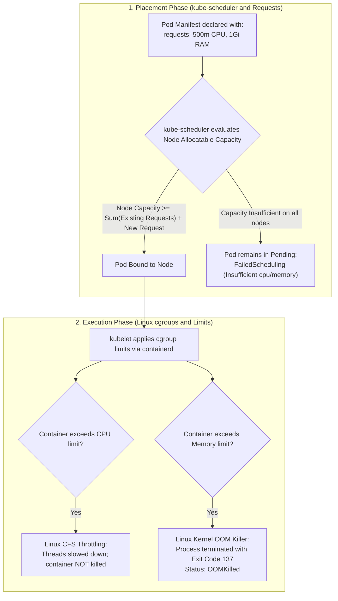
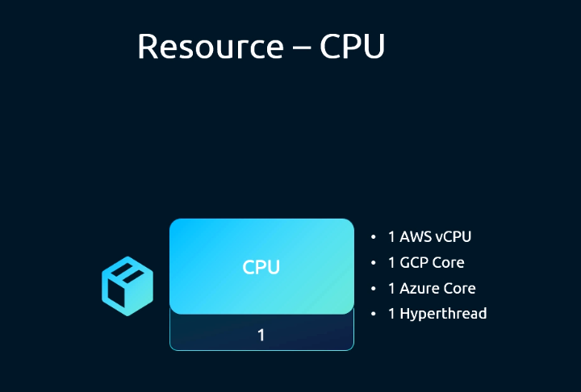
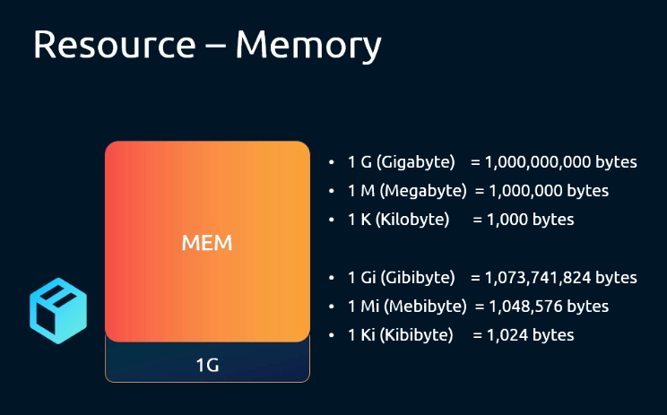
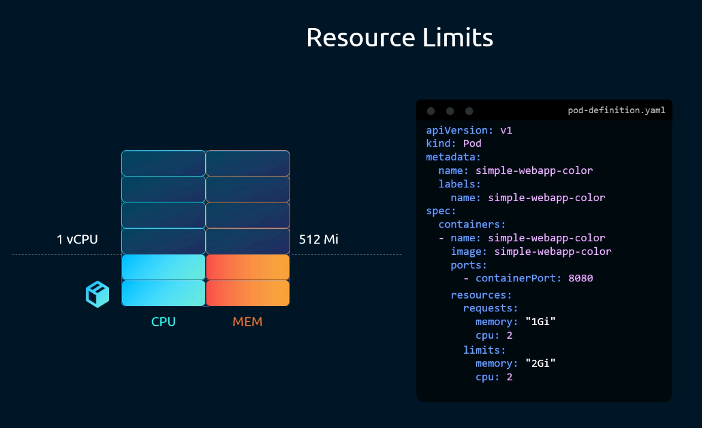
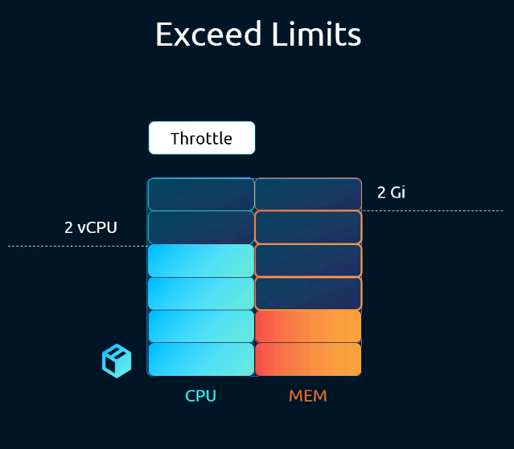
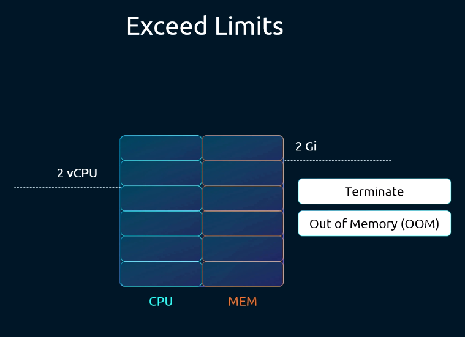
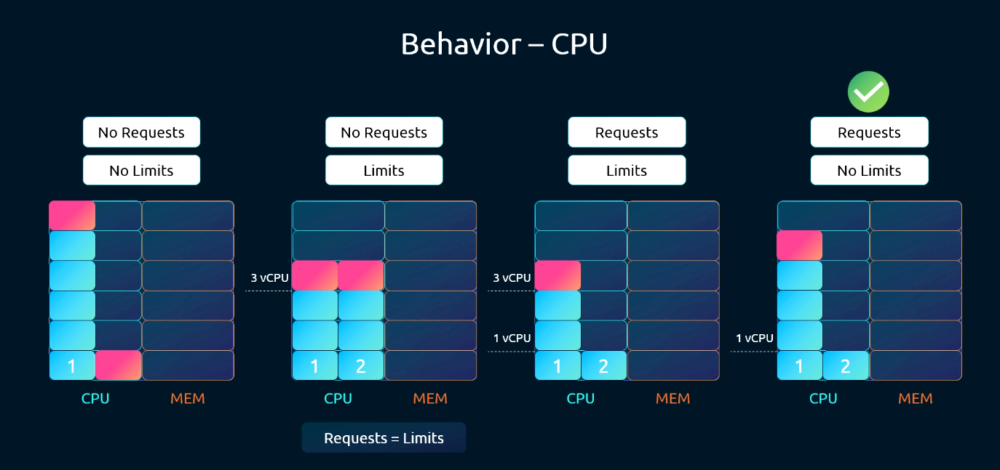
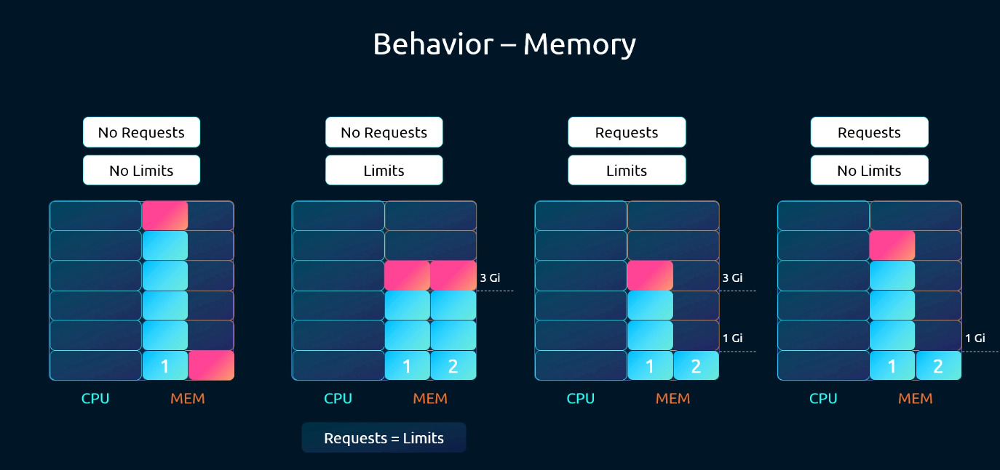
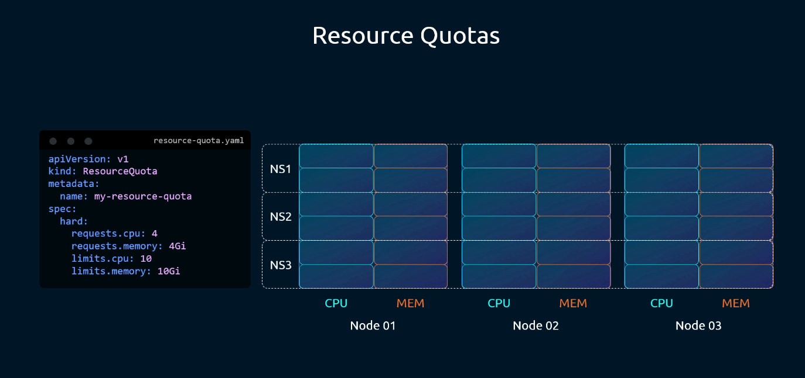
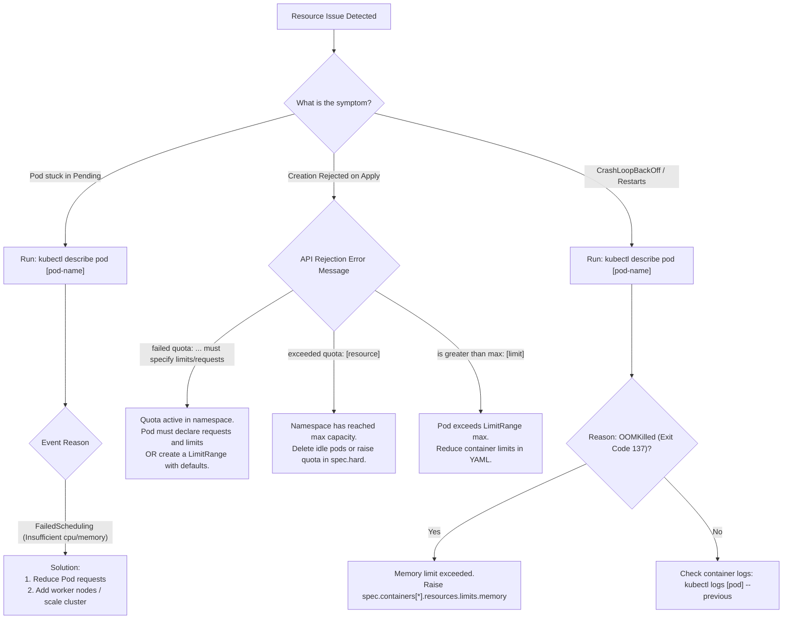

# Kubernetes Resource Requirements, Limits, LimitRanges & ResourceQuotas - CKA Exam Notes

> **Exam Domain**: Scheduling (15%) / Cluster Architecture, Installation & Configuration (25%) / Troubleshooting (30%)  
> **Weight / Importance**: Critical (Resource requests, limits, OOM handling, and namespace quotas are tested throughout the CKA exam)  
> **Target Version**: Verified against v1.31 / v1.32 (Current CKA Curriculum)  
> **Allowed Docs Search Keywords**: `Resource Management for Pods and Containers`, `LimitRange`, `ResourceQuota`, `Quality of Service`, `OOMKilled`  
> **Source**: Generated from `scheduling/06-resource-requirements-raw.md`

---

## 1. Quick-Reference Summary

- **Resource Requests (`spec.containers[*].resources.requests`)**:
  - The minimum guaranteed compute capacity allocated to a container.
  - Used exclusively by **`kube-scheduler`** to make placement decisions by ensuring `Sum(Requests) <= Node Allocatable`.
- **Resource Limits (`spec.containers[*].resources.limits`)**:
  - The hard ceiling of compute capacity a container is permitted to consume.
  - Enforced by the container runtime via **Linux cgroups**.
- **CPU (Compressible Resource)**:
  - 1 CPU = 1 AWS vCPU = 1 GCP Core = 1 Azure vCore = 1 Bare-metal Hyperthread.
  - Measured in millicores: `100m = 0.1 CPU`; lowest valid precision is `1m`.
  - **Exceeding Limit**: Container is **throttled** by the Completely Fair Scheduler (CFS). The process slows down but is **not terminated**.
- **Memory (Incompressible Resource)**:
  - Measured in bytes, typically binary IEC units: `Ki`, `Mi`, `Gi` (`1Gi = 1024Mi`).
  - **Exceeding Limit**: Container process is immediately terminated by the Linux kernel Out-Of-Memory killer (**`OOMKilled`**, exit code **137**).
- **Quality of Service (QoS) Classes**:
  - **`Guaranteed`**: Requests == Limits for both CPU and Memory across all containers. (Evicted last during node resource pressure).
  - **`Burstable`**: Requests != Limits, or only one resource type declared. (Evicted second).
  - **`BestEffort`**: No requests or limits set. (Evicted first).
- **LimitRange (Container/Pod-Level Governance)**:
  - Namespace-scoped object (`kind: LimitRange`).
  - Automatically injects default requests/limits (`defaultRequest`, `default`) into Pods created without them, and enforces `min`/`max` bounds.
- **ResourceQuota (Namespace-Level Aggregate Ceiling)**:
  - Namespace-scoped object (`kind: ResourceQuota`).
  - Enforces hard ceilings on the **cumulative sum** of requests and limits across all Pods in a namespace.
  - **Mandatory Enforcement**: Once a quota enforces CPU/Memory in a namespace, **every newly created Pod must declare requests and limits** (either directly or via a LimitRange).

---

## 2. Conceptual Overview & Mental Model

### Dual-Layer Architectural Understanding

- **Simple English Explanation (How It Works)**:
  - **The Shared Node Contention Problem**:
    In a Kubernetes cluster, multiple containers share the underlying CPU cores and RAM of worker nodes. Without resource boundaries, a single misbehaving process with an infinite loop or memory leak could consume 100% of the node's CPU cycles and RAM, causing neighboring applications and node system daemons to starve and crash.
  - **How Requests and Limits Govern Placement and Runtime**:
    Kubernetes divides resource management into two distinct phases:
    1. **Scheduling Time (Requests)**: When a Pod is created, `kube-scheduler` does not look at how much CPU or RAM the container is currently using in real-time. Instead, it looks at the declared `requests`. It scans cluster nodes to find a node whose remaining unallocated capacity can accommodate the request. Once scheduled, that capacity is reserved.
    2. **Execution Time (Limits)**: Once running on the node, the container runtime (`containerd`) instructs the Linux kernel cgroup controller to enforce `limits`.
       - If the container tries to burst past its CPU limit, the kernel CFS quota controller throttles its execution time slices.
       - If the container allocates physical memory beyond its memory limit, the Linux kernel invokes the Out-Of-Memory (OOM) killer, terminating the container process instantly with exit code 137 (`SIGKILL`).



- **Standard / Production Definition**:
  - **Resource Requests & Limits**: Declarative resource contracts defined within container specifications. Requests establish minimum resource reservations required for scheduler placement feasibility against node allocatable vectors, while limits configure Linux cgroup accounting constraints (CFS bandwidth periods for CPU and cgroup memory ceilings for RAM) to bound physical resource consumption.
  - **LimitRange**: A policy admission controller resource that enforces minimum, maximum, and default compute resource constraints per container or pod within a target namespace.
  - **ResourceQuota**: A namespace-level administrative constraint that limits the total aggregate consumption of compute, storage, and API object counts to guarantee tenant isolation and prevent resource exhaustion.

---

## 3. Deep-Dive Technical Breakdown

### 3.1 Understanding Compute Units

#### 1. CPU Resource Units


- **What 1 CPU Means**:
  - 1 Kubernetes CPU unit is equivalent to **1 AWS vCPU**, **1 GCP Core**, **1 Azure vCore**, or **1 physical CPU hyperthread**.
- **MilliCPU Representation**:
  - CPU can be specified as a decimal (`0.5`) or in millicores (`500m`).
  - `1 CPU` = `1000m` (millicores / millicpu).
  - `0.1 CPU` = `100m`.
  - Lowest possible precision: **`1m`** (0.001 of a core).

#### 2. Memory Resource Units


Memory is specified as a plain integer or as a fixed-point integer using standard quantity suffixes:
- **Decimal Suffixes (SI / Powers of 10)**:
  - `1 K` (Kilobyte) = $1,000$ bytes
  - `1 M` (Megabyte) = $1,000,000$ bytes
  - `1 G` (Gigabyte) = $1,000,000,000$ bytes
- **Binary Suffixes (IEC / Powers of 2 - Kubernetes Standard)**:
  - `1 Ki` (Kibibyte) = $1,024$ bytes ($2^{10}$)
  - `1 Mi` (Mebibyte) = $1,048,576$ bytes ($2^{20}$)
  - `1 Gi` (Gibibyte) = $1,073,741,824$ bytes ($2^{30}$)

---

### 3.2 Resource Limits & Exceeding Thresholds



#### 1. CPU Throttling


CPU is a **compressible resource**. When a container process demands more CPU cycles than permitted by `resources.limits.cpu`, the Linux kernel Completely Fair Scheduler (CFS) restricts the number of execution time slices the process receives. The application experiences degraded performance and elevated latency, but **does not crash**.

#### 2. Memory OOM Termination


Memory is an **incompressible resource**. A process cannot be throttled into using less RAM. If a container attempts to allocate memory beyond `resources.limits.memory`, the Linux cgroup memory controller triggers an Out-Of-Memory condition. The kernel immediately sends a `SIGKILL` signal to the process:
- Container exits with status code **`137`** ($128 + 9$, where 9 is `SIGKILL`).
- `kubectl describe pod` reports:
  ```text
  Last State:     Terminated
    Reason:       OOMKilled
    Exit Code:    137
  ```

---

### 3.3 The Four Behavioral Scenarios of Requests and Limits

#### CPU Allocation Scenarios


1. **Scenario 1: No Requests, No Limits**:
   The Pod can consume all available CPU cycles on the node, potentially starving neighboring workloads.
2. **Scenario 2: No Requests, Limits Set**:
   Kubernetes automatically **defaults requests to equal the declared limits** (`Requests = Limits`).
3. **Scenario 3: Both Requests and Limits Set**:
   The Pod is guaranteed its requested CPU capacity and is strictly bounded at the upper limit.
4. **Scenario 4: Requests Set, No Limits (Recommended for non-critical bursting)**:
   The Pod is guaranteed its requested CPU shares, but is free to burst into unallocated idle node cycles when other pods are dormant.

#### Memory Allocation Scenarios


1. **Scenario 1: No Requests, No Limits**:
   Unbounded memory consumption; the container can allocate RAM until the entire node runs out of memory, triggering node-wide evictions.
2. **Scenario 2: No Requests, Limits Set**:
   Kubernetes sets `Requests = Limits`. Pod gets `Guaranteed` QoS.
3. **Scenario 3: Both Requests and Limits Set**:
   Guaranteed baseline memory; capped at limit. If it bursts beyond the limit, it is immediately killed (`OOMKilled`).
4. **Scenario 4: Requests Set, No Limits**:
   Guaranteed baseline memory. If the pod allocates more memory than is physically available on the node, **the node cannot throttle memory**. The Linux kernel is forced to invoke the OOM killer and terminate the pod to protect node stability.

---

### 3.4 Quality of Service (QoS) Classes

Kubernetes classifies Pods into three QoS tiers to establish eviction priority when a node runs low on resources:

| QoS Class | Criteria | Eviction Priority under Node Pressure |
| :--- | :--- | :--- |
| **`Guaranteed`** | Every container in the Pod has both CPU and Memory requests and limits set, and `requests == limits`. | **Lowest (Evicted Last)** |
| **`Burstable`** | At least one container has a CPU or Memory request or limit set, but does not meet `Guaranteed` criteria. | **Medium** |
| **`BestEffort`** | No containers in the Pod have any CPU or Memory requests or limits specified. | **Highest (Evicted First)** |

---

### 3.5 LimitRange: Defaulting and Bounding Pods

A `LimitRange` enforces constraints on individual containers or pods within a single namespace:

```yaml
apiVersion: v1
kind: LimitRange
metadata:
  name: cpu-and-mem-constraints
  namespace: development
spec:
  limits:
  - type: Container
    default:                # Default LIMIT applied if omitted by user
      cpu: 500m
      memory: 1Gi
    defaultRequest:         # Default REQUEST applied if omitted by user
      cpu: 200m
      memory: 512Mi
    max:                    # Hard maximum limit allowed for any container
      cpu: "2"
      memory: 2Gi
    min:                    # Hard minimum request allowed for any container
      cpu: 100m
      memory: 256Mi
```

- If a developer applies a Pod without `resources`, the admission controller automatically injects `defaultRequest` and `default`.
- If a developer declares `cpu: 4`, the API server rejects creation because it exceeds `max.cpu`.

---

### 3.6 ResourceQuotas: Cumulative Namespace Ceilings



While `LimitRange` inspects individual Pods, a `ResourceQuota` tracks the **cumulative aggregate sum** of all Pods inside a namespace:

```yaml
apiVersion: v1
kind: ResourceQuota
metadata:
  name: compute-quota
  namespace: development
spec:
  hard:
    requests.cpu: "4"           # Total CPU requests in namespace cannot exceed 4 cores
    requests.memory: 8Gi        # Total Memory requests cannot exceed 8Gi
    limits.cpu: "10"            # Total CPU limits cannot exceed 10 cores
    limits.memory: 16Gi         # Total Memory limits cannot exceed 16Gi
    pods: "10"                  # Maximum 10 pods allowed in namespace
```

> [!CRITICAL]
> **The Quota Enforcement Rule**:
> If a `ResourceQuota` defines hard constraints on compute resources (`requests.cpu`, `requests.memory`, `limits.cpu`, or `limits.memory`), **any new Pod created in that namespace must explicitly specify those resource parameters**, or the namespace must possess a `LimitRange` providing defaults. Otherwise, creation is rejected with an admission error.

---

## 4. Declarative Manifests & Scaffolding Patterns

### Complete Pod Manifest with Explicit Resource Constraints

```yaml
apiVersion: v1
kind: Pod
metadata:
  name: simple-webapp-color
  labels:
    name: simple-webapp-color
spec:
  containers:
  - name: simple-webapp-color
    image: kodekloud/webapp-color
    ports:
    - containerPort: 8080
    resources:
      requests:
        memory: "1Gi"
        cpu: "500m"
      limits:
        memory: "2Gi"
        cpu: "1"
```

---

## 5. Command Translation & Operational Mapping Tables

### Comparing LimitRange vs. ResourceQuota

| Feature | `LimitRange` | `ResourceQuota` |
| :--- | :--- | :--- |
| **Scope** | Single Namespace | Single Namespace |
| **Evaluation Level** | Individual Container / Pod / PVC | Entire Namespace (Cumulative Sum) |
| **Provides Defaults?** | **YES** (`default`, `defaultRequest`) | **NO** (Only defines upper thresholds) |
| **Admission Impact** | Injects missing values; rejects out-of-bounds pods | Rejects pods if cumulative sum exceeds hard limit |
| **Primary Goal** | Standardize sizing & prevent oversized pods | Multi-tenant cluster capacity budgeting |

---

## 6. High-Yield CLI & Verification Commands

```bash
# 1. View live CPU and Memory consumption across cluster nodes
kubectl top nodes

# 2. View live CPU and Memory consumption across pods in current namespace
kubectl top pods

# 3. View live pod usage sorted by memory consumption
kubectl top pods -A --sort-by=memory

# 4. View active ResourceQuotas and current utilization in a namespace
kubectl describe quota compute-quota -n development

# 5. Inspect existing LimitRanges in a namespace
kubectl describe limitrange cpu-and-mem-constraints -n development

# 6. Check a pod's assigned Quality of Service (QoS) class
kubectl get pod webapp -o jsonpath='{.status.qosClass}'

# 7. Check if a container was terminated due to OOM
kubectl get pod webapp -o jsonpath='{.status.containerStatuses[*].lastState.terminated.reason}'
```

---

## 7. Troubleshooting & Diagnostic Runbook

### Decision Tree: Troubleshooting Resource Scheduling and Runtime Errors



### Step-by-Step Triage Sequence

1. **Investigating `OOMKilled` Pods**:
   - Run `kubectl describe pod <pod-name>`.
   - Look for `Exit Code: 137` and `Reason: OOMKilled`.
   - Remediate by increasing `resources.limits.memory` in the pod manifest and force-replacing the pod (`kubectl replace --force -f pod.yaml`).

2. **Diagnosing Namespace Quota Rejections**:
   - When `kubectl apply -f pod.yaml` errors with `forbidden: exceeded quota`:
     ```bash
     kubectl describe quota -n <namespace>
     ```
   - Compare `Used` against `Hard`. Identify which specific metric (CPU requests, Memory limits, Pod count) is exhausted.

3. **Verifying LimitRange Default Injections**:
   - Apply a bare pod without a `resources` block in a namespace governed by a `LimitRange`.
   - Inspect the pod:
     ```bash
     kubectl get pod <pod-name> -o yaml | grep -A 8 resources:
     ```
   - Verify that `defaultRequest` and `default` values were correctly applied.

---

## 8. CKA Exam Tips, Gotchas & Traps

> [!WARNING]
> **The Quota Rejection Trap (`must specify limits/requests`)**:
> If an exam question asks you to deploy a Pod into an existing namespace and it fails with:
> `Error: pods "..." is forbidden: failed quota: ...: must specify limits.cpu`,
> remember that this namespace has an active `ResourceQuota`. You **must** provide both `requests` and `limits` in the Pod manifest.

> [!IMPORTANT]
> **Exit Code 137 Means OOM Kill**:
> In troubleshooting questions, an exit code of `137` invariably indicates `SIGKILL` triggered by exceeding memory limits (`OOMKilled`). CPU limits never trigger exit code 137 (they only cause throttling).

> [!TIP]
> **Only Requests Affect Scheduling**:
> Remember that `kube-scheduler` completely ignores `limits` when selecting a node. A node with 4 cores can schedule 8 Pods requesting 500m CPU each, even if each Pod has a limit of 4 cores! Limits only matter once the container is running.

---

## 9. Self-Test / Active Recall

1. **Which resource field (`requests` or `limits`) is evaluated by `kube-scheduler` when choosing a node?**
2. **What happens to a container process if it attempts to exceed its allocated CPU limit?**
3. **What happens to a container process if it attempts to exceed its allocated Memory limit? What exit code is returned?**
4. **If a Pod specifies `limits` for CPU and Memory, but completely omits `requests`, what does Kubernetes do? What QoS class is assigned?**
5. **What is the difference between a `LimitRange` and a `ResourceQuota`?**
6. **If a namespace has a `ResourceQuota` enforcing CPU limits, why will applying a Pod without a `resources` block fail?**
7. **What command allows you to view live CPU and memory usage of pods across all namespaces?**

<details>
<summary>Reveal Answers</summary>

1. `resources.requests`.
2. The container is throttled by the Linux kernel CFS quota controller. It slows down but is not killed.
3. The container process is killed by the Linux kernel Out-Of-Memory killer (`OOMKilled`) with exit code `137`.
4. Kubernetes automatically sets `requests` equal to the specified `limits`. The Pod is assigned the `Guaranteed` Quality of Service (QoS) class.
5. A `LimitRange` enforces constraints and provides defaults for individual containers and pods. A `ResourceQuota` enforces aggregate ceilings on the cumulative sum of resources across the entire namespace.
6. Because the quota cannot account for an unconstrained Pod against its cumulative limit. Workloads in a quota-restricted namespace must specify requests and limits (or have defaults injected by a `LimitRange`).
7. `kubectl top pods -A`.
</details>

---

### Official Documentation Bookmarks

Allowed for reference during the live exam at [kubernetes.io/docs](https://kubernetes.io/docs/home/):

| Topic | Direct Search Term | Recommended Anchor |
| :--- | :--- | :--- |
| **Resource Management** | `Resource Management for Pods` | Concepts > Configuration > Manage Resources > Resource Management for Pods and Containers |
| **LimitRange Configuration** | `Limit Ranges` | Concepts > Policy > Limit Ranges |
| **ResourceQuota Configuration** | `Resource Quotas` | Concepts > Policy > Resource Quotas |
| **Pod Quality of Service Classes** | `Configure Quality of Service` | Tasks > Configure Pods and Containers > Configure Quality of Service for Pods |
