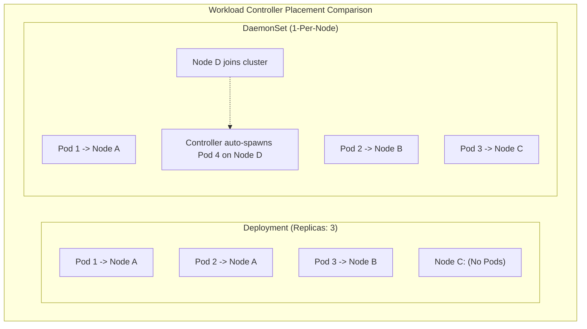
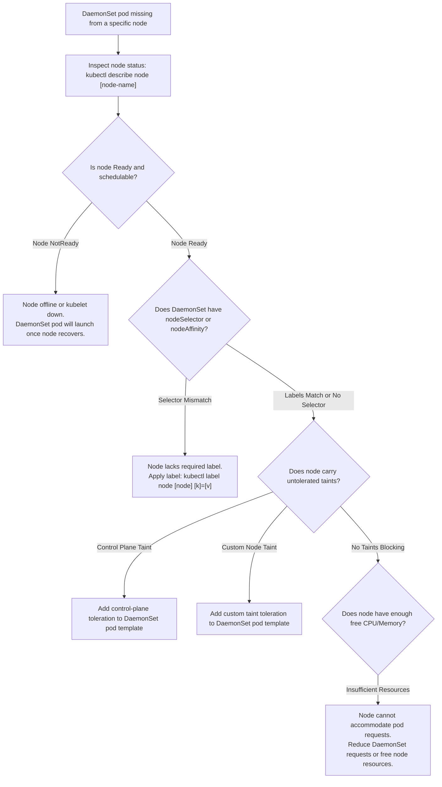

# Kubernetes DaemonSets (`ds`) - CKA Exam Notes

> **Exam Domain**: Scheduling (15%) / Workloads & Scheduling (15%)  
> **Weight / Importance**: High (Core workload controller tested in cluster management, logging, monitoring, and CNI networking questions)  
> **Target Version**: Verified against v1.31 / v1.32 (Current CKA Curriculum)  
> **Allowed Docs Search Keywords**: `DaemonSet`, `daemonsets`, `kube-proxy daemonset`  
> **Source**: Generated from `scheduling/07-daemon-sets-raw.md`

---

## 1. Quick-Reference Summary

- **Primary Role of a DaemonSet**: Ensures that **all (or a specific subset of) nodes** run exactly **one copy of a Pod**.
- **Lifecycle Integration**:
  - As new nodes join the cluster, the DaemonSet controller automatically provisions a Pod onto them.
  - As nodes are drained or removed from the cluster, those Pods are automatically garbage collected.
  - Deleting a DaemonSet terminates all Pods it created across all nodes.
- **Short Name**: `ds` (e.g., `kubectl get ds -A`).
- **Core Production Use Cases**:
  - Cluster networking: `kube-proxy`, CNI agent pods (`calico-node`, `cilium`, `flannel`).
  - Node monitoring: Prometheus `node-exporter`, `datadog-agent`.
  - Log collection: `fluentd`, `promtail`, `logstash`.
  - Cluster storage daemons: `ceph`, `glusterd`.
- **The Golden CKA Exam Trap**:
  - **There is NO imperative `kubectl create daemonset` command!**
  - **Fastest Exam Generation Pattern**:
    1. Generate a Deployment scaffold:
       ```bash
       kubectl create deployment my-ds --image=nginx --dry-run=client -o yaml > ds.yaml
       ```
    2. Edit `ds.yaml`: Change `kind: Deployment` to `kind: DaemonSet`.
    3. Remove `spec.replicas` and `spec.strategy` (DaemonSets do not use replicas).
    4. Apply: `kubectl apply -f ds.yaml`.
- **Modern Scheduling Mechanics (v1.12+)**:
  - Rather than hardcoding `spec.nodeName`, the DaemonSet controller uses `kube-scheduler` with automatically injected default **Node Affinity** rules (`kubernetes.io/hostname`).
  - DaemonSet pods automatically receive default tolerations for node pressure and unreadiness taints (`unschedulable`, `disk-pressure`, `memory-pressure`, `not-ready`).

---

## 2. Conceptual Overview & Mental Model

### Dual-Layer Architectural Understanding

- **Simple English Explanation (How It Works)**:
  - **Headcount Management vs. Node Coverage**:
    A `ReplicaSet` or `Deployment` is designed for application scalability: you ask for 5 replicas, and `kube-scheduler` places those 5 Pods wherever compute capacity is available (potentially placing 3 on node1, 2 on node2, and 0 on node3).
    However, system infrastructure daemons (such as log forwarders or network proxies) do not care about arbitrary headcount; they must be physically present on **every single host** in order to interface with that host's Linux kernel network namespaces or scrape `/var/log` on the host root filesystem.
  - **How the DaemonSet Controller Operates**:
    The DaemonSet controller continuously watches `kube-apiserver` for node lifecycle events:
    1. When a new worker node joins the cluster, the controller notices the new node record.
    2. It creates a Pod specification targeted at that specific node and submits it to `kube-apiserver`.
    3. The default `kube-scheduler` evaluates the Pod and places it on the target node.
    4. If a node is decommissioned and deleted, the corresponding DaemonSet pod is cleaned up automatically.
  - **Targeting a Subset of Nodes**:
    A DaemonSet is not required to run on *every* node. By declaring a `nodeSelector` or `nodeAffinity` inside the Pod template, you can configure the DaemonSet to run only on nodes satisfying specific criteria (for example, running a GPU monitoring daemon exclusively on nodes labeled with `gpu=true`).



- **Standard / Production Definition**:
  - **DaemonSet**: A specialized Kubernetes workload controller (`apps/v1`) that ensures a single instance of a Pod runs on all (or qualifying) nodes in a cluster. As nodes are added or removed dynamically, the DaemonSet controller adjusts the active Pod topology to maintain complete host coverage for host-level monitoring, storage, and networking daemons.

---

## 3. Deep-Dive Technical Breakdown

### 3.1 Evolution of DaemonSet Scheduling

The internal mechanism used by DaemonSets underwent a major architectural redesign:

| Era | Scheduling Mechanism | Architectural Flaw / Benefit |
| :--- | :--- | :--- |
| **Legacy (Pre-v1.12)** | Controller explicitly hardcoded `spec.nodeName: <node>` on each Pod. | **Bypassed `kube-scheduler` completely**. Ignored pod priority preemption, custom scheduler plugins, and standard cluster scheduling policies. |
| **Modern (v1.12+ / Current)** | Controller leaves `spec.nodeName` unset and injects **Node Affinity** (`kubernetes.io/hostname`). | **Fully scheduled by `kube-scheduler`**. Respects node resource requests, priority classes, and scheduler plugins while maintaining host binding. |

### 3.2 Automatic System Tolerations

To ensure critical cluster daemons (such as CNI plugins and monitoring agents) can start during node bootstrapping, Kubernetes automatically injects default tolerations into all DaemonSet pods:

```yaml
tolerations:
- key: "node.kubernetes.io/not-ready"
  operator: "Exists"
  effect: "NoExecute"
- key: "node.kubernetes.io/unreachable"
  operator: "Exists"
  effect: "NoExecute"
- key: "node.kubernetes.io/disk-pressure"
  operator: "Exists"
  effect: "NoSchedule"
- key: "node.kubernetes.io/memory-pressure"
  operator: "Exists"
  effect: "NoSchedule"
- key: "node.kubernetes.io/pid-pressure"
  operator: "Exists"
  effect: "NoSchedule"
- key: "node.kubernetes.io/unschedulable"
  operator: "Exists"
  effect: "NoSchedule"
```

> [!NOTE]
> Because of `node.kubernetes.io/unschedulable:NoSchedule`, when you cordon a node (`kubectl cordon <node>`), regular application Pods are blocked from scheduling, but **DaemonSet pods are still allowed to schedule**.

---

### 3.3 Running DaemonSets on Control Plane Nodes

By default, control plane nodes carry a taint preventing general workloads from scheduling:
```text
node-role.kubernetes.io/control-plane:NoSchedule
```

If a DaemonSet (such as a cluster-wide monitoring agent or CNI plugin) must also run on control plane nodes, you **must explicitly add a toleration** to the DaemonSet's `spec.template.spec`:

```yaml
spec:
  template:
    spec:
      tolerations:
      - key: node-role.kubernetes.io/control-plane
        operator: Exists
        effect: NoSchedule
      # Legacy fallback for older clusters:
      - key: node-role.kubernetes.io/master
        operator: Exists
        effect: NoSchedule
```

---

## 4. Declarative Manifests & Scaffolding Patterns

### Converting a Deployment Scaffold to a DaemonSet

Because `kubectl create daemonset` does not exist, use this 3-step generation workflow:

#### Step 1: Imperative Scaffold
```bash
kubectl create deployment monitoring-daemon --image=monitoring-agent:v1 --dry-run=client -o yaml > ds.yaml
```

#### Step 2: Edit Manifest (`ds.yaml`)
1. Change `kind: Deployment` to `kind: DaemonSet`.
2. Remove `spec.replicas: 1`.
3. Remove `spec.strategy` block (if present).

#### Final Manifest (`ds.yaml`):
```yaml
apiVersion: apps/v1
kind: DaemonSet
metadata:
  name: monitoring-daemon
  namespace: kube-system
  labels:
    app: monitoring-agent
spec:
  selector:
    matchLabels:
      app: monitoring-agent
  template:
    metadata:
      labels:
        app: monitoring-agent
    spec:
      containers:
      - name: monitoring-agent
        image: monitoring-agent:v1
        resources:
          requests:
            cpu: 100m
            memory: 64Mi
          limits:
            cpu: 200m
            memory: 128Mi
```

#### Step 3: Apply
```bash
kubectl apply -f ds.yaml
```

---

## 5. Command Translation & Operational Mapping Tables

### Comparing Workload Controllers

| Controller | Replicas Strategy | Scheduling Mechanism | Main Production Use Case |
| :--- | :--- | :--- | :--- |
| **`Deployment`** | Arbitrary headcount (`spec.replicas`) | `kube-scheduler` based on capacity | Stateless web apps, APIs, microservices. |
| **`ReplicaSet`** | Arbitrary headcount (`spec.replicas`) | `kube-scheduler` based on capacity | Low-level pod replication (managed by Deployments). |
| **`DaemonSet`** | Exactly 1 per node (or qualifying subset) | `kube-scheduler` + Node Affinity | Node logging, monitoring, CNI networking, storage. |
| **`Static Pod`** | Exactly 1 on specific host | `kubelet` directly from manifest dir | Control plane bootstrapping (`apiserver`, `etcd`). |

---

## 6. High-Yield CLI & Verification Commands

```bash
# 1. View all DaemonSets in the current namespace
kubectl get daemonsets

# 2. View all DaemonSets across all namespaces
kubectl get ds -A

# 3. Inspect a specific DaemonSet's node scheduling status
kubectl describe ds monitoring-daemon -n kube-system

# 4. View which nodes are currently running the DaemonSet pods
kubectl get pods -n kube-system -l app=monitoring-agent -o wide

# 5. Check rollout status of a DaemonSet update
kubectl rollout status ds/monitoring-daemon -n kube-system

# 6. Roll back a failed DaemonSet update
kubectl rollout undo ds/monitoring-daemon -n kube-system
```

---

## 7. Troubleshooting & Diagnostic Runbook

### Decision Tree: Troubleshooting Missing DaemonSet Pods



### Step-by-Step Triage Sequence

1. **Verify Desired vs. Current Count**:
   ```bash
   kubectl get ds <ds-name> -n <namespace>
   ```
   Compare:
   - `DESIRED`: Number of nodes matching the DaemonSet's nodeSelector.
   - `CURRENT`: Number of pods currently created.
   - `READY`: Number of pods reporting healthy.
   - `NODE SELECTOR`: Label selector restricting node placement.

2. **Diagnose Why a Pod is Not Scheduled on a Node**:
   If `DESIRED` is less than total nodes, check if the DaemonSet defines a `nodeSelector` (`kubectl get ds <name> -o yaml | grep -A 3 nodeSelector`).
   If `CURRENT` is less than `DESIRED`, check `kube-scheduler` events:
   ```bash
   kubectl get events -n <namespace> --sort-by=.metadata.creationTimestamp
   ```

---

## 8. CKA Exam Tips, Gotchas & Traps

> [!WARNING]
> **The `kubectl create daemonset` Illusion**:
> There is no command `kubectl create daemonset <name>`. Candidates who panic and spend minutes searching `kubectl create -h` waste critical exam time. Remember the CKA shortcut: create a deployment imperatively with `--dry-run=client -o yaml`, edit `kind: DaemonSet`, delete `replicas`, and apply.

> [!IMPORTANT]
> **The `replicas` Schema Validation Error**:
> A DaemonSet's schema **does not contain the `replicas` field**. If you convert a Deployment YAML into a DaemonSet and forget to delete `replicas: 1`, `kubectl apply` will fail with:
> `error: error validating "": error finding REST mapping: unknown field "replicas" in io.k8s.api.apps.v1.DaemonSetSpec`.

> [!TIP]
> **Deploying DaemonSets on Control Plane Nodes**:
> If an exam question specifies: *"Deploy a daemonset that must run on all nodes including the control plane"*, you must add the toleration for `node-role.kubernetes.io/control-plane:NoSchedule` (and legacy `node-role.kubernetes.io/master:NoSchedule`) in `spec.template.spec.tolerations`.

---

## 9. Self-Test / Active Recall

1. **What is the primary operational difference between a `Deployment` and a `DaemonSet`?**
2. **Is there an imperative `kubectl create daemonset` command? What is the recommended workaround?**
3. **What happens to DaemonSet pods when a worker node is drained and removed from the cluster?**
4. **How can you configure a DaemonSet to run only on nodes equipped with SSD storage?**
5. **Why can DaemonSet pods be scheduled onto cordoned nodes (`unschedulable:NoSchedule`) by default?**
6. **If a DaemonSet must run on control plane nodes, what configuration must be added to its Pod template?**
7. **What is the short name for DaemonSets in `kubectl`?**

<details>
<summary>Reveal Answers</summary>

1. A Deployment maintains an arbitrary headcount of replicas across eligible nodes in the cluster. A DaemonSet guarantees that exactly one copy of the Pod runs on every qualifying node.
2. No. Generate a Deployment YAML using `kubectl create deployment <name> --image=<image> --dry-run=client -o yaml`, change `kind` to `DaemonSet`, delete `spec.replicas`, and apply.
3. The DaemonSet pods running on that node are automatically terminated and garbage collected.
4. Add a `nodeSelector` (e.g. `disk: ssd`) or `nodeAffinity` under `spec.template.spec` matching the node's labels.
5. Because Kubernetes automatically injects a default toleration for `node.kubernetes.io/unschedulable:NoSchedule` into all DaemonSet pods.
6. A toleration for `node-role.kubernetes.io/control-plane:NoSchedule` (and legacy `master:NoSchedule`) under `spec.template.spec.tolerations`.
7. `ds` (e.g., `kubectl get ds`).
</details>

---

### Official Documentation Bookmarks

Allowed for reference during the live exam at [kubernetes.io/docs](https://kubernetes.io/docs/home/):

| Topic | Direct Search Term | Recommended Anchor |
| :--- | :--- | :--- |
| **DaemonSet Reference** | `DaemonSet` | Concepts > Workloads > Controllers > DaemonSet |
| **Writing a DaemonSet Spec** | `Writing a DaemonSet Spec` | Concepts > Workloads > Controllers > DaemonSet > Writing a DaemonSet Spec |
| **Communicating with Daemon Pods** | `DaemonSet patterns` | Concepts > Workloads > Controllers > DaemonSet > Communicating with Daemon Pods |
