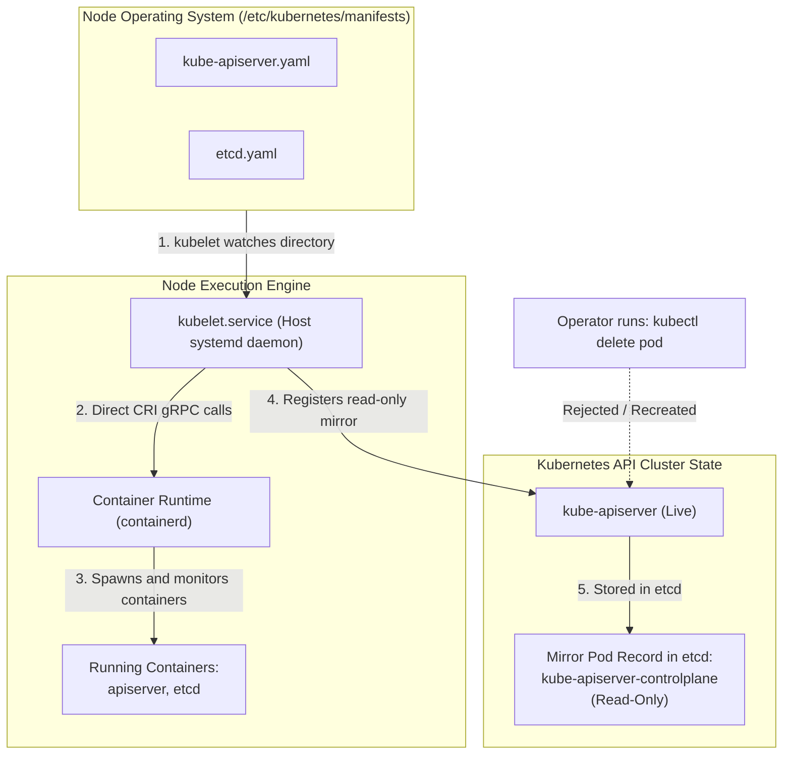
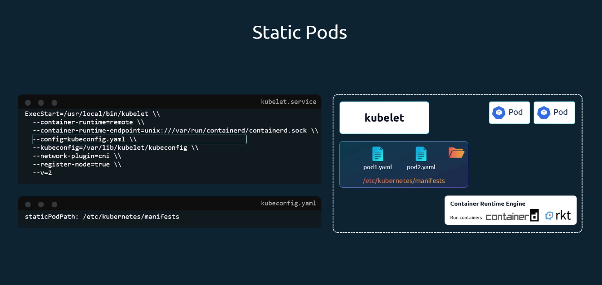
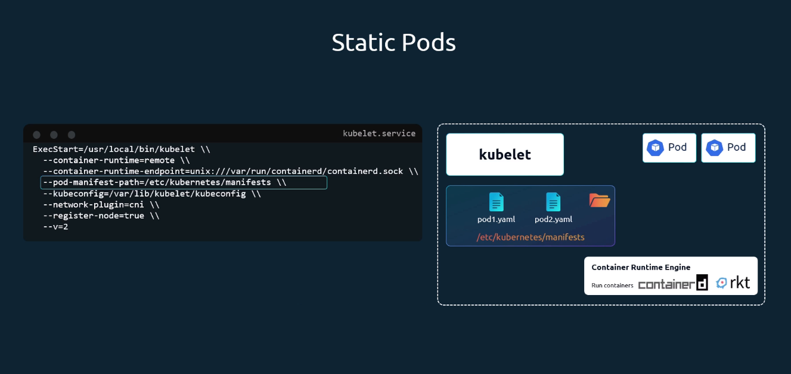
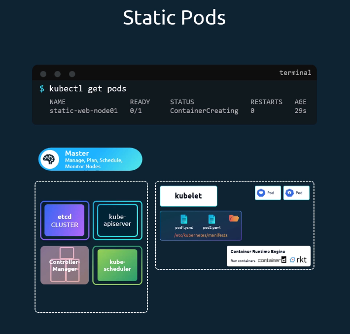
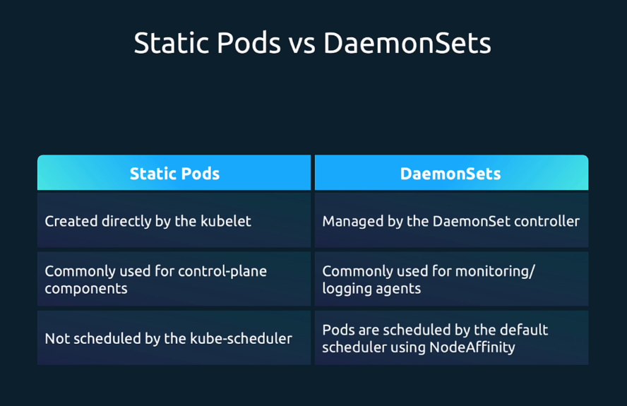
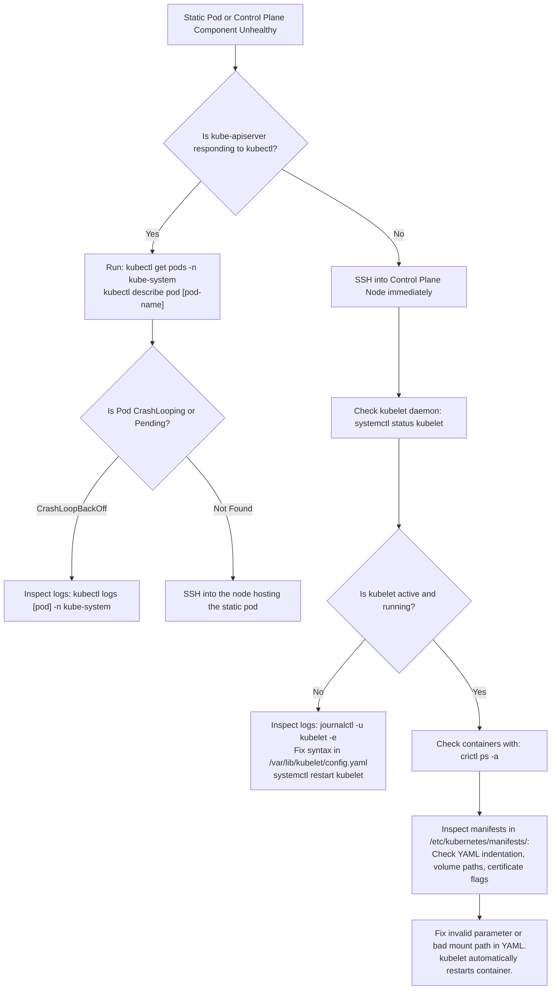

# Kubernetes Static Pods & Mirror Pods - CKA Exam Notes

> **Exam Domain**: Scheduling (15%) / Cluster Architecture, Installation & Configuration (25%) / Troubleshooting (30%)  
> **Weight / Importance**: Critical (The foundation of Kubernetes control plane bootstrapping and a guaranteed practical exam topic)  
> **Target Version**: Verified against v1.31 / v1.32 (Current CKA Curriculum)  
> **Allowed Docs Search Keywords**: `Static Pods`, `staticPodPath`, `crictl`, `kubelet configuration`  
> **Source**: Generated from `scheduling/08-static-pods-raw.md`

---

## 1. Quick-Reference Summary

- **Primary Role of Static Pods**: Pods managed **directly by the `kubelet` daemon** on a specific node, completely independent of the Kubernetes control plane (`kube-apiserver`, `kube-scheduler`, and controllers).
- **Core Bootstrapping Function**:
  - Solves the chicken-and-egg initialization problem: `kubeadm` uses `kubelet` to run `etcd`, `kube-apiserver`, `kube-controller-manager`, and `kube-scheduler` as static pods on the control plane node.
- **Where Defined**:
  - In a designated local directory on the host filesystem:
    ```text
    /etc/kubernetes/manifests/
    ```
- **Lifecycle Management**:
  - `kubelet` periodically scans this directory:
    - Adding a YAML file -> `kubelet` creates and runs the Pod.
    - Modifying a YAML file -> `kubelet` restarts/recreates the Pod.
    - Removing a YAML file -> `kubelet` terminates and deletes the Pod.
- **Mirror Pods in `kube-apiserver`**:
  - Once the control plane is active, `kubelet` registers a **read-only Mirror Pod** with `kube-apiserver`.
  - Name format: `<pod-name>-<node-hostname>` (e.g., `kube-apiserver-controlplane`).
  - **Cannot be deleted or edited via `kubectl`**: Running `kubectl delete pod` only deletes the mirror object temporarily; `kubelet` continues running the container and recreates the mirror. You **must delete the file on the node host** to remove it.
- **Container Runtime Truth**:
  - In modern Kubernetes (v1.24+ / v1.31 / v1.32), `dockershim` is removed.
  - **Do NOT use `docker ps`**. Use **`crictl ps`** and **`crictl logs`** to inspect static pod containers directly on the host.

---

## 2. Conceptual Overview & Mental Model

### Dual-Layer Architectural Understanding

- **Simple English Explanation (How It Works)**:
  - **The Control Plane Bootstrapping Dilemma**:
    In Kubernetes, Pods are normally scheduled by `kube-scheduler` and coordinated by `kube-apiserver`. But what runs the API server, scheduler, and database (`etcd`) in the first place? If you needed an API server to create a Pod, you could never run the API server as a Pod.
  - **How Static Pods Solve This**:
    The `kubelet` is an independent agent running as a systemd service directly on the Linux host operating system. The `kubelet` possesses native intelligence to launch and supervise containers via the Container Runtime Interface (`containerd`).
    By pointing `kubelet` to a local folder (`/etc/kubernetes/manifests`), `kubelet` reads the raw YAML manifests directly from the disk and commands `containerd` to launch the containers locally.
  - **The Mirror Pod Mechanism**:
    Once `kube-apiserver` starts running, the `kubelet` reaches out to the API server and creates a shadow copy of the static pod known as a **Mirror Pod**. This mirror pod allows cluster administrators to run `kubectl get pods -n kube-system`, view container logs, and inspect events through standard Kubernetes tooling, even though the control plane has no scheduling authority over the pod.



- **Standard / Production Definition**:
  - **Static Pod**: A Pod managed directly by the `kubelet` daemon without control plane supervision. The `kubelet` monitors a specific local directory (defined by `staticPodPath` in the kubelet configuration file) or HTTP endpoint, directly commanding the local CRI runtime to reconcile the container execution state with the on-disk YAML specification.
  - **Mirror Pod**: A read-only representation of a static pod registered with the Kubernetes API server by `kubelet`. It exposes static pod status to cluster observers while rejecting mutation and deletion operations attempted through the API.

---

## 3. Deep-Dive Technical Breakdown

### 3.1 Ways to Configure the Static Pod Path

The `kubelet` can be configured to watch static manifests via two mechanisms:

#### 1. Via Configuration File (Modern Kubeadm Standard)


In modern Kubernetes clusters, `kubelet.service` passes the `--config` parameter:
```text
ExecStart=/usr/bin/kubelet --config=/var/lib/kubelet/config.yaml
```
Inside `/var/lib/kubelet/config.yaml`, the static pod directory is declared under `staticPodPath`:
```yaml
apiVersion: kubelet.config.k8s.io/v1beta1
kind: KubeletConfiguration
staticPodPath: /etc/kubernetes/manifests
```

#### 2. Via Direct CLI Flag (Legacy / Custom Deployments)


The path can also be passed directly to the `kubelet` command line in `/etc/systemd/system/kubelet.service.d/10-kubeadm.conf`:
```text
--pod-manifest-path=/etc/kubernetes/manifests
```

---

### 3.2 How to Identify the Static Pod Path on Any Node (Exam Technique)

When given a node in the CKA exam and asked to deploy or debug a static pod:

#### Step 1: Check the Active Kubelet Process
```bash
ps aux | grep kubelet
```
Look for `--pod-manifest-path` or `--config`.

#### Step 2: Extract the Path from `config.yaml`
If `--config` points to `/var/lib/kubelet/config.yaml`:
```bash
grep -i staticpodpath /var/lib/kubelet/config.yaml
```
*Output*:
```text
staticPodPath: /etc/kubernetes/manifests
```

---

### 3.3 The Mirror Pod Lifecycle



When `kubectl get pods -A` is executed, static pods are visible alongside standard workloads:
```text
NAMESPACE     NAME                                    READY   STATUS    RESTARTS   AGE
kube-system   etcd-controlplane                       1/1     Running   0          10m
kube-system   kube-apiserver-controlplane             1/1     Running   0          10m
kube-system   kube-controller-manager-controlplane    1/1     Running   0          10m
kube-system   kube-scheduler-controlplane             1/1     Running   0          10m
default       static-web-node01                       1/1     Running   0          45s
```

#### Key Characteristics of Mirror Pods:
1. **Naming Suffix**: The node hostname is automatically appended to the pod name (e.g., `static-web-node01`).
2. **OwnerReferences**: In `kubectl get pod static-web-node01 -o yaml`, the pod has **no `ownerReferences`** or higher-level controller controllers (`Node` is indicated under `spec.nodeName`).
3. **Deletion Resistance**:
   ```bash
   kubectl delete pod static-web-node01
   ```
   The API server returns `pod "static-web-node01" deleted`. However, within seconds, the `kubelet` detects that its mirror object is missing and automatically re-creates it in the API server. The actual container process on `node01` never stops running.

---

### 3.4 Static Pods vs. DaemonSets



| Dimension | Static Pod | DaemonSet |
| :--- | :--- | :--- |
| **Managing Entity** | Local `kubelet` daemon on the specific host | `DaemonSet` controller (inside `kube-controller-manager`) |
| **API Server Dependency** | **None** (Can run without any API server) | **Mandatory** (Managed via Kubernetes API) |
| **Scheduler Dependency** | **Bypasses `kube-scheduler` completely** | Scheduled by `kube-scheduler` via Node Affinity |
| **Creation Method** | Dropping a YAML file into `/etc/kubernetes/manifests/` | Applying a manifest via `kubectl apply -f ds.yaml` |
| **Deletion Method** | Deleting the YAML file from the host filesystem | `kubectl delete ds <name>` |
| **Standard Use Case** | Control plane bootstrapping (`etcd`, `apiserver`) | Monitoring agents, logging daemons, CNI network plugins |

---

## 4. Declarative Manifests & Scaffolding Patterns

### Creating a Static Pod Imperatively (Exam Workflow)

To create a static pod on a worker node named `node01`:

#### Step 1: SSH into the Target Node
```bash
ssh node01
```

#### Step 2: Determine Static Pod Directory
```bash
grep -i staticpodpath /var/lib/kubelet/config.yaml
# Assume: /etc/kubernetes/manifests
```

#### Step 3: Scaffold the Pod Manifest Directly into the Directory
Use `kubectl run` with `--dry-run=client -o yaml` to avoid syntax errors:
```bash
kubectl run static-web --image=nginx:alpine --port=80 --dry-run=client -o yaml > /etc/kubernetes/manifests/static-web.yaml
```

#### Step 4: Verify Local Container Execution via `crictl`
```bash
crictl ps | grep static-web
```

---

## 5. Command Translation & Operational Mapping Tables

### Container Inspection Tool Mapping (Host Level)

| Task | Legacy (Deprecated / Removed) | Modern CKA Standard (`containerd`) |
| :--- | :--- | :--- |
| **List Running Containers** | `docker ps` | `crictl ps` |
| **List All Containers** | `docker ps -a` | `crictl ps -a` |
| **Inspect Container Logs** | `docker logs <id>` | `crictl logs <id>` |
| **List Local Pod Sandboxes** | N/A | `crictl pods` |
| **View Kubelet Daemon Logs** | `journalctl -u kubelet` | `journalctl -u kubelet -f` |

---

## 6. High-Yield CLI & Verification Commands

```bash
# 1. Discover staticPodPath on the local node
grep -i staticpodpath /var/lib/kubelet/config.yaml

# 2. View all containers managed by containerd via CRI
crictl ps

# 3. View container logs directly on the node (critical when kube-apiserver is down)
crictl logs $(crictl ps -q --name kube-apiserver)

# 4. Filter static mirror pods from cluster view
kubectl get pods -A -o wide | grep controlplane

# 5. Check kubelet service health and configuration errors
systemctl status kubelet
journalctl -u kubelet -n 50 --no-pager

# 6. Delete a static pod safely
rm /etc/kubernetes/manifests/static-web.yaml
```

---

## 7. Troubleshooting & Diagnostic Runbook

### Decision Tree: Troubleshooting Static Pods and Control Plane Outages



### Step-by-Step Triage Sequence

1. **When `kubectl` Fails to Connect (`connection refused`)**:
   - The `kube-apiserver` static pod is down.
   - SSH directly to the control plane node.
   - Run `crictl ps -a | grep apiserver`.
   - If exited, run `crictl logs <container-id>` to view the fatal startup error (common causes: expired certificates, bad flags, corrupted etcd endpoints).

2. **Accidental Backup Files in `/etc/kubernetes/manifests/`**:
   - `kubelet` parses **every file** in the directory.
   - If you copy `kube-apiserver.yaml` to `kube-apiserver.yaml.bak`, `kubelet` will attempt to launch **two conflicting instances** of the API server, binding to the same port 6443 and causing both to crash!
   - Always store backups outside `/etc/kubernetes/manifests/` (e.g., in `/root/` or `/tmp/`).

---

## 8. CKA Exam Tips, Gotchas & Traps

> [!WARNING]
> **The Backup File Collision Trap**:
> When modifying a control plane static pod (e.g. adding admission controllers to `kube-apiserver.yaml`), **never** create a backup file like `kube-apiserver.yaml.old` inside `/etc/kubernetes/manifests/`. `kubelet` treats any file in that directory as an active pod manifest, creating duplicate static pods that fail with port collision errors. Always store backups in `/tmp/` or `/root/`.

> [!IMPORTANT]
> **Do NOT Use `docker ps` in Current Exams**:
> Docker has been replaced by `containerd` as the standard runtime across all CKA exam clusters. If you need to inspect containers on the node directly, always use `crictl ps`, `crictl pods`, and `crictl logs`.

> [!TIP]
> **Identifying Which Node Hosts a Static Pod**:
> Look at the mirror pod name: the trailing part of the name is always the exact hostname of the node hosting the static pod:
> `my-app-worker-1` -> Hosted on `worker-1` in its `/etc/kubernetes/manifests/` directory.

---

## 9. Self-Test / Active Recall

1. **What component is responsible for creating and supervising static pods?**
2. **Where does `kubeadm` configure the static pod manifest directory by default?**
3. **If you execute `kubectl delete pod kube-apiserver-controlplane -n kube-system`, what happens to the API server container?**
4. **How do you permanently delete a static pod from a worker node?**
5. **What CLI tool should be used to inspect container status on a node when `kube-apiserver` is completely offline?**
6. **Why is it dangerous to create a backup file named `etcd.yaml.bak` inside `/etc/kubernetes/manifests/`?**
7. **What is the difference between a static pod and a DaemonSet regarding control plane dependency?**

<details>
<summary>Reveal Answers</summary>

1. The node-level `kubelet` daemon.
2. `/etc/kubernetes/manifests/` (configured via `staticPodPath` in `/var/lib/kubelet/config.yaml`).
3. The mirror pod object is deleted from the API server momentarily, but the `kubelet` continues running the container uninterrupted and immediately recreates the mirror pod.
4. SSH into the node and remove the YAML manifest file from the static pod directory (e.g., `rm /etc/kubernetes/manifests/<pod>.yaml`).
5. `crictl ps` (and `crictl logs <container-id>`).
6. Because `kubelet` parses all files in that directory and will attempt to create a second, duplicate static pod instance, causing port and resource conflicts.
7. A static pod has zero dependency on the control plane and is managed by `kubelet`. A DaemonSet requires `kube-apiserver` and `kube-scheduler` to manage and place pods across nodes.
</details>

---

### Official Documentation Bookmarks

Allowed for reference during the live exam at [kubernetes.io/docs](https://kubernetes.io/docs/home/):

| Topic | Direct Search Term | Recommended Anchor |
| :--- | :--- | :--- |
| **Static Pods** | `Static Pods` | Concepts > Workloads > Pods > Static Pods |
| **Kubelet Configuration** | `KubeletConfiguration` | Reference > Config API > kubelet Configuration (v1beta1) |
| **Debugging with Crictl** | `crictl` | Tasks > Debug Tools > Debugging Kubernetes nodes with crictl |
