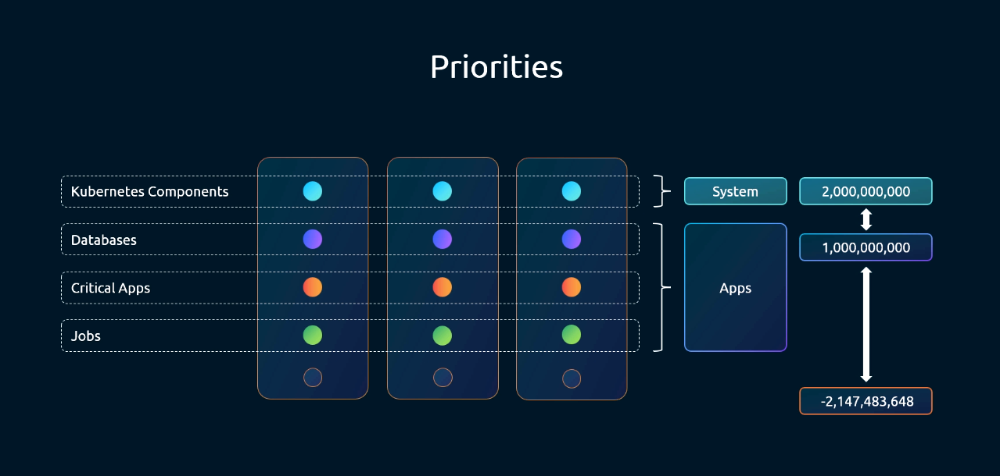
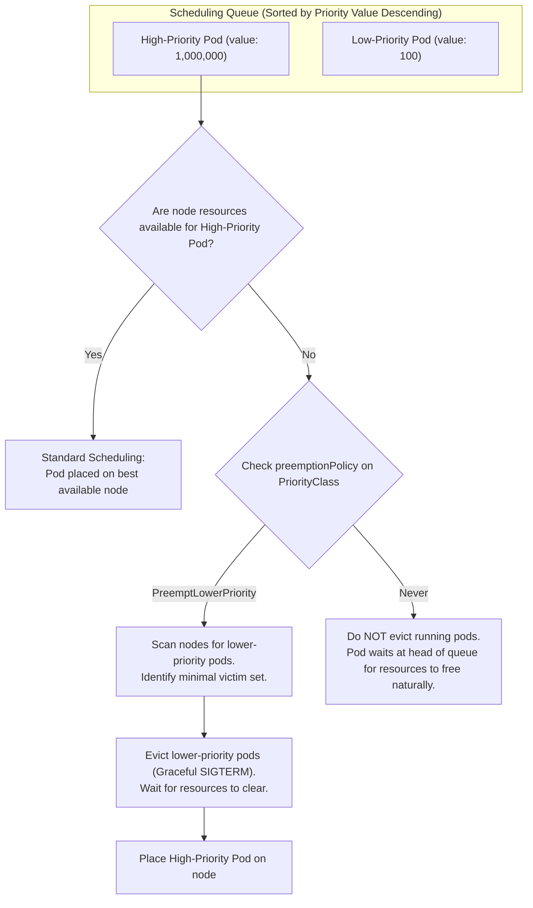
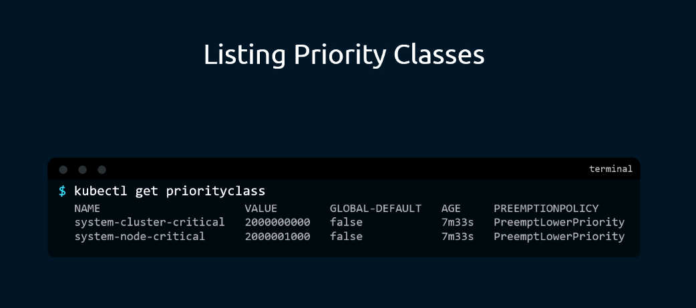
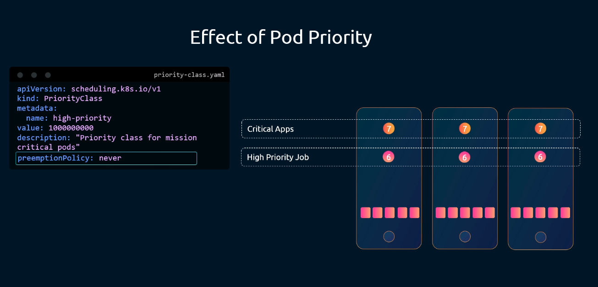
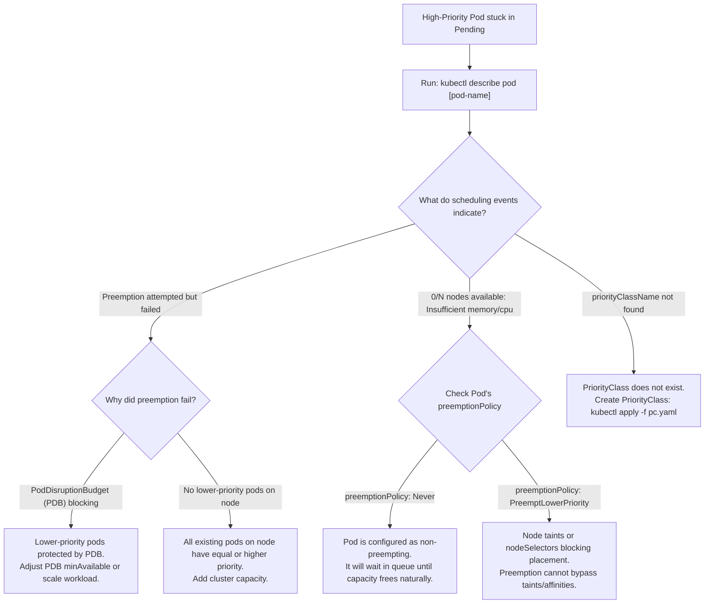

# Kubernetes Pod Priority & PriorityClasses - CKA Exam Notes

> **Exam Domain**: Scheduling (15%) / Troubleshooting (30%)  
> **Weight / Importance**: High (Key scheduling mechanism for ensuring critical workloads obtain compute resources over low-priority batch jobs)  
> **Target Version**: Verified against v1.31 / v1.32 (Current CKA Curriculum)  
> **Allowed Docs Search Keywords**: `Pod Priority and Preemption`, `PriorityClass`, `preemptionPolicy`, `system-cluster-critical`  
> **Source**: Generated from `scheduling/09-priority-classes-raw.md`

---

## 1. Quick-Reference Summary

- **Primary Role of PriorityClass**: Assigns an integer weight to Pods that dictates their placement ordering in the scheduling queue and governs whether they can **preempt (evict)** lower-priority workloads when node resources are exhausted.
- **API Group & Scope**:
  - `apiVersion: scheduling.k8s.io/v1`
  - `kind: PriorityClass`
  - **Cluster-Scoped (Non-Namespaced)**: A PriorityClass is available to Pods across all namespaces in the cluster.
- **Priority Value Hierarchy**:
  - Higher numeric value = Higher scheduling priority.
  - **User-Defined Applications**: Can range from $-2,147,483,648$ to $+1,000,000,000$ (maximum 1 billion).
  - **System-Reserved Applications**: Values between $1,000,000,000$ and $2,000,001,000$ are reserved for built-in Kubernetes system components:
    - `system-cluster-critical` (`value: 2000000000`)
    - `system-node-critical` (`value: 2000001000`)
- **Default Priority**:
  - If a Pod omits `spec.priorityClassName`, its priority value is **`0`**.
  - Setting `globalDefault: true` on one PriorityClass establishes a cluster-wide default for pods without an explicit class.
- **Preemption Policy (`preemptionPolicy`)**:
  - **`PreemptLowerPriority` (Default)**: If node resources are exhausted, the scheduler will terminate (evict) running lower-priority Pods to free up capacity for the incoming Pod.
  - **`Never` (Non-Preempting)**: The Pod will not evict any running pods. It waits patiently in the scheduling queue, but jumps ahead of lower-priority pending pods.
- **Immutability Constraint**:
  - A Pod's `spec.priorityClassName` is **strictly immutable** once created. To change priority, you must delete and recreate the Pod.

---

## 2. Conceptual Overview & Mental Model

### Dual-Layer Architectural Understanding

- **Simple English Explanation (How It Works)**:
  - **The Resource Exhaustion Dilemma**:
    In a Kubernetes cluster running diverse workloads, compute resources (CPU and memory) can become fully committed. If an unexpected traffic surge occurs or a critical production database crashes and needs to restart, `kube-scheduler` might find zero nodes with available allocatable capacity.
    Without priority controls, your mission-critical database would be trapped in `Pending` alongside background data analytics jobs.
  - **How PriorityClasses Resolve This**:
    Kubernetes introduces a two-stage scheduling priority pipeline:
    1. **Queue Ordering**: When multiple Pods are waiting in the scheduling queue, the scheduler sorts them by their `priority` integer in descending order. Higher-priority pods are evaluated for node placement first.
    2. **Preemption (Eviction of Lower-Priority Pods)**: If a high-priority Pod arrives and no node has sufficient free capacity to satisfy its `requests`, the scheduler looks for nodes where evicting lower-priority Pods would clear enough room. Once a candidate node is identified, the scheduler issues graceful termination signals (`SIGTERM`) to the low-priority pods, frees the allocatable capacity, and binds the high-priority Pod.





- **Standard / Production Definition**:
  - **PriorityClass**: A cluster-scoped API resource that decouples workload scheduling importance from individual pod definitions. By mapping a human-readable identifier to an integer weight, PriorityClasses drive scheduler queue sorting and invoke the preemption reconciliation loop, which evicts lower-priority workloads when aggregate cluster capacity cannot accommodate high-priority resource requests.

---

## 3. Deep-Dive Technical Breakdown

### 3.1 Priority Value Ranges & Built-in Classes

The 32-bit signed integer value dictates scheduling order:

| Tier / Range | Numerical Boundary | Intended Workloads | Example PriorityClasses |
| :--- | :--- | :--- | :--- |
| **System Critical** | `1,000,000,000` to `2,000,001,000` | Reserved exclusively for Kubernetes system components. User pods cannot declare classes in this range unless authorized. | `system-cluster-critical`<br/>`system-node-critical` |
| **User High Priority** | `1,000,000` to `1,000,000,000` | Critical production databases, core APIs, user-facing microservices. | `high-priority`, `production-critical` |
| **Default Priority** | `0` | Default assigned to any Pod that omits `priorityClassName`. | Default baseline |
| **Batch / Low Priority** | Negative integers down to `-2,147,483,648` | Background batch jobs, reporting scripts, non-critical testing pods. | `low-priority`, `batch-workload` |



```bash
kubectl get priorityclass
```
*Output*:
```text
NAME                      VALUE        GLOBAL-DEFAULT   AGE   PREEMPTIONPOLICY
system-cluster-critical   2000000000   false            30d   PreemptLowerPriority
system-node-critical      2000001000   false            30d   PreemptLowerPriority
```

- **`system-node-critical`** ($2{,}000{,}001{,}000$): Used for daemons essential for node functionality (e.g., CNI node plugins like Calico or Cilium).
- **`system-cluster-critical`** ($2{,}000{,}000{,}000$): Used for cluster-wide addons (e.g., CoreDNS).

---

### 3.2 Preemption Policies: `PreemptLowerPriority` vs. `Never`



The `preemptionPolicy` field controls whether a Pod can aggressively seize node capacity from running workloads:

#### 1. `PreemptLowerPriority` (Default)
- When resources are insufficient, the scheduler actively terminates running pods with lower priority values.
- Evicted pods undergo standard graceful shutdown (`terminationGracePeriodSeconds`).
- Ideal for mission-critical production services that must take precedence over dev, stage, or batch workloads.

#### 2. `Never` (Non-Preempting Priority)
- The Pod **will never evict** another running pod, even if the running pod has a much lower priority.
- Instead, the non-preempting Pod waits in the scheduling queue until node capacity is naturally released by completed jobs or scaled-down pods.
- **Queueing Advantage**: While it does not evict running workloads, it is still prioritized **ahead of all other lower-priority pending pods** in the queue.
- Ideal for high-throughput batch jobs or data processing that should run next in line without disrupting currently executing tasks.

---

### 3.3 The `globalDefault` Attribute

You can configure a PriorityClass to automatically apply to any Pod that does not specify a `priorityClassName`:

```yaml
apiVersion: scheduling.k8s.io/v1
kind: PriorityClass
metadata:
  name: standard-workload
value: 1000
globalDefault: true
description: "Default priority class for all unassigned pods"
```

> [!WARNING]
> At most **one** PriorityClass in the entire cluster can have `globalDefault: true`. If you attempt to apply a second PriorityClass with `globalDefault: true`, the API server will reject it, or existing pods will retain their previous default assignment.

---

## 4. Declarative Manifests & Scaffolding Patterns

### Complete Workflow: PriorityClass and Pod Association

#### Step 1: Declare the PriorityClass (`high-priority.yaml`)
```yaml
apiVersion: scheduling.k8s.io/v1
kind: PriorityClass
metadata:
  name: high-priority
value: 1000000
preemptionPolicy: PreemptLowerPriority
description: "Mission-critical production workloads"
```

#### Step 2: Assign to a Pod Manifest (`pod.yaml`)
```yaml
apiVersion: v1
kind: Pod
metadata:
  name: mission-critical-app
  labels:
    tier: frontend
spec:
  priorityClassName: high-priority      # <-- Links Pod to the PriorityClass
  containers:
  - name: web
    image: nginx:alpine
    resources:
      requests:
        cpu: "1"
        memory: "1Gi"
      limits:
        cpu: "2"
        memory: "2Gi"
```

---

## 5. Command Translation & Operational Mapping Tables

### PriorityClass Specification Fields

| Field | Type | Required? | Allowed Values / Range | Purpose |
| :--- | :--- | :--- | :--- | :--- |
| `metadata.name` | String | **Yes** | Standard DNS subdomain | The unique identifier referenced by `spec.priorityClassName`. |
| `value` | 32-bit int | **Yes** | $\le 1{,}000{,}000{,}000$ for user classes | The numerical priority weight assigned to pods. |
| `globalDefault` | Boolean | Optional | `true` or `false` (default: `false`) | If `true`, applies to all pods lacking a class. (Only 1 per cluster). |
| `preemptionPolicy` | String | Optional | `PreemptLowerPriority`, `Never` | Determines if the pod can evict running workloads. |
| `description` | String | Optional | Free-form text | Human-readable documentation for operators. |

---

## 6. High-Yield CLI & Verification Commands

```bash
# 1. List all PriorityClasses in the cluster
kubectl get priorityclass

# 2. View details and preemption policy of a specific class
kubectl describe priorityclass high-priority

# 3. Compare the priority of all running pods in a namespace
kubectl get pods -o custom-columns="NAME:.metadata.name,PRIORITY_CLASS:.spec.priorityClassName,VALUE:.spec.priority"

# 4. View all pods sorted by numerical priority across all namespaces
kubectl get pods -A --sort-by=.spec.priority

# 5. Check if a pod was evicted due to preemption by inspecting events
kubectl get events --field-selector reason=Preempted
```

---

## 7. Troubleshooting & Diagnostic Runbook

### Decision Tree: Troubleshooting Priority & Preemption Failures



### Step-by-Step Triage Sequence

1. **Investigating Preempted (Evicted) Pods**:
   When a lower-priority pod is evicted to make room for a high-priority pod:
   - Run `kubectl describe pod <evicted-pod>`.
   - The events stream will show:
     ```text
     Reason: Preempted
     Message: Preempted by mission-critical-app on node worker-1
     ```

2. **Preemption and PodDisruptionBudgets (PDB)**:
   - `kube-scheduler` attempts to respect PodDisruptionBudgets when selecting preemption victims.
   - However, if evicting a pod would violate a PDB, the scheduler tries to find alternative victims. If no other victims exist, the scheduler will still preempt the victim to guarantee high-priority placement.

3. **Node Taints Block Preemption**:
   - Preemption does **not** bypass node taints or node selectors.
   - If a high-priority pod lacks toleration for a tainted node, the scheduler will **never** consider that node for preemption, even if evicting all pods on that node would free up enough space.

---

## 8. CKA Exam Tips, Gotchas & Traps

> [!WARNING]
> **PriorityClasses are Non-Namespaced**:
> Do not attempt to create a PriorityClass with `-n <namespace>` or look for it within a specific namespace. Running `kubectl get pc -n dev` will simply list all cluster-wide PriorityClasses or cause confusion.

> [!IMPORTANT]
> **The 1 Billion Cap for User Classes**:
> If an exam task asks you to create a PriorityClass, **never set `value` higher than $1,000,000,000$**, unless explicitly instructed to inspect system classes. Values above 1 billion are rejected by `kube-apiserver` with:
> `spec.value: Invalid value: ... must be less than or equal to 1000000000`.

> [!TIP]
> **Priority Classes Cannot Be Modified on Live Pods**:
> If an exam question asks: *"Change the priority class of running pod webapp to high-priority"*, running `kubectl edit pod webapp` will be rejected (`spec: Forbidden`). You must export to YAML, edit `priorityClassName`, and force-replace:
> ```bash
> kubectl get pod webapp -o yaml > webapp.yaml
> # Edit priorityClassName in vim
> kubectl replace --force -f webapp.yaml
> ```

---

## 9. Self-Test / Active Recall

1. **Are PriorityClasses namespaced or cluster-scoped?**
2. **What is the maximum integer value allowed for user-defined PriorityClasses?**
3. **What are the names and values of the two built-in system-critical PriorityClasses in Kubernetes?**
4. **What is the difference between `preemptionPolicy: PreemptLowerPriority` and `preemptionPolicy: Never`?**
5. **If a Pod does not specify `priorityClassName` and no `globalDefault` class exists, what priority value is assigned to it?**
6. **Can a high-priority Pod preempt lower-priority workloads on a node if the high-priority Pod does not tolerate the node's taint?**
7. **What command allows you to view all pods across all namespaces sorted by their priority value?**

<details>
<summary>Reveal Answers</summary>

1. Cluster-scoped (non-namespaced).
2. $1,000,000,000$ (1 billion). Values above 1 billion are reserved for system components.
3. `system-cluster-critical` ($2,000,000,000$) and `system-node-critical` ($2,000,001,000$).
4. `PreemptLowerPriority` allows the pod to evict running lower-priority pods when resources are exhausted. `Never` makes the pod non-preempting: it waits in the scheduling queue without evicting running pods, but jumps ahead of lower-priority pending pods.
5. `0`.
6. No. Preemption does not bypass node taints or node selectors. The node must still be eligible for placement.
7. `kubectl get pods -A --sort-by=.spec.priority`.
</details>

---

### Official Documentation Bookmarks

Allowed for reference during the live exam at [kubernetes.io/docs](https://kubernetes.io/docs/home/):

| Topic | Direct Search Term | Recommended Anchor |
| :--- | :--- | :--- |
| **Pod Priority and Preemption** | `Pod Priority and Preemption` | Concepts > Scheduling, Preemption and Eviction > Pod Priority and Preemption |
| **PriorityClass Configuration** | `PriorityClass` | Concepts > Scheduling > Pod Priority and Preemption > PriorityClass |
| **Non-preempting PriorityClass** | `Non-preempting PriorityClass` | Concepts > Scheduling > Pod Priority and Preemption > Non-preempting PriorityClass |
