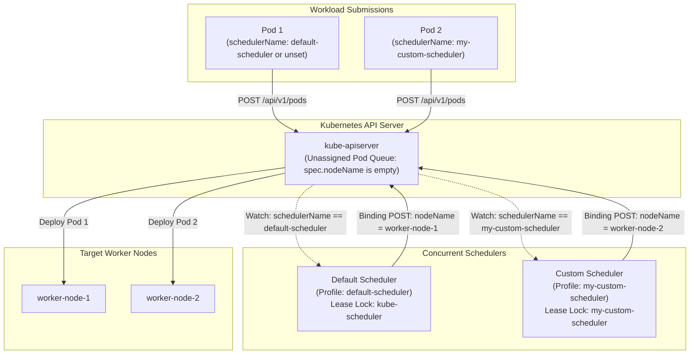
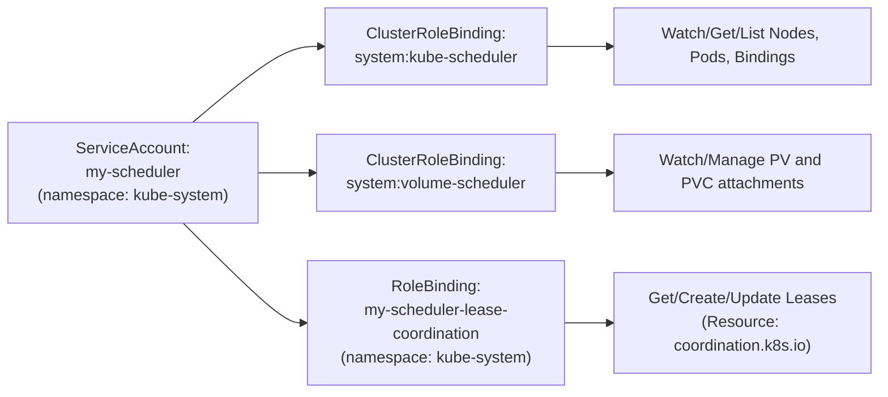
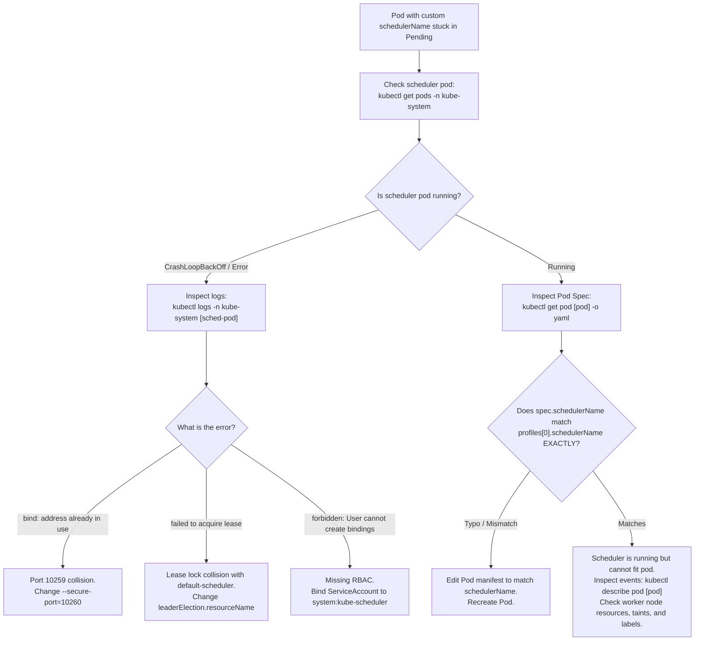

# Kubernetes Multiple Schedulers & Custom Scheduler Deployment - CKA Exam Notes

> **Exam Domain**: Scheduling (15%) / Cluster Architecture, Installation & Configuration (25%)  
> **Weight / Importance**: High (Core CKA scheduling topic testing your ability to deploy, configure, and troubleshoot secondary custom schedulers alongside the default scheduler)  
> **Target Version**: Verified against v1.31 / v1.32 (Current CKA Curriculum)  
> **Allowed Docs Search Keywords**: `Configure Multiple Schedulers`, `KubeSchedulerConfiguration`, `kube-scheduler`, `schedulerName`  
> **Source**: Generated from `scheduling/10-multiple-scheduler-raw.md`

---

## 1. Quick-Reference Summary

- **Multiple Scheduler Architecture**:
  - A Kubernetes cluster can run multiple independent scheduler instances concurrently.
  - Workloads declare which scheduler must place them using the **`spec.schedulerName`** field.
  - If `spec.schedulerName` is omitted in a Pod manifest, the API server automatically sets it to **`default-scheduler`**.
- **Scheduler Identification**:
  - The scheduler process derives its logical name exclusively from its configuration file (**`KubeSchedulerConfiguration`**, field: **`profiles[].schedulerName`**).
  - Every scheduler running in the cluster **must have a distinct `schedulerName`**.
- **Configuration Spec (`kubescheduler.config.k8s.io/v1`)**:
  - Modern Kubernetes uses `apiVersion: kubescheduler.config.k8s.io/v1` (legacy `v1beta1`, `v1beta2`, `v1beta3` are deprecated/removed).
  - Passed to the binary via the flag: `--config=/path/to/scheduler-config.yaml`.
- **Leader Election Isolation (`leaderElection`)**:
  - When running multiple replicas of a custom scheduler for high availability, `leaderElect: true` must be configured.
  - **CRITICAL**: The **`leaderElection.resourceName`** (lock object) **must be unique** (e.g., `my-scheduler`). If omitted or left identical to `kube-scheduler`, the custom scheduler will compete against the `default-scheduler` for the same Lease lock (`coordination.k8s.io/v1`), starving one or both schedulers.
- **Port Conflict Prevention**:
  - The default scheduler listens on HTTPS port **`10259`** (`--secure-port`).
  - If running a custom scheduler on the host network (`hostNetwork: true`) or as a systemd binary on the control plane node, you **must set a custom port** (e.g., `--secure-port=10260`) to avoid a `bind: address already in use` fatal crash.
- **Verification**:
  - Inspect the scheduling event source: `kubectl get events -o wide` or `kubectl describe pod <pod-name>`.
  - Look for `Reason: Scheduled`, `Source: <custom-scheduler-name>`.

---

## 2. Conceptual Overview & Mental Model

### Dual-Layer Architectural Understanding

- **Simple English Explanation (How It Works)**:
  - **Why Multiple Schedulers Exist**:
    The built-in `default-scheduler` uses a general-purpose two-phase algorithm (filtering and scoring) to place standard workloads across worker nodes based on CPU, memory, taints, affinities, and topology.
    However, specialized workloads—such as high-performance distributed machine learning jobs, real-time batch queues, or latency-sensitive databases—may require specialized scheduling logic (e.g., gang-scheduling, custom hardware topology packing, or specialized bin-packing).
  - **How Kubernetes Handles Multiple Schedulers**:
    Instead of hardcoding a single monolithic scheduler into the cluster, Kubernetes decouples the scheduling process into a distributed watcher model:
    1. The API server accepts Pod creation requests. If `spec.nodeName` is empty, the Pod enters the cluster in a `Pending` state.
    2. Multiple scheduler daemons (`default-scheduler`, `my-scheduler`, etc.) continuously watch the API server for unassigned Pods (`spec.nodeName == ""`).
    3. Each scheduler inspects the **`spec.schedulerName`** field of incoming Pods.
    4. If the field matches its own configured name, that scheduler processes the Pod through its filtering and scoring pipeline, determines the optimal node, and issues a `Binding` API request to assign `spec.nodeName`.
    5. If the field does not match, the scheduler completely ignores the Pod, leaving it for the intended scheduler to pick up.



- **Standard / Production Definition**:
  - **Custom Scheduler**: An independent control plane binary or pod implementing the Kubernetes scheduling protocol. By registering a custom scheduling profile via `KubeSchedulerConfiguration` and maintaining an isolated coordination Lease lock in `kube-system`, a custom scheduler selectively intercepts unassigned Pods declaring its assigned `schedulerName` and executes domain-specific placement algorithms via the Pod Binding API.

---

## 3. Deep-Dive Technical Breakdown

### 3.1 Scheduler Configuration: `KubeSchedulerConfiguration`


Every scheduler instance requires a configuration file conforming to the `kubescheduler.config.k8s.io/v1` API schema. This file defines the scheduler's logical identity, client connection parameters, and leader election semantics:

```yaml
apiVersion: kubescheduler.config.k8s.io/v1
kind: KubeSchedulerConfiguration
clientConnection:
  kubeconfig: /etc/kubernetes/scheduler.conf   # Path to administrative kubeconfig
profiles:
  - schedulerName: my-custom-scheduler         # Logical name matched against Pod specs
leaderElection:
  leaderElect: true                            # Enable HA leader election
  resourceNamespace: kube-system               # Namespace storing the coordination Lease
  resourceName: my-custom-scheduler            # Unique lock name (DO NOT use kube-scheduler!)
```

#### Key Configuration Fields Breakdown

| Field | Type | Description | High-Yield CKA Requirement |
| :--- | :--- | :--- | :--- |
| **`profiles[].schedulerName`** | String | The unique identifier that this scheduler watches for in `Pod.spec.schedulerName`. | Must be unique across all active schedulers. Default is `default-scheduler`. |
| **`leaderElection.leaderElect`** | Boolean | Controls whether multiple instances participate in active/standby leader election. | Set to `true` if deploying $>1$ replica across master nodes; set to `false` for standalone test pods. |
| **`leaderElection.resourceNamespace`** | String | The namespace where the leader election lock object is maintained. | Always set to `kube-system`. |
| **`leaderElection.resourceName`** | String | The name of the `Lease` object in `coordination.k8s.io`. | **Must be distinct from `kube-scheduler`**. Reusing the name creates lease contention and breaks cluster scheduling. |
| **`clientConnection.kubeconfig`** | String | Path to the credentials and API server endpoint used by the scheduler. | Points to `/etc/kubernetes/scheduler.conf` on standard kubeadm control planes. |

---

### 3.2 Deployment Architecture Models


An additional scheduler can be deployed into a Kubernetes cluster using one of three primary deployment patterns:

#### Model 1: Systemd Service (Bare Metal / External Host)
- Executable binary placed at `/usr/local/bin/kube-scheduler`.
- Managed by systemd at `/etc/systemd/system/my-scheduler.service`.
- The service passes the configuration file using `--config`:
  ```ini
  [Unit]
  Description=Custom Kubernetes Scheduler
  Documentation=https://kubernetes.io/docs/

  [Service]
  ExecStart=/usr/local/bin/kube-scheduler \
    --config=/etc/kubernetes/config/my-scheduler-config.yaml \
    --secure-port=10260 \
    --v=2
  Restart=on-failure
  LimitNOFILE=65536

  [Install]
  WantedBy=multi-user.target
  ```

#### Model 2: Static Pod on Control Plane Node
- Manifest placed in `/etc/kubernetes/manifests/my-custom-scheduler.yaml`.
- Automatically monitored and kept alive by the host Kubelet.
- Configuration and certificates mounted directly from host directories.

#### Model 3: Standard Pod / Deployment inside `kube-system`
- Deployed declaratively via `kubectl apply -f my-scheduler-deployment.yaml`.
- The scheduler configuration is loaded from a Kubernetes `ConfigMap`.
- Uses a dedicated `ServiceAccount` and RBAC `ClusterRoleBinding` to authenticate and authorize against the API server.

---

### 3.3 RBAC Requirements for In-Cluster Custom Schedulers

When a custom scheduler runs inside a standard Pod or Deployment, it runs under a `ServiceAccount` that requires cluster-wide permissions to inspect workloads and bind pods to nodes:



Required RBAC manifests:
```yaml
# 1. Dedicated ServiceAccount
apiVersion: v1
kind: ServiceAccount
metadata:
  name: my-scheduler
  namespace: kube-system
---
# 2. Grant Core Scheduler Permissions
apiVersion: rbac.authorization.k8s.io/v1
kind: ClusterRoleBinding
metadata:
  name: my-scheduler-as-kube-scheduler
subjects:
- kind: ServiceAccount
  name: my-scheduler
  namespace: kube-system
roleRef:
  kind: ClusterRole
  name: system:kube-scheduler
  apiGroup: rbac.authorization.k8s.io
---
# 3. Grant Storage / Volume Scheduling Permissions
apiVersion: rbac.authorization.k8s.io/v1
kind: ClusterRoleBinding
metadata:
  name: my-scheduler-as-volume-scheduler
subjects:
- kind: ServiceAccount
  name: my-scheduler
  namespace: kube-system
roleRef:
  kind: ClusterRole
  name: system:volume-scheduler
  apiGroup: rbac.authorization.k8s.io
---
# 4. Grant Leader Election Lease Permissions
apiVersion: rbac.authorization.k8s.io/v1
kind: Role
metadata:
  name: my-scheduler-lease-coordination
  namespace: kube-system
rules:
- apiGroups: ["coordination.k8s.io"]
  resources: ["leases"]
  verbs: ["get", "create", "update"]
---
apiVersion: rbac.authorization.k8s.io/v1
kind: RoleBinding
metadata:
  name: my-scheduler-lease-coordination-binding
  namespace: kube-system
subjects:
- kind: ServiceAccount
  name: my-scheduler
  namespace: kube-system
roleRef:
  kind: Role
  name: my-scheduler-lease-coordination
  apiGroup: rbac.authorization.k8s.io
```

---

## 4. Declarative Manifests & Scaffolding Patterns

### Complete Production Workflow: Deploying and Testing a Custom Scheduler

#### Step 1: Create the Scheduler Configuration ConfigMap
Create the local configuration file:
```yaml
# /tmp/my-scheduler-config.yaml
apiVersion: kubescheduler.config.k8s.io/v1
kind: KubeSchedulerConfiguration
profiles:
  - schedulerName: my-custom-scheduler
leaderElection:
  leaderElect: false
```
Create the ConfigMap imperatively:
```bash
kubectl create configmap my-scheduler-config \
  --from-file=/tmp/my-scheduler-config.yaml \
  -n kube-system
```

#### Step 2: Deploy the Custom Scheduler Pod (`my-scheduler.yaml`)
```yaml
apiVersion: v1
kind: Pod
metadata:
  name: my-custom-scheduler
  namespace: kube-system
  labels:
    component: my-custom-scheduler
spec:
  serviceAccountName: my-scheduler
  containers:
  - name: kube-scheduler
    image: registry.k8s.io/kube-scheduler:v1.31.0
    command:
    - kube-scheduler
    - --config=/etc/kubernetes/scheduler/my-scheduler-config.yaml
    - --secure-port=10260
    - --v=2
    livenessProbe:
      httpGet:
        path: /healthz
        port: 10260
        scheme: HTTPS
      initialDelaySeconds: 10
      periodSeconds: 10
    readinessProbe:
      httpGet:
        path: /healthz
        port: 10260
        scheme: HTTPS
      initialDelaySeconds: 10
      periodSeconds: 10
    resources:
      requests:
        cpu: "100m"
        memory: "128Mi"
      limits:
        cpu: "200m"
        memory: "256Mi"
    volumeMounts:
    - name: config-volume
      mountPath: /etc/kubernetes/scheduler
  volumes:
  - name: config-volume
    configMap:
      name: my-scheduler-config
```
Apply the manifest:
```bash
kubectl apply -f my-scheduler.yaml
```

#### Step 3: Configure a Workload to Target the Custom Scheduler (`custom-pod.yaml`)
```yaml
apiVersion: v1
kind: Pod
metadata:
  name: custom-nginx
  labels:
    tier: frontend
spec:
  schedulerName: my-custom-scheduler    # Matches profiles[0].schedulerName
  containers:
  - name: nginx
    image: nginx:alpine
    ports:
    - containerPort: 80
```
Apply the Pod manifest:
```bash
kubectl apply -f custom-pod.yaml
```

---

## 5. Command Translation & Operational Mapping Tables

### Comparison of Workload Assignment Methods

| Method | Field Declared in Pod Spec | Who Makes Placement Decision? | Node Preemption Possible? | Typical Use Case |
| :--- | :--- | :--- | :--- | :--- |
| **Default Scheduling** | `schedulerName: default-scheduler` (or omitted) | Built-in `kube-scheduler` | Yes (based on `PriorityClass`) | Standard general workloads. |
| **Custom Scheduling** | `schedulerName: <custom-name>` | Target custom scheduler | Dependent on custom scheduler logic | Domain-specific scheduling (ML, batch, topology). |
| **Direct Node Assignment** | `nodeName: <node-name>` | **None** (Bypasses scheduler completely) | No | Static pods, DaemonSets, low-level testing. |
| **Node Filtering/Affinity** | `nodeSelector` / `nodeAffinity` | Assigned scheduler | Yes | Constraining workloads to specific labeled nodes. |

---

## 6. High-Yield CLI & Verification Commands

```bash
# 1. Verify all scheduler pods running in kube-system
kubectl get pods -n kube-system -l component=my-custom-scheduler
# Or list all scheduler pods:
kubectl get pods -n kube-system | grep scheduler

# 2. Verify that a pod declared the custom scheduler
kubectl get pod custom-nginx -o jsonpath='{.spec.schedulerName}{"\n"}'
# Output: my-custom-scheduler

# 3. Verify which scheduler placed the pod via events
kubectl get events -n default --sort-by='.metadata.creationTimestamp' -o wide

# 4. View events specifically for the custom pod
kubectl describe pod custom-nginx | grep -A 10 Events:
# Expected output:
# Type    Reason     Age   From                 Message
# ----    ------     ----  ----                 -------
# Normal  Scheduled  12s   my-custom-scheduler  Successfully assigned default/custom-nginx to worker-1

# 5. Tail real-time scheduling decisions from custom scheduler logs
kubectl logs -n kube-system my-custom-scheduler -f

# 6. Inspect active leader election leases in kube-system
kubectl get leases -n kube-system
# Output displays both 'kube-scheduler' and 'my-custom-scheduler'
```

---

## 7. Troubleshooting & Diagnostic Runbook

### Decision Tree: Troubleshooting Custom Scheduler Failures



### Step-by-Step Triage Sequence

#### Scenario A: Pod Stuck in `Pending` with No Events Generated
1. **Symptom**: `kubectl describe pod custom-nginx` shows no scheduling events under `Events:`.
2. **Root Cause**: The scheduler watching for that `schedulerName` is either not running, or there is an exact string mismatch between `spec.schedulerName` and `profiles[].schedulerName`.
3. **Resolution**:
   - Check the pod's requested scheduler:
     ```bash
     kubectl get pod custom-nginx -o jsonpath='{.spec.schedulerName}'
     ```
   - Check the custom scheduler's ConfigMap:
     ```bash
     kubectl get configmap my-scheduler-config -n kube-system -o yaml | grep schedulerName
     ```
   - If there is a typo (e.g., `my-scheduler` vs. `my-custom-scheduler`), fix the name in the Pod manifest and recreate the Pod.

#### Scenario B: Custom Scheduler Pod Crashes with Port Binding Error
1. **Symptom**: Custom scheduler pod shows `CrashLoopBackOff`.
2. **Logs**: `kubectl logs -n kube-system my-custom-scheduler` outputs:
   `listen tcp 0.0.0.0:10259: bind: address already in use`
3. **Resolution**: The default scheduler is already listening on port `10259` on the host. In the custom scheduler pod manifest, add the command-line argument `--secure-port=10260` and update the liveness/readiness probes to port `10260`.

---

## 8. CKA Exam Tips, Gotchas & Traps

> [!WARNING]
> **Leader Election Lock Collision**:
> If deploying an additional scheduler with `leaderElect: true`, **you must customize `leaderElection.resourceName`**. If you leave it unset or set to `kube-scheduler`, the custom scheduler and the default scheduler will contend for the exact same Lease. Whichever loses will sit idle and refuse to schedule pods!

> [!IMPORTANT]
> **Exact Name Match Requirement**:
> `spec.schedulerName` is case-sensitive and must match `profiles[].schedulerName` character for character. If you create a pod with `schedulerName: custom-scheduler` but your configuration specifies `schedulerName: my-custom-scheduler`, the pod will remain in `Pending` forever with **zero error messages**, because neither scheduler considers the pod its responsibility.

> [!TIP]
> **Verify Scheduler Image and Binary**:
> When writing a custom scheduler pod manifest in an exam environment, copy the exact image tag used by the default scheduler:
> ```bash
> kubectl get pod -n kube-system kube-scheduler-<master-node> -o jsonpath='{.spec.containers[0].image}'
> ```
> Use `registry.k8s.io/kube-scheduler:<version>` rather than obsolete repositories like `k8s.gcr.io`.

> [!CAUTION]
> **ServiceAccount RBAC Permissions**:
> In an exam task requiring an in-cluster custom scheduler deployment, always remember to declare `serviceAccountName: <scheduler-sa>`. If omitted, the pod runs as `default`, which lacks permissions to list nodes or create `bindings`, causing immediate scheduling failures (`403 Forbidden`).

---

## 9. Self-Test / Active Recall

1. **If a Pod definition omits the `spec.schedulerName` field, what value does Kubernetes assign to it by default?**
2. **Which API group and version is currently used for the `KubeSchedulerConfiguration` file in modern Kubernetes (v1.31/v1.32)?**
3. **Why must you explicitly set `leaderElection.resourceName` when configuring high availability for an additional scheduler?**
4. **On which HTTPS port does the default Kubernetes scheduler listen by default, and why does this matter when deploying a secondary scheduler?**
5. **How can you verify from the command line which scheduler was responsible for assigning a specific pod to a node?**
6. **If a Pod with `schedulerName: custom-sched` remains in `Pending` with no events listed in `kubectl describe pod`, what are the two most probable root causes?**
7. **What cluster-level RBAC role is typically bound to a custom scheduler's ServiceAccount to give it standard scheduling authority?**

<details>
<summary>Reveal Answers</summary>

1. `default-scheduler`.
2. `kubescheduler.config.k8s.io/v1`.
3. To avoid competing with the default scheduler for the same Lease lock (`kube-scheduler`). Contention causes one scheduler to freeze and fail to schedule its assigned workloads.
4. Port `10259`. If the secondary scheduler runs on the host network or same control-plane node, it will crash with `bind: address already in use` unless configured with a custom port (e.g., `--secure-port=10260`).
5. Run `kubectl get events -o wide` or `kubectl describe pod <pod-name>` and inspect the `From` / `Source` field of the `Normal Scheduled` event.
6. Either the custom scheduler pod is not running/crashed, or there is an exact string mismatch between the Pod's `spec.schedulerName` and the scheduler's `profiles[0].schedulerName`.
7. `system:kube-scheduler` (along with `system:volume-scheduler` and Lease permissions in `kube-system`).
</details>

---

### Official Documentation Bookmarks

Allowed for reference during the live exam at [kubernetes.io/docs](https://kubernetes.io/docs/home/):

| Topic | Direct Search Term | Recommended Anchor |
| :--- | :--- | :--- |
| **Multiple Schedulers** | `Configure Multiple Schedulers` | Tasks > Administer a Cluster > Configure Multiple Schedulers |
| **Scheduler Configuration** | `KubeSchedulerConfiguration (v1)` | Reference > Config API > KubeSchedulerConfiguration (v1) |
| **Kube-Scheduler Command** | `kube-scheduler` | Reference > Command line tool (kube-scheduler) |
| **Pod Scheduling Field** | `schedulerName` | Concepts > Scheduling, Preemption and Eviction > Kubernetes Scheduler |
