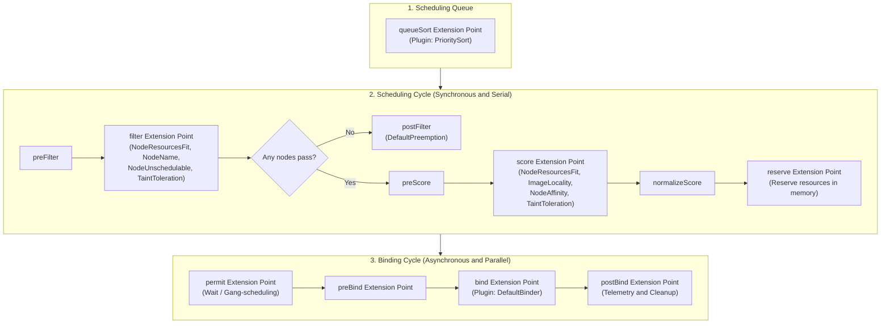
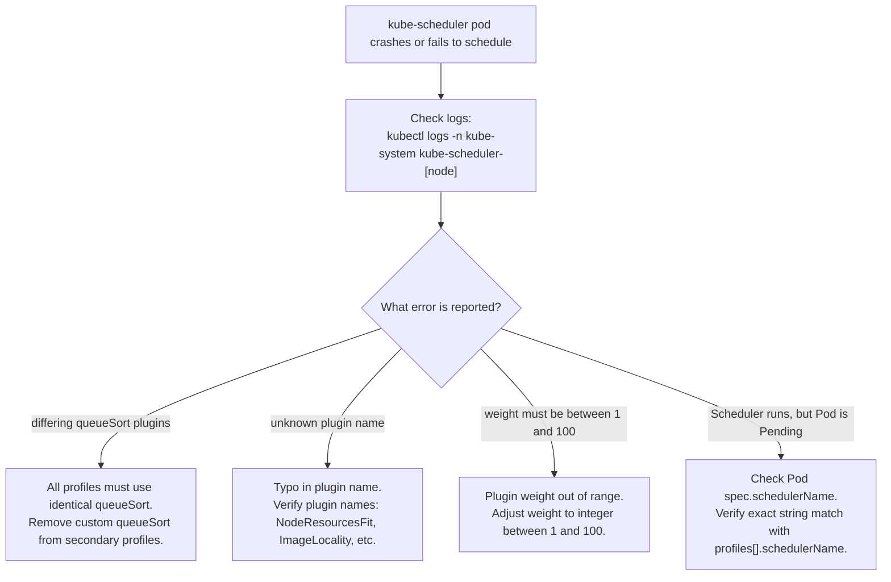

# Kubernetes Scheduler Profiles & Extension Points - CKA Exam Notes

> **Exam Domain**: Scheduling (15%) / Cluster Architecture, Installation & Configuration (25%)  
> **Weight / Importance**: High (Modern architectural standard for customizing scheduling behavior, plugins, and multi-profile routing within a single scheduler process)  
> **Target Version**: Verified against v1.31 / v1.32 (Current CKA Curriculum)  
> **Allowed Docs Search Keywords**: `Scheduler Configuration`, `KubeSchedulerConfiguration`, `scheduling plugins`, `extension points`, `scheduler profiles`  
> **Source**: Generated from `scheduling/11-scheduler-profiles-raw.md`

---

## 1. Quick-Reference Summary

- **The Scheduling Framework Architecture**:
  - A pluggable, extensible architecture within `kube-scheduler` that defines formal **Extension Points** across the scheduling and binding lifecycle.
  - Replaces monolithic, hardcoded scheduling logic with modular plugins.
- **Single Process, Multiple Profiles**:
  - Instead of deploying multiple separate scheduler binaries (which consume extra resources and compete for leader election locks), a **single `kube-scheduler` process** can host multiple independent **Profiles**.
  - Each profile defines a distinct `schedulerName` and customizes which plugins are enabled, disabled, or weighted.
- **Two Distinct Cycles**:
  - **Scheduling Cycle (Synchronous / Serial)**: Selects the optimal node for a Pod (`queueSort` $\rightarrow$ `preFilter` $\rightarrow$ `filter` $\rightarrow$ `postFilter` $\rightarrow$ `preScore` $\rightarrow$ `score` $\rightarrow$ `reserve`). Runs one Pod at a time.
  - **Binding Cycle (Asynchronous / Parallel)**: Executes node binding against the API server (`permit` $\rightarrow$ `preBind` $\rightarrow$ `bind` $\rightarrow$ `postBind`).
- **Core Extension Points**:
  - **`queueSort`**: Sorts pending pods in the priority queue (`PrioritySort`).
  - **`filter`**: Filters out nodes incapable of running the pod (`NodeResourcesFit`, `NodeName`, `NodePorts`, `NodeAffinity`, `TaintToleration`, `NodeUnschedulable`).
  - **`score`**: Scores eligible surviving nodes from 0 to 100 (`NodeResourcesFit`, `ImageLocality`, `NodeAffinity`, `TaintToleration`).
  - **`reserve`**: Reserves node capacity in local memory before committing the bind.
  - **`bind`**: Assigns `spec.nodeName` via the API server (`DefaultBinder`).
- **Critical Configuration Constraints**:
  - **Single `queueSort` Rule**: All profiles in a single `KubeSchedulerConfiguration` file **must use the exact same `queueSort` plugin** (or omit custom queue sort) because there is only one shared scheduling queue.
  - **Wildcard Disabling**: Use `disabled: [{name: "*"}]` to disable all default plugins for an extension point.

---

## 2. Conceptual Overview & Mental Model

### Dual-Layer Architectural Understanding

- **Simple English Explanation (How It Works)**:
  - **The Limitations of Standalone Schedulers**:
    Historically, running different scheduling strategies required deploying multiple separate `kube-scheduler` instances. Each instance required its own system resources, dedicated leader election Lease locks, and independent cache synchronization loops.
    Because two independent schedulers cannot coordinate their in-flight node placements in real time, race conditions occurred where both schedulers attempted to place pods onto the same node simultaneously, leading to placement rejections or resource overcommitment.
  - **The Scheduling Framework Solution**:
    Kubernetes redesigned `kube-scheduler` as a pluggable pipeline with formal stages called **Extension Points**.
    Instead of running separate processes, a single `kube-scheduler` process hosts multiple **Profiles** inside its configuration file.
    When a Pod declares `spec.schedulerName: custom-profile`, the shared scheduler daemon executes that specific profile's custom pipeline.
    All profiles share the **same in-memory node cache** and state machine, eliminating race conditions, saving memory, and removing the need for separate leader election locks.



- **Standard / Production Definition**:
  - **Scheduling Framework**: An in-process, pluggable architecture within `kube-scheduler` that exposes compiled extension points across the pod evaluation pipeline. It allows operators to configure distinct scheduling profiles, selectively enable or disable native plugins, adjust heuristic scoring weights, and integrate out-of-tree plugins while maintaining a unified cluster state cache.

---

## 3. Deep-Dive Technical Breakdown

### 3.1 Extension Points Architecture


The scheduling framework organizes the lifecycle of a Pod into 11 distinct extension points:

| Stage | Extension Point | Execution Mode | Purpose | Built-in Default Plugins |
| :--- | :--- | :--- | :--- | :--- |
| **Queue** | **`queueSort`** | Single-threaded | Orders pending pods in the scheduling queue. | `PrioritySort` |
| **Filter** | **`preFilter`** | Synchronous | Precomputes pod/cluster state for filtering. | `NodeResourcesFit`, `NodePorts` |
| **Filter** | **`filter`** | Synchronous | Excludes nodes that cannot satisfy pod requirements. | `NodeResourcesFit`, `NodeName`, `NodeUnschedulable`, `TaintToleration`, `NodeAffinity`, `NodePorts` |
| **Filter** | **`postFilter`** | Synchronous | Invoked only if no node satisfies the filtering stage. | `DefaultPreemption` |
| **Score** | **`preScore`** | Synchronous | Precomputes state for scoring plugins. | `NodeResourcesFit`, `TaintToleration`, `NodeAffinity` |
| **Score** | **`score`** | Synchronous | Ranks surviving nodes (0–100 score). | `NodeResourcesFit`, `ImageLocality`, `TaintToleration`, `NodeAffinity` |
| **Score** | **`normalizeScore`** | Synchronous | Normalizes plugin outputs before applying weights. | Scoring plugins internal normalization |
| **Reserve** | **`reserve`** | Synchronous | Reserves node capacity in local cache before API bind. | `VolumeBinding` |
| **Permit** | **`permit`** | Asynchronous | Holds or delays pod binding (e.g., gang scheduling). | *None by default* |
| **Bind** | **`preBind`** | Asynchronous | Prepares OS or network prerequisites before binding. | `VolumeBinding` |
| **Bind** | **`bind`** | Asynchronous | Binds Pod to Node via API server (`/binding`). | `DefaultBinder` |
| **Bind** | **`postBind`** | Asynchronous | Clean up state and emit metrics after binding. | *None by default* |

---

### 3.2 Built-in Scheduling Plugins Deep-Dive

Each plugin implements one or more extension point interfaces:

1. **`PrioritySort`** (`queueSort`):
   - Orders the scheduling queue based on `Pod.spec.priority` (descending), followed by creation timestamp.
2. **`NodeResourcesFit`** (`preFilter`, `filter`, `preScore`, `score`):
   - **Filter stage**: Checks if worker node has sufficient free allocatable CPU, memory, and storage for container requests.
   - **Score stage**: Rates nodes based on resource allocation strategies (`LeastAllocated` by default, or `MostAllocated` for bin-packing).
3. **`NodeName`** (`filter`):
   - Checks if the node's name matches `Pod.spec.nodeName`.
4. **`NodeUnschedulable`** (`filter`):
   - Rejects nodes marked with `spec.unschedulable: true` (cordoned nodes).
5. **`TaintToleration`** (`filter`, `preScore`, `score`):
   - **Filter stage**: Excludes nodes with taints that the pod does not tolerate.
   - **Score stage**: Prefers nodes with fewer untolerated preferred taints (`PreferNoSchedule`).
6. **`NodeAffinity`** (`filter`, `score`):
   - Evaluates `requiredDuringSchedulingIgnoredDuringExecution` (filter) and `preferredDuringSchedulingIgnoredDuringExecution` (score).
7. **`ImageLocality`** (`score`):
   - Scores nodes higher if the required container images are already cached locally on the host, reducing image pull latency.
8. **`DefaultBinder`** (`bind`):
   - Submits the `Binding` object to `kube-apiserver`, finalizing the assignment of `spec.nodeName`.

---

### 3.3 Multi-Profile Configuration: `KubeSchedulerConfiguration`


A single `KubeSchedulerConfiguration` manifest can define multiple distinct profiles:

```yaml
apiVersion: kubescheduler.config.k8s.io/v1
kind: KubeSchedulerConfiguration
leaderElection:
  leaderElect: true
  resourceNamespace: kube-system
  resourceName: kube-scheduler
profiles:
  # Profile 1: Default standard scheduler
  - schedulerName: default-scheduler

  # Profile 2: High-throughput scheduler with Scoring disabled
  - schedulerName: fast-no-score-scheduler
    plugins:
      preScore:
        disabled:
          - name: '*'                  # Wildcard disables all default preScore plugins
      score:
        disabled:
          - name: '*'                  # Wildcard disables all default score plugins

  # Profile 3: Specialized batch scheduler with custom plugin weights
  - schedulerName: batch-scheduler
    plugins:
      score:
        disabled:
          - name: TaintToleration      # Disable specific default scoring plugin
        enabled:
          - name: NodeResourcesFit
            weight: 50                 # Heavily prioritize resource fitting (bin-packing)
          - name: ImageLocality
            weight: 10                 # Low priority for local container images
```

---

## 4. Declarative Manifests & Scaffolding Patterns

### Complete Workflow: Configuring and Testing Multi-Profile Schedulers

#### Step 1: Create the Multi-Profile Configuration File
Create the configuration on the control plane node at `/etc/kubernetes/scheduler-profiles-config.yaml`:

```yaml
apiVersion: kubescheduler.config.k8s.io/v1
kind: KubeSchedulerConfiguration
clientConnection:
  kubeconfig: /etc/kubernetes/scheduler.conf
profiles:
  - schedulerName: default-scheduler
  - schedulerName: no-score-scheduler
    plugins:
      preScore:
        disabled:
          - name: '*'
      score:
        disabled:
          - name: '*'
  - schedulerName: locality-priority-scheduler
    plugins:
      score:
        enabled:
          - name: ImageLocality
            weight: 100
```

#### Step 2: Configure the Static Pod or Systemd Service
Update the control-plane `kube-scheduler` static pod manifest (`/etc/kubernetes/manifests/kube-scheduler.yaml`):
```yaml
spec:
  containers:
  - command:
    - kube-scheduler
    - --authentication-kubeconfig=/etc/kubernetes/scheduler.conf
    - --authorization-kubeconfig=/etc/kubernetes/scheduler.conf
    - --config=/etc/kubernetes/scheduler-profiles-config.yaml    # <-- Use custom multi-profile config
    - --kubeconfig=/etc/kubernetes/scheduler.conf
    volumeMounts:
    - mountPath: /etc/kubernetes/scheduler-profiles-config.yaml
      name: scheduler-config
      readOnly: true
  volumes:
  - hostPath:
      path: /etc/kubernetes/scheduler-profiles-config.yaml
      type: File
    name: scheduler-config
```

#### Step 3: Direct Workloads to Specific Profiles
Workloads select their desired profile using `spec.schedulerName`:

```yaml
# Pod targeting the no-score profile
apiVersion: v1
kind: Pod
metadata:
  name: fast-batch-job
spec:
  schedulerName: no-score-scheduler       # Matches Profile 2
  containers:
  - name: worker
    image: busybox
    command: ["sleep", "3600"]
---
# Pod targeting the locality-priority profile
apiVersion: v1
kind: Pod
metadata:
  name: latency-sensitive-web
spec:
  schedulerName: locality-priority-scheduler # Matches Profile 3
  containers:
  - name: web
    image: nginx:alpine
```

---

## 5. Command Translation & Operational Mapping Tables

### Standalone Schedulers vs. Scheduler Profiles Comparison

| Feature / Metric | Legacy Separate Schedulers (Pre-v1.18) | Modern Scheduler Profiles (v1.18+ / v1.31+) |
| :--- | :--- | :--- |
| **Process Count** | Multiple OS processes / Pods | **Single OS process / Pod** |
| **System Resource Footprint** | Multiplied per scheduler ($N \times \text{RAM/CPU}$) | Minimal ($1 \times \text{RAM/CPU}$) |
| **Leader Election Overheads** | Multiple Leases in `kube-system` | **Single Lease** (`kube-scheduler`) |
| **Node Cache Synchronization** | Separate caches; prone to concurrency race conditions | **Single shared in-memory node cache** |
| **Port Conflicts** | Requires distinct `--secure-port` per binary | Single port (default `10259`) |
| **Configuration File** | Separate file per binary | **Single `KubeSchedulerConfiguration`** |
| **Workload Assignment** | `spec.schedulerName: <name>` | `spec.schedulerName: <profile-name>` |

---

## 6. High-Yield CLI & Verification Commands

```bash
# 1. Inspect current scheduler configuration inside running static pod
kubectl get pod -n kube-system -l component=kube-scheduler -o yaml | grep -A 2 -- "--config"

# 2. Check if the scheduler successfully registered all profiles from logs
kubectl logs -n kube-system kube-scheduler-control-plane | grep -i "profile"

# 3. Verify which profile placed a specific pod
kubectl get events -n default --field-selector reason=Scheduled -o wide
# Look for 'From: <profile-name>'

# 4. Filter pods by their assigned schedulerName across all namespaces
kubectl get pods -A -o custom-columns="NAMESPACE:.metadata.namespace,NAME:.metadata.name,SCHEDULER:.spec.schedulerName,NODE:.spec.nodeName"

# 5. Verify API schema and fields for scheduler configuration
kubectl explain KubeSchedulerConfiguration.profiles
kubectl explain KubeSchedulerConfiguration.profiles.plugins
```

---

## 7. Troubleshooting & Diagnostic Runbook

### Decision Tree: Troubleshooting Scheduler Profile Failures



### Step-by-Step Triage Sequence

1. **Scheduler Crash with QueueSort Validation Error**:
   - **Log Message**: `validating scheduler configuration: different queueSort plugins across profiles are not allowed`
   - **Cause**: Profile 1 used `PrioritySort` while Profile 2 configured a custom or conflicting queue sort plugin.
   - **Resolution**: Delete custom `queueSort` sections from secondary profiles. All profiles must share the default `PrioritySort`.
2. **Pod Remains in `Pending` Without Events**:
   - Check the spelling of `spec.schedulerName` on the pod:
     ```bash
     kubectl get pod <pod-name> -o jsonpath='{.spec.schedulerName}'
     ```
   - Compare with the profiles defined in `/etc/kubernetes/scheduler-profiles-config.yaml`.
   - If the name does not match any profile, the scheduler will silently ignore the pod.

---

## 8. CKA Exam Tips, Gotchas & Traps

> [!WARNING]
> **The `queueSort` Profile Limitation**:
> You **cannot** configure different `queueSort` plugins across profiles in the same configuration file. Because `kube-scheduler` maintains a single internal queue for pending pods, all profiles must share the same queue sorting mechanism. Attempting to define differing queueSort plugins causes `kube-scheduler` to crash on startup.

> [!IMPORTANT]
> **Disabling Plugins via Wildcard (`*`)**:
> When an exam task requests creating a profile that *"skips the scoring phase"*, you do not need to list every default scoring plugin manually. Use the wildcard string:
> ```yaml
> score:
>   disabled:
>     - name: '*'
> ```

> [!TIP]
> **Valid Plugin Weights**:
> Plugin weights in the `score` extension point must be positive integers between **1 and 100**. Setting `weight: 0` or `weight: 105` is invalid and will cause configuration parsing to fail.

> [!CAUTION]
> **Static Pod Reload Timing**:
> After editing `/etc/kubernetes/manifests/kube-scheduler.yaml` to point to a new configuration file, Kubelet automatically restarts the static pod. Always monitor `crictl ps` or `kubectl get pod -n kube-system` to ensure the pod returns to `Running` and did not fail due to a YAML syntax error.

---

## 9. Self-Test / Active Recall

1. **What is the primary operational advantage of using Scheduler Profiles over running multiple separate scheduler binaries?**
2. **What are the two major phases of the scheduling framework, and which one runs sequentially per pod?**
3. **At which extension point are nodes with insufficient CPU or memory filtered out?**
4. **At which extension point is the final node score calculated before binding?**
5. **Why does Kubernetes forbid configuring different `queueSort` plugins across different profiles in the same scheduler?**
6. **How do you disable all default plugins for an extension point in a profile without naming each plugin individually?**
7. **What is the valid range of integers for a scoring plugin's `weight` field?**

<details>
<summary>Reveal Answers</summary>

1. Profiles run inside a single `kube-scheduler` process, sharing a single in-memory cluster state cache, saving compute resources, and eliminating leader election lock contention and placement race conditions.
2. The Scheduling Cycle (synchronous and serial per pod) and the Binding Cycle (asynchronous and parallel).
3. The `filter` extension point (handled by the `NodeResourcesFit` plugin).
4. The `score` extension point (followed by `normalizeScore`).
5. Because `kube-scheduler` maintains only one unified scheduling queue for pending pods; all profiles must agree on queue ordering.
6. Specify `disabled: [{name: "*"}]`.
7. Integer values from 1 to 100 inclusive.
</details>

---

### Official Documentation Bookmarks

Allowed for reference during the live exam at [kubernetes.io/docs](https://kubernetes.io/docs/home/):

| Topic | Direct Search Term | Recommended Anchor |
| :--- | :--- | :--- |
| **Scheduler Configuration** | `Scheduler Configuration` | Reference > Config API > KubeSchedulerConfiguration (v1) |
| **Scheduling Framework** | `Scheduling Framework` | Concepts > Scheduling, Preemption and Eviction > Scheduling Framework |
| **Scheduling Profiles** | `Multiple profiles` | Concepts > Scheduling > Scheduling Framework > Multiple profiles |
| **Scheduler Plugins** | `Scheduling Plugins` | Concepts > Scheduling > Scheduling Framework > Extension points |
